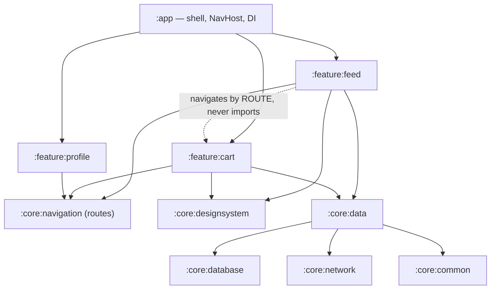
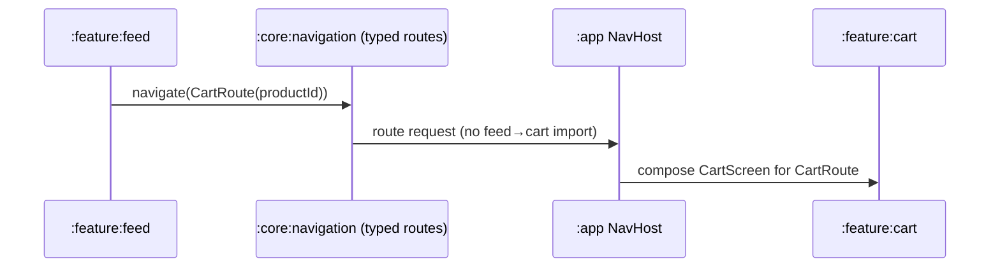

# Lesson 06 — Feature Modularization

> After this lesson you can split an app into `:feature:*` and `:core:*` Gradle modules, enforce architectural boundaries at build time, wire features without depending on each other, and reason about the build-speed and ownership payoffs.

**Module:** 13 · **Lesson:** 06 · **Level:** 🟢🟡🔴 · **Est. time:** 85–105 min

---

## 1. Concept

### 🟢 For beginners — *what is it and why do I care?*

So far we've talked about *layers* (UI, domain, data) — a logical split inside one big `:app` module. That works until the app gets large: one module means every code change recompiles a huge chunk, two teams constantly collide in the same files, and nothing *stops* the profile screen from importing the checkout screen's internals.

**Modularization splits the app into separate Gradle modules — independently buildable units — organized by feature.** Instead of one `:app`, you get:

- `:app` — the thin shell that ties everything together (navigation host, DI setup, `Application`).
- `:feature:cart`, `:feature:profile`, `:feature:feed` — one module per user-facing feature.
- `:core:data`, `:core:network`, `:core:designsystem`, `:core:common` — shared building blocks every feature reuses.

Each module declares what it depends on. The build tool then **enforces** those boundaries: if `:feature:profile` doesn't depend on `:feature:cart`, you literally cannot import cart code there. The architecture stops being a polite suggestion and becomes a compiler rule.

Two everyday wins: **faster builds** (only changed modules and their dependents recompile, and independent modules build in parallel) and **clear ownership** (a team owns `:feature:cart` end to end).

### 🟡 For intermediate devs — *the mechanism*

The conventional Now-in-Android-style structure:

```text
:app                      → DI graph, NavHost, Application; depends on all :feature:*
:feature:feed             → feed UI + ViewModels (depends on :core:* only)
:feature:cart             → cart UI + ViewModels
:core:designsystem        → theme, Material 3 components, icons (Compose)
:core:ui                  → shared composables that aren't domain-specific
:core:domain              → use cases (optional shared)
:core:data                → repositories + their interfaces
:core:database            → Room
:core:network             → Retrofit/Ktor
:core:common              → dispatchers, Result types, utils (no Android)
```

The rules that make it work:

- **Features don't depend on features.** `:feature:cart` and `:feature:profile` never import each other. They communicate through navigation or shared `:core` abstractions.
- **Features depend on `:core`, not the reverse.** `:core` modules know nothing about any feature.
- **`:app` is the only place that knows about everything**, to assemble the navigation graph and DI.
- **Dependency configurations matter:** `api` exposes a dependency transitively to consumers; `implementation` keeps it internal. Defaulting to `implementation` shrinks the compilation classpath and speeds builds.

Modules also enforce the layer rule from Lesson 01 *physically*: make `:core:domain` a `kotlin("jvm")` module and Android types can't even be imported.

### 🔴 For senior devs — *trade-offs, edges, internals*

- **The killer problem: how do features navigate to each other without depending on each other?** If `:feature:feed` needs to open a cart screen, it can't import `:feature:cart` (that reintroduces feature→feature coupling and the whole point collapses). Solutions, roughly in order of weight: (1) **route strings/typed routes in a shared `:core:navigation`** module that both features depend on — feed navigates by route, not by importing cart; (2) **navigation API interface in core**, implemented by `:app`; (3) for fully decoupled plugins, a **runtime registry** of destinations. The first is the pragmatic default with type-safe Navigation; reach for heavier patterns only when teams must ship independently.

- **`api` vs `implementation` is a build-performance lever, not a style choice.** A dependency exposed via `api` leaks onto every consumer's compile classpath; change its ABI and everything downstream recompiles. `implementation` confines it, so changes don't cascade and Gradle can skip unaffected modules. The discipline — default to `implementation`, use `api` only when a type genuinely appears in your public API — is what keeps incremental builds fast in a 50-module app. Getting this wrong silently destroys the build-speed benefit you modularized for.

- **Convention plugins prevent build-script copy-paste rot.** With 40 modules, duplicating the same `android { compileSdk … }`, Compose setup, and Kotlin options in every `build.gradle.kts` is unmaintainable. Extract them into **convention plugins** in a `build-logic` included build (e.g. `myapp.android.feature`, `myapp.android.library.compose`). Each module then applies one plugin line. This is the single biggest maintainability win in large multi-module builds and the standard modern approach.

- **Over-modularization has real costs.** Each module adds build configuration, a DI wiring point, and cross-module indirection; too-fine granularity (a module per screen) yields more overhead than benefit and a tangled graph. The sweet spot is **feature-sized** modules with a handful of `:core` modules. Start coarse; split when build times, ownership boundaries, or a reuse need actually demand it — not preemptively.

- **`internal` visibility now has teeth.** In a single module, `internal` means "visible to the whole app." Split into modules and `internal` means "visible within this module only" — so a feature can expose a small public surface (its screen entry point + nav route) and keep ViewModels, state, and impls `internal`. This is how a module enforces its own encapsulation; design the public surface deliberately.

- **Build-time enforcement beats documentation.** The dependency graph in `build.gradle.kts` *is* the architecture, checked by the compiler on every build. You can go further with Gradle module dependency rules or tools that fail the build on a forbidden edge (e.g. a `:feature` depending on another `:feature`). Documentation drifts; a failing build doesn't.

- **`:sync`/baseline-profile/`:benchmark` and per-variant modules** appear in mature setups, but the core mental model is the (feature × core) grid plus a thin `:app`. Everything else is refinement.

### Analogy

A **shopping mall**. Each **store** (feature module) is self-contained — its own staff, inventory, and storefront. Stores don't cut doors into each other's stockrooms; a customer leaves one store and enters another through the **shared mall corridors** (`:core:navigation`). Shared infrastructure — power, plumbing, security (`:core:*`) — is provided by the mall and used by every store, but no store owns it. The **mall management office** (`:app`) holds the master directory and decides where each store sits. Renovating one store doesn't close the mall; only that store's shutters come down (only that module rebuilds).

### Mental model

> **Features are independent stores that never tunnel into each other; they share `:core` infrastructure and meet only in the `:app` shell and the navigation corridor. The dependency graph is the architecture, enforced by the build.**

### Real-world example

The open-source **Now in Android** app: `:app` plus `:feature:foryou`, `:feature:bookmarks`, `:feature:topic`, etc., over `:core:data`, `:core:database`, `:core:network`, `:core:designsystem`, `:core:common`, wired by `build-logic` convention plugins. Features never depend on each other; navigation routes live in core; `:core:model`/`:core:domain` stay framework-light. It's the canonical reference for this lesson's structure.

---

## 2. Visual Learning

**ASCII — the module dependency graph (arrows = "depends on"):**
```text
                         ┌───────────────┐
                         │     :app      │  NavHost · DI graph · Application
                         └──────┬────────┘
            ┌───────────────────┼────────────────────┐
            ▼                   ▼                    ▼
   ┌────────────────┐  ┌────────────────┐   ┌────────────────┐
   │ :feature:feed  │  │ :feature:cart  │   │:feature:profile│   (features NEVER
   └───────┬────────┘  └───────┬────────┘   └───────┬────────┘    depend on features)
           └──────────┬────────┴───────────┬────────┘
                      ▼                     ▼
            ┌───────────────────┐  ┌───────────────────┐
            │ :core:designsystem│  │   :core:data      │
            │ :core:ui          │  │   :core:domain    │
            │ :core:navigation  │  │   :core:database  │
            └───────────────────┘  │   :core:network   │
                                   │   :core:common    │
                                   └───────────────────┘
   Rule: every arrow points down/inward. No feature→feature arrow exists.
```

**Mermaid — the (feature × core) graph with the navigation rule:**


**Mermaid — cross-feature navigation without coupling (sequence):**


**Illustration prompt (paste into an image generator):**
```text
Illustration: a clean cross-section of a modern two-level shopping mall. Three distinct storefronts
labeled ":feature:feed", ":feature:cart", ":feature:profile", each self-contained with its own shutter.
A shared corridor running between them labeled ":core:navigation". A basement layer of shared
infrastructure pipes labeled ":core:data / :core:network / :core:designsystem / :core:common". A small
management office on top labeled ":app — directory & DI". Show a shopper walking from feed to cart
THROUGH the corridor, with a blocked door directly between the two stores marked with an X. Modern,
vibrant, isometric, clearly labeled.
```

---

## 3. Code

> Gradle is Kotlin DSL (`build.gradle.kts`). Snippets focus on the *boundaries*; routine Android config is elided.

### 🟢 Beginner — declaring a feature module and its dependencies

```kotlin
// settings.gradle.kts — register modules
include(":app")
include(":feature:feed", ":feature:cart")
include(":core:designsystem", ":core:data", ":core:navigation", ":core:common")
```

```kotlin
// :feature:feed/build.gradle.kts
plugins {
    id("com.android.library")
    id("org.jetbrains.kotlin.android")
    id("org.jetbrains.kotlin.plugin.compose")
}

dependencies {
    implementation(project(":core:designsystem"))   // shared UI building blocks
    implementation(project(":core:data"))           // repositories
    implementation(project(":core:navigation"))     // typed routes
    // ❗ No project(":feature:cart") — features never depend on features.
}
```

**Explanation.** `settings.gradle.kts` registers every module; the feature's `build.gradle.kts` declares only `:core` dependencies. The absence of a `:feature:cart` dependency is the boundary — the build won't let feed import cart.

**Common mistakes.**
```kotlin
// ❌ One feature depending on another — reintroduces coupling, defeats modularization.
implementation(project(":feature:cart"))
```

**Best practices.**
- Features depend on `:core:*` only; never on another `:feature:*`.
- Register all modules in `settings.gradle.kts`; keep the names consistent (`:layer:name`).

---

### 🟡 Intermediate — `api` vs `implementation`, and a feature's public entry point

```kotlin
// :core:data/build.gradle.kts — expose the DOMAIN model API, hide Retrofit/Room.
dependencies {
    api(project(":core:model"))            // domain models appear in this module's public API → api
    implementation(project(":core:network")) // Retrofit is an internal detail → implementation
    implementation(project(":core:database")) // Room is internal → implementation
}
```

```kotlin
// :feature:feed — only the entry point is public; everything else is internal.
// FeedScreen.kt
fun NavGraphBuilder.feedScreen(onArticleClick: (String) -> Unit) {   // PUBLIC surface
    composable<FeedRoute> {
        FeedRoute(onArticleClick = onArticleClick)
    }
}

internal class FeedViewModel @Inject constructor(/* ... */) : ViewModel()  // hidden from other modules
internal data class FeedUiState(/* ... */)                                  // hidden
```

**Explanation.** `:core:data` exposes `:core:model` via `api` (domain types appear in repository signatures, so consumers need them) but keeps `:core:network`/`:core:database` as `implementation` (nobody upstream should see Retrofit/Room). The feature exposes exactly one thing — a `NavGraphBuilder.feedScreen(...)` extension — and marks its `ViewModel`/`UiState` `internal`, so other modules can't couple to its internals.

**Common mistakes.**
```kotlin
api(project(":core:network"))     // ❌ leaks Retrofit onto every consumer's classpath → cascading rebuilds
// ❌ public ViewModel/UiState in a feature → other modules can reach in and couple to internals
```

**Best practices.**
- Default to `implementation`; use `api` only when a type is in your **public** API.
- Expose a **minimal public surface** per feature (a nav entry point); keep the rest `internal`.

---

### 🔴 Production — convention plugin + cross-feature navigation via `:core:navigation`

```kotlin
// build-logic/convention/src/main/kotlin/AndroidFeatureConventionPlugin.kt
// One plugin applied by every feature module → no copy-pasted build config.
class AndroidFeatureConventionPlugin : Plugin<Project> {
    override fun apply(target: Project) = with(target) {
        pluginManager.apply("com.android.library")
        pluginManager.apply("org.jetbrains.kotlin.android")
        pluginManager.apply("org.jetbrains.kotlin.plugin.compose")
        pluginManager.apply("com.google.dagger.hilt.android")

        dependencies {
            "implementation"(project(":core:designsystem"))
            "implementation"(project(":core:navigation"))
            "implementation"(project(":core:data"))
            // common test deps, Compose BOM, etc., added once here.
        }
    }
}
```

```kotlin
// :feature:feed/build.gradle.kts becomes one line of intent:
plugins { id("myapp.android.feature") }   // all the above, applied consistently
```

```kotlin
// :core:navigation — typed routes both features depend on (neither imports the other).
@Serializable data class CartRoute(val productId: String)
@Serializable data object FeedRoute

// :feature:feed navigates by ROUTE — it never imports :feature:cart.
@Composable
internal fun FeedRoute(onOpenCart: (productId: String) -> Unit) { /* ... button calls onOpenCart(id) */ }

// :app wires routes to feature screens — the ONLY place that knows both features.
@Composable
fun AppNavHost(navController: NavHostController) {
    NavHost(navController, startDestination = FeedRoute) {
        feedScreen(onOpenCart = { id -> navController.navigate(CartRoute(id)) })
        cartScreen(onCheckout = { navController.navigate(CheckoutRoute) })
    }
}
```

**Explanation.** A **convention plugin** collapses every feature's build config into one `id("myapp.android.feature")` line — change Compose/Hilt setup once, not in 40 files. Cross-feature navigation is solved by putting **typed routes in `:core:navigation`**: `:feature:feed` triggers navigation via an `onOpenCart` lambda and the `CartRoute` type; it never imports `:feature:cart`. Only `:app`'s `NavHost` wires routes to feature screens, so it's the single place that depends on every feature. Type-safe Navigation (serializable routes) gives compile-checked arguments without coupling features.

**Common mistakes.**
```kotlin
// ❌ Feature A importing Feature B's screen to navigate to it — the coupling you modularized to kill.
import com.app.feature.cart.CartScreen
Button(onClick = { /* push CartScreen directly */ })

// ❌ Duplicating compileSdk/Compose/Hilt config in every module's build.gradle.kts instead of a convention plugin.
```
- Putting the route definitions inside a feature (then the *other* feature must depend on it to navigate).

**Best practices.**
- Extract shared build config into **convention plugins** (`build-logic`).
- Keep **routes in `:core:navigation`**; features navigate by route/lambda, `:app` wires the graph.
- Use **type-safe Navigation** for compile-checked args across module boundaries.

---

## 4. Interview Questions

**🟢 Beginner**

1. *What is modularization and why split an app into multiple Gradle modules?*
   > Splitting the app into independently buildable modules, typically by feature (`:feature:*`) plus shared `:core:*`. Benefits: faster incremental and parallel builds, enforced architectural boundaries, and clear team ownership per module.
2. *What's the difference between a `:feature` module and a `:core` module?*
   > A `:feature` module is a user-facing feature (its UI + ViewModels). A `:core` module is shared infrastructure (design system, data, network, common utils) reused by features. Features depend on core; core never depends on features.

**🟡 Intermediate**

3. *What's the difference between `api` and `implementation` for a module dependency, and why does it matter?*
   > `api` exposes the dependency transitively to consumers (it's on their compile classpath); `implementation` keeps it internal to the module. Defaulting to `implementation` shrinks classpaths and prevents ABI changes from cascading rebuilds downstream — a major build-speed factor. Use `api` only when a type is part of your module's public API.
4. *Why must features not depend on other features, and how do they still navigate between each other?*
   > Feature→feature dependencies reintroduce the coupling modularization removes (and cause cyclic-graph and rebuild problems). They navigate via **shared routes in `:core:navigation`** (or a navigation interface), with the `:app` `NavHost` wiring routes to screens — so neither feature imports the other.

**🔴 Senior**

5. *How do you handle cross-feature navigation without creating feature-to-feature coupling? Compare approaches.*
   > Put **typed routes** in a shared `:core:navigation` module; a feature navigates by route (and exposes lambdas like `onOpenCart`), and `:app` maps routes → feature screens. Heavier options: a **navigation API interface** in core implemented by `:app`, or a **runtime destination registry** for fully independent plugin-style features. With type-safe Navigation, shared routes are the pragmatic default; reserve the registry for when teams must deploy modules independently.
6. *What are convention plugins, and what problem do they solve in a large multi-module build?*
   > Gradle plugins (in a `build-logic` included build) that encapsulate shared module configuration — Android/Compose/Kotlin/Hilt setup, common deps — so each module applies one plugin line instead of copy-pasting build scripts. They eliminate config drift across dozens of modules and make global build changes a one-file edit; they're the standard way to keep large modular builds maintainable.

---

## 5. AI Assistant

**Prompt example (planning a module split):**
```text
Propose a Gradle module structure for a Compose app (Kotlin 2.x, type-safe Navigation, Hilt) with
features: feed, cart, profile. Use :app + :feature:* + :core:* (designsystem, navigation, data,
database, network, common, model). Rules: features depend only on :core, NEVER on each other; default
to implementation, api only for public types; routes live in :core:navigation; :app owns the NavHost.
Output settings.gradle.kts, each feature's dependency block, and how feed navigates to cart without
importing it. Also sketch an AndroidFeatureConventionPlugin.
```

**AI workflow.**
- ✅ Good for: drafting `settings.gradle.kts`, per-module dependency blocks, the convention-plugin skeleton, and the typed-route wiring.
- ⚠️ Watch: models frequently add **feature→feature** dependencies "for convenience," default everything to `api`, scatter route definitions inside features, and duplicate build config instead of a convention plugin.

**Review workflow — map to *Common Mistakes*:**
- Any `project(":feature:…")` inside another feature's `build.gradle.kts`? (Must be none.)
- Dependencies default to `implementation`; `api` only for genuinely public types?
- Routes in `:core:navigation`; `:app` the only module depending on all features?
- Shared build config in a **convention plugin**, not copy-pasted; feature internals marked `internal`?

**Validation workflow — prove the boundaries hold:**
1. **Build the graph**: `./gradlew :feature:feed:dependencies` — confirm no `:feature:*` appears.
2. **Try to break it**: add an import of cart code in feed; the build should **fail to compile** (boundary works). Remove it.
3. **Module dependency rules / Konsist**: add a check that fails the build on any `:feature → :feature` edge.
4. **Incremental-build check**: change a `:core:data` `implementation`-only detail; confirm unrelated features are **not** recompiled (proves `implementation` confined the change).

> **AI drafts, you decide.** The graph is the architecture — read the generated `build.gradle.kts` dependency blocks as carefully as the code, and reject any feature→feature edge on sight.

---

## Recap / Key takeaways

- **Modularize by feature:** `:app` (shell) + `:feature:*` (one per feature) + `:core:*` (shared infrastructure).
- **Features never depend on features**; they depend on `:core` and meet only in `:app` and the navigation corridor.
- **`api` vs `implementation`** is a build-speed lever: default to `implementation`; `api` only for public types.
- **Cross-feature navigation** goes through **typed routes in `:core:navigation`** + the `:app` `NavHost` — no feature imports another.
- **Convention plugins** (`build-logic`) kill build-script duplication across many modules.
- The **dependency graph is the architecture**, enforced by the build; `internal` visibility lets each feature keep a tiny public surface.

➡️ Next: **[Lesson 07 — Offline-First](07-offline-first.md)** — make the local database the source of truth and sync safely.
