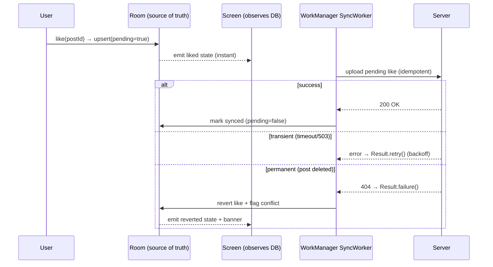
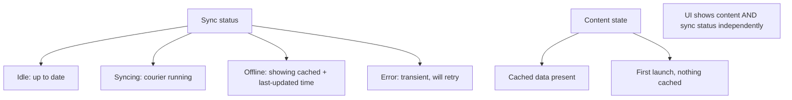

# Lesson 07 — Offline-First

> After this lesson you can make the local database the single source of truth, render instantly from cache, sync in the background with WorkManager, and resolve write conflicts so the app works on a train, a plane, or a flaky 3G connection.

**Module:** 13 · **Lesson:** 07 · **Level:** 🟢🟡🔴 · **Est. time:** 90–110 min

---

## 1. Concept

### 🟢 For beginners — *what is it and why do I care?*

Most apps assume the internet is always there. Then the user goes into the subway, opens your app, and sees a spinner that never resolves — or worse, a crash. **Offline-first flips the default: the app reads from and writes to the *local* device first, and treats the network as a background sync, not a requirement.**

The core idea: the UI never talks to the network directly. It reads from a **local database** (Room). When you open the screen, data appears **instantly** from the cache — no spinner. Meanwhile, the app quietly asks the server "anything new?" and, when the network is available, updates the local database; the screen refreshes automatically because it's watching the database.

Writes work the same way. Like a post offline? The like is saved locally and shown immediately; a background worker pushes it to the server when there's a connection. The user never waits on the network for their own actions.

The result: an app that's **fast** (cache is instant), **resilient** (works with no signal), and **calm** (no spinners blocking every screen).

### 🟡 For intermediate devs — *the mechanism*

Offline-first is the **single-source-of-truth** repository (Lesson 04) taken to its conclusion: **the database is authoritative; the network only feeds it.**

```text
   UI ──observes──▶ Room (Flow)        ← reads ALWAYS come from the local DB
   network ──writes──▶ Room            ← sync updates the DB; the Flow re-emits
   user writes ──▶ Room + outbox       ← local write is instant; queued for upload
   WorkManager ──drains outbox──▶ server  ← background, retried, connectivity-aware
```

The building blocks:

- **Reads:** `dao.observeX(): Flow<…>` — the UI collects this; it never calls the API for display.
- **Refresh (pull):** fetch from the API, write into Room. The observing `Flow` re-emits automatically.
- **Writes (push):** update Room immediately (optimistic), and enqueue the change for upload — often via a **pending-operations / outbox** table.
- **Background sync:** **WorkManager** runs the upload/download with constraints (`NetworkType.CONNECTED`), backoff, and guaranteed execution across process death.

A field like `syncState` or `isPending` on the entity lets the UI show "sending…" without blocking.

### 🔴 For senior devs — *trade-offs, edges, internals*

- **The reader/writer separation is the load-bearing principle.** Reads observe the DB; writes go to the DB then sync. Once the UI never blocks on the network for either, "offline" stops being a special mode — it's just *normal operation with sync pending*. Most offline bugs come from a screen that still calls the API directly somewhere; audit for that first.

- **Optimistic updates need a rollback plan.** Showing the like instantly is great UX, but the server can reject it (post deleted, permission lost). You need to: mark the local row `pending`, attempt the sync, and on **permanent** failure either revert the row or surface a conflict. Without rollback, the local DB silently diverges from the server — the worst kind of bug because everything *looks* fine.

- **Conflict resolution is a product decision, not a default.** When local and remote both changed, strategies are: **last-write-wins** (simple, lossy — newest timestamp/version overwrites), **server-wins / client-wins** (authoritative side dictates), **merge** (field-level or CRDT for collaborative data), or **surface to the user** (let them choose). LWW is the common default; collaborative editors need CRDTs/OT. Pick deliberately and **store a version/updatedAt** so you *can* detect conflicts at all.

- **WorkManager is the right sync engine, with a deliberate contract.** It guarantees execution (survives process death and reboots), honors **constraints** (network, charging, battery-not-low) and **exponential backoff**, and de-duplicates via **unique work** (`ExistingWorkPolicy.KEEP`/`APPEND`). Make the worker **idempotent** — it *will* be retried, so "upload this like" must be safe to run twice (use server-side idempotency keys or check-before-write). Distinguish **`Result.retry()`** (transient: timeout, 503) from **`Result.failure()`** (permanent: 400, 404) so you don't retry a request that can never succeed.

- **Sync metadata: a delta token beats re-downloading everything.** Persist a `lastSyncedAt`/change-cursor and ask the server only for *changes since* that token. Full re-pulls don't scale and waste battery/data. Pair with conditional requests (ETag/`If-Modified-Since`) where the API supports them.

- **Pagination + offline interact subtly.** `RemoteMediator` (Paging 3) is the standard bridge: the network fills Room pages, Paging reads from Room. It coordinates "load more" with the cache so the user can scroll through cached pages offline and fetch new ones when online.

- **Initial empty state vs. offline state are different UIs.** "First launch, no data yet, no network" (truly nothing to show) must read differently from "we have cached data, just can't refresh right now." Model an explicit *sync status* (idle/syncing/error/offline) separate from the content, so the UI can show cached content *and* an unobtrusive "offline — last updated 5m ago" indicator instead of a blocking error.

- **Atomicity and ordering of synced writes.** If a user creates an item then edits it offline, the create must upload before the edit. An **outbox with ordered, dependency-aware draining** (or per-entity sequencing) prevents "edit references an id the server doesn't have yet." This is where naive "just POST each pending row" breaks.

### Analogy

A **bank branch with a night-deposit box**. You don't wait for headquarters to confirm every transaction — the branch (local DB) records your deposit immediately and gives you a receipt (instant UI). Overnight, an armored courier (WorkManager) reconciles the branch's ledger with headquarters when the roads are open (network available), retrying if a road is closed. If two branches recorded conflicting entries for the same account, a reconciliation rule (conflict policy) decides the truth. You transact at branch speed; the network reconciles in the background.

### Mental model

> **The database is the truth the UI trusts; the network is a background courier that reconciles it. Reads observe the DB, writes hit the DB then queue for sync, and conflicts resolve by a rule you chose on purpose.**

### Real-world example

A note-taking app (think Google Keep / Notion offline). Notes live in Room; the editor reads and writes Room, so edits are instant with no signal. Each edit bumps a local `updatedAt` and marks the note `pending`. A WorkManager `SyncWorker` (constraint: network connected) drains pending notes to the server and pulls remote changes since the last cursor; last-write-wins by `updatedAt` resolves conflicts, with a "edited on another device" banner when it detects a clash.

---

## 2. Visual Learning

**ASCII — the offline-first data loop:**
```text
        ┌──────────────────────────── Repository ────────────────────────────┐
        │                                                                     │
   READ │  UI ──collect──▶ dao.observe(): Flow   ◀── always the local DB      │
        │                          ▲                                          │
  WRITE │  user action ─▶ dao.upsert(pending=true)  (instant, optimistic)     │
        │                          │                                          │
        │            ┌─────────────┴───────────── SYNC ──────────────────┐    │
        │   PULL     │  api.changesSince(token) ─▶ dao.apply(...)         │    │
        │   PUSH     │  outbox rows ─▶ api.upload() ─▶ mark synced/revert │    │
        │            └──────────────▲────────────────────────────────────┘    │
        └───────────────────────────┼─────────────────────────────────────────┘
                                     │ runs in
                          ┌──────────┴───────────┐
                          │  WorkManager worker  │  constraint: CONNECTED,
                          │  retry/backoff/unique│  idempotent, survives death
                          └──────────────────────┘
```

**Mermaid — optimistic write + sync + conflict outcome:**


**Mermaid — sync status as an explicit state (mind map):**


**Illustration prompt (paste into an image generator):**
```text
Illustration: a bank branch interior at night. A teller desk labeled "Room (source of truth)" hands a
customer an instant receipt labeled "optimistic UI". A night-deposit box labeled "outbox / pending"
holds queued slips. Outside, an armored courier van labeled "WorkManager" drives a road that lights up
"CONNECTED" when open and shows a barrier when closed (retry/backoff). At headquarters labeled "Server",
a reconciliation desk with a rulebook labeled "conflict policy: last-write-wins". Arrows: customer →
teller (instant), teller → deposit box → courier → HQ (background). Modern, vibrant, clearly labeled,
cinematic night lighting.
```

---

## 3. Code

> Built on the offline-first `ArticleRepository` from Lesson 04 (Room is the source of truth; `@IoDispatcher` injected). Snippets focus on the offline mechanics.

### 🟢 Beginner — read from cache, refresh into it

```kotlin
class ArticleRepositoryImpl @Inject constructor(
    private val api: NewsApi,
    private val dao: ArticleDao,
    @IoDispatcher private val io: CoroutineDispatcher,
) : ArticleRepository {

    // READS always come from Room → instant, works offline.
    override fun observeArticles(): Flow<List<Article>> =
        dao.observeAll().map { it.map(ArticleEntity::toDomain) }.flowOn(io)

    // REFRESH writes into Room; the Flow above re-emits automatically.
    override suspend fun refresh() = withContext(io) {
        val fresh = api.fetchArticles().map(ArticleDto::toEntity)
        dao.replaceAll(fresh)
    }
}
```

**Explanation.** The UI observes Room, so content shows instantly from cache and survives having no signal. `refresh()` only updates the database; because the screen watches that same database, new data appears without any manual push. This is offline-first reads in their simplest form.

**Common mistakes.**
```kotlin
// ❌ UI reads the network directly for display → blank screen / spinner with no signal.
override suspend fun getArticles(): List<Article> = api.fetchArticles().map { it.toDomain() }
```

**Best practices.**
- Display **only** from the local DB; never read the network for rendering.
- Refresh = "update the DB"; let the observing `Flow` propagate.

---

### 🟡 Intermediate — optimistic write with a pending flag

```kotlin
@Entity(tableName = "articles")
data class ArticleEntity(
    @PrimaryKey val id: String,
    val title: String,
    val isBookmarked: Boolean = false,
    val syncState: SyncState = SyncState.SYNCED,   // SYNCED / PENDING / FAILED
)

class BookmarkRepositoryImpl @Inject constructor(
    private val api: NewsApi,
    private val dao: ArticleDao,
    @IoDispatcher private val io: CoroutineDispatcher,
) : BookmarkRepository {

    /** Optimistic: update Room now (UI reflects it instantly), then try to sync. */
    override suspend fun setBookmarked(id: String, bookmarked: Boolean) = withContext(io) {
        dao.setBookmark(id, bookmarked, SyncState.PENDING)      // 1) local write, shown immediately
        runCatching { api.setBookmark(id, bookmarked) }         // 2) attempt upload
            .onSuccess { dao.setSyncState(id, SyncState.SYNCED) }
            .onFailure { dao.setSyncState(id, SyncState.FAILED) } // 3) leave marked for retry
    }
}
```

**Explanation.** The bookmark is written to Room first and marked `PENDING`, so the UI updates instantly without waiting on the network. The upload is attempted; success marks it `SYNCED`, failure marks it `FAILED` (still in the DB, ready to be retried by a background worker). The `syncState` field lets the UI show a subtle "pending" indicator.

**Common mistakes.**
```kotlin
// ❌ Awaiting the network before updating the UI → the user waits on every tap, fails offline.
override suspend fun setBookmarked(id: String, bookmarked: Boolean) {
    api.setBookmark(id, bookmarked)            // blocks; throws with no signal
    dao.setBookmark(id, bookmarked, SyncState.SYNCED)
}
// ❌ No syncState → a failed upload is silently lost; the DB diverges from the server.
```

**Best practices.**
- Write locally **first**, then sync; track a `syncState` so failures are recoverable.
- Don't block the UI on the network for the user's own actions.

---

### 🔴 Production — WorkManager sync, idempotent worker, conflict policy

```kotlin
// Background sync: drains pending writes, pulls remote changes since a cursor. Idempotent + retryable.
@HiltWorker
class SyncWorker @AssistedInject constructor(
    @Assisted appContext: Context,
    @Assisted params: WorkerParameters,
    private val dao: ArticleDao,
    private val api: NewsApi,
    private val syncMeta: SyncMetadataStore,     // persists the last change cursor
) : CoroutineWorker(appContext, params) {

    override suspend fun doWork(): Result {
        return try {
            // PUSH: upload pending writes in order; worker is idempotent (server keys de-dup).
            dao.getPending().forEach { entity ->
                api.setBookmark(entity.id, entity.isBookmarked)    // safe to retry
                dao.setSyncState(entity.id, SyncState.SYNCED)
            }
            // PULL: only changes since last cursor (delta sync, not a full re-download).
            val since = syncMeta.lastCursor()
            val delta = api.changesSince(since)
            delta.changes.forEach { remote -> dao.applyWithConflictPolicy(remote) } // LWW by updatedAt
            syncMeta.setLastCursor(delta.nextCursor)
            Result.success()
        } catch (e: IOException) {
            Result.retry()                       // transient (timeout/connectivity) → backoff & retry
        } catch (e: HttpException) {
            if (e.code() in 500..599) Result.retry() else Result.failure() // 5xx retry; 4xx permanent
        }
    }
}

// Conflict resolution: last-write-wins by version/updatedAt — chosen deliberately for this data.
suspend fun ArticleDao.applyWithConflictPolicy(remote: ArticleDto) {
    val local = findById(remote.id)
    when {
        local == null -> upsert(remote.toEntity())                       // new remote row
        remote.updatedAt > local.updatedAt -> upsert(remote.toEntity())  // remote newer → overwrite
        else -> Unit                                                     // local newer/equal → keep local
    }
}
```

```kotlin
// Schedule periodic + one-off sync with constraints and UNIQUE work (de-duplicated).
object SyncScheduler {
    fun schedule(context: Context) {
        val constraints = Constraints.Builder()
            .setRequiredNetworkType(NetworkType.CONNECTED)
            .build()

        val periodic = PeriodicWorkRequestBuilder<SyncWorker>(15, TimeUnit.MINUTES)
            .setConstraints(constraints)
            .setBackoffCriteria(BackoffPolicy.EXPONENTIAL, 30, TimeUnit.SECONDS)
            .build()

        WorkManager.getInstance(context).enqueueUniquePeriodicWork(
            "article-sync",
            ExistingPeriodicWorkPolicy.KEEP,     // don't stack duplicate sync chains
            periodic,
        )
    }
}
```

**Explanation.** `SyncWorker` runs in the background under WorkManager's guarantees: it **pushes** pending writes (idempotently, so a retry can't double-apply), then **pulls** only changes since a persisted cursor (delta sync). It distinguishes **transient** failures (`IOException`, 5xx → `Result.retry()` with exponential backoff) from **permanent** ones (4xx → `Result.failure()`). Conflicts resolve by **last-write-wins on `updatedAt`** — a deliberate policy, enabled by storing a version on every row. `enqueueUniquePeriodicWork(..., KEEP)` prevents duplicate sync chains. Constraints ensure it only runs with connectivity.

**Common mistakes.**
```kotlin
// ❌ Non-idempotent worker that always returns failure on error → retries double-apply or sync dies.
override suspend fun doWork(): Result {
    api.uploadEverything(dao.getAll())     // re-uploads all rows every run; no de-dup
    return Result.failure()                // even transient errors are treated as permanent
}
// ❌ Full re-download every sync (no cursor) → wastes battery/data, doesn't scale.
// ❌ No conflict policy → last writer to touch Room silently wins, data diverges across devices.
```

**Best practices.**
- Make the sync worker **idempotent**; map transient→`retry()`, permanent→`failure()`.
- **Delta-sync** with a persisted cursor; use **unique work** to de-duplicate.
- Choose a **conflict policy** explicitly and store a `version`/`updatedAt` to detect conflicts.
- Drain the **outbox in dependency order** (create before edit); revert or flag on permanent failure.

---

## 4. Interview Questions

**🟢 Beginner**

1. *What does "offline-first" mean?*
   > The app reads from and writes to the local database first and treats the network as background sync, not a requirement. The UI shows cached data instantly and works without a connection; the server is reconciled in the background.
2. *In an offline-first app, where does the UI get the data it displays?*
   > From the **local database** (e.g. Room) via an observable `Flow` — never directly from the network. The network's job is only to update that database.

**🟡 Intermediate**

3. *What is an optimistic update, and what must you add to make it safe?*
   > Updating local state (and the UI) immediately, before the server confirms, so the user doesn't wait. To make it safe you need a **rollback/conflict plan**: mark the row pending, attempt sync, and on permanent failure revert or flag it — otherwise the local DB silently diverges from the server.
4. *Why use WorkManager for sync instead of a coroutine in a ViewModel?*
   > WorkManager guarantees execution across process death and reboots, honors constraints (network/charging) and exponential backoff, and de-duplicates via unique work. A `viewModelScope` coroutine dies when the screen leaves and can't guarantee the sync ever completes.

**🔴 Senior**

5. *Compare conflict-resolution strategies for offline writes. When would you choose each?*
   > **Last-write-wins** (newest timestamp/version overwrites) — simple, lossy; fine for independent single-user data. **Server-wins/client-wins** — when one side is authoritative. **Field-level merge / CRDTs** — for collaborative or concurrently-edited data where losing edits is unacceptable. **Surface to the user** — when only a human can decide. The prerequisite for *any* detection is storing a `version`/`updatedAt`; choose based on how costly a lost update is and whether edits are concurrent.
6. *What makes a sync worker correct under retries, and how do you handle ordering and failure types?*
   > It must be **idempotent** (a retry can't double-apply — use server idempotency keys or check-before-write), distinguish **transient** failures (timeouts/5xx → `Result.retry()` with backoff) from **permanent** ones (4xx → `Result.failure()` and revert/flag), and drain the **outbox in dependency order** (a create must upload before its edit). Pair with **delta sync** (a persisted cursor) so it doesn't re-download everything, and unique work so chains don't stack.

---

## 5. AI Assistant

**Prompt example (building the sync layer):**
```text
Implement offline-first sync for a Compose app (Kotlin 2.x, Room, Retrofit, Hilt, WorkManager).
- Room is the single source of truth: observeArticles() reads Room; refresh() writes Room.
- Optimistic bookmark write: upsert Room with syncState=PENDING, attempt upload, set SYNCED/FAILED.
- A @HiltWorker SyncWorker that PUSHES pending rows (idempotently) and PULLS changes since a stored
  cursor (delta sync), resolving conflicts by last-write-wins on updatedAt. Map IOException/5xx to
  Result.retry(), 4xx to Result.failure(). Schedule periodic unique work with NetworkType.CONNECTED
  and exponential backoff. Do NOT read the network for display; do NOT re-download everything.
```

**AI workflow.**
- ✅ Good for: the observe/refresh/optimistic-write skeleton, the WorkManager request + constraints, and the worker's push/pull structure.
- ⚠️ Watch: models commonly **block the UI on the network**, omit `syncState`/rollback, write **non-idempotent** workers, return `Result.failure()` for transient errors, skip the **delta cursor** (full re-download), and ignore conflict resolution entirely.

**Review workflow — map to *Common Mistakes*:**
- Does the UI render **only** from Room (no direct network reads)?
- Are writes **optimistic** with a `syncState` and a rollback/flag on permanent failure?
- Is the worker **idempotent**? Transient→`retry()`, permanent→`failure()`?
- **Delta sync** with a persisted cursor; **explicit conflict policy** with a stored `version`/`updatedAt`?
- Unique work + connectivity constraint + backoff; outbox drained in order?

**Validation workflow — prove it works:**
1. **Airplane-mode test**: enable airplane mode, open the app — cached content shows instantly; make a write — it appears immediately and is marked pending.
2. **Reconnect test**: restore network; confirm the WorkManager sync uploads pending writes and pulls deltas, and the UI updates.
3. **Idempotency test**: force the worker to run twice (or kill mid-sync); assert no duplicate server writes and a consistent DB.
4. **Conflict test**: change the same row locally and remotely; assert the chosen policy (e.g. LWW by `updatedAt`) produces the expected winner and any "edited elsewhere" banner.
5. **Failure-type test**: stub a 404 (permanent) and a 503 (transient); assert revert/flag vs. retry-with-backoff respectively.

> **AI drafts, you decide.** Offline-first is where generated "happy path" code is most dangerous — the value is entirely in rollback, idempotency, delta sync, and conflict policy. Review those before trusting a line.

---

## Recap / Key takeaways

- **Offline-first** makes the **local DB the single source of truth**: the UI reads it (instant, works with no signal); the network only feeds it.
- **Reads observe Room**; **writes are optimistic** (local first + `syncState`) and queued for upload — never block the UI on the network.
- **WorkManager** is the sync engine: guaranteed, constraint-aware, backed-off, **idempotent**, with **unique work** to avoid duplicate chains.
- **Delta-sync** with a persisted cursor instead of full re-downloads; map **transient→retry**, **permanent→failure**.
- **Conflict resolution is a deliberate product choice** (LWW / server-wins / merge / CRDT / ask-the-user); store a `version`/`updatedAt` to detect conflicts and an outbox to order dependent writes.
- Model **sync status** separately from content so the UI shows cached data *and* an honest "offline / last updated" state.

This completes Module 13: you can now structure a multi-feature app with inward-pointing dependencies, MVI screens, single-source-of-truth repositories and use cases, build-time module boundaries, and an offline-first sync strategy — the production architecture you'll carry into the capstone (Module 19).

➡️ Next: **[Module 14 — Testing Jetpack Compose](../module-14-testing/README.md)** — prove every layer works with the right tool: state, UI semantics, screenshots, and performance.
