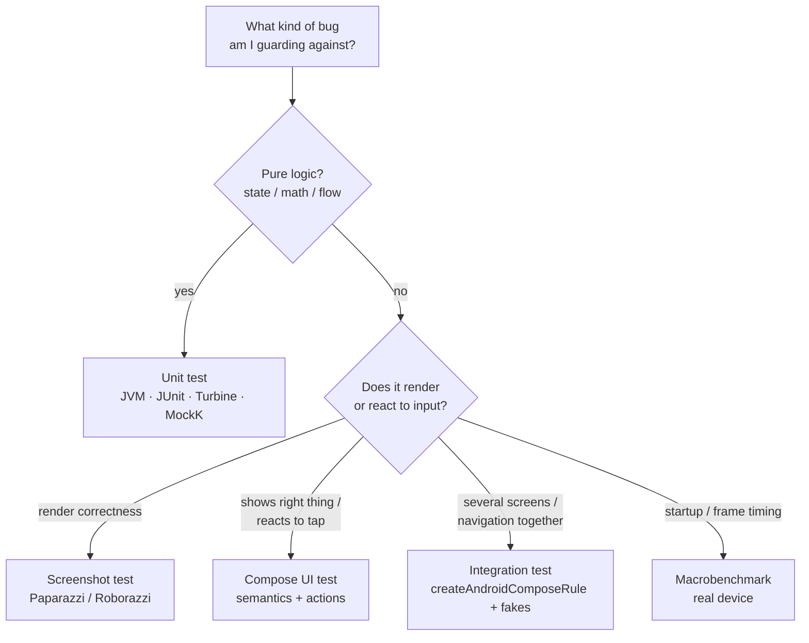

# Lesson 01 — The Testing Pyramid for Compose

> After this lesson you can decide *what to test at which layer* in a Compose app, and explain the cost-vs-confidence trade-off that makes a test suite fast and trustworthy instead of slow and flaky.

**Module:** 14 · **Lesson:** 01 · **Level:** 🟢🟡🔴 · **Est. time:** 60–75 min

---

## 1. Concept

### 🟢 For beginners — *what is it and why do I care?*

A **test** is code that runs your code and checks the answer automatically, so a human doesn't have to click through the app every time. The **testing pyramid** is a picture that tells you *how many* of each kind of test to write.

It has three layers:

- **Unit tests (bottom, the widest):** test one small piece of logic in isolation — a function, a `ViewModel`. They run on your laptop's JVM in milliseconds. Write *lots* of these.
- **Integration / UI tests (middle):** test several pieces working together — a real Composable rendered, a tap, a screen state. Slower, fewer.
- **End-to-end tests (top, the narrowest):** drive the whole app like a user on a device or emulator. Slowest and most brittle. Write *only a few*, for the critical flows.

Why a pyramid and not a square? Because the layers cost wildly different amounts. A unit test is cheap to write, runs in 5 ms, and never flakes. A full UI test boots an emulator, can take seconds, and fails for reasons that have nothing to do with your bug (a slow animation, an ad SDK). So you put your weight at the bottom: **many cheap tests, few expensive ones.**

### 🟡 For intermediate devs — *the mechanism*

In a Compose codebase the pyramid maps onto concrete tooling:

| Layer | Runs on | Tools | What it proves |
|---|---|---|---|
| **Unit** | JVM (`test/`) | JUnit, MockK, Turbine, `kotlinx-coroutines-test` | State logic: a `ViewModel` reduces events into the right `UiState`; a flow emits the right sequence. |
| **Screenshot** | JVM (`test/`) | Paparazzi / Roborazzi | A Composable renders pixel-correct across themes/locales/sizes — without a device. |
| **UI / instrumentation** | Device/emulator (`androidTest/`) | `createComposeRule`, semantics finders | A Composable shows the right things and reacts to clicks/typing through the **semantics tree**. |
| **Integration** | Device/emulator (`androidTest/`) | `createAndroidComposeRule`, navigation test APIs, fakes | Multiple Composables + a `ViewModel` + navigation behave together. |
| **Macrobenchmark / E2E** | Real device | Macrobenchmark, UiAutomator | Startup time, frame timing, and full user journeys meet a budget. |

The single most important split is **`test/` vs `androidTest/`**. Code in `src/test/` runs on your local JVM — fast, no emulator. Code in `src/androidTest/` runs on a device. A huge part of "make tests fast" is *pushing logic down* so it can be tested in `test/` instead of `androidTest/`. Compose's architecture (a `ViewModel` exposing a `StateFlow<UiState>`, stateless composables) is precisely what lets you do that: the *logic* is JVM-testable, and only the *rendering* needs a device — or a screenshot test.

### 🔴 For senior devs — *trade-offs, edges, internals*

The pyramid is a heuristic, not a law. The two failure modes you're really managing are the **ice-cream cone** (top-heavy: mostly slow E2E tests — a CI that takes 40 minutes and flakes weekly) and the **hourglass** (lots of unit + lots of E2E, nothing in the middle — so component contracts go unverified). Modern Compose testing pushes toward a third shape some teams call the **"testing trophy"**: a fat *integration* middle, because Compose makes rendering-a-real-component-with-a-real-ViewModel cheap enough (especially under Robolectric/Roborazzi on the JVM) that integration tests give the best confidence-per-second.

Decisions that separate seniors:

- **Confidence per second is the real metric.** Don't ask "is this a unit or UI test?" Ask "what's the cheapest test that would have caught this bug class?" A `ViewModel` reducer bug → unit test. A "button disabled while loading" bug → semantics test. A "jank on scroll" bug → Macrobenchmark. Coverage percentage is a vanity metric; *which failures you'd catch* is the real one.
- **Robolectric blurs the `test/`/`androidTest/` line.** Roborazzi and Compose-under-Robolectric let you run UI and screenshot tests on the JVM in CI without an emulator — moving "middle of the pyramid" cost down toward "unit" cost. This is why the trophy shape is viable in 2026.
- **Flakiness is a property of the *suite*, not the test.** One nondeterministic E2E test poisons trust in the whole suite — engineers start re-running CI instead of reading failures. Quarantine or delete flaky tests aggressively; a flaky test has *negative* value (it costs attention and teaches people to ignore red).
- **Test behavior, not implementation.** Asserting on the semantics tree ("a node with this text is displayed") survives refactors; asserting on internal call counts or private structure breaks every time you touch the code, producing change-detector tests that punish good refactors.
- **Compose-specific hazard: the idle contract.** Compose UI tests synchronize on an *idling* resource — recomposition, animations, and `withFrameNanos` work. Infinite animations or coroutines that never idle will *hang the test* (more in Lessons 03–04). Test design and production code design are coupled here.

### Analogy

A **car factory's quality control.** You don't road-test every finished car for 500 miles — that's the slow E2E test, and you do a handful. You *do* inspect every weld and every bolt torque as parts come together (unit tests, thousands of them, instant). In between, you bench-test assembled subsystems — the whole braking module on a rig (integration). The cars that reach the road test are already overwhelmingly likely to be fine, because the cheap checks caught the defects first. Inverting that — skipping bolt checks and relying on road tests — is how you ship recalls.

### Mental model

> **Push logic down so it's cheap to test; reserve the slow layers for what only they can prove.** Many fast tests, few slow ones — and measure the suite by *bugs caught per second*, not by line coverage.

### Real-world example

A checkout screen. The *price calculation* (tax, discounts, totals) is dozens of **unit tests** on the `ViewModel` — every edge case, running in under a second total. That the **Pay** button is disabled while a request is in flight is one **semantics UI test**. That tapping **Pay** navigates to confirmation is one **integration test**. That the whole "add to cart → pay → confirm" journey works on a Pixel is one **E2E test**. Four layers, but the *count* per layer drops by an order of magnitude as you climb — that's the pyramid in a shipped app.

---

## 2. Visual Learning

**ASCII — the pyramid with cost & count:**
```text
                  ▲ slower · costlier · flakier · FEWER
                 ╱ ╲
                ╱ E ╲        End-to-end (device): a handful
               ╱─────╲       full user journeys, real device
              ╱  Integ ╲     Integration (device/JVM): some
             ╱──────────╲    screens + ViewModel + nav + fakes
            ╱  UI / Snap  ╲   UI + screenshot: many components
           ╱──────────────╲  semantics + pixels
          ╱   Unit  tests   ╲ Unit (JVM): the most — VM/flows/logic
         ╱──────────────────╲
                  ▼ faster · cheaper · stabler · MORE
```

**Mermaid — choosing where a test goes:**


**Illustration prompt (paste into an image generator):**
```text
Illustration: a clean glass pyramid sliced into four glowing horizontal layers in a modern studio.
Bottom layer (widest, brightest green) is densely packed with hundreds of tiny gear icons labeled "UNIT".
Next layer (yellow) holds fewer phone-screen icons labeled "UI / SCREENSHOT".
Next (orange) holds a few connected-screens icons labeled "INTEGRATION".
Top tip (small, red) holds a single running figure labeled "E2E".
A vertical gauge on the right shows two arrows: "SLOWER & COSTLIER ↑" and "FASTER & CHEAPER ↓".
Caption: "Confidence per second." Modern, vibrant, soft gradients, crisp labels.
```

---

## 3. Code

> The code below is about **structure and setup**, not assertions yet — each later lesson drills one layer. Here you learn *where a test lives* and *what its skeleton looks like* at each tier.

### 🟢 Beginner — a unit test in `src/test/`

```kotlin
// src/test/java/com/example/MathTest.kt  — runs on the JVM, no emulator
import org.junit.Assert.assertEquals
import org.junit.Test

class DiscountTest {
    @Test
    fun `ten percent off 100 is 90`() {
        val result = applyDiscount(price = 100, percent = 10)
        assertEquals(90, result)
    }
}

fun applyDiscount(price: Int, percent: Int): Int =
    price - (price * percent / 100)
```

**Explanation.** This is the widest layer of the pyramid: a plain JUnit test of pure logic. It lives in `src/test/`, so it runs on your laptop's JVM in milliseconds with no Android device involved. No Compose, no emulator — just a function and its expected answer.

**Common mistakes.**
```kotlin
// ❌ Putting a pure-logic test in androidTest/ — needs an emulator for no reason.
// src/androidTest/java/com/example/DiscountTest.kt   <-- wrong source set
@Test fun discount() { /* boots a device to test integer math */ }
```
Pure logic in `androidTest/` pays the full device-boot tax for nothing. If a test doesn't touch the Android framework or render UI, it belongs in `src/test/`.

**Best practices.**
- Default new logic tests to `src/test/`; only move up when you genuinely need a device.
- Name tests as behavior (`` `ten percent off 100 is 90` ``), not as method names (`testDiscount`).

---

### 🟡 Intermediate — the three skeletons side by side

```kotlin
// 1) UNIT — a ViewModel/flow test (src/test/). Detail in Lesson 02.
class CounterViewModelTest {
    @Test fun `increment raises count`() = runTest {       // coroutine test
        val vm = CounterViewModel()
        vm.increment()
        assertEquals(1, vm.count.value)
    }
}

// 2) UI — a Compose semantics test (src/androidTest/). Detail in Lesson 03.
class CounterScreenTest {
    @get:Rule val rule = createComposeRule()               // no Activity needed

    @Test fun `tapping plus shows 1`() {
        rule.setContent { CounterScreen() }
        rule.onNodeWithText("+").performClick()
        rule.onNodeWithText("Count: 1").assertIsDisplayed()
    }
}

// 3) SCREENSHOT — render correctness (src/test/ via Roborazzi). Detail in Lesson 05.
class CounterScreenshotTest {
    @get:Rule val paparazzi = Paparazzi()                  // JVM, no device

    @Test fun `counter at zero`() {
        paparazzi.snapshot { CounterScreen() }             // compares to a golden PNG
    }
}
```

**Explanation.** Same feature, three layers. The unit test checks *logic* with `runTest` and no UI. The UI test renders the real Composable and drives it through **semantics** (`onNodeWithText(...).performClick()`). The screenshot test renders it and compares pixels to a stored "golden" image. Notice the source sets: 1 and 3 can run on the JVM; only 2 needs a device (unless you run it under Robolectric).

**Common mistakes.**
- **Re-testing logic at the UI layer.** Don't write 12 UI tests for 12 discount edge cases — test the math once as units, and the *rendering* once as UI. Climbing the pyramid to re-prove lower-layer logic multiplies cost without adding confidence.
- **One giant test that does everything.** A single `androidTest` that logs in, navigates, computes, and screenshots is slow and tells you nothing precise when it fails.

**Best practices.**
- Map each bug *class* to the cheapest layer that catches it; don't duplicate coverage upward.
- Keep each test asserting **one** behavior so a failure names the cause.

---

### 🔴 Production — a layered test plan as code structure

```kotlin
// A realistic split for ONE feature ("Cart"), expressed as where each file lives.
//
// src/test/  (JVM — fast, the bulk of your suite)
//   CartReducerTest.kt        // every event → next UiState (Lesson 02)
//   CartPricingTest.kt        // tax/discount/total edge cases (pure logic)
//   CartViewModelFlowTest.kt  // StateFlow emissions via Turbine (Lesson 02)
//   CartScreenScreenshotTest.kt // empty / loading / full, light+dark (Lesson 05, Roborazzi)
//
// src/androidTest/  (device — kept deliberately small)
//   CartScreenSemanticsTest.kt  // "Pay" disabled while loading; qty stepper (Lesson 03)
//   CartNavigationTest.kt       // tap item → details, with fakes (Lesson 04)
//
// benchmark module  (real device — a few, gated separately in CI)
//   CartScrollBenchmark.kt      // frame timing while scrolling (Lesson 06)

// The production tell: the SAME bug is only tested ONCE, at its cheapest layer.
// "total is wrong"            → CartPricingTest (unit, ~3 ms)
// "Pay enabled with empty cart"→ CartScreenSemanticsTest (1 UI test)
// "list janks on fling"       → CartScrollBenchmark (1 device benchmark)
```

**Explanation.** This is what a mature suite looks like as a *file layout*. The weight is in `src/test/` (logic + screenshots on the JVM); `androidTest/` holds only what truly needs a device; benchmarks are a separate, separately-gated module so they don't slow the PR pipeline. Each behavior is pinned to exactly one layer — the cheapest one that can fail for that reason. CI runs `test/` on every PR (seconds), `androidTest/` on merge, and benchmarks nightly.

**Common mistakes.**
```kotlin
// ❌ The ice-cream cone: confidence by brute force at the top.
// src/androidTest/
//   CartEverythingE2ETest.kt   // 40 scenarios, boots the app each time, 12 min, flaky
// ...and almost nothing in src/test/.
```
Top-heavy suites are slow, flaky, and — paradoxically — *less* trustworthy, because every red build might be infrastructure noise. People learn to hit "re-run" instead of reading the failure, and real regressions slip through.

**Best practices.**
- Keep the JVM (`test/`) tier the largest; move UI/screenshot work onto the JVM (Robolectric/Roborazzi) wherever possible.
- Gate the slow tiers separately in CI (PR = fast; merge/nightly = device).
- Treat a flaky test as a P1: fix, quarantine, or delete — never leave it to erode trust.
- Test observable behavior (semantics, outputs), not private implementation, so refactors don't trigger false failures.

---

## 4. Interview Questions

**🟢 Beginner**

1. *What are the layers of the testing pyramid, bottom to top?*
   > Unit (most, fast, isolated logic) → integration/UI (fewer, components together) → end-to-end (fewest, slow, whole app on a device). More tests at the bottom, fewer at the top.
2. *Why write more unit tests than end-to-end tests?*
   > Unit tests are far cheaper and faster to run and don't flake, so you get most of your confidence from them; E2E tests are slow and brittle, so you reserve them for a few critical journeys.

**🟡 Intermediate**

3. *In an Android/Compose project, what's the difference between `src/test/` and `src/androidTest/`?*
   > `src/test/` runs on the local JVM (fast, no device) and is for pure logic, ViewModels, flows, and JVM screenshot tests. `src/androidTest/` runs on a device/emulator and is for instrumentation and on-device Compose UI tests. Pushing logic into JVM-testable shapes keeps the suite fast.
4. *Where would you test that a "Submit" button is disabled while a network call is in flight?*
   > As a Compose UI/semantics test: render the screen in the loading state and assert the node `isNotEnabled`. It's about rendered state reacting to UI state, which the unit layer can't prove and the E2E layer is too expensive to prove.

**🔴 Senior**

5. *What's the "ice-cream cone" anti-pattern and why is it dangerous beyond just being slow?*
   > A top-heavy suite (mostly E2E, little unit). Beyond slow CI, it erodes *trust*: flaky high-level tests make every red build ambiguous, so engineers re-run instead of investigating, and real regressions get ignored. A flaky test has negative value.
6. *How does Robolectric/Roborazzi change the classic pyramid for Compose, and what shape do you aim for?*
   > It lets UI and screenshot tests run on the JVM in CI without an emulator, dropping middle-layer cost toward unit-layer cost. That makes a fat *integration* middle affordable — the "testing trophy" — so you can get high confidence-per-second from rendering real components with real ViewModels, rather than relying on expensive on-device E2E.

---

## 5. AI Assistant

**Prompt example (designing the plan, not the tests):**
```text
I have a Compose checkout feature: a CheckoutViewModel exposing StateFlow<CheckoutUiState>,
a stateless CheckoutScreen, and type-safe Navigation to a Confirmation screen.
Propose a layered test plan. For each behavior, tell me the CHEAPEST layer that catches it
(unit in src/test, Compose UI in androidTest, screenshot via Roborazzi, or Macrobenchmark),
and flag any behavior I'm tempted to test at too high a layer. Target: Compose 2026, Kotlin 2.x.
Don't write the tests yet — just the plan as a table.
```

**AI workflow — where it helps on *this* topic.**
- ✅ Great for: turning a feature description into a *layered plan*, listing edge cases you forgot, and suggesting which assertions belong at which layer.
- ⚠️ Not for: deciding your suite's *shape* or CI gating policy blindly — models love to over-index on E2E ("add a full UI test for each case"). Treat its plan as a draft and prune the top of the pyramid.

**Review workflow — check AI output against this lesson's *Common Mistakes*:**
- Did it duplicate the *same* bug class across layers (logic re-tested as UI)? Collapse to one.
- Did it pile behaviors into the slow tiers? Push each down to the cheapest layer that can fail for that reason.
- Did it respect `test/` vs `androidTest/` placement, and put screenshots on the JVM?

**Validation workflow — prove the plan is sound:**
1. Count tests per layer — does the shape look like a pyramid/trophy, not a cone?
2. For each E2E/UI test, ask "what unit test would have caught this instead?" If one exists, demote it.
3. Time the `test/` tier — it should run in seconds; if not, logic is stuck in `androidTest/`.
4. Identify the top 3 *critical journeys*; ensure exactly those (not more) have E2E coverage.

> **AI drafts, you decide.** The model proposes a plan; you enforce *confidence per second* and trim the slow layers it over-suggests.

---

## Recap / Key takeaways

- The **pyramid** = many cheap **unit** tests, fewer **UI/integration**, very few **E2E** — weight at the bottom.
- The real metric is **confidence per second** (bugs caught per cost), not line coverage.
- **`src/test/` (JVM) vs `src/androidTest/` (device)** is the cost lever; push logic down and use Robolectric/Roborazzi to move UI/screenshot tests onto the JVM.
- Avoid the **ice-cream cone**; a flaky test has **negative** value — fix, quarantine, or delete it.
- **Test behavior** (semantics, outputs), not private implementation, so refactors stay green.

➡️ Next: **[Lesson 02 — Unit testing state](02-unit-testing-state.md)** — the widest layer in practice: `ViewModel`s, `StateFlow`, Turbine, MockK, and `runTest`.
