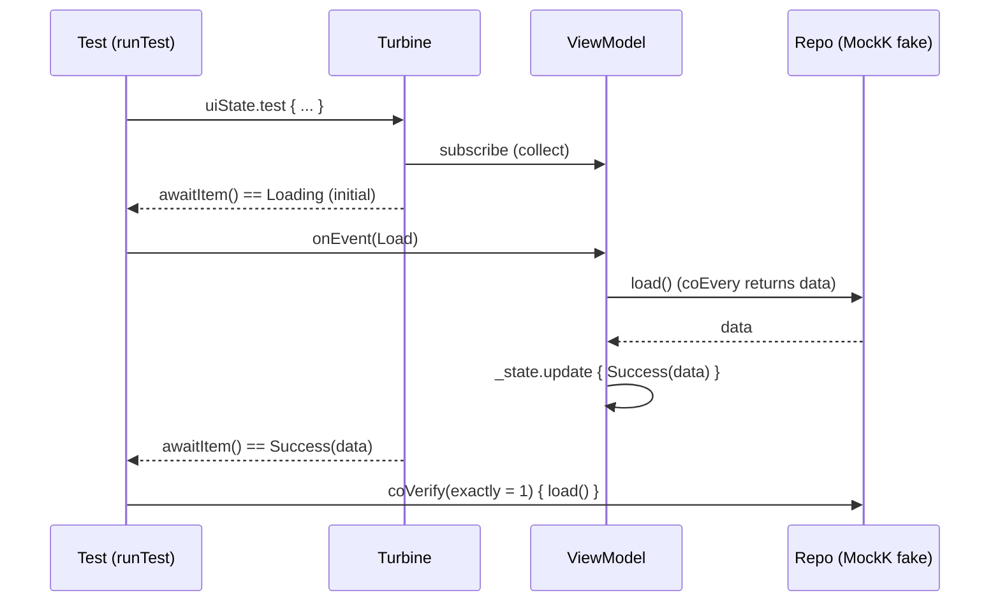

# Lesson 02 — Unit Testing State

> After this lesson you can unit-test a `ViewModel` and its `StateFlow<UiState>` deterministically — driving coroutines with `runTest`, asserting emission *sequences* with Turbine, faking dependencies with MockK, and never depending on real time or threads.

**Module:** 14 · **Lesson:** 02 · **Level:** 🟢🟡🔴 · **Est. time:** 90–110 min

---

## 1. Concept

### 🟢 For beginners — *what is it and why do I care?*

In Compose, most of your *logic* lives in a `ViewModel`: it holds the screen's state and decides how it changes when the user does something. Because that logic is plain Kotlin — no buttons, no pixels — you can test it on your laptop without an emulator. This is the **cheapest, fastest, most valuable** kind of test, the wide base of the pyramid from Lesson 01.

But `ViewModel`s usually do *asynchronous* work: they launch coroutines, call the network, and update state when results come back. Testing async code is tricky because the test could finish *before* the coroutine does, or you'd have to `Thread.sleep` and hope. Kotlin gives us tools so we don't guess:

- **`runTest`** runs coroutines on a *virtual clock* you control — no real waiting, fully deterministic.
- **Turbine** lets you assert the *sequence* a `Flow` emits (e.g. *loading → success*), one item at a time.
- **MockK** gives you fake versions of dependencies (a repository) so the test doesn't hit a real server.

With these, a test that exercises a loading spinner and a network result runs in a few milliseconds, every time, the same way.

### 🟡 For intermediate devs — *the mechanism*

The standard 2026 shape: a `ViewModel` exposes `val uiState: StateFlow<UiState>`, and you test the *transitions* it produces in response to events.

**Coroutines under test.** `runTest` provides a `TestScope` backed by a `TestDispatcher`. Two flavors matter:
- `StandardTestDispatcher` (the `runTest` default) **queues** coroutines; they don't run until you `advanceUntilIdle()` or `runCurrent()`. Good for asserting intermediate states (you can check "loading" *before* letting the result arrive).
- `UnconfinedTestDispatcher` runs new coroutines **eagerly** up to their first suspension. Convenient when you only care about the final state.

**The injected-dispatcher rule.** Your `ViewModel` must not hardcode `Dispatchers.IO`/`Main` for work you want to control. Inject a `CoroutineDispatcher` (default `Dispatchers.IO` in production, a `TestDispatcher` in tests). For the *main* dispatcher used by `viewModelScope`, swap it globally with a JUnit rule that calls `Dispatchers.setMain(testDispatcher)`.

**`StateFlow` is conflated and always-has-a-value.** It drops intermediate values if a collector is slow, and a new collector immediately gets the *current* value. So asserting "I saw exactly loading then success" is unreliable with naive collection — use **Turbine**, which collects eagerly into a buffer:

```kotlin
viewModel.uiState.test {
    assertEquals(UiState.Loading, awaitItem())
    assertEquals(UiState.Success(data), awaitItem())
    cancelAndConsumeRemainingEvents()
}
```

**MockK** replaces the repository: `coEvery { repo.load() } returns data` for happy paths, `throws IOException()` for failures, and `coVerify { repo.load() }` to confirm an interaction. Because the dependency is fake and deterministic, the test is about *your* logic only.

### 🔴 For senior devs — *trade-offs, edges, internals*

The subtleties that make state tests trustworthy at scale:

- **The `Dispatchers.setMain` rule is mandatory, not optional.** `viewModelScope` uses `Dispatchers.Main`, which throws on a JVM unit test (no Android main looper). A `MainDispatcherRule` that sets it to a `TestDispatcher` in `@Before` and calls `resetMain()` in `@After` is the single most common piece of test infra. Forgetting `resetMain()` leaks the test dispatcher into later tests — a classic source of cross-test flakiness.
- **`StateFlow` conflation hides emissions.** If your `ViewModel` does `_state.update { Loading }` then immediately `_state.update { Success }` synchronously, a `StateFlow` may *never expose* `Loading` to a collector that started after both — there's no buffer. Turbine started *before* the action captures it; a `LaunchedEffect`-style late collector won't. Know which emissions are *observable* vs *transient*; assert only the observable ones, or restructure to make the intermediate state genuinely emitted (e.g. yield between updates).
- **`StateFlow` with `WhileSubscribed` won't run without a collector.** If you build state with `stateIn(scope, SharingStarted.WhileSubscribed(5000), initial)`, the upstream flow is *cold until collected*. In a test you must actually collect (Turbine does) or the producer never starts and you'll assert against only the `initial` value. `SharingStarted.Eagerly`/`Lazily` behave differently — match the test to the sharing policy.
- **Virtual time vs `runBlocking`.** `runTest` skips delays via virtual time; `delay(10_000)` completes instantly when you `advanceUntilIdle()`. Never use `runBlocking` + real `delay` in tests — it makes the suite slow and reintroduces races. Use `advanceTimeBy`/`advanceUntilIdle` to *control* time precisely (e.g. testing debounce).
- **`coVerify(exactly = n)` and ordering catch real bugs.** Verifying a repository is called *once* (not twice on a double-tap) or that a cache is read *before* the network are behaviors unit tests can pin that UI tests can't see. But over-verifying (asserting every internal call) creates change-detector tests — verify *contracts*, not *implementation*.
- **Relaxed mocks vs strict.** `mockk(relaxed = true)` returns defaults for un-stubbed calls — convenient but can hide that you forgot to stub something important. Prefer strict mocks for dependencies whose every interaction matters; use `relaxed` for noisy collaborators (loggers).
- **`SavedStateHandle` is testable directly.** Construct `SavedStateHandle(mapOf("id" to 42))` to test restoration/`init` logic without instrumentation — important for process-death behavior that's otherwise expensive to verify on a device.

### Analogy

Testing a `ViewModel` is **rehearsing a play on a soundstage with a director's clock.** The actors (coroutines) only move when the director (you, via `advanceUntilIdle`) calls action — no waiting for "real" time. The other characters are stand-ins (MockK fakes) who say exactly the lines you scripted (`coEvery { ... } returns ...`). And a stenographer (Turbine) writes down *every* line in order, so you can prove the scene played out *loading → success* and not some other way. Nothing is left to chance or to the wall clock.

### Mental model

> **Make time and dependencies fake so the only variable is your logic.** Control the clock with `runTest`, control collaborators with MockK, and read the emission sequence with Turbine — then a state test is fast, deterministic, and about behavior alone.

### Real-world example

A search screen with debounce. The `ViewModel` waits 300 ms after the last keystroke, then queries a repository. A unit test types "ab", advances virtual time by 100 ms (asserts *no* query yet), types "c", advances 300 ms, and asserts exactly **one** query for "abc" — proving the debounce works without a single real millisecond elapsing. Turbine confirms the `UiState` went *idle → loading → results*; `coVerify(exactly = 1)` confirms there was no wasted call. This is a textbook state test, and it would be slow and flaky if attempted on a device.

---

## 2. Visual Learning

**ASCII — the unit-test rig around a ViewModel:**
```text
            ┌──────────────── runTest (virtual clock) ────────────────┐
            │                                                         │
   MockK ──▶│  repo (fake)        ViewModel              Turbine      │──▶ assert
  coEvery   │   load() ──returns──▶ viewModelScope.launch │           │   awaitItem()
  /throws   │                        _state.update{...}   │ collects  │   == Loading
            │                          │                  │ in order  │   == Success
            │  Dispatchers.setMain(testDispatcher)  ◀── MainDispatcherRule
            └─────────────────────────────────────────────────────────┘
                 advanceUntilIdle()  ⟶  let queued coroutines finish
```

**Mermaid — assertion timeline for a load:**


**Illustration prompt (paste into an image generator):**
```text
Illustration: a film soundstage representing a unit test. Center: a robot actor labeled "ViewModel"
on a marked stage. To the left, a director's chair with a large dial labeled "VIRTUAL CLOCK (runTest)"
and a hand turning it. Stand-in actors wear clapperboards reading "MockK fake: returns data".
On the right, a stenographer machine labeled "Turbine" printing a paper tape that reads
"Loading → Success" in order. A clear glass wall separates the stage from a greyed-out
"real network / real time" outside, crossed out. Modern, vibrant, clean labels, soft studio light.
```

---

## 3. Code

> Assumes a `ViewModel` exposing `StateFlow<UiState>` and a repository interface. Dependencies for these tests: `kotlinx-coroutines-test`, `app.cash.turbine:turbine`, `io.mockk:mockk`, JUnit.

### 🟢 Beginner — a synchronous reducer test (no async yet)

```kotlin
// Production
class CounterViewModel : ViewModel() {
    private val _count = MutableStateFlow(0)
    val count: StateFlow<Int> = _count.asStateFlow()
    fun increment() = _count.update { it + 1 }
}

// Test — src/test/
import kotlinx.coroutines.test.runTest
import org.junit.Assert.assertEquals
import org.junit.Test

class CounterViewModelTest {
    @Test fun `increment raises count by one`() = runTest {
        val vm = CounterViewModel()
        assertEquals(0, vm.count.value)   // initial
        vm.increment()
        assertEquals(1, vm.count.value)   // after event
    }
}
```

**Explanation.** The simplest state test: create the `ViewModel`, send an event, assert the new value. `runTest` wraps it (good habit even when nothing suspends yet). Reading `count.value` is fine here because the update is synchronous and we only care about the final value.

**Common mistakes.**
```kotlin
// ❌ Using runBlocking with real delays — slow and flaky.
@Test fun bad() = runBlocking {
    vm.startLongJob()
    Thread.sleep(2000)          // hoping the coroutine finished
    assertEquals(expected, vm.count.value)
}
```
`Thread.sleep` is a guess: too short and you race the coroutine, too long and your suite crawls. Use `runTest` + virtual time instead.

**Best practices.**
- Wrap coroutine-touching tests in `runTest`, not `runBlocking`.
- Assert the initial value *and* the post-event value, so the test documents the transition.

---

### 🟡 Intermediate — async load with a fake repo, asserted via Turbine

```kotlin
// Production
sealed interface NewsUiState {
    data object Loading : NewsUiState
    data class Success(val items: List<Article>) : NewsUiState
    data class Error(val message: String) : NewsUiState
}

class NewsViewModel(
    private val repo: NewsRepository,
    private val io: CoroutineDispatcher = Dispatchers.IO,   // injected for testability
) : ViewModel() {
    private val _state = MutableStateFlow<NewsUiState>(NewsUiState.Loading)
    val state: StateFlow<NewsUiState> = _state.asStateFlow()

    fun load() = viewModelScope.launch(io) {
        _state.update { NewsUiState.Loading }
        runCatching { repo.latest() }
            .onSuccess { items -> _state.update { NewsUiState.Success(items) } }
            .onFailure { e -> _state.update { NewsUiState.Error(e.message ?: "Unknown") } }
    }
}
```

```kotlin
// Test — src/test/
@OptIn(ExperimentalCoroutinesApi::class)
class NewsViewModelTest {
    @get:Rule val mainRule = MainDispatcherRule()          // sets Dispatchers.Main = test dispatcher

    private val repo = mockk<NewsRepository>()

    @Test fun `load emits Loading then Success`() = runTest {
        val articles = listOf(Article("1", "Hello"))
        coEvery { repo.latest() } returns articles          // fake the happy path

        val vm = NewsViewModel(repo, io = StandardTestDispatcher(testScheduler))

        vm.state.test {
            assertEquals(NewsUiState.Loading, awaitItem())  // initial value
            vm.load()
            assertEquals(NewsUiState.Success(articles), awaitItem())
            cancelAndConsumeRemainingEvents()
        }
        coVerify(exactly = 1) { repo.latest() }             // called once, no double-fetch
    }

    @Test fun `load emits Error on failure`() = runTest {
        coEvery { repo.latest() } throws IOException("offline")

        val vm = NewsViewModel(repo, io = StandardTestDispatcher(testScheduler))

        vm.state.test {
            assertEquals(NewsUiState.Loading, awaitItem())
            vm.load()
            val emission = awaitItem()
            assertTrue(emission is NewsUiState.Error)
            cancelAndConsumeRemainingEvents()
        }
    }
}
```

```kotlin
// MainDispatcherRule — the reusable piece every project has (src/test/).
@OptIn(ExperimentalCoroutinesApi::class)
class MainDispatcherRule(
    private val dispatcher: TestDispatcher = UnconfinedTestDispatcher(),
) : TestWatcher() {
    override fun starting(description: Description) = Dispatchers.setMain(dispatcher)
    override fun finished(description: Description) = Dispatchers.resetMain()
}
```

**Explanation.** The repository is a MockK fake — `coEvery { ... } returns/throws` scripts the happy and sad paths. The dispatcher is injected so virtual time controls the launched coroutine. **Turbine** (`state.test { ... }`) collects eagerly and lets us assert the exact sequence *Loading → Success*. `coVerify(exactly = 1)` proves the network was hit once. The `MainDispatcherRule` redirects `viewModelScope`'s `Dispatchers.Main` to the test dispatcher and resets it afterward.

**Common mistakes.**
```kotlin
// ❌ No MainDispatcherRule → "Module with the Main dispatcher had failed to initialize".
val vm = NewsViewModel(repo)         // viewModelScope uses Dispatchers.Main → throws on JVM

// ❌ Collecting StateFlow naively and missing Loading (conflation).
vm.load()
assertEquals(NewsUiState.Loading, vm.state.value)  // may already be Success → flaky
```
Without the rule, `viewModelScope` can't initialize on the JVM. And reading `state.value` after the work may have *already conflated* past `Loading` — Turbine, subscribed *before* the action, is what reliably captures intermediate emissions.

**Best practices.**
- Always install a `MainDispatcherRule`; inject dispatchers rather than hardcoding `Dispatchers.IO`.
- Use Turbine for *sequence* assertions; `state.value` only for a single final value.
- Verify interaction *counts* (`exactly = 1`) where double-calls would be a real bug.

---

### 🔴 Production — debounce with controlled virtual time + `SavedStateHandle`

```kotlin
// Production — debounced search restored from SavedStateHandle.
class SearchViewModel(
    private val repo: SearchRepository,
    private val handle: SavedStateHandle,
) : ViewModel() {

    private val query = MutableStateFlow(handle.get<String>(KEY) ?: "")

    val state: StateFlow<SearchUiState> =
        query
            .onEach { handle[KEY] = it }                 // persist for process death
            .debounce(300)                               // wait for typing to settle
            .distinctUntilChanged()
            .mapLatest { q ->
                if (q.isBlank()) SearchUiState.Idle
                else SearchUiState.Results(repo.search(q))
            }
            .stateIn(
                scope = viewModelScope,
                started = SharingStarted.WhileSubscribed(5_000),
                initialValue = SearchUiState.Idle,
            )

    fun onQueryChange(q: String) { query.value = q }

    companion object { const val KEY = "query" }
}
```

```kotlin
// Test — src/test/  (precise virtual-time control + sharing-policy awareness)
@OptIn(ExperimentalCoroutinesApi::class)
class SearchViewModelTest {
    @get:Rule val mainRule = MainDispatcherRule(StandardTestDispatcher())

    private val repo = mockk<SearchRepository>()

    @Test fun `debounce issues exactly one search for the final query`() = runTest {
        coEvery { repo.search("abc") } returns listOf(Article("1", "A"))

        val vm = SearchViewModel(repo, SavedStateHandle())

        vm.state.test {                                  // MUST collect — WhileSubscribed is cold
            assertEquals(SearchUiState.Idle, awaitItem())

            vm.onQueryChange("a")
            vm.onQueryChange("ab")
            advanceTimeBy(100)                           // still within debounce window
            expectNoEvents()                             // no search yet — proves debounce holds

            vm.onQueryChange("abc")
            advanceTimeBy(300)                           // window elapses for "abc"
            assertEquals(SearchUiState.Results(listOf(Article("1", "A"))), awaitItem())

            cancelAndConsumeRemainingEvents()
        }
        coVerify(exactly = 1) { repo.search(any()) }     // intermediate queries never fired
        coVerify(exactly = 0) { repo.search("a") }
        coVerify(exactly = 0) { repo.search("ab") }
    }

    @Test fun `state restores the query from SavedStateHandle`() = runTest {
        val handle = SavedStateHandle(mapOf(SearchViewModel.KEY to "kotlin"))
        coEvery { repo.search("kotlin") } returns emptyList()

        val vm = SearchViewModel(repo, handle)

        vm.state.test {
            // First real emission after debounce is for the restored query.
            advanceUntilIdle()
            val item = awaitItem()
            assertTrue(item is SearchUiState.Results)
            cancelAndConsumeRemainingEvents()
        }
        coVerify { repo.search("kotlin") }
    }
}
```

**Explanation.** This pins *temporal* behavior that's nearly impossible to test on a device reliably. `StandardTestDispatcher` queues work so we can `advanceTimeBy(100)` and assert `expectNoEvents()` — proving the debounce *holds* — then `advanceTimeBy(300)` to release exactly one search. `coVerify(exactly = 0)` for the intermediate queries proves no wasted network calls. The second test constructs a populated `SavedStateHandle` to verify process-death restoration in pure JVM code. Crucially, because state uses `WhileSubscribed`, the test **must** collect (Turbine does) or the upstream never runs.

**Common mistakes.**
```kotlin
// ❌ Forgetting WhileSubscribed is cold — asserting without a collector.
val vm = SearchViewModel(repo, SavedStateHandle())
vm.onQueryChange("abc")
advanceUntilIdle()
assertEquals(expected, vm.state.value)   // never ran upstream → still Idle → fails confusingly

// ❌ Using UnconfinedTestDispatcher then trying to observe the "no search yet" window.
// Unconfined runs eagerly to first suspension, so debounce timing can't be inspected mid-window.
```
`WhileSubscribed` state is lazy; without a collector the flow that calls `repo.search` never starts. And to *observe an intermediate window* (debounce not yet fired), you need `StandardTestDispatcher`'s queued execution, not `Unconfined`'s eager one.

**Best practices.**
- Match the test dispatcher to the assertion: `Standard` to inspect intermediate states/timing; `Unconfined` when only the final state matters.
- For `WhileSubscribed`/`stateIn` flows, always collect in the test (Turbine) so the producer runs.
- Use `advanceTimeBy`/`advanceUntilIdle` to make time-based logic (debounce, throttle, retry backoff) deterministic.
- Test `SavedStateHandle` restoration directly on the JVM instead of on a device.

---

## 4. Interview Questions

**🟢 Beginner**

1. *Why can you unit-test a Compose `ViewModel` without an emulator?*
   > Because a `ViewModel` is plain Kotlin — it holds state and logic, not UI. Its behavior (events → state) can be exercised on the JVM in `src/test/`, which is fast and needs no device.
2. *What does `runTest` give you over `runBlocking` in a coroutine test?*
   > A virtual clock and test scheduler: delays are skipped, coroutines are controllable, and the test is deterministic. `runBlocking` uses real time, which is slow and race-prone.

**🟡 Intermediate**

3. *What is the `MainDispatcherRule` and why is it needed?*
   > `viewModelScope` uses `Dispatchers.Main`, which isn't available on the JVM and throws. The rule calls `Dispatchers.setMain(testDispatcher)` before each test and `resetMain()` after, so the ViewModel's coroutines run on a controllable test dispatcher and don't leak between tests.
4. *Why use Turbine to assert `StateFlow` emissions instead of reading `.value`?*
   > `StateFlow` is conflated and only holds the latest value, so intermediate emissions (like `Loading`) can be missed by a late or naive reader. Turbine subscribes eagerly and buffers, letting you assert the exact ordered sequence with `awaitItem()`.

**🔴 Senior**

5. *Your test for a `stateIn(..., WhileSubscribed())` flow only ever sees the initial value. Why, and how do you fix it?*
   > `WhileSubscribed` makes the upstream cold — it doesn't run without an active collector, so the producer (and any `repo` call) never starts. Fix it by actually collecting in the test (e.g. `flow.test { }` with Turbine), which starts the sharing and drives emissions.
6. *How would you deterministically test a 300 ms debounce, including proving it does NOT fire early?*
   > Use `runTest` with a `StandardTestDispatcher` so coroutines queue. Send inputs, `advanceTimeBy(<300)` and assert `expectNoEvents()` (debounce holds), then `advanceTimeBy(300)` and assert the single emission. Add `coVerify(exactly = 1)` for the final query and `exactly = 0` for intermediate ones — all in virtual time, no real waiting.

---

## 5. AI Assistant

**Prompt example (generating tests for a ViewModel):**
```text
Write JUnit unit tests (src/test) for this ViewModel. Stack: kotlinx-coroutines-test (runTest),
Turbine for StateFlow assertions, MockK for the repository. Include a MainDispatcherRule.
Cover: (1) Loading→Success happy path, (2) Loading→Error on an IOException, (3) exactly-once
repository call. Inject the dispatcher (don't hardcode Dispatchers.IO). Target Kotlin 2.x, Compose 2026.
[paste ViewModel + repository interface]
```

**AI workflow.**
- ✅ Good for: scaffolding the test class, the `MainDispatcherRule`, MockK `coEvery`/`coVerify` stubs, and enumerating happy/sad/edge cases you might forget.
- ⚠️ Watch: models frequently **omit the MainDispatcherRule**, **read `state.value` instead of Turbine** (missing intermediate states), **hardcode `Dispatchers.IO`**, use `runBlocking`/`Thread.sleep`, and forget that `WhileSubscribed` flows need an active collector.

**Review workflow — map to this lesson's *Common Mistakes*:**
- Is there a `MainDispatcherRule` (or equivalent) and is the dispatcher *injected*?
- Are emission *sequences* asserted with Turbine, not single `.value` reads?
- For `stateIn(WhileSubscribed)` flows, does the test actually collect?
- Are interaction counts verified (`exactly = 1`) where a double-call would be a bug?
- No `runBlocking`/`Thread.sleep`/real delays?

**Validation workflow — prove the tests are real:**
1. Run them — they should pass in milliseconds, not seconds.
2. Temporarily break the production logic (e.g. drop the `Loading` emission); a *good* test should now fail. If it still passes, it isn't asserting what you think.
3. Run the file 50× (`--rerun-tasks` or IDE repeat) to flush nondeterminism; a state test must be 100% stable.
4. Check no test references real time, real network, or `Dispatchers.Main` directly.

> **AI drafts, you decide.** The model writes the cases; you enforce the test *infrastructure* (main dispatcher, injected dispatchers, Turbine) it routinely skips.

---

## Recap / Key takeaways

- `ViewModel` logic is **JVM-testable** — the cheapest, highest-value layer; keep it there.
- **`runTest` + a `TestDispatcher`** give you a virtual clock; never `runBlocking`/`Thread.sleep`.
- A **`MainDispatcherRule`** (`setMain`/`resetMain`) is mandatory for `viewModelScope`; **inject** dispatchers.
- **Turbine** asserts emission *sequences* (`StateFlow` is conflated, so `.value` can miss states).
- **MockK** fakes dependencies; `coVerify(exactly = n)` pins interaction contracts.
- `stateIn(WhileSubscribed)` is **cold** — collect in the test or the producer never runs; test `SavedStateHandle` directly.

➡️ Next: **[Lesson 03 — Compose UI testing](03-compose-ui-testing.md)** — render real composables and drive them through the **semantics tree** with `createComposeRule`, finders, and actions.
