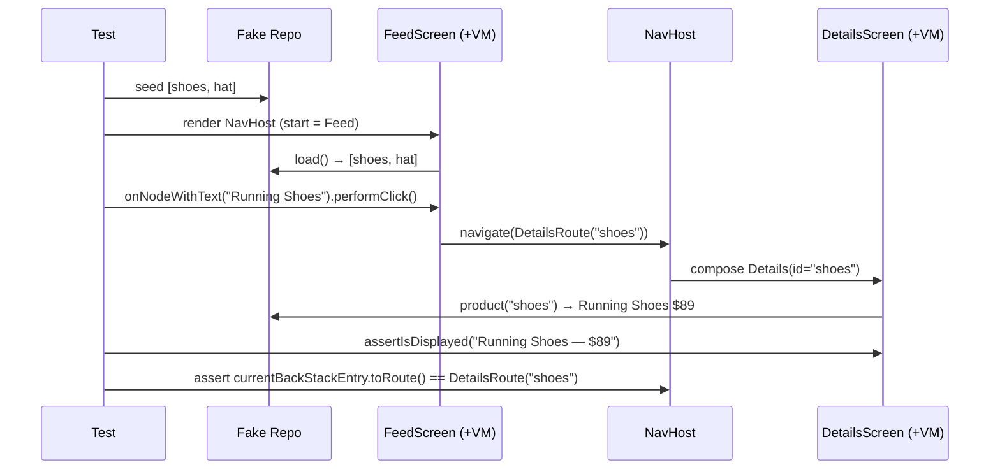

# Lesson 04 — Integration Testing

> After this lesson you can test multiple pieces working together — navigation, a real `ViewModel`, and fake repositories — so a whole *flow* (tap an item → land on its details) is verified end-to-end through Compose, with deterministic test doubles instead of a live backend.

**Module:** 14 · **Lesson:** 04 · **Level:** 🟢🟡🔴 · **Est. time:** 90–110 min

---

## 1. Concept

### 🟢 For beginners — *what is it and why do I care?*

Unit tests check one piece (Lesson 02). UI tests check one screen reacts to input (Lesson 03). An **integration test** checks that *several pieces work together*: you tap an item on a list screen, the app navigates to a details screen, and the right data shows up there. It's the middle of the pyramid — closer to what a user actually does, but still automated.

Why test the seams? Because most real bugs hide *between* components, not inside them. Each screen works in isolation, but the wrong id gets passed in navigation, or the details screen asks for data that was never loaded. Integration tests catch "the wiring is wrong" — the class of bug unit tests can't see because they never connect the parts.

Two ideas make this practical:
- **Fakes instead of the real backend.** We swap the real repository (which hits the network) for a *fake* that returns canned data instantly. The test is fast, offline, and deterministic.
- **Driving navigation in a test.** We host the app's `NavHost` in the test and assert which screen we're on after an action.

### 🟡 For intermediate devs — *the mechanism*

**The rule.** Use `createAndroidComposeRule<ComponentActivity>()` (or your host Activity) when you need a real Activity context, resources, or the navigation back stack. For self-contained nav tests you can also host a `NavHost` directly inside `createComposeRule().setContent { ... }` with a `rememberNavController()` you capture.

**Asserting the destination.** Two common approaches:
1. **By UI** — after the action, assert a node unique to the destination screen is displayed (`onNodeWithText("Details").assertIsDisplayed()`). Tests behavior the way a user perceives it.
2. **By route** — capture the `TestNavHostController`/`NavController` and assert `navController.currentBackStackEntry?.destination?.route` (or, with type-safe nav, the typed destination). Precise, but couples to route definitions.

**Type-safe Navigation (2026).** Destinations are `@Serializable` types, not strings:
```kotlin
@Serializable data object FeedRoute
@Serializable data class DetailsRoute(val id: String)

NavHost(navController, startDestination = FeedRoute) {
    composable<FeedRoute> { FeedScreen(onOpen = { navController.navigate(DetailsRoute(it)) }) }
    composable<DetailsRoute> { entry ->
        val args = entry.toRoute<DetailsRoute>()
        DetailsScreen(id = args.id)
    }
}
```
In tests you assert you reached `DetailsRoute` and that the argument (`id`) arrived intact.

**Fakes vs mocks.** A **fake** is a working lightweight implementation (an in-memory repository backed by a `Map`); a **mock** (MockK) records/stubs calls. For integration tests, *fakes* usually read better — the test exercises real `ViewModel` logic against believable data, and you assert the *outcome*, not internal calls.

**Hilt in instrumentation tests.** If you use Hilt, annotate the test with `@HiltAndroidTest`, add a `HiltAndroidRule`, and swap modules with `@TestInstallIn` (or `@UninstallIn`) to bind fakes. `createAndroidComposeRule` then renders real screens whose injected dependencies are your test doubles.

### 🔴 For senior devs — *trade-offs, edges, internals*

- **Integration tests verify *contracts between* components — keep them few and high-value.** They're more expensive and more flaky than unit/semantics tests, so reserve them for *flows that the lower layers cannot prove*: argument passing across navigation, back-stack behavior, a `ViewModel`+repository handshake, conditional navigation (guarded routes). Don't re-test pricing logic here; that's a unit test.
- **Fakes need to model failure, not just success.** A fake that only returns happy data hides the integration bug that matters: what the details screen shows when the load fails *after* navigation. Give fakes a switch (`fake.failNext()` / a `Result`-returning seam) so you can drive error flows across the seam.
- **Navigation state is real state — test restoration.** Type-safe args survive process death via `SavedStateHandle`. A senior test toggles "don't keep activities" semantics (or reconstructs the `ViewModel` from a populated `SavedStateHandle`) to prove the details screen rehydrates its id, not just that navigation works on a warm app.
- **`TestNavHostController` runs on the main thread.** Construct and mutate it on the UI thread (`rule.runOnUiThread { ... }` or inside `setContent`), and set its navigator provider. Mishandling threading here is a frequent source of "navigation didn't happen" flakes.
- **Asserting route strings is brittle; asserting destinations + UI is robust.** With type-safe nav, prefer checking `currentBackStackEntry?.toRoute<DetailsRoute>()?.id` (the typed argument) plus a destination-unique UI node. Pure string-route assertions break when you rename a route; UI-only assertions can pass for the wrong reason if two screens share text.
- **Hilt test graphs can drift from production.** `@TestInstallIn` swaps are powerful but can mask a real wiring bug if the test graph diverges too far. Keep test modules minimal — swap only the leaf I/O (network/db), not whole feature graphs, so the test still exercises the *real* glue.
- **Idle synchronization spans the flow.** The same idle contract from Lesson 03 applies across navigation: enter/exit transitions are animations. A shared-element or long screen transition can delay the destination becoming idle; use `waitUntil { }` keyed on a destination node rather than assuming the next screen is instantly present.
- **These can run under Robolectric.** Navigation + Compose integration tests increasingly run on the JVM (Robolectric), which is what makes a fat integration tier affordable (the "trophy" from Lesson 01) — but device runs still catch real transition/timing issues.

### Analogy

Integration testing is **a dress rehearsal of one scene change**, not the whole play and not a single actor's lines. You've already confirmed each actor knows their lines (unit tests) and each set piece looks right (UI tests). Now you rehearse the *transition*: the lead exits stage right saying "to the library," the lights shift, and — crucially — the library set rolls out with *the right book already on the table* (the id passed through navigation). You use a stand-in prop book (a fake) so you're not waiting on the real prop department. If the wrong book appears, the rehearsal — not opening night — catches it.

### Mental model

> **Integration tests prove the seams: real screens + real ViewModel + fake I/O, wired through navigation, asserting that the right data arrives on the right screen.** Test the wiring the lower layers can't see, and keep them few.

### Real-world example

A shopping app: the catalog screen lists products; tapping one navigates to `ProductDetails(id)`. An integration test seeds a fake `ProductRepository` with two products, renders the `NavHost`, clicks "Running Shoes," asserts the details screen shows "Running Shoes — $89," and asserts the back stack's typed destination is `DetailsRoute(id = "shoes")`. It then flips the fake to fail and re-runs the flow to assert an error state appears *on the details screen* after navigation. This catches "passed the wrong id" and "details screen doesn't handle load failure" — both invisible to unit and single-screen tests.

---

## 2. Visual Learning

**ASCII — what an integration test wires together:**
```text
   ┌──────────────────────── Integration test ────────────────────────┐
   │                                                                   │
   │  Fake repo (in-memory Map)                                        │
   │        │ returns canned data                                      │
   │        ▼                                                          │
   │   real ViewModel ──state──▶ real Composable (Feed)                │
   │                                   │ user taps item                │
   │                                   ▼ navigate(DetailsRoute(id))    │
   │   NavHost ───────────────▶ real Composable (Details, id=…)        │
   │        ▲                          │ reads id from SavedStateHandle│
   │        └── assert destination + assert "Running Shoes — $89"      │
   └───────────────────────────────────────────────────────────────────┘
```

**Mermaid — the flow under test:**


**Illustration prompt (paste into an image generator):**
```text
Illustration: a theater stage mid scene-change, viewed from above, as a metaphor for integration testing.
Stage LEFT set is labeled "FeedScreen" with product cards; an actor labeled "USER TAP" points at a card
"Running Shoes". A glowing rail labeled "NavHost: DetailsRoute(id=shoes)" curves to stage RIGHT,
where a second set labeled "DetailsScreen" rolls in carrying a price tag "$89". Off to the side, a
clearly-fake cardboard prop crate labeled "FAKE REPO (in-memory)" feeds both sets via dotted lines.
A clipboard labeled "ASSERT: right screen + right id" floats above. Modern, vibrant, labeled, soft light.
```

---

## 3. Code

> Tests live in `src/androidTest/`. Dependencies: `ui-test-junit4`, `navigation-testing`, optionally `hilt-android-testing`. Uses type-safe Navigation (2026) with `@Serializable` routes.

### 🟢 Beginner — assert navigation by destination UI

```kotlin
@Serializable data object FeedRoute
@Serializable data class DetailsRoute(val id: String)

@Composable
fun AppNav(repo: ProductRepository, navController: NavHostController = rememberNavController()) {
    NavHost(navController, startDestination = FeedRoute) {
        composable<FeedRoute> {
            FeedScreen(repo = repo, onOpen = { navController.navigate(DetailsRoute(it)) })
        }
        composable<DetailsRoute> { entry ->
            DetailsScreen(repo = repo, id = entry.toRoute<DetailsRoute>().id)
        }
    }
}
```

```kotlin
class FeedNavTest {
    @get:Rule val rule = createComposeRule()

    @Test fun `tapping a product opens its details`() {
        val repo = FakeProductRepository(listOf(Product("shoes", "Running Shoes", 89)))
        rule.setContent { AppNav(repo = repo) }

        rule.onNodeWithText("Running Shoes").performClick()        // act on Feed
        rule.onNodeWithText("Running Shoes — $89").assertIsDisplayed()  // we're on Details
    }
}
```

**Explanation.** We host the real `NavHost` with a **fake** repository, render the start screen, click a product, and assert a node unique to the *details* screen is displayed. Navigation, both screens, and the data flow are exercised together — no real network, no route-string coupling.

**Common mistakes.**
```kotlin
// ❌ Using the real repository (network) → slow, flaky, offline-failing test.
rule.setContent { AppNav(repo = RealProductRepository(retrofitApi)) }
```
A live dependency makes an integration test nondeterministic and slow — the opposite of what you want. Inject a fake.

**Best practices.**
- Inject a fake repository; keep the test offline and instant.
- Assert a destination-*unique* node so the test can't pass on the wrong screen.

---

### 🟡 Intermediate — capture the controller and assert the typed argument

```kotlin
class FeedNavArgTest {
    @get:Rule val rule = createComposeRule()

    private lateinit var nav: NavHostController

    @Test fun `the tapped id is passed through navigation`() {
        val repo = FakeProductRepository(
            listOf(Product("shoes", "Running Shoes", 89), Product("hat", "Cap", 19))
        )
        rule.setContent {
            nav = rememberNavController()
            AppNav(repo = repo, navController = nav)
        }

        rule.onNodeWithText("Cap").performClick()

        // Assert by typed destination AND by UI — robust on both axes.
        rule.runOnIdle {
            val arg = nav.currentBackStackEntry?.toRoute<DetailsRoute>()
            assertEquals("hat", arg?.id)
        }
        rule.onNodeWithText("Cap — $19").assertIsDisplayed()
    }

    @Test fun `back returns to the feed`() {
        val repo = FakeProductRepository(listOf(Product("shoes", "Running Shoes", 89)))
        rule.setContent {
            nav = rememberNavController()
            AppNav(repo = repo, navController = nav)
        }
        rule.onNodeWithText("Running Shoes").performClick()
        rule.runOnIdle { nav.popBackStack() }
        rule.onNodeWithText("Running Shoes").assertIsDisplayed()  // back on Feed
        rule.runOnIdle {
            assertEquals(FeedRoute::class.qualifiedName, nav.currentDestination?.route)
        }
    }
}
```

**Explanation.** We capture the `NavHostController` from `setContent` so the test can read the back stack. After the click, `currentBackStackEntry?.toRoute<DetailsRoute>()` recovers the **typed argument** — proving the right `id` crossed the seam — and we *also* assert the destination UI. The back test exercises `popBackStack()` and confirms we return to the feed. `runOnIdle` ensures navigation has settled before we read controller state.

**Common mistakes.**
```kotlin
// ❌ Reading nav state off the main thread / before idle → "navigation didn't happen".
val arg = nav.currentBackStackEntry?.toRoute<DetailsRoute>()  // outside runOnIdle → race

// ❌ Asserting a brittle route string that breaks on rename.
assertEquals("DetailsRoute/hat", nav.currentBackStackEntry?.destination?.route)
```
Navigation mutates main-thread state asynchronously; read it inside `runOnIdle`/`runOnUiThread`. And hand-built route strings are fragile — use the typed `toRoute<>()` argument instead.

**Best practices.**
- Capture the controller in `setContent`; read its state inside `runOnIdle`.
- Assert the **typed** argument (`toRoute<DetailsRoute>().id`) plus a destination-unique node.
- Test back-stack behavior (`popBackStack`) as its own case.

---

### 🔴 Production — Hilt-injected fakes + failure flow across the seam

```kotlin
// A fake that can fail on demand — so we can test the error flow AFTER navigation.
class FakeProductRepository(
    private var products: List<Product> = emptyList(),
) : ProductRepository {
    var failNext = false
    override suspend fun all(): List<Product> = products
    override suspend fun product(id: String): Product {
        if (failNext) throw IOException("network down")
        return products.first { it.id == id }
    }
}

// Swap the real binding for the fake in the Hilt test graph.
@Module
@TestInstallIn(components = [SingletonComponent::class], replaces = [ProductRepositoryModule::class])
abstract class FakeProductRepositoryModule {
    @Binds @Singleton
    abstract fun bind(fake: FakeProductRepository): ProductRepository
}
```

```kotlin
@HiltAndroidTest
class ProductFlowTest {
    @get:Rule(order = 0) val hilt = HiltAndroidRule(this)
    @get:Rule(order = 1) val rule = createAndroidComposeRule<MainActivity>()

    @Inject lateinit var repo: ProductRepository   // the FAKE, via @TestInstallIn

    @Before fun setup() {
        hilt.inject()
        (repo as FakeProductRepository) // seed handled in test bodies via DI-provided instance
    }

    @Test fun `details shows an error when the load fails after navigating`() {
        val fake = repo as FakeProductRepository
        // Arrange: list loads fine, but the per-item load will fail.
        // (Seeding via a settable fake; in real code expose a seed() method.)
        fake.failNext = false
        rule.onNodeWithText("Running Shoes").performClick()   // navigate to details
        // Flip failure to simulate a backend hiccup on the details fetch path:
        fake.failNext = true

        // Trigger a retry/refresh on the details screen and assert the error UI appears there.
        rule.onNodeWithContentDescription("Retry").performClick()
        rule.waitUntil(2_000) {
            rule.onAllNodesWithText("Something went wrong").fetchSemanticsNodes().isNotEmpty()
        }
        rule.onNodeWithText("Something went wrong").assertIsDisplayed()
    }
}
```

**Explanation.** Hilt's `@TestInstallIn` replaces the production repository module with one binding a controllable **fake**, so every real screen and `ViewModel` in the flow is wired to a deterministic double. `createAndroidComposeRule<MainActivity>()` boots the real app graph. The test then drives a *failure across the seam*: navigate to details, flip the fake to fail, trigger a retry, and assert the error state surfaces *on the destination screen* — a contract no unit or single-screen test can verify. `waitUntil` accounts for the transition + retry settling.

**Common mistakes.**
```kotlin
// ❌ A fake that can only succeed — never exercises the failure path across navigation.
class HappyFake : ProductRepository { override suspend fun product(id: String) = canned }

// ❌ Replacing the whole feature graph in the test module, so the real wiring is never tested.
@TestInstallIn(replaces = [EntireFeatureModule::class]) // masks integration bugs
```
A success-only fake hides the most valuable integration bug (error handling after a successful navigation). And swapping too much of the graph means you're testing your test doubles, not the app's real glue — swap only leaf I/O.

**Best practices.**
- Make fakes able to **fail on demand** so error flows are testable across the seam.
- With Hilt, swap **only leaf I/O** (network/db) via `@TestInstallIn`; keep the real glue under test.
- Assert outcomes on the destination screen (UI) *and* the typed nav argument.
- Use `waitUntil { }` around transitions/retries; read controller state in `runOnIdle`.

---

## 4. Interview Questions

**🟢 Beginner**

1. *What does an integration test check that a unit test doesn't?*
   > That multiple components work *together* — e.g. tapping an item navigates to the right screen with the right data. Unit tests check pieces in isolation; integration tests check the wiring between them.
2. *Why use a fake repository in an integration test instead of the real one?*
   > To keep the test fast, offline, and deterministic. A real repository hits the network, which is slow and flaky; a fake returns canned data instantly so the test focuses on the app's wiring.

**🟡 Intermediate**

3. *With type-safe Navigation, how do you assert the correct argument was passed?*
   > Capture the `NavController`, and after the action read the typed destination: `currentBackStackEntry?.toRoute<DetailsRoute>()?.id`. Assert the argument value, ideally alongside a destination-unique UI node. Avoid hand-built route-string comparisons, which break on renames.
4. *Fake vs mock for integration tests — which and why?*
   > Usually a **fake** (a working in-memory implementation). It lets the real `ViewModel` logic run against believable data so you assert *outcomes*. Mocks (stub/verify calls) suit unit tests where you care about specific interactions; in integration tests they tend to over-couple to implementation.

**🔴 Senior**

5. *What's the highest-value thing to assert in an integration test, and what should you NOT re-test there?*
   > Assert the **contracts between components** the lower layers can't see: argument passing across navigation, back-stack behavior, error handling after navigation, guarded routes. Don't re-test pure logic (pricing, validation) — that belongs in fast unit tests. Integration tests are expensive; spend them on seams.
6. *How do you keep a Hilt test graph from masking real wiring bugs?*
   > Swap only **leaf I/O** (network/database) with `@TestInstallIn`, leaving the real ViewModels, navigation, and glue in place, so the test exercises actual production wiring against deterministic data. Replacing entire feature modules means you're testing doubles, not the app — and divergence between test and prod graphs hides integration defects.

---

## 5. AI Assistant

**Prompt example (generating an integration test):**
```text
Write a Compose integration test (androidTest) for this flow: FeedScreen lists products from a
repository; tapping one navigates (type-safe Navigation, @Serializable DetailsRoute(id)) to
DetailsScreen. Use a FAKE in-memory ProductRepository (not the real one). Assert: the details
screen shows the tapped product, AND currentBackStackEntry.toRoute<DetailsRoute>().id is correct.
Add a second test where the fake fails the details fetch and the error UI appears on Details.
Read nav state inside runOnIdle. Target Compose 2026, Kotlin 2.x, Navigation type-safe routes.
[paste NavHost + screens + repository interface]
```

**AI workflow.**
- ✅ Good for: scaffolding the `NavHost` test harness, the fake repository, and the find/act/assert chain across screens.
- ⚠️ Watch: models often **use the real repository**, **assert brittle route strings** instead of typed args, **read nav state off the idle path**, write **success-only fakes**, and **over-swap the Hilt graph**.

**Review workflow — map to this lesson's *Common Mistakes*:**
- Is a **fake** injected (offline, deterministic), not the real network repo?
- Are typed arguments (`toRoute<>()`) asserted, plus a destination-unique node — not raw route strings?
- Is controller state read inside `runOnIdle`/`runOnUiThread`?
- Can the fake **fail** so the post-navigation error path is tested?
- Does Hilt swap only leaf I/O, keeping real glue under test?

**Validation workflow — prove the flow is real:**
1. Run it offline (airplane mode) — a correct integration test passes because it uses fakes.
2. Break the wiring (pass the wrong id in `onOpen`); the typed-argument assertion should fail.
3. Flip the fake to failure; confirm the error UI test fails when the screen *doesn't* handle errors.
4. Re-run 20× and watch for transition-timing flakes; tighten `waitUntil` conditions if any appear.

> **AI drafts, you decide.** The model wires the harness; you enforce *fakes over real I/O*, *typed-argument assertions*, and *failure-path coverage across the seam*.

---

## Recap / Key takeaways

- Integration tests verify the **seams**: real screens + real `ViewModel` + **fake I/O**, wired through **navigation**.
- Host a `NavHost`; assert the **destination UI** *and* the **typed argument** (`toRoute<DetailsRoute>().id`) — not brittle route strings.
- Read `NavController` state inside **`runOnIdle`**; test back-stack behavior explicitly.
- Make **fakes fail on demand** to cover error flows *after* navigation — the highest-value integration bug.
- With **Hilt**, swap only **leaf I/O** via `@TestInstallIn`; keep the real glue under test. Keep integration tests **few and high-value**.

➡️ Next: **[Lesson 05 — Screenshot testing](05-screenshot-testing.md)** — lock down *pixel* correctness across themes, locales, and sizes with Paparazzi / Roborazzi and deterministic rendering.
