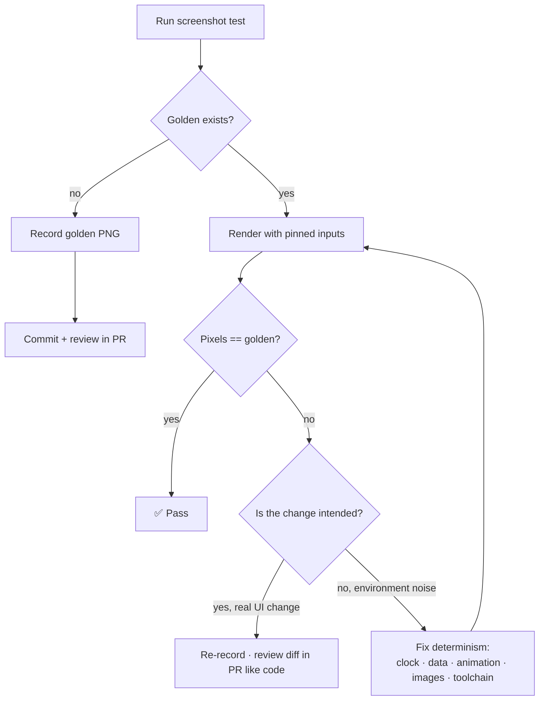

# Lesson 05 — Screenshot Testing

> After this lesson you can lock down the *pixel* appearance of a composable — across themes, locales, font scales, and screen sizes — with Paparazzi or Roborazzi, and make rendering **deterministic** so the only thing that changes a golden image is a real visual change.

**Module:** 14 · **Lesson:** 05 · **Level:** 🟢🟡🔴 · **Est. time:** 75–95 min

---

## 1. Concept

### 🟢 For beginners — *what is it and why do I care?*

Semantics tests (Lesson 03) prove a button *exists and is enabled*. They say **nothing** about whether it *looks* right — wrong color, clipped text, broken dark mode, an icon overlapping a label. A **screenshot test** fills that gap: it renders your composable to an image, saves that image once as the "golden" (the approved look), and on every future run compares the fresh render to the golden. If a single pixel differs, the test fails and shows you a diff.

Think of it as a **before/after photo guard** for your UI. You approve how a screen looks today; the test screams if a code change alters it tomorrow — including changes you didn't realize had visual side effects (a theme tweak, a padding refactor, a library upgrade).

The workflow is: write the test → run it once to *record* the golden → commit the golden image → from then on the test *verifies* against it. When you intend a visual change, you re-record and review the new image like any other diff.

### 🟡 For intermediate devs — *the mechanism*

Two dominant tools in 2026, both **JVM-based** (no emulator):

| | **Paparazzi** (Cash App) | **Roborazzi** (+ Robolectric) |
|---|---|---|
| Engine | Renders via LayoutLib (the same engine as Studio previews) | Renders via Robolectric's emulated Android |
| Source set | `src/test/` | `src/test/` (Robolectric) |
| Strengths | Fast, zero-device, simple API | Reuses your existing Robolectric/Compose tests; can screenshot *during* interaction |
| Trade-off | Can't run arbitrary instrumentation/interaction | Slightly heavier; ties to Robolectric |

A Paparazzi test:
```kotlin
@get:Rule val paparazzi = Paparazzi(deviceConfig = DeviceConfig.PIXEL_5)

@Test fun emptyCart() {
    paparazzi.snapshot { AppTheme { CartScreen(state = CartUiState()) } }
}
```
`./gradlew recordPaparazzi` writes goldens; `./gradlew verifyPaparazzi` compares. Roborazzi mirrors this with `captureRoboImage(...)` and `record`/`verify`/`compare` Gradle tasks.

**The hard part is determinism.** A screenshot test is only useful if the *same UI* produces the *same pixels* every run. Anything nondeterministic — current date/time, random data, animations mid-flight, network images, ripple states — makes the golden flap and the test flaky. So you **pin** every variable: fixed clock, seeded/static data, disabled or settled animations, fake image loaders, fixed locale/font scale. Screenshot testing is 20% snapshotting and 80% controlling inputs.

**Parameterized coverage** is the superpower: render the *same* component across many configs and snapshot each.
```kotlin
@Test fun button_states() {
    listOf("Light" to lightColors(), "Dark" to darkColors()).forEach { (name, colors) ->
        paparazzi.snapshot(name) { AppTheme(colors) { PrimaryButton("Save") } }
    }
}
```
One test → goldens for light/dark/RTL/large-font — catching theming and localization regressions a manual pass would miss.

### 🔴 For senior devs — *trade-offs, edges, internals*

- **Determinism is the entire engineering problem.** Sources of flake, each with a fix: **time** → inject a fixed `Clock`/`Instant`; **randomness** → seed it or pass static data; **animations** → render the *end* state (Paparazzi snapshots a single frame, but a composable launching an animation can capture mid-transition — disable via a test flag or `LocalInspectionMode`); **async images** (Coil/Glide) → install a fake `ImageLoader` returning a solid color/placeholder, never hit the network; **system UI** (status bar, time) → device config controls it. A golden must be a pure function of code + pinned inputs.
- **Font and rendering portability is real.** LayoutLib/Robolectric rendering can differ subtly across OS/JDK/AGP versions (anti-aliasing, font hinting). Pin the **toolchain** (JDK, AGP, library versions) in CI and record goldens **in the same environment** that verifies them — recording on a Mac and verifying on a Linux CI is a classic source of whole-suite "1-pixel" failures. Many teams record goldens *only* in CI (a Docker image) for this reason.
- **Golden images are reviewed artifacts, not generated noise.** Treat a golden change like a code change: it must appear in the PR diff and get *looked at*. A reviewer who rubber-stamps golden updates defeats the purpose — the test then can't catch an *unintended* visual regression because every change is auto-approved. Tooling that renders the before/after/diff inline in the PR is worth setting up.
- **What to snapshot: components and states, not whole flows.** Screenshot the *empty/loading/error/full* states of a screen and the variants of a design-system component (button sizes, chip states). Don't try to screenshot a 7-step flow — that's brittle and belongs to integration/E2E. The unit of a screenshot test is a *state of a view*, mirroring how a `@Preview` is structured.
- **Coverage vs golden-count tax.** Every config × every state is a stored PNG someone maintains. Be deliberate: snapshot the *axes that actually break* (light/dark, LTR/RTL, smallest+largest font) rather than a combinatorial explosion. A thousand near-identical goldens is its own maintenance burden and slows CI artifact handling.
- **Accessibility rendering can be asserted too.** Roborazzi/Paparazzi can render with large font scales and (with config) accessibility heuristics, catching truncation and contrast issues at the pixel level — a complement to the semantics work in Lesson 03.
- **Screenshot tests are *change detectors by design* — that's a feature here, unlike logic tests.** For logic, change-detector tests are bad; for *pixels*, detecting any change is the whole point. The skill is making sure they only detect *visual* change, not environmental noise.

### Analogy

A screenshot test is a **passport photo booth with a strict template.** When you first enroll, it takes the canonical photo (the golden) under fixed lighting, fixed background, neutral expression (pinned inputs). Every later check compares your live face to that photo. If you grew a beard (a real visual change), it flags you — and you update the passport on purpose. But if the booth's *lighting* drifted or the *camera firmware* changed (nondeterminism — different JDK, different fonts), it flags you for no real reason, and everyone loses trust in the booth. The job is to keep the lighting identical so only *you* changing trips it.

### Mental model

> **A golden image is a pinned `f(code, inputs)`. Control every input — clock, data, animation, images, locale, fonts, toolchain — so the only thing that can change the pixels is an intended UI change, which you then review like code.**

### Real-world example

A design system ships a `PriceTag` component. Screenshot tests render it in light/dark, LTR/RTL, at 1.0× and 2.0× font scale, with prices "$9", "$1,299", and "Free." The goldens are committed. Three sprints later, someone bumps the Material library; the dark-mode golden's background shifts a shade — the test fails in CI, the diff is in the PR, and a reviewer confirms it's an *unintended* regression from the upgrade. Without screenshot tests, that ships and a designer files a bug two weeks later. With them, it's caught before merge, deterministically, with no device in the loop.

---

## 2. Visual Learning

**ASCII — record once, verify forever:**
```text
   FIRST RUN (record)                          EVERY LATER RUN (verify)
   ┌───────────────────┐                       ┌───────────────────┐
   │ render composable │                       │ render composable │
   │   (pinned inputs) │                       │   (pinned inputs) │
   └─────────┬─────────┘                       └─────────┬─────────┘
             ▼                                            ▼
      save golden.png  ──commit──▶  repo  ──▶  compare to golden.png
             │                                            │
        review + approve                          ┌───────┴────────┐
                                                  ▼                ▼
                                            pixels match      pixels differ
                                              ✅ pass         ❌ fail + diff image
                                                          (real change? re-record & review
                                                           noise? fix determinism)
```

**Mermaid — the screenshot decision flow:**


**Illustration prompt (paste into an image generator):**
```text
Illustration: a passport photo booth as a metaphor for screenshot testing. Inside, a phone-UI
"face" sits under perfectly even, locked studio lights labeled "PINNED INPUTS: fixed clock,
static data, no animation, fake images, fixed locale". A printed reference photo labeled
"GOLDEN.PNG" hangs beside a live camera feed; a magnifier overlays the two showing a red
highlighted difference region labeled "DIFF". A small sign reads "only REAL changes trip it".
Outside the booth, drifting colored bulbs labeled "JDK / fonts / AGP" are blocked by a glass
shield labeled "PINNED TOOLCHAIN". Modern, vibrant, crisp labels, soft gradients.
```

---

## 3. Code

> Examples use Paparazzi (JVM, `src/test/`). Roborazzi is analogous: replace `paparazzi.snapshot { }` with `captureRoboImage()` and use `record/verifyRoborazzi` tasks. Gradle: `./gradlew recordPaparazzi` then `verifyPaparazzi`.

### 🟢 Beginner — one component, one golden

```kotlin
// src/test/  — runs on the JVM, no device.
class PrimaryButtonScreenshotTest {
    @get:Rule val paparazzi = Paparazzi(deviceConfig = DeviceConfig.PIXEL_5)

    @Test fun `primary button default`() {
        paparazzi.snapshot {
            AppTheme {                          // always wrap in your real theme
                PrimaryButton(text = "Save", onClick = {})
            }
        }
    }
}
```

**Explanation.** Renders `PrimaryButton` inside the app theme and snapshots it. First run with `recordPaparazzi` writes `…/primary_button_default.png`; commit it. Later runs with `verifyPaparazzi` compare against it. No emulator, milliseconds to run.

**Common mistakes.**
```kotlin
// ❌ Forgetting the theme → golden is unthemed/default-styled, not what users see.
paparazzi.snapshot { PrimaryButton(text = "Save", onClick = {}) }
```
Without `AppTheme`, colors/typography fall back to defaults, so the golden doesn't represent the real UI and won't catch theme regressions.

**Best practices.**
- Always wrap snapshots in your real theme (and any required `CompositionLocalProvider`s).
- Commit goldens to version control and review them in the PR.

---

### 🟡 Intermediate — parameterized states + themes (the real value)

```kotlin
class CartScreenshotTest {
    @get:Rule val paparazzi = Paparazzi(deviceConfig = DeviceConfig.PIXEL_5)

    private val states = mapOf(
        "empty"   to CartUiState(items = emptyList()),
        "loading" to CartUiState(isLoading = true),
        "full"    to CartUiState(items = sampleItems()),     // STATIC sample data
        "error"   to CartUiState(error = "Network error"),
    )

    @Test fun `cart states light and dark`() {
        states.forEach { (name, state) ->
            listOf("light" to false, "dark" to true).forEach { (theme, dark) ->
                paparazzi.snapshot(name = "$name-$theme") {
                    AppTheme(darkTheme = dark) {
                        CartScreen(state = state, onEvent = {})   // STATELESS screen
                    }
                }
            }
        }
    }
}

private fun sampleItems() = listOf(
    CartItem(id = "1", title = "Running Shoes", unitPrice = 89_00, qty = 1),
    CartItem(id = "2", title = "Cap", unitPrice = 19_00, qty = 2),
)
```

**Explanation.** One test produces **eight** goldens — every UI state × light/dark. This is where screenshot testing pays off: the empty/loading/error/full states and both themes are all locked at once, catching a broken dark mode or a misrendered error banner. Crucially, the data is **static** (`sampleItems()`), and the screen is **stateless** (state passed in), so renders are deterministic.

**Common mistakes.**
```kotlin
// ❌ Nondeterministic data → the golden changes every run.
val state = CartUiState(items = repository.randomItems())          // random → flaky
Text("Updated ${LocalDateTime.now()}")                            // clock → flaky

// ❌ Snapshotting a stateful screen that loads data itself → timing/async in the render.
paparazzi.snapshot { CartRoute(viewModel = realVm) }              // async load mid-snapshot
```
Random data and live clocks make the golden flap. Snapshot the **stateless** composable with injected static state, never a route that kicks off async loads.

**Best practices.**
- Snapshot **stateless** composables with **static** state; never random data or live time.
- Parameterize across the axes that *actually* break (light/dark, LTR/RTL, font scale) rather than every combination.
- Name snapshots by state+config so diffs are self-describing.

---

### 🔴 Production — pinning every nondeterministic input

```kotlin
class FeedScreenshotTest {
    // Pin device, locale, and font scale at the rule level.
    @get:Rule val paparazzi = Paparazzi(
        deviceConfig = DeviceConfig.PIXEL_5.copy(
            locale = "ar",                          // RTL coverage
            fontScale = 2.0f,                       // large-font / a11y coverage
        ),
        // renderingMode = SessionParams.RenderingMode.SHRINK, // tight-fit some components
    )

    @Test fun `feed renders deterministically with fixed clock, static data, fake images`() {
        val fixedClock = Clock.fixed(Instant.parse("2026-06-17T09:00:00Z"), ZoneOffset.UTC)
        val state = FeedUiState(
            posts = listOf(
                Post(id = "1", author = "Ada", body = "Hello", createdAt = Instant.parse("2026-06-17T08:00:00Z")),
            ),
        )

        paparazzi.snapshot {
            // Provide the fixed clock + a fake image loader so NOTHING varies between runs.
            CompositionLocalProvider(
                LocalClock provides fixedClock,                 // your app's injected clock
                LocalAsyncImageLoader provides fakeSolidColorLoader(),  // no network images
            ) {
                AppTheme {
                    FeedScreen(state = state, onEvent = {})
                }
            }
        }
    }
}

// A fake loader that resolves every URL to a deterministic solid color (no I/O).
private fun fakeSolidColorLoader(): ImageLoader = /* Coil test ImageLoader returning a ColorDrawable */ TODO()
```

**Explanation.** This is a production-grade deterministic snapshot. **Time** is a fixed `Clock` provided via a `CompositionLocal` (so "1 hour ago" is stable). **Images** go through a fake loader returning a solid color — no network, no decode variance. **Locale** (`ar`) and **font scale** (2.0×) are pinned at the rule to cover RTL and large-text rendering in one shot. The screen is stateless with static posts. Run this in a pinned CI toolchain and the golden is a pure function of the code.

**Common mistakes.**
```kotlin
// ❌ Recording goldens locally (macOS/JDK 21) but verifying in CI (Linux/JDK 17).
// Anti-aliasing/font differences → whole suite fails with 1-px diffs that aren't real.

// ❌ Leaving real async image loading in the snapshot → blank or flaky image regions.
AsyncImage(model = post.avatarUrl, contentDescription = null)   // hits network during render
```
Toolchain drift between record and verify is the #1 cause of phantom screenshot failures — pin JDK/AGP/library versions and record where you verify. And any real network/async work inside a snapshot reintroduces nondeterminism.

**Best practices.**
- Inject a **fixed `Clock`** and a **fake image loader**; pin **locale** and **font scale** at the rule.
- **Pin the toolchain** (JDK, AGP, lib versions) and record goldens in the **same environment** that verifies (ideally CI/Docker).
- Snapshot **states** (empty/loading/error/full) and **design-system variants**, not whole flows.
- Review every golden change in the PR as a deliberate visual decision.

---

## 4. Interview Questions

**🟢 Beginner**

1. *What does a screenshot test verify that a semantics/UI test does not?*
   > The *visual* appearance — exact pixels: colors, layout, spacing, dark mode, truncation. Semantics tests verify behavior/state (enabled, displayed) but not how it looks.
2. *What is a "golden" image?*
   > The approved reference screenshot recorded once and committed. Later test runs render the component again and compare to the golden; any pixel difference fails the test.

**🟡 Intermediate**

3. *Why can Paparazzi and Roborazzi run without an emulator, and where do their tests live?*
   > They render on the JVM — Paparazzi via LayoutLib (Studio's preview engine), Roborazzi via Robolectric — so no device is needed. Both live in `src/test/`, making them fast enough to run on every PR.
4. *Name three sources of nondeterminism in screenshot tests and how you'd fix each.*
   > Current time → inject a fixed `Clock`. Random/live data → use static seeded data and a stateless composable. Network images → install a fake `ImageLoader` returning a placeholder/solid color. (Also: animations → render the settled state.)

**🔴 Senior**

5. *Your screenshot suite passes locally but fails in CI with tiny 1-pixel diffs. What's the likely cause and fix?*
   > Toolchain/environment drift between where goldens were *recorded* and where they're *verified* — different JDK/OS/AGP/library versions cause subtle anti-aliasing or font-hinting differences. Fix by pinning the toolchain and recording goldens in the **same** environment that verifies them (commonly a CI/Docker image), not on a developer's machine.
6. *Screenshot tests are "change detectors." For logic tests that's an anti-pattern — why is it acceptable, even desirable, here, and what's the resulting discipline?*
   > For pixels, detecting *any* visual change is the entire purpose, so being a change detector is the feature. The discipline is twofold: (1) eliminate *environmental* change so only *intended visual* change trips them (determinism + pinned toolchain), and (2) treat every golden update as a reviewed artifact in the PR diff, so an unintended regression can't be rubber-stamped through.

---

## 5. AI Assistant

**Prompt example (generating screenshot tests):**
```text
Write Paparazzi screenshot tests (src/test) for this stateless CartScreen. Parameterize across
states (empty, loading, full, error) and themes (light, dark). Use STATIC sample data — no random
values, no LocalDateTime.now(). Wrap every snapshot in AppTheme. Name snapshots "<state>-<theme>".
Note where I must inject a fixed Clock and a fake image loader for determinism.
Target Compose 2026, Kotlin 2.x, Paparazzi.
[paste CartScreen + CartUiState]
```

**AI workflow.**
- ✅ Good for: generating parameterized snapshot matrices, enumerating the states/configs worth covering, and the boilerplate per tool (Paparazzi/Roborazzi tasks).
- ⚠️ Watch: models routinely **forget the theme wrapper**, leave **live time/random data** in, snapshot a **stateful route** that loads async, and ignore **image-loader/clock** determinism — all guaranteed flake.

**Review workflow — map to this lesson's *Common Mistakes*:**
- Is every snapshot wrapped in the real theme (+ needed CompositionLocals)?
- Is the composable **stateless** with **static** data — no random values, no `now()`?
- Are async images faked and any clock fixed?
- Are the chosen axes meaningful (light/dark, RTL, font scale) rather than a combinatorial blowup?

**Validation workflow — prove the goldens are trustworthy:**
1. Record goldens (`recordPaparazzi`), then run `verifyPaparazzi` twice with no code change — it must pass both times (proves determinism).
2. Make a deliberate visual change (e.g. padding); verify it *fails* and the diff highlights exactly that region.
3. Run the same suite in your CI environment; if it diverges from local, pin the toolchain and re-record in CI.
4. Open a golden update in a PR and confirm the before/after/diff is reviewable — not auto-approved.

> **AI drafts, you decide.** The model writes the snapshot matrix; you enforce *determinism* (clock, data, images, toolchain) and the *review-the-golden* discipline it can't reason about.

---

## Recap / Key takeaways

- Screenshot tests guard **pixel** appearance (colors, layout, dark mode, truncation) — what semantics tests can't see.
- A **golden** is recorded once, committed, and compared every run; **Paparazzi**/**Roborazzi** run on the **JVM**, no device.
- **Determinism is the job**: pin **clock, data, animations, images, locale, font scale, and toolchain** so only intended UI changes trip the test.
- Snapshot **stateless** composables and their **states/variants** (empty/loading/error/full, light/dark/RTL), not whole flows.
- Goldens are **reviewed artifacts** — record where you verify, and treat every update as a deliberate visual decision.

➡️ Next: **[Lesson 06 — Macrobenchmark testing](06-macrobenchmark-testing.md)** — turn startup time and frame timing into a pass/fail test on a real device.
