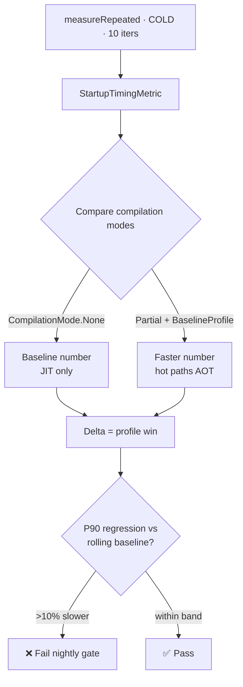

# Lesson 06 — Macrobenchmark Testing

> After this lesson you can turn **startup time** and **frame timing (jank)** into automated pass/fail tests on a real device, generate **Baseline Profiles** to speed up your app, and reason about why performance regressions need a benchmark — not a screenshot or a unit test — to catch.

**Module:** 14 · **Lesson:** 06 · **Level:** 🟢🟡🔴 · **Est. time:** 80–100 min

---

## 1. Concept

### 🟢 For beginners — *what is it and why do I care?*

Every test so far checked whether the app is *correct*. A **Macrobenchmark** checks whether the app is *fast*. It launches your real, release-built app on a real device and measures things a user feels:

- **Startup time** — how long from tapping the icon to seeing content.
- **Frame timing / jank** — while scrolling, does every frame render in time, or do some take too long and cause a visible stutter?

It runs the app like a user, repeats the action several times, and reports the numbers (median, worst-case). You can wire those numbers into CI so a pull request that makes startup 200 ms slower *fails* — performance becomes a guardrail, not a guess.

It also produces a **Baseline Profile**: a list of the exact code paths your app uses at startup and on key screens, which Android pre-compiles so the app runs faster for *real users* from the first launch. So Macrobenchmark both *measures* speed and *improves* it.

"Macro" vs "micro": **Microbenchmark** times a tiny piece of code in a tight loop (a sorting function). **Macrobenchmark** times whole user interactions (app startup, a scroll) on the real app. This lesson is about the macro kind — the one that maps to what users perceive.

### 🟡 For intermediate devs — *the mechanism*

Macrobenchmarks live in a **separate Gradle module** (a `com.android.test` module) and run on a **physical device** (emulators give unreliable numbers). The app under test must be built in a **release-like** configuration (`minifyEnabled`, non-debuggable) — debug builds are far slower and not representative.

The core API:
```kotlin
@get:Rule val rule = MacrobenchmarkRule()

@Test fun startup() = rule.measureRepeated(
    packageName = "com.example.app",
    metrics = listOf(StartupTimingMetric()),
    iterations = 10,
    startupMode = StartupMode.COLD,            // COLD | WARM | HOT
    setupBlock = { pressHome(); }              // reset before each iteration
) {
    startActivityAndWait()                     // the measured action
}
```

Key concepts:
- **Metrics:** `StartupTimingMetric()` (time to initial display / fully drawn), `FrameTimingMetric()` (frame durations → jank), `PowerMetric`, `MemoryUsageMetric`, plus **custom trace sections** via `TraceSectionMetric("MySection")`.
- **`StartupMode`:** **COLD** (process killed, worst case — the headline number), **WARM** (process alive, activity recreated), **HOT** (activity resumed).
- **`reportFullyDrawn()`:** call it in your app when the screen's *content* (not just the window) is ready, so `StartupTimingMetric` measures *useful* display, not an empty frame.
- **Frame timing + `FrameTimingMetric`:** drive a scroll in the measure block (via UiAutomator: `device.findObject(...).fling(...)`), and the metric reports frame-duration percentiles; frames over the budget are jank.

**Baseline Profiles** are generated with `BaselineProfileRule().collect(...)`, capturing the methods exercised by your critical journeys into a `baseline-prof.txt` shipped with the app. Pair them with the `androidx.baselineprofile` Gradle plugin.

### 🔴 For senior devs — *trade-offs, edges, internals*

- **Benchmarks measure *distributions*, not a single number — and the variance is the signal.** A device thermal-throttles, background work intrudes, the scheduler wanders. That's why `iterations` exists and why you read **median + a high percentile (P90/P99)**, not the mean. A regression that only shows at P99 is still a regression real users hit. Macrobenchmark also surfaces a warning if measurements are too noisy to trust — *don't ignore it*; pin the device, lock clocks if you can, and run on a quiet device.
- **It's the only layer that catches a *whole class* of bugs.** A `LaunchedEffect` that does main-thread I/O, an over-eager `derivedStateOf`, a heavy `Modifier` recomputed every frame, an unnecessary recomposition storm — none of these fail a unit test, a semantics test, or a screenshot test. They *only* show up as slower startup or dropped frames. This is why performance gets its own test layer (Lesson 01's tip of the pyramid, but a *measurement* tip).
- **Baseline Profiles are the highest-ROI startup win in modern Android.** Without them, code is JIT-compiled lazily; with them, hot paths are AOT-compiled at install. Real-world startup improvements of 20–40% are common. The benchmark *proves* the win: measure cold startup with `CompilationMode.None()` vs `CompilationMode.Partial(baselineProfile)` and compare. A senior ships the profile *and* the benchmark that guards it.
- **`CompilationMode` controls what you're actually measuring.** `CompilationMode.None()` (no AOT, JIT only) is the floor; `Partial(BaselineProfileMode.Require)` measures with your profile applied; `Full()` AOT-compiles everything (an upper bound, not what ships). Comparing modes isolates *how much* the profile (or R8) buys you — comparing the wrong modes makes you draw false conclusions.
- **`reportFullyDrawn()` placement is a correctness issue for the metric.** If you call it too early (window shown, list still loading), `timeToFullDisplay` is optimistically wrong; too late, pessimistically. Place it when the user can *act* on real content. Getting this wrong makes your headline startup number meaningless even though the test is "green."
- **CI gating needs tolerance bands, not exact thresholds.** Because of inherent variance, gate on a *regression delta* against a rolling baseline (e.g. "fail if P90 startup is >10% slower than the 7-day median"), not a hard millisecond constant — otherwise the gate flaps. Run benchmarks on a **dedicated, consistent device** (a device farm or a pinned physical device), never shared CI emulators.
- **Macrobenchmarks are slow and device-bound — keep them few and nightly.** A handful of journeys (startup, the main scroll, the heaviest screen). They don't belong in the per-PR fast path; they gate merges/nightlies. This mirrors the pyramid: precious, expensive, high-signal, *few*.

### Analogy

A Macrobenchmark is a **car's instrumented test track**, not a mechanic's bench. You don't put a single bolt in a vise (microbenchmark) — you drive the *whole car* through measured laps: a standing-start 0–60 (cold startup) and a high-speed slalom (scrolling for jank), with sensors logging *every* lap because one timing means nothing — you need the spread across laps to trust it. The track also tunes the car: the racing line it learns (the Baseline Profile) makes every future lap faster. And like a real track, the numbers only mean something on a consistent surface in stable weather (a pinned device, low noise) — measure in a thunderstorm and the lap times are garbage.

### Mental model

> **Benchmarks measure user-felt speed (startup, jank) on a real device as a distribution — read the worst case, not the mean. They catch the performance bugs no correctness test can, and the Baseline Profile they produce makes the app faster for everyone.**

### Real-world example

A news app. A Macrobenchmark measures **cold startup** over 10 iterations: median 680 ms, P90 920 ms. The team adds a **Baseline Profile** for the launch + feed journey; the benchmark re-run shows median 470 ms, P90 610 ms — a ~30% win, *proven*, not claimed. A separate `FrameTimingMetric` benchmark scrolls the feed and reports P99 frame duration; a later PR that adds an expensive per-item shadow pushes P99 over 16 ms, the benchmark fails in the nightly run, and the jank is caught before users feel it. Two numbers, two guardrails — neither visible to any other test layer.

---

## 2. Visual Learning

**ASCII — the measure loop:**
```text
   ┌──────────────── MacrobenchmarkRule.measureRepeated (× iterations) ────────────────┐
   │                                                                                   │
   │  setupBlock { pressHome() }   →   killProcess (COLD)   →   [ measured action ]     │
   │                                                              startActivityAndWait │
   │                                                              / fling to scroll     │
   │                                   metrics: StartupTiming · FrameTiming · TraceSec  │
   │                                                   │                                │
   │                                                   ▼                                │
   │                          collect per-iteration samples → report median / P90 / P99 │
   └───────────────────────────────────────────────────────────────────────────────────┘
        runs on a REAL device · RELEASE-like build · read the DISTRIBUTION, not one run
```

**Mermaid — startup measurement & Baseline Profile win:**


**Illustration prompt (paste into an image generator):**
```text
Illustration: a car instrumented-test track, top-down, as a metaphor for Macrobenchmark testing.
A single car (labeled "THE APP") sits at a start line marked "COLD STARTUP 0→content"; a stopwatch
cluster shows several lap times with median and P99 highlighted (not just one). A winding slalom
section is labeled "SCROLL · FRAME TIMING · jank = frame over 16 ms". A glowing optimal racing line
labeled "BASELINE PROFILE" overlays the track, with a before/after bar chart showing startup
dropping ~30%. A weather gauge in the corner reads "STABLE · pinned device · low noise". Modern,
vibrant, clean labels, soft studio gradients.
```

---

## 3. Code

> Macrobenchmarks live in a `com.android.test` module and run on a **physical device** against a **release-like** build. Dependency: `androidx.benchmark:benchmark-macro-junit4`; for profiles, the `androidx.baselineprofile` plugin + `BaselineProfileRule`.

### 🟢 Beginner — measure cold startup

```kotlin
@RunWith(AndroidJUnit4::class)
class StartupBenchmark {
    @get:Rule val rule = MacrobenchmarkRule()

    @Test fun coldStartup() = rule.measureRepeated(
        packageName = "com.example.app",
        metrics = listOf(StartupTimingMetric()),
        iterations = 10,                       // many runs → a trustworthy distribution
        startupMode = StartupMode.COLD,        // worst case: process killed first
        setupBlock = { pressHome() },          // reset state before each iteration
    ) {
        startActivityAndWait()                 // the action being timed
    }
}
```

**Explanation.** `measureRepeated` launches the app from cold 10 times and reports startup-time percentiles (`timeToInitialDisplay`, and `timeToFullDisplay` if you call `reportFullyDrawn`). `setupBlock` runs *outside* measurement to reset state; the trailing lambda is the *measured* action. Run it from Studio's gutter or `./gradlew :benchmark:connectedCheck` and read the median + P90.

**Common mistakes.**
```kotlin
// ❌ Benchmarking a debug build → numbers are far slower and meaningless.
// (Build the app under test as release/minified; debug disables optimizations.)

// ❌ iterations = 1 → a single noisy sample, no distribution to trust.
iterations = 1
```
Debug builds skip R8/optimizations and run slower, so their numbers don't represent users. One iteration can't reveal variance — you need several to read a median and a tail.

**Best practices.**
- Run on a **real device**, against a **release-like** build, with enough **iterations** (≥10) to get a distribution.
- Read **median + P90/P99**, not the mean; heed any "noisy measurement" warning.

---

### 🟡 Intermediate — frame timing (jank) on a scroll

```kotlin
@RunWith(AndroidJUnit4::class)
class FeedScrollBenchmark {
    @get:Rule val rule = MacrobenchmarkRule()

    @Test fun scrollFeed() = rule.measureRepeated(
        packageName = "com.example.app",
        metrics = listOf(FrameTimingMetric()),       // frame durations → jank percentiles
        iterations = 8,
        startupMode = StartupMode.WARM,
        setupBlock = {
            startActivityAndWait()
            // Wait for the list to be present before measuring the scroll.
            device.wait(Until.hasObject(By.res(packageName, "feed_list")), 5_000)
        },
    ) {
        val list = device.findObject(By.res(packageName, "feed_list"))
        list.setGestureMargin(device.displayWidth / 5)   // avoid system gesture insets
        repeat(3) { list.fling(Direction.DOWN) }         // the measured scroll
        device.waitForIdle()
    }
}
```

**Explanation.** `FrameTimingMetric()` reports the duration of each frame produced during the measured block; the result gives `frameDurationCpuMs` percentiles, and frames exceeding the device's budget are jank. We drive a real scroll with UiAutomator (`fling`), having waited in `setupBlock` for the list (`feed_list` is exposed via `Modifier.testTag` → resource id, or a `By.text` match). Reading the P90/P99 frame duration tells you whether scrolling stutters.

**Common mistakes.**
```kotlin
// ❌ Scrolling before the list exists → measures nothing / errors.
// (Always wait for the target in setupBlock with device.wait(Until.hasObject(...)).)

// ❌ Reading the average frame time and calling it smooth.
// One janky frame at P99 is a visible stutter; the mean hides it.
```
If the list isn't present, the gesture finds nothing and the measurement is invalid. And jank is a *tail* phenomenon — a fine mean with a bad P99 still feels stuttery.

**Best practices.**
- Wait for the target view in `setupBlock` before the measured gesture.
- Judge smoothness by **P90/P99** frame duration, not the average; set a gesture margin to dodge system insets.

---

### 🔴 Production — Baseline Profile + proving the startup win across compilation modes

```kotlin
// 1) Generate a Baseline Profile for the critical journey (its own test module).
@RunWith(AndroidJUnit4::class)
class BaselineProfileGenerator {
    @get:Rule val rule = BaselineProfileRule()

    @Test fun generate() = rule.collect(
        packageName = "com.example.app",
        includeInStartupProfile = true,             // also produce a startup profile
    ) {
        pressHome()
        startActivityAndWait()                      // capture launch …
        val list = device.findObject(By.res(packageName, "feed_list"))
        list.setGestureMargin(device.displayWidth / 5)
        repeat(3) { list.fling(Direction.DOWN) }    // …and the main scroll journey
        device.waitForIdle()
    }
}
```

```kotlin
// 2) Prove the win: measure cold startup with NO compilation vs WITH the profile.
@RunWith(AndroidJUnit4::class)
class StartupCompilationBenchmark {
    @get:Rule val rule = MacrobenchmarkRule()

    @Test fun startupNoCompilation() = startup(CompilationMode.None())

    @Test fun startupBaselineProfile() =
        startup(CompilationMode.Partial(baselineProfileMode = BaselineProfileMode.Require))

    private fun startup(mode: CompilationMode) = rule.measureRepeated(
        packageName = "com.example.app",
        metrics = listOf(StartupTimingMetric()),
        compilationMode = mode,                     // the variable under study
        iterations = 15,
        startupMode = StartupMode.COLD,
        setupBlock = { pressHome() },
    ) {
        startActivityAndWait()
    }
}
```

**Explanation.** First, `BaselineProfileRule().collect { }` exercises the launch + scroll journey and emits a `baseline-prof.txt` the app ships (via the `androidx.baselineprofile` plugin), pre-compiling those paths for real users. Second, the comparison benchmark runs cold startup under `CompilationMode.None()` (JIT floor) and `CompilationMode.Partial(... Require)` (profile applied) — the median delta is the *proven* startup improvement. `BaselineProfileMode.Require` makes the test *fail* if the profile isn't actually applied, so you can't accidentally measure (and ship) without it. In CI, this pair guards both the profile's presence and the startup budget.

**Common mistakes.**
```kotlin
// ❌ Comparing against CompilationMode.Full() and concluding "we're fast".
// Full() AOT-compiles everything — it's an upper bound that does NOT ship; the win is illusory.

// ❌ Shipping a Baseline Profile but never benchmarking it → no proof it helps or stays applied.
//    (Use BaselineProfileMode.Require so a missing/ineffective profile fails the test.)
```
`Full()` over-compiles versus what users actually get, so it flatters your numbers. And an unverified profile can silently stop applying after a build change — `Require` plus a benchmark keeps it honest.

**Best practices.**
- Generate Baseline Profiles for your **critical journeys**; ship them via the plugin.
- **Prove** the win by comparing `CompilationMode.None()` vs `Partial(Require)` — never against `Full()`.
- Gate CI on a **regression delta vs a rolling baseline** (e.g. P90 >10% slower), on a **pinned device**, run **nightly** — not in the per-PR fast path.
- Place `reportFullyDrawn()` when real content is interactive, so `timeToFullDisplay` is meaningful.

---

## 4. Interview Questions

**🟢 Beginner**

1. *What does a Macrobenchmark measure, and how is it different from a Microbenchmark?*
   > A Macrobenchmark measures whole user interactions on the real app/device — app startup time, scrolling frame timing. A Microbenchmark times a small piece of code in a tight loop. Macro maps to user-felt performance; micro to a single function's speed.
2. *Why must you read more than one run of a benchmark?*
   > Device performance varies (thermal, scheduling, background work), so one number is noise. You run many iterations and read the median and a high percentile to get a trustworthy picture.

**🟡 Intermediate**

3. *What are the startup modes, and which is the headline number?*
   > **COLD** (process killed first — worst case), **WARM** (process alive, activity recreated), **HOT** (activity resumed). COLD is the headline because it's what a user hits on a fresh launch and is the slowest.
4. *How do you measure jank, and why look at percentiles rather than the average frame time?*
   > Drive a scroll in the measured block and use `FrameTimingMetric`, which reports frame-duration percentiles. Jank is a *tail* phenomenon — a good average can still have P99 frames over budget that the user sees as stutter, so you read P90/P99.

**🔴 Senior**

5. *What is a Baseline Profile, how do you prove it actually helps, and what's the wrong comparison?*
   > A Baseline Profile lists the code paths for critical journeys so Android AOT-compiles them at install, speeding startup/first-run for real users. You prove the win by benchmarking cold startup with `CompilationMode.None()` (JIT floor) vs `CompilationMode.Partial(BaselineProfileMode.Require)` (profile applied) and reading the delta. The wrong comparison is `CompilationMode.Full()`, which AOT-compiles everything — an upper bound that doesn't ship, so it overstates the gain.
6. *Why can't you gate CI on a fixed millisecond startup threshold, and what do you do instead?*
   > Benchmark numbers have inherent variance, so a hard constant flaps (false failures/passes). Gate on a **regression delta against a rolling baseline** (e.g. fail if P90 is >10% slower than the recent median), run on a **dedicated, consistent device** off the per-PR fast path (nightly/merge), and heed noise warnings — measuring performance as a *trend*, not an absolute.

---

## 5. AI Assistant

**Prompt example (scaffolding a benchmark):**
```text
Write a Macrobenchmark (androidx.benchmark macro-junit4) that measures COLD startup of
com.example.app over 15 iterations with StartupTimingMetric, resetting with pressHome() in
setupBlock. Then write a second benchmark comparing CompilationMode.None() vs
CompilationMode.Partial(BaselineProfileMode.Require) to prove a Baseline Profile's startup win.
Also write a BaselineProfileRule generator for the launch + feed-scroll journey (feed_list).
Note that this must run on a physical device against a release build. Target 2026 AndroidX APIs.
```

**AI workflow.**
- ✅ Good for: scaffolding `measureRepeated`/`BaselineProfileRule` blocks, the UiAutomator scroll, and the compilation-mode comparison structure.
- ⚠️ Watch: models suggest **emulator runs**, **debug builds**, **`iterations = 1`**, comparing against **`CompilationMode.Full()`**, reading the **mean**, and forgetting to **wait for the target view** before scrolling — every one undermines the measurement.

**Review workflow — map to this lesson's *Common Mistakes*:**
- Physical device + **release-like** build, **≥10 iterations**?
- Startup read as **median + P90/P99**, jank as **percentiles** (not mean)?
- Baseline-Profile win proven via **None vs Partial(Require)** — *not* `Full()`?
- Does the scroll **wait for the list** in `setupBlock`?
- Is `reportFullyDrawn()` placed at real-content readiness?

**Validation workflow — prove the benchmark is sound:**
1. Run on the target physical device; confirm no "measurement is noisy" warning (if present, quiet the device / pin clocks).
2. Run the None-vs-Partial pair; confirm Partial is meaningfully faster — if not, the profile isn't applying (check the plugin/`Require`).
3. Introduce a deliberate startup cost (a `Thread.sleep` in `onCreate`); confirm the benchmark catches the regression.
4. Wire CI to compare against a rolling baseline on a dedicated device; verify the gate doesn't flap across nightly runs.

> **AI drafts, you decide.** The model scaffolds the harness; you enforce *real device + release build*, *distribution-based reading*, and the *correct compilation-mode comparison* it gets wrong.

---

## Recap / Key takeaways

- Macrobenchmarks measure **user-felt performance** — **cold startup** and **frame timing (jank)** — on a **real device**, **release** build.
- Read a **distribution**: median **and** P90/P99; one run is noise, and jank lives in the **tail**.
- **`StartupMode.COLD`** is the headline; place **`reportFullyDrawn()`** at real-content readiness for a meaningful number.
- **Baseline Profiles** AOT-compile critical journeys for big startup wins — **prove** them with `CompilationMode.None()` vs `Partial(Require)`, never `Full()`.
- This is the layer that catches performance bugs **no correctness test can**; gate it on a **rolling-baseline delta** on a **pinned device**, **nightly** — precious and few.

---

## Module complete

You can now test every layer of a Compose app with the right tool: **unit** tests for state and flows, **semantics** tests for UI behavior, **integration** tests for navigation and wiring, **screenshot** tests for pixel correctness, and **Macrobenchmarks** for speed — all chosen by *confidence per second*.

➡️ Next: **[Module 15 — Modern Android Development 2026](../module-15-modern-android-2026/README.md)** — place Compose in the wider 2026 ecosystem: Kotlin 2.x, K2, Multiplatform, and new surfaces.
