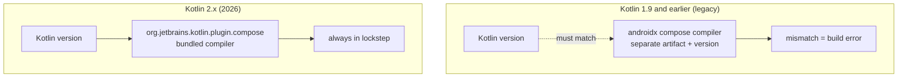
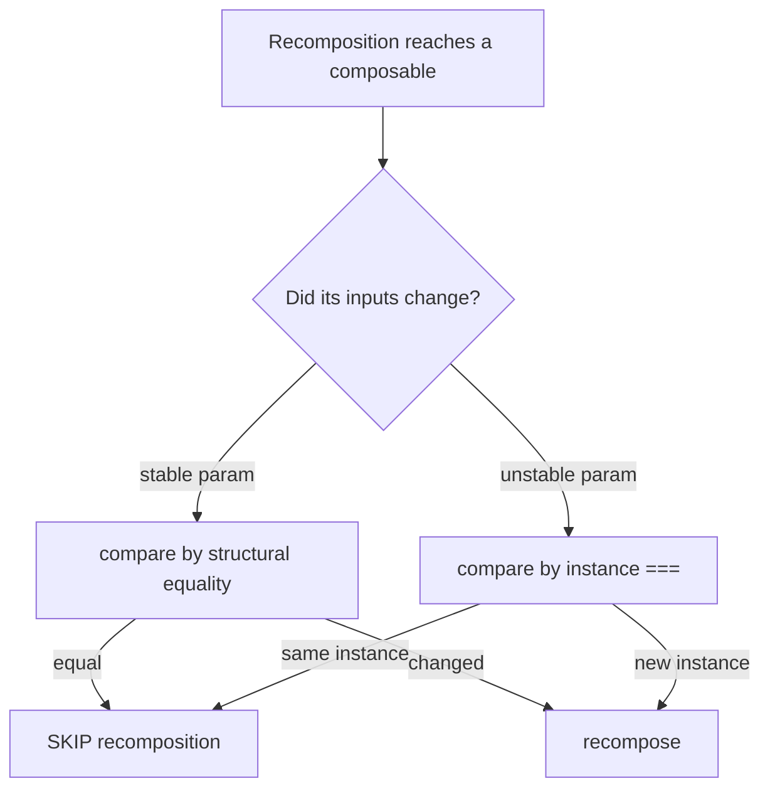

# Lesson 01 — Kotlin 2.x & the K2 Compiler

> After this lesson you can explain what K2 and Kotlin 2.x changed for a Compose build, configure the bundled Compose compiler plugin correctly, and reason about Strong Skipping and compiler metrics.

**Module:** 15 · **Lesson:** 01 · **Level:** 🟢🟡🔴 · **Est. time:** 60–75 min

---

## 1. Concept

### 🟢 For beginners — *what is it and why do I care?*

Every Kotlin file you write has to be turned into something Android can run. The tool that does that translation is the **compiler**. **K2** is the new Kotlin compiler frontend — a rewritten "brain" that reads your code, understands its types, and reports errors. It became the default in **Kotlin 2.0** and is the standard in every Kotlin 2.x release you'll use in 2026.

Why should a Compose developer care about a compiler? Two reasons:

1. **Compose is special.** Your `@Composable` functions don't compile like normal functions — a dedicated **Compose compiler plugin** rewrites them so Compose can track state and skip work. That plugin used to live in its own library with its own version that had to *exactly* match your Kotlin version. With Kotlin 2.x it ships **inside Kotlin itself**, so one common mismatch bug is gone.
2. **K2 is faster and stricter.** Builds compile quicker, and the compiler catches more real bugs at build time instead of letting them crash at runtime.

The short version: **K2 = the modern Kotlin compiler; in Kotlin 2.x the Compose compiler is bundled with it, so you stop version-matching two things by hand.**

### 🟡 For intermediate devs — *the mechanism*

Kotlin's compiler has two halves:

- **Frontend** — parses source, resolves names/types, runs diagnostics, and produces a typed intermediate representation. K2 is the rewrite of *this* half. It's built around a new **FIR** (Front-end Intermediate Representation) that's faster and more uniform than the old PSI-based resolution.
- **Backend** — lowers that IR to JVM bytecode (or Native/JS/Wasm). Compose's plugin hooks into the IR pipeline to transform composable functions.

The headline change for Compose in 2026: **the Compose compiler is versioned and released with Kotlin**, not as a separate `androidx.compose.compiler:compiler` artifact pinned to a Kotlin version. You apply it with a Gradle plugin:

```kotlin
// build.gradle.kts (module) — 2026 idiom
plugins {
    id("org.jetbrains.kotlin.android")
    id("org.jetbrains.kotlin.plugin.compose")   // ✅ the Compose compiler, bundled with Kotlin
    id("com.google.devtools.ksp")
}
```

You no longer set `composeOptions { kotlinCompilerExtensionVersion = "…" }`. That stanza is **legacy** — the whole class of "Compose compiler 1.5.x requires Kotlin 1.9.y" errors disappears because the version moves in lockstep with the Kotlin plugin.

K2 also unlocks practical wins: faster incremental builds, better IDE responsiveness (the IDE uses the same frontend), and `kapt` running through a K2 path. New annotation processing prefers **KSP2**, which is built for K2's model.

### 🔴 For senior devs — *trade-offs, edges, internals*

The decisions and gotchas that matter at scale:

- **Strong Skipping is the runtime payoff.** Since Compose compiler 1.3.0 of the new scheme (and **default** in current releases), **Strong Skipping** changes the rules for *which composables can be skipped*. Previously a composable was only skippable if **all** its parameters were stable. With Strong Skipping, composables with **unstable** parameters become skippable too — the runtime compares unstable params by **instance equality** (`===`) rather than refusing to skip. Lambdas are also auto-remembered. The net effect: fewer needless recompositions without you annotating every model. (Deep treatment in [Module 11 — Performance](../module-11-performance/README.md).)
- **Stability still matters; it just fails softer.** Strong Skipping doesn't make stability irrelevant — a stable type can be compared structurally and skipped even when a *new but equal* instance arrives; an unstable type compared by `===` will recompose on every fresh instance. So `kotlinx.collections.immutable` types and `@Immutable`/`@Stable` annotations still pay off. Strong Skipping changes the *floor*, not the *ceiling*.
- **Compiler metrics are how you prove it.** You can ask the compiler to emit per-composable stability/skippability reports and a module-level stability summary. You read these to find the function that recomposes too often and the model class the compiler thinks is unstable. We turn these on in the Code section.
- **K2 is stricter — expect new errors on upgrade.** Code that compiled under the old frontend may now fail: smarter smart-casts, stricter nullability across boundaries, resolution-ambiguity that the old compiler silently picked a winner for. These are usually *latent bugs* surfaced, not regressions. Budget time for a migration pass on large modules.
- **Tooling alignment is the real constraint.** Your Kotlin version, the bundled Compose compiler, the **Compose BOM** (which aligns runtime artifact versions), AGP, KSP2, and Hilt's processor all need compatible versions. The BOM aligns the *libraries*; the Kotlin plugin governs the *compiler*. Mismatches here are the #1 source of "works on my machine" build failures.

### Analogy

Think of a **publishing house**. The **author** (you) writes the manuscript (Kotlin source). The **editor** (the compiler frontend, K2) reads it, checks consistency, flags contradictions, and hands a clean, marked-up copy to the **printer** (backend → bytecode). The **Compose plugin** is a specialist editor who rewrites certain chapters (composables) so the final book can update itself. Before Kotlin 2.x you hired the specialist separately and had to make sure they spoke the exact same edition of grammar as the main editor — hire the wrong edition and the whole book gets rejected. Now the specialist is on staff at the publishing house: same building, same grammar, always in sync.

### Mental model

> **One plugin, one version.** In Kotlin 2.x the Compose compiler ships with Kotlin, so you apply `org.jetbrains.kotlin.plugin.compose` and stop manually matching a separate compiler version. K2 makes builds faster and stricter; Strong Skipping makes recomposition cheaper by default.

### Real-world example

A team upgrading a 200k-line app from Kotlin 1.9 to 2.x deletes the `composeOptions { kotlinCompilerExtensionVersion = … }` block from 40 Gradle modules, adds the `plugin.compose` id, and turns on compiler metrics in CI. Two screens that "felt janky" show up in the stability report as recomposing on every scroll because their `UiState` held a plain `List`. They swap to `ImmutableList`, the report flips them to *skippable*, and frame times drop — all surfaced by the toolchain the K2 upgrade unlocked.

---

## 2. Visual Learning

**ASCII — the Kotlin 2.x Compose compilation pipeline:**
```text
  your .kt files
       │
       ▼
 ┌───────────────┐   FIR (typed IR)   ┌──────────────────────────┐
 │  K2 FRONTEND  │ ─────────────────▶ │  Compose compiler plugin │
 │ parse·resolve │                    │  rewrites @Composable fns │
 │  diagnostics  │                    │  + stability inference    │
 └───────────────┘                    └──────────────────────────┘
       │ (errors here = build fails)            │
       │                                        ▼
       │                              ┌──────────────────────┐
       └─────────────────────────────▶│   JVM BACKEND        │──▶ bytecode (.dex)
                                       │  lower IR → bytecode │
                                       └──────────────────────┘
                  ▲ all bundled together, governed by the Kotlin version
```

**Mermaid — old vs new versioning model:**


**Mermaid — Strong Skipping decision (current default):**


**Illustration prompt (paste into an image generator):**
```text
Illustration: a clean modern assembly line inside a glass "Kotlin 2.x" factory.
Raw .kt source scrolls in on the left. A robot labeled "K2 Frontend" inspects and
stamps each page (type-checking). A specialist robot labeled "Compose Plugin",
clearly bolted to the SAME line (not a separate building), rewrites pages marked
@Composable so they glow. Finished bytecode crates roll out the right side.
A small inset shows an OLD factory with two separate buildings connected by a
fragile rope labeled "version must match" that is snapping. Modern, vibrant,
soft gradients, clear labels.
```

---

## 3. Code

### 🟢 Beginner — apply the bundled Compose compiler

```kotlin
// build.gradle.kts (app module) — Kotlin 2.x, 2026
plugins {
    id("com.android.application")
    id("org.jetbrains.kotlin.android")
    id("org.jetbrains.kotlin.plugin.compose")   // ✅ Compose compiler, bundled with Kotlin
}

android {
    buildFeatures { compose = true }
    // ✅ No composeOptions { kotlinCompilerExtensionVersion = ... } anymore.
}

dependencies {
    val composeBom = platform("androidx.compose:compose-bom:2026.xx.xx") // align runtime libs
    implementation(composeBom)
    implementation("androidx.compose.material3:material3")
    implementation("androidx.compose.ui:ui-tooling-preview")
    debugImplementation("androidx.compose.ui:ui-tooling")
}
```

**Explanation.** Three things define a 2026 Compose build: the **Kotlin plugin** (frontend = K2), the **`plugin.compose`** id (the bundled Compose compiler that rewrites your composables), and the **Compose BOM** (which picks consistent versions of the *runtime* libraries). The BOM governs libraries; the Kotlin plugin governs the compiler — two different jobs.

**Common mistakes.**
```kotlin
// ❌ Legacy: pinning a separate compiler version. Causes Kotlin-vs-compiler mismatch errors.
android {
    composeOptions {
        kotlinCompilerExtensionVersion = "1.5.14"   // don't do this in Kotlin 2.x
    }
}
// ❌ Forgetting the plugin entirely → "Compose compiler not applied" / composables won't compile.
plugins {
    id("org.jetbrains.kotlin.android")
    // missing: id("org.jetbrains.kotlin.plugin.compose")
}
```

**Best practices.**
- Apply `org.jetbrains.kotlin.plugin.compose`; never set `kotlinCompilerExtensionVersion` in Kotlin 2.x.
- Use the **Compose BOM** so all `androidx.compose.*` artifacts move together.
- Keep the plugin version aligned with your Kotlin version (the plugin *is* versioned with Kotlin).

---

### 🟡 Intermediate — turn on compiler metrics & reports

```kotlin
// build.gradle.kts (module) — emit stability/skippability reports
import org.jetbrains.kotlin.compose.compiler.gradle.ComposeFeatureFlag

composeCompiler {
    // Write per-composable metrics + a module stability report to this dir.
    metricsDestination = layout.buildDirectory.dir("compose_metrics")
    reportsDestination = layout.buildDirectory.dir("compose_reports")

    // Strong Skipping is the default; this is how you'd toggle feature flags if needed.
    // featureFlags.add(ComposeFeatureFlag.OptimizeNonSkippingGroups)
}
```

Run a release build, then read the report for a screen:

```text
# build/compose_reports/<module>-composables.txt  (excerpt)
restartable skippable scheme("[androidx.compose.ui.UiComposable]") fun FeedItem(
  stable post: Post                      // ✅ stable → structural compare
)
restartable fun FeedScreen(              // ⚠️ NOT skippable…
  unstable items: List<Post>             // …because List is unstable
)
```

**Explanation.** The `composeCompiler { }` block is the **first-party** Gradle DSL for the bundled compiler (it replaces passing raw `-P` plugin args). `metricsDestination`/`reportsDestination` make the compiler emit, per composable, whether it's `restartable`, `skippable`, and which parameters it considers `stable`/`unstable`. This is your ground truth for performance work — you stop *guessing* why something recomposes.

**Common mistakes.**
```kotlin
// ❌ Passing legacy raw compiler args via freeCompilerArgs for metrics.
// Use the composeCompiler { } DSL instead — it's the supported surface in Kotlin 2.x.
tasks.withType<KotlinCompile> {
    compilerOptions.freeCompilerArgs.addAll(
        "-P", "plugin:androidx.compose.compiler.plugins.kotlin:reportsDestination=..."
    )
}
```
- Reading the **debug** report and trusting it for perf — generate from a **release** variant (R8/optimizations differ).
- Treating "unstable" as always-bad: with Strong Skipping it can still skip by `===`; the report tells you the *comparison strategy*, not a verdict.

**Best practices.**
- Use the `composeCompiler { }` DSL; commit a CI step that fails if key screens regress to non-skippable.
- Read reports from a **release** build; fix the *root* unstable type (e.g. raw `List`) rather than over-annotating.
- Pair metrics with Layout Inspector recomposition counts to confirm runtime impact.

---

### 🔴 Production — stabilize a model so the compiler can skip it

```kotlin
import androidx.compose.runtime.Immutable
import kotlinx.collections.immutable.ImmutableList
import kotlinx.collections.immutable.persistentListOf
import kotlinx.collections.immutable.toImmutableList

// ✅ Stable, immutable screen model — the compiler marks FeedScreen skippable.
@Immutable
data class FeedUiState(
    val isLoading: Boolean = false,
    val items: ImmutableList<Post> = persistentListOf(),
    val error: String? = null,
)

@Composable
fun FeedScreen(
    state: FeedUiState,
    onRefresh: () -> Unit,
    modifier: Modifier = Modifier,
) {
    // f(state): pure render. With a stable state, equal emissions skip cleanly.
    LazyColumn(modifier) {
        items(state.items, key = { it.id }) { post ->
            FeedItem(post = post)        // skippable: 'post' is stable
        }
    }
}

// Mapping layer: convert repo Lists to ImmutableList at the boundary, once.
fun List<Post>.toFeedState(isLoading: Boolean = false): FeedUiState =
    FeedUiState(isLoading = isLoading, items = toImmutableList())
```

**Explanation.** The compiler can't prove a plain `List` won't mutate, so it flags it `unstable`; under Strong Skipping that means an instance (`===`) comparison and a recompose on every fresh list. Switching the field to `ImmutableList` (from `kotlinx.collections.immutable`) and marking the class `@Immutable` lets the compiler use **structural** comparison and mark `FeedScreen` **skippable** — equal states skip. You convert at the boundary (`toImmutableList()`) so the rest of the app never handles a raw mutable list. This is the concrete fix the metrics report points you toward.

**Common mistakes.**
```kotlin
// ❌ Annotating @Immutable while still holding a mutable type → annotation lies; bugs + wrong skipping.
@Immutable
data class Bad(val items: MutableList<Post>)   // MutableList contradicts @Immutable

// ❌ Converting to ImmutableList inside the composable on every recomposition.
@Composable
fun Worse(items: List<Post>) {
    val stable = items.toImmutableList()       // re-allocates each pass; defeats the point
}
```
- Sprinkling `@Stable`/`@Immutable` to silence the report without making the type *actually* immutable — this is a correctness lie that can cause **missed** recompositions (stale UI).
- Assuming the upgrade alone fixed perf — verify with the report + Layout Inspector.

**Best practices.**
- Make state genuinely immutable (`val` + `ImmutableList`), then annotate — never annotate to mask a mutable type.
- Convert collections to immutable **at the data boundary**, not inside composition.
- Let compiler metrics drive the fix; re-run after the change to confirm the function flipped to `skippable`.

---

## 4. Interview Questions

**🟢 Beginner**

1. *What is K2?*
   > The rewritten Kotlin compiler frontend (parsing, name/type resolution, diagnostics), default since Kotlin 2.0. It's faster and stricter than the old frontend, and the IDE uses it too.
2. *How do you enable the Compose compiler in Kotlin 2.x?*
   > Apply the `org.jetbrains.kotlin.plugin.compose` Gradle plugin. It's bundled with Kotlin, so you no longer set a separate `kotlinCompilerExtensionVersion`.

**🟡 Intermediate**

3. *Why did the Compose compiler version-matching problem disappear in Kotlin 2.x?*
   > The Compose compiler now ships *with* Kotlin and is applied via a plugin whose version tracks the Kotlin version. There's no separate artifact to pin, so the "compiler X requires Kotlin Y" mismatch class is gone.
4. *What does the Compose BOM do, and what does it not do?*
   > The BOM aligns the versions of the Compose **runtime libraries** (`ui`, `material3`, `foundation`, …) so they're mutually compatible. It does **not** control the Compose **compiler** — that's the Kotlin plugin's job.
5. *How would you find out why a screen recomposes too much?*
   > Enable compiler metrics/reports via the `composeCompiler { }` DSL (release build), read which composables are `skippable` and which params are `unstable`, then confirm runtime impact with Layout Inspector recomposition counts.

**🔴 Senior**

6. *What is Strong Skipping and how does it change the skippability rules?*
   > It's the default scheme where composables with **unstable** parameters can still be skipped — unstable params are compared by instance (`===`) and lambdas are auto-remembered. Previously, any unstable param made a composable non-skippable. It lowers the recomposition floor without forcing annotations, but stable/immutable types still enable cheaper structural comparison.
7. *If Strong Skipping handles unstable types, why still use `kotlinx.collections.immutable` and `@Immutable`?*
   > Because `===` comparison recomposes on every *new but equal* instance, while a stable/immutable type can be compared structurally and skipped. Boundaries that re-allocate equal lists each emission would thrash under `===`; immutability lets them skip. Strong Skipping changes the floor, immutability raises the ceiling.
8. *What risks come with a K2 upgrade on a large codebase?*
   > Stricter resolution and smart-casts surface latent bugs as new compile errors; tool/version alignment (Kotlin plugin ↔ Compose BOM ↔ AGP ↔ KSP2 ↔ Hilt) must be coordinated; annotation processing should move to KSP2. Plan a migration pass and gate it in CI rather than flipping everything at once.

---

## 5. AI Assistant

**Prompt example (migration help):**
```text
I'm upgrading an Android module to Kotlin 2.x. Here is my module build.gradle.kts:
[paste]
Rewrite it to use the bundled Compose compiler (org.jetbrains.kotlin.plugin.compose),
remove any legacy composeOptions { kotlinCompilerExtensionVersion }, keep the Compose BOM,
and add a composeCompiler { } block that emits metrics and reports to build/compose_metrics
and build/compose_reports. Target Kotlin 2.x, Compose BOM 2026, KSP2. Explain each change.
```

**AI workflow — where it helps on *this* topic.**
- ✅ Great for: mechanical Gradle migrations (deleting legacy stanzas, adding the plugin id), drafting the `composeCompiler { }` block, explaining a specific stability-report line, and proposing which model fields to make immutable.
- ⚠️ Not for: deciding final **version numbers** (verify against the current Compose BOM / Kotlin release — models guess stale ones), or *blanket* `@Immutable` annotations (it will happily annotate a `MutableList` and lie).

**Review workflow — check AI output against this lesson's *Common Mistakes*:**
- Did it **remove** `kotlinCompilerExtensionVersion` and **add** `org.jetbrains.kotlin.plugin.compose`?
- Did it keep the **BOM** and not hand-pin individual Compose lib versions?
- For metrics, did it use the **`composeCompiler { }` DSL** (not legacy `freeCompilerArgs -P` strings)?
- Did any `@Immutable`/`@Stable` it added land on a type that's *actually* immutable (no `MutableList`/`var`)?
- Are stability conclusions drawn from a **release** report, not debug?

**Validation workflow — prove it actually works:**
1. **Sync & build.** A clean build with no "Compose compiler not applied" / version-mismatch errors confirms the plugin wiring.
2. **Generate reports** from a release variant; open `…-composables.txt` and confirm the target screen flipped from `unstable`/non-skippable to `skippable`.
3. **Layout Inspector → recomposition counts:** scroll the screen; confirm the previously over-recomposing composable now holds steady.
4. **CI gate:** add a step that fails if a key composable regresses to non-skippable.

> **AI drafts, you decide.** Let the model do the Gradle surgery, but trust the **compiler's own report** over the model's claim about stability — and never ship an `@Immutable` that isn't.

---

## Recap / Key takeaways

- **K2** is the modern Kotlin compiler frontend (default since 2.0): faster, stricter, shared with the IDE.
- In **Kotlin 2.x** the **Compose compiler is bundled** — apply `org.jetbrains.kotlin.plugin.compose` and drop `kotlinCompilerExtensionVersion`; the version-mismatch class is gone.
- The **Compose BOM** aligns runtime **libraries**; the **Kotlin plugin** governs the **compiler** — different jobs.
- **Strong Skipping** (default) lets unstable params skip via `===`, but **immutable/stable** types still enable cheaper structural skipping.
- Use the **`composeCompiler { }`** DSL to emit **metrics/reports** (from a release build) and fix the *root* unstable type, e.g. raw `List` → `ImmutableList`.

➡️ Next: **[Lesson 02 — Compose Multiplatform](02-compose-multiplatform.md)** — sharing real UI across Android, iOS, and desktop, and what stays platform-specific.
