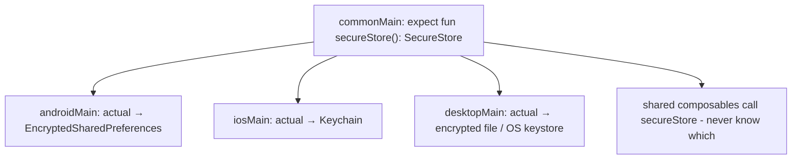
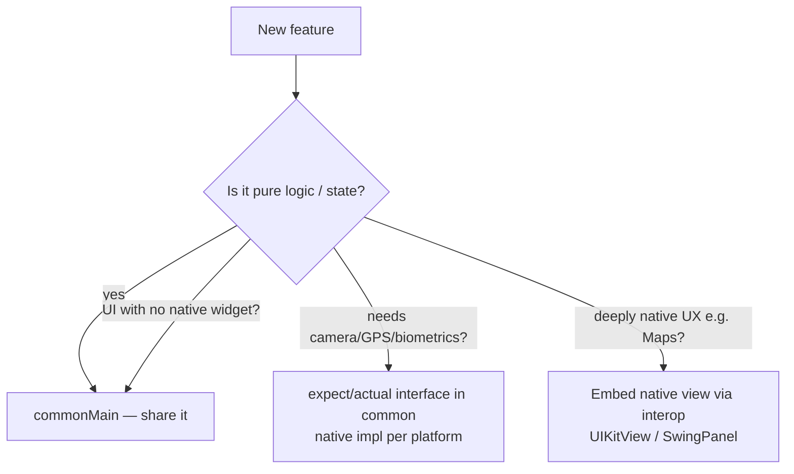

# Lesson 02 — Compose Multiplatform

> After this lesson you can decide whether to share UI with Compose Multiplatform, structure a `commonMain` UI with `expect`/`actual` platform glue, and explain what's genuinely shared vs. what stays native.

**Module:** 15 · **Lesson:** 02 · **Level:** 🟢🟡🔴 · **Est. time:** 75–90 min

---

## 1. Concept

### 🟢 For beginners — *what is it and why do I care?*

You already know **Jetpack Compose** for Android. **Compose Multiplatform (CMP)** is the same UI toolkit — the same `@Composable` functions, `Row`, `Column`, `Modifier`, `Text`, Material 3 — but able to run on **iOS, desktop (JVM), and web** too, not just Android. It's built by **JetBrains** on top of **Kotlin Multiplatform (KMP)**.

The promise: write your screens **once** in shared Kotlin, and they render on multiple platforms. As of 2026, **Compose for iOS is Stable and production-ready** (it reached Stable in CMP 1.8.0, May 2025), and the toolkit has continued shipping (1.11.0 and beyond) with better iOS/web support and refreshed UI testing.

What does *not* magically become cross-platform:

- **Platform features** — camera, GPS, biometrics, secure storage, push notifications. You still write those per platform (or use a KMP library that wraps them).
- **The "edges"** — app startup, the iOS app delegate, permissions, deep-link plumbing.

So the mental split is: **shared UI + shared logic in the middle, thin native shells at the edges.**

### 🟡 For intermediate devs — *the mechanism*

A KMP project organizes code by **source set**:

- `commonMain` — code that compiles for **all** targets. Your shared composables, ViewModels, repositories, and `UiState` live here.
- `androidMain`, `iosMain`, `desktopMain` (`jvmMain`), `wasmJsMain` — **platform** code.

The bridge between them is the **`expect`/`actual`** mechanism: `commonMain` declares an `expect` API (a contract), and each platform provides the `actual` implementation.

```kotlin
// commonMain — the contract
expect fun platformName(): String

// androidMain
actual fun platformName(): String = "Android ${android.os.Build.VERSION.SDK_INT}"

// iosMain
actual fun platformName(): String = UIDevice.currentDevice.systemName()
```

Compose-specific pieces you'll use in `commonMain`:

- **Compose Resources** — a multiplatform resource system (`Res.drawable.*`, `Res.string.*`, `stringResource(...)`, `painterResource(...)`) so images and strings are shared, not duplicated per platform.
- **`@Preview`** works in common code (rendered by the IDE).
- **Lifecycle & ViewModel** — JetBrains ships multiplatform versions of `androidx.lifecycle` `ViewModel` and `collectAsStateWithLifecycle`, so your UDF architecture from Module 03 carries over almost verbatim.
- **Navigation** — type-safe Navigation Compose is available in common code, so one nav graph drives all platforms.

Each platform has a small entry point: Android hosts the composable in an `Activity` via `setContent`; iOS wraps it in a `UIViewController` (`ComposeUIViewController { App() }`) consumed from Swift; desktop uses `application { Window { App() } }`.

### 🔴 For senior devs — *trade-offs, edges, internals*

The decisions that determine whether CMP is a win or a regret:

- **Rendering models differ by platform — know your renderer.** Android uses the native Android Compose runtime. iOS, desktop, and web render Compose via **Skia** (Skiko). That means on iOS your Compose UI is **drawn by Skia into a `UIView`**, not translated to UIKit widgets. Pros: pixel-identical UI, full control. Cons: you must deliberately bridge to native components (maps, web views, native text input nuances, accessibility) — they aren't free.
- **Native interop is a first-class need, not an escape hatch.** You'll embed platform views inside Compose (`UIKitView`/`UIKitViewController` on iOS; `SwingPanel` on desktop) and embed Compose inside native screens. Plan an **interop boundary** in your architecture for maps, camera preview, exoplayer-style surfaces, and rich native text.
- **Accessibility & platform feel.** CMP supports iOS accessibility (VoiceOver, Full Keyboard Access, AssistiveTouch), but "looks native" ≠ "feels native." Scroll physics, text selection menus, and back-gesture conventions need attention. Teams that ship great CMP apps treat platform conventions as requirements, not afterthoughts.
- **What to share is an architecture decision.** The highest-ROI sharing is usually **logic** (ViewModels, use cases, repositories, networking, serialization, DB via SQLDelight/Room-KMP) — even *without* sharing UI. Sharing UI on top is additive. Many teams adopt KMP for the logic core first, then expand to CMP UI screen-by-screen.
- **Library availability & `expect`/`actual` cost.** Not every Android library is multiplatform. Each platform-specific need is an `expect`/`actual` you own. Audit your dependency graph before promising "share everything." Ktor (networking), kotlinx.serialization, kotlinx.coroutines, kotlinx.datetime, Koin/Hilt-style DI all have multiplatform stories; many Android-only SDKs do not.
- **Build & CI complexity.** Multiplatform builds are heavier: Kotlin/Native compilation for iOS, Xcode integration, larger CI matrices, and longer cold builds. This is a real, ongoing tax — weigh it against the duplication you're removing.

### Analogy

CMP is a **theatre touring company**. The **script and direction** (your composables and logic) travel unchanged to every city. But each **venue** (platform) has its own **stage crew and local rigging** (native camera, GPS, the app shell). The performance is the same everywhere because the script is shared; the *load-in* — power, doors, local safety rules — is handled by a small local crew at each venue. A great tour invests in both: one excellent script **and** competent local crews. Pretending the venues are identical is how shows go wrong.

### Mental model

> **Share the middle, not the edges.** UI and logic live in `commonMain`; platform capabilities and app shells live in `androidMain`/`iosMain`/`desktopMain` behind `expect`/`actual`. On non-Android targets Compose draws via Skia, so plan deliberate native-interop seams.

### Real-world example

A fintech ships a KMP **logic core** (auth, account models, networking, validation) shared across an existing native-Android and native-iOS app — zero shared UI at first. A quarter later they migrate the **transaction history** and **settings** screens to CMP (`commonMain`), reusing their `StateFlow<UiState>` ViewModels verbatim, while keeping the **camera-based check deposit** screen native on each platform behind an `expect`/`actual` interface. Two platforms, one history screen, one settings screen, two native deposit flows.

---

## 2. Visual Learning

**ASCII — source-set layout:**
```text
                ┌───────────────── commonMain ─────────────────┐
                │  @Composable App()    UiState    ViewModel    │
                │  Navigation graph     Repository  Use cases   │
                │  Compose Resources (Res.string / Res.drawable)│
                │  expect fun secureStore(): SecureStore        │
                └───────────────────────────────────────────────┘
                   ▲ shares ▲              ▲ shares ▲       ▲
          ┌────────┴───┐  ┌──┴─────────┐  ┌─┴──────────┐  ┌─┴──────────┐
          │ androidMain│  │  iosMain   │  │ desktopMain│  │ wasmJsMain │
          │ Activity   │  │ UIViewCtrl │  │ Window     │  │ Canvas     │
          │ actual ... │  │ actual ... │  │ actual ... │  │ actual ... │
          └────────────┘  └────────────┘  └────────────┘  └────────────┘
              native           native (Skia)   native (Skia)  Skia/Wasm
```

**Mermaid — expect/actual resolution:**


**Mermaid — what to share (decision):**


**Illustration prompt (paste into an image generator):**
```text
Illustration: a single glowing blueprint labeled "commonMain: shared UI + logic"
floating at the center. Three identical robots assemble the SAME building from it,
each on a different colored island labeled Android, iOS, Desktop. At the base of each
building sits a small local toolbox labeled with platform-only parts: "Camera",
"Keychain", "App shell". Thin cables labeled "expect/actual" connect the central
blueprint to each toolbox. Caption: "Share the middle, not the edges."
Modern, vibrant, isometric, clear labels, soft gradients.
```

---

## 3. Code

### 🟢 Beginner — a shared composable in `commonMain`

```kotlin
// commonMain/kotlin/App.kt — runs on Android, iOS, desktop, web
import androidx.compose.material3.*
import androidx.compose.runtime.*

@Composable
fun App() {
    MaterialTheme {
        var count by remember { mutableStateOf(0) }
        Column {
            Text("Shared count: $count")              // identical on every platform
            Button(onClick = { count++ }) { Text("Increment") }
        }
    }
}
```

```kotlin
// androidMain — host it in an Activity
class MainActivity : ComponentActivity() {
    override fun onCreate(savedInstanceState: Bundle?) {
        super.onCreate(savedInstanceState)
        setContent { App() }                          // same App()
    }
}
```

```swift
// iOS (Swift) — consume the shared UI from a UIViewController factory
struct ComposeView: UIViewControllerRepresentable {
    func makeUIViewController(context: Context) -> UIViewController {
        MainViewControllerKt.MainViewController()      // wraps ComposeUIViewController { App() }
    }
    func updateUIViewController(_ vc: UIViewController, context: Context) {}
}
```

**Explanation.** One `App()` composable in `commonMain` is hosted by a tiny per-platform shell: `setContent { App() }` on Android, a `ComposeUIViewController { App() }` exposed to Swift on iOS. The UI code is genuinely shared; only the *entry point* differs.

**Common mistakes.**
```kotlin
// ❌ Importing an Android-only type into commonMain → won't compile for iOS/desktop.
import android.os.Build                    // not available in commonMain
@Composable fun App() { Text(Build.MODEL) } // breaks the iOS/desktop targets
```
- Putting `android.*` / `java.*`-only APIs in `commonMain`.
- Assuming `setContent` exists on iOS — it doesn't; iOS uses the `UIViewController` factory.

**Best practices.**
- Keep `commonMain` free of platform-only imports; reach for `expect`/`actual` when you need them.
- Treat each platform's entry point as a **thin shell** that just calls your shared root composable.

---

### 🟡 Intermediate — `expect`/`actual` + shared ViewModel & resources

```kotlin
// commonMain — contract for a platform capability
expect class Clock() {
    fun nowIsoString(): String
}

// commonMain — shared ViewModel (multiplatform androidx.lifecycle)
class GreetingViewModel(private val clock: Clock) : ViewModel() {
    private val _state = MutableStateFlow("")
    val state: StateFlow<String> = _state.asStateFlow()
    fun refresh() { _state.value = "Hello at ${clock.nowIsoString()}" }
}

// commonMain — shared screen using Compose Resources + lifecycle collection
@Composable
fun GreetingScreen(vm: GreetingViewModel) {
    val text by vm.state.collectAsStateWithLifecycle()
    Column {
        Image(painterResource(Res.drawable.logo), contentDescription = null) // shared asset
        Text(text.ifEmpty { stringResource(Res.string.tap_to_greet) })       // shared string
        Button(onClick = vm::refresh) { Text(stringResource(Res.string.refresh)) }
    }
}
```

```kotlin
// androidMain
actual class Clock {
    actual fun nowIsoString(): String =
        java.time.OffsetDateTime.now().toString()
}
// iosMain
actual class Clock {
    actual fun nowIsoString(): String =
        NSISO8601DateFormatter().stringFromDate(NSDate())
}
```

**Explanation.** `commonMain` declares an `expect class Clock`; each platform supplies the `actual`. The **ViewModel** and **screen** stay fully shared — including `collectAsStateWithLifecycle` and **Compose Resources** (`Res.drawable`/`Res.string`), so images and copy live once. Your Module 03 UDF (StateFlow + lifecycle collection) ports over unchanged.

**Common mistakes.**
```kotlin
// ❌ expect/actual signatures that don't match exactly → "actual has no corresponding expect".
expect class Clock { fun now(): String }            // common
actual class Clock { actual fun nowIsoString(): String = "" } // name mismatch → error
```
- Duplicating drawables/strings per platform instead of using Compose Resources.
- Leaking a platform type through the `expect` API (e.g. returning `NSDate`), which breaks Android.

**Best practices.**
- Keep `expect` APIs **platform-neutral** (return `String`/your own types, not `NSDate`/`java.time`).
- Match `expect`/`actual` signatures exactly; let the IDE generate the `actual` stubs.
- Centralize assets/strings in **Compose Resources** so there's a single source of truth.

---

### 🔴 Production — an interop seam for a native-only feature

```kotlin
// commonMain — define the capability your shared UI needs, abstractly.
interface BiometricAuth {
    suspend fun authenticate(reason: String): AuthResult
}
enum class AuthResult { SUCCESS, FAILED, UNAVAILABLE }

// commonMain — shared screen depends only on the abstraction (DI-injected).
@Composable
fun UnlockScreen(auth: BiometricAuth, onUnlocked: () -> Unit) {
    val scope = rememberCoroutineScope()
    var status by remember { mutableStateOf<AuthResult?>(null) }
    Column {
        Button(onClick = {
            scope.launch {
                status = auth.authenticate("Unlock your vault")
                if (status == AuthResult.SUCCESS) onUnlocked()
            }
        }) { Text("Unlock") }
        if (status == AuthResult.FAILED) Text("Authentication failed")
    }
}
```

```kotlin
// androidMain — actual implementation with AndroidX Biometric.
class AndroidBiometricAuth(private val activity: FragmentActivity) : BiometricAuth {
    override suspend fun authenticate(reason: String): AuthResult =
        suspendCancellableCoroutine { cont ->
            val prompt = BiometricPrompt(activity, /* executor */ ContextCompat.getMainExecutor(activity),
                object : BiometricPrompt.AuthenticationCallback() {
                    override fun onAuthenticationSucceeded(r: BiometricPrompt.AuthenticationResult) {
                        cont.resume(AuthResult.SUCCESS)
                    }
                    override fun onAuthenticationError(code: Int, msg: CharSequence) {
                        cont.resume(AuthResult.FAILED)
                    }
                })
            prompt.authenticate(
                BiometricPrompt.PromptInfo.Builder().setTitle(reason)
                    .setNegativeButtonText("Cancel").build()
            )
        }
}
// iosMain — actual implementation with LocalAuthentication (LAContext), elided for brevity.
```

```kotlin
// Embedding a NATIVE view inside shared Compose (iosMain), e.g. a map:
@Composable
fun NativeMap(modifier: Modifier = Modifier) {
    UIKitViewController(                              // Compose ↔ UIKit interop boundary
        factory = { MKMapViewController() },
        modifier = modifier,
    )
}
```

**Explanation.** The shared `UnlockScreen` knows only the **`BiometricAuth` abstraction**; each platform injects its `actual` engine (AndroidX `BiometricPrompt` / iOS `LAContext`). For truly native UX (a map), you cross the **interop boundary** with `UIKitViewController` on iOS (`SwingPanel` on desktop). This is the production pattern: shared UI + logic, native capability behind an interface, native views embedded only where they earn it.

**Common mistakes.**
```kotlin
// ❌ Putting platform auth code directly in commonMain → won't compile cross-platform.
@Composable fun UnlockScreen() {
    BiometricPrompt(/* Android-only */)             // breaks iOS/desktop builds
}
```
- Forcing a deeply-native experience (maps, camera) to be drawn by Compose instead of embedding the native view.
- Forgetting iOS accessibility/back-gesture conventions because "it renders fine on Android."

**Best practices.**
- Depend on **interfaces** in `commonMain`; inject platform engines via DI (Koin/Hilt-style).
- Use **native-view interop** (`UIKitView(Controller)`, `SwingPanel`) for native-feel surfaces; don't reimplement them in Compose.
- Treat platform conventions (accessibility, gestures, scroll physics) as **acceptance criteria**, not polish.

---

## 4. Interview Questions

**🟢 Beginner**

1. *What is Compose Multiplatform?*
   > JetBrains' UI framework that runs Jetpack Compose code on Android, iOS, desktop (JVM), and web, built on Kotlin Multiplatform. The same `@Composable` functions render across platforms.
2. *What's the difference between `commonMain` and `androidMain`?*
   > `commonMain` holds code that compiles for **all** targets (shared UI/logic); `androidMain` (and `iosMain`, etc.) hold platform-specific code, including `actual` implementations of `expect` declarations.

**🟡 Intermediate**

3. *What is `expect`/`actual` and when do you use it?*
   > A KMP mechanism where `commonMain` declares an `expect` API (the contract) and each platform provides the `actual` implementation. You use it for anything platform-specific that shared code needs (time, secure storage, biometrics).
4. *How do you handle images and strings across platforms in CMP?*
   > With **Compose Resources** (`Res.drawable.*`, `Res.string.*`, `painterResource`, `stringResource`) in `commonMain`, so assets and copy are defined once rather than duplicated per platform.
5. *Does your Android UDF architecture transfer to CMP?*
   > Largely yes — multiplatform `androidx.lifecycle` `ViewModel`, `StateFlow`, `collectAsStateWithLifecycle`, and type-safe Navigation are available in `commonMain`, so the state-down/events-up loop ports nearly verbatim.

**🔴 Senior**

6. *How does CMP render on iOS, and what are the consequences?*
   > Via **Skia (Skiko)**, drawing into a `UIView` rather than mapping to UIKit widgets. Consequences: pixel-identical UI and full control, but native components (maps, web views, native text/accessibility) must be deliberately bridged through interop boundaries — they aren't automatic.
7. *When would you adopt KMP but NOT share UI?*
   > When the biggest duplication is **logic** (models, networking, validation, persistence) and the teams want to keep platform-native UI/UX. Sharing a KMP logic core first de-risks adoption; CMP UI can be added screen-by-screen later.
8. *What are the main costs/risks of CMP you'd raise in a design review?*
   > Heavier builds/CI (Kotlin/Native + Xcode), library availability gaps (every gap is an `expect`/`actual` you own), native-feel work (gestures, accessibility, scroll physics), and the interop boundary for native widgets. Weigh these against the duplication removed.

---

## 5. AI Assistant

**Prompt example (scoping a migration):**
```text
We have a native Android app (Kotlin, Compose, MVVM with StateFlow) and a native iOS app (Swift).
Help me scope moving to Kotlin Multiplatform. (1) Propose which layers to share first
(logic vs UI) and why. (2) For our SecureStorage, Camera, and Push features, draft the
commonMain expect interfaces and list the androidMain/iosMain actual backends. (3) Flag any of
our dependencies that are NOT multiplatform-friendly. Here is our module graph and key deps:
[paste]. Target: Compose Multiplatform (current stable), Kotlin 2.x.
```

**AI workflow — where it helps on *this* topic.**
- ✅ Great for: drafting `expect`/`actual` interface skeletons, generating the per-platform entry-point boilerplate, converting Android-only imports to platform-neutral abstractions, and listing likely non-multiplatform dependencies to investigate.
- ⚠️ Not for: the **share-vs-native UX call** (maps, camera, native text) — that's a judgment about platform feel; and not for asserting a library *is* multiplatform (verify on the library's KMP docs — models hallucinate KMP support).

**Review workflow — check AI output against this lesson's *Common Mistakes*:**
- Did any `commonMain` code sneak in `android.*`/`java.*`-only or `NS*`/`UIKit` imports?
- Do `expect`/`actual` **signatures match exactly**, and are the `expect` APIs **platform-neutral** (no `NSDate`/`java.time` leaking)?
- Are images/strings going through **Compose Resources**, not duplicated per platform?
- For native-feel features, did it **embed a native view** (interop) rather than reimplement in Compose?

**Validation workflow — prove it actually works:**
1. **Compile every target** (`:composeApp:assembleDebug`, the iOS framework task, the desktop run task). Cross-platform bugs surface as *compile* errors in the platform source sets.
2. **Run on at least two platforms** (Android emulator + iOS simulator/desktop) and confirm the shared screen renders and behaves.
3. **Exercise the interop seam** (e.g. trigger biometrics / show the native map) on each platform.
4. **Spot-check platform feel**: back gesture, text selection, VoiceOver on iOS — the things "renders fine" hides.

> **AI drafts, you decide.** Let the model scaffold `expect`/`actual` and shells; you own the *what-to-share* boundary and verify library multiplatform support against real docs, not the model's memory.

---

## Recap / Key takeaways

- **CMP** runs Compose on Android/iOS/desktop/web; **Compose for iOS is Stable** (since CMP 1.8.0) and production-ready in 2026.
- **Share the middle** (UI + logic in `commonMain`), keep **edges native** (`androidMain`/`iosMain`/…) behind **`expect`/`actual`**.
- Your **UDF stack ports over**: multiplatform `ViewModel`, `StateFlow`, `collectAsStateWithLifecycle`, type-safe Navigation, Compose Resources.
- On non-Android targets Compose renders via **Skia**, so plan **native-interop seams** (`UIKitView(Controller)`, `SwingPanel`) for maps, camera, and native text/accessibility.
- The biggest early ROI is often **shared logic**, not shared UI — adopt incrementally and weigh build/CI cost.

➡️ Next: **[Lesson 03 — Adaptive across form factors](03-adaptive-form-factors.md)** — foldables and tablets with `material3-adaptive`, window size classes, and pane scaffolds.
