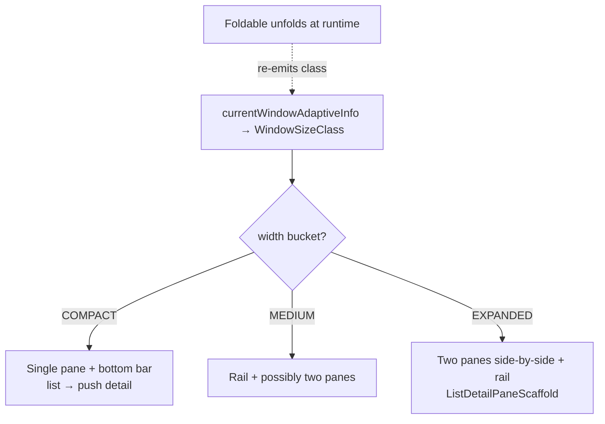
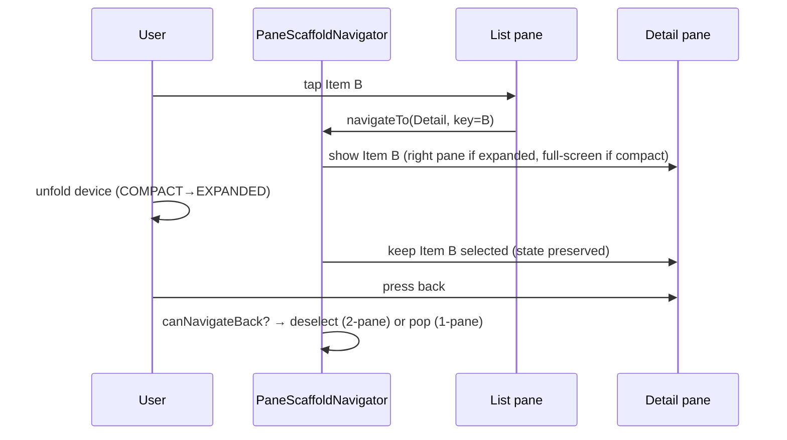

# Lesson 03 — Adaptive Across Form Factors

> After this lesson you can build a layout that adapts across phones, foldables, and tablets using `WindowSizeClass`, `NavigationSuiteScaffold`, and the list–detail pane scaffolds from `material3-adaptive`.

**Module:** 15 · **Lesson:** 03 · **Level:** 🟢🟡🔴 · **Est. time:** 80–95 min

---

## 1. Concept

### 🟢 For beginners — *what is it and why do I care?*

Android no longer means "a 6-inch phone." Your app runs on **small phones, large phones, foldables** (that open into a small tablet), **tablets**, **ChromeOS**, and in **resizable/free-form windows**. A layout that looks great on a phone often wastes a tablet's screen — a single skinny column down the middle with oceans of empty space on the sides.

**Adaptive UI** means the *same app* rearranges itself to fit the available space:

- On a **phone**: a list, and tapping an item opens a **separate** detail screen.
- On a **tablet/unfolded foldable**: the **list and detail show side-by-side** (two panes), so tapping an item updates the right-hand pane in place.
- Navigation moves too: a **bottom bar** on phones becomes a **navigation rail** (or a wide drawer) on larger screens.

Google ships a library for exactly this — **`androidx.compose.material3.adaptive`** — so you don't hand-roll the breakpoints. The key idea: **react to how much space you have (a "window size class"), not to "is this a phone or tablet?"**

### 🟡 For intermediate devs — *the mechanism*

Two building blocks:

**1) `WindowSizeClass`** — buckets the current window into coarse sizes so you branch on *space*, not device:

- Width: `COMPACT` (phone portrait), `MEDIUM` (foldable/large phone landscape, small tablet), `EXPANDED` (tablet, desktop).
- Height: `COMPACT` / `MEDIUM` / `EXPANDED`.

You compute it with `currentWindowAdaptiveInfo()` (from the adaptive library) and switch layouts on the bucket.

**2) Adaptive scaffolds** (the `material3-adaptive` artifacts, stable since 1.0 in 2024 and steadily improved through 2025–2026):

- **`NavigationSuiteScaffold`** — you declare your top-level destinations once; it **automatically** renders a bottom bar, navigation rail, or drawer based on window size.
- **`ListDetailPaneScaffold`** / **`NavigableListDetailPaneScaffold`** — the canonical **list↔detail** pattern. It shows one pane on compact widths and two panes side-by-side on expanded widths, and a navigator drives which pane is "active." There's also `SupportingPaneScaffold` for a primary + supporting pane.

The library is **layered** into artifacts so you take only what you need:

- `material3-adaptive` — core window-info APIs (`currentWindowAdaptiveInfo`, posture).
- `material3-adaptive-layout` — the pane scaffolds (`ListDetailPaneScaffold`, `SupportingPaneScaffold`).
- `material3-adaptive-navigation` — the navigator (`rememberListDetailPaneScaffoldNavigator`) and the `Navigable*` variants that wire in back handling.

### 🔴 For senior devs — *trade-offs, edges, internals*

- **Size class is the contract, not the device.** Always branch on `WindowSizeClass`/window metrics, never on `Build`/screen inches. A free-form window on a tablet can be `COMPACT` width; a foldable can change class **at runtime** when it folds/unfolds. Your composables must react to the class as state, which they get for free because `currentWindowAdaptiveInfo()` is observable.
- **Posture & hinges matter on foldables.** Beyond size, foldables expose **posture** (flat vs half-open/"tabletop") and a **hinge/fold** with bounds. The pane scaffolds account for hinge separation; for custom layouts you read `WindowAdaptiveInfo.windowPosture` to avoid placing critical content under the fold. (The adaptive library wraps Jetpack WindowManager's `FoldingFeature`.)
- **Navigation state must survive a fold.** When a foldable unfolds from one pane to two, the user shouldn't lose their place. The pane **navigator** (`rememberListDetailPaneScaffoldNavigator`, ideally with a `SavedStateHandle`-backed key) preserves which item is selected across the layout change and across rotation/process death. Hand-rolled "isDetailOpen: Boolean" state usually breaks here.
- **Back behavior differs per pane configuration.** In two-pane mode, "back" from detail might deselect rather than pop the screen; in single-pane mode it pops. The `Navigable*` scaffolds and the navigator's `canNavigateBack()`/`navigateBack()` encode this. Wiring your own `BackHandler` naively double-handles or strands the user.
- **Don't fork into two codebases.** The anti-pattern is a `if (isTablet) TabletScreen() else PhoneScreen()` with **duplicated** content. The win of adaptive APIs is *one* content definition placed into different *containers*. Duplication doubles your bug surface and drifts.
- **Reflow, margins, edge-to-edge (2025–2026).** Recent releases added **reflow** strategies (a pane can reflow beneath another in single-pane mode), pane **margins**, and proper **edge-to-edge** support. Use these instead of manual insets math.
- **Test the matrix.** Resizable emulators, the foldable emulator (with the fold toggle), and `WindowSizeClass` previews are the only way to catch class-transition bugs. Treat "unfold mid-task" and "resize the window" as test cases.

### Analogy

Think of a **restaurant that reconfigures its dining room** for the crowd. Same menu, same kitchen (your content and logic). For a couple (a phone), it sets **one small table** and you move rooms for the next course. For a big party (a tablet), it pushes tables together so **everything is in front of you at once** (two panes). When more guests arrive mid-meal (the foldable unfolds), the staff *expand the table without making you start over* — your plates stay put (navigation state preserved). A bad restaurant keeps two entirely separate dining rooms with separate menus that drift apart; a good one **reconfigures one room**.

### Mental model

> **Branch on space, not on device.** Compute a `WindowSizeClass`, define your content **once**, and let adaptive scaffolds drop it into one-pane or two-pane containers — preserving navigation state across folds, rotations, and resizes.

### Real-world example

Gmail/Settings-style apps: on a phone you see a list of conversations; tapping opens the thread full-screen. On a tablet or unfolded foldable, the conversation list sits on the left and the open thread fills the right pane; tapping a new conversation swaps the right pane without leaving the screen. The bottom navigation on the phone becomes a rail on the tablet. One app, one content definition, many shapes.

---

## 2. Visual Learning

**ASCII — same content, two containers:**
```text
  COMPACT width (phone)                 EXPANDED width (tablet / unfolded)
  ┌───────────────┐  tap item            ┌──────────┬───────────────────┐
  │  LIST          │ ───────────▶         │  LIST    │  DETAIL           │
  │  • Item A      │   navigates to        │ • Item A │  Item A contents  │
  │  • Item B      │   full-screen detail  │ • Item B │  (updates in      │
  │  • Item C      │                       │ • Item C │   place on tap)   │
  └───────────────┘                       └──────────┴───────────────────┘
  bottom nav bar                          navigation rail (left)
        └─ ONE content definition placed into different scaffolds ─┘
```

**Mermaid — size class drives the layout:**


**Mermaid — pane navigator state across configurations:**


**Illustration prompt (paste into an image generator):**
```text
Illustration: one app shown morphing across three device silhouettes left-to-right —
a phone (single column with a bottom bar), a half-open foldable (transitioning), and a
tablet (two side-by-side panes: a list on the left, a detail on the right, with a
navigation rail). A glowing ruler labeled "WindowSizeClass: COMPACT → MEDIUM → EXPANDED"
runs beneath them. A single shared "content" chip floats above, with arrows showing it
dropped into each device's container unchanged. Caption: "Branch on space, not device."
Modern, vibrant, isometric, clear labels.
```

---

## 3. Code

### 🟢 Beginner — branch on `WindowSizeClass`

```kotlin
import androidx.compose.material3.adaptive.currentWindowAdaptiveInfo
import androidx.window.core.layout.WindowWidthSizeClass

@Composable
fun HomeScreen() {
    val widthClass = currentWindowAdaptiveInfo().windowSizeClass.windowWidthSizeClass

    if (widthClass == WindowWidthSizeClass.EXPANDED) {
        Row {
            ListPane(Modifier.weight(1f))
            DetailPane(Modifier.weight(2f))     // two panes when there's room
        }
    } else {
        ListPane(Modifier.fillMaxSize())        // single pane on compact width
    }
}
```

**Explanation.** `currentWindowAdaptiveInfo()` gives an **observable** `WindowSizeClass`. You branch on the **width bucket**, not on the device. Because it's observable, folding/unfolding or resizing re-emits a new class and the UI re-lays-out automatically.

**Common mistakes.**
```kotlin
// ❌ Branching on the device instead of the window → wrong on free-form windows & foldables.
val isTablet = resources.configuration.smallestScreenWidthDp >= 600
if (isTablet) TwoPane() else OnePane()          // ignores resizable windows, won't react to folds
```
- Reading raw `Configuration.screenWidthDp` and inventing your own breakpoints.
- Assuming the class is fixed for the app's lifetime — it can change at runtime.

**Best practices.**
- Use `WindowSizeClass` from `currentWindowAdaptiveInfo()`; branch on **width/height buckets**.
- Let the observable class drive recomposition — don't cache "isTablet" once at startup.

---

### 🟡 Intermediate — adaptive top-level navigation

```kotlin
import androidx.compose.material3.adaptive.navigationsuite.NavigationSuiteScaffold

enum class Destination(val label: String, val icon: ImageVector) {
    Home("Home", Icons.Default.Home),
    Library("Library", Icons.Default.LibraryBooks),
    Profile("Profile", Icons.Default.Person),
}

@Composable
fun AppShell() {
    var current by rememberSaveable { mutableStateOf(Destination.Home) }

    NavigationSuiteScaffold(
        navigationSuiteItems = {
            Destination.entries.forEach { dest ->
                item(
                    selected = dest == current,
                    onClick = { current = dest },
                    icon = { Icon(dest.icon, contentDescription = dest.label) },
                    label = { Text(dest.label) },
                )
            }
        }
    ) {
        when (current) {                          // ONE content definition per destination
            Destination.Home -> HomeScreen()
            Destination.Library -> LibraryScreen()
            Destination.Profile -> ProfileScreen()
        }
    }
}
```

**Explanation.** You declare destinations **once**; `NavigationSuiteScaffold` automatically renders a **bottom bar** on compact widths, a **navigation rail** on medium, and a **drawer** on expanded — no manual breakpoints. Selection state is hoisted in `rememberSaveable`, so it survives rotation. The content slot stays identical across all navigation shapes.

**Common mistakes.**
```kotlin
// ❌ Hand-rolling: pick a NavigationBar vs NavigationRail yourself based on a flag.
if (widthClass == EXPANDED) NavigationRail { /* items */ } else NavigationBar { /* items duplicated */ }
```
- **Duplicating** the item list across a hand-written bar/rail (they drift).
- Not hoisting selection → resets on rotation.

**Best practices.**
- Prefer `NavigationSuiteScaffold` over manually switching bar/rail/drawer.
- Declare destinations **once**; hoist the selected destination in `rememberSaveable`.

---

### 🔴 Production — list–detail with a state-preserving navigator

```kotlin
import androidx.compose.material3.adaptive.layout.AnimatedPane
import androidx.compose.material3.adaptive.layout.ListDetailPaneScaffold
import androidx.compose.material3.adaptive.layout.ListDetailPaneScaffoldRole
import androidx.compose.material3.adaptive.navigation.NavigableListDetailPaneScaffold
import androidx.compose.material3.adaptive.navigation.rememberListDetailPaneScaffoldNavigator
import kotlinx.coroutines.launch

@Composable
fun MailScreen(
    items: ImmutableList<Mail>,
    onItemDetail: (String) -> Mail?,
) {
    // The navigator preserves the selected pane/key across fold, rotation, and process death.
    val navigator = rememberListDetailPaneScaffoldNavigator<String>()  // key = mail id
    val scope = rememberCoroutineScope()

    NavigableListDetailPaneScaffold(
        navigator = navigator,
        listPane = {
            AnimatedPane {
                MailList(
                    items = items,
                    onSelect = { id ->
                        scope.launch {
                            navigator.navigateTo(ListDetailPaneScaffoldRole.Detail, id)
                        }
                    },
                )
            }
        },
        detailPane = {
            AnimatedPane {
                val id = navigator.currentDestination?.contentKey
                val mail = id?.let(onItemDetail)
                if (mail != null) MailDetail(mail) else EmptyDetailPlaceholder()
            }
        },
    )
}
```

**Explanation.** `NavigableListDetailPaneScaffold` + `rememberListDetailPaneScaffoldNavigator` give you the full pattern: **two panes when expanded, one pane (push/pop) when compact**, with **back handling** wired in (`Navigable*` registers a `BackHandler` that deselects in two-pane mode and pops in one-pane mode). The navigator stores the **selected key** (`String` mail id), so unfolding the device or rotating keeps the user on the same mail. `AnimatedPane` animates pane transitions. You define list and detail content **once**; the scaffold decides placement.

**Common mistakes.**
```kotlin
// ❌ Rolling your own selection + back handling → breaks on fold/rotation; double-handles back.
var selectedId by remember { mutableStateOf<String?>(null) }   // lost on process death
BackHandler(enabled = selectedId != null) { selectedId = null } // fights the scaffold in 2-pane mode
Row { List(onSelect = { selectedId = it }); if (selectedId != null) Detail(selectedId) }
```
- A plain `Boolean isDetailOpen` instead of the navigator → loses position on unfold/rotation.
- Manual `BackHandler` that double-handles back in two-pane mode.
- Placing critical content/controls under the **fold** on foldables (read posture for custom layouts).

**Best practices.**
- Use the **pane navigator** for selection + back; let `Navigable*` own back behavior.
- Persist the selected **key** (not the whole object) so it rehydrates after process death.
- For custom layouts on foldables, read `currentWindowAdaptiveInfo().windowPosture` and avoid the hinge region.
- Use `AnimatedPane`, pane margins, and the reflow strategy instead of manual inset/animation math.

---

## 4. Interview Questions

**🟢 Beginner**

1. *What is adaptive UI on Android?*
   > UI that rearranges itself to fit the available window — e.g. one pane on a phone, two panes side-by-side on a tablet — instead of forcing a phone layout everywhere.
2. *What is a `WindowSizeClass`?*
   > A coarse bucket (COMPACT / MEDIUM / EXPANDED for width and height) describing how much window space you have, so you branch on space rather than on a specific device.

**🟡 Intermediate**

3. *Why branch on `WindowSizeClass` instead of screen size in dp or `Build` info?*
   > Because the window — not the physical device — is what you're laying out into. Free-form/multi-window and foldables mean a "tablet" can present a COMPACT window, and the class can change at runtime; size classes capture that, raw dp checks don't.
4. *What does `NavigationSuiteScaffold` do for you?*
   > You declare top-level destinations once and it automatically renders the right navigation UI for the window size — bottom bar (compact), navigation rail (medium), or drawer (expanded) — no manual breakpoint code.
5. *Which `material3-adaptive` artifact gives you the list–detail scaffold vs. the navigator?*
   > `material3-adaptive-layout` provides `ListDetailPaneScaffold`/`SupportingPaneScaffold`; `material3-adaptive-navigation` provides `rememberListDetailPaneScaffoldNavigator` and the `Navigable*` variants; `material3-adaptive` provides core window info.

**🔴 Senior**

6. *How do you keep navigation state correct when a foldable unfolds mid-task?*
   > Drive selection through the pane **navigator** (`rememberListDetailPaneScaffoldNavigator`) storing the selected **key**, not an ad-hoc `Boolean`. The class change re-emits and the scaffold re-lays-out into two panes while the navigator preserves the selected item; back the key with `SavedStateHandle` so it also survives rotation/process death.
7. *How does "back" behave differently across pane configurations, and how do you handle it?*
   > In two-pane (expanded) mode, back from detail typically **deselects** rather than leaving the screen; in single-pane (compact) mode it **pops** the detail. The `Navigable*` scaffolds encode this via the navigator's `canNavigateBack()`/`navigateBack()`, so you don't wire a competing `BackHandler` yourself.
8. *What's the anti-pattern that adaptive APIs exist to prevent?*
   > Forking into duplicated `PhoneScreen()`/`TabletScreen()` content. Adaptive scaffolds let you define content **once** and place it into different containers, avoiding double maintenance and drift; foldable **posture/hinge** awareness then prevents placing content under the fold.

---

## 5. AI Assistant

**Prompt example (refactor to adaptive):**
```text
Refactor this phone-only list→detail flow to be adaptive. Use currentWindowAdaptiveInfo for
WindowSizeClass, NavigableListDetailPaneScaffold with rememberListDetailPaneScaffoldNavigator
(key = item id) so two panes show on EXPANDED width and a single pane with proper back handling
on COMPACT. Keep my item content composables unchanged (define content once). Wrap the top-level
nav in NavigationSuiteScaffold. Target: Compose BOM 2026, material3-adaptive (current stable),
Kotlin 2.x. Here's the code: [paste].
```

**AI workflow — where it helps on *this* topic.**
- ✅ Great for: converting a single-pane flow to `ListDetailPaneScaffold`, wiring `NavigationSuiteScaffold`, and generating the navigator/back boilerplate.
- ⚠️ Not for: deciding the **breakpoint UX** (when two panes actually help your content) or **foldable posture** decisions; and it often **invents** adaptive API names — verify `currentWindowAdaptiveInfo`, `rememberListDetailPaneScaffoldNavigator`, `ListDetailPaneScaffoldRole` against the current `material3-adaptive` docs.

**Review workflow — check AI output against this lesson's *Common Mistakes*:**
- Does it branch on **`WindowSizeClass`** (not `Configuration.screenWidthDp`/`Build`)?
- Is content defined **once** and placed into panes — no duplicated `PhoneScreen`/`TabletScreen`?
- Does it use the **navigator** for selection + back (not a `Boolean isDetailOpen` + manual `BackHandler`)?
- Is the selected **key** persisted (survives rotation/process death), not the whole object?
- Are the adaptive **API names real** (no hallucinated `rememberAdaptiveScaffold`)?

**Validation workflow — prove it actually works:**
1. **Resizable emulator + foldable emulator:** toggle the fold and resize the window; the layout must switch panes **and keep the selected item**.
2. **Rotate** in both one-pane and two-pane modes; selection persists.
3. **Back button:** confirm it **deselects** in two-pane mode and **pops** in one-pane mode — once, not twice.
4. **`@Preview`** the screen at COMPACT/MEDIUM/EXPANDED to eyeball all three shapes without a device.

> **AI drafts, you decide.** The model can produce the scaffold wiring fast, but verify the adaptive API surface against current docs and own the breakpoint/posture UX decisions.

---

## Recap / Key takeaways

- Adaptive UI reacts to **window space** (`WindowSizeClass` from `currentWindowAdaptiveInfo()`), **not** to device type — the class can change at runtime when folding/resizing.
- **`NavigationSuiteScaffold`** auto-selects bottom bar / rail / drawer from declared destinations.
- **`ListDetailPaneScaffold` / `NavigableListDetailPaneScaffold`** + **`rememberListDetailPaneScaffoldNavigator`** give the canonical one-pane↔two-pane list–detail pattern with correct back handling.
- Define content **once**; persist the selected **key** so state survives folds, rotation, and process death; read **posture** for custom foldable layouts.
- The library is **layered** (`adaptive` / `adaptive-layout` / `adaptive-navigation`) — take only what you need, and prefer it over hand-rolled breakpoints.

➡️ Next: **[Lesson 04 — Wear OS Compose](04-wear-os-compose.md)** — Compose for wearables, `ScalingLazyColumn`, rotary input, and the constraints of a tiny round screen.
