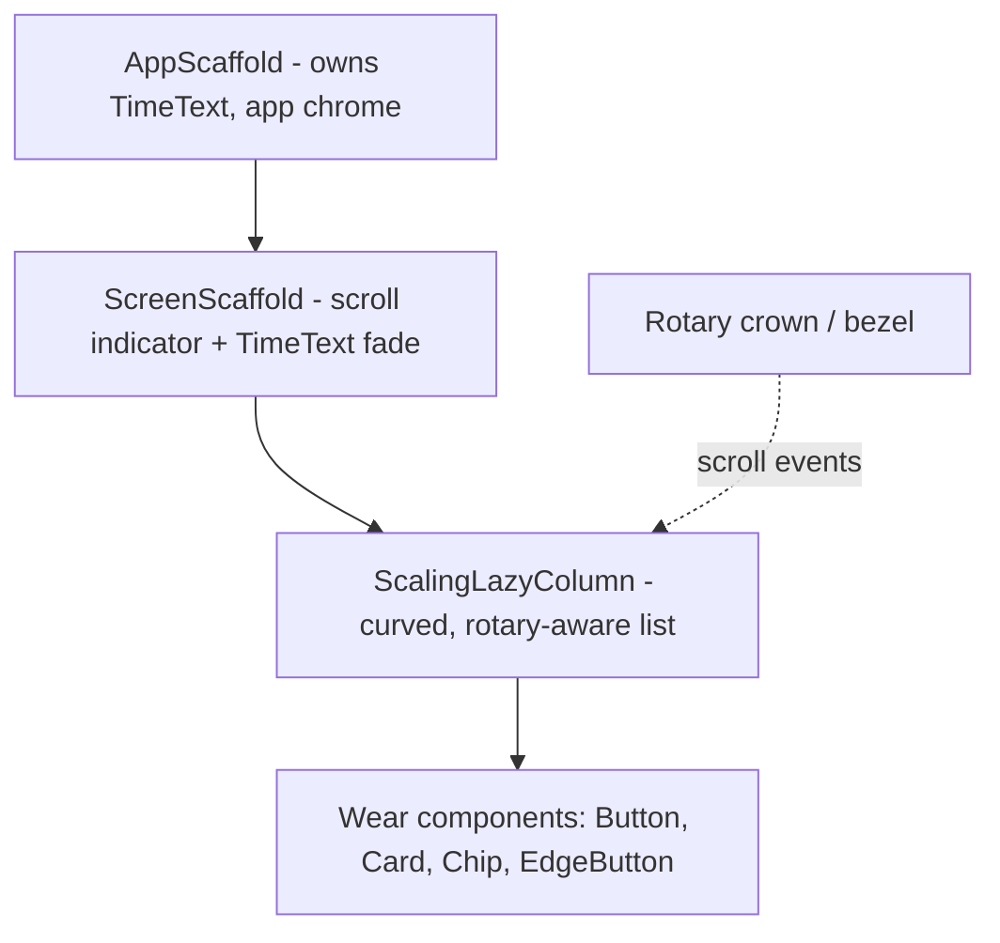
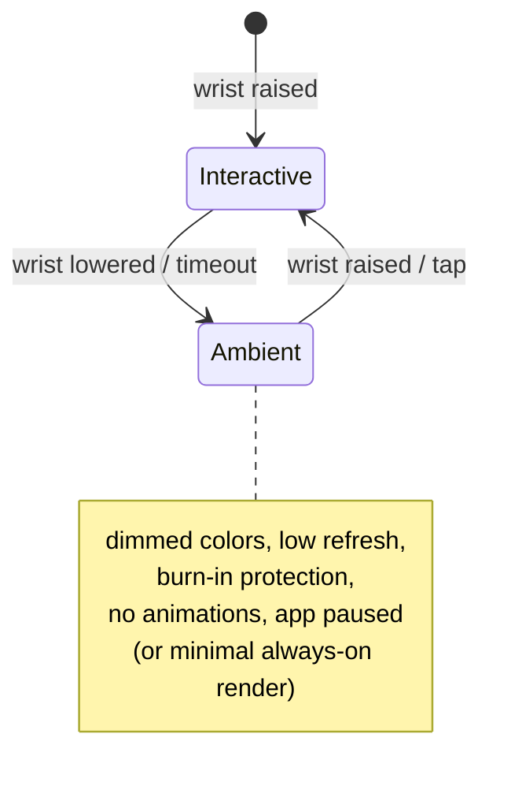

# Lesson 04 — Wear OS Compose

> After this lesson you can build a Wear OS screen with Compose for Wear OS Material 3, lay out a curved list with `ScalingLazyColumn`, handle rotary input, and respect a watch's power and screen constraints.

**Module:** 15 · **Lesson:** 04 · **Level:** 🟢🟡🔴 · **Est. time:** 70–85 min

---

## 1. Concept

### 🟢 For beginners — *what is it and why do I care?*

A smartwatch runs apps too — and you build them with **Compose for Wear OS**, a Wear-specific flavor of Jetpack Compose. The *language* is the same (`@Composable`, `Modifier`, state, recomposition), but the **components are different**: instead of `androidx.compose.material3`, you use **`androidx.wear.compose.material3`**, which has watch-shaped widgets like `Button`, `Card`, `TimeText`, and the curved list `ScalingLazyColumn`.

Why a separate toolkit? Because a watch is **not a tiny phone**:

- The screen is **small and often round**, so content near the edges gets clipped — you can't use a phone's rectangular full-bleed layouts.
- Interaction is brief — a few seconds, a glance. No long forms.
- There's a **rotating side button or bezel** ("rotary input") for scrolling, plus a **physical crown**.
- **Battery is tiny**, so the system aggressively pushes the watch into low-power **ambient mode**, and you must be frugal.

Compose for Wear OS gives you components designed for all of that out of the box.

### 🟡 For intermediate devs — *the mechanism*

The Wear Compose stack (2026) centers on **`androidx.wear.compose.material3`**, which adopts the **Material 3 Expressive** design system for watches. Key pieces:

- **Scaffolding:** `AppScaffold` (app-level, owns `TimeText`) wraps screens; each screen uses `ScreenScaffold`, which coordinates the scroll indicator and `TimeText` fade.
- **`TimeText`** — the curved clock at the top of the screen; a Wear convention you almost always show.
- **Lists:** `ScalingLazyColumn` is the workhorse — a lazy list whose items **scale and fade toward the edges** so the center item is emphasized on a round display. (Newer releases also offer `TransformingLazyColumn` for richer transforms.) Both support **rotary scrolling**.
- **Rotary input:** the crown/bezel sends rotary scroll events; list components handle them when the scrollable node has focus, and you can attach rotary behavior to custom scrollables via the rotary modifiers.
- **Edge button, dialogs, pickers:** `EdgeButton` (a bottom button that hugs the round edge), `AlertDialog`, time/date `Picker`s — all watch-shaped.
- **Tiles & Complications** are *separate* surfaces (glanceable, not full apps), built with their own libraries — important to know they exist even though full apps use Wear Compose.

A minimal screen: `AppScaffold { ScreenScaffold { ScalingLazyColumn { items(...) { ... } } } }`.

### 🔴 For senior devs — *trade-offs, edges, internals*

- **Round geometry is a first-class constraint.** On round watches, the usable area is a circle inscribed in the square; corners are unreachable. `ScalingLazyColumn`'s scaling/fading isn't decoration — it keeps the **focused item centered** where the screen is widest and de-emphasizes edge items that would otherwise clip. Building a plain `LazyColumn` on Wear is a smell; you lose rotary ergonomics and edge handling.
- **Rotary input is the primary scroll, and focus drives it.** Rotary events go to the **focused** scrollable. A common bug: two scrollables, none focused, and the crown does nothing. Recent `ScalingLazyColumn` updates improved focusing on the scrollable node (e.g. so the crown scrolls a Material3 `AlertDialog`). For custom scrollables, request focus and attach the rotary scroll modifier explicitly.
- **Ambient mode & "always-on" change the rules.** When the user lowers their wrist, the system dims to **ambient**: reduced colors, low refresh, burn-in protection. A full app typically pauses; if you support **always-on**, you must provide a low-power rendering (limited colors, no animations, infrequent updates). Animations and frequent recomposition in ambient drain battery and can be throttled.
- **Power budget dominates architecture.** Network/sensor work is expensive on a watch. Prefer **data synced from the phone** (Wearable Data Layer) or **WorkManager** with constraints over chatty foreground polling. Keep recomposition minimal — the same stability lessons from Module 11 matter *more* here.
- **Input & ergonomics.** No keyboard worth typing on; prefer **pickers, chips, voice, and stepper** inputs. Touch targets must be large (fingers + small screen). The **physical button(s)** and rotary should map to the primary action and scroll.
- **Standalone vs phone-dependent.** Wear apps can be **standalone** (installed/runs without a phone) or rely on a companion. Design for standalone where possible; handle the case where the phone isn't connected.
- **Versioning.** Wear Compose has its **own BOM/versions** (`androidx.wear.compose:*`), distinct from the mobile Compose BOM, and Material 3 for Wear (`wear-compose-m3`) is the current design target (Material 3 Expressive). Don't assume mobile `material3` APIs exist on Wear.

### Analogy

Designing for a watch is like designing a **car dashboard** versus a desktop monitor. On a dashboard you have **seconds of glance time**, a few **large, reachable controls**, and a **physical knob** (rotary) you can turn without looking. You'd never put a spreadsheet on a dashboard. The information is **curved toward the driver's eye-line** (scaling list), and at night it dims to a minimal readout (ambient mode) to avoid blinding the driver and draining power. Phone UI is the spreadsheet; watch UI is the dashboard.

### Mental model

> **A watch is a glanceable, round, rotary, battery-starved surface.** Use `androidx.wear.compose.material3` components (`ScalingLazyColumn`, `ScreenScaffold`, `TimeText`), let the crown scroll the focused list, and spend power like it's almost gone.

### Real-world example

A running app's watch face-adjacent app: a `ScalingLazyColumn` of recent runs scales the centered run to readability; the crown scrolls through them; tapping opens a compact detail with an `EdgeButton` to "Start run." During the run the screen goes **always-on** with a stripped-down ambient layout (pace + time, no animation) to survive an hour outdoors. Run data syncs to the phone via the Data Layer rather than the watch hitting the network directly.

---

## 2. Visual Learning

**ASCII — anatomy of a Wear screen (round):**
```text
            ╭───────────────────────╮
            │       12:30  (TimeText)│   ← curved clock, top
            │     ┌───────────────┐   │
            │     │  (dimmed item) │   │   ScalingLazyColumn:
            │   ┌─┴───────────────┴─┐ │   • center item = full size/opacity
            │   │   FOCUSED ITEM     │ │   • edge items scale + fade
            │   └─┬───────────────┬─┘ │
            │     │  (dimmed item) │   │
            │     └───────────────┘   │
            │        ◖ EdgeButton ◗   │   ← hugs the round bottom edge
            ╰───────────────────────╯
   crown/bezel turns ──▶ rotary scroll goes to the FOCUSED list
```

**Mermaid — scaffolding hierarchy:**


**Mermaid — power states:**


**Illustration prompt (paste into an image generator):**
```text
Illustration: a round smartwatch on a wrist, screen showing a vertical list where the
CENTER item is large and crisp while items toward the top and bottom edges shrink and
fade (the ScalingLazyColumn effect). A curved clock reads at the very top. A finger
turns the physical crown on the side, with a subtle motion arc labeled "rotary scroll".
An inset shows the same watch dimmed to a minimal "ambient" readout. Caption:
"Glanceable, round, rotary, low-power." Modern, vibrant, clear labels, soft lighting.
```

---

## 3. Code

### 🟢 Beginner — a minimal Wear screen

```kotlin
// build.gradle.kts uses the WEAR Compose artifacts, not the mobile ones:
//   implementation("androidx.wear.compose:compose-material3:<wear-version>")
//   implementation("androidx.wear.compose:compose-foundation:<wear-version>")
import androidx.wear.compose.material3.Text
import androidx.wear.compose.material3.Button
import androidx.wear.compose.material3.ScreenScaffold
import androidx.wear.compose.material3.AppScaffold
import androidx.wear.compose.material3.TimeText

@Composable
fun HelloWear() {
    AppScaffold {                       // app chrome (TimeText)
        ScreenScaffold {                // per-screen: scroll indicator + TimeText fade
            Column(
                modifier = Modifier.fillMaxSize(),
                verticalArrangement = Arrangement.Center,
                horizontalAlignment = Alignment.CenterHorizontally,
            ) {
                Text("Hello, Wear")
                Button(onClick = { /* ... */ }) { Text("Tap") }
            }
        }
    }
}
```

**Explanation.** Note the imports: **`androidx.wear.compose.material3`**, not `androidx.compose.material3`. `AppScaffold` + `ScreenScaffold` provide the watch chrome (`TimeText`, scroll indicator). The watch-shaped `Button`/`Text` come from the Wear library.

**Common mistakes.**
```kotlin
// ❌ Importing the MOBILE Material 3 components on Wear.
import androidx.compose.material3.Button       // wrong package for a watch
import androidx.compose.material3.Scaffold      // not the Wear scaffold; loses TimeText/rotary chrome
```
- Using `androidx.compose.material3.*` instead of `androidx.wear.compose.material3.*`.
- Skipping `AppScaffold`/`ScreenScaffold`, so you lose `TimeText` and the scroll indicator.

**Best practices.**
- Import Wear components from **`androidx.wear.compose.*`**; depend on the **Wear** BOM/versions.
- Wrap screens in `AppScaffold` → `ScreenScaffold` to get standard watch chrome for free.

---

### 🟡 Intermediate — a curved list with rotary scrolling

```kotlin
import androidx.wear.compose.foundation.lazy.ScalingLazyColumn
import androidx.wear.compose.foundation.lazy.rememberScalingLazyListState
import androidx.wear.compose.foundation.lazy.items
import androidx.wear.compose.material3.Card

@Composable
fun WorkoutList(workouts: ImmutableList<Workout>, onOpen: (String) -> Unit) {
    val listState = rememberScalingLazyListState()

    ScreenScaffold(scrollState = listState) {     // ties scroll indicator to this list
        ScalingLazyColumn(
            state = listState,                     // rotary input targets this list when focused
            modifier = Modifier.fillMaxSize(),
        ) {
            item { Text("Workouts") }
            items(workouts, key = { it.id }) { w ->
                Card(onClick = { onOpen(w.id) }) {
                    Text(w.name)
                    Text(w.duration)
                }
            }
        }
    }
}
```

**Explanation.** `ScalingLazyColumn` is the round-friendly list: items **scale/fade toward the edges**, keeping the centered item readable. Sharing the `rememberScalingLazyListState()` with `ScreenScaffold` wires the **scroll indicator**; because the list owns focus, the **rotary crown scrolls it** automatically. `key = { it.id }` keeps items stable across recompositions (Module 11 still applies).

**Common mistakes.**
```kotlin
// ❌ Plain LazyColumn on a watch → no edge scaling, awkward on round screens, weaker rotary support.
LazyColumn { items(workouts) { Card { Text(it.name) } } }

// ❌ Not connecting the list state to ScreenScaffold → no scroll indicator; rotary may not target it.
ScreenScaffold { ScalingLazyColumn { /* missing shared state */ } }
```
- Using mobile `LazyColumn` instead of `ScalingLazyColumn`/`TransformingLazyColumn`.
- Forgetting to pass the shared list state to `ScreenScaffold` (broken scroll indicator / rotary).

**Best practices.**
- Use `ScalingLazyColumn` (or `TransformingLazyColumn`) for lists; share its state with `ScreenScaffold`.
- Give list items stable `key`s; keep item content cheap to recompose.

---

### 🔴 Production — power-aware, always-on screen with custom rotary

```kotlin
import androidx.wear.compose.foundation.rotary.rotaryScrollable
import androidx.compose.ui.focus.FocusRequester
import androidx.compose.ui.focus.focusRequester
import androidx.compose.ui.focus.focusable

@Composable
fun ActiveRunScreen(
    pace: String,
    elapsed: String,
    isAmbient: Boolean,             // hoisted from an ambient-mode observer
    onStop: () -> Unit,
) {
    if (isAmbient) {
        // Minimal, low-power render: no animation, restricted colors, infrequent updates.
        Column(Modifier.fillMaxSize(), verticalArrangement = Arrangement.Center,
            horizontalAlignment = Alignment.CenterHorizontally) {
            Text(elapsed)           // just the essentials; burn-in friendly
            Text(pace)
        }
        return
    }

    // Interactive render with a custom rotary-scrollable value (e.g. adjust a target).
    val focusRequester = remember { FocusRequester() }
    var target by remember { mutableStateOf(5) }
    val scrollState = rememberScrollState()

    LaunchedEffect(Unit) { focusRequester.requestFocus() }   // crown needs a focused target

    Column(
        Modifier
            .fillMaxSize()
            .rotaryScrollable(                                // route crown to this scrollable
                behavior = RotaryScrollableDefaults.behavior(scrollableState = scrollState),
                focusRequester = focusRequester,
            )
            .focusRequester(focusRequester)
            .focusable(),
        verticalArrangement = Arrangement.Center,
        horizontalAlignment = Alignment.CenterHorizontally,
    ) {
        Text(elapsed)
        Text(pace)
        Text("Target km: $target")
        EdgeButton(onClick = onStop) { Text("Stop") }       // hugs the round bottom edge
    }
}
```

**Explanation.** This screen **branches on ambient mode**: in ambient it renders a stripped-down, animation-free layout (battery + burn-in), and returns early. Interactive mode wires **custom rotary** with `rotaryScrollable` + a `FocusRequester` (the crown only scrolls a *focused* target — the most common rotary bug), and uses `EdgeButton` for the primary action on a round screen. `isAmbient` is **hoisted** from an ambient observer, keeping this composable a pure `f(state)` (Module 03).

**Common mistakes.**
```kotlin
// ❌ Animating / polling in ambient mode → battery drain, throttling, burn-in.
if (isAmbient) {
    AnimatedPulse()                  // animations don't belong in ambient
    LaunchedEffect(Unit) { while (true) { fetchHeartRate(); delay(1.seconds) } }
}

// ❌ rotaryScrollable without focus → the crown does nothing.
Modifier.rotaryScrollable(behavior, focusRequester)   // missing .focusRequester(...).focusable()
```
- Running animations/coroutines/network in ambient mode.
- Attaching rotary without requesting focus → crown is dead.
- Hitting the network from the watch instead of syncing from the phone.

**Best practices.**
- Detect ambient and render a **minimal, static** layout; pause animations and frequent work.
- For custom scrollables, **request focus** and attach `rotaryScrollable`; verify the crown moves it.
- Prefer **Data Layer / WorkManager** over on-watch polling; keep recomposition and allocations low.
- Use watch-shaped controls (`EdgeButton`, pickers, chips); make targets large.

---

## 4. Interview Questions

**🟢 Beginner**

1. *How is Compose for Wear OS different from mobile Compose?*
   > Same Compose language and runtime, but a different component library — `androidx.wear.compose.material3` — with watch-shaped widgets (`TimeText`, `ScalingLazyColumn`, `EdgeButton`) designed for small/round screens, rotary input, and low power.
2. *What is `ScalingLazyColumn`?*
   > Wear's lazy list whose items scale and fade toward the screen edges, keeping the centered item emphasized and readable on round displays, with built-in rotary scrolling.

**🟡 Intermediate**

3. *Why use `AppScaffold`/`ScreenScaffold` instead of a plain layout?*
   > They provide standard watch chrome — `TimeText`, the scroll position indicator, and `TimeText` fade coordination — and tie the scroll indicator to your list state, which also helps rotary target the right scrollable.
4. *Why prefer `ScalingLazyColumn` over `LazyColumn` on a watch?*
   > Round screens clip edges; the scaling/fading keeps the focused item centered and legible, and the Wear list has proper rotary ergonomics. A plain `LazyColumn` loses both.
5. *What's the difference between a Wear app, a Tile, and a Complication?*
   > A full **app** (Wear Compose) is an interactive screen you open; a **Tile** is a glanceable swipeable card (separate library); a **Complication** is a small data slot on a watch face. They're different surfaces with different APIs.

**🔴 Senior**

6. *How do you handle ambient/always-on mode?*
   > Detect ambient and switch to a **minimal, static** render: restricted colors, no animations, infrequent updates, burn-in-safe layout. Pause coroutines and frequent recomposition. If you don't support always-on, the app typically pauses in ambient.
7. *Why does the rotary crown sometimes "do nothing," and how do you fix it?*
   > Rotary events target the **focused** scrollable. If no scrollable has focus (or you attached `rotaryScrollable` without a `FocusRequester`/`focusable`), the crown is dead. Request focus on the intended scrollable and attach the rotary modifier; for lists, share state with `ScreenScaffold`.
8. *How does the power budget shape a Wear app's architecture?*
   > Minimize on-watch network/sensor work — sync from the phone via the **Data Layer** or schedule with **WorkManager** constraints — and keep recomposition/allocations low (stability matters more here). Avoid animations in ambient, design for **standalone** but handle a disconnected phone.

---

## 5. AI Assistant

**Prompt example (build a Wear screen):**
```text
Create a Wear OS screen (Compose for Wear OS, androidx.wear.compose.material3) showing a list of
workouts. Use AppScaffold + ScreenScaffold + ScalingLazyColumn with a shared list state (so the
scroll indicator and rotary crown work). Add an EdgeButton "Start". Then add an ambient-mode
branch that renders only elapsed time + pace with no animations. Target current Wear Compose
versions, Kotlin 2.x. Here are my data classes: [paste].
```

**AI workflow — where it helps on *this* topic.**
- ✅ Great for: scaffolding `AppScaffold`/`ScreenScaffold`/`ScalingLazyColumn`, generating list/card item composables, and drafting the ambient-vs-interactive branch.
- ⚠️ Not for: deciding the **always-on / power** strategy, and watch out — models frequently **import mobile `androidx.compose.material3`** on Wear and invent rotary APIs. Verify Wear component names against `androidx.wear.compose.material3` docs.

**Review workflow — check AI output against this lesson's *Common Mistakes*:**
- Are components imported from **`androidx.wear.compose.*`** (not mobile `androidx.compose.material3`)?
- Is the list a **`ScalingLazyColumn`/`TransformingLazyColumn`** (not a plain `LazyColumn`), with its state shared with `ScreenScaffold`?
- Does any **rotary** usage request **focus** (`FocusRequester` + `focusable`)?
- Does the **ambient** branch avoid animations/polling and render a minimal layout?
- Is network/sensor work pushed to the **Data Layer/WorkManager**, not run inline on the watch?

**Validation workflow — prove it actually works:**
1. **Run on a Wear emulator (round)**; confirm content isn't clipped at the corners and the centered item scales.
2. **Rotary test:** in the emulator, use the rotary control — the focused list/value must scroll.
3. **Ambient test:** trigger ambient mode; confirm animations stop and the minimal layout shows.
4. **Battery/recomposition:** check Layout Inspector recomposition counts during scroll; keep them low.

> **AI drafts, you decide.** The model can scaffold the watch screen, but verify it used the **Wear** packages, real **rotary** APIs, and a genuinely **low-power ambient** path before trusting it.

---

## Recap / Key takeaways

- Compose for Wear OS uses **`androidx.wear.compose.material3`** (Material 3 Expressive) with its **own** BOM/versions — not the mobile `material3`.
- Wrap screens in **`AppScaffold` → `ScreenScaffold`** for `TimeText`, scroll indicator, and chrome.
- Use **`ScalingLazyColumn`/`TransformingLazyColumn`** for round-friendly lists; share state so the **rotary crown** scrolls the focused list.
- **Ambient/always-on** demands a minimal, animation-free render; **power budget** pushes work to the Data Layer/WorkManager.
- Watches are **glanceable**: large targets, watch-shaped controls (`EdgeButton`, pickers), standalone where possible.

➡️ Next: **[Lesson 05 — Desktop Compose](05-desktop-compose.md)** — Compose on the JVM desktop, windows and menus, and what changes from Android.
