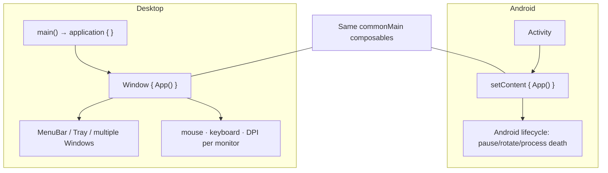
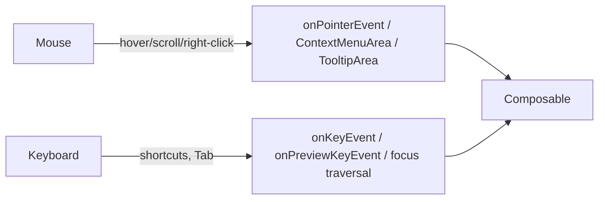

# Lesson 05 — Desktop Compose

> After this lesson you can build a JVM desktop app with Compose Multiplatform — windows, menus, keyboard/mouse input — and explain precisely how the desktop target differs from Android.

**Module:** 15 · **Lesson:** 05 · **Level:** 🟢🟡🔴 · **Est. time:** 70–85 min

---

## 1. Concept

### 🟢 For beginners — *what is it and why do I care?*

**Compose for Desktop** runs your Compose UI as a **native desktop application** on Windows, macOS, and Linux. It's part of **Compose Multiplatform** (Lesson 02) and runs on the **JVM** (the same Java Virtual Machine that runs server apps and IntelliJ IDEA — which itself uses Compose for some UI).

Why care? Because the *same* `@Composable` skills you have build a real desktop app: a window, a menu bar, buttons, lists, dialogs. JetBrains uses it in production (Toolbox, parts of their IDEs), so it's not a toy.

But a desktop is a different world from a phone:

- There's a **window** you can resize, maximize, and have **several of** at once.
- There's a **mouse** (hover, right-click, scroll wheel) and a **real keyboard** (shortcuts like Ctrl/Cmd+S).
- There's a **menu bar**, a **system tray**, and **multiple monitors**.
- There's **no Android framework** — no `Activity`, no `Context`, no Android permissions, no `Build`. It's plain JVM/Kotlin.

So you keep your Compose UI and architecture, and trade Android's `Activity`/`Context` for desktop windowing.

### 🟡 For intermediate devs — *the mechanism*

A desktop app's entry point is a plain `main()` calling **`application { }`**, which sets up the Compose/desktop runtime, inside which you open one or more **`Window`s**:

```kotlin
fun main() = application {
    Window(onCloseRequest = ::exitApplication, title = "My App") {
        App()                 // your shared composable root
    }
}
```

Desktop-specific surface area:

- **`Window` / `rememberWindowState()`** — control size, position, placement (floating/maximized/fullscreen). Multiple `Window` calls = multiple windows.
- **`MenuBar`** (inside a `Window`) and **`Tray`** (system tray icon + menu).
- **Input modifiers** — `Modifier.onPointerEvent(...)` for hover/scroll/secondary-click, `Modifier.onKeyEvent { }` and `onPreviewKeyEvent` for keyboard shortcuts, `TooltipArea` for hover tooltips, `ContextMenuArea` for right-click menus.
- **Rendering** — desktop renders via **Skia (Skiko)**, like iOS. Output is drawn into the OS window surface.
- **Dialogs** — `DialogWindow` for native-feel modal windows; `AlertDialog` (Material) for in-window dialogs.
- **Distribution** — the Compose **Gradle plugin** packages native installers (`.dmg`, `.msi`, `.deb`) and can bundle a trimmed JVM runtime via `jpackage`, so users don't install Java.

Your **UDF architecture carries over**: multiplatform `ViewModel`/`StateFlow`, `collectAsStateWithLifecycle`, Navigation — all usable on desktop.

### 🔴 For senior devs — *trade-offs, edges, internals*

- **Same renderer as iOS (Skia), different host.** Desktop draws via Skiko into an AWT/Swing-hosted surface. Practical upshot: you can **interop with Swing** (`SwingPanel` to embed a `JComponent`, e.g. a web view or a chart that only exists as Swing; `ComposePanel` to embed Compose inside a Swing app). This is the desktop analog of iOS `UIKitView`.
- **Lifecycle is windows, not Activities.** There's no configuration-change/process-death dance. State lives as long as the JVM process (and the window). `rememberSaveable` exists but the "rotation" pressure that motivates it on Android is gone; persistence is your job (files, DataStore-multiplatform, a DB).
- **Threading model.** Compose desktop has its own UI dispatcher; long work still goes off the main thread via coroutines. There's no `Dispatchers.Main` tied to Android's `Looper` — you use the multiplatform `Dispatchers`. Blocking the UI thread freezes the window just as on Android.
- **Density & multi-monitor.** DPI varies per monitor and the user can drag a window between a 4K and a 1080p display mid-session. Don't hard-code pixel sizes; use `dp`/`sp` and test across densities. Window placement must handle a monitor being unplugged.
- **Input richness is a design surface, not an afterthought.** Desktop users expect **hover affordances, right-click context menus, keyboard shortcuts, focus traversal (Tab), text selection, and scroll-wheel** behavior. Shipping a "phone app in a window" with none of these reads as broken. Wire `onKeyEvent`/`onPointerEvent`/`ContextMenuArea` deliberately.
- **No Android APIs — share by abstraction.** Anything you wrote against `Context`, `SharedPreferences`, Android permissions, or `WorkManager` must be abstracted (Lesson 02's `expect`/`actual`) or replaced with a JVM/multiplatform equivalent (files, `java.util.prefs`, OS keychain libs). Code that assumes Android won't compile for `desktopMain`.
- **Packaging realities.** `jpackage` bundles a runtime, so installers are large (tens of MB). Native dependencies (e.g. video) need per-OS handling. Code signing/notarization (macOS) and installer signing (Windows) are real shipping steps.

### Analogy

Android is an **apartment in a managed building**: the building (the OS/`Activity` lifecycle) decides when you're foregrounded, paused, evicted (process death), and rotated; you follow house rules. Desktop is your **own house on your own lot**: you control your **windows** (literally), you can build **extensions** (more windows), guests use the **front door, side door, and the doorbell** (mouse, keyboard, right-click), and **nobody evicts you** mid-dinner — but you're also responsible for your own **utilities and locks** (persistence, security, packaging). Same furniture (your composables), very different property management.

### Mental model

> **Keep the Compose UI, swap the host.** On desktop there's no `Activity`/`Context` — there's a `application { Window { } }`, a mouse, a keyboard, and menus. Render is Skia on the JVM; embrace desktop input idioms and own your own persistence and packaging.

### Real-world example

A note-taking app shares its `commonMain` editor, ViewModels, and sync logic across Android and desktop. On desktop it adds a **`MenuBar`** (File ▸ New/Save, Edit ▸ Find), **Ctrl/Cmd+S** to save via `onKeyEvent`, **right-click** note actions via `ContextMenuArea`, **hover tooltips**, a **system `Tray`** icon to reopen the window, and a second **`Window`** for a detached note. The editor composable is identical to Android's; only the host and input idioms are added.

---

## 2. Visual Learning

**ASCII — desktop app structure:**
```text
  fun main() = application {                 ← Compose/desktop runtime
    ┌──────────────────────── Window ───────────────────────┐
    │ MenuBar:  File ▾   Edit ▾   View ▾                     │  ← menu bar
    │ ┌────────────────────────────────────────────────────┐ │
    │ │              App()  (your shared composables)       │ │  ← Skia-rendered UI
    │ │   hover ▸ tooltip   right-click ▸ context menu      │ │
    │ │   Ctrl/Cmd+S ▸ onKeyEvent   scroll-wheel ▸ pointer  │ │
    │ └────────────────────────────────────────────────────┘ │
    └────────────────────────────────────────────────────────┘
    Tray:  [icon]  ← system tray (optional)
  }   multiple Window{} calls ⇒ multiple windows
```

**Mermaid — Android host vs desktop host:**


**Mermaid — desktop input routing:**


**Illustration prompt (paste into an image generator):**
```text
Illustration: a laptop screen showing a clean desktop application window with a top menu bar
(File, Edit, View), a resizable window with two visible windows overlapping. Callouts point to:
a mouse cursor hovering with a tooltip, a right-click context menu, a keyboard with "Ctrl/Cmd+S"
highlighted, and a system tray icon at the corner. A small badge reads "Compose for Desktop · JVM ·
Skia". Beside it, a faint phone shows the SAME content, connected by an arrow labeled "shared
commonMain composables". Modern, vibrant, clear labels, soft gradients.
```

---

## 3. Code

### 🟢 Beginner — a window

```kotlin
// desktopMain (or a JVM module) — entry point
import androidx.compose.ui.window.application
import androidx.compose.ui.window.Window

fun main() = application {
    Window(onCloseRequest = ::exitApplication, title = "Notes") {
        MaterialTheme {
            var text by remember { mutableStateOf("") }
            Column {
                Text("Characters: ${text.length}")
                TextField(value = text, onValueChange = { text = it })
            }
        }
    }
}
```

**Explanation.** `application { }` boots the desktop Compose runtime; `Window { }` opens an OS window whose content is ordinary Compose. `onCloseRequest = ::exitApplication` closes the app when the window's close button is hit. No `Activity`, no `Context` — just `main()`.

**Common mistakes.**
```kotlin
// ❌ Trying to use Android entry points on desktop — they don't exist on the JVM target.
class MainActivity : ComponentActivity() { /* ... */ }   // no Activity on desktop
setContent { App() }                                      // setContent is Android-only here
```
- Reaching for `Activity`/`setContent`/`Context` on the desktop target.
- Forgetting `onCloseRequest`, so the window can't actually close the app.

**Best practices.**
- Use `application { Window { } }` as the desktop entry point; wire `onCloseRequest`.
- Keep the window's content as your **shared** composable root so Android and desktop reuse it.

---

### 🟡 Intermediate — menu bar, shortcuts, and window state

```kotlin
import androidx.compose.ui.window.rememberWindowState
import androidx.compose.ui.window.MenuBar
import androidx.compose.ui.input.key.*

fun main() = application {
    val windowState = rememberWindowState(width = 900.dp, height = 640.dp)
    var doc by remember { mutableStateOf("") }

    Window(
        onCloseRequest = ::exitApplication,
        state = windowState,
        title = "Editor",
        onKeyEvent = { event ->                       // app-wide shortcuts
            if (event.isCtrlPressed && event.key == Key.S && event.type == KeyEventType.KeyDown) {
                save(doc); true                       // consume Ctrl+S
            } else false
        },
    ) {
        MenuBar {
            Menu("File") {
                Item("New", onClick = { doc = "" })
                Item("Save", shortcut = KeyShortcut(Key.S, ctrl = true), onClick = { save(doc) })
                Separator()
                Item("Exit", onClick = ::exitApplication)
            }
        }
        EditorScreen(doc, onChange = { doc = it })    // shared content composable
    }
}
```

**Explanation.** `rememberWindowState` controls size/placement; `MenuBar`/`Menu`/`Item` build the native-feeling menu (with `KeyShortcut` accelerators); `onKeyEvent` handles app-wide shortcuts and **returns `true` to consume** the event. These are desktop idioms a real user expects — and they have no Android equivalent.

**Common mistakes.**
```kotlin
// ❌ onKeyEvent handler that never returns true → the shortcut "works" but the event keeps propagating.
onKeyEvent = { event -> save(doc); false }            // not consumed; may double-trigger

// ❌ Hard-coding pixel sizes that break on a high-DPI monitor.
val state = rememberWindowState(width = 900.px, height = 640.px)  // use dp, not raw pixels
```
- Not consuming handled key events (return `false`), causing double handling.
- Hard-coding pixel dimensions instead of `dp` (breaks across monitor DPIs).

**Best practices.**
- Drive size/placement with `rememberWindowState`; size in **`dp`**.
- Return **`true`** from `onKeyEvent` when you handle a shortcut; mirror shortcuts in the `MenuBar` via `KeyShortcut`.

---

### 🔴 Production — context menus, tooltips, tray, and a second window

```kotlin
import androidx.compose.foundation.ContextMenuArea
import androidx.compose.foundation.ContextMenuItem
import androidx.compose.foundation.TooltipArea
import androidx.compose.ui.window.Tray
import androidx.compose.ui.window.rememberTrayState

fun main() = application {
    var detachedNoteId by remember { mutableStateOf<String?>(null) }
    val trayState = rememberTrayState()
    var mainVisible by remember { mutableStateOf(true) }

    // System tray: reopen the main window, quit.
    Tray(
        icon = painterResource("tray.png"),
        state = trayState,
        menu = {
            Item("Show", onClick = { mainVisible = true })
            Item("Quit", onClick = ::exitApplication)
        },
    )

    if (mainVisible) {
        Window(onCloseRequest = { mainVisible = false }, title = "Notes") {  // hide, don't exit
            NoteList(
                onOpenInNewWindow = { id -> detachedNoteId = id },
                noteRow = { note ->
                    TooltipArea(tooltip = { Surface { Text("Updated ${note.updated}") } }) {  // hover
                        ContextMenuArea(items = {                                              // right-click
                            listOf(
                                ContextMenuItem("Open in new window") { detachedNoteId = note.id },
                                ContextMenuItem("Delete") { delete(note.id) },
                            )
                        }) {
                            NoteRowContent(note)
                        }
                    }
                },
            )
        }
    }

    // A second, independent window for a detached note.
    detachedNoteId?.let { id ->
        Window(onCloseRequest = { detachedNoteId = null }, title = "Note") {
            NoteDetail(id)            // SAME detail composable used inline on Android
        }
    }
}
```

**Explanation.** Production desktop apps lean into native idioms: a **`Tray`** to live in the system tray (main window's close *hides* rather than exits — a desktop convention), **`TooltipArea`** for hover help, **`ContextMenuArea`** for right-click actions, and a **second `Window`** for a detached note. Each window is driven by hoisted state (`detachedNoteId`, `mainVisible`), and the note composables are the **same** ones used on Android — only the host/windowing differs.

**Common mistakes.**
```kotlin
// ❌ Closing the main window exits the whole app even though a Tray is meant to keep it alive.
Window(onCloseRequest = ::exitApplication) { ... }   // with a tray, users expect close = hide

// ❌ Assuming Android idioms: no hover/right-click/keyboard → "phone app in a window" feel.
LazyColumn { items(notes) { NoteRowContent(it) } }   // no tooltips, no context menu, no shortcuts
```
- Using Android-only persistence/permissions in desktop code (won't compile / no equivalent).
- Hard-coding window positions that break when a monitor is unplugged.

**Best practices.**
- Embrace desktop conventions: hover (`TooltipArea`), right-click (`ContextMenuArea`), shortcuts, and a tray where appropriate.
- Treat each window's visibility/content as **hoisted state**; reuse shared composables across windows and platforms.
- Abstract platform needs (storage, secrets) behind interfaces; package with the Compose Gradle plugin (`jpackage`) and sign installers.

---

## 4. Interview Questions

**🟢 Beginner**

1. *What is Compose for Desktop?*
   > A Compose Multiplatform target that runs your Compose UI as a native desktop app (Windows/macOS/Linux) on the JVM, using the same `@Composable` model as Android.
2. *What replaces the `Activity` on desktop?*
   > A plain `main()` calling `application { Window { App() } }`. There's no `Activity` or `Context`; you open one or more `Window`s.

**🟡 Intermediate**

3. *Name three desktop interaction idioms that have no direct Android equivalent.*
   > A resizable **window** with a **menu bar** (`MenuBar`), **mouse hover/right-click** (`TooltipArea`/`ContextMenuArea`), and **keyboard shortcuts** (`onKeyEvent`/`KeyShortcut`). Also a system **`Tray`** and multiple windows.
4. *How does your Android architecture transfer to desktop?*
   > Largely intact — multiplatform `ViewModel`/`StateFlow`, `collectAsStateWithLifecycle`, and Navigation run on desktop. You swap the Android host (`Activity`) for `application { Window { } }` and add desktop input idioms.
5. *How are desktop apps distributed without making users install Java?*
   > The Compose Gradle plugin uses `jpackage` to bundle a trimmed JVM runtime and produce native installers (`.dmg`/`.msi`/`.deb`).

**🔴 Senior**

6. *How does desktop rendering compare to Android and iOS?*
   > Desktop renders via **Skia (Skiko)** — same as iOS — into an AWT/Swing-hosted window surface, unlike Android's native Compose rendering. This enables **Swing interop** (`SwingPanel` to embed a `JComponent`, `ComposePanel` to embed Compose in Swing), the desktop analog of iOS `UIKitView`.
7. *What changes about lifecycle and persistence on desktop?*
   > There's no configuration-change/process-death cycle; state lives as long as the window/JVM process. `rememberSaveable`'s rotation motivation is gone, so persistence (files, multiplatform DataStore, a DB) is explicitly your responsibility, abstracted behind interfaces if shared.
8. *What desktop-specific pitfalls would you watch for in review?*
   > Hard-coded pixel sizes (DPI varies per monitor; use `dp`), key events not consumed (`return true`), window placement that breaks when a monitor is unplugged, Android-only APIs leaking into `desktopMain`, and missing native idioms (hover/right-click/shortcuts/tray) that make the app feel like a phone app in a window.

---

## 5. AI Assistant

**Prompt example (add desktop affordances):**
```text
This is my shared Compose editor screen used on Android. Wrap it for Compose Desktop:
add a main() with application { Window { } }, a MenuBar (File: New/Save/Exit; Edit: Find),
Ctrl/Cmd+S via onKeyEvent (consume it), right-click actions via ContextMenuArea on note rows,
hover tooltips via TooltipArea, and a system Tray where closing the window hides instead of exits.
Keep my EditorScreen composable unchanged. Target Compose Multiplatform desktop (current), Kotlin 2.x.
Code: [paste].
```

**AI workflow — where it helps on *this* topic.**
- ✅ Great for: generating the `application { Window { } }` shell, `MenuBar`/`Tray` boilerplate, `onKeyEvent` shortcut handlers, and `ContextMenuArea`/`TooltipArea` wrappers.
- ⚠️ Not for: deciding **persistence/packaging/signing** strategy, and beware — models may **leak Android APIs** (`Context`, `Activity`) into desktop code or forget to **consume** key events. Verify desktop window APIs against current Compose Multiplatform docs.

**Review workflow — check AI output against this lesson's *Common Mistakes*:**
- Did it use `application { Window { } }` (no `Activity`/`setContent`/`Context` on desktop)?
- Do key-event handlers **return `true`** when they handle a shortcut?
- Are sizes in **`dp`**, not raw pixels (DPI-safe)?
- Did it add real desktop idioms (hover, right-click, shortcuts, tray) rather than a bare phone layout?
- Is any persistence/secret handling **abstracted**, not Android-specific?

**Validation workflow — prove it actually works:**
1. **Run the desktop target** (`./gradlew run` / the Compose desktop run task); the window opens and renders.
2. **Exercise idioms:** menu items, Ctrl/Cmd+S, right-click menu, hover tooltip, tray show/quit, open a second window.
3. **Resize & move across monitors** (or change DPI); layout stays correct, no pixel hard-coding artifacts.
4. **Package:** build a native installer (`packageDmg`/`packageMsi`/`packageDeb`) and launch it on a clean machine.

> **AI drafts, you decide.** Let the model scaffold windows and menus, but verify it stayed off Android APIs, consumed key events, and produced a desktop-native feel — not a phone app in a box.

---

## Recap / Key takeaways

- **Compose for Desktop** runs your Compose UI on the **JVM** (Windows/macOS/Linux) via `application { Window { App() } }` — no `Activity`/`Context`.
- Desktop adds **windows, `MenuBar`, `Tray`, multiple windows**, and rich **mouse/keyboard** input (`onPointerEvent`, `onKeyEvent`, `ContextMenuArea`, `TooltipArea`).
- Rendering is **Skia** (like iOS), enabling **Swing interop** (`SwingPanel`/`ComposePanel`).
- **No Android lifecycle**: state lives with the window/process; **persistence and packaging** (via `jpackage`) are your responsibility; size in **`dp`** for multi-DPI.
- Your **UDF stack transfers**; embrace desktop idioms so it doesn't feel like a phone app in a window.

➡️ Next: **[Lesson 06 — Android XR](06-android-xr.md)** — spatial UI with the Jetpack XR SDK: subspaces, spatial panels, and orbiters, and where Compose fits in 3D.
