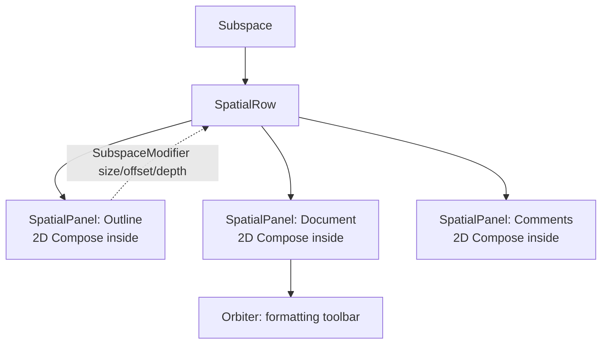
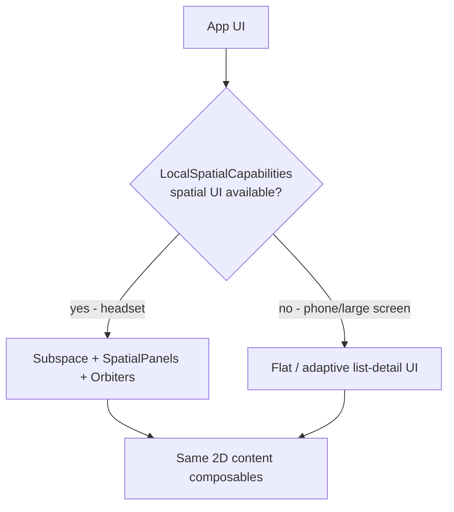

# Lesson 06 — Android XR

> After this lesson you can explain Android XR's spatial UI model, place your existing 2D Compose UI into a `Subspace` with `SpatialPanel`s and `Orbiter`s, and decide what should be spatial vs. flat.

**Module:** 15 · **Lesson:** 06 · **Level:** 🟢🟡🔴 · **Est. time:** 70–85 min

---

## 1. Concept

### 🟢 For beginners — *what is it and why do I care?*

**Android XR** is Android for **headsets and glasses** — "XR" = *extended reality*, covering VR (fully virtual) and AR/MR (digital content mixed with the real world). Instead of a flat rectangle in your hand, your UI floats in **3D space** around the user: panels you can place near or far, left or right, and look around.

The good news: you **don't rewrite your app**. Android XR runs regular Android apps, and the **Jetpack XR SDK** lets you take your **existing 2D Compose UI** and place it onto **panels in space**. A simple XR app can literally be your phone UI shown on a floating panel. From there you can *spatialize* — break the UI into multiple panels, add floating controls around them, and (with more work) place 3D models.

Key idea for beginners: **your composables stay 2D; XR is about where you place those 2D surfaces in 3D space.**

### 🟡 For intermediate devs — *the mechanism*

The Jetpack XR SDK introduces **subspace composables** — a 3D layout layer that sits alongside your normal Compose UI:

- **`Subspace { }`** — the entry into 3D. Anything spatial must live inside a `Subspace`. It creates an independent spatial UI hierarchy.
- **`SpatialPanel`** — a 2D surface placed in 3D space. You put your **ordinary Compose content** (a whole screen, a list, a toolbar) *inside* a `SpatialPanel`. Multiple panels = multiple floating surfaces.
- **`SpatialRow` / `SpatialColumn` / `SpatialBox`** — spatial layout containers that arrange panels in 3D (like `Row`/`Column`, but in space, with depth).
- **`Orbiter`** — a floating UI element **attached to** a panel/layout that "orbits" it — typically contextual controls (a back button, a toolbar) that hover at an edge of the content so the content stays primary.
- **`SubspaceModifier`** — the spatial equivalent of `Modifier`: sets size, offset, and depth/position of subspace composables.
- **Capabilities & adaptation** — `LocalSpatialCapabilities` tells you whether spatial features are available (the same app may run on a phone, where you fall back to flat UI). You branch on capability, much like `WindowSizeClass` in Lesson 03.

So the pattern is: **flat Compose for content → wrapped in `SpatialPanel`s → arranged in a `Subspace` → decorated with `Orbiter`s**, and you **gracefully degrade** to your normal 2D layout when spatial isn't available.

### 🔴 For senior devs — *trade-offs, edges, internals*

- **Two coordinated hierarchies.** XR apps run a normal Compose tree **and** a subspace (spatial) tree. The subspace positions panels in meters in 3D; your 2D content recomposes inside each panel exactly as on a phone. The mental shift is separating **"what the surface shows" (2D Compose)** from **"where the surface lives" (subspace layout)**.
- **Capability-driven design, not device detection.** The *same APK* may run on a headset (full spatial), on a large screen, or on a phone (flat). Read `LocalSpatialCapabilities` and design a **single UI that requests space when available** and collapses to panes/flat otherwise — conceptually the adaptive philosophy from Lesson 03 extended into depth. Hard-coding "isXr" is the same anti-pattern as "isTablet."
- **Ergonomics and comfort are correctness.** In XR, *physical* comfort matters: panel distance and size affect readability and neck strain; content too close or too wide induces discomfort; rapid motion/flicker can cause nausea. Panels should size to content and sit at comfortable distances; the SDK added content-sized panels and configurable elevation for this reason. This is a real constraint, not polish.
- **Input is multimodal.** Headsets use **eye gaze + pinch**, hand tracking, controllers, and sometimes voice — not touch. Hover/selection semantics differ; targets must be large and well-spaced; rely on accessibility/semantics so gaze and assistive input work. Don't assume a tap.
- **Performance is unforgiving.** Stereo rendering (two eyes) at high refresh on mobile-class hardware leaves a thin frame budget. The recomposition-stability discipline (Modules 01, 11) matters even more; heavy 3D content needs care, and you offload model/scene work appropriately.
- **2D-first is the recommended on-ramp.** The pragmatic path is: ship a solid 2D Compose app, then add spatial panels/orbiters for the headset, then (optionally) 3D models/environments. Most apps benefit hugely from "great 2D in space" before any bespoke 3D.
- **Maturity & scope.** Android XR and the Jetpack XR SDK are **newer** than the other surfaces in this module; APIs (e.g. `Subspace`, `SpatialPanel`, `Orbiter`, `SubspaceModifier`) are evolving and gaining capabilities (content-sized panels, custom elevation levels). Treat version-sensitive details as "verify against current XR docs," and prefer the stable, documented composables.

### Analogy

A normal app is a **single framed picture** you hold. Android XR is a **gallery room** you stand inside. Each **`SpatialPanel`** is a framed canvas you can hang **anywhere on the walls** — close for detail, far for overview, left and right. The **`Subspace`** is the room itself, and **`SpatialRow`/`Column`** are how you arrange the canvases along the walls. An **`Orbiter`** is a small **plaque or spotlight** that floats next to a specific canvas with its controls, moving with it. The *paintings themselves* (your 2D Compose content) are unchanged — XR is about **hanging them in a room** instead of holding one in your hand.

### Mental model

> **Content stays 2D; space decides placement.** Wrap ordinary Compose in `SpatialPanel`s, arrange them in a `Subspace` with spatial rows/columns, attach controls as `Orbiter`s, and branch on `LocalSpatialCapabilities` so the same app collapses to flat UI off-headset.

### Real-world example

A productivity app on a headset: the **main document** sits on a large central `SpatialPanel`, a **reference/outline** panel floats to the left, and a **chat/comments** panel to the right (a `SpatialRow` of three panels). A small **`Orbiter`** with formatting controls hovers at the bottom edge of the document panel. On a phone, `LocalSpatialCapabilities` reports no spatial UI, so the same screens render as an adaptive **list–detail** layout (Lesson 03) instead — one codebase, two presentations.

---

## 2. Visual Learning

**ASCII — panels arranged in a subspace:**
```text
        Subspace (3D room)
   ┌────────────┐   ┌──────────────────────┐   ┌────────────┐
   │  OUTLINE   │   │     DOCUMENT          │   │  COMMENTS  │
   │ SpatialPanel│  │     SpatialPanel      │   │SpatialPanel│
   │ (left, far) │  │     (center, near)    │   │(right, far)│
   └────────────┘   └─────────┬────────────┘   └────────────┘
                      ◖ Orbiter: formatting controls ◗  ← floats at panel edge
   arranged by SpatialRow { ... } ; positioned via SubspaceModifier (size/offset/depth)
   content INSIDE each panel = ordinary 2D Compose
```

**Mermaid — the XR composable hierarchy:**


**Mermaid — capability-driven branching:**


**Illustration prompt (paste into an image generator):**
```text
Illustration: a first-person view inside a bright, calm mixed-reality room. Three flat UI
panels float at comfortable distances: a tall "Outline" panel on the left, a large central
"Document" panel facing the user, and a "Comments" panel on the right. A small toolbar
"orbits" the bottom edge of the central panel. Faint gaze-and-pinch hand icons hint at input.
An inset in the corner shows the SAME three panels collapsed into a flat phone list-detail
screen, connected by an arrow labeled "same content, no spatial capability". Caption:
"Content stays 2D; space decides placement." Modern, vibrant, soft lighting, clear labels.
```

---

## 3. Code

> Imports are from the Jetpack XR SDK (`androidx.xr.compose.*`). XR APIs are newer and evolving — verify exact names/signatures against current Android XR docs; the shapes below reflect the documented model.

### 🟢 Beginner — your 2D screen on a spatial panel

```kotlin
import androidx.xr.compose.spatial.Subspace
import androidx.xr.compose.subspace.SpatialPanel
import androidx.xr.compose.subspace.layout.SubspaceModifier
import androidx.xr.compose.subspace.layout.width
import androidx.xr.compose.subspace.layout.height

@Composable
fun XrApp() {
    Subspace {                                   // enter 3D
        SpatialPanel(
            modifier = SubspaceModifier
                .width(1024.dp)
                .height(720.dp),
        ) {
            HomeScreen()                          // your EXISTING 2D Compose screen, unchanged
        }
    }
}
```

**Explanation.** A `Subspace` opens the spatial layer; a single `SpatialPanel` floats your **ordinary** `HomeScreen()` in space. `SubspaceModifier` sizes the panel. The content is untouched 2D Compose — this is the "phone UI on a floating panel" starting point.

**Common mistakes.**
```kotlin
// ❌ Spatial composables outside a Subspace → they have no 3D context.
@Composable fun Broken() {
    SpatialPanel { HomeScreen() }   // not inside Subspace { } → invalid
}
// ❌ Trying to size a SpatialPanel with a normal Modifier instead of SubspaceModifier.
SpatialPanel(modifier = Modifier.width(1024.dp)) { /* wrong modifier type */ }
```
- Placing `SpatialPanel`/`Orbiter` outside a `Subspace`.
- Using `Modifier` where a `SubspaceModifier` is required (and vice-versa).

**Best practices.**
- Start by hosting your **existing** screen in one `SpatialPanel`; spatialize later.
- Use **`SubspaceModifier`** for spatial sizing/placement; keep the panel's *content* normal Compose.

---

### 🟡 Intermediate — multiple panels + an orbiter

```kotlin
import androidx.xr.compose.subspace.SpatialRow
import androidx.xr.compose.spatial.Orbiter
import androidx.xr.compose.spatial.OrbiterEdge
import androidx.xr.compose.subspace.layout.padding

@Composable
fun XrEditor() {
    Subspace {
        SpatialRow {                                  // arrange panels in space
            SpatialPanel(SubspaceModifier.width(360.dp).height(720.dp)) {
                OutlinePane()
            }
            SpatialPanel(SubspaceModifier.width(1024.dp).height(720.dp).padding(horizontal = 24.dp)) {
                // Controls that orbit THIS panel's edge — contextual, content stays primary.
                Orbiter(position = OrbiterEdge.Bottom) {
                    FormattingToolbar()               // a normal 2D composable, floating at the edge
                }
                DocumentPane()
            }
            SpatialPanel(SubspaceModifier.width(360.dp).height(720.dp)) {
                CommentsPane()
            }
        }
    }
}
```

**Explanation.** `SpatialRow` lays three panels side-by-side **in space**. The center panel attaches an **`Orbiter`** at its bottom edge holding a `FormattingToolbar` — contextual controls that float near the content without covering it. Each panel's content (`OutlinePane`, `DocumentPane`, `CommentsPane`) is ordinary 2D Compose. This is "great 2D, spatially arranged."

**Common mistakes.**
```kotlin
// ❌ Cramming three screens into one panel instead of using spatial layout → no XR benefit.
SpatialPanel { Row { OutlinePane(); DocumentPane(); CommentsPane() } }  // just a flat row in space

// ❌ Putting global chrome in an Orbiter unrelated to any panel → floats with nothing to anchor.
```
- Treating the panel as a flat screen and laying out with 2D `Row`/`Column` instead of `SpatialRow`/`SpatialColumn`.
- Over-using orbiters for content that belongs *inside* the panel.

**Best practices.**
- Use **spatial** containers (`SpatialRow`/`SpatialColumn`) to place panels; keep per-panel content 2D.
- Reserve **`Orbiter`s** for **contextual controls** tied to a specific panel; keep content primary.

---

### 🔴 Production — capability-aware: spatial when available, flat otherwise

```kotlin
import androidx.xr.compose.platform.LocalSpatialCapabilities

@Composable
fun AdaptiveDocumentApp(
    outline: ImmutableList<Heading>,
    doc: DocumentUiState,
    comments: ImmutableList<Comment>,
) {
    val spatial = LocalSpatialCapabilities.current

    if (spatial.isSpatialUiEnabled) {
        // Headset: spread panels in space.
        Subspace {
            SpatialRow {
                SpatialPanel(SubspaceModifier.width(360.dp).height(720.dp)) {
                    OutlinePane(outline)
                }
                SpatialPanel(SubspaceModifier.width(1100.dp).height(720.dp)) {
                    Orbiter(position = OrbiterEdge.Bottom) { FormattingToolbar() }
                    DocumentPane(doc)
                }
                SpatialPanel(SubspaceModifier.width(360.dp).height(720.dp)) {
                    CommentsPane(comments)
                }
            }
        }
    } else {
        // Phone / large screen: fall back to the adaptive list–detail layout from Lesson 03.
        DocumentScreenFlat(outline = outline, doc = doc, comments = comments)
    }
}
```

**Explanation.** One entry point serves **both** worlds. `LocalSpatialCapabilities.current.isSpatialUiEnabled` decides: on a headset, panels spread across a `Subspace`; on a phone, the *same* content composables (`OutlinePane`, `DocumentPane`, `CommentsPane`) render through a flat adaptive layout (`DocumentScreenFlat`, built with Lesson 03's pane scaffolds). The content is written **once**; only its placement differs — the XR analog of "branch on space, not device."

**Common mistakes.**
```kotlin
// ❌ Detecting the device/build instead of capabilities → wrong on phones running the same APK.
if (Build.MODEL.contains("Headset")) { /* spatial */ } else { /* flat */ }

// ❌ Duplicating content for XR vs flat → two implementations that drift.
@Composable fun XrDoc() { /* full copy */ }
@Composable fun PhoneDoc() { /* divergent copy */ }
```
- Branching on `Build`/device strings instead of `LocalSpatialCapabilities`.
- Forking content into separate XR and flat implementations (drift, double bugs).
- Ignoring comfort: oversized/too-close panels, rapid motion, tiny gaze targets.

**Best practices.**
- Branch on **`LocalSpatialCapabilities`**; keep **one** set of content composables for spatial and flat.
- Size panels to content at **comfortable distances**; large, well-spaced targets for **gaze/pinch**.
- Apply Module 11 stability discipline — stereo rendering leaves little frame budget.
- Treat XR APIs as **version-sensitive**; verify names against current docs and prefer documented composables.

---

## 4. Interview Questions

**🟢 Beginner**

1. *What is Android XR?*
   > Android for headsets and glasses (extended reality — VR + AR/MR), where UI is placed in 3D space around the user. It runs regular Android apps, and the Jetpack XR SDK lets you place existing 2D Compose UI onto spatial panels.
2. *What is a `SpatialPanel`?*
   > A 2D surface positioned in 3D space that hosts ordinary Compose content. Multiple panels let you float several UI surfaces around the user; they must live inside a `Subspace`.

**🟡 Intermediate**

3. *What's the relationship between `Subspace`, `SpatialPanel`, and `Orbiter`?*
   > `Subspace` is the 3D container you must wrap spatial UI in; `SpatialPanel`s are 2D surfaces placed within it (arranged by `SpatialRow`/`SpatialColumn`); an `Orbiter` is a floating control attached to a panel's edge for contextual actions.
4. *How much of your existing app do you rewrite for XR?*
   > Little — your 2D Compose content goes **inside** panels unchanged. The new work is *spatial layout* (where panels live) and *orbiters* (contextual controls), plus graceful fallback off-headset. 2D-first is the recommended on-ramp.
5. *How do you support both a headset and a phone with one app?*
   > Read `LocalSpatialCapabilities`: render a `Subspace` of panels when spatial UI is enabled, and fall back to a flat/adaptive layout otherwise — reusing the same content composables.

**🔴 Senior**

6. *Why branch on `LocalSpatialCapabilities` rather than detecting an XR device?*
   > The same APK runs across headsets, large screens, and phones; capabilities describe what the current environment actually supports and can change, whereas device/`Build` checks are brittle and wrong on non-headset devices. It's the depth-aware version of "branch on space, not device."
7. *What comfort/ergonomics constraints shape spatial UI, and why are they "correctness"?*
   > Panel distance/size affect readability and neck strain; content too close/wide or rapid motion can cause discomfort or nausea. These directly determine whether users can *use* the app, so sizing panels to content at comfortable distances and avoiding jarring motion are requirements, not polish (the SDK adds content-sized panels and elevation for this).
8. *How does input differ in XR and what does that mean for your UI?*
   > Primary input is **eye gaze + pinch**, hand tracking, controllers, and voice — not touch. Targets must be large and well-spaced, hover/selection semantics differ, and strong accessibility/semantics are essential so gaze and assistive input work. Don't assume a tap or precise pointer.

---

## 5. AI Assistant

**Prompt example (spatialize an existing screen):**
```text
I have a 2D Compose document screen (outline + document + comments). Using the Jetpack XR SDK,
wrap it for Android XR: a Subspace with a SpatialRow of three SpatialPanels (outline, document,
comments), and an Orbiter at the document panel's bottom edge holding my FormattingToolbar.
Then make a single entry point that uses LocalSpatialCapabilities to render the spatial layout
when available and fall back to my flat adaptive list-detail layout otherwise — reusing the same
content composables. Verify API names against current Android XR docs; flag anything uncertain.
Code: [paste].
```

**AI workflow — where it helps on *this* topic.**
- ✅ Great for: scaffolding the `Subspace`/`SpatialRow`/`SpatialPanel`/`Orbiter` structure and the capability-branching entry point; wiring your existing content into panels.
- ⚠️ Not for: **comfort/ergonomics** decisions (panel distance/size, motion) and not as a source of truth for XR API names — the SDK is **new and evolving**, so models frequently **hallucinate** spatial APIs. Verify every XR symbol against current docs.

**Review workflow — check AI output against this lesson's *Common Mistakes*:**
- Are all spatial composables inside a **`Subspace`**, using **`SubspaceModifier`** (not `Modifier`) for spatial sizing?
- Did it use **spatial** containers (`SpatialRow`/`SpatialColumn`) for placement rather than a flat `Row` in one panel?
- Does it branch on **`LocalSpatialCapabilities`** (not `Build`/device strings) and **reuse** content for flat fallback (no forked copies)?
- Are XR **API names real** (cross-checked against current docs), not invented?
- Are targets large/spaced for **gaze/pinch**, with sensible panel sizes?

**Validation workflow — prove it actually works:**
1. **Run in the Android XR emulator/headset**; confirm panels appear at comfortable distances and content renders inside each.
2. **Capability fallback:** run the same app on a phone/large-screen emulator; confirm it shows the flat adaptive layout, not a broken spatial one.
3. **Input test:** exercise gaze/pinch (emulator controls) on panels and the orbiter; targets are reachable.
4. **Performance:** watch frame timing/recomposition; keep content stable (Module 11) given the stereo render budget.

> **AI drafts, you decide.** Use the model to scaffold the spatial structure and fallback, but verify XR APIs against current docs and own the comfort/ergonomics — the parts a model can't feel.

---

## Recap / Key takeaways

- **Android XR** puts UI in 3D for headsets/glasses; the **Jetpack XR SDK** places your **existing 2D Compose** onto spatial surfaces.
- **`Subspace`** is the 3D container; **`SpatialPanel`s** (arranged by `SpatialRow`/`SpatialColumn`, sized via **`SubspaceModifier`**) float 2D content; **`Orbiter`s** add contextual controls.
- **Content stays 2D; space decides placement** — the depth-aware extension of Lesson 03's adaptive thinking.
- Branch on **`LocalSpatialCapabilities`**, reuse one set of content composables, and **fall back to flat** off-headset.
- **Comfort, gaze/pinch input, and performance** are real constraints; XR APIs are **new/evolving** — verify against current docs.

➡️ Next: **[Lesson 07 — AI-native applications](07-ai-native-applications.md)** — on-device and cloud AI features in Android apps, and the Compose patterns for streaming, generative UI, and graceful AI failure.
