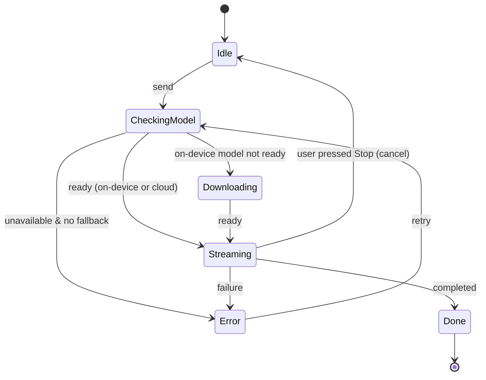
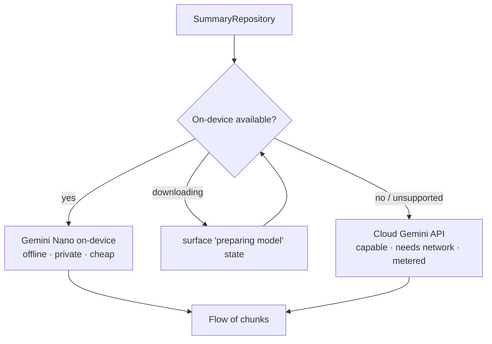

# Lesson 07 — AI-Native Applications

> After this lesson you can choose between on-device and cloud AI for an Android feature, stream model output into Compose with correct UDF, and design AI UX that degrades gracefully on latency, failure, and cost.

**Module:** 15 · **Lesson:** 07 · **Level:** 🟢🟡🔴 · **Est. time:** 80–95 min

---

## 1. Concept

> Note: this lesson is about building **AI features into the apps you ship** (the user-facing product). Using AI to **write your code** is the focus of [Module 16 — AI-Powered Android Development](../module-16-ai-powered-dev/README.md).

### 🟢 For beginners — *what is it and why do I care?*

An **AI-native app** treats a machine-learning model as a **first-class part of the product**, not a bolt-on: a chat assistant, smart compose/summarize, image generation, semantic search, "ask about this document." In 2026 these features are everywhere, and Compose is how you present them.

There are two places the model can run:

- **On-device** — the model runs **on the phone** (e.g. Google's on-device **Gemini Nano** via ML Kit GenAI / AICore, or a bundled model). Pros: **works offline**, **fast for small tasks**, **private** (data doesn't leave the device), no per-call cost. Cons: limited size/capability, device-dependent.
- **Cloud** — you call a **server API** (e.g. the **Gemini API**/Vertex AI, or another provider). Pros: **most capable** models, consistent across devices. Cons: needs **network**, has **latency and cost**, and you send data off-device.

The Compose challenge is the same either way: AI is **slow, streaming, and sometimes wrong**. Your UI must show progress, stream tokens as they arrive, and handle failure without freezing or lying.

### 🟡 For intermediate devs — *the mechanism*

AI features are **just async, streaming data sources** plugged into the UDF you already know (Module 03):

- A **repository** wraps the model client (on-device or cloud) and exposes results as a **`Flow`** — perfect for **streaming** token-by-token output.
- The **ViewModel** collects that flow and updates **one immutable `UiState`** (`prompt`, `response`, `isStreaming`, `error`). The UI renders it; events (send, stop, retry) flow up.
- **Streaming** maps a `Flow<String>` of partial chunks onto a growing `response` string in state — the user sees text appear live.
- **One-shot effects** (a snackbar for a content-policy block, navigation) go through a `Channel`/`SharedFlow`, **not** into `UiState` (Module 03, Lesson 05).
- **Cancellation** matters: a long generation must be **stoppable**; tie it to `viewModelScope`/a `Job` so "Stop" or leaving the screen cancels it.

A typical on-device call: build a client/`GenerativeModel`, send a prompt, collect `generateContentStream(...)`-style chunks. A cloud call is the same shape over the network. Either way: **`Flow` in, immutable `UiState` out, streamed into Compose with `collectAsStateWithLifecycle`.**

### 🔴 For senior devs — *trade-offs, edges, internals*

- **On-device vs cloud is an architecture decision with a fallback.** Real apps often do **both**: try on-device for privacy/offline/cheap, fall back to cloud for capability or when the device lacks support (`FeatureStatus`/availability checks). Hide this behind a repository interface so the UI is agnostic — the same `expect`/abstraction discipline as the rest of this module.
- **Availability & model download are first-class states.** On-device models may be **unavailable**, **downloadable**, or **downloading** on a given device. That's UI state, not an error to swallow — surface "preparing model…" and a graceful path when unsupported. Check feature availability before offering the feature.
- **Streaming UX is a stability problem.** A `response` string that grows every token recomposes constantly. Keep the streaming text in a **focused** composable (small recomposition scope), use **stable/immutable** state (Modules 01, 11), and avoid re-laying-out the whole screen per chunk. Smooth auto-scroll without fighting the user's manual scroll.
- **Latency, cost, and rate limits shape the design.** Cloud calls cost money and time; debounce/throttle, cache, cap token usage, and show clear progress. Don't fire a request on every keystroke. Offer **stop** so users don't pay for output they don't want.
- **Trust, safety, and non-determinism.** Models **hallucinate** and can produce unsafe content. Never present AI output as authoritative without **provenance/disclaimers** where it matters; respect **content-safety** signals from the API; keep a **human-in-the-loop** for consequential actions. Treat output as *untrusted input* — never `eval`/execute it, sanitize before rendering as rich content, and guard against prompt injection if the model can call tools.
- **Privacy & compliance.** Sending user data to the cloud has legal/consent implications; on-device keeps data local. Be explicit about what leaves the device, get consent, and prefer on-device for sensitive data. This is increasingly a hard requirement, not a nicety.
- **Generative UI is emerging.** Beyond text, models can drive **structured output** (JSON → typed UI) so the model proposes UI *state* you render with trusted composables. The discipline: the model proposes **data**, your code owns **rendering** — never let a model emit executable UI or unsanitized HTML.
- **Testing the non-deterministic.** You can't assert exact text. Test the **plumbing** deterministically: fake the model with a Turbine-tested `Flow`, assert state transitions (idle→streaming→done/error), assert cancellation stops collection, and snapshot-test the loading/error/empty UI.

### Analogy

An AI feature is a **live interpreter on a phone line**. They **start talking before they've finished thinking** (streaming), occasionally **mis-hear or make something up** (hallucination), sometimes the **line is bad** (network/latency), and you can **interrupt them** (cancellation). A good app, like a good call host, shows that the interpreter is *speaking* (progress), relays words *as they come* (streaming), gracefully handles *"can you repeat that?"* (retry/error), lets you **hang up** (stop), and never presents an unverified claim as gospel. On-device is a **local interpreter in the room** (private, instant, limited vocabulary); cloud is a **world expert on the line** (powerful, but remote, metered, and overheard).

### Mental model

> **AI is a slow, streaming, fallible data source plugged into UDF.** Wrap it in a repository that emits a `Flow`, fold chunks into one immutable `UiState`, stream into Compose, make it **cancellable**, and design for **availability, latency, failure, privacy, and "it might be wrong."**

### Real-world example

A note app's "summarize" button: the ViewModel calls a `SummaryRepository` that tries **on-device Gemini Nano** first (offline, private). If the model is still **downloading** it shows "Preparing on-device AI…"; if the device is **unsupported** it falls back to the **cloud** Gemini API with a clear "uses network" note. The summary **streams** into a card token-by-token with a **Stop** button; on error it shows a retry; the result carries a subtle "AI-generated — verify important details" disclaimer. One feature, multiple states, honest UX.

---

## 2. Visual Learning

**ASCII — AI feature in the UDF loop:**
```text
   ┌──────────────── ViewModel ────────────────┐
   │ UiState{ prompt, response, isStreaming,    │   on send →
   │          error, modelStatus }   onEvent()  │   launch in viewModelScope (cancellable)
   └──────┬───────────────────────────▲─────────┘
   state ▼ collectAsStateWithLifecycle │ events (send / stop / retry)
   ┌──────┴──── Composable ────────────┴─────────┐
   │ streams response text · shows progress/stop │
   └──────────────────────────────────────────────┘
            ▲ Flow<String> chunks
   ┌────────┴──── Repository ──────────────────────┐
   │ on-device (Gemini Nano)  ⇄ fallback ⇄  cloud  │
   │ generateContentStream(...) → emit chunks      │
   └───────────────────────────────────────────────┘
```

**Mermaid — request lifecycle with states:**


**Mermaid — on-device vs cloud routing:**


**Illustration prompt (paste into an image generator):**
```text
Illustration: a phone screen with a chat/summary card where text is visibly "typing out"
token by token (a few words solid, the next fading in), a small spinner labeled "streaming"
and a "Stop" button. Two glowing pipes feed the card from below: a short pipe labeled
"On-device · private · offline" and a longer pipe arcing to a distant cloud labeled
"Cloud · powerful · metered", with a switch between them labeled "fallback". A subtle footer
reads "AI-generated — verify". Modern, vibrant, clear labels, soft gradients.
```

---

## 3. Code

> Client APIs differ by provider and evolve quickly. The shapes below reflect the common **GenerativeModel + streaming `Flow`** pattern (on-device ML Kit GenAI / AICore, or the cloud Gemini API). **Verify exact class/method names against current SDK docs.** The *architecture* is the point.

### 🟢 Beginner — a streaming summary in state

```kotlin
data class SummaryUiState(
    val input: String = "",
    val summary: String = "",
    val isStreaming: Boolean = false,
    val error: String? = null,
)

class SummaryViewModel(private val repo: SummaryRepository) : ViewModel() {
    private val _state = MutableStateFlow(SummaryUiState())
    val state: StateFlow<SummaryUiState> = _state.asStateFlow()

    fun onInput(text: String) = _state.update { it.copy(input = text) }

    fun summarize() {
        viewModelScope.launch {
            _state.update { it.copy(isStreaming = true, summary = "", error = null) }
            runCatching {
                repo.summarizeStream(_state.value.input)            // Flow<String> of chunks
                    .collect { chunk -> _state.update { it.copy(summary = it.summary + chunk) } }
            }.onFailure { e -> _state.update { it.copy(error = e.message) } }
            _state.update { it.copy(isStreaming = false) }
        }
    }
}
```

**Explanation.** AI is just a `Flow` folded into **one immutable `UiState`**. Each streamed `chunk` appends to `summary`, so the UI sees text grow live. Loading (`isStreaming`) and `error` live in the same coherent snapshot (Module 03). The call runs in `viewModelScope`, so it's automatically cancelled if the ViewModel clears.

**Common mistakes.**
```kotlin
// ❌ Blocking the main thread for the whole generation → frozen UI, ANR.
val summary = repo.summarizeBlocking(input)   // no streaming, no progress, blocks

// ❌ Mutable list / non-snapshot accumulation outside state → UI won't update or tears.
val sb = StringBuilder(); repo.summarizeStream(input).collect { sb.append(it) } // not in UiState
```
- Doing a blocking call instead of a streamed `Flow`.
- Accumulating output outside `UiState`, so Compose never sees it change.

**Best practices.**
- Model AI as a **`Flow` → immutable `UiState`**; fold chunks into a single growing field.
- Run in `viewModelScope`; keep `isStreaming`/`error` in the **same** state object.

---

### 🟡 Intermediate — cancellable streaming + lifecycle collection

```kotlin
class SummaryViewModel(private val repo: SummaryRepository) : ViewModel() {
    private val _state = MutableStateFlow(SummaryUiState())
    val state: StateFlow<SummaryUiState> = _state.asStateFlow()

    private var job: Job? = null

    fun summarize() {
        job?.cancel()                                  // cancel any in-flight generation
        job = viewModelScope.launch {
            _state.update { it.copy(isStreaming = true, summary = "", error = null) }
            try {
                repo.summarizeStream(_state.value.input)
                    .collect { chunk -> _state.update { it.copy(summary = it.summary + chunk) } }
            } catch (e: CancellationException) {
                throw e                                  // never swallow cancellation
            } catch (e: Exception) {
                _state.update { it.copy(error = e.message) }
            } finally {
                _state.update { it.copy(isStreaming = false) }
            }
        }
    }

    fun stop() { job?.cancel() }                        // user pressed Stop
}
```

```kotlin
@Composable
fun SummaryScreen(vm: SummaryViewModel = viewModel()) {
    val state by vm.state.collectAsStateWithLifecycle()   // lifecycle-aware (Module 03)
    Column {
        OutlinedTextField(state.input, onValueChange = vm::onInput, label = { Text("Text") })
        Row {
            Button(onClick = vm::summarize, enabled = !state.isStreaming) { Text("Summarize") }
            if (state.isStreaming) {
                CircularProgressIndicator(Modifier.size(20.dp))
                TextButton(onClick = vm::stop) { Text("Stop") }
            }
        }
        state.error?.let { Text("Error: $it", color = MaterialTheme.colorScheme.error) }
        StreamingText(state.summary)                      // isolated, see Production tier
    }
}
```

**Explanation.** A held `Job` makes generation **cancellable**: re-summarizing cancels the previous run, and **Stop** cancels the current one. `CancellationException` is **re-thrown**, never swallowed (swallowing it breaks structured concurrency). The UI collects with `collectAsStateWithLifecycle`, shows a spinner + Stop while streaming, and renders errors inline.

**Common mistakes.**
```kotlin
// ❌ Catching Exception swallows CancellationException → "Stop" looks like it worked but coroutine lingers.
catch (e: Exception) { _state.update { it.copy(error = e.message) } }  // also catches cancellation

// ❌ collectAsState instead of collectAsStateWithLifecycle → keeps streaming/colllecting in background.
val state by vm.state.collectAsState()
```
- Swallowing `CancellationException` (breaks cancellation/structured concurrency).
- `collectAsState` → background work continues when the app is backgrounded.
- Firing on every keystroke (no debounce) → cost + rate limits.

**Best practices.**
- Make generation **cancellable** via a `Job`; re-throw `CancellationException`.
- Always `collectAsStateWithLifecycle`; offer **Stop**; debounce input-driven requests.

---

### 🔴 Production — on-device-first with cloud fallback, availability state, and isolated streaming UI

```kotlin
// Repository hides on-device vs cloud behind one streaming API + an availability check.
enum class ModelStatus { READY, DOWNLOADING, UNSUPPORTED }

interface SummaryRepository {
    suspend fun status(): ModelStatus
    fun summarizeStream(text: String): Flow<String>
}

class HybridSummaryRepository(
    private val onDevice: OnDeviceSummarizer,     // wraps Gemini Nano / ML Kit GenAI
    private val cloud: CloudSummarizer,           // wraps the cloud Gemini API
) : SummaryRepository {

    override suspend fun status(): ModelStatus = when (onDevice.featureStatus()) {
        FeatureStatus.AVAILABLE   -> ModelStatus.READY
        FeatureStatus.DOWNLOADING,
        FeatureStatus.DOWNLOADABLE -> ModelStatus.DOWNLOADING
        else                       -> ModelStatus.UNSUPPORTED
    }

    override fun summarizeStream(text: String): Flow<String> = flow {
        when (onDevice.featureStatus()) {
            FeatureStatus.AVAILABLE -> emitAll(onDevice.generateStream(text))   // private, offline
            else                    -> emitAll(cloud.generateStream(text))      // fallback, network
        }
    }.flowOn(Dispatchers.IO)                       // main-safety: never block the UI thread
}
```

```kotlin
// Streaming text isolated so token growth recomposes a SMALL scope, with smart auto-scroll.
@Composable
fun StreamingText(text: String, modifier: Modifier = Modifier) {
    val scroll = rememberScrollState()
    // Auto-scroll to the bottom as tokens arrive — but only this composable recomposes per chunk.
    LaunchedEffect(text) { scroll.animateScrollTo(scroll.maxValue) }
    Text(
        text = text.ifEmpty { "" },
        modifier = modifier.verticalScroll(scroll),
    )
    // Provenance: never present AI output as authoritative without a disclaimer where it matters.
    if (text.isNotEmpty()) {
        Text("AI-generated — verify important details",
            style = MaterialTheme.typography.labelSmall,
            color = MaterialTheme.colorScheme.onSurfaceVariant)
    }
}
```

**Explanation.** The **repository** hides on-device vs cloud behind **one** `summarizeStream` + a `status()` the UI can render ("preparing model…"/unsupported). It tries **on-device** (Gemini Nano — private, offline) and **falls back to cloud** when not available, with `flowOn(Dispatchers.IO)` for main-safety. **`StreamingText`** isolates the constantly-growing text into a **small recomposition scope** (Modules 01/11), auto-scrolls without re-laying-out the whole screen, and adds an honest **provenance** note. The ViewModel/UI from the Intermediate tier consume this unchanged — the swap is invisible above the repository.

**Common mistakes.**
```kotlin
// ❌ No availability handling → feature silently fails on devices without the on-device model.
fun summarizeStream(text: String) = onDevice.generateStream(text)   // crashes/empties when UNSUPPORTED

// ❌ Rendering model output as trusted rich content / executing it → injection & safety holes.
val html = aiResponse; WebView().loadData(html, "text/html", null)  // never trust raw output
// ❌ Growing text in a giant screen-level composable → whole screen recomposes every token.
```
- No model **availability** state; no **fallback**.
- Treating output as **trusted** (rendering raw HTML, executing tool calls without guards).
- Streaming text in a screen-level composable → janky, whole-screen recomposition.
- Sending sensitive data to the **cloud** without consent.

**Best practices.**
- Hide on-device/cloud behind a **repository**; expose **availability** as state; provide **fallback**.
- Keep streaming text in an **isolated, stable** composable; auto-scroll without fighting the user.
- Treat AI output as **untrusted**: sanitize, never execute, show **provenance**, keep a human in the loop for consequential actions.
- Be explicit about **privacy** (what leaves the device) and get consent; prefer on-device for sensitive data; cap cost with debounce/limits.

---

## 4. Interview Questions

**🟢 Beginner**

1. *What's the difference between on-device and cloud AI in an app?*
   > On-device runs the model on the phone (offline, private, fast for small tasks, no per-call cost, but limited and device-dependent). Cloud calls a server API (most capable and consistent, but needs network and has latency, cost, and data leaving the device).
2. *Why is streaming important for AI UX?*
   > Models produce output gradually; streaming shows text as it arrives so the user sees progress instead of staring at a frozen screen waiting for a full response.

**🟡 Intermediate**

3. *How do AI features fit into UDF/MVI?*
   > The model client lives in a repository that emits a **`Flow`**; the ViewModel folds chunks into **one immutable `UiState`** (`response`, `isStreaming`, `error`); the UI renders it and sends events (send/stop/retry). One-shot effects (policy block, navigation) go through a `Channel`, not state.
4. *How do you make a long generation cancellable?*
   > Launch it in `viewModelScope` and hold the `Job`; cancel it on "Stop", on a new request, or when the screen leaves. Re-throw `CancellationException` rather than swallowing it so structured concurrency works.
5. *Why `collectAsStateWithLifecycle` for AI streams specifically?*
   > It stops collecting when the app is backgrounded, so you don't keep streaming (and paying for / wasting) tokens the user can't see, and you avoid stale updates.

**🔴 Senior**

6. *How would you design a feature that prefers on-device but can use the cloud?*
   > A repository interface exposing `status()` and a streaming `summarize()`. It checks on-device **feature availability** (available/downloading/unsupported), uses on-device when ready, and **falls back to cloud** otherwise — with `flowOn(IO)` for main-safety. The UI surfaces availability as state and stays agnostic to which backend ran.
7. *What are the trust/safety obligations when shipping AI output to users?*
   > Treat output as **untrusted**: never execute it, sanitize before rendering rich content, guard tool-calling against prompt injection, respect content-safety signals, show **provenance/disclaimers** for non-authoritative content, and keep a **human-in-the-loop** for consequential actions. Plus privacy: be explicit about what leaves the device and get consent.
8. *How do you test a non-deterministic AI feature?*
   > Test the **plumbing**, not the model: inject a fake repository emitting a scripted `Flow`, use **Turbine** to assert state transitions (idle→streaming→done/error), assert that Stop cancels collection, and snapshot-test loading/error/empty UI. Keep model quality evaluation separate from UI tests.

---

## 5. AI Assistant

> Meta-note: here you use an AI **assistant** to help build an AI **feature** — keep the two straight.

**Prompt example (scaffold the feature):**
```text
Build a streaming "summarize" feature in Compose with clean UDF. Requirements:
(1) SummaryRepository interface with status(): ModelStatus and summarizeStream(text): Flow<String>;
(2) a HybridSummaryRepository that tries on-device (Gemini Nano / ML Kit GenAI) and falls back to the
cloud Gemini API, using flowOn(Dispatchers.IO);
(3) a ViewModel folding chunks into one immutable SummaryUiState (summary/isStreaming/error), made
cancellable via a held Job, re-throwing CancellationException;
(4) a SummaryScreen using collectAsStateWithLifecycle with a Stop button and an isolated StreamingText
that auto-scrolls and shows an "AI-generated — verify" note.
Verify SDK class/method names against current docs and flag uncertain ones. Kotlin 2.x, Compose BOM 2026.
```

**AI workflow — where it helps on *this* topic.**
- ✅ Great for: scaffolding the repository/ViewModel/screen plumbing, the streaming-fold logic, the cancellable `Job` pattern, and fake repositories for tests.
- ⚠️ Not for: the **on-device/cloud + privacy** decision, **safety/provenance** policy, and **SDK specifics** — GenAI client APIs change fast and models hallucinate class names. Verify every model-client symbol against current docs.

**Review workflow — check AI output against this lesson's *Common Mistakes*:**
- Is AI a **`Flow` → immutable `UiState`**, with chunks folded into one growing field (not accumulated outside state, not blocking)?
- Is generation **cancellable** (held `Job`), and is **`CancellationException` re-thrown** (not swallowed by a broad `catch`)?
- Is collection **`collectAsStateWithLifecycle`**, with input requests **debounced**?
- Is there **availability** state + **fallback**, with `flowOn(IO)` main-safety?
- Is output treated as **untrusted** (no raw HTML/exec), with **provenance** shown and **privacy/consent** handled?
- Is the streaming text **isolated** so it doesn't recompose the whole screen?

**Validation workflow — prove it actually works:**
1. **Run** with a fake repository emitting scripted chunks; confirm text streams, Stop cancels, errors render.
2. **Turbine-test** the ViewModel: idle→streaming→done and →error; assert Stop ends collection.
3. **Availability paths:** simulate `READY`/`DOWNLOADING`/`UNSUPPORTED`; confirm the UI shows "preparing"/fallback/graceful-unsupported.
4. **Recomposition:** Layout Inspector during streaming — only `StreamingText` should churn, not the whole screen.
5. **Airplane mode / offline:** on-device path still works; cloud path degrades gracefully with a clear message.

> **AI drafts, you decide.** Let the model wire the streaming UDF, but you own the on-device/cloud, privacy, and safety calls — and verify the AI-client API against real docs, never the model's memory.

---

## Recap / Key takeaways

- An **AI-native app** treats a model as first-class; in Compose it's a **slow, streaming, fallible data source** plugged into **UDF**.
- Choose **on-device** (offline, private, cheap, limited) vs **cloud** (capable, networked, metered) — often **both**, with **availability** state and **fallback** behind a repository.
- Stream a **`Flow`** into **one immutable `UiState`**, collect with **`collectAsStateWithLifecycle`**, make it **cancellable**, and isolate streaming text for a **small recomposition scope**.
- Treat output as **untrusted**: sanitize, never execute, show **provenance**, keep a **human in the loop**, and be explicit about **privacy/consent**.
- Test the **plumbing** (fakes + Turbine + snapshots), not the model's exact words; verify fast-moving **SDK APIs** against current docs.

➡️ Next: **[Module 16 — AI-Powered Android Development](../module-16-ai-powered-dev/README.md)** — flip the lens: run a real agentic workflow (planner → architect → coder → reviewer → human) to *build* Android features with AI.
