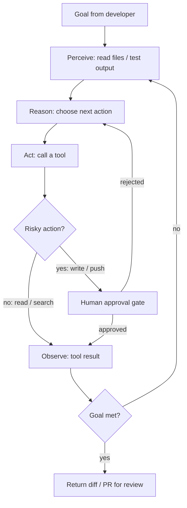
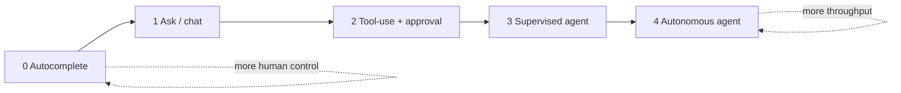

# Lesson 01 — What Agentic AI Is

> After this lesson you can explain what makes an AI "agentic," describe the perceive→reason→act→observe loop, place a tool on the autonomy ladder, and decide where agents help vs. hurt on a Compose codebase.

**Module:** 16 · **Lesson:** 01 · **Level:** 🟢🟡🔴 · **Est. time:** 60–75 min

---

## 1. Concept

### 🟢 For beginners — *what is it and why do I care?*

You've probably used a chatbot: you ask a question, it answers, and the conversation ends there. The model produces **text** and stops. That's a **language model**. It can't open your project, run your tests, or edit a file — it only talks.

An **agent** is a language model wrapped in a **loop** and handed **tools**. Instead of just answering, it can *do* things: read a file, run a Gradle build, search the web, write code, then look at what happened and decide the next move — over and over — until the goal is met. The word **"agentic"** just means "acts on its own toward a goal," the way a travel agent doesn't merely describe flights but actually books them.

So the difference is simple:

- **Chatbot:** "Here's how you'd fix that `NullPointerException`." (you do the work)
- **Agent:** *reads the stack trace → opens the file → edits the code → runs the test → reads the result → fixes it again if red.* (it does the work, you supervise)

Why care? Because the day-to-day of Android development — wiring a `ViewModel`, migrating a `LazyColumn`, generating unit tests, renaming a symbol across 40 files — is full of mechanical, multi-step work. Agents are built to grind through exactly that, while you stay the decision-maker.

### 🟡 For intermediate devs — *the mechanism*

An agent is a **control loop** around an LLM. Four moving parts make it work:

1. **A model** that can *reason about which tool to call* and emit a structured call (function/tool calling), not just prose.
2. **Tools** — typed functions the model may invoke: `read_file(path)`, `run_command(cmd)`, `edit_file(path, diff)`, `web_search(q)`. Each has a name, a description, and a parameter schema the model reads.
3. **A loop** (the "harness" or "scaffold") that executes the chosen tool, captures its real-world output, appends that output to the conversation, and asks the model again.
4. **A stop condition** — goal satisfied, max steps reached, or a human gate.

The cycle is **perceive → reason → act → observe**, repeated:

```text
perceive (read state) → reason (pick next action) → act (call a tool) → observe (tool result) → …loop…
```

The crucial property: the **observation feeds back in**. A chatbot is open-loop (talk once, done). An agent is **closed-loop** — it sees the consequence of each action and adapts. When `./gradlew testDebugUnitTest` prints `> 3 tests failed`, that text re-enters the context and the model plans a fix. That feedback is the entire reason agents can finish multi-step tasks a single prompt can't.

### 🔴 For senior devs — *trade-offs, edges, internals*

The loop is easy to draw and hard to run well. The senior-level concerns:

- **Autonomy is a dial, not a switch.** Think of five rungs: (0) **autocomplete** — model suggests, you accept each token (Copilot inline); (1) **ask** — you prompt, it answers, no tools; (2) **tool-use with approval** — it proposes each command/edit and waits for your "yes"; (3) **supervised agent** — it loops autonomously but you gate risky actions (writes, pushes) and review a diff; (4) **autonomous agent** — it runs end-to-end and you inspect only the final PR. Higher rungs trade oversight for throughput. Most professional Android work lives at **rung 2–3**: let it loop, but the diff and the merge are yours.
- **Context is the budget.** Every perceive/observe step spends tokens. Long loops fill the context window with stale tool output, and the model's attention degrades — early instructions get "lost in the middle," and it starts repeating itself. Good harnesses **summarize, prune, and re-ground** (re-inject the goal and the file tree). On a large Compose module, *what you put in context* matters more than the prompt's wording.
- **Errors compound.** A 95%-correct single step is great; chain 20 of them and you're at `0.95²⁰ ≈ 36%` end-to-end if errors are independent. The fix isn't a smarter model — it's **checkpoints**: compile/test gates between steps so a wrong turn is caught and corrected before it propagates. This is why "agent + green test suite" beats "agent alone."
- **Tools are the real capability surface.** The model's intelligence is capped by what its tools let it observe and change. A read-only agent can explain your `Recomposer` bug; only an agent with `edit_file` + `run_tests` can *fix and verify* it. Designing the toolset (and its guardrails) is the actual engineering — more on this in [Lesson 02](02-ai-coding-agents.md).
- **Determinism is gone.** The same task can take a different path twice. You design for *outcomes you can verify* (tests pass, build green, diff reviewed), not for a reproducible transcript. Treat the agent like a fast, tireless junior whose work you always check — never like a compiler.

### Analogy

**A GPS that drives.** A paper map (chatbot) tells you the route once; if you miss a turn, it's useless. A self-driving car with GPS (agent) **perceives** the road, **reasons** about the next maneuver, **acts** on the wheel, **observes** what happened, and re-plans continuously — recovering from a missed exit without starting over. You still set the destination and grab the wheel in a parking lot you don't trust. The autonomy ladder is the difference between lane-assist (rung 1), adaptive cruise (rung 2), and full self-driving (rung 4).

### Mental model

> **An agent is an LLM in a loop with tools: perceive → reason → act → observe, until done.** A chatbot talks once; an agent acts, sees the result, and adapts — and *you* own the dial that says how far it goes without asking.

### Real-world example

You file: *"Migrate `ProfileScreen` from `LiveData` to `StateFlow` and keep tests green."* A supervised agent reads `ProfileViewModel.kt`, edits the `LiveData` to a `MutableStateFlow`, updates the composable to `collectAsStateWithLifecycle()`, runs `./gradlew :app:testDebugUnitTest`, sees two tests still reference `getOrAwaitValue()`, rewrites them with Turbine, re-runs, gets green, and opens a diff for your review. You read it, catch that it dropped a `distinctUntilChanged`, ask for the fix, and merge. That whole arc — loop, feedback, human gate — is agentic development.

---

## 2. Visual Learning

**ASCII — the agent loop vs. a chatbot:**
```text
   CHATBOT (open loop)                AGENT (closed loop)
   ┌──────────┐                       ┌───────────────────────────────┐
   │  prompt  │                       │            GOAL               │
   └────┬─────┘                       └───────────────┬───────────────┘
        ▼                                             ▼
   ┌──────────┐                          ┌────────► perceive (read state)
   │  answer  │  (done)                  │            │
   └──────────┘                          │            ▼
                                         │          reason (pick tool)
                                         │            │
                                         │            ▼
                                         │           act ──▶ run tool ──┐
                                         │                              │
                                         └──── observe (result) ◀───────┘
                                              loops until done / gate
```

**Mermaid — perceive → reason → act → observe, with a human gate:**


**Mermaid — the autonomy ladder:**


**Illustration prompt (paste into an image generator):**
```text
Illustration: a clean control-room scene. On the left, a small robot labeled "LLM" sits inside
a circular conveyor belt with four glowing stations labeled PERCEIVE, REASON, ACT, OBSERVE; an
arrow loops continuously through them. The robot's arm reaches out of the loop to a toolbox
labeled TOOLS (read file, run tests, edit, search). On the right, a human at a console holds a
dial labeled AUTONOMY with five notches (Autocomplete → Autonomous), one hand resting on a big
"APPROVE / REJECT" gate that the conveyor passes through. Caption: "An LLM in a loop with tools."
Modern, vibrant, soft studio lighting, clear labels.
```

---

## 3. Code

> This is the AI module, so "code" here means the **agent's interface** — the tools it can call, the loop that drives it, and the config that bounds it — plus a tiny Android task expressed the agentic way. Treat these as the artifacts you'd actually commit alongside an agent setup.

### 🟢 Beginner — the tool contract an agent reasons over

```text
You are an Android coding agent. You may call these tools, one per step.
After each call you receive its real output, then choose the next step.

TOOLS
- read_file(path: String): returns file contents
- run_command(cmd: String): runs a shell command, returns stdout+stderr+exitCode
- edit_file(path: String, find: String, replace: String): applies an exact edit
- finish(summary: String): ends the task

RULES
1. Perceive before you act: read relevant files before editing.
2. After any edit, run the build or tests to OBSERVE the effect.
3. Never call finish() while the build is red.
```

**Explanation.** An agent isn't magic prose — it's a model handed a **typed toolset** and a loop contract. The model reads each tool's name and description, then emits a structured call; the harness runs it and feeds the result back. The three rules encode the perceive→act→**observe** discipline so the model doesn't "finish" on hope.

**Common mistakes.**
```text
- read_file(path)            # ❌ no return-value description → model can't reason about output
- run_anything(input)        # ❌ vague, unbounded tool → model runs risky/irrelevant commands
# ❌ No "observe after edit" rule → model edits and declares victory without compiling.
```
A toolset with fuzzy descriptions or no feedback step produces an agent that *guesses* and stops early.

**Best practices.**
- Give every tool a precise name, parameter schema, and a description of **what it returns** — the return value is what the model perceives next.
- Always include an "observe after acting" rule, plus a `finish` that's forbidden while red.

---

### 🟡 Intermediate — the loop, in pseudocode

```kotlin
// A minimal agent harness. The MODEL decides; the HARNESS executes and feeds back.
suspend fun runAgent(goal: String, maxSteps: Int = 25) {
    val history = mutableListOf(systemPrompt(), user(goal))

    repeat(maxSteps) { step ->
        val decision = model.next(history)          // REASON: model returns a tool call or finish
        when (decision) {
            is ToolCall -> {
                requireApprovalIfRisky(decision)    // human gate for writes/pushes (rung 2–3)
                val result = tools.execute(decision) // ACT
                history += assistant(decision)
                history += toolResult(result)        // OBSERVE: real output re-enters context
                if (history.tokens() > BUDGET) summarizeOldSteps(history) // protect context
            }
            is Finish -> return                      // stop condition
        }
    }
    error("Step budget exhausted — agent did not converge")
}
```

**Explanation.** This is the whole idea in 15 lines. The **model** only *chooses* (`model.next`); the **harness** runs the tool and appends the **real result** so the next reasoning step is grounded in fact, not imagination. Two senior touches are already here: a **risk gate** before side-effecting tools, and **summarization** when the context fills up.

**Common mistakes.**
```kotlin
// ❌ No max-steps cap → a confused agent loops forever, burning tokens and money.
while (true) { val d = model.next(history); tools.execute(d) }

// ❌ Result never appended → the model is blind to outcomes; it's a chatbot in a costume.
val result = tools.execute(decision)   // computed, then discarded
```
Forgetting to feed `result` back is the most common beginner harness bug — the loop runs but never *observes*.

**Best practices.**
- Always bound the loop (`maxSteps`) and the context (`BUDGET`); an agent must be able to *give up*.
- Append every tool result to history — perception is the point.
- Gate risky tools behind approval; reads can be free, writes should not be.

---

### 🔴 Production — an agent config with guardrails (committed to the repo)

```yaml
# agent.yaml — checked in so the whole team runs the agent the same, safe way.
agent:
  goal_source: human          # tasks come from a person, not a cron
  autonomy: supervised        # rung 3: loops freely, but writes & pushes need a gate
  max_steps: 30
  context_budget_tokens: 120000

tools:
  allow:
    - read_file
    - list_files
    - run_command:
        # OBSERVE gates: only non-destructive, verifiable commands run unattended
        allowlist: ["./gradlew assembleDebug", "./gradlew testDebugUnitTest", "git diff", "git status"]
    - edit_file
  deny:
    - run_command: ["git push", "git reset --hard", "rm -rf", "./gradlew publish"]  # never autonomous

gates:
  require_human_approval_for: [edit_file, "git commit"]
  stop_if_build_red: true     # cannot finish while assembleDebug fails
  require_tests_pass: true     # cannot finish while unit tests are red

guardrails:
  on_repeated_error: escalate_to_human    # same failure twice ⇒ stop and ask
  forbid_secrets_in_context: true          # never read local.properties / keystore
```

**Explanation.** Production agentic development is **policy as code**. This config pins the autonomy rung, **allowlists** only verifiable Gradle commands for unattended runs, **denylists** anything destructive, and makes "green build + passing tests" a *precondition for finishing*. The `on_repeated_error: escalate` rule kills the classic failure mode where an agent loops on the same broken fix. Because it's committed, every engineer (and CI) gets identical, auditable guardrails.

**Common mistakes.**
```yaml
autonomy: autonomous
tools:
  allow: [run_command]   # ❌ unrestricted shell + full autonomy = it can push, delete, leak secrets
gates: {}                # ❌ no stop_if_build_red ⇒ agent "succeeds" with a broken tree
```
Unbounded shell + top-rung autonomy + no gates is how an agent force-pushes a red branch at 2am. Also fatal: letting the agent read `local.properties` or your keystore — secrets then leak into model context and logs.

**Best practices.**
- Pin autonomy explicitly; default to **supervised**, not autonomous, for anything that writes code.
- Allowlist verifiable commands; denylist destructive ones; **never** grant raw, unrestricted shell at high autonomy.
- Make "build green + tests pass" a hard stop condition — the agent's checkpoint is your safety net.
- Forbid secret files from ever entering context.

---

## 4. Interview Questions

**🟢 Beginner**

1. *What's the difference between an LLM chatbot and an AI agent?*
   > A chatbot produces text once and stops (open loop). An agent wraps the model in a loop with tools, so it can act (read, run, edit), observe the result, and adapt over multiple steps until a goal is met (closed loop).
2. *Name the four phases of the agent loop.*
   > Perceive (read current state), Reason (decide the next action), Act (call a tool), Observe (take in the tool's result) — then repeat until done or stopped.

**🟡 Intermediate**

3. *Why is feeding the tool result back into context essential?*
   > It closes the loop. Without the observation, the model can't see the consequence of its action — it's effectively guessing. The fed-back result (e.g. a failing test log) is what lets the model plan a correct next step, which is the whole reason agents can finish multi-step tasks.
4. *What is the "autonomy ladder," and where does most professional coding sit?*
   > A spectrum from autocomplete (0) → ask/chat (1) → tool-use with approval (2) → supervised agent (3) → fully autonomous (4). Higher rungs trade human oversight for throughput. Most production coding sits at rung 2–3: the agent loops, but edits and merges pass a human gate.

**🔴 Senior**

5. *Independent step accuracy is 95%. Why might a 20-step agent still fail, and how do you fix it without a better model?*
   > Errors compound: 0.95²⁰ ≈ 36% end-to-end. The fix is checkpoints between steps — compile/test gates that catch a wrong turn before it propagates — plus an "escalate on repeated error" guardrail and context re-grounding. Verification, not raw model IQ, is what makes long chains reliable.
6. *What are the main risks of running an agent at high autonomy on a real repo, and how do you bound them?*
   > Destructive shell actions (force-push, `rm -rf`), secret leakage into context/logs, finishing on a red build, and context degradation over long loops. Bound them with policy-as-code: allowlist verifiable commands, denylist destructive ones, require "build green + tests pass" as a stop condition, forbid reading secret files, cap max-steps, and gate writes behind human approval.

---

## 5. AI Assistant

**Prompt example (scoping an agent task safely):**
```text
You are a SUPERVISED Android coding agent (autonomy rung 3). Goal: migrate ProfileScreen
from LiveData to StateFlow, keeping unit tests green.
Loop discipline: perceive (read the relevant files) before editing; after every edit run
`./gradlew :app:testDebugUnitTest` and report the result; never finish while tests are red.
Pause for my approval before each file edit and before any git commit. Target: Compose 2026,
Kotlin 2.x, K2. Start by listing the files you plan to read.
```

**AI workflow — where agents help vs. hurt on *this* topic.**
- ✅ Great for: mechanical, verifiable, multi-step work — API migrations, generating tests against an existing contract, repetitive refactors, scaffolding. Anything with a clear "green" signal.
- ⚠️ Not for: deciding *architecture*, picking a stability strategy, or unbounded "make it better" tasks with no verification. And never grant raw shell at high autonomy. Agents amplify whatever loop and tools you give them — including the bad ones.

**Review workflow — check the agent setup against this lesson's *Common Mistakes*:**
- Is autonomy **explicitly pinned**, and is it `supervised` (not `autonomous`) for code-writing tasks?
- Are tool results actually **fed back** (closed loop), or is it talking without observing?
- Is there a **max-steps** cap and a **context budget**?
- Are commands **allowlisted** (verifiable) and destructive ones **denylisted**? Is "build green + tests pass" a hard stop?
- Are secret files (`local.properties`, keystore) forbidden from context?

**Validation workflow — prove the agent loop is sound:**
1. **Dry-run** a read-only goal first ("explain how ProfileScreen gets its state") — confirm it *perceives* before claiming.
2. Give a small, **verifiable** task and watch it run the test command after editing — confirm the observation re-enters and drives the next step.
3. Deliberately break a test mid-task; confirm the **stop-if-red** gate prevents `finish`.
4. Inspect the final **diff** yourself; run the suite locally. The agent's "done" is a proposal, not proof.

> **AI drafts, you decide.** The loop gives the agent reach; the gates and the diff review keep it honest. Never let "the build is green" be a claim the agent makes — make it a condition you verify.

---

## Recap / Key takeaways

- An **agent** = an LLM in a **loop** with **tools**: perceive → reason → act → observe, repeated until done.
- The closed loop — **feeding tool results back** — is what lets agents finish multi-step work a chatbot can't.
- **Autonomy is a dial** (0 autocomplete → 4 autonomous); professional coding lives at rung 2–3, with edits and merges behind a human gate.
- **Errors compound** over long chains; **checkpoints** (build/test gates) and "escalate on repeated error" make agents reliable — not a bigger model.
- Run agents as **policy-as-code**: allowlist verifiable commands, denylist destructive ones, forbid secrets, require green build to finish.

➡️ Next: **[Lesson 02 — AI Coding Agents](02-ai-coding-agents.md)** — Cursor, Claude Code, Gemini CLI, OpenAI Codex, and Windsurf: what each is built for and how to pick.
