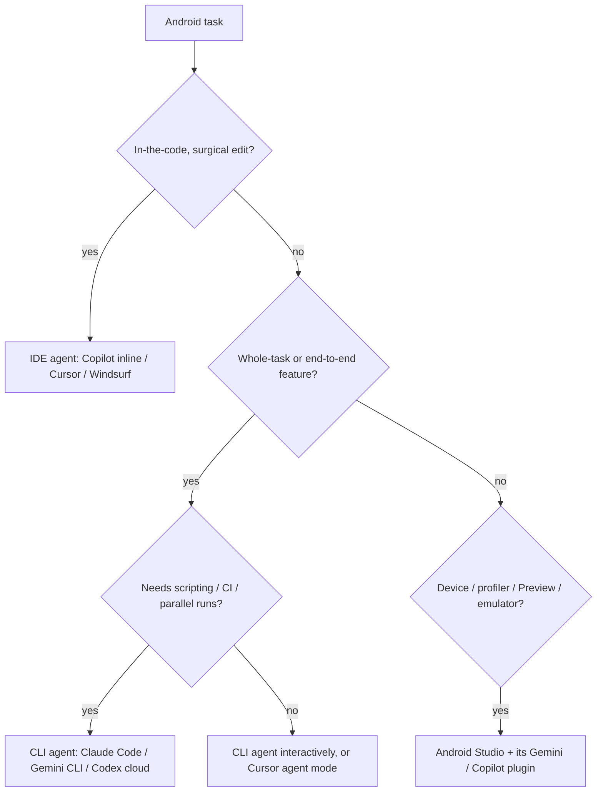
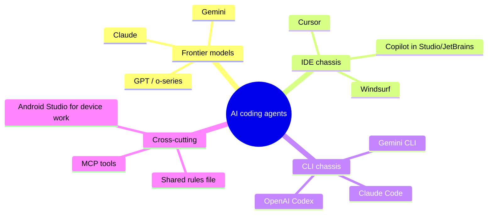

# Lesson 02 — AI Coding Agents

> After this lesson you can tell the major AI coding agents apart — Cursor, Claude Code, Gemini CLI, OpenAI Codex, Windsurf, GitHub Copilot — explain the IDE-vs-CLI split, and pick the right one for an Android task without falling for hype.

**Module:** 16 · **Lesson:** 02 · **Level:** 🟢🟡🔴 · **Est. time:** 60–80 min

---

## 1. Concept

### 🟢 For beginners — *what is it and why do I care?*

In [Lesson 01](01-what-agentic-ai-is.md) you learned an agent is *an LLM in a loop with tools*. An **AI coding agent** is that idea packaged as a product you actually install — it can read your Android project, edit files, run Gradle, and loop until the task is done.

They come in two body shapes:

- **Editor-shaped** — it lives *inside* a code editor. You see your files, and the AI edits them in front of you with an "accept/reject" diff. Examples: **Cursor**, **Windsurf**, **GitHub Copilot** (inside VS Code / Android Studio / JetBrains).
- **Terminal-shaped** — it lives in your *command line*. You type a goal, and it works in the repo, printing what it reads and changes. Examples: **Claude Code**, **Gemini CLI**, **OpenAI Codex CLI**.

Why care? Because they're genuinely different tools for different moments. The editor-shaped ones are great when you're *in the code* tweaking a `LazyColumn`. The terminal-shaped ones shine for *whole-task* jobs ("add a settings screen end-to-end") and for scripting/CI. Picking the wrong shape feels like using a screwdriver as a hammer — it sort of works, badly.

### 🟡 For intermediate devs — *the mechanism*

All of these wrap a frontier model (Anthropic's Claude, OpenAI's GPT/o-series, Google's Gemini) in the perceive→reason→act→observe loop. What differs is the **harness** around the model: how it gathers context, which tools it exposes, and how much it asks before acting.

The landscape, grouped by shape:

| Tool | Shape | Primary model(s) | Built for | Android fit |
|---|---|---|---|---|
| **GitHub Copilot** | IDE plugin (Android Studio/JetBrains, VS Code) | GPT / Claude / Gemini (selectable) | Inline completion + chat + an "agent mode" | First-class **inside Android Studio** via the JetBrains plugin |
| **Cursor** | Standalone IDE (VS Code fork) | Claude / GPT / Gemini (selectable) | Multi-file edits, codebase-aware chat, agent loops | Strong for Kotlin editing; not the Android IDE, so device/emulator tooling lives elsewhere |
| **Windsurf** | Standalone IDE (VS Code fork) | Multiple (selectable) | "Flow" agentic edits with project awareness | Similar to Cursor; pick on feel/pricing |
| **Claude Code** | CLI (terminal) | Claude (Anthropic) | Whole-task agentic coding, scriptable, MCP tools | Excellent for end-to-end tasks + Gradle in any project, Android included |
| **Gemini CLI** | CLI (terminal) | Gemini (Google) | Agentic coding with very large context | Good for big-context repo work; ties into Google's stack |
| **OpenAI Codex** | CLI + cloud agent | GPT / o-series (OpenAI) | Delegated tasks, sandboxed cloud runs | Good for parallel, sandboxed task delegation |

Two mechanics matter most in practice:

1. **Context gathering.** IDE agents (Cursor/Windsurf/Copilot) index your project and use your open files and cursor as signal. CLI agents start "cold" and *explore* — they read the file tree and grep their way in. Neither is strictly better; they fail differently.
2. **Approval posture.** Copilot inline is rung 0–1 (you accept tokens). Cursor/Windsurf agent modes and the CLI agents reach rung 2–3 (they loop and edit, gated by diffs/approvals). You choose how much leash via settings.

### 🔴 For senior devs — *trade-offs, edges, internals*

The honest, vendor-neutral view:

- **The model is necessary but not sufficient — the harness decides the experience.** Two tools running the *same* Claude model can feel worlds apart because one prunes context well, retries on a failed Gradle run, and writes clean diffs, while the other floods the window and gives up. When you evaluate a tool, you're evaluating its **loop and context strategy**, not just "which model." Benchmarks measure the model; your Tuesday measures the harness.
- **IDE vs CLI is a context-vs-control trade.** IDE agents have *ambient* context (open files, LSP/type info, the symbol under your cursor) which makes surgical, in-flow edits superb. CLI agents have *clean-room* context and a full shell, which makes them better at *whole-task* execution, automation, and CI — but they can wander before they find the right file. Seniors keep both and route by task.
- **MCP is the extensibility story.** The **Model Context Protocol** lets you hand an agent *your* tools — a Gradle wrapper, your test runner, a design-system linter, your issue tracker — through a standard interface. CLI agents (Claude Code, Gemini CLI) and increasingly IDE agents support it. This is how an agent stops being generic and starts knowing *your* repo's commands. It's also a new **trust surface**: an MCP server can read what the agent reads.
- **Android Studio is still home for device work.** None of these replace Android Studio for the emulator, Layout Inspector, profiler, APK Analyzer, or Compose `@Preview` rendering. The realistic 2026 setup is **Android Studio (with its Gemini integration and/or the Copilot/JetBrains plugin) for in-IDE flow + a CLI agent in the terminal for whole-task work**. Don't pick one and pretend the other doesn't exist.
- **Lock-in is mild but real.** Project-level config (`.cursorrules`, `AGENTS.md`/`CLAUDE.md`, MCP server definitions) and muscle memory accrue per tool. Prefer tools that read a **shared, plain-text instructions file** so your "house rules" (Compose idioms, no deprecated APIs, test-before-finish) survive a tool switch.
- **Cost models differ and bite at scale.** Per-seat subscription (Copilot/Cursor/Windsurf) vs. token/usage metering (CLI agents on API keys). A chatty autonomous agent run can be expensive; a `max_steps` cap (Lesson 01) is also a budget control.

### Analogy

**A workshop of power tools.** Copilot inline is a **cordless screwdriver** — instant, in your hand, perfect for one screw at a time. Cursor/Windsurf are a **workbench with a drill press** — you bring the piece to a stationary, context-rich station for precise multi-hole work. Claude Code / Gemini CLI are a **robot arm on the factory floor** — you hand it a whole assembly job and it runs the line. The robot doesn't replace the screwdriver; a good shop owns all three and reaches for the right one.

### Mental model

> **Same engine (a frontier model), different chassis (the harness).** IDE agents give you context-rich, in-flow edits; CLI agents give you clean-room, whole-task execution and automation. Pick the chassis by the job, keep your house rules in a plain-text file, and keep Android Studio for device work.

### Real-world example

A team ships a feature: a dev uses **Copilot in Android Studio** to autocomplete a `@Composable` and chat about a `Modifier` chain (in-flow). For the bigger task — "scaffold the new `Notifications` feature module with a `ViewModel`, repository, and tests" — they run **Claude Code** in the terminal, which explores the repo, generates the files, runs `./gradlew test`, and opens a diff. Both read the same checked-in `CLAUDE.md` that says "Material 3, `StateFlow` + `collectAsStateWithLifecycle`, no deprecated APIs, tests before finishing." Same rules, two chassis.

---

## 2. Visual Learning

**ASCII — the two shapes:**
```text
        IDE-SHAPED (Cursor / Windsurf / Copilot)        CLI-SHAPED (Claude Code / Gemini CLI / Codex)
   ┌───────────────────────────────────────────┐      ┌───────────────────────────────────────────┐
   │  editor pane            AI side-panel      │      │  $ agent "add a Settings screen, keep      │
   │  ┌───────────────┐      ┌────────────────┐ │      │     tests green"                           │
   │  │ ProfileScreen │ ◀──▶ │ proposes diff  │ │      │  • reading app/build.gradle.kts            │
   │  │  .kt (open)   │      │ accept/reject  │ │      │  • editing SettingsViewModel.kt            │
   │  └───────────────┘      └────────────────┘ │      │  • ./gradlew testDebugUnitTest → PASS      │
   │  ambient context: open files, types, cursor│      │  clean-room context: explores via shell    │
   └───────────────────────────────────────────┘      └───────────────────────────────────────────┘
```

**Mermaid — decision flow: which agent for the task?**


**Mermaid — shared engine, different chassis (mind map):**


**Illustration prompt (paste into an image generator):**
```text
Illustration: a sleek workshop. Three labeled tools sit on a bench connected by glowing cables to a
single central "engine" sphere labeled FRONTIER MODEL. Tool 1: a cordless screwdriver labeled
"Copilot inline". Tool 2: a drill press on a workbench labeled "Cursor / Windsurf (IDE)". Tool 3:
a robot arm on a conveyor labeled "Claude Code / Gemini CLI (terminal)". To the side, a separate
station labeled "Android Studio: emulator · profiler · Preview" with a phone on a stand. A small sign
reads "same engine, different chassis." Modern, vibrant, clean labels, soft studio lighting.
```

---

## 3. Code

> For an AI tool comparison, the load-bearing "code" is the **per-tool config and invocation** — how you tell each agent your Android house rules, and how you actually drive it. These are real artifacts you'd commit or type.

### 🟢 Beginner — one shared rules file every agent can read

```markdown
<!-- AGENTS.md / CLAUDE.md — checked into the repo root. Tool-agnostic house rules. -->
# Project rules for AI coding agents

## Stack (2026)
- Kotlin 2.x (K2), Compose BOM, Material 3, Strong Skipping on.
- State: StateFlow + collectAsStateWithLifecycle. Hoist state; UDF.
- Navigation: type-safe Navigation Compose.

## Hard rules
- Never use deprecated APIs without an explicit ❌ comment and a replacement.
- After any code change, run `./gradlew :app:testDebugUnitTest` and report the result.
- Do not edit generated files or touch local.properties / signing config.
```

**Explanation.** Every major agent looks for a plain-text instructions file (Claude Code reads `CLAUDE.md`; many tools read `AGENTS.md`; Cursor reads `.cursorrules`). Keeping your standards in **one place** means switching chassis doesn't lose your house rules. This is your portable "definition of done."

**Common mistakes.**
```markdown
<!-- ❌ Vague, unenforceable, tool-specific only -->
Please write good, modern Kotlin.   <!-- no version, no verify step, no guardrail -->
```
Rules with no concrete API targets and no "run the tests" step give the agent nothing to check itself against.

**Best practices.**
- Pin versions and idioms; include a **verify step** ("run these tests") and **forbidden files**.
- Keep it tool-agnostic so it survives a Cursor→Claude Code switch; symlink/duplicate to each tool's expected filename if needed.

---

### 🟡 Intermediate — driving an IDE agent vs. a CLI agent on the same task

```text
# Task: "Add a 'mark all as read' action to NotificationsViewModel and test it."

## IDE agent (Cursor / Windsurf agent mode), with NotificationsViewModel.kt open:
Prompt in the side panel:
  "Add markAllAsRead() to this ViewModel: set every item's isRead=true immutably,
   expose it through onEvent(NotificationsEvent.MarkAllRead). Then add a unit test
   in NotificationsViewModelTest. Follow AGENTS.md. Show me the diff before applying."
→ It uses the OPEN file + type info as context, proposes a multi-file diff, you accept/reject.

## CLI agent (Claude Code) from the repo root:
$ claude "Add markAllAsRead() to NotificationsViewModel (immutably set isRead=true on all
  items, wired via onEvent(MarkAllRead)). Add a NotificationsViewModelTest case.
  Follow CLAUDE.md. Run the unit tests and report results before finishing."
→ It EXPLORES to find the files, edits, runs `./gradlew testDebugUnitTest`, prints the diff.
```

**Explanation.** Same goal, two chassis. The IDE agent leans on **ambient context** (you already have the file open, the LSP knows the types). The CLI agent starts cold and **explores**, but then runs the test command itself as part of the loop. Notice both prompts point at the shared rules file and demand a diff/test before finishing — that's how you keep quality identical across tools.

**Common mistakes.**
```text
# ❌ CLI agent task with no exploration hint and no verify step:
$ claude "fix the notifications thing"
# Cold-start + vague goal + no test gate ⇒ it edits the wrong file and claims success.

# ❌ IDE agent with the WRONG file open:
# (RandomScreen.kt focused) "add markAllAsRead here" ⇒ it edits ambient context, i.e. the wrong class.
```
CLI agents punish vagueness (no ambient context to save you); IDE agents punish a misleading open file.

**Best practices.**
- For **CLI** agents: name the target, point at the rules file, and demand a verify step — they have no cursor to infer intent.
- For **IDE** agents: open the *right* file first; ambient context is a feature only when it's the correct context.
- Always require a diff/test before applying, regardless of chassis.

---

### 🔴 Production — a tool-routing policy + MCP wiring (team standard)

```yaml
# .ai/routing.yaml — team policy: which chassis for which job, and what tools each gets.
defaults:
  rules_file: AGENTS.md          # single source of house rules; CLAUDE.md symlinks to it
  require_diff_review: true
  verify: "./gradlew :app:testDebugUnitTest"

routes:
  - when: inline_completion_or_micro_edit
    use: copilot_in_android_studio        # rung 0–1; stays in the IDE for device-adjacent work
  - when: multi_file_edit_in_flow
    use: cursor_agent_mode                 # rung 2–3; diff-gated
  - when: whole_task_or_ci
    use: claude_code_cli                   # rung 2–3; scriptable; runs the verify step itself
  - when: device | profiler | preview | emulator
    use: android_studio                    # AI never replaces Studio's device tooling

mcp_servers:                                # extend CLI/agent tools with OUR repo's commands
  gradle:
    command: ["./scripts/mcp-gradle.sh"]    # exposes build/test/lint as typed tools
    trust: read_write
  design_lint:
    command: ["./scripts/mcp-design-lint.sh"]
    trust: read_only                        # least privilege: linter can't write
guardrails:
  mcp_servers_allowlist_only: true          # only the two above; no arbitrary servers
  forbid_paths_in_context: ["local.properties", "**/*.jks", "**/google-services.json"]
```

**Explanation.** At team scale you stop arguing about "which AI is best" and **route by task**, with one rules file and a shared verify command so output quality is uniform. **MCP servers** turn generic agents into *repo-aware* ones by exposing your real Gradle/lint commands as typed tools — and they're granted **least privilege** (the design linter is read-only). The path denylist keeps secrets out of every agent's context, no matter the chassis.

**Common mistakes.**
```yaml
# ❌ "One tool to rule them all" — forcing a CLI agent to do in-flow micro-edits, or vice versa.
routes: [ { when: everything, use: cursor_only } ]

# ❌ Trusting any MCP server with read_write and no allowlist:
mcp_servers: { random_server: { trust: read_write } }   # new trust surface, can exfiltrate code
```
Mono-tool policies waste each chassis's strengths; an unvetted read-write MCP server is a supply-chain and data-leak risk.

**Best practices.**
- **Route by task**, not by loyalty; keep Android Studio for device work explicitly in the policy.
- One **shared rules file** + one **shared verify command** = uniform quality across tools.
- Treat MCP servers as a **trust surface**: allowlist them, grant least privilege, and keep secrets out of context everywhere.

---

## 4. Interview Questions

**🟢 Beginner**

1. *What's the difference between an IDE-shaped agent and a CLI-shaped agent?*
   > IDE agents (Cursor, Windsurf, Copilot) live inside an editor and edit open files with an accept/reject diff, using ambient context like open files and the cursor. CLI agents (Claude Code, Gemini CLI, Codex) live in the terminal, explore the repo from a cold start, run shell/Gradle commands, and are better for whole-task and CI work.
2. *Does an AI coding agent replace Android Studio?*
   > No. Agents edit code and run builds, but Android Studio remains essential for the emulator, profiler, Layout Inspector, APK Analyzer, and `@Preview` rendering. The realistic setup is Android Studio for device-adjacent work plus an agent (in-IDE or CLI) for coding.

**🟡 Intermediate**

3. *Two tools run the same underlying model. Why might they feel very different?*
   > Because the **harness** differs — how it gathers and prunes context, which tools it exposes, how it retries failed commands, and how clean its diffs are. The model is the engine; the harness is the chassis and it dominates the day-to-day experience.
4. *What is MCP and why does it matter for Android agents?*
   > The Model Context Protocol is a standard way to give an agent your own tools (Gradle wrapper, test runner, design linter, issue tracker) through a typed interface. It turns a generic agent into a repo-aware one. It's also a trust surface, so servers should be allowlisted and least-privileged.

**🔴 Senior**

5. *How would you set a team standard so AI output quality is consistent across whoever's using whichever tool?*
   > A single checked-in rules file (AGENTS.md/CLAUDE.md) pinning stack, idioms, forbidden files, and a verify step; a routing policy mapping task types to the right chassis; one shared verify command (e.g. the unit-test Gradle task) every agent must run before finishing; mandatory diff review; and an MCP allowlist with least privilege. Quality then comes from the shared process, not from which model someone picked.
6. *What are the risks of standardizing on a single AI coding tool, and how do you mitigate lock-in?*
   > Risks: you lose the strengths of the other chassis (in-flow vs whole-task), and config/muscle-memory accrue per tool. Mitigate by keeping house rules in a **tool-agnostic plain-text file**, expressing repo capabilities via **MCP** (portable across MCP-supporting agents), and routing by task so you retain optionality rather than betting the workflow on one vendor.

---

## 5. AI Assistant

**Prompt example (picking a tool for a concrete task):**
```text
I need to add a whole new "Settings" feature module to an Android Compose app (ViewModel,
repository, Room DAO, screen, and unit tests), keep ./gradlew test green, and I want it
scriptable so CI can re-run it. Recommend whether to use an IDE agent (Cursor/Windsurf/Copilot)
or a CLI agent (Claude Code/Gemini CLI/Codex), and explain the trade-off in one paragraph.
Then write the exact CLI invocation, pointing at our AGENTS.md and requiring a test run before finishing.
```

**AI workflow — where each chassis helps vs. hurts on *this* topic.**
- ✅ IDE agents: surgical, in-flow edits where ambient context (open file, types) is the win — Modifier chains, a single composable, a focused refactor you're watching.
- ✅ CLI agents: whole-task generation, repetitive cross-file refactors, and anything you want scripted/CI-driven — they run the verify step themselves.
- ⚠️ Don't ask a chatbot "which tool is best" and take it as gospel — model knowledge of fast-moving tools goes stale. Verify capabilities against current docs, and judge the **harness on your own repo**, not on a benchmark.

**Review workflow — check tool choice/config against this lesson's *Common Mistakes*:**
- Is there **one shared, tool-agnostic rules file** with pinned idioms and a verify step?
- Did you pick the chassis that matches the task (in-flow vs whole-task), not just your favorite?
- For a **CLI** task: did the prompt name the target and demand a verify step (no ambient context to save it)?
- For an **IDE** task: is the **right file** open so ambient context helps rather than misleads?
- Are MCP servers **allowlisted, least-privileged**, and are secret files denied from context?

**Validation workflow — prove the tool/setup is sound:**
1. Run the **same small task** on an IDE agent and a CLI agent; compare diffs and whether each ran the tests. This calibrates the harnesses on *your* code.
2. Confirm each tool actually reads your rules file (ask it to restate the house rules).
3. Verify the agent ran the **shared verify command** and that the suite is green before you accept.
4. For MCP: confirm only allowlisted servers loaded and that no secret path entered context (check the transcript/logs).

> **AI drafts, you decide.** The model is the engine, but quality lives in the chassis and your gates. Route by task, keep one rules file, run the verify step, and review the diff — every time, on every tool.

---

## Recap / Key takeaways

- AI coding agents come in two chassis: **IDE-shaped** (Cursor, Windsurf, Copilot — ambient context, in-flow edits) and **CLI-shaped** (Claude Code, Gemini CLI, Codex — clean-room context, whole-task + CI).
- They wrap the **same frontier models**; the **harness** (context, tools, retries, diffs) decides the experience far more than the model name.
- **Android Studio stays** for the emulator, profiler, Layout Inspector, and `@Preview` — agents don't replace it.
- **MCP** makes agents repo-aware by exposing your tools — and is a **trust surface** to allowlist and least-privilege.
- Standardize with **one tool-agnostic rules file**, a **shared verify command**, **task-based routing**, and **diff review** — so quality is uniform regardless of tool.

➡️ Next: **[Lesson 03 — The planner → architect → coder → reviewer → human loop](03-planner-architect-coder-reviewer-loop.md)** — the roles in an agentic workflow and how work hands off between them.
