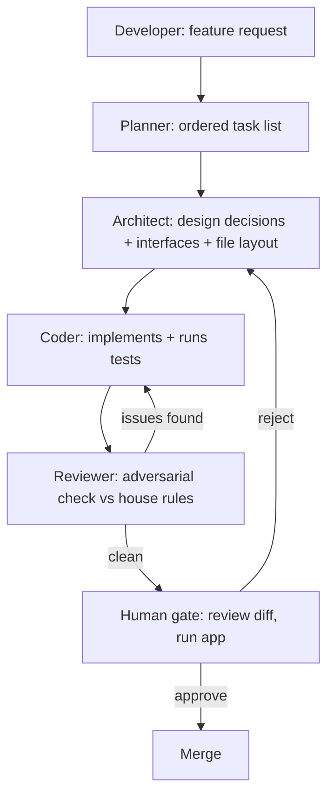
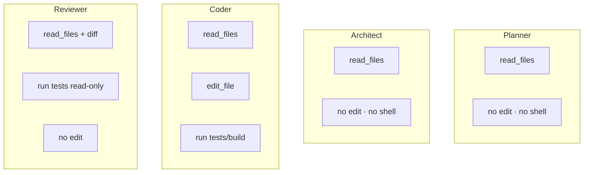

# Lesson 03 — The Planner → Architect → Coder → Reviewer → Human Loop

> After this lesson you can run a real agentic workflow as a relay of specialized roles, design clean handoffs between them, and place the human gate where it actually protects the codebase.

**Module:** 16 · **Lesson:** 03 · **Level:** 🟢🟡🔴 · **Est. time:** 75–90 min

---

## 1. Concept

### 🟢 For beginners — *what is it and why do I care?*

In [Lesson 01](01-what-agentic-ai-is.md) an agent was a single loop. But asking *one* agent to "plan, design, write, and review" a feature all at once is like asking one person to be the architect, the builder, *and* the inspector of a house — they get tired, skip steps, and miss their own mistakes.

The fix is a **relay of roles**, each a focused agent with one job:

1. **Planner** — breaks your request into clear, ordered steps. ("First the data model, then the repository, then the ViewModel, then the screen, then tests.")
2. **Architect** — decides *how* it should be built to fit the codebase. ("Use `StateFlow` + a sealed `UiState`, put the repo behind an interface, follow the existing module structure.")
3. **Coder** — actually writes the Kotlin/Compose code, following the plan and the design.
4. **Reviewer** — checks the coder's output for bugs, mistakes, and rule violations *before a human sees it*.
5. **Human** (you) — the final gate. You read the diff, run the app, and decide to merge or send it back.

Each role passes a clean **handoff** to the next — a plan, a design doc, a diff, a review report. Why care? Because a focused agent does its one job better than a jack-of-all-trades, and a reviewer agent catches a lot of slop *before it wastes your time*. You stay the boss; the robots do the relay.

### 🟡 For intermediate devs — *the mechanism*

This is **separation of concerns applied to agents**. Each role gets its own system prompt, its own allowed tools, and a **structured artifact** it must produce for the next role. The pipeline:

```text
You → Planner → (plan) → Architect → (design) → Coder → (diff) → Reviewer → (report) → You → merge
```

Key mechanics:

- **Each role is constrained.** The planner has *no* `edit_file` tool — it can't write code, only plan. The reviewer has read-only tools — it critiques, it doesn't "fix and hide." Constraining tools per role is what keeps the separation honest.
- **Handoffs are explicit artifacts**, not vibes. The planner emits a numbered task list; the architect emits decisions (state shape, interfaces, file layout); the coder emits a diff plus the test command it ran; the reviewer emits a pass/fail report mapped to a checklist. Each artifact is small, inspectable, and re-runnable.
- **The loop can cycle.** If the reviewer fails the diff, it goes **back to the coder** (not to you) with specific feedback — an internal loop that converges before reaching the human gate.
- **The human gate is non-negotiable and last.** No matter how good the reviewer is, *a person* approves the merge. The reviewer reduces what reaches you; it never replaces you.

### 🔴 For senior devs — *trade-offs, edges, internals*

The role pipeline is powerful and has sharp edges:

- **Why split at all? Focus + a fresh perspective.** A single agent reviewing its own code suffers from the same blind spot that wrote the bug — it "agrees with itself." A *separate* reviewer agent, with a different prompt and no stake in the implementation, catches issues the coder rationalized. This is the agentic version of "don't review your own PR." The cost is latency and tokens; the benefit is catching errors before they compound (Lesson 01's math).
- **Handoff fidelity is the failure point.** The pipeline is only as strong as its artifacts. A vague plan produces a confused architect; a hand-wavy design produces a coder that invents structure. Force each role to emit a **typed, checkable** artifact (a JSON task list, a decision table, a diff, a checklist report). Garbage in any handoff cascades downstream — and unlike a single agent, the downstream role *can't see* the upstream reasoning, only the artifact. Make the artifact carry everything.
- **Context isolation cuts both ways.** Giving each role only what it needs (the planner doesn't need the full codebase; the coder doesn't need the original chat) keeps each context lean and on-task. But too much isolation loses intent — the coder must receive *both* the plan *and* the architectural decisions, or it'll re-decide them. Pass the artifacts forward cumulatively where they matter.
- **The reviewer must be adversarial, not agreeable.** A reviewer prompted to "check if this looks good" will rubber-stamp. Prompt it to **hunt for specific failures** tied to your house rules: "Does any composable read state higher than needed? Is there a `collectAsState` instead of `collectAsStateWithLifecycle`? Any deprecated API? Untested branch?" An adversarial reviewer is the whole value; a polite one is theater.
- **Don't over-orchestrate small tasks.** A five-role relay for a one-line fix is absurd overhead. Scale the pipeline to the task: trivial change → one coder + human; feature → full relay. Orchestration is a tool, not a religion.
- **Determinism and idempotency of roles.** Re-running the architect on the same plan should yield substantially the same design; if it doesn't, your prompts are under-specified. Treat each role like a function you can re-invoke — pin its inputs (artifacts) so its output is stable enough to reason about.

### Analogy

**A construction crew with an inspector.** The **architect** draws the blueprints; the **project manager (planner)** sequences the work into a schedule; the **builders (coder)** pour concrete and frame walls per the blueprint; the **building inspector (reviewer)** checks the work against code before sign-off; the **owner (you)** does the final walkthrough and accepts the keys. Each role is specialized, each hands off a concrete artifact (blueprint, schedule, built structure, inspection report), the inspector can send work back to the builders, and *the owner* signs last. You'd never let the builders also be the inspector — and you shouldn't let the coder agent review its own code.

### Mental model

> **Split one big agent into a relay of focused roles, each passing a checkable artifact to the next. The reviewer is the adversarial agent that catches slop before you; the human gate is last and final.** Separate prompts, separate tools, separate perspective — that's where the quality comes from.

### Real-world example

A team automates "add offline caching to the feed." The **planner** outputs five steps (DAO → Room entity → repository merge logic → ViewModel wiring → tests). The **architect** decides to use a single-source-of-truth `Flow` from Room with a network refresh, and an interface `FeedRepository`. The **coder** implements it and runs `./gradlew testDebugUnitTest`. The **reviewer** flags that the refresh swallows exceptions silently and that one branch is untested — sends it back. The coder fixes both, re-runs, green. *Then* the human reads the diff, runs the app offline to confirm caching, and merges. Five roles, two internal loops, one human gate.

---

## 2. Visual Learning

**ASCII — the role relay with the review loop and human gate:**
```text
   YOU ──goal──▶ ┌─────────┐  plan   ┌───────────┐  design  ┌────────┐  diff
                 │ PLANNER │ ───────▶ │ ARCHITECT │ ───────▶ │ CODER  │ ──────┐
                 └─────────┘          └───────────┘          └────────┘       │
                  (no edit tools)      (no edit tools)        (writes code)    ▼
                                                                          ┌──────────┐
                          ◀── "fix X, branch Y untested" ─────────────────│ REVIEWER │
                          (loops back to CODER until clean)               │(read-only)│
                                                                          └────┬─────┘
                                                                   passes report │
                                                                                ▼
                                                                   ┌──────────────────┐
                                                                   │  HUMAN GATE      │
                                                                   │ read diff · run  │
                                                                   │ app · merge/back │
                                                                   └──────────────────┘
```

**Mermaid — the pipeline with the internal cycle:**


**Mermaid — what each role may touch (tool boundaries):**


**Illustration prompt (paste into an image generator):**
```text
Illustration: a relay race on a track, but the runners are friendly robots in hard hats, each a
different color and labeled PLANNER, ARCHITECT, CODER, REVIEWER. Each hands off a glowing baton
shaped like its artifact: a checklist (plan), a blueprint (design), a code diff, an inspection
report. The REVIEWER robot can throw the baton BACK to the CODER (a dashed return arrow). At the
finish line stands a human with a clipboard at a gate labeled "HUMAN: merge / send back". Caption:
"A relay of focused roles." Modern, vibrant, clear labels, soft studio lighting.
```

---

## 3. Code

> For this lesson, "code" is the **role definitions and their handoff artifacts** — the system prompts, tool boundaries, and the typed shapes each role emits. These are the real configs you'd commit to orchestrate the pipeline.

### 🟢 Beginner — four role prompts, each with one job

```text
# PLANNER (tools: read_file only) — emits an ordered task list, no code.
"Break the request into the smallest ordered, independently-verifiable steps for an Android
 Compose codebase. Output a numbered list. Do NOT write code or pick libraries — that's the
 architect's job."

# ARCHITECT (tools: read_file only) — emits design decisions, no code.
"Given the plan and the existing codebase, decide the state shape, interfaces, and file layout.
 Output a short decision table (decision → rationale). Follow AGENTS.md. Do NOT write the code."

# CODER (tools: read_file, edit_file, run_command) — implements, then verifies.
"Implement the plan using the architect's decisions. After editing, run
 `./gradlew :app:testDebugUnitTest` and report results. Output the diff. Follow AGENTS.md."

# REVIEWER (tools: read_file, run_command read-only) — adversarial check, no edits.
"Review the coder's diff. HUNT for: state read too high, collectAsState vs WithLifecycle,
 deprecated APIs, untested branches, mutable exposure. Output PASS/FAIL + specific issues."
```

**Explanation.** Each role is a separate agent invocation with a tight prompt and a **restricted toolset**. The planner and architect literally *cannot* write code (no `edit_file`), so they stay in their lane. The reviewer is told to **hunt**, not to bless. The separation is enforced by tools, not just by polite instructions.

**Common mistakes.**
```text
# ❌ One mega-prompt doing everything → no separation, no fresh-eyes review.
"Plan, design, code, and review this feature, then tell me it's done."

# ❌ Reviewer prompted to agree → rubber stamp.
"Check if this code looks good." 
```
A single role can't review itself with fresh eyes, and a polite reviewer finds nothing.

**Best practices.**
- One job per role; **enforce lanes with tools** (planner/architect get no `edit_file`).
- Make the reviewer **adversarial** and tie it to concrete failure modes.

---

### 🟡 Intermediate — typed handoff artifacts (so nothing is "vibes")

```kotlin
// The contracts passed between roles. Typed = inspectable, re-runnable, un-hand-wavy.

data class PlanStep(val order: Int, val task: String, val verifiableBy: String)
data class Plan(val steps: List<PlanStep>)

data class Decision(val choice: String, val rationale: String)
data class ArchitecturePlan(val decisions: List<Decision>, val filesToTouch: List<String>)

data class CoderResult(
    val diff: String,
    val commandRun: String,         // e.g. "./gradlew :app:testDebugUnitTest"
    val testOutcome: String,        // "PASS" / "FAIL: 2 tests"
)

data class ReviewIssue(val severity: Severity, val location: String, val problem: String)
data class ReviewReport(val verdict: Verdict, val issues: List<ReviewIssue>) // PASS routes to human; FAIL → coder

enum class Severity { BLOCKER, MAJOR, MINOR }
enum class Verdict { PASS, FAIL }
```

**Explanation.** Each handoff is a **typed artifact**, not a paragraph. The plan carries `verifiableBy` (how to prove a step is done); the coder result carries the *actual command run and its outcome* (so the reviewer/human can trust it); the review report carries structured issues that route the loop. Typed artifacts make the pipeline auditable and let an orchestrator branch on `verdict`.

**Common mistakes.**
```kotlin
// ❌ Free-text handoff — the next role can't reliably parse intent or branch on it.
val handoff: String = "I planned some stuff, then designed it, then coded it. Seems fine."

// ❌ Coder result with no evidence of verification:
data class CoderResult(val diff: String)   // did the tests pass? unknown ⇒ untrustworthy
```
Without a structured outcome, you can't tell a green run from wishful thinking.

**Best practices.**
- Force each role to emit a **typed artifact**; include *evidence* (command + outcome) in the coder's.
- Carry forward what downstream needs (the coder needs both `Plan` and `ArchitecturePlan`), and branch the loop on the reviewer's `verdict`.

---

### 🔴 Production — orchestrator with the internal review loop and the human gate

```kotlin
// Orchestrates the relay. Roles are functions; artifacts flow; the human approves last.
suspend fun runFeaturePipeline(request: String): MergeDecision {
    val plan: Plan = planner.run(request)                      // role 1 — no edit tools
    val design: ArchitecturePlan = architect.run(request, plan) // role 2 — no edit tools

    var coderResult = coder.run(plan, design)                  // role 3 — writes + verifies
    var review = reviewer.run(coderResult)                     // role 4 — adversarial, read-only

    // Internal loop: reviewer ⇄ coder until clean OR we give up and escalate.
    var rounds = 0
    while (review.verdict == Verdict.FAIL && rounds < MAX_REVIEW_ROUNDS) {
        coderResult = coder.run(plan, design, feedback = review.issues) // back to CODER, not human
        review = reviewer.run(coderResult)
        rounds++
    }
    if (review.verdict == Verdict.FAIL) return escalateToHuman(coderResult, review) // don't hide failure

    // Hard gate: a human ALWAYS approves the merge — the reviewer reduces work, never replaces the human.
    return humanGate(
        diff = coderResult.diff,
        evidence = coderResult.testOutcome,
        reviewerReport = review,
    ) // returns Merge or SendBack
}
```

**Explanation.** This is the whole pipeline as policy: focused roles, a **bounded internal loop** where the reviewer sends failures back to the *coder* (sparing the human), an **escalation** path when it can't converge (failures surface, never get swallowed), and a **mandatory human gate** at the end. `MAX_REVIEW_ROUNDS` prevents an infinite coder⇄reviewer ping-pong — the agentic version of Lesson 01's step cap.

**Common mistakes.**
```kotlin
// ❌ No bound on the review loop → coder and reviewer argue forever, burning tokens.
while (review.verdict == Verdict.FAIL) { /* ... */ }

// ❌ Auto-merge on reviewer PASS → the human gate is gone; a confident-but-wrong reviewer ships a bug.
if (review.verdict == Verdict.PASS) gitMerge(coderResult.diff)
```
An unbounded loop hangs; auto-merge deletes the one safety check that actually protects production.

**Best practices.**
- Bound the internal review loop; **escalate** (don't bury) unresolved failures.
- Route review failures **back to the coder**, not to the human — that's the point of the reviewer.
- Keep the **human gate mandatory and last**; pass the human the diff *and* the evidence *and* the reviewer's report.

---

## 4. Interview Questions

**🟢 Beginner**

1. *Name the roles in the planner→architect→coder→reviewer→human loop and what each does.*
   > Planner breaks the request into ordered steps; Architect decides how to build it (state shape, interfaces, layout); Coder writes the code and runs tests; Reviewer adversarially checks the diff against the rules; Human gives the final approval to merge.
2. *Why use multiple specialized agents instead of one agent doing everything?*
   > A focused agent does its single job better and a separate reviewer brings fresh eyes — an agent reviewing its own work shares the blind spot that created the bug. The relay catches mistakes earlier and keeps each context lean and on-task.

**🟡 Intermediate**

3. *Why should handoffs between roles be typed artifacts rather than free text?*
   > Downstream roles often can't see upstream reasoning — only the artifact. A typed artifact (task list, decision table, diff + test outcome, review report) is inspectable, parseable, and lets the orchestrator branch on it (e.g. route on the reviewer's verdict). Free text causes intent to leak and the next role to re-decide things.
4. *Where does the review loop send a failing diff, and why?*
   > Back to the **coder**, not the human, with specific feedback. The reviewer's job is to converge the work internally so that only clean diffs reach the human gate, reducing human review load. The human is the final gate, not the first responder to every defect.

**🔴 Senior**

5. *How do you keep the reviewer role from rubber-stamping the coder's output?*
   > Make it adversarial and concrete: prompt it to hunt for specific, named failure modes tied to house rules (state read too high, `collectAsState` vs lifecycle-aware, deprecated APIs, untested branches, mutable exposure), give it read-only tools so it can't "fix and hide," run it as a separate agent with no stake in the implementation, and require a structured PASS/FAIL report with located issues. A reviewer told to "see if it looks good" finds nothing.
6. *What can go wrong in a role pipeline, and how do you bound it?*
   > Handoff fidelity (vague artifacts cascade downstream), context isolation losing intent (coder missing the architect's decisions), infinite coder⇄reviewer loops, over-orchestrating trivial tasks, and swallowing unresolved failures. Bound with typed artifacts that carry everything needed, cumulative forwarding of the artifacts that matter, a `MAX_REVIEW_ROUNDS` cap with escalation, task-scaled orchestration (skip the relay for one-liners), and a mandatory human gate that never auto-merges.

---

## 5. AI Assistant

**Prompt example (standing up the relay for a real feature):**
```text
Act as an orchestrator for an Android Compose feature: "add pull-to-refresh + error retry to the feed."
Run four roles in sequence and show each artifact:
1) PLANNER (no code): numbered, independently-verifiable steps.
2) ARCHITECT (no code): decision table (state shape, interfaces, files) per AGENTS.md.
3) CODER: implement using the decisions; run `./gradlew :app:testDebugUnitTest`; output the diff + outcome.
4) REVIEWER (read-only): hunt for state-read-too-high, collectAsState misuse, deprecated APIs, untested
   branches, mutable exposure; output PASS/FAIL + located issues. If FAIL, hand specific feedback back to
   the coder (max 3 rounds), then stop and summarize for my human review. Do NOT merge.
```

**AI workflow — where the relay helps vs. hurts on *this* topic.**
- ✅ Great for: non-trivial features where planning, design, and an extra review pass genuinely reduce defects; anything you'd normally PR-review anyway.
- ⚠️ Overkill for: one-line fixes and tiny edits — a full five-role relay is pure latency/cost there. And the reviewer never replaces *your* final gate.

**Review workflow — check the pipeline against this lesson's *Common Mistakes*:**
- Are roles **actually separated** with restricted tools (planner/architect can't edit)?
- Are handoffs **typed artifacts** carrying evidence (the coder's *command + outcome*)?
- Is the reviewer **adversarial** and tied to concrete failure modes — not "looks good"?
- Is the internal loop **bounded** with escalation, and does it route failures **to the coder**?
- Is the **human gate mandatory and last** (no auto-merge on reviewer PASS)?

**Validation workflow — prove the relay produced something trustworthy:**
1. Read the **plan and design artifacts** first — if they're vague, stop; downstream will be worse.
2. Confirm the coder's reported **test command actually ran** and was green (don't take "done" on faith — re-run it).
3. Read the **reviewer report**; spot-check one of its claims against the diff to confirm it's a real reviewer, not a rubber stamp.
4. At the **human gate**: read the diff, run the app for the user-visible behavior (e.g. pull-to-refresh + an error path), then merge or send back.

> **AI drafts, you decide.** The relay's value is focus plus an adversarial reviewer that filters slop before it reaches you. But the reviewer reduces your work; it never *is* your approval. You read the diff and run the app — every time.

---

## Recap / Key takeaways

- Replace one do-everything agent with a **relay of focused roles**: planner → architect → coder → reviewer → human.
- **Enforce lanes with tools** (planner/architect can't edit) and pass **typed handoff artifacts** (plan, design, diff+evidence, review report).
- The **reviewer must be adversarial** and tied to concrete failure modes — a fresh-eyes agent catches what the coder rationalized.
- The review loop sends failures **back to the coder** (bounded, with escalation), sparing the human until the diff is clean.
- The **human gate is mandatory and last** — the reviewer reduces your load, never replaces your approval; scale the whole relay to the task.

➡️ Next: **[Lesson 04 — Multi-agent workflows](04-multi-agent-workflows.md)** — running agents in parallel, dividing labor, and merging their work without chaos.
