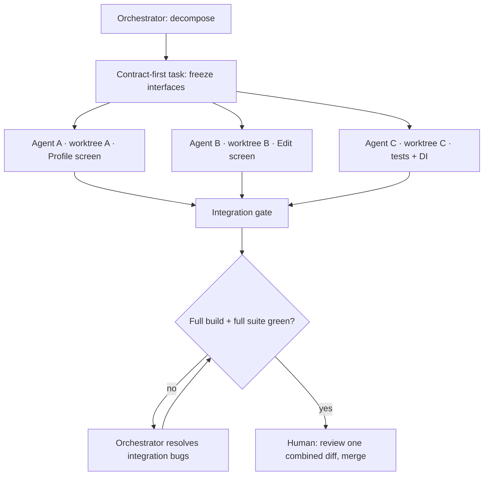
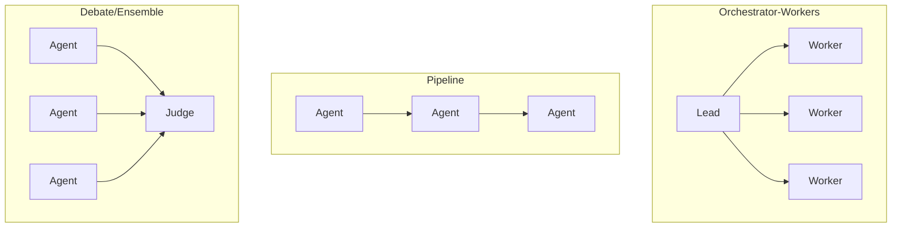

# Lesson 04 — Multi-Agent Workflows

> After this lesson you can run several AI agents in parallel, divide a feature into conflict-free slices, choose an orchestration topology, and merge their work without stepping on shared state.

**Module:** 16 · **Lesson:** 04 · **Level:** 🟢🟡🔴 · **Est. time:** 80–95 min

---

## 1. Concept

### 🟢 For beginners — *what is it and why do I care?*

[Lesson 03](03-planner-architect-coder-reviewer-loop.md) ran roles one after another, like a relay. **Multi-agent workflows** are about running agents *at the same time* — in **parallel** — to get more done faster.

Think of building a house. A relay is one crew doing foundation, then framing, then roofing in sequence. Parallel work is **three crews at once**: one on the kitchen, one on the bathroom, one on the garage. They finish in a third of the time — *as long as they don't both try to remodel the same wall*.

That last part is the whole catch. When two agents edit the *same file* or change the *same shared thing*, you get a collision — a **merge conflict** or, worse, two changes that each work alone but break together. So multi-agent work is two skills:

1. **Splitting** the task into independent pieces that don't overlap.
2. **Merging** the results back together safely.

Why care? A big feature ("add a whole Profile section: screen, settings, edit flow, tests") can be sliced so several agents build different parts simultaneously. Done right, it's a force multiplier. Done wrong, it's a pile of conflicting edits you spend the afternoon untangling.

### 🟡 For intermediate devs — *the mechanism*

Two questions define every multi-agent setup: **who decides the split** (topology) and **how the pieces stay isolated** (workspace).

**Topologies:**

- **Orchestrator–workers (fan-out/fan-in).** A lead agent decomposes the task, dispatches sub-tasks to worker agents, and merges their results. The most common and controllable shape.
- **Parallel independent.** You manually launch N agents on N pre-sliced tasks; no shared coordinator. Simple when slices are obviously disjoint.
- **Pipeline.** Output of one agent feeds the next (that's Lesson 03's relay — a degenerate "1-wide" case).
- **Debate/ensemble.** Multiple agents solve the *same* problem and a judge picks the best. Useful for quality, not speed.

**Isolation — the critical mechanic:** parallel agents must not write the same files at the same time. The clean solution is **git worktrees** (or branches): each agent gets its *own* checkout of the repo, makes its changes in isolation, and the orchestrator merges branches at the end. No agent sees another's half-finished edits.

```text
                ┌── worktree A (agent: Profile screen)
repo  ──split──▶├── worktree B (agent: Settings screen)   ──merge branches──▶ integrated repo
                └── worktree C (agent: tests + DI wiring)
```

The orchestrator's real job isn't the coding — it's **decomposition** (cut along seams that don't touch) and **integration** (merge, resolve, run the *full* test suite on the combined result).

### 🔴 For senior devs — *trade-offs, edges, internals*

Parallelism buys speed and costs coordination. The senior calculus:

- **The split is the whole ballgame — cut along module seams, not arbitrary lines.** Two agents editing *different feature modules* rarely conflict; two editing the *same* `ViewModel` always do. The best slices are **vertically independent** (separate screens/features) or **layered with stable contracts** (one agent owns the `Repository` *interface* first; others code against it). If you can't find a clean seam, the task isn't parallelizable yet — sequence it instead. Forcing a bad split produces more merge pain than the parallelism saved.
- **Shared state is the silent killer.** The dangerous conflicts aren't textual (git catches those) — they're **semantic**. Two agents each add a field to the same `UiState`, each passes their own tests, and the merge compiles — but one overwrote the other's `copy()` semantics, or both registered the same Hilt binding, or both edited `strings.xml`/`build.gradle.kts`. Shared, central files (DI modules, navigation graph, version catalog, resource files) are **collision magnets**. Strategy: assign one owner per shared file, or have the orchestrator make those central edits *after* fan-in.
- **Coordination overhead has a break-even point.** Decomposition, N parallel runs, and integration cost tokens and orchestration complexity. For a small task, the overhead dwarfs the savings (Amdahl's law for agents — the serial integration step caps your speedup). Parallelize when the slices are *genuinely* independent and *each* is non-trivial; otherwise a single agent is faster end-to-end.
- **Merge requires a real integration gate.** Each agent's "my tests pass" is necessary but not sufficient — they passed *in isolation*. The combined result needs the **full** suite plus a build, run by the orchestrator (or you), because integration bugs live precisely in the interactions no single agent saw. This is non-negotiable: green-in-isolation × N ≠ green-combined.
- **Determinism drops further.** N stochastic agents → N independent variance sources. Design for *verifiable integrated outcomes* (full build green, combined tests pass, diff reviewed), never for a reproducible multi-agent transcript.
- **Contract-first beats lock-step.** When agents *must* share an interface, define and freeze the **contract** (the `interface`, the data class, the navigation route signature) before fanning out, ideally as its own first task. Agents then code against a stable contract in parallel — far safer than negotiating a shared type mid-flight.

### Analogy

**A newsroom on deadline.** The **editor (orchestrator)** assigns three reporters to three *different* stories (split along non-overlapping beats), each writes in their own document (worktree isolation), and the editor lays them into one paper and proofreads the whole thing (integration + full test pass). It works because the beats don't overlap. If two reporters were assigned the *same* story, you'd get duplicated, contradictory paragraphs — exactly the semantic merge conflict of two agents editing one `ViewModel`. And the shared front-page headline (the DI module / nav graph) — the editor writes that themselves, after the stories land.

### Mental model

> **Parallelism = independent slices in isolated worktrees, then a real integration gate.** The orchestrator's job is cutting along seams that don't touch and merging with the *full* suite — not the coding. If you can't find a clean seam, don't parallelize; sequence it.

### Real-world example

A team builds a "Profile" area. The orchestrator first ships one tiny task: define `ProfileRepository` (interface) and the `ProfileUiState` contract, and merge it. *Then* it fans out three agents in three worktrees: A builds `ProfileScreen` (reads the state), B builds `EditProfileScreen` (calls the repo), C writes tests + the Hilt module. Each runs its own tests. The orchestrator merges all three branches, makes the single navigation-graph edit itself, runs the **full** `./gradlew test`, finds that A and B both imported a now-renamed symbol, fixes it, and opens one combined diff for human review.

---

## 2. Visual Learning

**ASCII — fan-out / fan-in with isolated worktrees:**
```text
                         ┌──────────────── ORCHESTRATOR ────────────────┐
                         │  decompose along seams · assign owners        │
                         └───────┬───────────────┬───────────────┬───────┘
              split (fan-out)    │               │               │
                         ┌───────▼──────┐ ┌───────▼──────┐ ┌──────▼───────┐
                         │ worktree A   │ │ worktree B   │ │ worktree C   │
                         │ Profile UI   │ │ Edit UI      │ │ tests + DI   │
                         │ own tests ✓  │ │ own tests ✓  │ │ own tests ✓  │
                         └───────┬──────┘ └───────┬──────┘ └──────┬───────┘
              merge (fan-in)     └───────────────┬┴───────────────┘
                                                 ▼
                                   ┌──────────────────────────────┐
                                   │ INTEGRATION GATE              │
                                   │ merge branches · orchestrator │
                                   │ edits shared files (nav/DI)   │
                                   │ run FULL suite + build        │
                                   └──────────────┬───────────────┘
                                                  ▼  one combined diff → HUMAN
```

**Mermaid — orchestrator topology + integration:**


**Mermaid — topologies at a glance:**


**Illustration prompt (paste into an image generator):**
```text
Illustration: a top-down newsroom. A central editor robot at a desk labeled ORCHESTRATOR hands out
three distinct story folders to three reporter robots at separate desks labeled AGENT A / B / C, each
typing in its own glowing document (a small "worktree" badge on each desk). Arrows fan out from the
editor to the reporters and fan back in to a printing press labeled "INTEGRATION GATE: full test suite".
The editor personally writes one page labeled "shared: nav graph / DI" after the stories return. A human
stands at the press exit holding the finished newspaper. Caption: "Split along seams, merge with the
full suite." Modern, vibrant, clear labels.
```

---

## 3. Code

> "Code" here is the **decomposition spec, the worktree isolation, and the integration gate** — the artifacts that make parallel agents safe. These are real configs/commands you'd use to run a multi-agent job.

### 🟢 Beginner — a decomposition that cuts along non-overlapping seams

```text
# task-split.md — the orchestrator's plan. Each slice names its files; NO file appears twice.
FEATURE: Profile section

SLICE A (agent-a): feature/profile/ProfileScreen.kt, ProfileViewModel.kt
SLICE B (agent-b): feature/profile/EditProfileScreen.kt, EditProfileViewModel.kt
SLICE C (agent-c): feature/profile/ProfileRepositoryTest.kt, di/ProfileModule.kt

SHARED (orchestrator only, AFTER merge): navigation/NavGraph.kt, app/strings.xml
CONTRACT (do first, merge before fan-out): feature/profile/ProfileRepository.kt (interface),
                                           feature/profile/ProfileUiState.kt
```

**Explanation.** The split's golden rule is visible here: **no file is owned by two agents**. Independent screens go to A and B; tests/DI to C. The genuinely shared files (nav graph, strings) are reserved for the orchestrator to edit *after* fan-in, and the shared **contract** is built and merged *first* so everyone codes against a stable type.

**Common mistakes.**
```text
# ❌ Two slices touch the same file → guaranteed conflict.
SLICE A: ProfileViewModel.kt, NavGraph.kt
SLICE B: EditProfileViewModel.kt, NavGraph.kt    # both edit NavGraph.kt → collision
```
Any file appearing in two slices is a collision waiting to happen — especially central files like the nav graph or version catalog.

**Best practices.**
- **One owner per file.** Cut along feature/module seams; reserve shared/central files for the orchestrator post-merge.
- Build and merge the **contract first** so parallel agents share a stable interface.

---

### 🟡 Intermediate — isolating agents with git worktrees

```bash
# Each agent works in its OWN checkout so nobody sees another's half-done edits.
git worktree add ../wt-profile-a feature/profile-a   # agent A's isolated workspace + branch
git worktree add ../wt-profile-b feature/profile-b   # agent B
git worktree add ../wt-profile-c feature/profile-c   # agent C

# Dispatch each agent into its worktree with ITS slice only:
(cd ../wt-profile-a && claude "Implement SLICE A from task-split.md. Run tests. Stay in your files.")
(cd ../wt-profile-b && claude "Implement SLICE B from task-split.md. Run tests. Stay in your files.")
(cd ../wt-profile-c && claude "Implement SLICE C from task-split.md. Run tests. Stay in your files.")
```

**Explanation.** `git worktree` gives each agent a **separate working directory on its own branch** from one repo — true isolation without cloning. Agents can run fully in parallel; their edits never interleave on disk. Each prompt restricts the agent to *its* files, reinforcing the no-overlap rule from the split.

**Common mistakes.**
```bash
# ❌ All agents in the SAME directory → they overwrite each other's edits live.
claude "do slice A" & claude "do slice B" & claude "do slice C"   # same cwd = chaos

# ❌ Forgetting to branch → parallel edits land on one branch, interleaved and unreviewable.
```
Running parallel agents in one shared working tree is the classic disaster — file writes race, and you can't tell who changed what.

**Best practices.**
- One **worktree + branch per agent**; never share a working directory among parallel agents.
- Constrain each agent to its slice in the prompt, as a second line of defense against overlap.

---

### 🔴 Production — the integration gate (merge + FULL suite + shared-file edits)

```bash
#!/usr/bin/env bash
# integrate.sh — orchestrator runs this AFTER all agents finish. Green-in-isolation ≠ green-combined.
set -euo pipefail

git checkout -b feature/profile-integrated main

# 1) Merge each agent's branch. Textual conflicts surface here.
for b in feature/profile-a feature/profile-b feature/profile-c; do
  git merge --no-ff "$b" || { echo "Conflict merging $b — orchestrator must resolve"; exit 1; }
done

# 2) Orchestrator makes the SHARED edits no single agent owned (nav graph, strings).
#    (done as a focused agent/human step here, against the merged tree)

# 3) THE GATE: full build + FULL test suite on the COMBINED result — catches semantic merge bugs.
./gradlew assembleDebug
./gradlew test            # entire suite, not per-module — integration bugs live in the interactions

echo "Integrated, built, and fully green → open ONE combined diff for human review."
```

**Explanation.** This is where multi-agent work is won or lost. Merging surfaces *textual* conflicts; the **full build + full suite** surfaces the *semantic* ones (duplicate DI bindings, a symbol one agent renamed that another imported, two fields fighting over `UiState`) that every agent missed because each only ran *its own* tests in isolation. The orchestrator also owns the shared-file edits, applied once against the merged tree. Only after the combined result is green does a human see a single, coherent diff.

**Common mistakes.**
```bash
# ❌ Trusting per-agent green and merging straight to main without the combined gate.
git merge feature/profile-a feature/profile-b feature/profile-c && git push   # integration bugs ship

# ❌ Running only the changed module's tests after merge:
./gradlew :feature:profile:test   # misses cross-module breakage the integration introduced
```
"Each agent's tests passed" is a statement about isolated worlds; the merge created a *new* world that nothing has tested yet.

**Best practices.**
- Always run a **full build + full suite** on the *combined* result before a human or `main` sees it.
- Orchestrator owns **shared-file edits**, applied once post-merge; resolve conflicts centrally, not per agent.
- Deliver **one combined diff** to the human gate — reviewing three half-features separately hides integration issues.

---

## 4. Interview Questions

**🟢 Beginner**

1. *What problem do parallel multi-agent workflows solve, and what's the main risk?*
   > They speed up large tasks by having several agents work simultaneously on different parts. The main risk is collisions — two agents editing the same file or shared state, producing merge conflicts or changes that break when combined.
2. *Why give each parallel agent its own git worktree?*
   > So their edits stay isolated — each works in a separate checkout on its own branch and never sees another agent's half-finished changes. The orchestrator merges the branches at the end, avoiding live file races in a shared directory.

**🟡 Intermediate**

3. *What makes a good task split for parallel agents?*
   > Slices that are genuinely independent — typically vertical (separate screens/features) or layered against a frozen contract — with **no file owned by two agents**. Shared/central files (DI module, nav graph, version catalog, resources) are reserved for the orchestrator to edit after fan-in. If no clean seam exists, sequence the work instead.
4. *Why isn't "every agent's tests passed" enough before merging?*
   > Because each agent tested its slice in **isolation**. Merging creates a new combined state with interactions no single agent saw — duplicate bindings, renamed symbols, conflicting `UiState` fields. Only a full build + full suite on the integrated result catches those semantic merge bugs.

**🔴 Senior**

5. *Describe the difference between textual and semantic merge conflicts in multi-agent work, and how you guard against each.*
   > Textual conflicts are overlapping edits to the same lines — git flags them at merge time, resolved centrally by the orchestrator. Semantic conflicts compile and each agent's tests pass, but the combined behavior is wrong (e.g., both added a field to `UiState`, one clobbered the other's `copy` semantics; both registered the same Hilt binding). Guard textual conflicts with one-owner-per-file splits; guard semantic ones with a contract-first phase, assigning shared files to the orchestrator, and a mandatory full build + full suite on the merged result.
6. *When is multi-agent parallelism the wrong choice?*
   > When the task lacks clean seams (everything routes through one `ViewModel`/file), when slices are small enough that decomposition + N runs + integration cost more than a single agent (the serial integration step caps speedup, Amdahl-style), or when correctness depends on tight coordination better served by a sequential pipeline. Parallelize only when slices are truly independent and each is non-trivial; otherwise one agent is faster end-to-end.

---

## 5. AI Assistant

**Prompt example (orchestrating a safe parallel build):**
```text
Act as an orchestrator. Feature: "add a Profile section (view screen, edit screen, tests, DI)".
1) Produce task-split.md: vertical slices where NO file is owned by two agents; list shared files
   (nav graph, strings, version catalog) as ORCHESTRATOR-ONLY post-merge; identify a CONTRACT
   (ProfileRepository interface + ProfileUiState) to build and merge FIRST.
2) Give the exact `git worktree add` commands to isolate each agent on its own branch.
3) After fan-in, give an integrate script that merges branches, applies shared-file edits, and runs
   `./gradlew assembleDebug` and the FULL `./gradlew test`. Do NOT merge to main or skip the full suite.
Target: Compose 2026, Kotlin 2.x, Hilt, type-safe Navigation.
```

**AI workflow — where multi-agent helps vs. hurts on *this* topic.**
- ✅ Great for: large features with clear vertical seams (independent screens/modules), bulk independent work (e.g., one agent per feature module), contract-first layered builds.
- ⚠️ Hurts for: tightly-coupled changes through one file, small tasks where overhead > savings, anything needing lock-step coordination. When in doubt, sequence it (Lesson 03).

**Review workflow — check the multi-agent plan against this lesson's *Common Mistakes*:**
- Does **any file appear in two slices**? (If yes, re-split — that's a guaranteed conflict.)
- Are **shared/central files** (DI, nav graph, version catalog, resources) reserved for the orchestrator post-merge?
- Is each agent in its **own worktree + branch**, not a shared directory?
- Is there a **full build + full suite** on the *combined* result — not just per-agent/per-module tests?
- Is the human handed **one combined diff**?

**Validation workflow — prove the integrated result is real:**
1. Confirm the **split** has no file owned twice before launching anything.
2. After each agent finishes, verify it **stayed in its files** (inspect each branch's diff).
3. Run the **integration gate** yourself: merge, apply shared edits, run `assembleDebug` + the **full** suite — green-combined, not green-in-isolation.
4. Review the **single combined diff**; run the app across all the new surfaces (view + edit + navigation) before merging to `main`.

> **AI drafts, you decide.** Parallel agents multiply throughput *and* variance. The split and the integration gate are where you stay in control — and "each agent's tests passed" is never your merge signal. The full suite on the combined tree is.

---

## Recap / Key takeaways

- Multi-agent workflows run agents **in parallel** for speed; the two hard skills are **splitting** (no overlap) and **merging** (safe integration).
- **Orchestrator–workers** (fan-out/fan-in) is the common topology; the orchestrator's real job is **decomposition + integration**, not coding.
- **Isolate every agent in its own git worktree + branch**; never share a working directory among parallel agents.
- Cut along **non-overlapping seams**, build the **contract first**, and reserve **shared/central files** (DI, nav graph, version catalog) for the orchestrator after fan-in.
- The **integration gate** — full build + full suite on the *combined* result — catches the semantic merge bugs no single agent saw; deliver **one combined diff** to the human.

➡️ Next: **[Lesson 05 — Automated Refactoring](05-automated-refactoring.md)** — safe, test-guarded, large-scale edits with AI.
