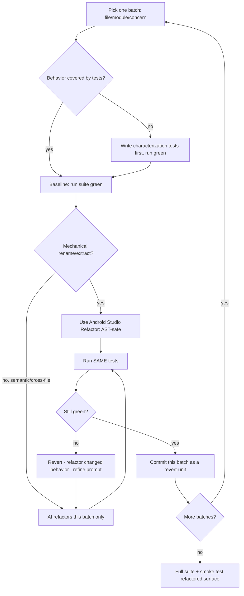
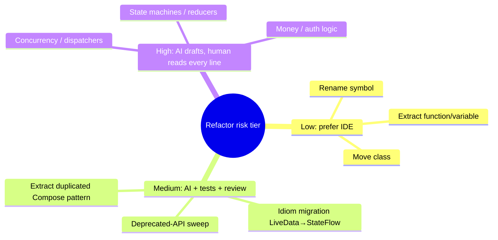

# Lesson 05 — Automated Refactoring

> After this lesson you can drive AI through large-scale Compose refactors safely — establishing a test net first, working in small verifiable batches, and proving behavior is unchanged before you commit.

**Module:** 16 · **Lesson:** 05 · **Level:** 🟢🟡🔴 · **Est. time:** 80–95 min

---

## 1. Concept

### 🟢 For beginners — *what is it and why do I care?*

**Refactoring** means changing *how* code is written without changing *what it does*. Rename a confusing variable, split a 400-line composable into smaller ones, swap `LiveData` for `StateFlow` — the app behaves identically, but the code is cleaner. The defining rule: **behavior in = behavior out**. If the screen looks or acts different afterward, that wasn't a refactor; that was a change (and possibly a bug).

AI is *fantastic* at refactoring because it's mechanical and repetitive — exactly the grind humans rush through and get wrong. "Rename `usr` to `user` in 60 files," "extract this duplicated `Modifier` chain into a function," "migrate every screen off the deprecated API." An agent can grind through all of it in minutes.

But here's the danger: a refactor's whole promise is "nothing changed." How do you *know* nothing changed? You can't eyeball 60 files. The answer — and the heart of this lesson — is **tests**. Before you let AI touch the code, you make sure there's a test net that proves the old behavior. Then if a test goes red after the refactor, you've caught the AI silently changing behavior. **No tests, no safe refactor** — with AI or without.

### 🟡 For intermediate devs — *the mechanism*

The professional automated-refactor loop has a strict order:

```text
1. PIN behavior with tests (the safety net)  ──▶  2. run them GREEN (baseline)
                                                          │
3. AI refactors in a SMALL batch ◀────────────────────────┘
        │
4. run the SAME tests ──▶ still green? → commit the batch.  red? → revert, the refactor was wrong.
        └──────────────────────── repeat per batch ──────────────────────────┘
```

The non-negotiables:

- **Characterization tests first.** Before refactoring legacy code, you write tests that *capture current behavior* (even quirky behavior) — these are your tripwire. If the code already has good tests, you're ready; if not, you add them *before* the AI starts.
- **Small batches, not big bangs.** Refactor one module/file/concern at a time, committing each green step. A 5,000-line AI refactor that goes red is un-debuggable; ten 500-line refactors that each stay green are trivial to bisect.
- **The tests don't change during the refactor.** If you're rewriting the *implementation*, the *tests* stay fixed — they're the fixed point that proves behavior held. (Editing tests *and* code together means you've lost your reference.)
- **Mechanical refactors prefer the IDE; semantic ones use AI.** A pure rename or "extract function" is safest via Android Studio's *Refactor* menu (AST-aware, guaranteed correct). AI shines where the IDE can't go: pattern migrations across many files, idiom changes (`LiveData`→`StateFlow`), restructuring that requires *understanding*, not just symbol manipulation.

### 🔴 For senior devs — *trade-offs, edges, internals*

Where automated refactoring earns its keep — and where it bites:

- **AI refactors don't preserve behavior by construction — only tests do.** An IDE rename is provably safe (it manipulates the AST). An AI "refactor" is a *regeneration*: the model rewrites code that *looks* equivalent. It can silently drop a `distinctUntilChanged`, flip an edge-case branch, change a default argument, or "tidy" a deliberate workaround into a regression. The model has no concept of "behavior must be identical" unless your **tests enforce it**. So the test suite isn't a nicety around AI refactoring — it's the *only* thing making it a refactor rather than a rewrite-and-pray.
- **Coverage gaps are where regressions hide.** Your safety net only catches what it tests. If the error path, an empty state, or a config-change case is untested, the AI can break it invisibly and the suite stays green. Before a big refactor, *measure* coverage on the target and backfill characterization tests for the untested branches — especially edge cases. The senior move is "what *isn't* covered here?" before "let the AI go."
- **Behavior-preserving ≠ output-identical for generated code.** Refactors should leave the *observable* behavior identical, but they legitimately change internals (recomposition counts, allocation patterns, even thread-hop timing). Pin **behavior** (what the user/tests observe), not implementation incidentals — over-specified tests (asserting exact recomposition counts) make refactors falsely "fail." Conversely, for *performance* refactors, you *do* want a Macrobenchmark as the gate, because the point is to change a non-functional property while holding functional behavior.
- **Compile-green is a trap.** "It compiles and the obvious tests pass" lulls teams into trusting a wide AI refactor. Kotlin's type system catches signature breaks, not logic drift. A refactor can compile, pass the happy-path test, and still corrupt the error branch. Treat compilation as the floor, the full suite as the bar, and a manual smoke-test of the refactored surface as the ceiling.
- **Batch boundaries should be revert-units.** Each commit should be a self-contained, independently-revertible refactor with its own green run. Then `git bisect` (or just reverting one commit) isolates any regression that slips past the suite. A single mega-commit destroys this; you can't bisect inside one diff.
- **Risk-tier the refactor.** Renames/extractions are low-risk (prefer IDE). Cross-cutting idiom migrations are medium (AI + tests + review). Touching concurrency, state machines, or money/auth logic is high — there, AI *drafts* and a human scrutinizes every line, because a subtle behavior change is a production incident, not a style nit.

### Analogy

**Renovating a bridge while traffic flows.** You don't tear out half the bridge and hope. You install **sensors (tests)** that confirm the bridge holds weight, verify they read "stable" (green baseline), then replace **one beam at a time (small batch)**, re-checking the sensors after each. If a sensor trips, you put that beam back (revert) — the old one was load-bearing in a way you didn't see. The sensors don't make the work; they make it *safe*. Refactoring without tests is renovating the bridge blindfolded with traffic still crossing.

### Mental model

> **A refactor is a bet that behavior is unchanged; the test suite is how you collect. AI regenerates code (it doesn't preserve behavior) — so pin behavior with tests first, refactor in small green-to-green batches, and never edit the tests and the code in the same breath.**

### Real-world example

A team migrates 30 screens off a deprecated `Accompanist` API. First they run the existing UI/unit tests and confirm green (baseline). Then, *per screen*, they have the agent apply the migration, run that screen's tests, and commit if green. On screen 18 the suite goes red — the agent had "helpfully" changed a default padding. They revert that one commit, re-prompt with "preserve all existing parameters exactly," and re-run green. Thirty small, bisectable, green commits later, the migration is done — and the one regression was caught in seconds, not in production.

---

## 2. Visual Learning

**ASCII — the green-to-green refactor loop:**
```text
   ┌──────────────────────────────────────────────────────────────────────┐
   │ STEP 0: tests pin current behavior → run → ✅ GREEN baseline           │
   └───────────────────────────────┬──────────────────────────────────────┘
                                    ▼
        ┌───────────────── per small batch ──────────────────┐
        │  AI refactors ONE file/module (tests UNCHANGED)     │
        │            │                                        │
        │            ▼                                        │
        │     run the SAME tests                              │
        │       ├── ✅ green → git commit (a revert-unit) ─────┼──▶ next batch
        │       └── ❌ red   → git revert (refactor changed   │
        │                      behavior) → fix prompt → retry │
        └─────────────────────────────────────────────────────┘
```

**Mermaid — decision flow for one refactor batch:**


**Mermaid — risk-tiering: how much human scrutiny per refactor kind:**


**Illustration prompt (paste into an image generator):**
```text
Illustration: an engineer in a hard hat replacing steel beams on a bridge, one beam at a time, while
small green sensor lights glow along the bridge deck labeled "TESTS". A robot assistant labeled "AI"
hands over a freshly machined beam labeled "refactored code". One beam in the middle shows a red sensor
light and a "REVERT" arrow pulling that beam back out. A panel reads "behavior in = behavior out".
Cars still cross in the background. Modern, vibrant, clear labels, soft studio lighting.
```

---

## 3. Code

> "Code" here is the **refactor workflow + the safety net**: a characterization test that pins behavior, the batched AI-refactor commands, and the gate that proves nothing changed. These are the real artifacts of a safe automated refactor.

### 🟢 Beginner — pin behavior, then let AI rewrite the internals

```kotlin
// SAFETY NET (write/confirm this FIRST — it stays UNCHANGED through the refactor).
@Test
fun discount_appliesTenPercentOverHundred() {
    assertEquals(90, priceAfterDiscount(total = 100))   // pins the CURRENT behavior
    assertEquals(50, priceAfterDiscount(total = 50))    // including the no-discount branch
}

// BEFORE — the messy function the AI will refactor.
fun priceAfterDiscount(total: Int): Int {
    if (total >= 100) { return total - (total / 10) } else { return total }
}

// AI PROMPT: "Refactor priceAfterDiscount to be more idiomatic Kotlin. Do NOT change behavior.
//             The existing test must stay green. Don't touch the test."
// AFTER (AI) — same behavior, cleaner:
fun priceAfterDiscount(total: Int): Int =
    if (total >= 100) total - total / 10 else total
```

**Explanation.** The test encodes the contract (10% off over 100, nothing under). The AI rewrites the *implementation*; the *test* is the fixed reference that proves behavior survived. Run it after — green means the refactor was honest.

**Common mistakes.**
```kotlin
// ❌ Refactoring with no test → you can't tell a clean-up from a regression.
fun priceAfterDiscount(total: Int) = if (total > 100) total - total/10 else total
// (note: AI quietly changed >= to > — the boundary at exactly 100 now behaves differently, and
//  with no test, nobody notices until a customer is overcharged.)
```
Without the test, that silent `>=`→`>` flip ships. *That* is the whole risk of AI refactoring.

**Best practices.**
- Write/confirm the **behavior-pinning test first**; keep it unchanged through the refactor.
- Tell the AI explicitly: **don't change behavior, don't touch the tests.**

---

### 🟡 Intermediate — a real migration, in small committed batches

```bash
# Migrate screens off a deprecated API — ONE screen per batch, green-to-green.
./gradlew test            # 0) baseline: confirm GREEN before touching anything

# Batch per screen (repeat). Example for ProfileScreen:
claude "In ProfileScreen.kt ONLY, replace the deprecated rememberSwipeRefreshState/SwipeRefresh
        (Accompanist) with the Material 3 PullToRefreshBox. Preserve every existing parameter,
        padding, and callback exactly. Do not edit tests. Then run `./gradlew :app:testDebugUnitTest`."

./gradlew :app:testDebugUnitTest      # verify THIS batch
git add -A && git commit -m "refactor: ProfileScreen → PullToRefreshBox (no behavior change)"
# → red instead? `git checkout .` to revert, refine the prompt, retry. One screen at a time.
```

**Explanation.** Each screen is an **independent, revertible batch** with its own green run and its own commit. The prompt nails the refactor's contract ("preserve every parameter exactly," "do not edit tests"). If batch N goes red, you revert *only* that commit — the other 29 screens are untouched and safe.

**Common mistakes.**
```bash
# ❌ Big-bang: one prompt, all 30 screens, one giant diff.
claude "migrate ALL screens off Accompanist to Material 3"   # if it goes red, it's un-bisectable

# ❌ Letting the agent edit tests to make them pass:
#    "fix the failing tests too" → it rewrites the safety net, hiding the regression it just created.
```
A monolithic refactor that goes red is nearly impossible to debug; an agent editing your tests *erases the proof* that behavior held.

**Best practices.**
- **One batch = one commit = one revert-unit**, each with its own green run.
- Forbid the agent from editing tests; the suite is the fixed reference, not a thing to "make pass."

---

### 🔴 Production — coverage-gated, behavior-verified refactor with a regression guard

```bash
#!/usr/bin/env bash
# safe-refactor.sh — production guardrails around an AI refactor of a target module.
set -euo pipefail
TARGET="feature:profile"

# 1) COVERAGE GATE: refuse to refactor code the suite doesn't actually exercise.
./gradlew ":${TARGET}:testDebugUnitTest" jacocoTestReport
COVERAGE=$(grep -oP 'lineRate="\K[0-9.]+' "feature/profile/build/reports/jacoco/.../report.xml" | head -1)
awk "BEGIN{exit !($COVERAGE >= 0.80)}" || { echo "Coverage ${COVERAGE} < 0.80 — backfill characterization tests FIRST"; exit 1; }

# 2) BASELINE: full suite green before the AI touches anything.
./gradlew ":${TARGET}:test"

# 3) AI refactors the batch (tests untouched) — invoked here, scoped to TARGET only.

# 4) BEHAVIOR GATE: the SAME suite must still pass — proves observable behavior held.
./gradlew ":${TARGET}:test"

# 5) For a PERFORMANCE refactor, also gate the non-functional property you meant to change:
./gradlew ":macrobenchmark:connectedCheck"   # e.g. scroll jank / startup unchanged-or-better

echo "Coverage-gated + behavior-verified → open the diff for human review (high-risk lines line-by-line)."
```

**Explanation.** Production refactoring is **gated on both sides**. The *coverage gate* refuses to let AI loose on under-tested code (no net = no safe refactor) — forcing characterization tests for gaps first. The *behavior gate* re-runs the **same** suite to prove observable behavior survived. For performance work, a **Macrobenchmark** gates the non-functional property you intended to change while the functional suite holds behavior. The human still reviews the diff, scrutinizing high-risk lines.

**Common mistakes.**
```bash
# ❌ Refactoring at 40% coverage and trusting "tests passed" — the untested 60% can regress invisibly.
./gradlew test   # green, but the error path / empty state was never covered → silent regression ships

# ❌ Asserting implementation incidentals as the gate:
#    a test that asserts an EXACT recomposition count fails on a legit refactor → false alarm, churn.
```
Green on a thin suite is false confidence; over-specified tests make honest refactors "fail" and train people to ignore red.

**Best practices.**
- **Gate on coverage** of the *target* (and backfill edge-case characterization tests) before refactoring.
- Pin **observable behavior**, not implementation incidentals; for perf refactors, gate the perf metric explicitly.
- Keep commits as **revert-units**; human-review high-risk lines (concurrency, state machines, money/auth) line-by-line.

---

## 4. Interview Questions

**🟢 Beginner**

1. *What is refactoring, and what's the one rule that defines it?*
   > Changing how code is written without changing what it does — improving structure, names, or idioms while keeping observable behavior identical. The rule: behavior in = behavior out. If behavior changes, it's not a refactor.
2. *Why are tests essential when using AI to refactor?*
   > Because you can't manually verify that behavior is unchanged across many files, and AI *regenerates* code rather than provably preserving behavior. Tests pin the original behavior; if they go red after the refactor, you've caught the AI silently changing something. No tests, no safe refactor.

**🟡 Intermediate**

3. *Why refactor in small batches with a commit each, instead of one big AI pass?*
   > Each small batch is independently verifiable and revertible. If a batch goes red you revert just that commit and the rest is safe; a single mega-refactor that goes red is nearly un-debuggable and can't be bisected. Green-to-green commits make any regression trivial to isolate.
4. *When should you use Android Studio's Refactor menu instead of AI?*
   > For mechanical, AST-level changes — renames, extract function/variable, move class, change signature. Those are provably correct because the IDE manipulates the syntax tree. Reserve AI for semantic/cross-file work the IDE can't do: idiom migrations, pattern changes across many files, restructuring that requires understanding.

**🔴 Senior**

5. *An AI refactor compiles and the unit tests pass. Why might it still have changed behavior, and how do you defend against it?*
   > Compilation only verifies types/signatures, and a thin suite only covers tested paths — the AI can break an untested error branch, empty state, or edge case (or flip a boundary like `>=`→`>`) invisibly. Defend by measuring coverage on the target and backfilling characterization tests for untested branches *before* refactoring, treating compile-green as the floor and a full suite + manual smoke-test of the refactored surface as the bar, and reviewing high-risk lines by hand.
6. *How do you handle a performance refactor where the point is to change a non-functional property?*
   > Hold *functional* behavior with the existing suite (it must stay green — the user-visible behavior is unchanged), and add a **Macrobenchmark** as the gate for the *non-functional* property you're actually changing (startup, scroll jank, recomposition count where that's the goal). Don't over-specify functional tests with implementation incidentals, or honest refactors will falsely fail. The benchmark proves the win; the suite proves you didn't break anything getting it.

---

## 5. AI Assistant

**Prompt example (a guarded migration):**
```text
We're migrating off a deprecated API across many screens. Work ONE file at a time.
For ProfileScreen.kt: replace the deprecated SwipeRefresh (Accompanist) with Material 3
PullToRefreshBox. Preserve EVERY existing parameter, padding, modifier, and callback exactly —
this is a behavior-preserving refactor, not a redesign. Do NOT edit any test. After the change,
run `./gradlew :app:testDebugUnitTest` and report results. If anything is ambiguous, ask before
changing it rather than guessing. Target: Compose 2026 BOM, Material 3, Kotlin 2.x.
```

**AI workflow — where AI helps vs. hurts on *this* topic.**
- ✅ Great for: repetitive cross-file migrations, idiom modernization (`LiveData`→`StateFlow`), extracting duplicated Compose patterns, deprecated-API sweeps — the mechanical grind, batch by batch.
- ⚠️ Not for: refactors with **no test net** (build it first), high-risk logic (concurrency, state machines, money/auth) without line-by-line human review, or pure renames/extractions (use the IDE — it's provably safe).

**Review workflow — check the AI refactor against this lesson's *Common Mistakes*:**
- Did behavior **actually stay pinned** — same suite, **unchanged**, still green? (Did the agent sneakily edit a test?)
- Did it **preserve every parameter/default/branch**, or silently "tidy" one (boundary flips, dropped operators like `distinctUntilChanged`, changed defaults)?
- Is the change **scoped to one batch** and committed as a **revert-unit**?
- For under-tested targets: were **characterization tests backfilled** before the refactor?

**Validation workflow — prove behavior is unchanged:**
1. **Baseline green** before; **same-suite green** after — the suite is the proof, untouched.
2. **Diff the behavior, not just the text**: scan for changed defaults, flipped conditionals, removed operators.
3. **Smoke-test the refactored surface** in the app (the migrated screen still pulls-to-refresh, error path still shows).
4. For perf refactors, run the **Macrobenchmark**; for risky logic, **read every line**. Commit only when green *and* reviewed.

> **AI drafts, you decide.** A refactor is only a refactor if behavior survives — and AI won't guarantee that, your tests will. Net first, small batches, same suite green, then merge.

---

## Recap / Key takeaways

- **Refactoring = behavior in, behavior out.** AI *regenerates* code, so it won't preserve behavior by construction — only **tests** make an AI refactor safe.
- **Pin behavior with tests first** (backfill characterization tests for gaps), confirm a **green baseline**, then refactor.
- Work in **small batches**, each a **green-to-green, independently-revertible commit** — so any regression is trivial to bisect.
- Keep the **tests unchanged** during the refactor; never let the agent edit the safety net to "make it pass."
- **Compile-green is the floor**, full suite the bar, smoke-test the ceiling; prefer the **IDE for mechanical** refactors and gate **performance** refactors with a Macrobenchmark.

➡️ Next: **[Lesson 06 — Automated Testing & Architecture Generation](06-automated-testing-and-architecture-generation.md)** — generating tests and scaffolds you can actually trust.
