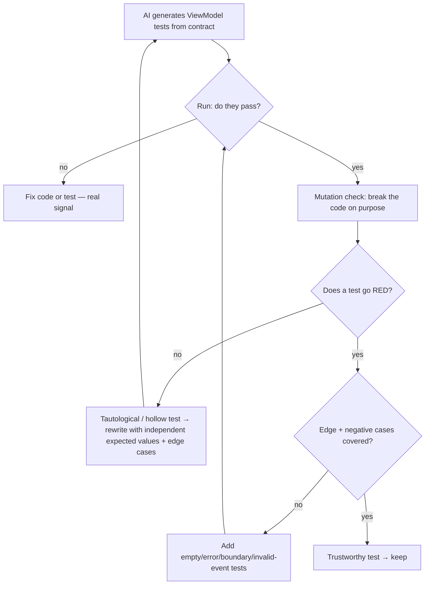
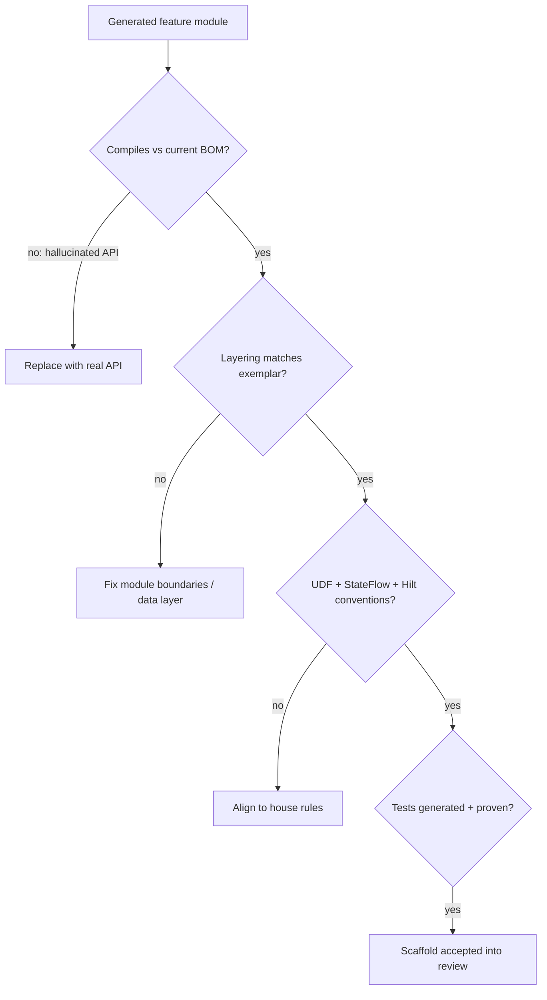

# Lesson 06 — Automated Testing & Architecture Generation

> After this lesson you can have AI generate Compose tests and feature scaffolds you can actually trust — by giving it the right contract, guarding against tautological tests and hallucinated APIs, and validating every generated artifact against your architecture.

**Module:** 16 · **Lesson:** 06 · **Level:** 🟢🟡🔴 · **Est. time:** 80–95 min

---

## 1. Concept

### 🟢 For beginners — *what is it and why do I care?*

Two of the most tedious jobs in Android are **writing tests** and **scaffolding a new feature** (the `ViewModel`, the repository, the screen, the DI wiring — the same skeleton every time). Both are repetitive, both follow patterns, and both are things AI can generate in seconds.

- **Automated test generation:** you point AI at a `ViewModel` and it writes the unit tests — happy path, error path, edge cases — so you don't hand-type a dozen `assertEquals`.
- **Automated architecture generation:** you describe a feature ("a Notifications screen backed by Room and a repository") and AI generates the whole folder of files following your project's structure.

Why care? It removes hours of boilerplate. **But** — and this is the lesson — generated tests and scaffolds are only valuable if they're *correct* and *fit your architecture*. A test that always passes is worse than no test (it gives false confidence). A scaffold that uses a made-up API or ignores your patterns is a mess you have to untangle. So the skill isn't "ask AI for tests" — it's "ask AI for tests, then **verify they actually test something**."

### 🟡 For intermediate devs — *the mechanism*

**Test generation** works best when you give the model the **contract** to test against, not just the code. For a `ViewModel`, that means: the `UiState` shape, the events, the expected transitions, and the tools (JUnit, MockK, Turbine for `Flow`, Compose Testing APIs for UI). The model then fills in the mechanical assertions.

```text
You give:  the ViewModel + UiState contract + "test loading→success→error with Turbine, mock the repo"
AI gives:  the test class with fakes, awaitItem() assertions, edge cases
You check: does each test actually assert real behavior, or does it just re-state the implementation?
```

**Architecture generation** works best with a **template/example** to imitate. AI is excellent at *pattern-matching* an existing feature module and producing a parallel one. Show it your `feature/profile/` structure and it'll generate `feature/notifications/` with the same layering — far better than asking it to invent an architecture from scratch.

Key mechanics:

- **Tests need a behavioral contract**, or AI writes tests that mirror the code (tautologies) instead of pinning intent.
- **Scaffolds need an exemplar**, or AI invents a structure that doesn't match your codebase.
- **Both need verification**: tests must be run *and seen to fail when they should*; scaffolds must compile and follow your conventions.

### 🔴 For senior devs — *trade-offs, edges, internals*

The traps that separate "looks like tests" from "tests worth having":

- **Tautological / change-detector tests are the dominant failure mode.** AI loves to generate tests that assert *what the code does* rather than *what it should do*. The classic: it reads `state.total = items.sum()` and writes `assertEquals(items.sum(), state.total)` — that's not a test, it's a mirror; it passes by construction and would happily "pass" a bug. The senior fix is to feed the model **independent expected values** ("a cart of [2×$3, 1×$5] should total $11"), test **behavior and edge cases** (empty, error, boundary), and demand **negative tests** (the invalid event is rejected). A test that can't fail isn't testing.
- **Mutation testing reveals fake coverage.** High line-coverage from AI tests can be hollow — the lines execute but nothing's asserted. Mutation testing (deliberately break the code and check a test goes red) is how you *prove* the suite has teeth. If you mutate `>=` to `>` and every test still passes, the suite is decorative. This is the rigorous answer to "is this AI-generated test any good?"
- **Hallucinated APIs are the scaffold killer.** Models confidently emit methods, parameters, and artifacts that don't exist — a `collectAsStateWithLifecycle` overload that was never added, a Compose API from a different version, a Hilt annotation misused. Because training data mixes API eras, generated scaffolds drift to plausible-but-wrong. The only defense is **compile + run** and verifying against the *current* BOM; never trust a generated API by sight.
- **Generated architecture must be judged against *your* architecture, not generic "clean code."** AI will produce a *reasonable* structure that may not be *your* structure — wrong module boundaries, a repository that bypasses your data layer, state shape that violates your UDF conventions, DI wiring that doesn't match your Hilt setup. Generation saves typing; it doesn't make the *design decisions* — those are yours (Module 13). Treat the scaffold as a typed-out draft of *your* pattern, enforced by giving it an exemplar and reviewing against your conventions.
- **Test independence and determinism.** AI-generated tests often share mutable fixtures, depend on execution order, or use real dispatchers/clocks — flaky by construction. Insist on isolated fakes, a `TestDispatcher`/`runTest`, and `Turbine` for flows; reject any test that touches real time, network, or order.
- **Don't let AI write the test *and* be your only check that it's right.** The model that wrote the code is biased toward tests that confirm it. Generate tests with a *fresh* framing ("write tests that try to break this"), and verify with execution + mutation, not by asking the model "are these good?"

### Analogy

**Hiring a contractor who also inspects their own work.** Asking AI to generate tests is like hiring a builder who *also* writes the inspection report — left unchecked, the report says "everything's perfect" because they're grading themselves (the tautological test). You make it real by giving an **independent spec** ("the beam must hold 2 tons" — your expected value, not their measurement) and doing a **stress test** (mutation testing: deliberately weaken a beam and confirm the alarm trips). For scaffolds, it's like a contractor who builds fast from your **blueprint** — great — but if you hand them no blueprint, they build a *reasonable* house that isn't *your* house, sometimes with materials that don't exist.

### Mental model

> **AI generates the boilerplate; you supply the contract and verify it has teeth.** A test that mirrors the code passes by construction and proves nothing — feed independent expected values, edge cases, and negatives, then prove the suite can fail (run it, mutate it). A scaffold copies a *pattern*; give it your exemplar and judge it against *your* architecture, compiling out every hallucinated API.

### Real-world example

A team adds a `Notifications` feature. They hand AI the existing `feature/profile/` module as a template; it generates a parallel `feature/notifications/` (ViewModel, repository interface, Room DAO, screen, Hilt module) in the same layering. It compiles — after they catch one hallucinated `Room` annotation that doesn't exist and a `collectAsState` that should be `collectAsStateWithLifecycle`. Then they ask AI to generate the `ViewModel` tests, giving it the `UiState` contract and explicit expected values; it writes loading→success→error with Turbine. A quick mutation check (flip the error branch) confirms a test actually goes red. Hours of boilerplate, gone — but every artifact compiled, every test proven to bite, every file matched to *their* architecture before merge.

---

## 2. Visual Learning

**ASCII — generate → verify for tests and scaffolds:**
```text
   TEST GENERATION                              ARCHITECTURE GENERATION
   ┌────────────────────────────┐               ┌────────────────────────────┐
   │ give: code + CONTRACT       │               │ give: EXEMPLAR module +     │
   │ + independent expected vals │               │ "build a parallel feature"  │
   └─────────────┬──────────────┘               └─────────────┬──────────────┘
                 ▼                                             ▼
        AI writes test class                          AI writes feature folder
                 │                                             │
                 ▼                                             ▼
        ┌───────────────────┐                        ┌───────────────────────┐
        │ VERIFY it has teeth│                        │ VERIFY it fits YOU     │
        │ • run → green      │                        │ • compiles (no halluc.)│
        │ • MUTATE → goes red│                        │ • matches conventions  │
        │ • edge + negative  │                        │ • your UDF / DI / layers│
        └───────────────────┘                        └───────────────────────┘
                 │                                             │
                 ▼  trust only if it can FAIL                  ▼  trust only if it's YOUR pattern
```

**Mermaid — the trust gate for a generated test:**


**Mermaid — validating a generated scaffold against your architecture:**


**Illustration prompt (paste into an image generator):**
```text
Illustration: split scene. LEFT: a robot labeled "AI" hands a clipboard labeled "TESTS" to an
inspector who is stress-testing a metal beam in a press labeled "MUTATION TESTING" — a red alarm
light confirms the test reacts. RIGHT: the same robot builds a small house quickly from a glowing
blueprint labeled "EXEMPLAR MODULE"; a magnifying glass hovers over one brick labeled "hallucinated
API ✗" being swapped for a correct one. Banner across the top: "Generate the boilerplate — verify it
has teeth." Modern, vibrant, clear labels, soft studio lighting.
```

---

## 3. Code

> "Code" here is the **generation prompts plus the verification artifacts** — a contract-driven test, the mutation/compile gates that prove worth, and a scaffold judged against an exemplar. These are the real outputs you'd commit.

### 🟢 Beginner — generate a test from a contract with *independent* expected values

```kotlin
// CONTRACT you hand the model: total = sum(unitPrice * qty); empty cart total = 0.
// AI PROMPT: "Write JUnit tests for CartUiState.total. Use these INDEPENDENT expected values
//             (do not derive them from the code): [2×300, 1×500] → 1100; [] → 0. Add the empty case."

@Test
fun total_sumsLineItems() {
    val state = CartUiState(items = listOf(CartItem("a", 300, 2), CartItem("b", 500, 1)))
    assertEquals(1100, state.total)   // 600 + 500 — value computed by HAND, not by the code
}

@Test
fun total_isZero_whenEmpty() {
    assertEquals(0, CartUiState(items = emptyList()).total)   // edge case the model must include
}
```

**Explanation.** The expected `1100` and `0` are computed *independently* by you and handed to the model, so the test pins *intended* behavior, not whatever the code happens to do. The empty-cart case is a deliberate edge. Run it: green means the implementation matches the spec you defined.

**Common mistakes.**
```kotlin
// ❌ Tautological test: the assertion is just the implementation re-typed → passes by construction.
@Test fun total_isCorrect() {
    val items = listOf(CartItem("a", 300, 2))
    assertEquals(items.sumOf { it.unitPrice * it.qty }, CartUiState(items).total)  // mirrors the code
}
```
That test would "pass" even if `total` had a bug, because both sides compute the same (possibly wrong) thing. It tests nothing.

**Best practices.**
- Feed **independent, hand-computed expected values**; never let the assertion mirror the implementation.
- Always demand **edge cases** (empty, zero, boundary) in the prompt.

---

### 🟡 Intermediate — generate `StateFlow` tests (Turbine) and prove they bite

```kotlin
// AI PROMPT: "Test FeedViewModel with Turbine + MockK. Mock the repo. Assert the StateFlow emits
//             loading→success on success, and loading→error on failure. Use runTest + a TestDispatcher.
//             Each emission must be asserted independently."
@Test
fun feed_emitsLoadingThenSuccess() = runTest {
    val repo = mockk<FeedRepository> { coEvery { loadFeed() } returns listOf(Post("1")) }
    val vm = FeedViewModel(repo)
    vm.state.test {                                  // Turbine
        assertTrue(awaitItem().isLoading)            // first emission
        val done = awaitItem()
        assertEquals(listOf(Post("1")), done.posts)  // independent expectation
        assertFalse(done.isLoading)
        cancelAndIgnoreRemainingEvents()
    }
}
```
```bash
# PROVE the test bites — mutation check by hand: temporarily break the VM, expect RED.
# e.g. make refresh() set isLoading=true forever → feed_emitsLoadingThenSuccess MUST fail.
./gradlew :feature:feed:testDebugUnitTest      # confirm it goes red on the mutation, then revert.
```

**Explanation.** Turbine asserts each `StateFlow` emission independently; MockK supplies a controlled repo; `runTest` keeps it deterministic. Crucially, the snippet doesn't *trust* the green run — it **mutates** the code to confirm the test actually fails when behavior breaks. A test that stays green under a real bug is worthless.

**Common mistakes.**
```kotlin
// ❌ Real dispatcher + no Turbine → flaky, order-dependent, may miss the loading emission entirely.
@Test fun feed_works() = runBlocking {
    val vm = FeedViewModel(realRepo)            // real network → nondeterministic
    assertEquals(1, vm.state.value.posts.size)  // races the coroutine; reads one snapshot
}
```
Real dispatchers/network and single-snapshot reads make tests flaky and blind to the loading→success *transition*.

**Best practices.**
- Use **Turbine** for flow emissions, **MockK** for fakes, **`runTest` + `TestDispatcher`** for determinism.
- **Mutation-check** generated tests: break the code on purpose and confirm a test goes red before trusting it.

---

### 🔴 Production — scaffold from an exemplar, gated against your architecture + mutation suite

```bash
#!/usr/bin/env bash
# generate-feature.sh — scaffold a feature the way YOUR repo does it, then prove every artifact.
set -euo pipefail

# 1) GENERATE from an EXEMPLAR (pattern-match your real module — not generic "clean architecture").
claude "Using feature/profile/ as the EXEMPLAR, scaffold feature/notifications/ with the SAME layering:
        UiState (sealed), ViewModel (StateFlow + onEvent), Repository interface + impl, Room DAO,
        Compose screen (collectAsStateWithLifecycle), and the Hilt module. Match our package layout,
        UDF, and naming exactly. Generate ViewModel tests with INDEPENDENT expected values + edge/negative
        cases. Use ONLY APIs in the current Compose BOM; if unsure of an API, say so — do not invent one."

# 2) COMPILE GATE: hallucinated APIs die here.
./gradlew :feature:notifications:assembleDebug

# 3) BEHAVIOR + TEETH GATE: run generated tests, then mutation-test to reject hollow coverage.
./gradlew :feature:notifications:testDebugUnitTest
./gradlew :feature:notifications:pitest      # mutation testing (e.g. PIT) — survivors = weak tests

# 4) ARCHITECTURE REVIEW (human): does it match OUR conventions, not just "reasonable" ones?
echo "Compiled + tests-with-teeth → human checks: module boundaries, data layer, UDF, DI vs house rules."
```

**Explanation.** Production generation is **exemplar-driven and triple-gated**. The exemplar makes AI reproduce *your* pattern instead of inventing one; the **compile gate** kills hallucinated APIs; the **mutation gate** (PIT) rejects tests that don't actually bite (surviving mutants = untested logic). Even after green, a human verifies the scaffold matches *your* architecture — because generation types the code, but the *design decisions* are yours.

**Common mistakes.**
```bash
# ❌ "Generate a notifications feature with clean architecture" — no exemplar → AI invents a structure
#    that doesn't match your repo (wrong boundaries, a repo bypassing your data layer, foreign DI style).
claude "build a notifications feature using best-practice architecture"

# ❌ Accepting generated tests on coverage % alone, skipping mutation testing → hollow, change-detector
#    tests inflate coverage while asserting nothing.
```
No exemplar → architectural drift; coverage-without-mutation → confident but fake test suites.

**Best practices.**
- **Always supply an exemplar** module so the scaffold matches *your* architecture; review against *your* conventions, not generic ones.
- **Compile-gate** to kill hallucinated APIs; **mutation-gate** to kill hollow tests.
- Generation does the typing; **you own the design decisions** — the human architecture review is mandatory.

---

## 4. Interview Questions

**🟢 Beginner**

1. *What does AI test generation give you, and what's the catch?*
   > It writes the mechanical test code (assertions, fakes, edge cases) from a contract, saving boilerplate. The catch: generated tests are only valuable if they actually assert correct behavior — a test that mirrors the code passes by construction and gives false confidence.
2. *Why give AI an existing feature module when generating a new one?*
   > So it pattern-matches *your* architecture and produces a parallel feature with the same layering, naming, and conventions — far better than asking it to invent a structure, which drifts from your codebase.

**🟡 Intermediate**

3. *What's a tautological (change-detector) test, and how do you avoid generating them?*
   > A test whose assertion is just the implementation re-typed (e.g. `assertEquals(items.sum(), state.total)`), so it passes even if the code is buggy. Avoid it by feeding the model **independent, hand-computed expected values**, testing observable behavior plus edge and negative cases, rather than letting the assertion mirror the code.
4. *What tools make AI-generated `StateFlow`/coroutine tests reliable, and why?*
   > Turbine (assert each flow emission independently, catch the loading→success transition), MockK (controlled fakes instead of real I/O), and `runTest` + a `TestDispatcher` (determinism, no real clock/network). Together they remove the flakiness and order-dependence AI tends to introduce.

**🔴 Senior**

5. *AI-generated tests give you 90% line coverage. Why might that be misleading, and how do you check?*
   > Lines can execute without anything being asserted — hollow coverage. Mutation testing is the check: deliberately break the code (e.g. flip `>=` to `>`, negate a condition) and confirm a test goes red. Surviving mutants mean the suite executes but doesn't verify; coverage without mutation is confidence theater.
6. *Generated architecture "looks clean" and compiles. Why isn't that sufficient to accept it?*
   > "Clean" isn't the bar — *matching your architecture* is. The scaffold may use reasonable-but-foreign module boundaries, a repository that bypasses your data layer, a state shape that violates your UDF conventions, or DI that doesn't fit your Hilt setup — and it may contain hallucinated APIs that happen to compile against the wrong assumptions. Generation saves typing but doesn't make design decisions; accept it only after a compile gate (kill hallucinations), a mutation-gated test suite, and a human review against *your* conventions.

---

## 5. AI Assistant

**Prompt example (trustworthy test generation):**
```text
Write unit tests for FeedViewModel. Contract: exposes StateFlow<FeedUiState>(isLoading, posts, error);
refresh() loads from FeedRepository. Requirements:
- Use Turbine + MockK + runTest with a TestDispatcher.
- Cover: loading→success, loading→error, and the EMPTY result case.
- Use these INDEPENDENT expected values, not derived from the code: success → posts=[Post("1")];
  failure → error="boom", posts=[].
- Add a NEGATIVE test: a second refresh() while loading must not duplicate emissions.
Do not assert implementation details (exact recomposition counts). Target: Compose 2026, Kotlin 2.x.
```

**AI workflow — where AI helps vs. hurts on *this* topic.**
- ✅ Great for: mechanical test bodies from a clear contract, scaffolding a feature *from an exemplar*, generating fakes/mocks, filling in edge-case permutations.
- ⚠️ Not for: deciding *what correct behavior is* (that's the contract — yours), making *architecture decisions* (Module 13 — yours), or being trusted on API existence/version. And never let the model that wrote the code be the sole judge that its tests are good.

**Review workflow — check generated artifacts against this lesson's *Common Mistakes*:**
- Tests: are expected values **independent**, or do assertions **mirror the code** (tautology)? Are **edge + negative** cases present? Turbine/MockK/`runTest` used (no real dispatcher/network)?
- Scaffolds: does every API **actually exist** in the current BOM (no hallucinations)? Does layering match the **exemplar** and your UDF/DI conventions — not just "reasonable" ones?

**Validation workflow — prove tests bite and scaffolds fit:**
1. **Run** the generated tests — green is necessary, not sufficient.
2. **Mutation-test**: break the code on purpose (flip a boundary, negate a branch) and confirm a test goes **red**. Survivors → rewrite the test with independent expectations.
3. **Compile + run** the scaffold against the **current BOM**; replace any hallucinated API; smoke-test the screen.
4. **Architecture review**: confirm module boundaries, data layer, state shape, and DI match *your* house rules before merge.

> **AI drafts, you decide.** Generation removes the typing; verification supplies the trust. A test you haven't seen fail is a guess, and a scaffold you haven't matched to your architecture is someone else's house. Run it, mutate it, review it — then merge.

---

## Recap / Key takeaways

- AI **generates** tests and feature scaffolds fast — but value comes only from artifacts that are **correct** and **fit your architecture**.
- **Tests need a behavioral contract with independent expected values**; assertions that mirror the code are **tautologies** that prove nothing.
- **Prove tests bite** with **mutation testing** (break the code, expect red) — high coverage without mutation is hollow.
- **Scaffolds need an exemplar** so AI reproduces *your* pattern; **compile-gate** to kill hallucinated APIs, then review against *your* conventions.
- Generation does the **typing**; **you own the design decisions** — the human architecture review and the mutation gate are mandatory before merge.

➡️ Next: **[Module 17 — Code Quality Engineering](../module-17-code-quality/README.md)** — keeping a Compose codebase healthy, readable, and reviewable as it scales.
