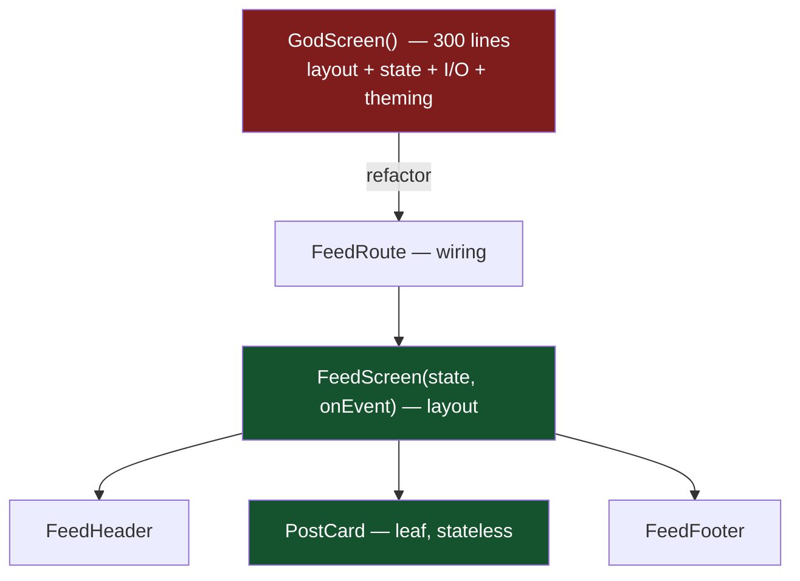

# Lesson 01 — Clean Code in Kotlin/Compose

> After this lesson you can name things clearly, keep composables and functions small and single-purpose, and split a tangled screen into readable, reviewable units.

**Module:** 17 · **Lesson:** 01 · **Level:** 🟢🟡🔴 · **Est. time:** 60–75 min

---

## 1. Concept

### 🟢 For beginners — *what is it and why do I care?*

**Clean code is code you can read once and understand — and change without fear.** It isn't about clever tricks; it's the opposite. Clean code uses names that say what they mean, functions that do one thing, and a structure that matches how you'd explain the screen out loud.

Why care, especially in Compose? Because Compose code is *dense*. A single screen can mix layout, state, events, theming, and side effects in one function. If you don't keep it tidy, a `HomeScreen` composable balloons to 300 lines and nobody — including future-you — can tell what it does. Clean code is the difference between "I'll just add one parameter" and "I'm afraid to touch this."

Three habits cover most of it:

- **Name things so the code reads like a sentence.** `isLoading`, not `flag`. `onAddToCart`, not `onClick2`.
- **Keep functions short.** If a composable doesn't fit on a screen, it's probably doing too much.
- **One responsibility per function.** A composable either *lays out* a piece of UI or *coordinates* children — rarely both, and never also fetching data.

### 🟡 For intermediate devs — *the mechanism*

Clean code in Compose has its own grammar on top of general Kotlin style. The big levers:

1. **Composable naming & shape.** `@Composable` functions that emit UI are **PascalCase nouns** (`UserAvatar`, `CartScreen`) and return `Unit`. Composables that *produce a value* instead of emitting (rare) are camelCase. Every UI composable takes a `modifier: Modifier = Modifier` as its **first optional parameter**, placed after required ones — this is the ecosystem convention and tooling (and reviewers) expect it.

2. **Function size & extraction.** When a composable grows, extract sub-composables (`CartHeader`, `CartItemRow`, `CartFooter`). Extraction isn't just aesthetic: a smaller composable is a smaller **recomposition scope** and is independently previewable and testable.

3. **Parameter ordering & defaults.** Required data first, then `modifier`, then optional config, then event lambdas last (`onClick`, `onValueChange`). Trailing-lambda ergonomics fall out naturally when the content lambda is last.

4. **Stateless by default.** A clean composable receives state and emits events (hoisting, Module 03). Functions that take data in and call lambdas out are the readable, reusable unit.

5. **Self-documenting over commented.** Prefer a named `val` or a well-named private composable to a comment explaining a magic block. Comments rot; names get refactored with the code.

### 🔴 For senior devs — *trade-offs, edges, internals*

Clean code is a means, not an end — the end is **change cost**. Calibrate, don't cargo-cult:

- **Function size vs. recomposition scope.** Extracting a sub-composable creates a new **restartable, skippable** scope (with Strong Skipping, skippable when its params are stable). That's usually a *win* — but only if the extracted params are stable. Extracting a composable that captures an **unstable lambda or unstable type** can defeat skipping and add call overhead without benefit. Readability and performance usually agree here; when they don't, measure (Module 11) rather than guess.

- **"One responsibility" for composables is layered.** A `Route` composable's responsibility is *wiring* (collect state, provide callbacks, handle effects). A `Screen` composable's responsibility is *layout of state*. A leaf's responsibility is *one widget*. Mixing these layers — e.g. collecting a `StateFlow` inside a leaf — is the smell, not "this function is long."

- **Naming encodes contracts.** `onAddToCart: (Product) -> Unit` tells a caller *what* happened, not *how* you implemented it. Naming a lambda `onButtonClick` leaks UI mechanism into the API and makes the callback non-reusable when the trigger changes (button → swipe). Name events after the **domain intent**, not the gesture.

- **Comments earn their place by explaining *why*, never *what*.** `// O(1) lookup; list is hot path` is gold. `// loop over items` is noise that will lie after the next edit. Treat a "what" comment as a refactor request: extract and name.

- **Cyclomatic complexity hides in Compose `when`/`if` trees.** Branchy composition (nested conditionals choosing layouts) is hard to test and hard to read. Lift branching into a small mapping function or a sealed `UiState` (Module 03) so the composable renders a *decided* shape.

### Analogy

A clean codebase is a **well-organized kitchen**. Everything has one labeled place: knives in the block, spices alphabetized, prep station clear. You can cook a new dish fast because you never hunt for anything. A messy codebase is a kitchen where the can opener might be in three drawers and a pot is soaking in the sink labeled "do not touch" — you *can* cook, but every action carries dread and risk. Naming, small functions, and single responsibility are just labeling drawers and keeping the counter clear.

### Mental model

> **Code is read far more often than it's written. Optimize for the next reader — usually you, six months from now, at 2am, with a bug.**

### Real-world example

Open any mature Compose app's feature module and you'll see the pattern: `FeedRoute` (wiring) → `FeedScreen(state, onEvent)` (layout) → `PostCard`, `PostHeader`, `PostActions` (leaves). No single function is large; each name tells you exactly what it renders; a new engineer can find "where the like button lives" in seconds by following the names down the tree.

---

## 2. Visual Learning

**ASCII — the readability ladder (one screen, three layers):**
```text
   FeedRoute            ← WIRING: collect state, provide callbacks, run effects
      │ state, onEvent
      ▼
   FeedScreen(state)    ← LAYOUT: arrange sections from one immutable state
      ├── FeedHeader
      ├── PostCard          ← LEAF: one widget, stateless, previewable
      │     ├── PostHeader
      │     └── PostActions
      └── FeedFooter

   Each box: small · single responsibility · named for what it shows
```

**Mermaid — extraction shrinks scope and clarifies intent:**


**Illustration prompt (paste into an image generator):**
```text
Illustration: split scene. LEFT half is a chaotic kitchen — utensils everywhere,
overflowing single drawer labeled "HomeScreen()", a frazzled cook. RIGHT half is a
pristine kitchen with neatly labeled drawers: "Route", "Screen", "PostCard",
"Header", "Footer", each holding exactly one tidy tool. A calm cook reaches straight
for the right drawer. Caption: "Same meal. One you can cook at 2am."
Modern, clean, soft lighting, clear drawer labels, friendly tone.
```

---

## 3. Code

### 🟢 Beginner — naming and a single responsibility

```kotlin
// ✅ Clean: names read like English; the composable does one thing — show a greeting.
@Composable
fun GreetingCard(
    userName: String,
    modifier: Modifier = Modifier,
) {
    Card(modifier = modifier) {
        Text(
            text = "Welcome back, $userName",
            style = MaterialTheme.typography.titleMedium,
            modifier = Modifier.padding(16.dp),
        )
    }
}
```

**Explanation.** The name `GreetingCard` says exactly what it emits. The parameter `userName` is unmistakable, `modifier` is the first optional parameter, and the body has one job. A reader needs zero comments to understand it.

**Common mistakes.**
```kotlin
// ❌ Vague names + magic values + no modifier param.
@Composable
fun Card2(s: String) {                 // what is "Card2"? what is "s"?
    Card {
        Text(s, fontSize = 18.sp, modifier = Modifier.padding(16.dp)) // hard-coded 18.sp
    }
}
```
`Card2` and `s` carry no meaning; the hard-coded `18.sp` bypasses the type scale; and without a `modifier` parameter, callers can't position or size this card.

**Best practices.**
- Name composables as **PascalCase nouns** describing what they render.
- Give every UI composable a `modifier: Modifier = Modifier` as the first optional parameter.
- Pull values from `MaterialTheme` (typography/colors) instead of hard-coding.

---

### 🟡 Intermediate — extracting a god composable into readable parts

```kotlin
@Composable
fun ProfileScreen(
    state: ProfileUiState,
    onEditClick: () -> Unit,
    onSignOut: () -> Unit,
    modifier: Modifier = Modifier,
) {
    Column(modifier.fillMaxSize()) {
        ProfileHeader(name = state.name, avatarUrl = state.avatarUrl)
        ProfileStats(posts = state.postCount, followers = state.followerCount)
        ProfileActions(onEditClick = onEditClick, onSignOut = onSignOut)
    }
}

@Composable
private fun ProfileHeader(name: String, avatarUrl: String, modifier: Modifier = Modifier) { /* … */ }

@Composable
private fun ProfileStats(posts: Int, followers: Int, modifier: Modifier = Modifier) { /* … */ }

@Composable
private fun ProfileActions(
    onEditClick: () -> Unit,
    onSignOut: () -> Unit,
    modifier: Modifier = Modifier,
) { /* … */ }
```

**Explanation.** Each section is a named, private composable with a focused parameter list. `ProfileScreen` now reads like a table of contents; reviewers diff a 20-line function instead of a 200-line one, and each part is independently previewable and skippable.

**Common mistakes.**
```kotlin
// ❌ The god composable: one function does header + stats + actions + branching + spacing.
@Composable
fun ProfileScreen(state: ProfileUiState, /* … */) {
    Column {
        // 40 lines of header…
        // 35 lines of stats…
        // 50 lines of action buttons + if/else for guest vs member…
        // ad-hoc Spacers and magic dp values throughout
    }
}
```
Everything is coupled, nothing is reusable, and a change to the stats row forces a re-read of the whole function.

**Best practices.**
- Extract a sub-composable the moment a section has its own *name* and *job*.
- Keep extracted composables **private** to the file unless deliberately part of an API.
- Pass the **minimum** each child needs — narrow parameter lists improve stability and readability.

---

### 🔴 Production — clean Route/Screen split with intent-named events

```kotlin
// Domain-named events: callers learn WHAT happened, not which gesture fired.
sealed interface ProfileEvent {
    data object EditProfile : ProfileEvent
    data object SignOut : ProfileEvent
    data class ChangeAvatar(val uri: Uri) : ProfileEvent
}

@Composable
fun ProfileRoute(
    viewModel: ProfileViewModel = hiltViewModel(),
    onNavigateToEdit: () -> Unit,
) {
    val state by viewModel.uiState.collectAsStateWithLifecycle()

    ProfileScreen(
        state = state,
        onEvent = { event ->
            when (event) {
                ProfileEvent.EditProfile -> onNavigateToEdit()
                else -> viewModel.onEvent(event)
            }
        },
    )
}

@Composable
fun ProfileScreen(
    state: ProfileUiState,
    onEvent: (ProfileEvent) -> Unit,
    modifier: Modifier = Modifier,
) {
    // Pure layout of a decided state — no I/O, no flow collection, no navigation here.
    Column(modifier.fillMaxSize()) {
        ProfileHeader(
            name = state.name,
            avatarUrl = state.avatarUrl,
            onChangeAvatar = { uri -> onEvent(ProfileEvent.ChangeAvatar(uri)) },
        )
        ProfileActions(
            onEditClick = { onEvent(ProfileEvent.EditProfile) },
            onSignOut = { onEvent(ProfileEvent.SignOut) },
        )
    }
}
```

**Explanation.** Responsibilities are cleanly layered: `ProfileRoute` *wires* (collects state lifecycle-aware, routes navigation vs. domain events); `ProfileScreen` is *pure layout* of an immutable state and is fully previewable with fake data. Events are named for **domain intent** (`EditProfile`), so the API survives a UI redesign. A single `onEvent` keeps the parameter list flat as the screen grows.

**Common mistakes.**
```kotlin
// ❌ Layers collapsed: a "Screen" that collects state and navigates is doing the Route's job.
@Composable
fun ProfileScreen(viewModel: ProfileViewModel, navController: NavController) {
    val state by viewModel.uiState.collectAsStateWithLifecycle() // wiring leaked into layout
    Button(onClick = { navController.navigate("edit") }) {        // navigation in a leaf path
        Text("Edit")                                             // gesture-named, untestable in preview
    }
}
```
This screen can't be previewed (needs a real ViewModel + NavController), can't be unit-tested cheaply, and reuses nothing.

**Best practices.**
- Split **Route (wiring)** from **Screen (layout)**; keep `NavController`/ViewModel out of the layout layer.
- Name events after **domain intents**, funneled through one `onEvent`.
- Keep the layout layer a **pure function of state** so `@Preview` and tests work with fakes.
- Collect with `collectAsStateWithLifecycle()`; hoist the rest.

---

## 4. Interview Questions

**🟢 Beginner**

1. *What makes code "clean"?*
   > Readable and changeable: meaningful names, small single-purpose functions, and structure that matches the problem. You can understand it without comments and modify it without fear.
2. *Why give every UI composable a `modifier` parameter, and where does it go?*
   > So callers can size, position, and decorate it from outside without the composable hard-coding layout. By convention it's the **first optional parameter**, after required ones, defaulting to `Modifier`.

**🟡 Intermediate**

3. *When should you extract a sub-composable out of a large one?*
   > When a section has a distinct name and responsibility (a header, a row, a footer). Extraction improves readability, makes the part previewable/testable, and creates a smaller recomposition scope.
4. *What's the difference between a "Route" composable and a "Screen" composable?*
   > The Route does **wiring** — collects state lifecycle-aware, provides callbacks, handles navigation/effects. The Screen does **layout** — renders an immutable state and emits events. Keeping them separate makes the Screen a pure, previewable function.

**🔴 Senior**

5. *Can extracting composables hurt performance? How do you keep extraction a net win?*
   > Each extracted composable is a new restartable/skippable scope, which usually helps. But if you pass **unstable** params (an unstable type or a non-remembered lambda), the new scope can't skip and you've added call overhead for nothing. Keep extracted params stable; verify with recomposition counts / Layout Inspector when it matters.
6. *Why name event callbacks after domain intents (`onAddToCart`) instead of gestures (`onClick`)?*
   > The intent is the stable contract; the gesture is an implementation detail that may change (tap → swipe → long-press). Domain-named events keep the callback reusable, make call sites self-documenting, and decouple the API from UI mechanics.

---

## 5. AI Assistant

**Prompt example (refactor a god composable):**
```text
This Compose screen is one 250-line composable that collects a StateFlow, navigates,
and lays out a header/stats/actions. Refactor it into a Route (wiring) + a stateless
Screen (pure layout) + small private sub-composables. Name events after domain intents
in a sealed interface and route them through one onEvent. Add a `modifier: Modifier = Modifier`
first-optional-param to each. Keep behavior identical. Target: Compose 2026 BOM, Kotlin 2.x.
[paste code]
```

**AI workflow — where it helps on *this* topic.**
- ✅ Great for: mechanical extraction (splitting a big composable), suggesting clearer names, generating `@Preview`s for newly extracted parts, drafting the sealed event type.
- ⚠️ Watch: models often leave **state collection in the leaf**, invent **gesture-named** callbacks (`onButton1Click`), drop the `modifier` parameter, or "helpfully" add comments that restate the code. They may also over-extract trivial one-liners.

**Review workflow — check AI output against this lesson's *Common Mistakes*:**
- Are names **domain-meaningful** (no `s`, `flag`, `Card2`, `onClick2`)?
- Does each UI composable have `modifier: Modifier = Modifier` as the **first optional** param?
- Is wiring (ViewModel/`NavController`/flow collection) confined to the **Route**, not the Screen/leaf?
- Are event callbacks named by **intent**, funneled through one `onEvent`?
- Did it add **"what" comments** that should be names instead?

**Validation workflow — prove the refactor is safe:**
1. **Compile**; confirm no behavior change by running the screen.
2. Add `@Preview` for each extracted composable with fake state — they should render in isolation (proves the layout layer is pure).
3. Run **Detekt/Ktlint** (Lesson 05) — function-length and naming rules should now pass.
4. Optionally enable **Layout Inspector → recomposition counts**; extraction should keep or shrink the recomposing scope, not widen it.

> **AI drafts, you decide.** Accept the extraction only when names read like sentences and the Screen previews with fakes — if it still needs a real ViewModel to render, the AI collapsed the layers.

---

## Recap / Key takeaways

- **Clean code = readable + changeable:** meaningful names, small functions, one responsibility each.
- Composables are **PascalCase nouns** with a **`modifier: Modifier = Modifier` first-optional** parameter; required data first, event lambdas last.
- **Extract** sections into named private composables — better readability, previewability, and (usually) recomposition scope.
- Split **Route (wiring)** from **Screen (pure layout)**; keep ViewModel/Nav out of the layout layer.
- Name events by **domain intent**, not gesture; prefer **self-documenting names** over "what" comments.

➡️ Next: **[Lesson 02 — SOLID for Android](02-solid-for-android.md)** — the five principles applied concretely to ViewModels, repositories, and composables.
