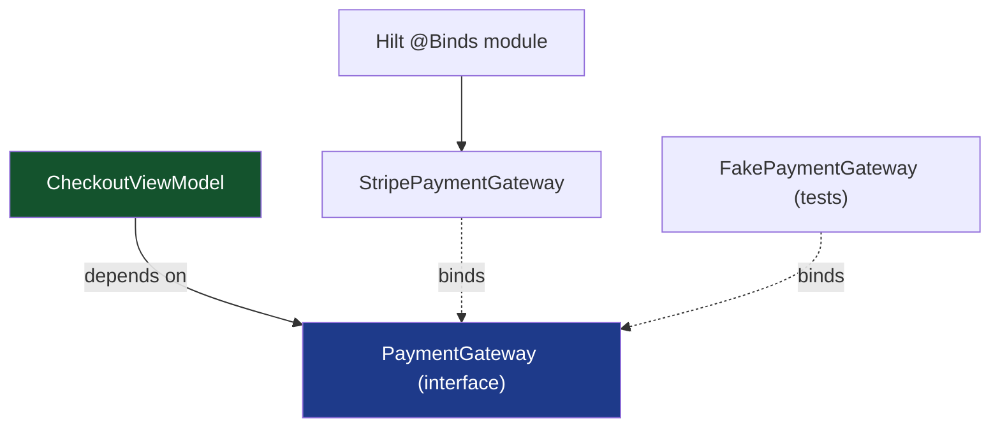
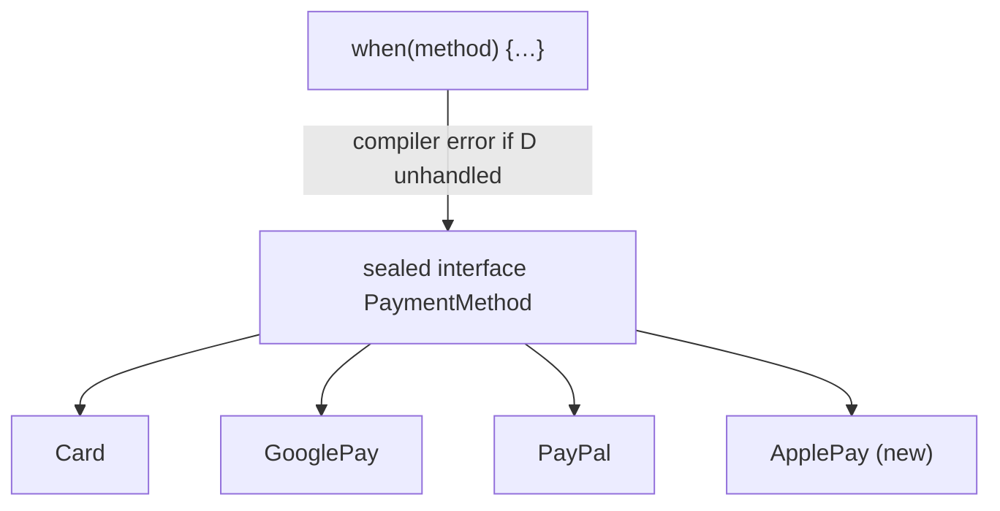

# Lesson 02 — SOLID for Android

> After this lesson you can apply each SOLID principle concretely to a Compose codebase — ViewModels, repositories, and composables — and recognize the violations in code review.

**Module:** 17 · **Lesson:** 02 · **Level:** 🟢🟡🔴 · **Est. time:** 75–90 min

---

## 1. Concept

### 🟢 For beginners — *what is it and why do I care?*

**SOLID is five rules for arranging code so changes stay small and safe.** Each letter is one idea:

- **S — Single Responsibility:** a class should have one reason to change.
- **O — Open/Closed:** open to extension, closed to modification — add behavior without editing existing code.
- **L — Liskov Substitution:** a subtype must work anywhere its parent type is expected, no surprises.
- **I — Interface Segregation:** many small focused interfaces beat one fat one.
- **D — Dependency Inversion:** depend on abstractions (interfaces), not concrete classes.

Why care on Android? Because apps live for years and requirements churn. SOLID is what lets you swap a network library, add a new feature flag, or fake a dependency in a test **without a domino chain of edits**. The payoff is felt every time you add a feature and *don't* break three others.

### 🟡 For intermediate devs — *the mechanism*

SOLID isn't abstract here — it maps directly onto Android building blocks:

- **SRP → layer boundaries.** A `ViewModel` holds UI state and orchestrates use cases; a `Repository` owns data access; a `Composable` renders. When a ViewModel also parses JSON or a Composable also calls Retrofit, SRP is broken.
- **OCP → sealed types + strategy.** Adding a new payment method shouldn't mean editing a giant `when` you forget to update everywhere. Model variants as a `sealed interface` (compiler forces you to handle new cases) or inject a strategy.
- **LSP → honest contracts.** If `Repository.getUser()` is declared to return a `User` or throw, a fake that returns `null` and a real one that throws break substitutability. Tests pass with the fake, prod crashes.
- **ISP → narrow interfaces.** A screen that only reads data shouldn't depend on a `Repository` interface that also exposes `delete()` and `sync()`. Split read/write roles.
- **DIP → Hilt + interfaces.** The ViewModel depends on a `UserRepository` *interface*; Hilt binds the concrete `UserRepositoryImpl`. Swap implementations (real/fake/cached) without touching the ViewModel.

The thread tying them together: **program to abstractions, keep responsibilities narrow, and make extension cheap.**

### 🔴 For senior devs — *trade-offs, edges, internals*

SOLID is a guideline that can be over-applied into ceremony. Calibrate:

- **SRP's "single reason to change" is about *actors*, not line count.** A `ViewModel` that changes when the *product* changes (new field) and also when the *network format* changes (DTO shape) serves two actors — split the mapping out. But splitting a cohesive 40-line class into five 8-line classes to "obey SRP" raises navigation cost with no benefit. The test is: *do two different stakeholders force edits to the same file for unrelated reasons?*

- **OCP via sealed types vs. plugins.** `sealed interface` gives **exhaustive `when`** (the compiler is your safety net) but is *closed for extension outside the module* — you must edit the sealed hierarchy to add a case. That's usually what you want for a fixed, known set (payment methods you ship). For genuinely open-ended extension (third-party plugins), prefer a registered strategy/factory. Choosing sealed-vs-open is a real architectural decision, not a default.

- **LSP failures hide in nullability, exceptions, and threading.** A subtype that throws where the base never did, returns `null` where the base never did, or blocks the main thread where the base was suspend/async violates LSP even if it compiles. These are the substitutions that pass unit tests with fakes and fail in production.

- **ISP and Compose recomposition.** Passing a fat object (a whole `Repository` or a 12-field state) into a composable widens what it depends on and can hurt **stability/skipping**. Narrow interfaces and narrow parameter lists are an ISP *and* a performance concern (Module 11).

- **DIP's cost is indirection.** Every interface is a layer to read through. Invert dependencies that you actually need to **swap or fake** (data sources, clients, clocks). Don't invert a stable, single-implementation helper just to "follow DIP" — `internal` functions are fine. The right question: *will I ever substitute this in a test or a build variant?*

### Analogy

SOLID is the wiring code in a **modular home theater**. Each box does one job (amp, streamer, speakers — **SRP**). You add a new console via a free HDMI port without rewiring the TV (**OCP**). Any HDMI device works in any HDMI port (**LSP**). The remote exposes only the buttons each device needs, not every button for every box (**ISP**). And the TV talks to "an HDMI input," not "Sony model X serial 12345" (**DIP**) — so you swap the streamer and nothing else cares. A non-SOLID system is everything soldered into one board: replace the streamer and you're desoldering the whole thing.

### Mental model

> **Depend on roles, not implementations; give each unit one reason to change; make adding behavior an *addition*, not an *edit*.**

### Real-world example

A checkout flow: `CheckoutViewModel` depends on a `PaymentGateway` *interface* (DIP). Payment methods are a `sealed interface PaymentMethod` so adding Apple Pay is a new case the compiler forces you to handle everywhere (OCP). The ViewModel doesn't parse payment responses — a `PaymentMapper` does (SRP). A `ReadOnlyOrderRepository` exposes just `getOrder()` to the summary screen, not `placeOrder()` (ISP). In tests, a `FakePaymentGateway` that honors the same contract (returns/throws exactly as declared) swaps in cleanly (LSP).

---

## 2. Visual Learning

**ASCII — SOLID across the layers:**
```text
   Composable (renders)                  ── SRP: only layout/events
        │ depends on interface
        ▼
   ViewModel (state + orchestration)     ── SRP: UI state; no JSON, no Retrofit
        │ depends on  UserRepository  ◀── DIP: interface, not Impl
        ▼
   UserRepository (interface)            ── ISP: read role vs write role, split
        ▲ bound by Hilt
   UserRepositoryImpl ── RemoteDataSource / LocalDataSource   (swappable; LSP-honest)

   New payment type?  add a `sealed interface` case  ── OCP: compiler forces handling
```

**Mermaid — Dependency Inversion with Hilt:**


**Mermaid — OCP with a sealed hierarchy (exhaustive `when`):**


**Illustration prompt:**
```text
Illustration: a tidy modular home-theater rack. Separate labeled boxes — AMP (SRP),
STREAMER, SPEAKERS — connected by clean cables to a TV labeled "HDMI INPUT (interface)".
A hand plugs a new box labeled "ApplePay" into a free port; the TV doesn't change. A side
inset shows the messy alternative: one giant soldered board labeled "GodClass", a hand
holding a soldering iron looking stressed. Caption: "Swap a box, not the whole board."
Modern, vibrant, labeled, soft studio lighting.
```

---

## 3. Code

### 🟢 Beginner — Single Responsibility: get logic out of the composable

```kotlin
// ❌ Composable doing data work — violates SRP (also untestable, fires on recomposition).
@Composable
fun UserScreenBad() {
    val user = remember { Retrofit.api.getUser() } // network in composition — wrong on every level
    Text(user.name)
}

// ✅ Each layer owns one job.
class UserViewModel(private val repo: UserRepository) : ViewModel() {
    val uiState: StateFlow<UserUiState> = /* … repo.user mapped to UiState … */ TODO()
}

@Composable
fun UserScreen(state: UserUiState, modifier: Modifier = Modifier) {
    Text(state.name, modifier = modifier) // composable only renders
}
```

**Explanation.** The composable's single responsibility is to render `state`. Fetching belongs to the repository; orchestration to the ViewModel. This separation makes each piece testable and the composable previewable.

**Common mistakes.** Calling Retrofit/Room directly in a composable, or putting JSON parsing in a ViewModel. Each adds a second "reason to change" to a unit that should have one.

**Best practices.**
- Composable renders, ViewModel orchestrates state, Repository accesses data.
- If a unit changes for two unrelated reasons, split it.

---

### 🟡 Intermediate — Open/Closed with a sealed hierarchy

```kotlin
sealed interface PaymentMethod {
    data class Card(val last4: String) : PaymentMethod
    data object GooglePay : PaymentMethod
    data class PayPal(val email: String) : PaymentMethod
    // Adding ApplePay below forces every `when` to handle it — that's OCP working for you.
}

fun PaymentMethod.displayLabel(): String = when (this) {
    is PaymentMethod.Card     -> "Card •••• $last4"
    PaymentMethod.GooglePay   -> "Google Pay"
    is PaymentMethod.PayPal   -> "PayPal ($email)"
    // no `else` — exhaustiveness is the safety net
}
```

**Explanation.** New behavior arrives by **adding a case**, and the compiler refuses to build until every `when` handles it. You extend the system without silently leaving stale branches — the essence of Open/Closed for a known, fixed set.

**Common mistakes.**
```kotlin
// ❌ Stringly-typed + non-exhaustive `else` swallows new cases silently.
fun label(type: String) = when (type) {
    "card" -> "Card"
    "gpay" -> "Google Pay"
    else   -> "Unknown"   // add "applepay" and nothing forces you to update this
}
```
The `else` branch hides the omission; a new payment type renders as "Unknown" in production with no compile error.

**Best practices.**
- Model a fixed set of variants as a `sealed interface`; avoid `else` so the compiler enforces completeness.
- For genuinely open-ended sets (plugins), use a registered strategy/factory instead.

---

### 🔴 Production — Dependency Inversion + Interface Segregation with Hilt

```kotlin
// ISP: split read and write roles so consumers depend only on what they use.
interface OrderReader { suspend fun getOrder(id: String): Order }       // declared contract: returns or throws
interface OrderWriter { suspend fun placeOrder(cart: Cart): OrderId }

// One implementation can satisfy both roles.
class OrderRepositoryImpl @Inject constructor(
    private val remote: OrderRemoteDataSource,
    private val local: OrderLocalDataSource,
) : OrderReader, OrderWriter {
    override suspend fun getOrder(id: String): Order =
        local.find(id) ?: remote.fetch(id).also { local.upsert(it) } // honors contract: never returns null
    override suspend fun placeOrder(cart: Cart): OrderId = remote.submit(cart)
}

// DIP: the ViewModel depends on the narrow role, not the concrete class.
@HiltViewModel
class OrderSummaryViewModel @Inject constructor(
    private val orders: OrderReader,        // read-only role — can't accidentally call placeOrder()
) : ViewModel() { /* … */ }

// Hilt binds the abstraction to the implementation (and to each role).
@Module
@InstallIn(SingletonComponent::class)
abstract class OrderModule {
    @Binds abstract fun bindReader(impl: OrderRepositoryImpl): OrderReader
    @Binds abstract fun bindWriter(impl: OrderRepositoryImpl): OrderWriter
}
```

```kotlin
// LSP-honest fake for tests: same contract — returns or throws exactly like the real one.
class FakeOrderReader(private val orders: Map<String, Order>) : OrderReader {
    override suspend fun getOrder(id: String): Order =
        orders[id] ?: throw NoSuchElementException("no order $id") // matches "returns or throws"
}
```

**Explanation.** The summary ViewModel depends on `OrderReader` (DIP) and *only* the read role (ISP), so it physically cannot call `placeOrder()`. Hilt binds the concrete `OrderRepositoryImpl` behind both roles. The fake honors the **same declared contract** (returns an `Order` or throws), so substituting it (LSP) gives tests that actually predict production behavior.

**Common mistakes.**
```kotlin
// ❌ DIP violated: ViewModel news up the concrete repo — unswappable, untestable.
class OrderSummaryViewModel : ViewModel() {
    private val repo = OrderRepositoryImpl(RemoteDataSource(), LocalDataSource())
}
// ❌ LSP violated: fake returns null where the contract says "returns or throws".
class BadFakeReader : OrderReader {
    override suspend fun getOrder(id: String): Order = null!! // tests "pass", prod NPEs differently
}
// ❌ ISP violated: summary screen gets full read+write repo and can mis-call placeOrder().
```

**Best practices.**
- Depend on **interfaces/roles**; let Hilt `@Binds` the implementation.
- **Segregate** read vs. write (or feature) roles so consumers can't reach what they don't need.
- Make fakes **contract-faithful** (same nullability, same exceptions, same threading) or your tests lie.
- Only invert what you'll actually **swap or fake** — don't add interfaces for stable single-impl helpers.

---

## 4. Interview Questions

**🟢 Beginner**

1. *What does the "S" in SOLID stand for, and give an Android example.*
   > Single Responsibility — one reason to change. Example: a composable only renders UI; data fetching lives in the repository, orchestration in the ViewModel. Mixing them gives a unit multiple reasons to change.
2. *What is Dependency Inversion in one sentence?*
   > Depend on an abstraction (interface) rather than a concrete class, so implementations can be swapped (e.g., real vs. fake repository) without changing the consumer.

**🟡 Intermediate**

3. *How does a `sealed interface` support the Open/Closed Principle?*
   > It defines a fixed set of variants; adding a case makes every exhaustive `when` fail to compile until handled. You extend by adding cases (closed for modification of existing branches), and the compiler guarantees no stale branch is missed.
4. *How does Hilt help you follow DIP?*
   > The consumer (e.g. ViewModel) `@Inject`s an interface; a Hilt `@Binds`/`@Provides` module supplies the concrete implementation. You change the binding (real/fake/cached) without editing the consumer.

**🔴 Senior**

5. *Give a Liskov Substitution violation that compiles but breaks in production.*
   > A subtype/fake that **throws** where the base never throws, returns **null** where the base never returns null, or **blocks the main thread** where the base was main-safe. Unit tests using the well-behaved fake pass, but the real or misbehaving implementation diverges at runtime — the contract was about behavior, not just signatures.
6. *When is adding an interface (DIP/ISP) over-engineering, and how do you decide?*
   > When there's a single, stable implementation you'll never swap or fake — the interface just adds indirection to read through. Decide by asking: *will I substitute this in a test or a build variant?* Invert data sources, clients, and clocks (yes); leave stable `internal` helpers concrete (no).

---

## 5. AI Assistant

**Prompt example (apply SOLID to a fat ViewModel):**
```text
Refactor this ViewModel to follow SOLID for Android:
- SRP: move DTO→domain mapping out of the ViewModel into a mapper.
- DIP: depend on a UserRepository interface; provide a Hilt @Binds for UserRepositoryImpl.
- ISP: if consumers only read, expose a read-only role.
- OCP: model the account-tier branching as a sealed interface with exhaustive `when` (no else).
Keep behavior identical and main-safe. Target: Compose 2026 BOM, Kotlin 2.x, Hilt.
[paste code]
```

**AI workflow — where it helps on *this* topic.**
- ✅ Great for: extracting mappers (SRP), generating the interface + Hilt module (DIP), converting a stringly-typed `when` into a sealed hierarchy (OCP), drafting contract-faithful fakes.
- ⚠️ Watch: models **over-abstract** (an interface per class "for SOLID"), write **LSP-breaking fakes** (return null / throw differently than the real impl), add an **`else`** that defeats OCP exhaustiveness, or fabricate Hilt module syntax. They rarely *segregate* interfaces unless told.

**Review workflow — map to this lesson's *Common Mistakes*:**
- **SRP:** any networking/parsing left in the composable or ViewModel?
- **OCP:** is the `when` **exhaustive with no `else`** over a sealed type?
- **LSP:** do fakes match the real contract (same nullability, exceptions, threading)?
- **ISP:** do consumers depend on the **narrowest** role they need?
- **DIP:** does the consumer `@Inject` an **interface**, with Hilt binding the impl — not `new` the concrete class?
- **Over-engineering:** did it add interfaces for stable single-impl helpers you'll never swap?

**Validation workflow — prove it's right:**
1. **Compile**; deleting a sealed case (or adding one) should break every `when` — confirm OCP enforcement.
2. Swap the Hilt binding to a **fake** in a test; the ViewModel compiles and runs unchanged — confirms DIP.
3. Unit-test against the fake **and** assert the contract (it throws/returns exactly like the real impl) — guards LSP.
4. Run **Detekt** rules for class size / too-many-functions (Lesson 05) to catch SRP regressions over time.

> **AI drafts, you decide.** If the model produced ten interfaces for a five-class feature, push back — SOLID serves change-cost, not interface-count. Keep only the abstractions you'll actually substitute.

---

## Recap / Key takeaways

- **SRP** — one reason to change per unit: composable renders, ViewModel orchestrates, repository accesses data.
- **OCP** — extend by **adding** (`sealed interface` + exhaustive `when`, no `else`), not editing existing branches.
- **LSP** — subtypes/fakes must honor the **behavioral contract** (nullability, exceptions, threading), or tests lie.
- **ISP** — depend on the **narrowest role**; split read/write — also a stability win in Compose.
- **DIP** — depend on **interfaces**, let **Hilt** bind implementations; only invert what you'll swap or fake.

➡️ Next: **[Lesson 03 — KISS, DRY, YAGNI](03-kiss-dry-yagni.md)** — keeping it simple, removing duplication, and *not* building what you don't need yet (with Compose over-abstraction traps).
