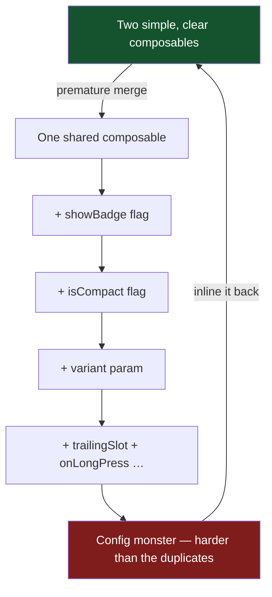

# Lesson 03 — KISS, DRY, YAGNI

> After this lesson you can keep Compose code simple, remove the *right* duplication without creating wrong abstractions, and stop building features and layers you don't need yet.

**Module:** 17 · **Lesson:** 03 · **Level:** 🟢🟡🔴 · **Est. time:** 60–75 min

---

## 1. Concept

### 🟢 For beginners — *what is it and why do I care?*

Three short principles that fight complexity:

- **KISS — Keep It Simple, Stupid.** Prefer the straightforward solution. The simplest code that works is usually the best code.
- **DRY — Don't Repeat Yourself.** If the same knowledge lives in two places, a change means editing both — and you'll forget one. Put it in one place.
- **YAGNI — You Aren't Gonna Need It.** Don't build for an imagined future. Add the abstraction when a *real, second* use case shows up — not before.

Why care? Complexity is the tax you pay on every future change. KISS keeps each piece small. DRY keeps facts in one place so fixes apply everywhere. YAGNI keeps you from paying for flexibility you never use. Together they keep a codebase *light enough to move quickly*.

The tension to feel early: **DRY pushes you to abstract; YAGNI and KISS push you not to.** Most over-engineering comes from applying DRY too aggressively, too soon.

### 🟡 For intermediate devs — *the mechanism*

In Compose, these principles have concrete shapes:

- **KISS:** reach for the built-in (`LazyColumn`, `Modifier.clickable`, `animateColorAsState`) before a custom layout or hand-rolled gesture. Render a decided `UiState` instead of branchy `if/else` trees in composition. Avoid speculative generics and deep configuration objects.

- **DRY — but DRY of *knowledge*, not of *characters*.** Genuine duplication: the same spacing/elevation/shape repeated across cards → extract to a theme token or a shared composable. The same validation rule in two screens → one function. *Coincidental* similarity (two composables that happen to look alike today but answer to different requirements) is **not** duplication — merging them couples unrelated things.

- **YAGNI:** don't add a `Repository` interface with one implementation "in case we swap backends," a `sealed UiState` with a `Loading` you never show, or a `Mapper` layer for a screen that displays the raw model. Add them when the second case is real.

The practical rule of thumb is the **Rule of Three**: the first time, write it. The second time, wince and copy. The third time, extract. Two occurrences are often coincidence; three is a pattern worth a name.

### 🔴 For senior devs — *trade-offs, edges, internals*

- **The wrong abstraction is more expensive than duplication.** Sandi Metz's law: "duplication is far cheaper than the wrong abstraction." A premature shared component grows a parameter for every divergence (`showBadge`, `isCompact`, `variant`, `trailingSlot`, `onLongPress`…) until it's a configuration monster that's harder to understand than the duplicates it replaced. When an abstraction starts sprouting boolean flags to handle special cases, that's the signal it unified things that should have stayed separate — **inline it back**.

- **DRY interacts with Compose stability.** A "DRY" mega-composable that takes a big config object or many lambdas can become **unstable/unskippable**, hurting recomposition (Module 11). Sometimes two small, stable, duplicated composables outperform one general one. Simplicity and performance often align against premature generalization.

- **KISS vs. essential complexity.** KISS removes *accidental* complexity (clever code, needless indirection). It does **not** mean ignoring *essential* complexity — concurrency, error states, accessibility are real and must be handled. The skill is telling them apart: a `try/catch` around a flaky network call is essential; a generic `Result<Either<E, A>>` monad stack for a single API is accidental.

- **YAGNI vs. one-way-door decisions.** YAGNI applies hardest to *reversible* choices (you can extract an interface later in minutes). Be more willing to invest up front in *irreversible* ones — public API shapes, persisted data schemas, module boundaries — where retrofitting is expensive. Knowing which doors are one-way is the senior judgment call.

- **Duplication you should keep.** Test code, by design, is often repetitive and *should* be (explicitness beats clever shared fixtures that hide what's under test). And cross-module duplication can be preferable to a shared "util" module that couples two features and becomes a dumping ground.

### Analogy

KISS, DRY, YAGNI are **packing for a trip**. KISS: take the versatile items that just work. DRY: one good charger for all your devices, not one per gadget. YAGNI: don't pack a snorkel for a ski trip "in case." But over-DRY is the traveler who buys a single do-everything gadget with 40 attachments — heavier and more fiddly than the few simple tools it replaced. The goal isn't *minimum stuff* or *maximum reuse*; it's the *lightest bag that handles the actual trip*.

### Mental model

> **Build the simplest thing that works now. Remove duplication of knowledge, not of appearance. Add flexibility when the second real use case arrives — never before.**

### Real-world example

A team adds a `BaseViewModel<S, E, F>` generic with state/event/effect plumbing "so every screen is consistent" before shipping a single screen. Six months later every ViewModel fights the base class's assumptions, and simple screens carry effect channels they never use. The KISS/YAGNI version: write three concrete ViewModels first; when the pattern is undeniable, extract the *small* shared piece you actually repeated.

---

## 2. Visual Learning

**ASCII — the abstraction decision:**
```text
   See similar code?
        │
        ▼
   Is it the SAME knowledge (one rule, one fact)?
     │ yes                                  │ no (coincidental look-alike)
     ▼                                       ▼
   Seen it ≥ 3 times (Rule of Three)?      KEEP SEPARATE (merging would couple them)
     │ yes              │ no
     ▼                  ▼
   EXTRACT one source   WAIT (duplicate for now; cheaper than wrong abstraction)
```

**Mermaid — over-DRY decays into a config monster:**


**Illustration prompt:**
```text
Illustration: two travelers side by side. LEFT carries a light, smart backpack with a few
versatile items and ONE universal charger — relaxed, moving fast. RIGHT lugs a giant
"do-everything" gadget bristling with 40 awkward attachments labeled showBadge, isCompact,
variant, slot…, sweating under the weight. A signpost reads "Rule of Three". Caption:
"The lightest bag that handles the actual trip." Modern, vibrant, friendly, clear labels.
```

---

## 3. Code

### 🟢 Beginner — KISS: use the built-in, render a decided state

```kotlin
// ✅ Simple: a built-in list + a decided state. No custom layout, no branchy composition.
@Composable
fun MessageList(state: MessagesUiState, modifier: Modifier = Modifier) {
    when (state) {
        MessagesUiState.Loading -> CircularProgressIndicator()
        is MessagesUiState.Error -> Text(state.message)
        is MessagesUiState.Ready -> LazyColumn(modifier) {
            items(state.messages, key = { it.id }) { MessageRow(it) }
        }
    }
}
```

**Explanation.** The state is *decided* upstream into one of three shapes, so the composable just picks a branch and renders. `LazyColumn` handles recycling for us — no custom scrolling code. That's KISS: lean on the framework, render a clear state.

**Common mistakes.**
```kotlin
// ❌ Needless complexity: manual scroll math + nested flags computed in composition.
@Composable
fun MessageListBad(messages: List<Message>?, loading: Boolean, err: String?) {
    if (loading && messages == null) { /* … */ }
    else if (err != null && !loading) { /* … */ }
    else if (messages != null && messages.isNotEmpty()) { /* hand-rolled scroller */ }
    // impossible combinations are representable; the reader must trace every flag
}
```

**Best practices.**
- Prefer framework primitives (`LazyColumn`, modifiers) over custom mechanics.
- Decide state into a `sealed` shape upstream so composition is a simple branch.

---

### 🟡 Intermediate — DRY of knowledge, with the Rule of Three

```kotlin
// The SAME knowledge (validation rule) was copied into two screens. Extract it ONCE.
fun validateEmail(input: String): EmailError? = when {
    input.isBlank()              -> EmailError.Empty
    !input.contains('@')         -> EmailError.Malformed
    input.length > 254           -> EmailError.TooLong
    else                         -> null
}

// Both LoginViewModel and SignupViewModel now call validateEmail(...) — one source of truth.
```

**Explanation.** The email rule is a single piece of *knowledge*. Duplicating it means a future fix (say, stricter RFC handling) must be applied in every copy and one will be missed. Extracting the rule — not because two composables *look* alike, but because they encode the *same fact* — is correct DRY.

**Common mistakes.**
```kotlin
// ❌ Wrong DRY: merging two rows that only LOOK similar but answer to different requirements.
@Composable
fun GenericRow(
    title: String,
    showChevron: Boolean = false,   // for settings rows
    showSwitch: Boolean = false,    // for toggle rows
    isDestructive: Boolean = false, // for "delete account"
    badgeCount: Int? = null,        // for inbox rows
    onClick: (() -> Unit)? = null,
) { /* a thicket of if(showSwitch)/if(showChevron)… */ }
```
This "DRY" row accreted a flag per caller until it's harder to read than four small, honest rows would have been. The look-alikes had different reasons to change.

**Best practices.**
- Extract **knowledge** (rules, constants, tokens), not **coincidental appearance**.
- Apply the **Rule of Three** before abstracting UI; two is often coincidence.
- If an abstraction starts growing boolean flags per caller, that's the signal to **split it back**.

---

### 🔴 Production — YAGNI: ship the simple thing, keep doors open

```kotlin
// ✅ YAGNI now: one repository, no interface, no mapper — the screen shows the model as-is.
class FavoritesViewModel(private val dao: FavoritesDao) : ViewModel() {
    val favorites: StateFlow<List<Favorite>> =
        dao.observeAll()
            .stateIn(viewModelScope, SharingStarted.WhileSubscribed(5_000), emptyList())
}
```

```kotlin
// Later — a SECOND data source (remote sync) genuinely appears. NOW invert (DIP), cheaply.
interface FavoritesRepository { fun observeAll(): Flow<List<Favorite>> }

class FavoritesRepositoryImpl @Inject constructor(
    private val dao: FavoritesDao,
    private val remote: FavoritesRemoteDataSource,
) : FavoritesRepository {
    override fun observeAll(): Flow<List<Favorite>> = /* merge local + remote */ TODO()
}
```

**Explanation.** Version 1 is the **simplest thing that works**: the ViewModel reads the DAO directly — no interface, no mapper, no speculative layers. That's not sloppiness; it's deferring a *reversible* decision. When a real second data source arrives, introducing `FavoritesRepository` is a small, mechanical change (extract interface, swap the binding). YAGNI bought time you didn't waste building flexibility you didn't need.

**Common mistakes.**
```kotlin
// ❌ Speculative architecture before a single requirement demands it.
interface FavoritesRepository { /* one impl, forever */ }
interface FavoritesMapper { /* maps Favorite -> Favorite, identity */ }
sealed interface FavoritesUiState { object Loading; data class Ready(…); object Error }
// …for a screen that just shows a static list. Layers cost reading time with zero payoff.
```
Each speculative layer is indirection a reader must traverse and a maintainer must keep consistent — for a benefit that may never materialize.

**Best practices.**
- Default to the **direct** solution; add layers when a **second real** use case forces them.
- Reserve up-front investment for **one-way-door** decisions (public APIs, persisted schemas, module boundaries).
- `stateIn`/`WhileSubscribed` is plenty for a simple feed — no need for a full MVI effect channel if there are no effects.

---

## 4. Interview Questions

**🟢 Beginner**

1. *What does DRY mean, and what's a good Compose example?*
   > "Don't Repeat Yourself" — keep each piece of knowledge in one place. Example: a validation rule or a spacing/elevation token used by many screens lives in one function/theme token, so a change applies everywhere at once.
2. *What is YAGNI?*
   > "You Aren't Gonna Need It" — don't build features or abstractions for imagined future needs. Add them when a real, present requirement demands them.

**🟡 Intermediate**

3. *What's the "Rule of Three" and why not abstract on the second occurrence?*
   > Write it the first time, copy it the second, extract the third. Two occurrences are often coincidental similarity; abstracting too early risks coupling things that diverge later, producing a flag-laden component harder than the duplicates.
4. *Give an example of "wrong DRY" in Compose.*
   > Merging two visually similar rows (a settings chevron row and a toggle row) into one `GenericRow` with `showChevron`/`showSwitch`/`badgeCount` flags. They looked alike but had different reasons to change; the merged component becomes a configuration thicket.

**🔴 Senior**

5. *Why is "duplication cheaper than the wrong abstraction," and how do you spot a wrong abstraction?*
   > A premature abstraction couples callers; as they diverge, it grows a parameter per special case until it's harder to understand than the duplicates and risks every caller on each change. Spot it when an abstraction sprouts boolean flags to handle special cases, or when callers pass args they don't conceptually own — then inline it back and let the pieces re-diverge.
6. *How does YAGNI interact with reversible vs. irreversible decisions?*
   > YAGNI applies hardest to reversible choices (extracting an interface later is cheap, so defer it). For irreversible/one-way-door decisions — public API shape, persisted data schema, module boundaries — retrofitting is expensive, so it's worth investing in getting those right up front even if "not strictly needed yet."

---

## 5. AI Assistant

**Prompt example (simplify and de-duplicate without over-abstracting):**
```text
Review this Compose feature for KISS/DRY/YAGNI:
1) KISS: replace any hand-rolled scrolling/branchy composition with built-ins and a decided
   sealed UiState.
2) DRY: extract only TRUE duplicated knowledge (validation rules, repeated tokens). Do NOT
   merge composables that merely look similar.
3) YAGNI: remove speculative layers (single-impl interfaces, identity mappers, unused effect
   channels). Note which removals are reversible.
Explain each change and flag anything you think is essential complexity I should keep.
Target: Compose 2026 BOM, Kotlin 2.x.
[paste code]
```

**AI workflow — where it helps on *this* topic.**
- ✅ Great for: collapsing flag-laden components back into simple ones, spotting genuinely repeated rules, replacing custom mechanics with framework primitives, listing speculative layers to delete.
- ⚠️ Watch: AI **loves to abstract**. It will eagerly create a `BaseViewModel`, a `GenericRow`, or an interface "for flexibility" — the exact YAGNI/over-DRY traps. It may also strip *essential* complexity (error handling, accessibility) in the name of "simplicity."

**Review workflow — map to this lesson's *Common Mistakes*:**
- Did it merge **coincidental look-alikes**, or only **same-knowledge** duplication?
- Did the "simplification" add a **generic/base class** or **flags** (over-DRY) instead of removing them?
- Did it introduce **speculative layers** (one-impl interface, identity mapper) the requirements don't need?
- Did it accidentally remove **essential** complexity (try/catch, empty/error states, a11y)?
- Is the chosen state model the **simplest that's correct** (no MVI effect channel without effects)?

**Validation workflow — prove simpler is still correct:**
1. **Compile & run** all states (loading/error/ready, empty/non-empty) — simplification must not drop a case.
2. Keep/expand unit tests for the extracted **rule** (e.g. `validateEmail`) so the single source is pinned.
3. Run **Detekt** complexity rules (Lesson 05): cyclomatic complexity and "too many parameters" should **drop**, not rise.
4. If you merged composables, check **recomposition counts** (Module 11) didn't regress from a new unstable config object.

> **AI drafts, you decide.** When the model proposes a shiny generic abstraction, ask "do we have three real cases *today*?" If not, take the duplication and move on — you can always extract later.

---

## Recap / Key takeaways

- **KISS:** simplest correct solution; framework primitives + a decided `sealed UiState` over clever, branchy code.
- **DRY** of **knowledge** (rules, tokens), not of **appearance**; honor the **Rule of Three** before abstracting UI.
- **The wrong abstraction costs more than duplication** — flags-per-caller is the signal to inline it back.
- **YAGNI:** build the direct thing now; add layers when a **second real** use case appears.
- Defer **reversible** decisions; invest up front in **one-way-door** ones (public APIs, schemas, module boundaries).

➡️ Next: **[Lesson 04 — Compose code smells](04-compose-code-smells.md)** — god composables, state in the wrong place, and modifier soup, with the refactor for each.
