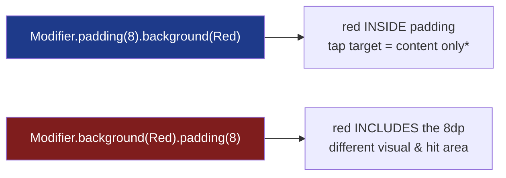
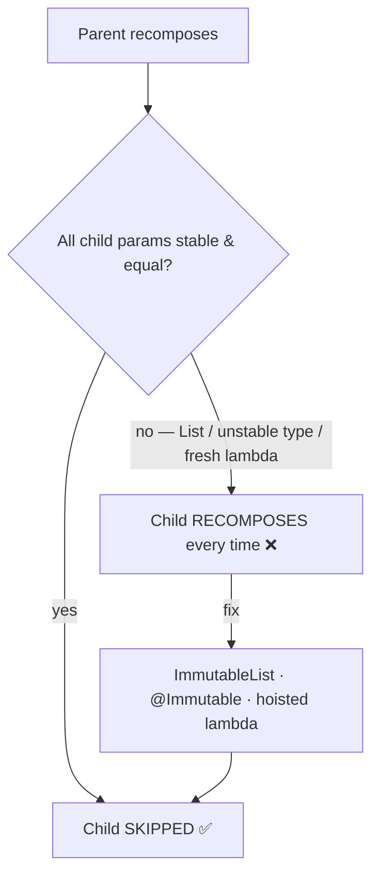

# Lesson 04 — Compose Code Smells

> After this lesson you can name the recurring Compose anti-patterns on sight — god composables, state in the wrong place, modifier soup, unstable params, side effects in composition — and apply the standard refactor for each.

**Module:** 17 · **Lesson:** 04 · **Level:** 🟢🟡🔴 · **Est. time:** 75–90 min

---

## 1. Concept

### 🟢 For beginners — *what is it and why do I care?*

A **code smell** is a surface symptom that usually points to a deeper design problem. It's not a bug — the app might run fine — but it's a warning sign: this code will be hard to change, hard to test, or slow. Learning to *smell* problems is what makes code review fast: you spot the shape before you read every line.

Compose has its own catalog of smells, distinct from old View/XML ones. The headline offenders:

- **God composable** — one giant function doing layout + state + data + navigation.
- **State in the wrong place** — `remember` holding business state that should be in a ViewModel, or state hoisted too high.
- **Modifier soup** — a 12-line `Modifier` chain where order is load-bearing and nobody's sure why.
- **Side effects in composition** — logging, network calls, or navigation in the composable body (runs on every recomposition).
- **Unstable parameters** — passing types Compose can't prove stable, silently defeating skipping.

Why care: each smell predicts a class of bug or a maintenance headache. Naming them gives your team a shared vocabulary ("that's a god composable") and a known fix.

### 🟡 For intermediate devs — *the mechanism*

Each smell has a mechanism and a refactor:

| Smell | Why it's bad | Refactor |
|---|---|---|
| God composable | Couples concerns; huge recomposition scope; untestable | Split into Route/Screen/leaves (Lesson 01) |
| `remember` for business state | Lost on process death; not testable; wrong owner | Hoist to ViewModel (`StateFlow`) |
| Hoisted too high | Whole subtree recomposes on every keystroke | Push state down to the smallest owner |
| Modifier soup / wrong order | Padding-vs-size, click target bugs | Order intentionally; extract `Modifier` builders |
| Side effect in composition | Fires 0..N times, unpredictably | Move to `LaunchedEffect`/`SideEffect`/`rememberCoroutineScope` |
| Unstable params | Skipping fails → over-recomposition | Stable/immutable types, `kotlinx.collections.immutable`, stable lambdas |
| Reading state too eagerly | Wider invalidation than needed | Defer with lambda modifiers / `derivedStateOf` |

The unifying idea: Compose rewards **pure, narrowly-scoped, stable** composables. Most smells are a violation of one of those three.

### 🔴 For senior devs — *trade-offs, edges, internals*

- **Modifier order is semantics, not style.** `Modifier.padding(8.dp).background(Red)` paints red *inside* the padding; `.background(Red).padding(8.dp)` paints red *including* it. `.clickable {}.padding()` makes only the unpadded area tappable; `.padding().clickable {}` makes the padding tappable too. "Modifier soup" isn't just ugly — reordering can silently change hit targets and visuals. The smell is *unexplained* long chains; the fix is intentional ordering plus extraction of reusable chains into named `Modifier` extension functions.

- **Stability is the invisible smell.** With **Strong Skipping** (default in 2026), Compose can skip a composable whose parameters are all stable *and equal*. Pass a `List<T>` (unstable — the runtime can't prove it won't mutate), a class from another module without `@Immutable`/`@Stable`, or a **freshly-allocated lambda capturing unstable state**, and skipping silently fails — the composable recomposes every time its parent does. This smell is invisible in code review unless you know to look; it shows up as recomposition-count regressions (Module 11). Fixes: `ImmutableList`/`PersistentList` from `kotlinx.collections.immutable`, `@Immutable`/`@Stable` annotations where truthful, hoisting lambdas, and a stability-configuration file for third-party types.

- **"State in the wrong place" cuts both ways.** Too **high**: a `TextFieldValue` hoisted to the screen root recomposes the whole screen on each keystroke. Too **low** or wrong **owner**: business state in `remember` dies on process death and can't be unit-tested. The senior judgment is *ownership*: ephemeral UI state (scroll position, expanded/collapsed) stays local; durable/business state goes to the ViewModel + `SavedStateHandle`.

- **`derivedStateOf` is itself a smell magnet.** It's the right tool when a *frequently-changing* source maps to a *rarely-changing* derived value read in composition (e.g. `scrollOffset > threshold` → `showButton`). But wrapping a cheap, already-`State` computation in `derivedStateOf` adds overhead for nothing — a "cargo-cult `derivedStateOf`" smell. Use it to *cut* recompositions, not reflexively.

- **Effect-in-composition is a correctness smell, not just style.** Launching a coroutine, navigating, or logging directly in the composable body can fire multiple times, out of order, or after the composable left the tree. The fix is keyed effect APIs (`LaunchedEffect(key)`, `DisposableEffect`) — and the deeper tell is that the author is thinking imperatively inside a declarative function.

### Analogy

Code smells are the **warning lights on a car dashboard**. The check-engine light doesn't mean the car stopped — it means something underneath will bite you if ignored. A god composable is the light that says "the engine is doing the transmission's job too." Modifier soup is a loose wire that *sometimes* changes how the car behaves. Unstable params are low tire pressure — invisible until you notice you're burning fuel (recompositions). Experienced drivers read the lights; experienced reviewers read the smells.

### Mental model

> **Pure, small, stable. Most Compose smells are a violation of one of those three — and each has a known refactor.**

### Real-world example

A `CheckoutScreen` that started clean accretes into a 400-line god composable: it collects three flows, navigates on success via captured `NavController`, holds the coupon code in `remember`, and renders everything in one branchy `Column` with a 14-line modifier on the total row. In review, a senior names four smells at a glance — god composable, business state in `remember`, navigation-in-composition, modifier soup — and the team knows exactly which four refactors to apply.

---

## 2. Visual Learning

**ASCII — the smell-to-refactor map:**
```text
   SMELL                          REFACTOR
   ─────                          ────────
   God composable        ─────▶   Route / Screen / leaves
   business state in     ─────▶   hoist to ViewModel (StateFlow + SavedStateHandle)
     remember
   state hoisted too high ────▶   push down to smallest owner
   modifier soup          ────▶   intentional order + named Modifier.ext()
   effect in composition  ────▶   LaunchedEffect / DisposableEffect / SideEffect
   unstable params        ────▶   ImmutableList, @Immutable/@Stable, hoist lambdas
   eager state read       ────▶   lambda modifiers / derivedStateOf (only to cut work)
```

**Mermaid — modifier order changes behavior:**


**Mermaid — unstable param defeats skipping:**


**Illustration prompt:**
```text
Illustration: a car dashboard at night with five glowing warning icons, each labeled with a
Compose smell — "GOD COMPOSABLE", "STATE MISPLACED", "MODIFIER SOUP", "EFFECT IN COMPOSITION",
"UNSTABLE PARAMS". A calm mechanic points a diagnostic tablet at each light; the tablet shows
the matching fix. Mood: under-the-hood diagnostics, not alarm. Modern, vibrant, clean labels,
soft dashboard glow.
```

---

## 3. Code

### 🟢 Beginner — side effect in composition → effect API

```kotlin
// ❌ SMELL: logging/navigation in the composition path — fires on every recomposition.
@Composable
fun ScreenBad(state: ScreenUiState, navController: NavController) {
    analytics.log("screen_view")                 // 0..N times — wrong
    if (state.isDone) navController.navigate("next") // can fire repeatedly / after leaving tree
    Text(state.title)
}

// ✅ FIX: keyed effects run a controlled number of times, lifecycle-aware.
@Composable
fun ScreenGood(state: ScreenUiState, onNavigateNext: () -> Unit) {
    LaunchedEffect(Unit) { analytics.log("screen_view") }   // once per entering composition
    LaunchedEffect(state.isDone) {                          // re-keyed only when isDone flips
        if (state.isDone) onNavigateNext()
    }
    Text(state.title)
}
```

**Explanation.** Composition can run many times; anything with an external effect must live in an effect API keyed to *when* it should run. Navigation is also hoisted to a callback, so the composable stays previewable.

**Common mistakes.** Putting `viewModel.load()`, logging, or `navigate(...)` directly in the body. Also capturing `NavController` in a leaf instead of exposing an `onNavigate` lambda.

**Best practices.**
- No side effects in the composition path — use `LaunchedEffect`/`DisposableEffect`/`SideEffect`.
- Hoist navigation to a lambda; key effects to the value that should trigger them.

---

### 🟡 Intermediate — state in the wrong place → correct ownership

```kotlin
// ❌ SMELL: business/durable state in remember — dies on process death, untestable.
@Composable
fun CouponFieldBad() {
    var coupon by remember { mutableStateOf("") }     // should survive & be validated in VM
    var isValid by remember { mutableStateOf(false) }
    TextField(coupon, onValueChange = { coupon = it; isValid = it.length >= 6 })
}

// ✅ FIX: durable/business state owned by the ViewModel; the field is stateless.
data class CouponUiState(val code: String = "", val isValid: Boolean = false)

class CartViewModel(/* … */) : ViewModel() {
    private val _coupon = MutableStateFlow(CouponUiState())
    val coupon: StateFlow<CouponUiState> = _coupon.asStateFlow()
    fun onCouponChange(value: String) =
        _coupon.update { it.copy(code = value, isValid = value.length >= 6) }
}

@Composable
fun CouponField(state: CouponUiState, onChange: (String) -> Unit, modifier: Modifier = Modifier) {
    TextField(state.code, onValueChange = onChange, isError = !state.isValid, modifier = modifier)
}
```

**Explanation.** The coupon code is *durable business state* with a validation rule — it belongs in the ViewModel, where it survives configuration changes and is unit-testable. The composable becomes a stateless renderer. (Contrast: a *scroll position* or *expanded* flag is ephemeral UI state and correctly stays in `remember`.)

**Common mistakes.**
```kotlin
// ❌ Opposite smell: hoisting ephemeral UI state too high.
@Composable
fun ScreenBad() {
    var listScroll by rememberSaveable { mutableStateOf(0) } // recomposes whole screen on scroll
    // …pass scroll down everywhere…
}
```
Hoisting *too high* widens the recomposition blast radius; hoisting *business* state too low loses it on process death. Match the owner to the state's lifetime.

**Best practices.**
- **Ephemeral UI state** (scroll, expanded, focus) → local `remember`.
- **Durable/business state** (form values, validation, selections that must persist) → ViewModel + `SavedStateHandle`.

---

### 🔴 Production — unstable params + modifier soup → stable, named, ordered

```kotlin
// ❌ SMELL: unstable List param defeats skipping; a 12-line modifier with load-bearing order.
@Composable
fun ProductGridBad(products: List<Product>, onClick: (Product) -> Unit) {  // List = unstable
    LazyVerticalGrid(GridCells.Fixed(2)) {
        items(products) { p ->
            Box(
                Modifier
                    .padding(8.dp).background(MaterialTheme.colorScheme.surface)
                    .clip(RoundedCornerShape(12.dp)).clickable { onClick(p) }
                    .fillMaxWidth().aspectRatio(1f).border(1.dp, Color.Gray) // order accidental
            ) { /* … */ }
        }
    }
}

// ✅ FIX: immutable list (stable) + extracted, intentionally-ordered modifier.
@Composable
fun ProductGrid(
    products: ImmutableList<Product>,                  // kotlinx.collections.immutable → stable
    onProductClick: (Product) -> Unit,
    modifier: Modifier = Modifier,
) {
    LazyVerticalGrid(columns = GridCells.Fixed(2), modifier = modifier) {
        items(products, key = { it.id }) { product ->
            ProductCard(product = product, onClick = { onProductClick(product) })
        }
    }
}

// Reusable, named, ORDER-INTENTIONAL modifier: clip → clickable (ripple respects shape) → padding.
private fun Modifier.productCardSurface(shape: Shape, onClick: () -> Unit): Modifier =
    this
        .clip(shape)                 // 1) clip first so ripple/background follow the shape
        .clickable(onClick = onClick) // 2) clickable inside the clipped bounds
        .background(MaterialTheme.colorScheme.surface) // visual fill
        .padding(12.dp)              // 3) inner content padding, inside the tap target

@Composable
private fun ProductCard(product: Product, onClick: () -> Unit, modifier: Modifier = Modifier) {
    Column(modifier.productCardSurface(RoundedCornerShape(12.dp), onClick)) { /* … */ }
}
```

**Explanation.** `ImmutableList` lets the Compose compiler treat `products` as **stable**, so unchanged grid items can skip recomposition under Strong Skipping. The modifier chain is **extracted and named**, with order chosen deliberately (clip → clickable → background → padding) so the ripple respects the rounded shape and the tap target is correct. Each item also gets a stable `key`, and the per-item lambda is created inside `items` where it's cheap and well-scoped.

**Common mistakes.**
```kotlin
// ❌ @Immutable on a type that actually mutates — lies to the compiler, causes stale UI.
@Immutable data class Cart(var items: MutableList<Item>) // var + MutableList → not immutable!
// ❌ derivedStateOf around a trivial already-State value — pure overhead.
val label by remember { derivedStateOf { "Items: ${state.count}" } } // count is already State
```
Annotating a mutable type `@Immutable` makes Compose skip updates it *should* show (stale UI). And `derivedStateOf` only pays off when a hot source maps to a cold derived value — here it just adds machinery.

**Best practices.**
- Use **`ImmutableList`/`PersistentList`** (or `@Immutable`/`@Stable` only when truthful) so parameters are provably stable.
- **Extract and name** reusable modifier chains; order modifiers **intentionally** (clip/clickable/background/padding semantics).
- Give list items a stable **`key`**; keep per-item lambdas scoped to the item.
- Reach for `derivedStateOf` to *cut* recompositions from a hot source — not reflexively.

---

## 4. Interview Questions

**🟢 Beginner**

1. *What is a "god composable" and why is it a smell?*
   > A single composable that does layout, state holding, data fetching, and navigation. It couples unrelated concerns, can't be previewed or unit-tested, and recomposes a huge scope. Fix: split into Route/Screen/leaf composables.
2. *Why shouldn't you log or navigate directly in a composable's body?*
   > Composition can run many times (out of order, skipped, repeated), so the side effect fires an unpredictable number of times. Use `LaunchedEffect`/`DisposableEffect`/`SideEffect`, keyed appropriately, and hoist navigation to a callback.

**🟡 Intermediate**

3. *How do you decide whether state belongs in `remember` or a ViewModel?*
   > By lifetime/ownership. Ephemeral UI state (scroll position, expanded/collapsed, focus) stays in local `remember`. Durable or business state (form values with validation, selections that must survive process death) belongs in the ViewModel with `SavedStateHandle`.
4. *Why is passing a `List` to a composable a potential smell?*
   > `List` is treated as **unstable** (the runtime can't prove it won't mutate), so Compose may skip skipping — the composable recomposes whenever its parent does, even if the data is unchanged. Use `ImmutableList`/`PersistentList` (kotlinx.collections.immutable) to make it stable.

**🔴 Senior**

5. *Why is modifier order a correctness concern, not just style?*
   > Modifiers wrap outward in order, so `padding` before vs. after `background`/`clickable` changes what's painted and what's tappable (e.g. whether the padding is part of the click target, whether the ripple respects a clip). An unexplained long chain is a smell; the fix is intentional ordering plus extraction into named modifier extensions.
6. *When is `derivedStateOf` correct, and when is it a smell?*
   > Correct when a **frequently-changing** source (scroll offset) is mapped to a **rarely-changing** value read in composition (`offset > threshold`), so most source changes don't trigger recomposition. It's a smell ("cargo-cult `derivedStateOf`") when wrapped around an already-`State`, cheap computation — that just adds overhead without cutting recompositions.

---

## 5. AI Assistant

**Prompt example (smell audit + refactor):**
```text
Audit this Compose code for smells and refactor each:
- god composable → Route/Screen/leaves
- business state in remember → hoist to ViewModel (StateFlow + SavedStateHandle); keep EPHEMERAL UI
  state (scroll/expanded) local
- side effects in composition → LaunchedEffect/DisposableEffect, keyed correctly; hoist navigation
- unstable params → ImmutableList / @Immutable (only if truthful)
- modifier soup → extract a named Modifier extension and justify the order
Do NOT add @Immutable to types with `var`/MutableList, and do NOT wrap already-State values in
derivedStateOf. Explain each smell and fix. Target: Compose 2026 BOM, Kotlin 2.x, Strong Skipping.
[paste code]
```

**AI workflow — where it helps on *this* topic.**
- ✅ Great for: spotting and splitting god composables, moving effects into `LaunchedEffect`, converting `List` → `ImmutableList`, extracting modifier chains, suggesting `key`s for list items.
- ⚠️ Watch: models frequently **slap `@Immutable`/`@Stable` on mutable types** (a correctness bug, not a fix), **reorder modifiers** without realizing they changed hit targets/visuals, **over-use `derivedStateOf`**, and **hoist ephemeral UI state into the ViewModel** unnecessarily.

**Review workflow — map to this lesson's *Common Mistakes*:**
- Any **side effect or navigation** still in the composition path?
- Is **business** state in the ViewModel and **ephemeral** state still local (not the reverse)?
- Are `@Immutable`/`@Stable` annotations **truthful** (no `var`/`MutableList` inside)?
- Did a modifier **reorder** change the visual or **tap target**? Is the order **justified**?
- Is `derivedStateOf` used to **cut** recompositions, not reflexively around an already-`State`?
- Do list items have a stable **`key`**?

**Validation workflow — prove the smell is gone:**
1. **Compile & run**; verify visuals and tap targets are unchanged after modifier extraction/reordering.
2. Enable **Layout Inspector → recomposition counts** (or Compose compiler metrics): the previously-unstable composable should now **skip** when data is unchanged.
3. Generate **Compose compiler stability reports** to confirm the type is now `stable`/`skippable`.
4. **Rotate / process-death** test: business state survives (it's in the VM + `SavedStateHandle`); effects don't re-fire.
5. Run **Detekt** (Lesson 05) for function-length/complexity to catch a god composable creeping back.

> **AI drafts, you decide.** Treat any AI-added `@Immutable` as a claim to verify — open the type and confirm it truly can't mutate. A false stability annotation trades a recomposition smell for a *stale-UI bug*, which is worse.

---

## Recap / Key takeaways

- A **smell** is a symptom, not a bug — it predicts hard-to-change, hard-to-test, or slow code.
- The big Compose smells: **god composable**, **state in the wrong place**, **modifier soup**, **side effects in composition**, **unstable params**, **cargo-cult `derivedStateOf`** — each has a known refactor.
- Compose rewards **pure, small, stable** composables; most smells violate one of those.
- **Modifier order is semantics** (visuals + hit targets); extract and order chains intentionally.
- **Stability** (`ImmutableList`, truthful `@Immutable`) is an invisible smell — verify it with compiler reports / recomposition counts, never by adding annotations that lie.

➡️ Next: **[Lesson 05 — Static analysis](05-static-analysis.md)** — automate catching these smells with Detekt, Ktlint, Android Lint, SonarQube, and CI gates.
