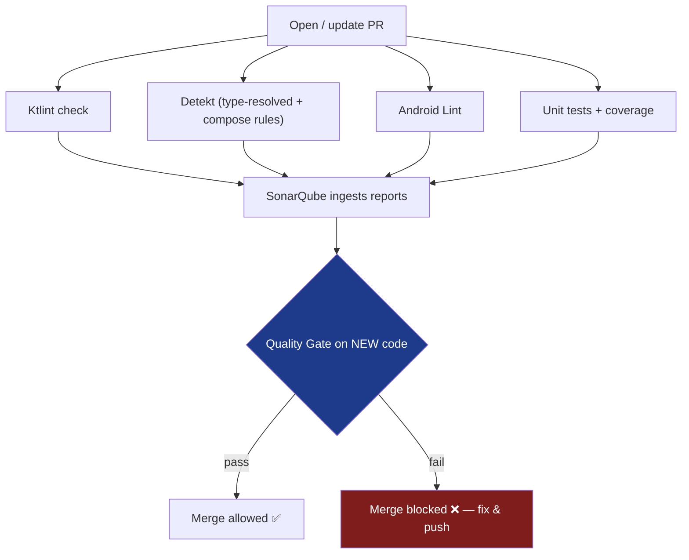
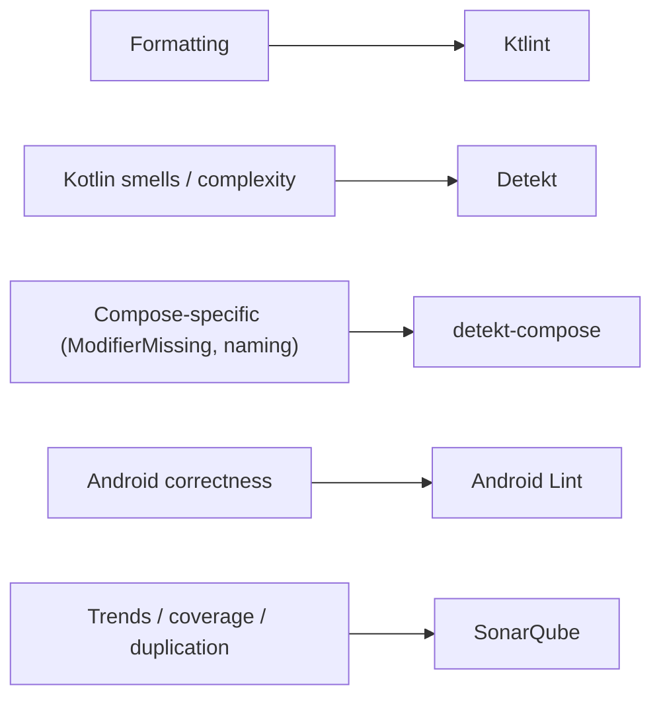

# Lesson 05 — Static Analysis

> After this lesson you can wire Detekt, Ktlint, Android Lint, and SonarQube into a Compose project, write a Compose-aware rule, and enforce quality as a CI gate that blocks bad code from merging.

**Module:** 17 · **Lesson:** 05 · **Level:** 🟢🟡🔴 · **Est. time:** 75–90 min

---

## 1. Concept

### 🟢 For beginners — *what is it and why do I care?*

**Static analysis is reading your code with a tool instead of your eyes — without running it.** "Static" means it inspects the source as text/structure; it never executes the app. The tool flags problems: unused imports, functions that are too long, a composable missing a `Modifier` parameter, a likely bug.

The four you'll meet on Android:

- **Ktlint** — *formatting* (spacing, import order, line length). Keeps the codebase looking like one person wrote it.
- **Detekt** — *Kotlin code quality* (complexity, long methods, code smells), with **Compose-specific rules** available.
- **Android Lint** — *Android correctness* (missing permissions, resource issues, some Compose pitfalls).
- **SonarQube** — *project-wide dashboard* aggregating issues, coverage, duplication, and trends over time.

Why care: humans miss things and get tired; tools never do. Static analysis catches the boring 80% automatically, so human review focuses on the interesting 20% (design, naming, architecture). And as a **CI gate**, it stops a smell from ever reaching `main`.

### 🟡 For intermediate devs — *the mechanism*

The tools differ in *what* they understand:

- **Ktlint** parses Kotlin and enforces a style standard (`.editorconfig`-driven). Fast, autofixable (`ktlintFormat`). Catches *style*, not logic.
- **Detekt** builds an AST (and optionally a *type-resolved* model) to evaluate rules like `LongMethod`, `CyclomaticComplexMethod`, `TooManyFunctions`. The community **`detekt-compose`** ruleset (from Twitter/X's Compose rules) adds Compose-aware checks: `ModifierMissing`, `ModifierComposable`, `ComposableNaming`, `MultipleEmitters`, `ContentEmitterReturningValues`, `ComposableParameterOrdering`, `ViewModelForwarding`, `Material2` usage, etc.
- **Android Lint** understands the Android framework + some Compose: e.g. `AutoboxingStateCreation` (use `mutableIntStateOf`), `ComposableLambdaParameterNaming/Position`, `FrequentlyChangedStateReadInComposition`, `ProduceStateDoesNotAssignValue`. It ships with AGP — no extra dependency.
- **SonarQube** runs its own analyzers *and* ingests Detekt/Lint/coverage reports, presenting a **Quality Gate** (e.g. "0 new bugs, coverage on new code ≥ 80%, duplication < 3%").

The "new code" framing matters: mature gates judge *the diff*, not the whole legacy repo, so teams improve without an impossible big-bang cleanup (**"clean as you code"**).

### 🔴 For senior devs — *trade-offs, edges, internals*

- **Type resolution changes what Detekt can see.** Many high-value rules (and most `detekt-compose` rules that reason about types, like detecting `Modifier` flow or `@Composable` return values) require **type resolution** — Detekt must be given the compile classpath. Without it, those rules silently no-op. In CI, run the **`detektMain`/`detektM` type-resolving tasks per variant**, not the classpath-less `detekt` task, or you'll get a false sense of coverage.

- **Baselines manage legacy debt without disabling rules.** Turning on a strict ruleset against a large repo yields thousands of findings. A **baseline file** snapshots existing violations so they don't fail the build, while **new** violations do. This is how you adopt strict rules incrementally. The risk: baselines become a graveyard — pair them with a "ratchet" (baseline only shrinks; CI rejects growth).

- **Gate placement and signal-to-noise.** A gate that's too noisy gets ignored or bypassed; too lax and it's theater. Tune severities: formatting → autofix (never a human's problem), correctness/complexity → **error** (blocks merge), stylistic opinions → **warning**. Run fast checks (Ktlint, Detekt) as **pre-commit/pre-push hooks** for instant feedback, and the full suite (+ Sonar, type-resolved Detekt, Lint) on **PR CI**. Make the gate **required** in branch protection or it's advisory.

- **Custom rules encode *your* standards.** The off-the-shelf rules don't know your team forbids `collectAsState` (vs `collectAsStateWithLifecycle`) or `GlobalScope`. Detekt and Lint both support **custom rules**: write a small rule that flags your specific anti-patterns from Lesson 04 (e.g., "no `LiveData` in new code," "no `Modifier` created inside `items`"). This turns review comments you make repeatedly into automated, un-bypassable checks.

- **Static analysis ≠ tests ≠ profiling.** Lint can't prove your recomposition is minimal (that's Macrobenchmark/Layout Inspector, Module 11) and Detekt can't prove behavior (that's tests, Module 14). Static analysis catches **shape and known patterns**; it's one layer of defense, not the whole pyramid. Knowing its blind spots prevents false confidence.

### Analogy

Static analysis is **spell-check and grammar-check for code**. Spell-check (**Ktlint**) flags typos and bad formatting instantly. Grammar-check (**Detekt/Lint**) catches awkward, error-prone constructions — "this sentence is too long," "this likely means something you didn't intend." The editor's style guide (**SonarQube Quality Gate**) is the publisher's standard every submission must pass before print. None of them judge whether your *story* is good (that's review and tests) — but they guarantee no published page has a glaring typo or run-on paragraph.

### Mental model

> **Let machines enforce the rules a machine can check, so humans spend review on the judgment a machine can't. Gate the diff, not the legacy.**

### Real-world example

A team's PR pipeline: a **pre-push hook** runs `ktlintFormat` + fast Detekt (seconds). On the PR, CI runs **type-resolved Detekt** (with `detekt-compose` rules), **Android Lint**, unit tests with coverage, and uploads everything to **SonarQube**. The PR can't merge unless the **Quality Gate** passes: 0 new blocker/critical issues, coverage on new code ≥ 80%, duplication < 3%, and zero `ModifierMissing`/`ComposableNaming` violations. A reviewer never has to comment "add a `modifier` param" again — the gate does.

---

## 2. Visual Learning

**ASCII — layers of defense, fastest first:**
```text
   edit ─▶ IDE inspections (live)         ── instant, in-editor
        ─▶ pre-commit/push hook            ── Ktlint + fast Detekt (seconds)
        ─▶ Pull Request CI                 ── Detekt (type-res) + Lint + tests + Sonar
        ─▶ Quality Gate (required)         ── BLOCKS merge if "new code" fails thresholds
                                              │
                                              ▼
                                          main stays green
```

**Mermaid — the CI quality gate flow:**


**Mermaid — which tool catches what:**


**Illustration prompt:**
```text
Illustration: a multi-stage airport security checkpoint for code. A "commit" suitcase rolls
through belts labeled in order: "Ktlint (formatting)", "Detekt (smells)", "Lint (Android)",
"Tests + Coverage", ending at a glowing gate labeled "SonarQube Quality Gate". Green light =
pass to "main"; red light = sent back. Friendly, clean, labeled conveyor belts, soft lighting,
no menace — an efficient checkpoint, not a prison.
```

---

## 3. Code

> These are configuration "tiers": a minimal setup, a Compose-aware setup, and a full CI gate. Versions are illustrative — pin to current releases from each tool's docs.

### 🟢 Beginner — add Ktlint + Detekt to a module

```kotlin
// build.gradle.kts (module) — apply formatting + Kotlin quality.
plugins {
    id("io.gitlab.arturbosch.detekt") version "1.23.7"   // pin to latest
    id("org.jlleitschuh.gradle.ktlint") version "12.1.1"
}

detekt {
    buildUponDefaultConfig = true                 // start from sensible defaults
    config.setFrom(files("$rootDir/config/detekt/detekt.yml"))
    autoCorrect = true
}
```

```bash
./gradlew ktlintFormat   # auto-fix style
./gradlew detekt         # report Kotlin smells
```

**Explanation.** Two plugins, one command each. `ktlintFormat` rewrites formatting automatically; `detekt` reports complexity/smell findings using its default ruleset plus your overrides. This is the smallest setup that adds real value.

**Common mistakes.**
- Treating **Ktlint as a code-quality tool** — it only checks *formatting*; you still need Detekt/Lint for logic and smells.
- Committing without running either, then arguing about spacing in review.

**Best practices.** Add both early; enable `autoCorrect`/`ktlintFormat`; commit a shared config so the whole team agrees.

---

### 🟡 Intermediate — Compose-aware Detekt rules + a baseline

```yaml
# config/detekt/detekt.yml — enable the Compose ruleset and tune it.
Compose:                                  # provided by the detekt-compose (Twitter/X) plugin
  ModifierMissing:
    active: true                          # every UI composable must accept a Modifier
  ModifierComposable:
    active: true
  ComposableNaming:
    active: true                          # @Composable emitting Unit → PascalCase
  ComposableParameterOrdering:
    active: true                          # required → modifier → optional → trailing lambda
  MultipleEmitters:
    active: true                          # a composable should emit one node
  ViewModelForwarding:
    active: true                          # don't pass the whole ViewModel down the tree
  Material2:
    active: true                          # flag androidx.compose.material (M2) usage in an M3 app

complexity:
  LongMethod:
    threshold: 60                         # catches god composables creeping back
  CyclomaticComplexMethod:
    threshold: 15
```

```kotlin
// Add the Compose ruleset dependency so the rules above exist.
dependencies {
    detektPlugins("io.nlopez.compose.rules:detekt:0.4.22") // pin to latest
}
```

```bash
./gradlew detektBaseline   # snapshot existing findings so only NEW ones fail the build
```

**Explanation.** The `detekt-compose` ruleset encodes the exact conventions from Lessons 01 and 04 — `ModifierMissing`, naming, parameter ordering, single-emitter, "don't forward the ViewModel." A **baseline** lets you turn these on against an existing repo: current violations are recorded and tolerated; *new* ones fail. You improve without a big-bang refactor.

**Common mistakes.**
```yaml
# ❌ Disabling a rule to "make the build pass" instead of baselining or fixing it.
ComposableNaming:
  active: false   # now real naming bugs slip through forever
```
Also: running Detekt **without type resolution**, so rules that need types (much of the Compose set) silently do nothing.

**Best practices.**
- Enable `detekt-compose` to automate Lesson 01/04 conventions.
- Use a **baseline** for legacy debt; never blanket-disable a rule to pass CI.
- Run a **type-resolving** Detekt task (`detektMain`/per-variant) so type-aware rules actually fire.

---

### 🔴 Production — a CI gate + a custom Compose rule

```yaml
# .github/workflows/quality.yml — required PR check.
name: quality
on: pull_request
jobs:
  static-analysis:
    runs-on: ubuntu-latest
    steps:
      - uses: actions/checkout@v4
        with: { fetch-depth: 0 }                 # full history for Sonar "new code" analysis
      - uses: actions/setup-java@v4
        with: { distribution: temurin, java-version: '21' }
      - name: Ktlint
        run: ./gradlew ktlintCheck
      - name: Detekt (type-resolved + compose rules)
        run: ./gradlew detektMain                 # type resolution → compose/type rules fire
      - name: Android Lint
        run: ./gradlew lintRelease
      - name: Unit tests + coverage
        run: ./gradlew testReleaseUnitTest koverXmlReport
      - name: SonarQube quality gate
        run: ./gradlew sonar -Dsonar.qualitygate.wait=true   # FAIL the job if the gate fails
        env: { SONAR_TOKEN: ${{ secrets.SONAR_TOKEN }} }
```

```kotlin
// A custom Detekt rule encoding a team standard the off-the-shelf rules don't cover:
// "Use collectAsStateWithLifecycle(), never collectAsState() (background collection)."
class CollectAsStateForbidden(config: Config) : Rule(config) {
    override val issue = Issue(
        id = "CollectAsStateForbidden",
        severity = Severity.Defect,
        description = "Use collectAsStateWithLifecycle() instead of collectAsState() on Android.",
        debt = Debt.FIVE_MINS,
    )
    override fun visitCallExpression(expression: KtCallExpression) {
        super.visitCallExpression(expression)
        if (expression.calleeExpression?.text == "collectAsState") {
            report(CodeSmell(issue, Entity.from(expression),
                "Replace collectAsState() with collectAsStateWithLifecycle()."))
        }
    }
}
```

**Explanation.** The workflow runs every layer and — critically — `-Dsonar.qualitygate.wait=true` makes the job **fail** when the Quality Gate fails, so branch protection can require it. `detektMain` (not bare `detekt`) supplies type resolution so the Compose/type-aware rules actually run. The **custom rule** turns a repeated review comment ("don't use `collectAsState`") into an automated, un-bypassable check — encoding *your* standards, not just the defaults.

**Common mistakes.**
```yaml
# ❌ Gate that never blocks: Sonar runs but the job ignores the result.
run: ./gradlew sonar          # without qualitygate.wait → green even when the gate fails
```
- Making the check **optional** in branch protection (advisory theater).
- Gating on **whole-repo** coverage instead of **new-code** coverage (impossible to ever go green on a legacy app).
- Running the **classpath-less** `detekt` task, so type-aware rules no-op.

**Best practices.**
- Make the gate a **required** PR check; `qualitygate.wait=true` so failures actually block.
- Gate on **new code** ("clean as you code"), not the whole legacy repo.
- Run **type-resolved** Detekt; keep a **shrinking baseline** (ratchet) for legacy debt.
- Encode team-specific anti-patterns (Lesson 04 smells) as **custom rules**; severity matched to impact (formatting → autofix, correctness → error).

---

## 4. Interview Questions

**🟢 Beginner**

1. *What is static analysis, and how is it different from testing?*
   > Static analysis inspects source code without running it, flagging style issues, smells, and likely bugs (Ktlint, Detekt, Lint). Testing executes the code to verify behavior. Static analysis catches *shape/known patterns*; tests catch *behavior* — you need both.
2. *What's the difference between Ktlint and Detekt?*
   > Ktlint enforces **formatting** (spacing, import order, line length) and can auto-fix. Detekt analyzes **code quality** — complexity, long methods, smells — including Compose-specific rules. Ktlint makes it consistent; Detekt makes it sound.

**🟡 Intermediate**

3. *Name three Compose-specific static-analysis rules and what they catch.*
   > `ModifierMissing` (a UI composable lacks a `Modifier` parameter), `ComposableNaming` (a Unit-emitting `@Composable` isn't PascalCase), `ComposableParameterOrdering` (params out of the required→modifier→optional→trailing-lambda order). Others: `MultipleEmitters`, `ViewModelForwarding`, `Material2` usage, Android Lint's `AutoboxingStateCreation`.
4. *What is a Detekt baseline and when do you use it?*
   > A file snapshotting existing violations so they don't fail the build, while new violations do. You use it to adopt a strict ruleset on a legacy codebase incrementally — improving going forward without a big-bang cleanup. Pair it with a ratchet so it only shrinks.

**🔴 Senior**

5. *Why might a Detekt Compose rule "not fire," and how do you fix it?*
   > Many Compose/quality rules need **type resolution** — Detekt must be given the compile classpath. The bare `detekt` task runs without it and silently skips those rules. Fix: run the type-resolving tasks (`detektMain`/per-variant) in CI so the classpath is available.
6. *How do you design a quality gate that improves a legacy codebase without blocking all work?*
   > Gate on **new code** ("clean as you code"): require thresholds (0 new blocker/critical issues, new-code coverage ≥ X%, duplication < Y%) on the diff, not the whole repo. Use a **shrinking baseline** for existing debt, make the check **required** with `qualitygate.wait=true`, and tune severities so formatting auto-fixes while correctness blocks. Pre-push hooks give fast local feedback; full suite runs on PR.

---

## 5. AI Assistant

**Prompt example (set up the gate + a custom rule):**
```text
Set up static analysis for a Compose 2026 / Kotlin 2.x multi-module app:
1) Ktlint + Detekt with buildUponDefaultConfig and a shared config.
2) Enable the detekt-compose ruleset (ModifierMissing, ComposableNaming, ParameterOrdering,
   MultipleEmitters, ViewModelForwarding, Material2). Run a TYPE-RESOLVED Detekt task in CI.
3) Add a GitHub Actions PR job that runs Ktlint, type-resolved Detekt, Android Lint, tests+coverage,
   and a SonarQube quality gate with qualitygate.wait=true. Gate on NEW code only.
4) Write a custom Detekt rule that forbids collectAsState() in favor of collectAsStateWithLifecycle().
Pin tool versions to current releases and explain each step.
```

**AI workflow — where it helps on *this* topic.**
- ✅ Great for: generating Gradle/CI config boilerplate, drafting `detekt.yml`, scaffolding a **custom Detekt/Lint rule** (AST visitor skeleton), explaining what a rule does, writing a baseline-ratchet script.
- ⚠️ Watch: AI commonly emits **outdated plugin coordinates/versions**, suggests the **classpath-less `detekt`** task (so Compose rules silently no-op), **omits `qualitygate.wait=true`** (gate never blocks), gates on **whole-repo** coverage, or proposes **disabling** a rule rather than baselining it.

**Review workflow — map to this lesson's *Common Mistakes*:**
- Is Detekt run with **type resolution** (`detektMain`/per-variant), so Compose/type rules fire?
- Does the Sonar step actually **block** (`qualitygate.wait=true`) and is the check **required** in branch protection?
- Is the gate scoped to **new code**, not the legacy whole?
- Are rules **fixed/baselined**, not blanket-**disabled** to go green?
- Are tool **versions current** (not whatever the model memorized)?

**Validation workflow — prove the gate works:**
1. **Introduce a deliberate violation** (a composable with no `Modifier`, or a `collectAsState` call) and open a PR — CI must go **red**.
2. Fix it; CI goes green. (Proves the gate isn't theater.)
3. Inspect the **Detekt report** to confirm Compose/type-aware rules ran (findings present, not "0 rules executed").
4. Lower a threshold temporarily (e.g., coverage) to confirm the **Quality Gate fails the job**, then restore it.
5. Run the **custom rule** against known-bad and known-good files; assert it flags only the bad one.

> **AI drafts, you decide.** Never trust AI-supplied tool **versions or task names** — verify against each tool's current docs, and *prove* the gate blocks by pushing a violation before you rely on it.

---

## Recap / Key takeaways

- **Static analysis** reads code without running it: **Ktlint** (format), **Detekt** (Kotlin smells + Compose rules), **Android Lint** (Android correctness), **SonarQube** (trends + Quality Gate).
- The **`detekt-compose`** ruleset automates Lesson 01/04 conventions (`ModifierMissing`, `ComposableNaming`, ordering, single-emitter, no-ViewModel-forwarding).
- Many rules need **type resolution** — run `detektMain`/per-variant, not the bare `detekt` task, or they silently no-op.
- Adopt strict rules with a **shrinking baseline**; gate on **new code** ("clean as you code"); make the check **required** and **blocking** (`qualitygate.wait=true`).
- Encode *your* repeated review comments as **custom rules**; static analysis complements — never replaces — tests and profiling.

➡️ Next: **[Lesson 06 — AI-powered code review](06-ai-powered-code-review.md)** — using AI to review Compose PRs with guardrails, and verifying it doesn't "approve" real smells.
