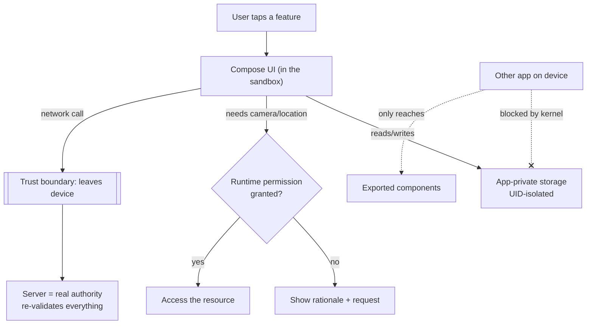

# Lesson 01 — The Android Security Model

> After this lesson you can explain the Android sandbox, how permissions and UIDs isolate apps, and how to write a one-page threat model for a Compose feature *before* you build it.

**Module:** 18 · **Lesson:** 01 · **Level:** 🟢🟡🔴 · **Est. time:** 60–75 min

---

## 1. Concept

### 🟢 For beginners — *what is it and why do I care?*

Every Android app runs **inside a sandbox** — a walled garden the operating system builds around it. Your app cannot read another app's files, peek at its memory, or call its private code. The OS enforces this for you, so a sketchy game can't quietly read your banking app's saved password.

The sandbox gives you two guarantees worth remembering:

- **Your app's private storage is yours alone.** Files you write to `context.filesDir` or `DataStore` are readable only by your app. No other app — and on a non-rooted device, not even the user with a file manager — can open them.
- **Anything outside the sandbox needs explicit permission.** Camera, location, contacts, the internet, other apps' content — all gated. The user (or the system) must grant access; you can't just take it.

So "security on Android" is not mostly about exotic cryptography. It starts with a simpler question: **what leaves the sandbox, and who is allowed to touch it?** A surprising amount of real-world security work is making sure secrets *stay* in the sandbox and that you ask for the *least* you need from outside it.

### 🟡 For intermediate devs — *the mechanism*

The sandbox is built on **Linux user isolation**. At install time, the system assigns your app a unique **UID** (user id). Every process and every file your app owns is stamped with that UID, and the Linux kernel refuses cross-UID access. That's the bedrock — kernel-enforced, not a library you can forget to call.

Layered on top:

- **Permissions** are how you punch controlled holes in the wall. **Install-time** permissions (e.g. `INTERNET`) are granted at install. **Runtime** permissions (camera, location, notifications on Android 13+) must be requested *and granted by the user at the moment of use*, and can be revoked. **Signature** permissions are granted only to apps signed with the same key — the basis of safe inter-app APIs.
- **App signing** ties your APK/AAB to a private key only you hold. Updates must be signed with the same key, so nobody can ship a malicious "update" to your users. Play App Signing manages the upload/distribution keys for you.
- **Scoped storage** means even shared media access is mediated through `MediaStore` and the photo picker, not raw filesystem paths. The era of "request `READ_EXTERNAL_STORAGE` and roam the SD card" is over.
- **Component export** controls reach *into* your app. An `Activity`, `Service`, `BroadcastReceiver`, or `ContentProvider` with `android:exported="true"` (and no permission guard) can be invoked by *any* app on the device. Export is now opt-in and must be declared explicitly.

The mental shift: the platform is **secure by default and closed by default**. You don't add security so much as you avoid *removing* it — by over-exporting components, over-requesting permissions, or moving data out of the sandbox.

### 🔴 For senior devs — *trade-offs, edges, internals*

The sandbox protects you from *other apps*. It does **not** protect you from these, and a real threat model names each one:

- **A rooted or compromised device.** Root breaks UID isolation entirely — your "private" files and even Keystore-wrapped material become reachable to a sufficiently privileged attacker. You cannot win against root from inside the app. You *can* raise the cost (hardware-backed keys, integrity attestation) and *detect* tamper, but treat on-device data as compromisable and keep the **server** as the real authority. Never trust the client.
- **The user themselves.** On a device they control, a motivated user can inspect traffic (a proxy + a user-installed CA), read logs, and decompile your APK. This is why **client-side checks are UX, not security**: a "premium unlocked" boolean in local storage is trivially flipped. Authoritative checks live server-side.
- **Other processes via your own surface area.** Exported components, `PendingIntent`s with mutable extras, implicit intents that leak data to whoever registers for them, and `WebView`s with `JavaScriptInterface` are the classic intra-device attack surface. Each is a door you opened.
- **Backups and the clipboard.** `android:allowBackup="true"` can copy app data off-device via adb/cloud unless you exclude sensitive files. The clipboard is readable system-wide; never auto-copy secrets.
- **Tapjacking / overlays.** A malicious overlay can trick a user into tapping your sensitive controls. `View.filterTouchesWhenObscured` (and Compose's equivalent handling) mitigates it for high-stakes actions.

Two principles tie it together. **Defense in depth:** no single control is trusted; storage encryption *and* TLS *and* server authority *and* minimal export all stack. **Least privilege:** every permission, every exported component, every byte that leaves the sandbox must justify itself, because each one widens the attack surface and the blast radius of a breach. Security is a *property of the whole system*, and Compose is just the part of it the user can see and touch.

### Analogy

The sandbox is an **apartment in a secure building**. The building's locks and key-cards (the Linux kernel / UID isolation) keep *other tenants* out of your unit — that's automatic and strong. **Permissions** are the amenities you sign up for: gym, parking, mail access. **Exporting a component** is leaving your own front door propped open — now anyone in the hallway can walk in, and that's on you, not the building. And none of it stops a **locksmith with a court order** (root) or *you* handing your keys to a stranger (a client-side check the user can flip). The building secures you from neighbors; it can't secure you from yourself or from someone who owns the building.

### Mental model

> **The platform is closed by default; security is mostly *not opening holes*.** Keep secrets in the sandbox, ask for the least you need, and treat anything the user's device can reach as ultimately compromisable — the server is the real authority.

### Real-world example

A banking app. Session tokens live in app-private, Keystore-backed storage (sandbox + encryption). The login screen requests *no* dangerous permissions. The "deep link to transfer money" activity is **not** exported, so a malicious app can't fire an intent straight into it. Traffic is pinned TLS. And critically: the server re-validates every transfer regardless of what the client claims — because the bank assumes some fraction of devices are rooted, proxied, or running a tampered build.

---

## 2. Visual Learning

**ASCII — the sandbox and its controlled holes:**
```text
        ┌──────────────────── Device (one Linux kernel) ────────────────────┐
        │                                                                    │
        │   ┌──────── App A (UID 10072) ────────┐   ┌──── App B (UID 10088)──┐
        │   │  private files  │  process memory │   │   private files …      │
        │   │  DataStore/Room │  Keystore alias │   │                        │
        │   └───────▲─────────┴────────┬────────┘   └────────────────────────┘
        │           │ kernel blocks    │ permissions / exported components    │
        │   ┌───────┴──────────────────▼───────────────────────────────┐     │
        │   │  OUTSIDE THE SANDBOX: internet, camera, location,         │     │
        │   │  contacts, other apps  →  each gated by a permission      │     │
        │   └───────────────────────────────────────────────────────────┘     │
        └────────────────────────────────────────────────────────────────────┘
   Cross-UID access  ✗ (kernel)   ·   Outside resources  ⚠ (needs permission)
```

**Mermaid — request-to-resource trust boundaries:**


**Illustration prompt (paste into an image generator):**
```text
Illustration: a cross-section of a sleek apartment building labeled "Android device".
Each apartment is a glowing glass box labeled with a UID (App A, App B), holding little
safes labeled "private files" and "Keystore". Solid steel walls between apartments are
stamped "kernel / UID isolation — no neighbor access". On the outside of the building hang
labeled amenity doors — "Camera", "Location", "Internet", "Contacts" — each with a keypad
labeled "permission". One apartment has its front door propped open with a sign "exported
component". A separate fortress across the street is labeled "Server = source of truth".
Modern, clean, isometric, soft gradients, clear labels.
```

---

## 3. Code

> This lesson is about *posture*, so the "code" is mostly the manifest, the build config, and a permission request — the places where you either keep the platform's defaults or weaken them. Crypto and storage get full lessons next; here we lock down the perimeter.

### 🟢 Beginner — request a runtime permission the modern way

```kotlin
@Composable
fun CameraButton(onImage: (Uri) -> Unit) {
    val context = LocalContext.current

    // Modern, lifecycle-safe permission request via Activity Result APIs.
    val launcher = rememberLauncherForActivityResult(
        contract = ActivityResultContracts.RequestPermission()
    ) { granted ->
        if (granted) {
            // proceed to open the camera
        } else {
            // degrade gracefully — never crash, never nag in a loop
        }
    }

    Button(onClick = {
        val already = ContextCompat.checkSelfPermission(
            context, Manifest.permission.CAMERA
        ) == PackageManager.PERMISSION_GRANTED

        if (already) { /* open camera */ } else launcher.launch(Manifest.permission.CAMERA)
    }) {
        Text("Take photo")
    }
}
```

**Explanation.** Runtime permissions are requested through the **Activity Result** contract, wrapped for Compose by `rememberLauncherForActivityResult`. You check first with `checkSelfPermission`; only request if you don't already have it. The result callback handles both outcomes — granted *and* denied — because a denied permission is a normal state, not an error.

**Common mistakes.**
```kotlin
// ❌ Assuming the permission is granted because it's in the manifest.
fun openCamera() {
    cameraController.bind()   // crashes with SecurityException on Android 6+ if not granted
}
```
Declaring `<uses-permission>` is necessary but **not** sufficient for dangerous permissions — the user must grant at runtime. Also wrong: re-launching the request in a tight loop after denial (a "permission nag" that gets your app reported).

**Best practices.**
- Request **at the moment of use**, with context, so the user understands why.
- Always handle denial by degrading the feature, never by crashing or looping.
- Request the *narrowest* permission (e.g. `ACCESS_COARSE_LOCATION` over `FINE` if coarse suffices).

---

### 🟡 Intermediate — lock down the manifest (least privilege)

```xml
<manifest xmlns:android="http://schemas.android.com/apk/res/android"
    xmlns:tools="http://schemas.android.com/tools">

    <!-- Ask for the minimum. Every permission widens the attack surface. -->
    <uses-permission android:name="android.permission.INTERNET" />

    <application
        android:allowBackup="false"        
        android:fullBackupContent="@xml/backup_rules"   
        android:dataExtractionRules="@xml/data_extraction_rules"
        tools:targetApi="31">

        <!-- This activity is internal: a deep link/intent must NOT reach it from outside. -->
        <activity
            android:name=".TransferActivity"
            android:exported="false" />

        <!-- An exported component MUST be permission-guarded or it's open to all apps. -->
        <activity
            android:name=".ShareReceiverActivity"
            android:exported="true"
            android:permission="com.example.permission.RECEIVE_SHARE">
            <intent-filter>
                <action android:name="android.intent.action.SEND" />
                <category android:name="android.intent.category.DEFAULT" />
                <data android:mimeType="text/plain" />
            </intent-filter>
        </activity>
    </application>
</manifest>
```

**Explanation.** This manifest *removes* default holes. `allowBackup="false"` (or scoped backup/data-extraction rules) stops sensitive app data from being copied off-device. Internal components declare `exported="false"`. The one component that *must* be reachable is guarded with a custom `signature`/`normal` permission, so only authorized callers can invoke it. Least privilege made concrete.

**Common mistakes.**
```xml
<!-- ❌ Exported and unguarded: ANY app can launch this and drive your internal flow. -->
<activity android:name=".TransferActivity" android:exported="true" />

<!-- ❌ allowBackup defaults to true; secrets get swept into adb/cloud backups. -->
<application android:allowBackup="true"> ...
```
A second classic: requesting broad permissions "just in case" (`READ_CONTACTS`, `ACCESS_FINE_LOCATION`) you don't use — each one is attack surface *and* a Play Store review liability.

**Best practices.**
- **Export nothing** unless an external app genuinely needs it; guard what you must export.
- Disable or scope backups for anything sensitive; never let secrets ride a backup off-device.
- Audit `uses-permission` every release; delete what you no longer use.

---

### 🔴 Production — a feature threat model as executable documentation

```kotlin
/**
 * THREAT MODEL — "In-app payment" feature.  Reviewed each release.  (STRIDE-lite)
 *
 *  ASSET            WHERE                 THREAT                         MITIGATION
 *  ──────────────── ───────────────────── ────────────────────────────── ───────────────────────────
 *  Auth token       app-private storage   Spoofing via stolen token      Keystore-backed encryption (L02),
 *                                          (lifted from device/backup)    short TTL + rotation, allowBackup=false
 *  Payment request  network in flight     Tampering / MITM               TLS + certificate pinning (L04)
 *  Card PAN         memory / logs         Information disclosure         Never log; clear from memory ASAP; no clipboard
 *  "Pay" action     TransferActivity      Elevation (other app fires it) exported=false + per-action biometric gate (L05)
 *  Amount/recipient client field         Repudiation / forged client    SERVER re-validates every transfer (never trust client)
 *  Overlay attack   the Pay button       Tapjacking                     filterTouchesWhenObscured on the confirm control
 */

// The model isn't just a comment — it drives code. Example: the high-stakes action is
// gated and tamper-aware, exactly as the table promises.
@Composable
fun PayButton(amount: Money, onConfirmed: () -> Unit, modifier: Modifier = Modifier) {
    Button(
        onClick = onConfirmed,                  // real auth happens behind this (biometric, L05)
        modifier = modifier
            // Block taps when another window is drawn over us (anti-tapjacking).
            .pointerInteropFilter { event -> (event.flags and MotionEvent.FLAG_WINDOW_IS_OBSCURED) != 0 }
            .semantics { contentDescription = "Confirm payment of ${amount.display}" }
    ) {
        Text("Pay ${amount.display}")
    }
}
```

**Explanation.** A threat model is the senior deliverable of this lesson. You enumerate **assets**, **where they live**, the **threat** to each (Spoofing, Tampering, Repudiation, Information disclosure, Denial of service, Elevation — **STRIDE**), and the **mitigation** that later lessons implement. It's living documentation: each row maps to real code (here, the tapjacking guard and the server-authority rule), and it gets re-reviewed every release. The point isn't the comment — it's that *you decided what you're defending and from whom before writing the feature.*

**Common mistakes.**
- **No model at all** — "we'll secure it later," so storage, transport, and authority decisions are made ad hoc and inconsistently.
- **Trusting the client.** Putting the authoritative amount/recipient check only on-device. A rooted user edits it; the server must re-validate.
- **Modeling crypto but ignoring the boring doors** — exported components, backups, logs, and clipboard leak more secrets in practice than weak ciphers do.

**Best practices.**
- Write a one-page threat model **before** building any feature that touches secrets, money, or PII.
- Use **STRIDE** as a checklist so you don't forget a category (repudiation and elevation are the usual blind spots).
- Make the server the source of truth; treat every client-side check as UX, re-validated server-side.
- Re-review the model when the feature changes — stale threat models are worse than none.

---

## 4. Interview Questions

**🟢 Beginner**

1. *What is the Android application sandbox?*
   > An OS-enforced isolation boundary: each app gets a unique Linux UID, and the kernel prevents one app from reading another's private files or memory. App-private storage is accessible only to that app; anything outside requires a permission.
2. *What's the difference between install-time and runtime permissions?*
   > Install-time permissions (e.g. `INTERNET`) are granted automatically when the app is installed. Runtime (dangerous) permissions — camera, location, notifications on Android 13+ — must be requested at the moment of use and explicitly granted by the user, and can be revoked later.

**🟡 Intermediate**

3. *Why is `android:exported` a security concern, and what's the safe default?*
   > An exported component can be invoked by any other app on the device. If it's exported and unguarded, a malicious app can drive your internal flows (e.g. fire an intent straight into a payment activity). Default to `exported="false"`; if a component must be reachable, guard it with a `signature` or custom permission.
4. *Why are client-side security checks (like a "premium unlocked" flag in local storage) considered UX rather than security?*
   > The user controls their device. Local storage can be edited (especially on root), the APK can be decompiled, and traffic can be proxied. Any check that lives only on the client can be bypassed. Authoritative checks must run on a server the user doesn't control.

**🔴 Senior**

5. *The sandbox protects you from other apps. Name three things it does NOT protect against, and how you'd mitigate each.*
   > (1) **Root / a compromised device** — breaks UID isolation; mitigate with hardware-backed Keystore, integrity/attestation, and by keeping the server authoritative (assume the client is compromisable). (2) **The user inspecting traffic/code** — mitigate with TLS + pinning for transport and server-side validation for logic, accepting that on-device logic is reverse-engineerable. (3) **Your own exposed surface** — exported components, mutable `PendingIntent`s, backups, logs, clipboard; mitigate with least-privilege export, immutable PendingIntents, scoped/disabled backups, and never logging secrets.
6. *Walk me through threat-modeling a "reset password" feature with STRIDE.*
   > Identify assets (reset token, user email, session). **S**poofing: someone requests a reset for another user — bind the token to the account and a short TTL. **T**ampering: the reset link is altered — sign/opaque the token, validate server-side. **R**epudiation: log reset events server-side for audit. **I**nformation disclosure: don't leak whether an email exists; never log the token. **D**enial of service: rate-limit reset requests. **E**levation: ensure the token can only reset *that* account and expires on use. Each mitigation is server-enforced because the client is untrusted.

---

## 5. AI Assistant

**Prompt example (generate a first-pass threat model):**
```text
Act as an Android security reviewer. For this feature spec, produce a STRIDE threat model
as a table: Asset | Location (memory / app-private storage / network / exported component) |
Threat (S/T/R/I/D/E) | Concrete mitigation on Android. Assume the device may be rooted and the
user may proxy traffic — so call out anything that must be enforced server-side, not on the client.
Feature: [paste spec]. Target: Kotlin 2.x, Compose 2026, Keystore + TLS available.
```

**AI workflow — where it helps on *this* topic.**
- ✅ Great for: enumerating threats you forgot (it rarely misses a STRIDE category), drafting least-privilege manifest entries, and explaining *why* a component should/shouldn't be exported.
- ⚠️ Not for: deciding your trust boundary or what your server must validate. Models love to "secure" things client-side (an encrypted flag, an obfuscated check) and call it done — that's exactly the trap. Treat AI output as a *checklist generator*, not the security architect.

**Review workflow — check AI output against this lesson's *Common Mistakes*:**
- Did it ever propose a **client-side-only** authority check? Reject it — push the check server-side.
- Did it leave a component **exported** without a permission guard, or request permissions the feature doesn't use?
- Did it remember the *boring* doors — `allowBackup`, logs, clipboard, mutable `PendingIntent` — not just ciphers?

**Validation workflow — prove the posture, don't assume it:**
1. **Audit the merged manifest:** `./gradlew :app:processReleaseManifest` then inspect — confirm every `exported="true"` is intentional and guarded, and `allowBackup` is set deliberately.
2. **Static analysis:** run Android Lint / the Play **pre-launch report**; it flags exported components, weak `PendingIntent` mutability, and permission issues.
3. **List runtime permissions on a device:** `adb shell dumpsys package <your.pkg> | findstr permission` and confirm only what you expect is granted.
4. **Attempt the attack:** from a scratch app, try to launch a component you believe is internal — it should fail with a `SecurityException`.

> **AI drafts, you decide.** AI is a fast threat *enumerator*; the trust boundary — what the server must own — is an architectural decision you make, then verify on a device.

---

## Recap / Key takeaways

- Android is **secure and closed by default**: a Linux **UID sandbox** isolates each app; the kernel blocks cross-app access to private storage and memory.
- Reaching **outside** the sandbox needs a **permission**; request the *least* you need, at the moment of use, and handle denial gracefully.
- **Don't open holes:** export nothing you don't have to (guard what you must), scope/disable backups, never log or clipboard secrets.
- The sandbox doesn't save you from **root, the user, or your own exposed surface** — so the **server is the real authority** and client-side checks are UX.
- Write a **STRIDE threat model before building**; it's living documentation that drives the storage, transport, and auth decisions in the lessons ahead.

➡️ Next: **[Lesson 02 — Secure storage](02-secure-storage.md)** — Keystore-backed encryption, encrypted DataStore, and what you must *never* put on the device.
