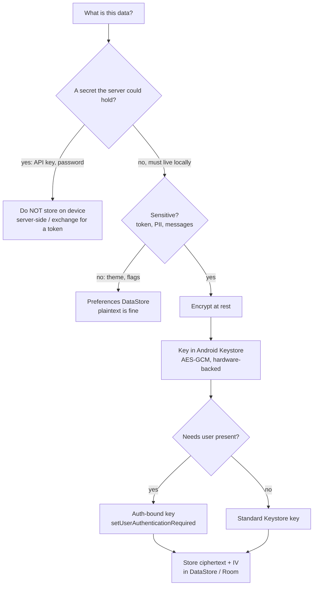

# Lesson 02 — Secure Storage

> After this lesson you can choose the right place for every piece of data, encrypt at rest with a **Keystore-backed key** that never leaves hardware, and explain what you must *never* store on the device at all.

**Module:** 18 · **Lesson:** 02 · **Level:** 🟢🟡🔴 · **Est. time:** 75–90 min

---

## 1. Concept

### 🟢 For beginners — *what is it and why do I care?*

Your app saves things: a logged-in user's token, their preferences, a cached profile. **Where** you save them, and **whether they're encrypted**, decides whether a lost or stolen phone leaks them.

The good news from Lesson 01: app-private storage (`DataStore`, `Room`, `filesDir`) is already isolated by the sandbox — other apps can't read it. The catch: on a **rooted** device, a backup, or with physical access and the right tools, "private" files can still be pulled. So for anything sensitive, you add a second lock: **encryption at rest**.

Here's the question that trips everyone up: *if you encrypt the data, where do you keep the key?* Writing the key next to the data is like locking your front door and taping the key to it. Android solves this with the **Android Keystore** — a special vault, often backed by dedicated hardware, that holds your key and **never gives it to your app**. You hand data *to* the key to encrypt or decrypt; the raw key bytes never touch your code. Lose the data and an attacker still can't decrypt it without the device's hardware.

### 🟡 For intermediate devs — *the mechanism*

Three storage tools, by job:

- **Preferences DataStore** — typed key/value (replaces `SharedPreferences`). Async, transactional, Flow-based. For settings and small flags.
- **Proto DataStore** — typed, schema'd objects. For structured app state.
- **Room** — a SQLite database for entities, queries, relations. For your real data model.

None of these encrypt by default. To encrypt **at rest**, you generate a key in the **Android Keystore** and use it with a cipher:

```kotlin
val key: SecretKey = keyStore.getKey("my_key", null) as SecretKey   // handle, not bytes
val cipher = Cipher.getInstance("AES/GCM/NoPadding")
cipher.init(Cipher.ENCRYPT_MODE, key)                                // AES-GCM = encrypt + authenticate
```

The Keystore key is created with `KeyGenParameterSpec` declaring **what it may do** (encrypt/decrypt), **with which algorithm** (AES-GCM), and **under what conditions** (e.g. only when the user has authenticated). You then encrypt your bytes and store the **ciphertext + the GCM IV** in DataStore/Room/a file. To read, you fetch the key handle again and decrypt. The key object you hold is a *reference* into the Keystore — the actual key material lives in the vault.

> ⚠️ **2026 note on Jetpack Security.** The old one-liners `EncryptedSharedPreferences` and `EncryptedFile` (from `androidx.security:security-crypto`) are **deprecated** and effectively unmaintained. Don't reach for them in new code. The current guidance is to use **DataStore/Room for storage** and the **Android Keystore + a Tink/`Cipher` AES-GCM layer** for encryption — which is what this lesson teaches. If you see `EncryptedSharedPreferences` in a tutorial, treat it as legacy.

### 🔴 For senior devs — *trade-offs, edges, internals*

The decisions that matter:

- **Hardware-backed vs software keys.** On modern devices the Keystore is backed by a **TEE** (Trusted Execution Environment) or **StrongBox** (a dedicated secure chip). Keys generated there are **non-exportable** — even a root exploit can't dump the raw key, only *use* it while the app runs. You can request StrongBox with `setIsStrongBoxBacked(true)` and check `KeyInfo.isInsideSecureHardware` to know what you actually got. This is the single biggest lever for at-rest security, and it's free.
- **Auth-bound keys.** `setUserAuthenticationRequired(true)` makes a key usable *only* after the user authenticates (biometric/PIN) within a validity window, or — better — per-use via a `BiometricPrompt` `CryptoObject` (Lesson 05). Now even an unlocked, rooted device can't decrypt without a live user. The trade-off: you must handle `KeyPermanentlyInvalidatedException` when the user changes their lock screen or adds a fingerprint, which **invalidates** the key by design.
- **AES-GCM discipline.** GCM gives confidentiality **and** integrity (tamper detection), which is why it's the default over `AES/CBC`. But GCM is catastrophically broken if you **reuse an IV** with the same key. Always let the cipher generate a fresh random IV per encryption and store it alongside the ciphertext; never hardcode or reuse one.
- **What encryption does *not* solve.** Encryption at rest protects data when the app/device is *off* or the file is *exfiltrated*. It does nothing against a running, instrumented app (Frida) or a malicious build — those see plaintext after decryption. And it can't protect a secret you should never have stored: see below.
- **The real rule — don't store what you don't need.** The most secure secret is the one that isn't on the device. **API keys / signing secrets** belong on a server, not in the app (anyone can decompile your APK and read `BuildConfig`). **Passwords** are never stored — you store a session token and let the server hold a salted hash. **Long-lived secrets** should be short-lived, server-issued, and revocable. Encryption is the *last* resort for the data that genuinely must live locally, not a license to hoard secrets.

### Analogy

Storing the key with the data is **locking a diary and taping the key to the cover**. The Keystore is a **bank's safe-deposit vault with a one-way slot**: you slide documents *into* the vault to be stamped (encrypted) or read back (decrypted), but the bank never hands you the master key — it stays bolted inside. A **hardware-backed** key is that vault built into a blast-proof chip; an **auth-bound** key is a vault that only opens while *your* fingerprint is on the scanner. And an **API key in your APK** is your house key left under the doormat with a neon sign — encryption can't fix a secret that simply shouldn't be there.

### Mental model

> **Encrypt at rest with a key the OS holds for you and never reveals; store the ciphertext, not the key. And don't store a secret at all if a server can hold it instead.**

### Real-world example

A messaging app caches recent messages in Room for offline reading. The database is encrypted with a **hardware-backed, auth-bound** AES-GCM key from the Keystore, so a stolen phone leaks nothing without the owner's biometric. The user's *password* is never stored — login exchanges it for a short-lived token kept in Keystore-encrypted DataStore. The server's API credentials are nowhere in the app; the app talks to the server, and the server holds those secrets.

---

## 2. Visual Learning

**ASCII — encrypt-at-rest data flow (key stays in the vault):**
```text
   plaintext ──┐                        ┌── ciphertext + IV ──▶ DataStore / Room / file
               ▼                        │
        ┌────────────────┐  uses key   ┌┴──────────────┐
        │ Cipher (AES-GCM)│ ◀────────── │ Keystore key  │   key material NEVER leaves
        └────────────────┘  by handle   │ (TEE/StrongBox)│   ── stays inside secure HW
               ▲                        └───────────────┘
   read back ──┘  (fetch handle again → decrypt)         app only holds a *reference*
```

**Mermaid — choosing where data lives:**


**Illustration prompt (paste into an image generator):**
```text
Illustration: a high-security bank vault embedded in a glowing computer chip, labeled
"Android Keystore (hardware-backed)". A one-way mail slot on the vault is labeled
"encrypt / decrypt". A robot arm slides a document labeled "plaintext token" into the slot;
out the other side comes a shredded-looking scrambled document labeled "ciphertext + IV"
that gets filed into a cabinet labeled "DataStore / Room". The vault's master key is bolted
inside, glowing red, with a label "never leaves the chip". Off to the side, a trash can labeled
"API keys & passwords — don't store here" with an arrow pointing to a distant server tower.
Modern, isometric, clean, soft gradients, clear labels.
```

---

## 3. Code

### 🟢 Beginner — Preferences DataStore for *non-secret* settings

```kotlin
// Non-sensitive prefs don't need encryption — DataStore (sandboxed) is enough.
private val Context.settings: DataStore<Preferences> by preferencesDataStore(name = "settings")

object Keys { val DARK_THEME = booleanPreferencesKey("dark_theme") }

class SettingsRepository(private val context: Context) {
    val darkTheme: Flow<Boolean> =
        context.settings.data.map { it[Keys.DARK_THEME] ?: false }

    suspend fun setDarkTheme(enabled: Boolean) {
        context.settings.edit { it[Keys.DARK_THEME] = enabled }
    }
}
```

**Explanation.** Theme choice isn't a secret, so plaintext DataStore is correct — it's async, transactional, and Flow-based (no `commit()` on the main thread like the old `SharedPreferences`). The first rule of secure storage is *not over-encrypting*: spending Keystore cycles on a boolean theme flag adds complexity for zero security benefit.

**Common mistakes.**
```kotlin
// ❌ Putting a real secret in plain DataStore "because it's app-private".
suspend fun saveToken(t: String) = context.settings.edit { it[stringPreferencesKey("token")] = t }
// Private to the app, yes — but readable on root / via backup. A token is sensitive → encrypt it.
```
Also wrong: still using `SharedPreferences` with `apply()`/`commit()` in new code, or blocking the main thread to read prefs.

**Best practices.**
- Use DataStore (not `SharedPreferences`) for new code.
- Encrypt *only* what's sensitive; leave genuinely public prefs in plaintext.
- Expose data as a `Flow`; never read storage on the main thread synchronously.

---

### 🟡 Intermediate — a Keystore AES-GCM helper

```kotlin
object CryptoBox {
    private const val KEY_ALIAS = "secure_storage_key"
    private const val TRANSFORM = "AES/GCM/NoPadding"
    private const val GCM_TAG_BITS = 128

    private val keyStore = KeyStore.getInstance("AndroidKeyStore").apply { load(null) }

    private fun getOrCreateKey(): SecretKey {
        (keyStore.getEntry(KEY_ALIAS, null) as? KeyStore.SecretKeyEntry)?.let { return it.secretKey }

        val spec = KeyGenParameterSpec.Builder(
            KEY_ALIAS,
            KeyProperties.PURPOSE_ENCRYPT or KeyProperties.PURPOSE_DECRYPT
        )
            .setBlockModes(KeyProperties.BLOCK_MODE_GCM)
            .setEncryptionPaddings(KeyProperties.ENCRYPTION_PADDING_NONE)
            .setKeySize(256)
            .build()

        return KeyGenerator.getInstance(KeyProperties.KEY_ALGORITHM_AES, "AndroidKeyStore")
            .apply { init(spec) }
            .generateKey()
    }

    /** Returns IV ‖ ciphertext, ready to persist as one blob. */
    fun encrypt(plain: ByteArray): ByteArray {
        val cipher = Cipher.getInstance(TRANSFORM).apply { init(Cipher.ENCRYPT_MODE, getOrCreateKey()) }
        val iv = cipher.iv                                  // fresh random IV per call — never reused
        return iv + cipher.doFinal(plain)
    }

    fun decrypt(blob: ByteArray): ByteArray {
        val iv = blob.copyOfRange(0, 12)                    // GCM IV is 12 bytes
        val ct = blob.copyOfRange(12, blob.size)
        val cipher = Cipher.getInstance(TRANSFORM).apply {
            init(Cipher.DECRYPT_MODE, getOrCreateKey(), GCMParameterSpec(GCM_TAG_BITS, iv))
        }
        return cipher.doFinal(ct)                           // throws AEADBadTagException if tampered
    }
}
```

**Explanation.** The key is generated *inside* `AndroidKeyStore` and fetched by alias — `CryptoBox` never sees the raw bytes. AES-GCM authenticates the data, so any tampering throws on decrypt. The **IV is generated fresh by the cipher every encryption** and prepended to the ciphertext, so encrypt/decrypt round-trips without you ever reusing an IV. Store the returned blob in DataStore or Room.

**Common mistakes.**
```kotlin
// ❌ Hardcoding/reusing an IV — fatal for GCM (breaks confidentiality entirely).
val iv = ByteArray(12)                       // all zeros, reused every time
cipher.init(Cipher.ENCRYPT_MODE, key, GCMParameterSpec(128, iv))

// ❌ Embedding a "secret key" as a constant in the app instead of using the Keystore.
val key = "S3cr3tKey1234567".toByteArray()   // shipped in your APK; trivially extracted
```
Other traps: `AES/CBC` without a MAC (no tamper detection), or storing the IV *separately* and losing it.

**Best practices.**
- Generate keys **in the Keystore**; never hold or hardcode raw key material.
- Use **AES-GCM**; let the cipher produce a **fresh IV** per encryption and persist it with the ciphertext.
- Let GCM's auth tag fail loudly on tamper — don't catch-and-ignore `AEADBadTagException`.

---

### 🔴 Production — encrypted, hardware-backed, auth-bound token store

```kotlin
private val Context.secureStore: DataStore<Preferences> by preferencesDataStore("secure")
private val BLOB = stringPreferencesKey("token_blob")     // Base64 of IV‖ciphertext

class TokenStore(private val context: Context) {

    // Strong, hardware-backed, user-auth-bound key. Falls back gracefully if StrongBox absent.
    private fun secretKey(): SecretKey {
        val ks = KeyStore.getInstance("AndroidKeyStore").apply { load(null) }
        (ks.getEntry(ALIAS, null) as? KeyStore.SecretKeyEntry)?.let { return it.secretKey }

        fun spec(strongBox: Boolean) = KeyGenParameterSpec.Builder(
            ALIAS, KeyProperties.PURPOSE_ENCRYPT or KeyProperties.PURPOSE_DECRYPT
        )
            .setBlockModes(KeyProperties.BLOCK_MODE_GCM)
            .setEncryptionPaddings(KeyProperties.ENCRYPTION_PADDING_NONE)
            .setKeySize(256)
            .setUserAuthenticationRequired(true)                 // usable only after auth (L05)
            .setUserAuthenticationParameters(15, KeyProperties.AUTH_BIOMETRIC_STRONG)
            .setInvalidatedByBiometricEnrollment(true)           // new fingerprint ⇒ key dies (safer)
            .setIsStrongBoxBacked(strongBox)
            .build()

        val gen = KeyGenerator.getInstance(KeyProperties.KEY_ALGORITHM_AES, "AndroidKeyStore")
        return try {
            gen.init(spec(strongBox = true)); gen.generateKey()  // prefer the secure chip
        } catch (e: StrongBoxUnavailableException) {
            gen.init(spec(strongBox = false)); gen.generateKey() // graceful fallback to TEE
        }
    }

    suspend fun save(token: String) {
        val cipher = Cipher.getInstance("AES/GCM/NoPadding").apply { init(Cipher.ENCRYPT_MODE, secretKey()) }
        val blob = cipher.iv + cipher.doFinal(token.toByteArray())
        context.secureStore.edit { it[BLOB] = Base64.encodeToString(blob, Base64.NO_WRAP) }
    }

    /** @return token, or null if absent. Throws [KeyPermanentlyInvalidatedException] if the key died. */
    suspend fun load(): String? {
        val b64 = context.secureStore.data.map { it[BLOB] }.first() ?: return null
        val blob = Base64.decode(b64, Base64.NO_WRAP)
        val cipher = Cipher.getInstance("AES/GCM/NoPadding").apply {
            init(Cipher.DECRYPT_MODE, secretKey(), GCMParameterSpec(128, blob.copyOfRange(0, 12)))
        }
        return String(cipher.doFinal(blob.copyOfRange(12, blob.size)))
    }

    suspend fun clear() = context.secureStore.edit { it.remove(BLOB) }   // call on logout

    private companion object { const val ALIAS = "token_aes_key" }
}
```

**Explanation.** This is the merge-worthy version. The key is **256-bit AES-GCM**, **hardware-backed** (StrongBox with a graceful TEE fallback), and **auth-bound** so it's unusable without a recent biometric — meaning a stolen, rooted phone can't decrypt the token. `setInvalidatedByBiometricEnrollment(true)` means adding a new fingerprint **destroys** the key (an attacker can't enroll their own finger to gain access); you handle the resulting `KeyPermanentlyInvalidatedException` by forcing re-login. Only the **ciphertext** is persisted; the key never leaves hardware.

**Common mistakes.**
- **Not handling key invalidation.** Changing the lock screen or enrolling a biometric throws `KeyPermanentlyInvalidatedException` on next use — catch it and re-authenticate, or the app hard-crashes after a routine security change.
- **No StrongBox fallback.** `setIsStrongBoxBacked(true)` throws `StrongBoxUnavailableException` on devices without the chip; wrap it.
- **Forgetting to `clear()` on logout** — the encrypted token lingers and the next user/account inherits it.
- **Storing more than you must.** Even encrypted, a long-lived token is a liability; prefer short TTLs and server rotation.

**Best practices.**
- Prefer **hardware-backed** keys (`isInsideSecureHardware`) and **auth-bind** anything high-value.
- Treat `KeyPermanentlyInvalidatedException` as a normal flow → wipe + re-login.
- Persist ciphertext only; **clear on logout**; keep tokens short-lived and revocable server-side.
- Re-confirm you actually *need* local storage — a server-held, on-demand-fetched secret beats any local vault.

---

## 4. Interview Questions

**🟢 Beginner**

1. *Is app-private storage (DataStore/Room) encrypted by default?*
   > No. It's *isolated* by the sandbox (other apps can't read it), but the bytes on disk are plaintext. On a rooted device or via a backup they can be extracted, so sensitive data needs explicit encryption at rest.
2. *What is the Android Keystore, in one sentence?*
   > A system-managed (often hardware-backed) vault that creates and holds cryptographic keys and performs encrypt/decrypt on your behalf — without ever exposing the raw key material to your app.

**🟡 Intermediate**

3. *Why store the IV next to the ciphertext, and why must you never reuse a GCM IV?*
   > Decryption needs the exact IV used to encrypt, so it's stored alongside (it's not secret). Reusing an IV with the same key in GCM breaks confidentiality catastrophically — it can leak plaintext relationships and the authentication key — so you generate a fresh random IV per encryption.
4. *Why is `EncryptedSharedPreferences` not the recommended answer in 2026?*
   > The `androidx.security:security-crypto` library (which provides `EncryptedSharedPreferences`/`EncryptedFile`) is deprecated and effectively unmaintained. Current guidance is DataStore/Room for storage plus a Keystore-backed AES-GCM (Tink/`Cipher`) layer for encryption.

**🔴 Senior**

5. *What does a hardware-backed, auth-bound Keystore key protect against that a software key does not?*
   > A hardware-backed (TEE/StrongBox) key is **non-exportable** — even root can't dump the raw key, only invoke it while the app runs. Adding `setUserAuthenticationRequired(true)` makes it usable *only* after a recent user authentication, so an unlocked-but-stolen or rooted device still can't decrypt without a live biometric/PIN. The cost is handling key invalidation on lock-screen/biometric changes.
6. *A teammate wants to ship a third-party API key in the app, encrypted with a Keystore key. What's your response?*
   > Encryption doesn't help: the app must decrypt the key to use it, so a running/instrumented app or a decompiled APK exposes it regardless. API/signing secrets belong on a server; the app should call your backend, which holds the secret. The only secrets worth encrypting locally are ones that *must* live on the device (e.g. a session token), and even those should be short-lived and revocable.

---

## 5. AI Assistant

**Prompt example (generate a Keystore helper):**
```text
Write a Kotlin object that encrypts/decrypts ByteArrays using an Android Keystore AES-256-GCM key.
Requirements: generate the key inside AndroidKeyStore (alias-based, never expose raw bytes);
fresh random IV per encryption, returned as IV‖ciphertext; prefer StrongBox with a graceful
fallback to TEE; make it auth-bound (setUserAuthenticationRequired) and handle
KeyPermanentlyInvalidatedException. Do NOT use EncryptedSharedPreferences (deprecated).
Target: Kotlin 2.x, Android 14+ (minSdk 26+).
```

**AI workflow — where it helps on *this* topic.**
- ✅ Great for: the boilerplate `KeyGenParameterSpec`/`Cipher` plumbing, Base64 framing, and DataStore wiring.
- ⚠️ Not for: deciding *what* to store. Models will cheerfully encrypt-and-store an API key, hardcode an IV, or suggest the deprecated `EncryptedSharedPreferences` because it's all over their training data. Crypto is the area where blind trust burns you — verify every line.

**Review workflow — check AI output against this lesson's *Common Mistakes*:**
- Is the **IV fresh and random per encryption** (not hardcoded/zeroed/reused), and stored with the ciphertext?
- Did it use the **Keystore** for the key — or smuggle in a hardcoded key / the deprecated `EncryptedSharedPreferences`?
- Is it **AES-GCM** (authenticated) rather than bare `AES/CBC`? Does it leave `AEADBadTagException` to fail loudly?
- Does it **handle key invalidation** and a **StrongBox fallback**?
- Did it try to store a secret (API key/password) that shouldn't be on the device at all?

**Validation workflow — prove it actually works:**
1. **Round-trip test:** `decrypt(encrypt(x)) == x` for empty, ASCII, and unicode inputs.
2. **Tamper test:** flip one byte of the ciphertext → decrypt must throw `AEADBadTagException`, not return garbage.
3. **IV-uniqueness test:** encrypt the same plaintext twice → ciphertexts differ (proves fresh IVs).
4. **Hardware check:** assert `KeyInfo.isInsideSecureHardware` on a real device; log StrongBox vs TEE.
5. **Invalidation drill:** on a test device, change the lock screen / enroll a biometric, then read → confirm you catch `KeyPermanentlyInvalidatedException` and recover by re-login, not crash.

> **AI drafts, you decide.** Crypto code that compiles can still be silently insecure (reused IV, plaintext key). Run the tamper and IV-uniqueness tests — those catch what a code read misses.

---

## Recap / Key takeaways

- App-private storage is **isolated, not encrypted**; add **encryption at rest** for anything sensitive.
- Keep keys in the **Android Keystore** (prefer **hardware-backed**); the raw key never reaches your code — you store **ciphertext + IV**, not the key.
- Use **AES-GCM** (confidentiality + tamper detection); **never reuse an IV**; let the auth tag fail loudly.
- **Auth-bind** high-value keys; handle `KeyPermanentlyInvalidatedException` as a normal re-login flow.
- The old **`EncryptedSharedPreferences`/`EncryptedFile`** are **deprecated** — use DataStore/Room + Keystore instead.
- The most secure secret is the one you **don't store**: keep API keys and passwords off the device; store short-lived, revocable tokens only when you truly must.

➡️ Next: **[Lesson 03 — Encryption](03-encryption.md)** — symmetric vs asymmetric, hashing vs encryption, and the key-management decisions behind the helper you just wrote.
