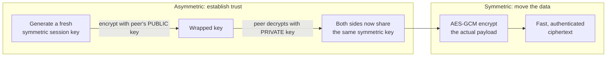

# Lesson 03 — Encryption

> After this lesson you can tell symmetric from asymmetric encryption, hashing from encryption, pick the right primitive for a job, and explain why **key management** — not the algorithm — is where security is won or lost.

**Module:** 18 · **Lesson:** 03 · **Level:** 🟢🟡🔴 · **Est. time:** 75–90 min

---

## 1. Concept

### 🟢 For beginners — *what is it and why do I care?*

Three words get muddled constantly. Pin them down once:

- **Encryption** scrambles data so only someone with the **key** can unscramble it. It's **two-way**: encrypt → ciphertext → decrypt → original. Use it for data you need to *read back* (a stored token, a message).
- **Hashing** turns data into a fixed-size fingerprint. It's **one-way** — you can't get the original back. Use it to *check* something without storing it (verify a password, detect a changed file).
- **Encoding** (Base64, hex) is **not security at all** — it just reshapes bytes into text. Anyone can decode it. It's a transport format, not a lock.

The most common beginner mistake is using the wrong one: Base64-ing a password and calling it "encrypted," or *encrypting* a password (so it can be decrypted) when you should **hash** it. Match the tool to the job: need it back → encrypt; only need to verify → hash; need it to survive text transport → encode (on top of encryption, never instead of it).

### 🟡 For intermediate devs — *the mechanism*

Encryption splits into two families:

- **Symmetric** — **one** shared key encrypts *and* decrypts. Fast, used for bulk data. The standard is **AES**, almost always in **GCM** mode (authenticated: confidentiality *and* tamper detection). This is what Lesson 02's `CryptoBox` used. The hard part is getting that one key to both sides safely.
- **Asymmetric** (public-key) — a **key pair**: a **public** key anyone can hold, and a **private** key only you hold. Encrypt with the public key → only the private key decrypts (confidentiality). Sign with the private key → anyone with the public key verifies it's really you (authenticity). **RSA** and the **elliptic-curve** families (**ECDH** for key agreement, **ECDSA**/**Ed25519** for signatures) are the workhorses. Slower, so it's used for small things: exchanging a symmetric key, or signing.

In practice they **combine**. TLS (Lesson 04) uses asymmetric crypto to *agree on* a fresh symmetric key, then uses fast symmetric AES for the actual conversation. That hybrid — asymmetric to bootstrap trust, symmetric to move data — is the pattern behind almost all real systems.

For passwords specifically, plain hashing (`SHA-256`) is **not** enough: it's too fast, so attackers brute-force it. You use a **slow, salted password hash** — **Argon2** (preferred), **scrypt**, or **bcrypt** — designed to be expensive per guess. And that lives on the **server**, not the app.

### 🔴 For senior devs — *trade-offs, edges, internals*

Where engineers actually go wrong is almost never the cipher — it's everything around it:

- **Key management is the whole game.** A perfect AES-256 cipher with a hardcoded or reused key is worthless. The questions that matter: *where is the key generated* (in the Keystore, ideally hardware-backed — Lesson 02), *how is it rotated*, *what's its lifetime*, *who can use it*, and *how is it destroyed*. Algorithm choice is a footnote; key lifecycle is the system.
- **Authenticated encryption is non-negotiable.** Unauthenticated modes (`AES/CBC`, `AES/ECB`) let an attacker tamper with ciphertext undetected, and CBC enables **padding-oracle** attacks. Always use an **AEAD** mode (AES-GCM, or ChaCha20-Poly1305). `ECB` additionally leaks structure (identical blocks → identical ciphertext) — never use it.
- **Nonces/IVs and randomness.** GCM dies on **IV reuse**; you need a unique IV per encryption under a key. And all of this rests on a strong CSPRNG — use `SecureRandom` (or let the cipher/Tink generate the IV), never `java.util.Random`.
- **Don't roll your own.** Hand-assembling crypto (custom protocols, your own MAC-then-encrypt order, bespoke key derivation) is how subtle, catastrophic bugs ship. Use vetted libraries: **Tink** (Google's misuse-resistant high-level API) or the JCA `Cipher` with conservative choices. Tink exists precisely so you *can't* pick a bad mode or reuse a nonce by accident.
- **Hashing nuances.** Use `SHA-256`+ for integrity/fingerprints (never `MD5`/`SHA-1` — both broken). For passwords use a **memory-hard KDF** (Argon2id) with a per-user salt and tuned cost; for deriving an encryption key *from* a password use a KDF too (PBKDF2/Argon2), never the raw password. And compare secrets (tokens, MACs) with a **constant-time** comparison to avoid timing leaks.
- **Encryption's blind spot.** It protects data *at rest* and *in transit*. It does nothing once the app decrypts to plaintext in memory on a compromised device, and it can't make a should-never-be-stored secret safe (Lesson 02). Crypto is a tool inside a system, not a force field around it.

### Analogy

**Symmetric** encryption is a **padlock with one key that both locks and unlocks** — fast and simple, but you and your friend both need a copy, and handing over that copy safely is the tricky part. **Asymmetric** is a **mailbox with a public slot and a private key**: anyone can drop a letter in (encrypt with your public key), but only you can open the box (your private key). **Hashing** is a **paper shredder**: feed in a document and you get confetti that uniquely identifies it, but no one can reassemble the original — perfect for proving "this is the same document" without keeping it. **Encoding** is just **translating the document into Morse code** — a different shape, zero secrecy.

### Mental model

> **Need it back → encrypt (AES-GCM, key in the Keystore). Only need to check it → hash (slow + salted for passwords). The algorithm is easy; the key's lifecycle is the security.**

### Real-world example

A note-taking app with end-to-end sync. Each note is encrypted on-device with a **symmetric** AES-GCM key (fast, bulk). That note key is wrapped with the user's **asymmetric** public key, so it syncs to the server as ciphertext the server can't read; only the user's private key (Keystore-held) unwraps it on their other devices. Login uses an **Argon2** password hash *on the server* — the app never stores or hashes the password itself. One app, all three tools, each for its proper job.

---

## 2. Visual Learning

**ASCII — symmetric vs asymmetric vs hashing:**
```text
 SYMMETRIC (AES-GCM)          ASYMMETRIC (RSA/EC)                HASHING (SHA-256 / Argon2)
 ─────────────────────        ───────────────────────────       ───────────────────────────
 data ─[ KEY ]─▶ cipher       data ─[ PUBLIC key ]─▶ cipher      data ──▶ ▓▓ fixed-size digest
 cipher ─[ KEY ]─▶ data       cipher ─[ PRIVATE key ]─▶ data     (one-way: cannot reverse)
   one shared key                key PAIR (pub shares freely)      use to VERIFY, not recover
   fast · bulk data             slow · key exchange + signing      passwords → slow + salted
```

**Mermaid — the hybrid pattern everyone actually uses:**


**Illustration prompt (paste into an image generator):**
```text
Illustration: a three-panel comparison, clean and modern, soft gradients, clear labels.
Panel 1 "Symmetric": a single golden key locking and unlocking the same padlock on a fast-moving
conveyor of data crates. Panel 2 "Asymmetric": a mailbox with a wide public slot (many hands
dropping letters) and a single private key held by one person opening the back. Panel 3 "Hashing":
a paper shredder turning a labeled document into a unique pile of confetti with a one-way arrow and
a "no reverse" symbol. Below, a thin banner reading "The algorithm is easy — key management is the
security," with a small vault icon labeled "Keystore".
```

---

## 3. Code

> Lesson 02 already showed AES-GCM with a Keystore key. Here we round out the *family*: a wrong-tool example, asymmetric wrap/unwrap, and the misuse-resistant high-level path (Tink).

### 🟢 Beginner — encryption vs hashing vs encoding (pick the right tool)

```kotlin
// HASH — one-way fingerprint. Good for integrity checks (NOT for passwords; see below).
fun sha256(bytes: ByteArray): ByteArray =
    MessageDigest.getInstance("SHA-256").digest(bytes)

// ENCODE — reversible, NOT secret. Just turns bytes into safe text.
fun toBase64(bytes: ByteArray): String = Base64.encodeToString(bytes, Base64.NO_WRAP)

// ENCRYPT — two-way, needs a key (use the Keystore helper from Lesson 02).
val cipherBlob: ByteArray = CryptoBox.encrypt("secret".toByteArray())
```

**Explanation.** Three tools, three jobs. Hashing verifies without storing the original. Base64 makes bytes transport-safe — it is *not* protection. Encryption is the only one that's secret *and* reversible. Knowing which to reach for is half of getting security right.

**Common mistakes.**
```kotlin
// ❌ "Encrypting" with Base64 — anyone can decode it instantly.
fun encrypt(s: String) = Base64.encodeToString(s.toByteArray(), Base64.DEFAULT) // NOT encryption

// ❌ Storing a password by encrypting it (so it can be decrypted) — should be HASHED, server-side.
val stored = CryptoBox.encrypt(password.toByteArray())   // reversible = wrong threat model
```

**Best practices.**
- **Need it back → encrypt. Only verify → hash. Transport-safe text → encode** (on top of encryption).
- Never call Base64 "encryption."
- Don't encrypt passwords — hash them (slow + salted), on the server.

---

### 🟡 Intermediate — asymmetric wrap of a symmetric key

```kotlin
// Generate an RSA key PAIR in the Keystore (private key never leaves hardware).
fun ensureWrapKey(): KeyPair {
    val ks = KeyStore.getInstance("AndroidKeyStore").apply { load(null) }
    (ks.getEntry("wrap_key", null) as? KeyStore.PrivateKeyEntry)?.let {
        return KeyPair(it.certificate.publicKey, it.privateKey)
    }
    val spec = KeyGenParameterSpec.Builder("wrap_key",
        KeyProperties.PURPOSE_ENCRYPT or KeyProperties.PURPOSE_DECRYPT)
        .setDigests(KeyProperties.DIGEST_SHA256)
        .setEncryptionPaddings(KeyProperties.ENCRYPTION_PADDING_RSA_OAEP)   // OAEP, never PKCS1v1.5
        .build()
    val gen = KeyPairGenerator.getInstance(KeyProperties.KEY_ALGORITHM_RSA, "AndroidKeyStore")
    gen.initialize(spec)
    return gen.generateKeyPair()
}

private const val RSA = "RSA/ECB/OAEPWithSHA-256AndMGF1Padding"

// Encrypt a small symmetric key with the PUBLIC key → safe to sync to a server.
fun wrap(symmetricKey: ByteArray, pub: PublicKey): ByteArray =
    Cipher.getInstance(RSA).apply { init(Cipher.ENCRYPT_MODE, pub) }.doFinal(symmetricKey)

// Only the PRIVATE key (Keystore-held) can unwrap it.
fun unwrap(wrapped: ByteArray, priv: PrivateKey): ByteArray =
    Cipher.getInstance(RSA).apply { init(Cipher.DECRYPT_MODE, priv) }.doFinal(wrapped)
```

**Explanation.** This is the hybrid pattern in code: asymmetric RSA-OAEP wraps a *small* symmetric key so it can travel (e.g. to a server or another device) as ciphertext only the private key can open. You never RSA-encrypt bulk data — it's slow and size-limited — you encrypt a key, then use that key with fast AES-GCM for the payload.

**Common mistakes.**
```kotlin
// ❌ RSA with PKCS#1 v1.5 padding — vulnerable (Bleichenbacher). Use OAEP.
Cipher.getInstance("RSA/ECB/PKCS1Padding")

// ❌ Trying to RSA-encrypt a whole file — fails (too big) or is absurdly slow. Wrap a key instead.
Cipher.getInstance(RSA).doFinal(largeFileBytes)
```

**Best practices.**
- Use **RSA-OAEP** (or EC for key agreement), never PKCS#1 v1.5 for new encryption.
- Asymmetric crypto **wraps keys / signs**; symmetric crypto moves bulk data.
- Keep the **private key in the Keystore**; share only the public key.

---

### 🔴 Production — misuse-resistant encryption with Tink (recommended high-level path)

```kotlin
// build.gradle.kts:  implementation("com.google.crypto.tink:tink-android:<latest>")

class TinkBox(context: Context) {
    // AEAD whose key is itself encrypted by a Keystore master key. Tink picks safe modes,
    // manages IVs/nonces, and supports key ROTATION via keysets — no footguns to fire.
    private val aead: Aead = AndroidKeysetManager.Builder()
        .withSharedPref(context, "tink_keyset", "tink_prefs")
        .withKeyTemplate(KeyTemplates.get("AES256_GCM"))
        .withMasterKeyUri("android-keystore://tink_master_key")   // wraps the keyset in Keystore
        .build()
        .keysetHandle
        .getPrimitive(Aead::class.java)

    // `associatedData` binds ciphertext to a context (e.g. user id) — authenticated, not encrypted.
    fun encrypt(plain: ByteArray, associatedData: ByteArray = ByteArray(0)): ByteArray =
        aead.encrypt(plain, associatedData)

    fun decrypt(blob: ByteArray, associatedData: ByteArray = ByteArray(0)): ByteArray =
        aead.decrypt(blob, associatedData)   // throws GeneralSecurityException on tamper / wrong AAD
}
```

**Explanation.** For production, prefer **Tink** over hand-rolled `Cipher` calls. It gives you AES-GCM with **no way to reuse a nonce or pick `ECB` by accident**, supports **key rotation** through versioned keysets, and wraps the keyset with a **Keystore** master key so the key material is protected at rest. The optional **associated data** (AAD) cryptographically binds a ciphertext to its context (e.g. a user id), so a blob can't be replayed under a different identity even though the AAD itself isn't secret. This is "key management + safe defaults" as a library — exactly what the 🔴 concept argued for.

**Common mistakes.**
- **Rolling your own** scheme (custom MAC ordering, manual nonce counters) when Tink already encodes the safe choices.
- **No rotation story** — a single static key forever means a compromise is total and permanent; Tink keysets let you rotate and keep decrypting old data.
- **Ignoring AAD** where context-binding matters (multi-user/multi-tenant blobs).
- Comparing secrets with `==`/`equals` instead of `MessageDigest.isEqual` (constant-time).

**Best practices.**
- Reach for **Tink** (or another vetted high-level API) before raw JCA; let it own nonce/mode choices.
- Plan **key rotation** from day one (keysets); wrap keys with a **Keystore** master key.
- Use **AAD** to bind ciphertext to its context; compare secrets in **constant time**.
- Keep the cipher boring (AES-256-GCM); spend your effort on key lifecycle, not novelty.

---

## 4. Interview Questions

**🟢 Beginner**

1. *What's the difference between encryption and hashing?*
   > Encryption is two-way: with the key you can recover the original — use it for data you need back. Hashing is one-way: it produces a fixed-size fingerprint you can't reverse — use it to verify data (like a password) without storing the original.
2. *Is Base64 a form of encryption?*
   > No. Base64 is encoding — a reversible, keyless transformation that turns bytes into text for safe transport. Anyone can decode it. It provides zero secrecy.

**🟡 Intermediate**

3. *Symmetric vs asymmetric — when do you use each?*
   > Symmetric (AES-GCM) uses one shared key, is fast, and handles bulk data; the challenge is distributing that key. Asymmetric (RSA/EC) uses a public/private key pair, is slower, and is used for key exchange and digital signatures. Real systems combine them: asymmetric to agree on a symmetric key, symmetric to move the data.
4. *How should passwords be stored, and why not just `SHA-256`?*
   > With a slow, salted, memory-hard hash (Argon2id, scrypt, or bcrypt), on the server. Plain `SHA-256` is far too fast — attackers can brute-force billions of guesses per second — and without a per-user salt, identical passwords share a hash and rainbow tables apply.

**🔴 Senior**

5. *Why is an unauthenticated cipher mode like `AES/CBC` or `AES/ECB` a problem?*
   > They provide confidentiality but no integrity, so an attacker can tamper with ciphertext undetected; CBC specifically enables padding-oracle attacks, and ECB leaks structure (identical plaintext blocks produce identical ciphertext). You want an AEAD mode — AES-GCM or ChaCha20-Poly1305 — which authenticates the data and detects tampering.
6. *"We use AES-256, so our storage is secure." Critique that statement.*
   > The cipher is the easy part; security lives in key management. Where is the key generated and stored (ideally a hardware-backed Keystore, not hardcoded)? Is the IV/nonce unique per encryption (GCM dies on reuse)? Is the mode authenticated? Is there a rotation and revocation story? Is randomness from a CSPRNG? AES-256 says nothing about any of these, and any one of them done wrong makes the encryption worthless.

---

## 5. AI Assistant

**Prompt example (choose and implement the right primitive):**
```text
I need to (a) store a user session token I must read back, (b) verify a downloaded file hasn't
changed, and (c) let users log in. For each, tell me whether to use symmetric encryption, asymmetric
encryption, or hashing, name the specific algorithm/mode and where the key/salt lives, and flag any
that should run server-side rather than on-device. Then implement (a) with Tink AES-256-GCM whose
keyset is wrapped by an Android Keystore master key. Kotlin 2.x, Android, no deprecated APIs.
```

**AI workflow — where it helps on *this* topic.**
- ✅ Great for: explaining primitive trade-offs, generating Tink/`Cipher` boilerplate, and translating "I need X" into the right tool.
- ⚠️ Not for: protocol design or key-lifecycle decisions. Models frequently suggest `AES/CBC` or `ECB`, PKCS#1 v1.5 RSA, plain `SHA-256` for passwords, and hardcoded keys — all confidently. Crypto is the highest-stakes place to apply "AI drafts, you decide."

**Review workflow — check AI output against this lesson's *Common Mistakes*:**
- Is it using an **AEAD** mode (AES-GCM), not `CBC`/`ECB`? RSA with **OAEP**, not PKCS#1 v1.5?
- For passwords, did it pick a **slow salted KDF** (Argon2/bcrypt) **server-side** — not `SHA-256`, not encryption?
- Where does the **key** come from — the **Keystore**, or a hardcoded constant? Is there a **rotation** story?
- Did it confuse **encoding** (Base64) with encryption?

**Validation workflow — prove it actually works:**
1. **Round-trip + tamper tests** (as in Lesson 02): correct decrypt, and a flipped byte must throw.
2. **AAD test:** decrypt with the wrong associated data → must fail, proving context-binding.
3. **Rotation drill:** rotate the Tink keyset; confirm new writes use the new key *and* old ciphertext still decrypts.
4. **Lint/dependency scan:** run a static analyzer for weak algorithms (`ECB`, `MD5`, `SHA-1`, `DES`) — many CI security linters flag these automatically.

> **AI drafts, you decide.** If the model reaches for `AES/CBC`, `ECB`, PKCS#1 v1.5, or `SHA-256`-for-passwords, that's your cue to push it to AEAD, OAEP, and a real KDF — then verify with the tamper test.

---

## Recap / Key takeaways

- **Encrypt** what you must read back, **hash** what you only verify, **encode** for transport — never confuse the three.
- **Symmetric** (AES-GCM) moves bulk data fast; **asymmetric** (RSA-OAEP/EC) exchanges keys and signs; real systems **combine** them.
- Always use an **AEAD** mode; **never** `ECB`, never reuse a **nonce/IV**, never PKCS#1 v1.5 for new RSA.
- Passwords → **slow, salted KDF** (Argon2id) on the **server**; compare secrets in **constant time**.
- **Don't roll your own** — prefer **Tink**; let it own modes, nonces, and **key rotation**.
- The algorithm is the easy part: **key management** (generation, storage, rotation, lifetime) is where security is actually won.

➡️ Next: **[Lesson 04 — API security](04-api-security.md)** — TLS, certificate pinning, and handling tokens safely on the wire.
