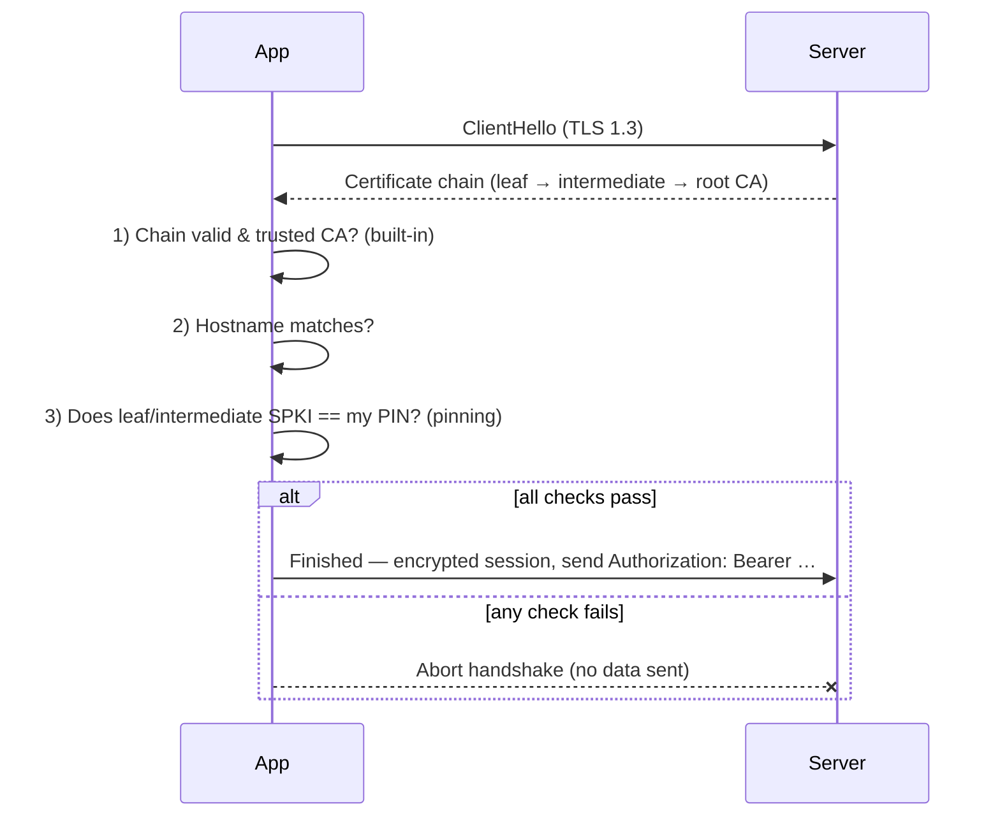

# Lesson 04 — API Security

> After this lesson you can secure data in transit with TLS, decide when to add **certificate pinning** (and survive cert rotation), and handle tokens on the wire without leaking them.

**Module:** 18 · **Lesson:** 04 · **Level:** 🟢🟡🔴 · **Est. time:** 75–90 min

---

## 1. Concept

### 🟢 For beginners — *what is it and why do I care?*

When your app talks to a server, the request travels across Wi-Fi, a coffee-shop router, an ISP, and the open internet. Anyone on that path *could* read or change it — unless it's protected. That protection is **TLS** (the "S" in HTTP**S**).

TLS does two things:

- **Encrypts** the traffic, so eavesdroppers see scrambled bytes, not your tokens and data.
- **Authenticates the server**, so you know you're really talking to `api.yourbank.com` and not an impostor who hijacked the connection.

The good news: on modern Android, **HTTPS is the default and HTTP is blocked** unless you explicitly allow it. So the baseline ("use `https://`") is mostly handled for you. The interesting question is what you do *beyond* the baseline when the data is high-value — and how you carry the user's **token** without spilling it into logs, URLs, or untrusted connections.

### 🟡 For intermediate devs — *the mechanism*

TLS authenticates the server using a **certificate** signed by a **Certificate Authority (CA)**. Your device trusts a built-in set of CAs; when the server presents a cert chaining to one of them, the handshake succeeds. This is **chain-of-trust** validation, and Android does it automatically for HTTPS.

Two levers you control:

- **Network Security Config** (`res/xml/network_security_config.xml`) — declarative, manifest-referenced policy: forbid cleartext, restrict which CAs are trusted, and (importantly) decide whether **user-installed CAs** are trusted. By default, apps targeting modern Android **don't** trust user-added CAs — which blocks the casual "install a proxy cert and read the traffic" attack.
- **Certificate / public-key pinning** — go beyond "any valid CA" to "**this specific** certificate or public key." Even if an attacker tricks a CA into issuing a fraudulent cert for your domain, a pinned client rejects it because the key doesn't match your pin. You can pin via Network Security Config (`<pin-set>`) or in OkHttp with `CertificatePinner`.

For **tokens**: send them in the `Authorization` header over TLS, *never* in the URL (URLs land in logs, history, and analytics). Don't log request/response bodies in release. And keep them short-lived — a leaked 15-minute access token is far less damaging than a leaked permanent one (Lesson 05 covers refresh flows).

### 🔴 For senior devs — *trade-offs, edges, internals*

Pinning is the topic where seniors are separated from the pack, because it's a genuine double-edged sword:

- **Pinning's benefit and its bite.** Pinning defeats a **mis-issued or rogue CA** and most MITM-via-proxy. But it couples your *shipped app binary* to your server's key material. If the server rotates its certificate to a key you didn't pin, **every installed app instantly loses connectivity** — a self-inflicted outage you can't hotfix without an app update. This has bricked production apps. The mitigations: **pin the public key (SPKI), not the leaf certificate** (keys outlive certs); **pin a backup key** you control and keep offline; **set an expiry** on the pin set so a forgotten pin fails *open* rather than bricking the app; and have a **kill-switch / fast update path**.
- **Pin the right level.** Pinning the **intermediate CA's** key is more rotation-tolerant than the leaf (you can reissue leaves freely) but slightly weaker; pinning the **leaf SPKI** is tightest but most fragile. Most teams pin the **leaf and a backup**, both as SPKI hashes.
- **What pinning does *not* do.** It doesn't protect against a compromised *server* or a malicious app on the device reading post-decryption plaintext. And it's pointless if you also ship a debug build that trusts user CAs — attackers test against the most permissive build.
- **TLS hygiene.** Enforce **TLS 1.2+** (prefer 1.3), disable cleartext globally, and don't disable hostname verification or trust-all `TrustManager`s "to make it work" — that silently destroys server authentication. Never ship a custom `TrustManager` that returns without checking.
- **Token transport discipline.** Access tokens in the `Authorization` header only; **never** in query strings or path. Strip auth headers on **redirects** to other hosts (OkHttp does, but verify). Disable body logging in release (`HttpLoggingInterceptor` at `NONE`/`BASIC`). Consider **mTLS** (client certificates) or **DPoP/token-binding** for very high-value APIs so a stolen bearer token can't be replayed from another device.

### Analogy

Plain HTTP is a **postcard** — every mail handler reads it. **TLS** is a **sealed, tamper-evident envelope** that also carries the recipient's **verified ID**, so you know it reached the right person unread. Normal certificate validation trusts **any notary** (CA) that vouches for that ID. **Pinning** is insisting on **one specific notary's seal you memorized in advance** — far harder to forge, but if that notary retires (the cert rotates) and you didn't memorize their replacement, you'll reject *legitimate* mail until you update your memory (ship an app update). That's the pinning trade-off in one picture.

### Mental model

> **TLS by default encrypts and authenticates the server; pinning narrows trust from "any valid CA" to "my key" — powerful, but pin the public key + a backup with an expiry, or you'll brick your own app on cert rotation.**

### Real-world example

A banking app talks only over TLS 1.3, with a Network Security Config that forbids cleartext and ignores user-installed CAs (so a customer's proxy can't read traffic). High-value endpoints are **public-key pinned** to the leaf SPKI **and** a backup key the ops team holds offline, with a pin-set expiry 90 days out. Tokens ride in the `Authorization` header; body logging is off in release. When the cert rotates, ops swaps to the pre-pinned backup key — zero downtime.

---

## 2. Visual Learning

**ASCII — what TLS and pinning each block:**
```text
   App ──HTTPS──▶ [ Wi-Fi · router · ISP · internet ] ──▶ Server
                          │                 │
   eavesdrop ✗  (TLS encrypts)              │
   tamper    ✗  (TLS integrity)             │
   impostor server:                         ▼
     · any valid CA cert   → TLS ALONE accepts it  (CA was tricked → MITM)
     · key ≠ your pin      → PINNING rejects it     ✗  (attack stopped)
     · your real key       → accepted ✓
```

**Mermaid — the TLS handshake + pin check:**


**Illustration prompt (paste into an image generator):**
```text
Illustration: a letter traveling through a city of mail-handling hands, sealed inside a glowing
tamper-evident envelope labeled "TLS — encrypted + integrity". At the destination, a guard checks
the sender's ID badge. Two badges are shown: one stamped by a generic "any CA notary" (the guard
looks unsure), and one matching a photo the guard memorized labeled "PINNED key" (the guard nods).
A forged badge from a tricked notary is being rejected at the door with a red X. A small inset shows
a calendar labeled "pin expiry" and a spare badge in a safe labeled "backup key". Modern, clean,
isometric, soft gradients, clear labels.
```

---

## 3. Code

### 🟢 Beginner — enforce HTTPS and block cleartext (Network Security Config)

```xml
<!-- res/xml/network_security_config.xml -->
<network-security-config>
    <!-- Forbid plaintext HTTP everywhere, and don't trust user-installed CAs. -->
    <base-config cleartextTrafficPermitted="false">
        <trust-anchors>
            <certificates src="system" />   <!-- system CAs only; NOT 'user' -->
        </trust-anchors>
    </base-config>
</network-security-config>
```

```xml
<!-- AndroidManifest.xml -->
<application
    android:networkSecurityConfig="@xml/network_security_config"
    android:usesCleartextTraffic="false">
    ...
</application>
```

**Explanation.** This makes the baseline explicit: **no cleartext** anywhere, and **system CAs only** — so a user who installs a proxy CA to snoop can't decrypt your traffic. It's a few lines and it shuts down the most common casual MITM.

**Common mistakes.**
```xml
<!-- ❌ Trusting user-added CAs (re-opens the proxy-snooping door). -->
<certificates src="user" />

<!-- ❌ Allowing cleartext "temporarily" for a dev server — and forgetting to remove it. -->
<base-config cleartextTrafficPermitted="true">
```
Also wrong: hardcoding `http://` URLs, or shipping a debug `network_security_config` that trusts user CAs into release.

**Best practices.**
- `cleartextTrafficPermitted="false"`; **system** trust anchors only.
- Keep dev-only relaxations in a **debug-flavor** config that can't ship to release.
- Use `https://` everywhere; treat any `http://` as a bug.

---

### 🟡 Intermediate — public-key pinning + safe token header (OkHttp/Retrofit)

```kotlin
// Pin the leaf SPKI AND a backup key. SHA-256 of the public key — survives cert reissue.
private val pinner = CertificatePinner.Builder()
    .add("api.example.com", "sha256/AAAAAAAAAAAAAAAAAAAAAAAAAAAAAAAAAAAAAAAAAAA=")  // current key
    .add("api.example.com", "sha256/BBBBBBBBBBBBBBBBBBBBBBBBBBBBBBBBBBBBBBBBBBB=")  // backup key
    .build()

// Attach the token as a header — NEVER in the URL. Short-lived access token.
class AuthInterceptor(private val tokens: TokenProvider) : Interceptor {
    override fun intercept(chain: Interceptor.Chain): Response {
        val request = chain.request().newBuilder()
            .header("Authorization", "Bearer ${tokens.access()}")
            .build()
        return chain.proceed(request)
    }
}

fun buildClient(tokens: TokenProvider): OkHttpClient = OkHttpClient.Builder()
    .certificatePinner(pinner)
    .addInterceptor(AuthInterceptor(tokens))
    .connectionSpecs(listOf(ConnectionSpec.RESTRICTED_TLS))   // TLS 1.2+ / strong ciphers only
    .addInterceptor(HttpLoggingInterceptor().apply {
        level = if (BuildConfig.DEBUG) HttpLoggingInterceptor.Level.BASIC
                else HttpLoggingInterceptor.Level.NONE        // never log bodies/headers in release
    })
    .build()
```

**Explanation.** `CertificatePinner` adds **public-key** pins (SHA-256 of the SPKI), with a **backup** so a planned rotation doesn't brick clients. The token goes in the `Authorization` header via an interceptor — out of URLs and logs. `RESTRICTED_TLS` enforces modern TLS; logging is reduced to `NONE` in release so tokens/PII never hit logcat.

**Common mistakes.**
```kotlin
// ❌ Token in the URL — lands in logs, proxies, server access logs, browser history.
@GET("profile?token={t}") suspend fun profile(@Path("t") token: String): Profile

// ❌ Pinning a single leaf cert with no backup → server rotates → every app is bricked.
CertificatePinner.Builder().add("api.example.com", "sha256/ONLY_ONE=").build()

// ❌ HttpLoggingInterceptor at BODY in release → dumps tokens and PII to logcat.
HttpLoggingInterceptor().apply { level = HttpLoggingInterceptor.Level.BODY }
```

**Best practices.**
- Pin the **public key (SPKI)** and **always include a backup pin** you control.
- Tokens in **headers**, never URLs; logging **off** in release.
- Enforce **TLS 1.2+** via connection specs; let the pin failure abort the connection.

---

### 🔴 Production — pinning with an expiry/kill-switch and a trust-all guardrail

```xml
<!-- Pinning via Network Security Config: declarative, with an EXPIRY so it fails OPEN, not bricked. -->
<!-- res/xml/network_security_config.xml -->
<network-security-config>
    <base-config cleartextTrafficPermitted="false">
        <trust-anchors><certificates src="system" /></trust-anchors>
    </base-config>

    <domain-config>
        <domain includeSubdomains="true">api.example.com</domain>
        <!-- After this date the pins are ignored → a forgotten rotation degrades to normal TLS,
             not a dead app. Set it to your cert-rotation cadence and renew deliberately. -->
        <pin-set expiration="2026-12-31">
            <pin digest="SHA-256">AAAAAAAAAAAAAAAAAAAAAAAAAAAAAAAAAAAAAAAAAAA=</pin> <!-- leaf -->
            <pin digest="SHA-256">BBBBBBBBBBBBBBBBBBBBBBBBBBBBBBBBBBBBBBBBBBB=</pin> <!-- backup -->
        </pin-set>
    </domain-config>
</network-security-config>
```

```kotlin
// GUARDRAIL: make "trust everything" impossible to ship. This trips CI/crashes in release if
// someone reintroduces a trust-all TrustManager or disables hostname verification for debugging.
object TlsGuard {
    fun assertNoTrustAll(client: OkHttpClient) {
        check(!BuildConfig.DEBUG || allowInsecureForLocalDev) {
            "Insecure TLS config must never reach release"
        }
        // In tests, additionally assert the client carries a non-empty CertificatePinner
        // and a RESTRICTED/MODERN ConnectionSpec. (Reflection/DI check omitted for brevity.)
    }
}

// ❌ The pattern this guardrail exists to forbid — NEVER ship this:
// val trustAll = object : X509TrustManager {
//     override fun checkServerTrusted(chain: Array<X509Certificate>, authType: String) {} // accepts ANY cert
//     override fun checkClientTrusted(chain: Array<X509Certificate>, authType: String) {}
//     override fun getAcceptedIssuers() = arrayOf<X509Certificate>()
// }
```

**Explanation.** Production pinning is about **failure modes, not just the happy path**. Doing it in **Network Security Config** lets you set an **`expiration`** on the pin set: if the team forgets to update pins before a cert rotation, the app **degrades to normal (still-validated) TLS** instead of going permanently offline — a controlled fail-open you choose deliberately. The `TlsGuard` encodes the cardinal rule as an assertion: a **trust-all `TrustManager`** (the "just make HTTPS work" hack devs paste from Stack Overflow) must never reach release — it silently disables server authentication and turns TLS into theater.

**Common mistakes.**
- **Pin set with no expiry and no backup** → a cert rotation bricks every installed app, fixable only by an emergency release users must download.
- **Shipping a trust-all `TrustManager`** or `hostnameVerifier { _, _ -> true }` left over from local debugging — the single most dangerous networking bug, because everything *looks* fine.
- **No kill-switch:** no remote flag / fast-update path to disable pinning if it misfires.
- Pinning in debug but trusting user CAs in debug builds attackers can analyze.

**Best practices.**
- Prefer **NSC pinning with an `expiration`** (fail-open on neglect) *or* OkHttp pinning **with a backup pin** and a remote kill-switch.
- **Forbid trust-all** by construction (lint rule / CI assert / the `TlsGuard` above).
- Pin **SPKI**, keep a **backup key offline**, and rehearse the **rotation** runbook before you need it.
- Keep insecure relaxations strictly in non-shippable debug flavors.

---

## 4. Interview Questions

**🟢 Beginner**

1. *What does HTTPS/TLS protect, and what's the Android default?*
   > TLS encrypts traffic (eavesdroppers see scrambled bytes), ensures integrity (tampering is detected), and authenticates the server (you're talking to the real host). On modern Android, HTTPS is the default and cleartext HTTP is blocked unless explicitly allowed.
2. *Where should an auth token go in a request, and where should it never go?*
   > In the `Authorization` header over TLS. Never in the URL (query string or path), because URLs end up in server logs, proxies, analytics, and history.

**🟡 Intermediate**

3. *What is certificate pinning and what attack does it stop that plain TLS doesn't?*
   > Pinning restricts trust from "any cert from any trusted CA" to a specific certificate or public key you embed. It stops a man-in-the-middle that uses a **fraudulent but technically valid** cert — e.g. from a mis-issued or rogue CA, or a user-installed proxy CA — because the presented key won't match your pin.
4. *Why pin the public key (SPKI) instead of the whole certificate?*
   > Certificates are reissued/rotated frequently, but the underlying key pair can be kept across renewals. Pinning the SPKI means a routine cert reissue with the same key doesn't break the pin, reducing the chance of an accidental lockout.

**🔴 Senior**

5. *What's the danger of certificate pinning, and how do you mitigate it?*
   > Pinning couples the shipped app to server key material. If the server rotates to an unpinned key, every installed app loses connectivity until users update — a self-inflicted outage. Mitigate by pinning the **public key plus a backup key** you control offline, setting a **pin-set expiry** so neglect fails *open* to normal TLS rather than bricking, and keeping a **remote kill-switch / fast update path**.
6. *A teammate "fixed" a TLS error in staging by adding a `TrustManager` that accepts all certificates. Why is that dangerous and what do you do?*
   > It disables server authentication entirely — the app will accept *any* cert, including an attacker's, so all traffic is silently MITM-able while appearing to work over HTTPS. It must never reach release. Fix the real cause (correct CA / staging cert / clock), keep any relaxation in a non-shippable debug flavor, and add a lint/CI guardrail that fails the build if a trust-all manager or `hostnameVerifier { true }` is present.

---

## 5. AI Assistant

**Prompt example (set up a hardened OkHttp/Retrofit client):**
```text
Configure an OkHttp + Retrofit client for Kotlin 2.x that: enforces TLS 1.2+ (RESTRICTED_TLS),
adds an AuthInterceptor putting a bearer token in the Authorization header (never the URL),
sets HttpLoggingInterceptor to NONE in release, and pins the server's public key (SPKI) with a
BACKUP pin. Also generate a res/xml/network_security_config.xml that forbids cleartext, trusts
system CAs only, and pins api.example.com with a pin-set EXPIRATION. Explain the cert-rotation
runbook. Do NOT include any trust-all TrustManager or hostnameVerifier override.
```

**AI workflow — where it helps on *this* topic.**
- ✅ Great for: the OkHttp/Retrofit/NSC boilerplate, interceptor wiring, and explaining the handshake.
- ⚠️ Not for: choosing your pins or your rotation strategy — that's tied to your real infra. And beware: when an AI "fixes" a TLS error, it very often pastes a **trust-all `TrustManager`** or disables hostname verification. That's the most dangerous suggestion in this entire module; reject it on sight.

**Review workflow — check AI output against this lesson's *Common Mistakes*:**
- Any **trust-all `TrustManager`** or `hostnameVerifier { _, _ -> true }`? → reject, fix the real cause.
- Is logging **`NONE` in release**? Is the token in a **header**, not the URL?
- Pinning: **SPKI** with a **backup** pin and/or an **expiry**? Any `cleartextTrafficPermitted="true"` or `src="user"`?
- TLS version enforced (1.2+)?

**Validation workflow — prove it actually works:**
1. **Proxy test (negative):** route the device through a proxy with its own CA (e.g. mitmproxy). With config correct, requests **fail** — proof TLS + (system-only CAs / pinning) are doing their job. If they succeed, your hardening is off.
2. **Pin-mismatch test:** temporarily set a wrong pin → the request must fail with a pinning exception (confirms pins are enforced, not ignored).
3. **Log audit:** trigger requests in a release build and grep logcat — **no** tokens, headers, or bodies should appear.
4. **Rotation rehearsal:** simulate a cert with the **backup** key → app still connects; let the pin-set **expiry** pass → app degrades to normal TLS, not failure.

> **AI drafts, you decide.** The proxy test is the one that matters: if your "secured" client still works through an intercepting proxy, the AI (or you) left a hole — most likely a trust-all manager or user-CA trust.

---

## Recap / Key takeaways

- **TLS** (HTTPS, default on modern Android) encrypts traffic, ensures integrity, and **authenticates the server**; block cleartext and trust **system CAs only**.
- **Certificate pinning** narrows trust to *your* key — stopping rogue/mis-issued-CA MITM — but it's a **double-edged sword**.
- Pin the **public key (SPKI)** plus a **backup**, set a **pin-set expiry** (fail-open), and keep a **kill-switch**; pin the wrong way and a cert rotation bricks your app.
- Carry tokens in the **`Authorization` header**, never in URLs; turn **body logging off** in release.
- **Never** ship a trust-all `TrustManager` or disable hostname verification — it silently destroys server authentication.

➡️ Next: **[Lesson 05 — Authentication & authorization](05-authentication-authorization.md)** — sessions, OAuth, refresh-token storage, and biometric gating.
