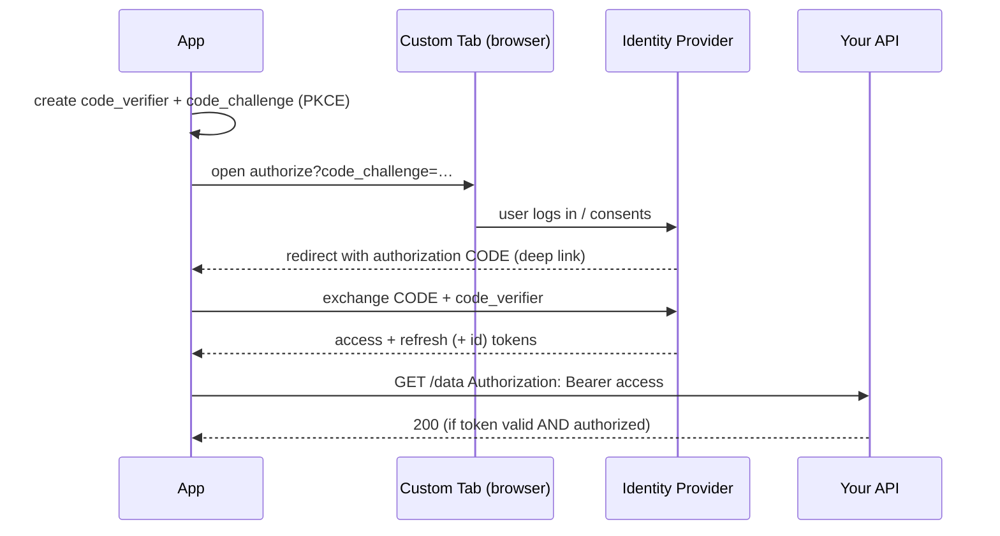

# Lesson 05 — Authentication & Authorization

> After this lesson you can run an OAuth/OIDC login on Android, store and refresh tokens safely, distinguish **authentication** from **authorization**, and gate sensitive actions with **biometrics** bound to a Keystore key.

**Module:** 18 · **Lesson:** 05 · **Level:** 🟢🟡🔴 · **Est. time:** 90–110 min

---

## 1. Concept

### 🟢 For beginners — *what is it and why do I care?*

Two words that sound alike but mean different things:

- **Authentication (authN)** — *who are you?* Proving identity: a password, a Google sign-in, a fingerprint.
- **Authorization (authZ)** — *what are you allowed to do?* Permissions: this user can read their own orders but not someone else's; an admin can delete posts.

You authenticate **once** (log in), then the system authorizes **every** subsequent action. Mixing them up is a real bug class: "the user is logged in" does **not** mean "the user may do this." A logged-in customer is still not allowed to refund another customer.

After login, the app holds a **token** — a small credential that says "this request comes from an authenticated user." The app sends it with each request (Lesson 04: in the `Authorization` header, over TLS) and stores it safely between launches (Lesson 02: Keystore-encrypted). Logging in once and reusing a token beats sending the password every time — and means the password is never stored.

### 🟡 For intermediate devs — *the mechanism*

The modern standard is **OAuth 2.0 / OpenID Connect (OIDC)** with the **Authorization Code flow + PKCE**:

1. The app opens the provider's login page in a **Custom Tab** (a real browser surface — *not* a `WebView`), with a PKCE `code_challenge`.
2. The user authenticates with the provider; the app gets back an **authorization code** via a redirect (a deep link / app link).
3. The app exchanges the code (+ PKCE `code_verifier`) for tokens: an **access token** (short-lived, sent with API calls), a **refresh token** (longer-lived, used to get new access tokens), and for OIDC an **ID token** (a signed JWT proving who logged in).

**PKCE** stops a malicious app from intercepting the redirect and stealing the code, because only the app that generated the original verifier can complete the exchange. Use a maintained library (e.g. **AppAuth**) rather than hand-rolling this.

Token handling: keep the **access token** short-lived; when it expires (a `401`), use the **refresh token** to silently get a new one (Lesson 04 patterns + an OkHttp `Authenticator`). Store the **refresh token** as the crown jewel — Keystore-encrypted, ideally auth-bound — and revoke it on logout.

**Biometrics** use `BiometricPrompt` (AndroidX). Critically, the secure pattern isn't "if (fingerprintOk) showSecret()" — it's binding biometric success to a **Keystore key** via a `CryptoObject`, so the *cryptographic operation itself* can only run after a real authentication.

### 🔴 For senior devs — *trade-offs, edges, internals*

The decisions that matter in production:

- **Where the refresh token lives is the central design question** (and a classic interview prompt). Options, worst to best: in plain `SharedPreferences`/DataStore (✗ — readable on root/backup); Keystore-encrypted DataStore (good); Keystore-encrypted **and auth-bound** so it's unusable without a live biometric/PIN (best for high-value apps). For the *most* sensitive apps, prefer **short-lived tokens with frequent re-auth** over a long-lived refresh token on the device at all — you can't leak what you don't keep. Whatever you choose, the token must be **revocable server-side** so logout/compromise truly ends the session.
- **WebView is the wrong place to log in.** A `WebView` you control can read the user's keystrokes and cookies, breaks the provider's anti-phishing UI, and isn't trusted by providers. Use **Custom Tabs / AppAuth**. (And generally, never load untrusted content in a `WebView` with `JavaScriptInterface` enabled — that's a remote-code-execution surface.)
- **Biometrics ≠ identity, and they're spoofable in tiers.** A fingerprint proves *device possession + a body part*, not legal identity, and the device decides if the sensor is **Class 3 (Strong)** or weaker. For unlocking a Keystore key you must require **`BIOMETRIC_STRONG`**; weak/face-only sensors may not gate crypto. Always offer a **device-credential (PIN) fallback** and handle "no biometrics enrolled."
- **CryptoObject binding is what makes biometrics *security* rather than UX.** A bare boolean check (`if (authSucceeded) reveal()`) can be bypassed by an instrumented app (Frida) flipping the result. Binding success to a Keystore `Cipher`/`Signature` via `CryptoObject` means the secret literally cannot be decrypted/signed without the OS-verified authentication — there's no boolean to flip. This is the senior insight of the lesson.
- **Key invalidation is a feature, not a bug.** `setInvalidatedByBiometricEnrollment(true)` destroys the key when a new fingerprint is enrolled, so an attacker who adds their finger can't unlock the user's data; handle `KeyPermanentlyInvalidatedException` by forcing re-login (Lesson 02).
- **AuthZ is enforced on the server, period.** Hiding an admin button in Compose is UX; the *server* must reject an unauthorized request, because the client is untrusted (Lesson 01). Token **scopes/claims** describe permissions, but the API must still check them.

### Analogy

Logging into a **conference**: **authentication** is showing your ID at registration to prove you're you. **Authorization** is what your **badge color** lets you into — "Attendee" gets the talks, "Speaker" gets the green room, "Staff" gets backstage. You verify identity *once* at the door; the **badge** (your token) is checked at *every* room. A **biometric gate** on a sensitive action is the backstage door that re-scans your fingerprint *each time* — possessing the badge isn't enough for the high-security room. And the badge is only honored because the venue's system (the **server**) still has it on the valid list; revoke it centrally and every door rejects it.

### Mental model

> **AuthN proves who you are (once); authZ decides what you may do (every request, on the server). Tokens carry the proof — keep the refresh token Keystore-encrypted and revocable, and gate high-value actions by binding a biometric to a Keystore key, not to a boolean.**

### Real-world example

A health app: login is OAuth/OIDC via a Custom Tab (AppAuth) with PKCE. The access token (10-min TTL) rides API calls; the refresh token is stored **Keystore-encrypted and auth-bound**. Viewing lab results re-prompts `BiometricPrompt` with a `CryptoObject` that unwraps the records' decryption key — so even an unlocked, stolen phone can't read results without the owner's fingerprint. The *server* enforces that a patient sees only their own records, regardless of what the app requests.

---

## 2. Visual Learning

**ASCII — authN once, authZ every time:**
```text
   ┌── LOGIN (authentication) — happens ONCE ─────────────────────────────┐
   │  user → Custom Tab (OAuth+PKCE) → provider → code → exchange → TOKENS │
   └──────────────────────────────────────────────────────────────────────┘
                                   │ access token (short)   refresh token (Keystore, auth-bound)
                                   ▼
   ┌── EACH REQUEST (authorization) — happens EVERY TIME ──────────────────┐
   │  app ──Authorization: Bearer …──▶ SERVER checks: valid? scope/role?   │
   │                                          allow ✓ / 403 ✗  (server decides)
   └──────────────────────────────────────────────────────────────────────┘
   sensitive action → BiometricPrompt(CryptoObject) unlocks a Keystore key first
```

**Mermaid — OAuth Authorization Code + PKCE:**


**Illustration prompt (paste into an image generator):**
```text
Illustration: a conference scene, clean and modern. On the left, a registration desk labeled
"Authentication" where a person shows photo ID once and receives a colored badge labeled "token".
On the right, a hallway of doors labeled "Talks", "Speaker Lounge", "Backstage", each with a
badge-reader labeled "Authorization — checked every time"; a guard turns away a wrong-color badge.
One special door labeled "Records" has a fingerprint scanner glowing, wired to a tiny vault icon
labeled "Keystore key (CryptoObject)". A central monitor labeled "Server: valid badge list"
oversees all doors. Soft gradients, isometric, clear labels.
```

---

## 3. Code

### 🟢 Beginner — show a biometric prompt (and handle every outcome)

```kotlin
fun promptBiometric(activity: FragmentActivity, onSuccess: () -> Unit, onFail: () -> Unit) {
    val canAuth = BiometricManager.from(activity)
        .canAuthenticate(BiometricManager.Authenticators.BIOMETRIC_STRONG)
    if (canAuth != BiometricManager.BIOMETRIC_SUCCESS) { onFail(); return }  // none enrolled / no HW

    val prompt = BiometricPrompt(
        activity,
        ContextCompat.getMainExecutor(activity),
        object : BiometricPrompt.AuthenticationCallback() {
            override fun onAuthenticationSucceeded(result: BiometricPrompt.AuthenticationResult) = onSuccess()
            override fun onAuthenticationError(code: Int, msg: CharSequence) = onFail()  // user cancel, lockout…
        }
    )
    prompt.authenticate(
        BiometricPrompt.PromptInfo.Builder()
            .setTitle("Confirm it's you")
            .setSubtitle("Unlock to continue")
            .setAllowedAuthenticators(BiometricManager.Authenticators.BIOMETRIC_STRONG)
            .setNegativeButtonText("Cancel")
            .build()
    )
}
```

**Explanation.** `BiometricManager.canAuthenticate(...)` checks availability *before* prompting (hardware present, biometrics enrolled). The `AuthenticationCallback` handles success **and** error/cancel — biometrics fail often (wrong finger, lockout, user cancels), so a robust UI always has a path for "not authenticated."

**Common mistakes.**
```kotlin
// ❌ Assuming biometrics exist; prompting blind → confusing failures on devices with none enrolled.
BiometricPrompt(activity, executor, cb).authenticate(promptInfo)   // no canAuthenticate() check

// ❌ Only handling success; ignoring onAuthenticationError → the UI hangs when the user cancels.
```

**Best practices.**
- Call `canAuthenticate(BIOMETRIC_STRONG)` first; offer a fallback when it's unavailable.
- Handle **error/cancel**, not just success.
- Use clear prompt copy; always provide the negative/fallback button.

---

### 🟡 Intermediate — store & refresh tokens safely

```kotlin
// Refresh token is the crown jewel → Keystore-encrypted (TokenStore from Lesson 02).
class AuthRepository(
    private val store: TokenStore,            // encrypts at rest (Lesson 02)
    private val api: AuthApi,
) {
    suspend fun login(code: String, verifier: String) {
        val tokens = api.exchange(code, verifier)              // OAuth code → tokens (over pinned TLS)
        store.save(tokens.refresh)                             // encrypted, auth-bound
        memoryAccessToken = tokens.access                      // short-lived, kept in memory
    }

    suspend fun logout() {
        runCatching { api.revoke(store.load()) }               // tell the SERVER to invalidate it
        store.clear()                                          // then wipe locally
        memoryAccessToken = null
    }

    @Volatile private var memoryAccessToken: String? = null
    fun access() = memoryAccessToken
}

// On 401, transparently refresh — OkHttp Authenticator retries the failed request once.
class TokenAuthenticator(private val repo: AuthRepository, private val api: AuthApi) : Authenticator {
    override fun authenticate(route: Route?, response: Response): Request? {
        if (response.request.header("Authorization-Retry") != null) return null  // already retried → give up
        val refreshed = runBlocking { runCatching { api.refresh(repo.currentRefresh()) }.getOrNull() }
            ?: return null                                     // refresh failed → force re-login upstream
        repo.updateAccess(refreshed.access)
        return response.request.newBuilder()
            .header("Authorization", "Bearer ${refreshed.access}")
            .header("Authorization-Retry", "1")
            .build()
    }
}
```

**Explanation.** The **access token** lives in memory (short-lived, cheap to lose); the **refresh token** is Keystore-encrypted at rest. On a `401`, the `Authenticator` uses the refresh token to mint a new access token and retries **once** — silent re-auth without bouncing the user to login. Logout **revokes server-side first**, then wipes locally, so the session truly ends.

**Common mistakes.**
```kotlin
// ❌ Storing the refresh token in plain DataStore/SharedPreferences.
prefs.edit { putString("refresh", token) }     // readable on root/backup — it's the crown jewel

// ❌ Infinite refresh loop: retrying refresh on every 401 with no "already retried" guard.

// ❌ Logout that only clears locally — the token still works until it naturally expires.
```

**Best practices.**
- Refresh token **encrypted (auth-bound)**; access token **short-lived**, in memory.
- Refresh on `401` with a **retry guard**; on refresh failure, route to re-login.
- Logout = **server revoke** + local wipe.

---

### 🔴 Production — biometric-gated decryption via a CryptoObject

```kotlin
// The secure pattern: biometric success UNLOCKS a Keystore Cipher; the secret can't be decrypted
// without a real, OS-verified authentication. No boolean to bypass.
class SecretGate(private val activity: FragmentActivity) {

    // Auth-bound key: usable ONLY inside a successful BiometricPrompt (timeout 0 = per-use).
    private fun cipherForDecrypt(iv: ByteArray): Cipher {
        val ks = KeyStore.getInstance("AndroidKeyStore").apply { load(null) }
        val key = ks.getKey(ALIAS, null) as SecretKey          // created with setUserAuthenticationRequired(true)
        return Cipher.getInstance("AES/GCM/NoPadding").apply {
            init(Cipher.DECRYPT_MODE, key, GCMParameterSpec(128, iv))
        }
    }

    /** Prompts biometrics, then decrypts [blob] inside the authenticated CryptoObject. */
    fun reveal(blob: ByteArray, onSecret: (ByteArray) -> Unit, onDenied: () -> Unit) {
        val iv = blob.copyOfRange(0, 12)
        val ct = blob.copyOfRange(12, blob.size)

        val cipher = try {
            cipherForDecrypt(iv)
        } catch (e: KeyPermanentlyInvalidatedException) {
            onDenied(); return                                  // lock-screen/biometric changed → re-enroll/re-login
        }

        val prompt = BiometricPrompt(activity, ContextCompat.getMainExecutor(activity),
            object : BiometricPrompt.AuthenticationCallback() {
                override fun onAuthenticationSucceeded(result: BiometricPrompt.AuthenticationResult) {
                    // The OS hands back the SAME cipher, now authorized to run exactly once.
                    val authedCipher = result.cryptoObject?.cipher ?: return onDenied()
                    onSecret(authedCipher.doFinal(ct))
                }
                override fun onAuthenticationError(code: Int, msg: CharSequence) = onDenied()
            })

        prompt.authenticate(
            BiometricPrompt.PromptInfo.Builder()
                .setTitle("Unlock sensitive data")
                .setAllowedAuthenticators(BiometricManager.Authenticators.BIOMETRIC_STRONG)
                .setNegativeButtonText("Cancel")
                .build(),
            BiometricPrompt.CryptoObject(cipher)                 // ← binds auth to THIS crypto op
        )
    }

    private companion object { const val ALIAS = "records_key" }
}
```

**Explanation.** This is the difference between biometrics-as-UX and biometrics-as-**security**. The Keystore key was created `setUserAuthenticationRequired(true)`, so the OS refuses to run the `Cipher` until `BiometricPrompt` verifies the user — and it returns the **same** `CryptoObject` authorized for a single operation. There is **no boolean** an instrumented app can flip; the decryption physically cannot happen without a live, strong authentication. `KeyPermanentlyInvalidatedException` is handled as a normal re-enroll/re-login path.

**Common mistakes.**
```kotlin
// ❌ Biometric theater: a bare boolean gate an instrumented app (Frida) can flip to true.
override fun onAuthenticationSucceeded(r: BiometricPrompt.AuthenticationResult) { showSecret() }
//   ...with the secret already decrypted/available regardless of the prompt. No CryptoObject = bypassable.
```
- Allowing **weak** authenticators for a crypto gate (face-only/Class 2 may not back a Keystore key).
- Not handling **key invalidation**, so a routine fingerprint change hard-crashes the feature.
- Gating the **UI** but leaving the plaintext/secret reachable without the prompt.

**Best practices.**
- Bind sensitive operations to a **`CryptoObject`** + an **auth-bound, `BIOMETRIC_STRONG`** Keystore key — never a boolean.
- Decrypt **inside** the authenticated cipher; don't pre-decrypt and merely hide the UI.
- Handle `KeyPermanentlyInvalidatedException` → re-enroll/re-login; offer a device-credential fallback.
- Enforce real authorization on the **server**; biometrics gate the *device action*, not the user's *rights*.

---

## 4. Interview Questions

**🟢 Beginner**

1. *Authentication vs authorization?*
   > Authentication proves **who you are** (login, biometric); authorization decides **what you're allowed to do** (roles/permissions). You authenticate once, then every action is authorized — being logged in doesn't mean you may perform a given action.
2. *Why send a token with each request instead of the password?*
   > So the password is never stored or repeatedly transmitted. A short-lived token limits damage if leaked and can be revoked, whereas a leaked stored password compromises the account outright.

**🟡 Intermediate**

3. *Why use a Custom Tab / AppAuth for OAuth instead of a `WebView`?*
   > A `WebView` you control can read the user's credentials and cookies, breaks the provider's anti-phishing protections, and isn't trusted by identity providers. A Custom Tab is a real, isolated browser surface; with PKCE it lets the app complete the flow securely without ever seeing the password.
4. *What does PKCE protect against in the Authorization Code flow?*
   > Authorization-code interception. A malicious app that grabs the redirected code still can't exchange it, because the token exchange requires the original `code_verifier` that only the legitimate app generated.

**🔴 Senior**

5. *Where do you store a refresh token on Android, and what are the trade-offs?*
   > It's the crown jewel, so: Keystore-encrypted at minimum, ideally **auth-bound** (unusable without a live biometric/PIN), and always **revocable server-side**. Plain `SharedPreferences`/DataStore is unacceptable (readable on root/backup). For the most sensitive apps, prefer **short-lived tokens with re-auth** and store no long-lived refresh token on the device at all — you can't leak what you don't keep.
6. *Why is binding biometrics to a `CryptoObject` more secure than checking an "authenticated" boolean?*
   > A boolean result can be tampered with by an instrumented/rooted app (e.g. Frida forcing `onAuthenticationSucceeded`). Binding success to a Keystore `Cipher`/`Signature` via `CryptoObject` means the cryptographic operation itself is gated by the OS-verified authentication — the secret can't be decrypted/signed without a genuine auth, so there's no boolean to bypass.

---

## 5. AI Assistant

**Prompt example (implement biometric-gated decryption):**
```text
Implement biometric-gated decryption on Android (Kotlin 2.x): a Keystore AES-GCM key created with
setUserAuthenticationRequired(true) and BIOMETRIC_STRONG, unlocked via BiometricPrompt with a
CryptoObject, decrypting inside the authenticated cipher (no boolean gate). Handle
KeyPermanentlyInvalidatedException (force re-enroll), the no-biometrics-enrolled case, and a
device-credential fallback. Then show how the refresh token is stored Keystore-encrypted and
revoked server-side on logout. Don't use a WebView for OAuth.
```

**AI workflow — where it helps on *this* topic.**
- ✅ Great for: `BiometricPrompt`/`CryptoObject` boilerplate, OAuth/AppAuth wiring, the OkHttp `Authenticator` refresh pattern.
- ⚠️ Not for: your token-storage policy or your authZ model. Models routinely generate **boolean** biometric gates, store the **refresh token in plain prefs**, log the user in via **WebView**, and skip **server-side** revocation/authorization. Treat those as defaults to override.

**Review workflow — check AI output against this lesson's *Common Mistakes*:**
- Is biometric success bound to a **`CryptoObject`** + **auth-bound BIOMETRIC_STRONG** key — not a flippable boolean?
- Refresh token **Keystore-encrypted (auth-bound)** and **revoked server-side** on logout — not in plain prefs?
- OAuth via **Custom Tab/AppAuth** (with PKCE), **not** a `WebView`?
- Is `KeyPermanentlyInvalidatedException` handled, and is there a **fallback** when biometrics are unavailable?
- Is **authorization enforced on the server**, with the UI gate treated as cosmetic?

**Validation workflow — prove it actually works:**
1. **Bypass attempt:** confirm the secret is unreadable without completing the prompt — try with biometrics not enrolled, and (on a test device) verify a hooked boolean wouldn't yield plaintext because decryption needs the `CryptoObject`.
2. **Invalidation drill:** enroll a new fingerprint / change the lock screen → reading must hit `KeyPermanentlyInvalidatedException` and recover via re-login, not crash.
3. **Refresh + logout test:** force a `401` → silent refresh succeeds once; then logout → server **revoke** is called and a subsequent request with the old token **fails**.
4. **Transport check:** confirm tokens travel only in the `Authorization` header over pinned TLS (ties back to Lesson 04), never in URLs/logs.

> **AI drafts, you decide.** The tell for insecure AI auth code is a *boolean* biometric check and a *plaintext* refresh token — replace both with a `CryptoObject`-bound key and Keystore-encrypted, server-revocable storage.

---

## Recap / Key takeaways

- **AuthN** = who you are (once); **authZ** = what you may do (every request) — and authZ is enforced on the **server**.
- Use **OAuth 2.0 / OIDC** with **Authorization Code + PKCE** via a **Custom Tab/AppAuth** — never a `WebView`.
- **Access token**: short-lived, in memory; **refresh token**: the crown jewel — **Keystore-encrypted, auth-bound, server-revocable**. For top-sensitivity apps, prefer short-lived tokens and store no long-lived refresh token at all.
- Refresh transparently on `401` (with a retry guard); **logout revokes server-side**, then wipes locally.
- Gate sensitive actions by binding biometrics to a **Keystore key via `CryptoObject`** (**BIOMETRIC_STRONG**) — not a bypassable boolean — and handle key invalidation as a normal re-login.

➡️ Next: **[Lesson 06 — OWASP Mobile Top 10](06-owasp-mobile-top-10.md)** — every major mobile risk with a concrete Android mitigation, and how to audit your own app.
