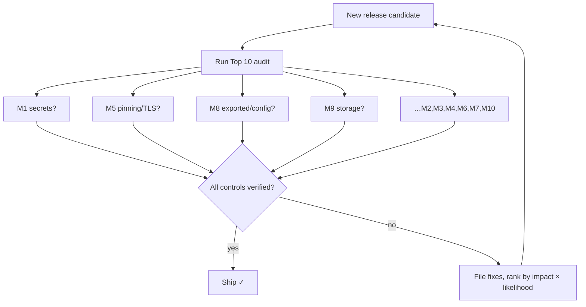

# Lesson 06 — OWASP Mobile Top 10

> After this lesson you can name each OWASP Mobile Top 10 risk, map it to a concrete Android mitigation, and run a structured security audit of your own app against the list.

**Module:** 18 · **Lesson:** 06 · **Level:** 🟢🟡🔴 · **Est. time:** 90–110 min

---

## 1. Concept

### 🟢 For beginners — *what is it and why do I care?*

You've now learned the pieces — sandbox, storage, encryption, TLS, auth. The **OWASP Mobile Top 10** is the industry's *checklist* that ties them together: the ten most common, most damaging categories of mobile security mistakes, curated by the Open Worldwide Application Security Project. If you can audit your app against these ten, you've covered the issues that cause the overwhelming majority of real breaches.

Think of it as a **pre-flight checklist for shipping**. Pilots don't trust memory; they run the list every time. You shouldn't trust "I think it's secure" either — you run the Top 10 against each release. The list is updated periodically (the current edition is the **2024 list**, the reference standard in 2026); the *categories* are stable even as numbering shifts, so learn the categories, not the trivia.

The ten (2024 edition), in one line each:

| # | Risk | One-liner |
|---|---|---|
| M1 | Improper Credential Usage | hardcoded/leaked secrets, weak credential handling |
| M2 | Inadequate Supply Chain Security | compromised SDKs, libraries, build pipeline |
| M3 | Insecure Authentication/Authorization | weak login, missing server-side authZ |
| M4 | Insufficient Input/Output Validation | injection, unvalidated data crossing boundaries |
| M5 | Insecure Communication | missing/weak TLS, no pinning where needed |
| M6 | Inadequate Privacy Controls | over-collecting / leaking PII |
| M7 | Insufficient Binary Protections | no obfuscation/integrity, easy reverse engineering |
| M8 | Security Misconfiguration | exported components, debug flags, permissive defaults |
| M9 | Insecure Data Storage | secrets in plaintext on device |
| M10 | Insufficient Cryptography | weak algorithms, hardcoded/reused keys |

### 🟡 For intermediate devs — *the mechanism*

Each risk has a **direct Android control**, most of which you've already built:

- **M1 / M9 / M10 (credentials, storage, crypto)** → Lessons 02–03: no secrets in the APK, Keystore-backed AES-GCM, no weak ciphers, no hardcoded keys.
- **M3 (auth/authZ)** → Lesson 05: OAuth+PKCE, server-enforced authorization, biometric gating via `CryptoObject`.
- **M5 (communication)** → Lesson 04: TLS by default, Network Security Config, pinning with a backup.
- **M8 (misconfiguration)** → Lesson 01: `exported="false"`, scoped/disabled backups, least privilege, no debug flags in release.
- **M4 (input/output validation)** → validate everything crossing a trust boundary: deep-link extras, `Intent` data, `WebView` content, file imports, SQL via parameterized queries (Room does this for you).
- **M6 (privacy)** → collect the minimum PII, declare it in the Play **Data safety** form, honor consent, scrub PII from logs/analytics.
- **M2 (supply chain)** → pin dependency versions, scan with tools, verify SDK provenance, lock down CI signing.
- **M7 (binary protections)** → R8/ProGuard (shrink + obfuscate), optional integrity checks / Play Integrity API, no debug symbols in release.

The audit *mechanism* is: for each item, ask "does this app have this weakness?", find the evidence (manifest, code, traffic, dependency tree), and either confirm the mitigation or file a fix.

### 🔴 For senior devs — *trade-offs, edges, internals*

What seniors understand about the Top 10:

- **It's a risk taxonomy, not a compliance stamp.** Passing a checklist isn't being secure — it's *not failing the common ways*. Real assurance comes from threat modeling (Lesson 01) + the checklist + testing, layered. Some apps need controls beyond the list (e.g. anti-fraud, DRM); some list items barely apply (a fully offline app has different M5 exposure). Calibrate to **your** threat model.
- **M7 (binary protections) is the most misunderstood.** Obfuscation, root detection, and integrity checks **raise the cost** of attack and slow casual tampering — they do **not** make a determined attacker fail, because the app runs on hardware the attacker controls (Lesson 01). Treat M7 as *defense in depth and tamper-detection*, never as the thing protecting a secret that should have been server-side. Over-investing in client hardening while leaving authZ on the client is the classic mis-prioritization.
- **M2 (supply chain) is the rising threat.** Most of your code is dependencies. A compromised transitive library or a typosquatted package ships *with your signature*. Controls: a dependency **lockfile / version catalog**, automated vulnerability scanning (e.g. `dependencyCheck`, GitHub/Gradle advisories), verifying artifact checksums, minimizing dependencies, and securing the **build pipeline** (signing keys in a vault, reproducible builds, restricted CI).
- **M4 spans the intra-device attack surface** you opened in M8: a malicious **deep link** or `Intent` with crafted extras, a `WebView` loading attacker HTML with a `JavaScriptInterface`, an imported file. Validate type, range, and authority of *everything* that crosses in — and never trust an `Intent`'s claims about identity.
- **The meta-skill is prioritization.** Not every risk is equal for every app. A fintech app weights M3/M5/M9 heavily; a content app may weight M6 (privacy) and M2. Map the list to your assets and rank fixes by **impact × likelihood**, not by list order.

### Analogy

The OWASP Top 10 is the **building inspector's checklist**. The inspector doesn't redesign your house — they walk a *standard list*: smoke detectors (M5/M9), locked doors (M8), no exposed wiring (M1/M10), proper exits (M3). Passing inspection means you didn't make the **common, dangerous mistakes** — it doesn't certify the house is impregnable to a determined burglar (that's your alarm system, your threat model). And like a real inspection, you do it **before move-in (release)** and again after **renovations (features)**, because a new wall can hide a new code violation.

### Mental model

> **The Top 10 is the pre-ship checklist of how mobile apps usually get breached. Map each item to a control you can point at, prioritize by your app's real risk, and re-run it every release — but remember it's "don't fail the common ways," not "you're now secure."**

### Real-world example

A fintech team runs the Top 10 as a release gate. M9/M10: a scanner asserts no plaintext secrets and no `ECB`/`MD5`. M5: a proxy test confirms pinning. M8: a manifest audit confirms nothing sensitive is exported. M3: a test confirms the *server* rejects a tampered authorization, not just the UI. M2: Gradle dependency-check fails the build on a known-vulnerable library. M7: R8 obfuscation + Play Integrity raise the tampering bar. The checklist is wired into CI, so a regression blocks the release automatically.

---

## 2. Visual Learning

**ASCII — the Top 10 mapped to your defenses:**
```text
   OWASP MOBILE TOP 10 (2024)            ANDROID CONTROL (this module)
   ────────────────────────────────────  ───────────────────────────────────────────
   M1 Improper Credential Usage      ──▶  no secrets in APK; tokens server-side (L02/L05)
   M2 Supply Chain                   ──▶  lockfile, dep-scan, secure CI signing
   M3 Insecure Auth/Authorization    ──▶  OAuth+PKCE; SERVER-side authZ; biometric (L05)
   M4 Input/Output Validation        ──▶  validate intents/deep links/WebView/files
   M5 Insecure Communication         ──▶  TLS default + NSC + pinning w/ backup (L04)
   M6 Inadequate Privacy             ──▶  data minimization; Play Data safety; scrub logs
   M7 Binary Protections             ──▶  R8/obfuscation; integrity (raises cost, not a wall)
   M8 Security Misconfiguration      ──▶  exported=false; no debug; least privilege (L01)
   M9 Insecure Data Storage          ──▶  Keystore AES-GCM; nothing sensitive in plaintext (L02)
   M10 Insufficient Cryptography     ──▶  strong AEAD; no hardcoded/reused keys (L03)
```

**Mermaid — the audit loop as a release gate:**


**Illustration prompt (paste into an image generator):**
```text
Illustration: a building inspector with a glowing clipboard titled "OWASP Mobile Top 10" walking
through a cutaway smartphone-shaped house. Ten inspection stations are labeled M1–M10, each with a
small icon: a key (credentials), a supply truck (supply chain), an ID badge (auth), a funnel/filter
(input validation), a sealed envelope (communication), a privacy mask (privacy), a shield over the
APK box (binary protection), a settings gear (misconfiguration), a safe (storage), a padlock with
gears (cryptography). Some stations show green check stamps, one shows a red flag being filed as a
fix ticket. A banner reads "Pre-ship checklist — run every release." Modern, isometric, clean, soft
gradients, clear labels.
```

---

## 3. Code

### 🟢 Beginner — validate input crossing a trust boundary (M4)

```kotlin
// Deep links / intents are ATTACKER-CONTROLLED input. Validate before you trust them.
fun handleDeepLink(intent: Intent): ProductId? {
    val raw = intent.data?.getQueryParameter("product") ?: return null
    // Whitelist the shape; never feed raw input into navigation, SQL, or a WebView.
    return raw.takeIf { it.matches(Regex("^[A-Za-z0-9_-]{1,32}$")) }?.let(::ProductId)
}
```

**Explanation.** Any app on the device can fire an `Intent` at an exported entry point with crafted extras (Lesson 01's surface). Treat that data as hostile: validate type, length, and character set against a **whitelist** before using it. Room already parameterizes SQL, but URLs, `WebView` content, and navigation targets are on you.

**Common mistakes.**
```kotlin
// ❌ Trusting deep-link data directly → open redirect, injection, or driving an internal flow.
val url = intent.data?.getQueryParameter("next")
webView.loadUrl(url!!)            // attacker sets next=javascript:… or a phishing page
```

**Best practices.**
- **Whitelist-validate** every value from an `Intent`/deep link/`WebView`/file before use.
- Never pass raw external input into `loadUrl`, navigation, or queries.
- Keep entry points `exported="false"` unless they must be public (Lesson 01).

---

### 🟡 Intermediate — release hardening config (M7, M8)

```kotlin
// build.gradle.kts (app) — release build is shrunk, obfuscated, and stripped of debug affordances.
android {
    buildTypes {
        release {
            isMinifyEnabled = true           // R8: shrink + obfuscate (raises reverse-engineering cost)
            isShrinkResources = true
            isDebuggable = false             // never ship a debuggable release (M8)
            proguardFiles(
                getDefaultProguardFile("proguard-android-optimize.txt"),
                "proguard-rules.pro"
            )
        }
    }
    buildFeatures { buildConfig = true }
    // Don't leak secrets via BuildConfig — anything here ships in the APK (M1).
}
```

```kotlin
// ❌ M1 in action: a "secret" in BuildConfig/source is trivially extracted from the APK.
// BuildConfig.API_SECRET  ← decompile the app and read it. Secrets belong on the server.
```

**Explanation.** R8 (`isMinifyEnabled`) shrinks and **obfuscates** the release, slowing casual reverse engineering (M7); a non-`debuggable`, properly configured release closes common misconfiguration holes (M8). The commented line is the M1 trap: **`BuildConfig`/source constants are not secret** — they're in the shipped binary — so API/signing secrets must live server-side.

**Common mistakes.**
- Shipping a **debuggable** release, or leaving `isMinifyEnabled = false` (no obfuscation, larger attack surface).
- Putting API keys/secrets in `BuildConfig`, `gradle.properties` baked into the APK, or source (M1).
- Treating obfuscation as *protection* for a secret rather than *cost-raising* (M7 is not a vault).

**Best practices.**
- Release builds: `minify + shrinkResources`, **not** debuggable; keep `proguard-rules` tight.
- **No secrets in the binary** — server-side only; rotate anything that ever leaked.
- Layer integrity (Play Integrity) for M7 *in addition to*, never *instead of*, server authority.

---

### 🔴 Production — an executable Top 10 audit gate

```kotlin
/**
 * SECURITY AUDIT — run in CI on every release candidate. Each check maps to an OWASP M#.
 * Failing the build is the point: regressions can't ship silently. (Pseudocode-ish; wire to your tools.)
 */
class OwaspReleaseAudit(private val ctx: AuditContext) {

    fun run(): AuditReport = buildList {
        // M1/M9/M10 — secrets & crypto
        add(check("M1 no secrets in APK")      { ctx.scanApkForSecrets().isEmpty() })
        add(check("M9 no plaintext sensitive") { ctx.sensitiveStores().all { it.isEncrypted } })
        add(check("M10 strong crypto only")    { ctx.cryptoUsages().none { it.isWeak /* ECB,MD5,SHA1,DES,PKCS1v15 */ } })

        // M5 — communication
        add(check("M5 TLS + pinning")          { ctx.cleartextForbidden() && ctx.hasPinningWithBackup() })

        // M8 — misconfiguration
        add(check("M8 nothing sensitive exported") { ctx.exportedComponents().all { it.isGuardedOrSafe } })
        add(check("M8 release not debuggable")  { !ctx.isReleaseDebuggable() })

        // M2 — supply chain
        add(check("M2 no known-vulnerable deps") { ctx.dependencyVulnerabilities().isEmpty() })

        // M3 — auth/authZ (server is the authority; UI gates don't count)
        add(check("M3 server-side authZ tested") { ctx.hasServerAuthZTests() })

        // M6 — privacy
        add(check("M6 PII not logged")          { ctx.logSinks().none { it.mayLeakPii } })
        add(check("M6 Data safety declared")    { ctx.playDataSafetyMatchesCollection() })

        // M7 — binary protections (cost-raising, not a guarantee)
        add(check("M7 minify/obfuscate on")     { ctx.isMinifyEnabled() })
    }.let(::AuditReport)

    private fun check(id: String, predicate: () -> Boolean) =
        AuditItem(id, passed = runCatching(predicate).getOrDefault(false))
}

// CI: if (!audit.run().allPassed) error("Security audit failed — see report")  // blocks the release
```

**Explanation.** A senior turns the Top 10 from a one-time review into a **continuous release gate**. Each item is an assertion backed by a real tool (an APK secret-scanner, a manifest parser, a dependency-vulnerability scan, an authZ test suite, a log-sink lint). The build **fails** on regression, so security can't silently rot between releases. Note M3/M7's framing: the audit verifies **server-side** authZ tests exist (not just UI gating) and treats obfuscation as cost-raising — encoding the senior judgments from §1.

**Common mistakes.**
- **A one-time audit** that's never re-run — security regresses the next sprint.
- **Checklist theater:** ticking M3 because the *UI* hides a button, while the **server** never validates the request.
- **Over-indexing on M7** (root detection, obfuscation) while leaving M3/M9 weak — hardening the shell around a soft, trusting core.
- No **prioritization**: treating all ten equally instead of ranking by your app's impact × likelihood.

**Best practices.**
- Wire the Top 10 into **CI as a gate**; fail the build on regression.
- Back each item with **evidence** (scan/test/config), not opinion; verify **server-side** controls, not UI.
- **Prioritize** by your threat model; some items dominate, some barely apply.
- Re-run on **every release** and after risky features; keep the audit versioned next to the code.

---

## 4. Interview Questions

**🟢 Beginner**

1. *What is the OWASP Mobile Top 10?*
   > A curated list, maintained by OWASP, of the ten most common and impactful categories of mobile app security risks (e.g. insecure data storage, insecure communication, weak cryptography). It's used as a checklist to audit apps against the issues behind most real-world breaches.
2. *Give an example risk from the list and one Android mitigation.*
   > M9 Insecure Data Storage — mitigate by encrypting sensitive data at rest with a Keystore-backed AES-GCM key instead of storing it in plaintext. (Or M5 Insecure Communication — enforce TLS and forbid cleartext via Network Security Config.)

**🟡 Intermediate**

3. *How would you mitigate M5 (Insecure Communication) on Android?*
   > Use HTTPS everywhere (it's the default), forbid cleartext and trust only system CAs via Network Security Config, enforce TLS 1.2+, and — for high-value APIs — add certificate/public-key pinning with a backup pin and an expiry. Carry tokens in headers, never URLs, and disable body logging in release.
4. *What does M1 (Improper Credential Usage) cover, and why is putting an API key in `BuildConfig` a violation?*
   > It covers hardcoded, leaked, or weakly handled credentials. `BuildConfig` constants ship inside the APK, so anyone can decompile the app and read the key — it isn't secret. Such credentials belong on a server; the app should call your backend, which holds them.

**🔴 Senior**

5. *How do you treat M7 (Insufficient Binary Protections) without over-investing?*
   > As defense in depth and tamper-*detection*, not as a guarantee. Obfuscation (R8), root detection, and integrity checks (Play Integrity) raise the cost and slow casual attackers, but the app runs on hardware the attacker controls, so a determined adversary will bypass them. The correct priority is to keep secrets server-side and enforce authorization on the server (M3), then add M7 on top — never to protect a should-be-server-side secret with client hardening.
6. *How do you operationalize the Top 10 so security doesn't regress between releases?*
   > Turn each item into an automated, evidence-backed check wired into CI as a release gate: APK secret scanning (M1), storage/crypto static analysis (M9/M10), a proxy/pinning test (M5), a manifest/exported audit (M8), dependency vulnerability scanning (M2), server-side authZ tests (M3), and PII log/lint checks (M6). The build fails on regression. Prioritize the items by the app's threat model rather than treating all ten equally.

---

## 5. AI Assistant

**Prompt example (audit an app against the Top 10):**
```text
Act as a mobile security auditor. Review this Android module against the OWASP Mobile Top 10 (2024).
For each of M1–M10, state: applies? (yes/no for this app), evidence to look for (manifest entry,
code pattern, traffic, dependency), the specific risk here, and a concrete Kotlin/Gradle/Android
mitigation. Flag anything that must be enforced server-side rather than on the client, and rank the
findings by impact × likelihood. Context: Compose 2026, Kotlin 2.x, OAuth login, Room + DataStore,
Retrofit. [paste manifest + key files]
```

**AI workflow — where it helps on *this* topic.**
- ✅ Great for: a fast first-pass audit (it rarely forgets a category), drafting the per-item mitigation, and generating the CI check skeletons.
- ⚠️ Not for: deciding your real priorities or judging server-side controls it can't see. Models tend to **over-weight M7** (root detection, obfuscation) and to mark M3 "covered" because the UI hides something — both are the exact senior traps. And on crypto items it may suggest weak algorithms; cross-check against Lesson 03.

**Review workflow — check AI output against this lesson's *Common Mistakes*:**
- Did it confuse **UI gating** with **server-side authZ** (M3)? Push the check server-side.
- Did it call **`BuildConfig`/obfuscation** a way to *protect* a secret (M1/M7)? Secrets go server-side; M7 only raises cost.
- Did it suggest **weak crypto** for M10 or miss **plaintext storage** for M9? Cross-check Lessons 02–03.
- Did it **prioritize** by impact × likelihood, or just list all ten as equal?

**Validation workflow — prove the audit, don't take its word:**
1. **M1/M9:** run an APK secret-scanner and inspect storage on a rooted emulator — confirm no plaintext secrets.
2. **M5:** proxy test (Lesson 04) — traffic must fail through an intercepting proxy; pin-mismatch must reject.
3. **M8:** audit the merged manifest — confirm nothing sensitive is exported and the release isn't debuggable.
4. **M2:** run dependency vulnerability scanning and the Play **pre-launch report**; resolve flagged libraries.
5. **M3:** test the **server** rejects a tampered/forged authorization, independent of the UI.
6. Wire the passing checks into **CI** so the next release re-proves them automatically.

> **AI drafts, you decide.** AI is an excellent Top 10 *enumerator*, but it can't see your server and it over-values shiny client hardening — keep authority on the server and rank fixes by real risk, then gate them in CI.

---

## Recap / Key takeaways

- The **OWASP Mobile Top 10** is the industry checklist of how mobile apps usually get breached — learn the **categories**, run them every release.
- Each risk maps to a control you built in this module: **M9/M10** → Keystore + strong AEAD; **M5** → TLS + pinning; **M3** → OAuth + **server-side** authZ + biometrics; **M8/M1** → least privilege, nothing exported, no secrets in the binary.
- **M2 (supply chain)** is rising — lock dependencies, scan them, secure the build; **M4** — validate everything crossing a trust boundary.
- **M7 (binary protections)** raises attacker cost and detects tampering — it is **not** a vault; never use it to guard a secret that belongs on the server.
- It's a risk **taxonomy, not a certificate**: prioritize by *your* threat model, back each item with evidence, and wire the audit into **CI** so security can't silently regress.

➡️ Next: **[Module 19 — Build a Production App (Capstone)](../module-19-production-app/README.md)** — put security, architecture, testing, and performance together in a portfolio-grade build.
