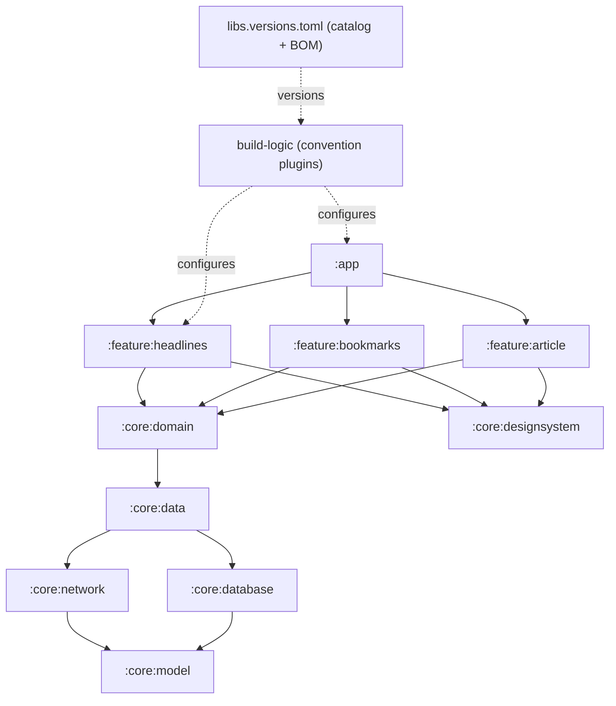

# Lesson 01 — Project & Module Setup

> After this lesson you can scaffold a multi-module Android app the way a senior would lay it out on day one — `:app`, `:core:*`, `:feature:*` — with a version catalog, convention plugins, and dependency rules that the Gradle build *enforces*, so the architecture can't rot as the team grows.

**Module:** 19 · **Lesson:** 01 · **Level:** 🟢🟡🔴 · **Est. time:** 90–120 min

---

## 1. Concept

### 🟢 For beginners — *what is it and why do I care?*

Every app you've built so far probably lived in **one module** — a single `:app` with all your screens, ViewModels, and data classes piled together. That's fine for a toy. It falls apart for a real product, because *everything can reach everything*: your login screen can accidentally call your database directly, your networking code can import a Composable, and after six months nobody can find anything.

A **multi-module** project splits the app into separate Gradle modules — independently compiled units — with **rules about who can depend on whom**. Think of it as drawing walls inside the house:

- **`:app`** — the thin shell that wires everything together and launches.
- **`:core:*`** — shared plumbing every feature reuses (networking, database, design system, common models).
- **`:feature:*`** — one folder per screen-area (e.g. `:feature:headlines`, `:feature:bookmarks`), each self-contained.

Why care on day one? Because the *first* decision — how you slice the project — is the hardest to change later. Get the walls right now and the app stays navigable, builds faster (only changed modules recompile), and lets multiple people work without stepping on each other.

For this capstone we'll build **a news client** — fetch headlines from an API, cache them in a local database, read them offline, bookmark articles, and sync in the background. This lesson lays the foundation; the next seven fill it in.

### 🟡 For intermediate devs — *the mechanism*

The 2026 standard is a **layered, feature-modularized** Gradle project (the structure popularized by Google's *Now in Android* sample). Three mechanisms make it maintainable rather than just "lots of folders":

1. **A Gradle version catalog (`libs.versions.toml`).** One file declares every dependency version and the **Compose BOM**. Modules reference `libs.androidx.room.runtime` instead of hardcoding versions, so an upgrade is a one-line change and versions can't drift between modules.

2. **Convention plugins (`build-logic`).** Instead of copy-pasting the same 40 lines of `android { … }` config into every module's `build.gradle.kts`, you write it *once* as a custom plugin (e.g. `myapp.android.library`, `myapp.android.feature`) and apply that. New modules are three lines of boilerplate.

3. **Enforced dependency direction.** Dependencies point **inward and downward**: `feature → core → (kotlin only)`. `:app` depends on features; features depend on core; core depends on nothing app-specific. Features **never** depend on each other directly. Crucially, this isn't a guideline you hope people follow — Gradle's module graph makes a forbidden import *fail to compile*.

The skeleton we produce:

```text
:app                         ← assembles + launches; depends on all features
:core:model                  ← pure Kotlin data classes (Article, …) — no Android
:core:common                 ← Result/dispatchers/utils
:core:designsystem           ← theme, Material 3 components, tokens
:core:network                ← Retrofit + DTOs
:core:database               ← Room + entities + DAOs
:core:data                   ← repositories (single source of truth)
:core:domain                 ← use cases
:feature:headlines           ← the feed screen + ViewModel
:feature:bookmarks           ← saved articles
:feature:article             ← article detail
```

### 🔴 For senior devs — *trade-offs, edges, internals*

The decisions that separate a scalable scaffold from a pile of modules:

- **Module *count* vs. build performance is a real curve, not "more is always better."** Each module has fixed overhead (configuration time, a `build.gradle.kts`, task graph nodes). Too few modules and you lose parallelism and incrementality; too many micro-modules and Gradle configuration + the sheer graph size dominate. The sweet spot for most apps is **per-feature + a handful of core modules**, not per-class. Measure with `--scan` before subdividing further.

- **`api` vs `implementation` is an architectural lever, not a style choice.** `implementation` keeps a dependency off the *consumer's* compile classpath — so `:core:data` using Room with `implementation` means features can't accidentally `import androidx.room.*`. Leaking Room or Retrofit transitively through `api` is how "the UI talks to the database directly" creeps back in. Default to `implementation`; reach for `api` only when a type genuinely crosses the module boundary (e.g. `:core:model` exposes `Article` via `api`).

- **The `:core:model` (pure Kotlin) module is load-bearing.** Keep domain models in a module with **no Android dependency** so they're shareable (KMP-ready), instantly unit-testable on the JVM, and free of `Context` leaks. DTOs (network) and entities (Room) live in their *own* modules and **map to** these models — never reuse a Retrofit DTO as your UI model.

- **Convention plugins beat `subprojects {}`/`allprojects {}` blocks.** The old root-`build.gradle` `subprojects { apply plugin … }` approach is opaque, breaks configuration-on-demand, and couples every module to the root script. `build-logic` convention plugins are explicit (each module *applies* what it is), composable, and play well with the configuration cache.

- **Turn on the heavy-hitters from the start.** **Gradle configuration cache** and **build cache** in `gradle.properties`, **non-transitive R classes** (`android.nonTransitiveRClass=true`, default now but verify), and **type-safe project accessors** (`projects.core.data` instead of stringly `project(":core:data")`). Retrofitting these into a large project later is painful; enabling them on an empty skeleton is free.

- **Enforce boundaries with tooling, not vigilance.** Beyond the dependency direction, teams add a module-graph assertion (a custom check or a tool like the *module-graph* plugin) and Konsist/lint rules so a `feature → feature` dependency is caught in CI, not in review. Architecture you don't enforce is architecture you don't have.

### Analogy

A multi-module app is an **office building**, not a one-room studio. **`:app`** is the lobby that connects everything. **`:core:*`** modules are shared infrastructure — plumbing, electrical, the elevator (everyone uses them, they don't know about any specific tenant). **`:feature:*`** modules are tenant suites: each is self-contained, a tenant can renovate theirs without touching the neighbor's, and there are **no doors between suites** — to get from one to another you go through the shared corridors (navigation), never by knocking a hole in the wall. The building code (Gradle dependency rules) is enforced by inspection, not by hoping tenants behave.

### Mental model

> **Dependencies flow one way: `:app` → `:feature:*` → `:core:*` → pure Kotlin. Features never see each other. The build, not a code review, is what enforces it.**

### Real-world example

Open-source **Now in Android** (Google) and **DroidconKotlin** are exactly this shape: a version catalog, a `build-logic` folder of convention plugins, `core:*` and `feature:*` modules, and a near-empty `:app` that just composes the navigation graph. When Google bumps the Compose BOM, it's one line in `libs.versions.toml`; when they add a feature, it's a new `:feature:*` module that the existing ones don't even know exists.

---

## 2. Visual Learning

**ASCII — the dependency direction (arrows = "depends on"):**
```text
                         ┌─────────┐
                         │  :app   │   (assembles + launches)
                         └────┬────┘
              ┌───────────────┼───────────────┐
              ▼               ▼               ▼
     ┌──────────────┐ ┌──────────────┐ ┌──────────────┐
     │:feature:     │ │:feature:     │ │:feature:     │   ✗ NO arrows
     │ headlines    │ │ bookmarks    │ │ article      │   between features
     └──────┬───────┘ └──────┬───────┘ └──────┬───────┘
            └────────────────┼────────────────┘
                             ▼
                   ┌───────────────────┐
                   │   :core:domain    │  (use cases)
                   └─────────┬─────────┘
                             ▼
                   ┌───────────────────┐
                   │    :core:data     │  (repositories = SSOT)
                   └────┬─────────┬────┘
                        ▼         ▼
            ┌───────────────┐ ┌───────────────┐
            │ :core:network │ │ :core:database│
            └───────┬───────┘ └───────┬───────┘
                    └─────────┬────────┘
                              ▼
                     ┌────────────────┐
                     │  :core:model   │  (pure Kotlin — no Android)
                     └────────────────┘
```

**Mermaid — module graph with the build-logic + catalog crosscut:**


**Illustration prompt (paste into an image generator):**
```text
Illustration: a cutaway of a modern glass office building, isometric view.
The ground-floor LOBBY is labeled ":app". A vertical SHARED-SERVICES core
(elevators, pipes, wiring) running up the middle is labeled ":core:* (network,
database, data, designsystem, model)". Three identical tenant SUITES on an upper
floor are labeled ":feature:headlines", ":feature:bookmarks", ":feature:article" —
each connected ONLY downward to the shared core, with a big red ✗ over any
imagined door between two suites. A blueprint pinned to the wall is labeled
"build-logic + version catalog". Caption: "Dependencies flow one way."
Modern, clean, vibrant, clearly labeled, soft architectural lighting.
```

---

## 3. Code (Build steps)

> Capstone code is **real build-step config**. Each tier adds a layer of rigor to the same skeleton. Kotlin 2.x + K2, Gradle Kotlin DSL, Compose BOM, AGP 8.x.

### 🟢 Beginner — declare versions once (the catalog) and a feature module

`gradle/libs.versions.toml` — the single source of truth for versions:
```toml
[versions]
agp = "8.7.0"
kotlin = "2.1.0"
composeBom = "2025.06.00"   # ← one BOM governs all Compose artifact versions
coreKtx = "1.15.0"
lifecycle = "2.9.0"
hilt = "2.52"

[libraries]
androidx-core-ktx        = { group = "androidx.core", name = "core-ktx", version.ref = "coreKtx" }
androidx-compose-bom     = { group = "androidx.compose", name = "compose-bom", version.ref = "composeBom" }
androidx-compose-ui      = { group = "androidx.compose.ui", name = "ui" }            # no version → from BOM
androidx-material3       = { group = "androidx.compose.material3", name = "material3" }
androidx-lifecycle-vm-compose = { group = "androidx.lifecycle", name = "lifecycle-viewmodel-compose", version.ref = "lifecycle" }

[plugins]
android-application = { id = "com.android.application", version.ref = "agp" }
android-library     = { id = "com.android.library", version.ref = "agp" }
kotlin-android      = { id = "org.jetbrains.kotlin.android", version.ref = "kotlin" }
kotlin-compose      = { id = "org.jetbrains.kotlin.plugin.compose", version.ref = "kotlin" }
```

A minimal **feature module** `feature/headlines/build.gradle.kts`:
```kotlin
plugins {
    alias(libs.plugins.android.library)
    alias(libs.plugins.kotlin.android)
    alias(libs.plugins.kotlin.compose)   // ← Compose compiler is a Kotlin plugin in 2.x
}

android {
    namespace = "com.example.news.feature.headlines"
    compileSdk = 35
    defaultConfig { minSdk = 24 }
    buildFeatures { compose = true }
}

dependencies {
    implementation(platform(libs.androidx.compose.bom))   // align all Compose versions
    implementation(libs.androidx.compose.ui)
    implementation(libs.androidx.material3)
    implementation(libs.androidx.lifecycle.vm.compose)
    implementation(projects.core.domain)                  // type-safe project accessor
    implementation(projects.core.designsystem)
}
```

**Explanation.** The catalog declares every version *once*; the BOM (`platform(...)`) then governs all Compose artifact versions so they're always mutually compatible. The feature module pulls in Compose + its domain/design-system dependencies — and **nothing else**. `projects.core.domain` is the type-safe accessor (enabled in `settings.gradle.kts`), so a typo is a compile error, not a runtime "module not found."

**Common mistakes.**
```kotlin
// ❌ Hardcoding versions per module — they drift, BOM is bypassed, upgrades are a hunt.
implementation("androidx.compose.material3:material3:1.3.0")
implementation("androidx.compose.ui:ui:1.7.5")   // now out of sync with material3

// ❌ Feature depending on another feature — couples them, breaks independent builds.
implementation(projects.feature.bookmarks)
```

**Best practices.**
- Every version lives in `libs.versions.toml`. Compose artifacts get **no explicit version** — let the BOM decide.
- Features depend **down** (core) and **never sideways** (other features).
- Use `projects.*` type-safe accessors over stringly `project(":...")`.

---

### 🟡 Intermediate — `settings.gradle.kts`, a pure-Kotlin core, and `api` vs `implementation`

`settings.gradle.kts` — register modules and turn on the good defaults:
```kotlin
pluginManagement {
    includeBuild("build-logic")        // ← convention plugins (next tier)
    repositories { google(); mavenCentral(); gradlePluginPortal() }
}
dependencyResolutionManagement {
    repositoriesMode = RepositoriesMode.FAIL_ON_PROJECT_REPOS
    repositories { google(); mavenCentral() }
}

enableFeaturePreview("TYPESAFE_PROJECT_ACCESSORS")   // projects.core.data

rootProject.name = "news"
include(
    ":app",
    ":core:model", ":core:common", ":core:designsystem",
    ":core:network", ":core:database", ":core:data", ":core:domain",
    ":feature:headlines", ":feature:bookmarks", ":feature:article",
)
```

`core/model/build.gradle.kts` — a **pure Kotlin/JVM** module, no Android:
```kotlin
plugins {
    alias(libs.plugins.kotlin.jvm)   // NOT android.library — no Android dependency at all
}
// No android {} block. Instantly JVM-unit-testable, KMP-ready, Context-free.
```

```kotlin
// core/model/src/main/kotlin/.../Article.kt
data class Article(
    val id: String,
    val title: String,
    val source: String,
    val publishedAt: Instant,
    val isBookmarked: Boolean = false,
)
```

`core/data/build.gradle.kts` — note the **deliberate** `api`/`implementation` split:
```kotlin
dependencies {
    api(projects.core.model)            // Article crosses the boundary → api
    implementation(projects.core.network)   // Retrofit hidden from consumers → implementation
    implementation(projects.core.database)  // Room hidden from consumers → implementation
}
```

**Explanation.** `:core:model` is a plain `kotlin.jvm` module — domain types with zero Android coupling. `:core:data` re-exports `Article` with `api` (features need that type) but keeps Room and Retrofit behind `implementation`, so a feature **physically cannot** `import androidx.room.Entity` — the architecture is enforced by the compile classpath, not by reviewer diligence. `FAIL_ON_PROJECT_REPOS` forbids per-module repositories, keeping resolution centralized.

**Common mistakes.**
```kotlin
// ❌ Re-exporting Room/Retrofit transitively — leaks data tech into every feature.
api(projects.core.database)     // now features can import Room entities directly

// ❌ Reusing a Retrofit DTO as the UI model — couples the screen to the wire format.
// (ArticleDto with @SerialName fields rendered straight in Compose)
```

**Best practices.**
- `:core:model` = pure Kotlin. DTOs and entities live in *their* modules and **map** to model types.
- `api` only for types that genuinely cross the boundary; everything else `implementation`.
- Centralize repositories with `RepositoriesMode.FAIL_ON_PROJECT_REPOS`.

---

### 🔴 Production — convention plugins, build flags, and an enforced module graph

`build-logic/convention/build.gradle.kts` registers reusable plugins:
```kotlin
plugins { `kotlin-dsl` }

gradlePlugin {
    plugins {
        register("androidLibrary") {
            id = "myapp.android.library"
            implementationClass = "AndroidLibraryConventionPlugin"
        }
        register("androidFeature") {
            id = "myapp.android.feature"
            implementationClass = "AndroidFeatureConventionPlugin"
        }
        register("androidCompose") {
            id = "myapp.android.compose"
            implementationClass = "AndroidComposeConventionPlugin"
        }
    }
}
```

`AndroidLibraryConventionPlugin.kt` — write the shared config **once**:
```kotlin
class AndroidLibraryConventionPlugin : Plugin<Project> {
    override fun apply(target: Project) = with(target) {
        with(pluginManager) {
            apply("com.android.library")
            apply("org.jetbrains.kotlin.android")
        }
        extensions.configure<LibraryExtension> {
            compileSdk = 35
            defaultConfig { minSdk = 24 }
            compileOptions { sourceCompatibility = JavaVersion.VERSION_17; targetCompatibility = JavaVersion.VERSION_17 }
        }
        // Common test deps, Kotlin compiler args, etc. — defined in ONE place.
    }
}
```

Now every feature's build file collapses to:
```kotlin
plugins {
    alias(libs.plugins.myapp.android.feature)   // brings library + compose + lifecycle + nav
}
android { namespace = "com.example.news.feature.headlines" }
dependencies {
    implementation(projects.core.domain)
    implementation(projects.core.designsystem)
}
```

`gradle.properties` — production build performance + correctness:
```properties
org.gradle.caching=true
org.gradle.configuration-cache=true
org.gradle.parallel=true
android.nonTransitiveRClass=true
android.useAndroidX=true
kotlin.code.style=official
```

**Explanation.** The convention plugin is *the* scalability win: shared Android/Kotlin/Compose config lives in one class, so a 15-module app stays consistent and new modules are three lines. The `gradle.properties` flags enable **configuration cache** (skips configuration on unchanged builds), **build cache** (reuses task outputs), **parallel** execution, and **non-transitive R classes** (each module gets only its own resources — faster, fewer namespace collisions). Together these turn a slow multi-module build into a fast one.

**Common mistakes.**
```kotlin
// ❌ The old root-build.gradle approach — opaque, configuration-cache-hostile.
subprojects {
    apply(plugin = "com.android.library")   // every module configured from the root, magically
    apply(plugin = "kotlin-android")
}
```
```text
// ❌ No enforcement: a feature→feature dependency sneaks in and nobody notices until
//    the build graph is a tangled web. Add a CI module-graph assertion to fail it.
```

**Best practices.**
- Shared module config → **convention plugins** in `build-logic`, never `subprojects {}`.
- Enable configuration cache, build cache, parallel, and non-transitive R classes on day one.
- **Enforce** the dependency direction in CI (module-graph assertion / Konsist), so boundaries are checked, not hoped for.
- Pin everything through the version catalog + BOM; upgrades become one-line diffs.

---

## 4. Interview Questions

**🟢 Beginner**

1. *Why split an Android app into multiple Gradle modules instead of one `:app`?*
   > For separation of concerns (enforced boundaries between features and shared code), faster incremental builds (only changed modules recompile), and parallel teamwork. A single module lets everything depend on everything, which doesn't scale.
2. *What is a Gradle version catalog and what problem does it solve?*
   > `libs.versions.toml` centralizes dependency coordinates and versions in one file. It stops version drift across modules and makes upgrades a one-line change; combined with the Compose BOM, it keeps Compose artifacts mutually compatible.

**🟡 Intermediate**

3. *What's the difference between `api` and `implementation`, and why does it matter for architecture?*
   > `implementation` keeps a dependency off the consumer's compile classpath; `api` exposes it transitively. Architecturally, using `implementation` for Room/Retrofit inside `:core:data` means features *cannot* import those libraries — the module boundary is enforced by the compiler. Use `api` only for types that genuinely cross the boundary (e.g. `Article`).
4. *Why keep domain models in a pure-Kotlin module instead of reusing your Retrofit DTOs or Room entities?*
   > A pure-Kotlin `:core:model` has no Android dependency, so it's instantly JVM-testable, KMP-shareable, and Context-free. DTOs and entities are tied to the wire/storage format; mapping them to independent model types decouples the UI from those formats and lets each evolve separately.

**🔴 Senior**

5. *What are convention plugins and why prefer them over `subprojects {}`/`allprojects {}`?*
   > Convention plugins (in `build-logic`) package shared build configuration as a reusable Gradle plugin each module *applies*. Versus `subprojects {}`, they're explicit (a module declares what it is), composable, configuration-cache-friendly, and don't couple every module to the root script. They're the standard way to keep a large multi-module build DRY.
6. *How do you stop the module architecture from rotting as the team grows — e.g. a sneaky `feature → feature` dependency?*
   > Enforcement, not vigilance: the dependency *direction* is already constrained by what each module declares, but add an automated check in CI — a module-graph assertion (or a tool like the module-graph plugin / Konsist rule) that fails the build on forbidden edges. Pair with `implementation`-by-default so tech can't leak transitively. Architecture you don't enforce in CI is architecture you'll lose.

---

## 5. AI Assistant

**Prompt example (scaffolding the skeleton):**
```text
Scaffold a multi-module Android project (Kotlin 2.1, AGP 8.7, Gradle Kotlin DSL) for a news
client. Modules: :app, :core:model (pure kotlin-jvm), :core:network, :core:database, :core:data,
:core:domain, :core:designsystem, :feature:headlines, :feature:bookmarks, :feature:article.
Requirements: a gradle/libs.versions.toml version catalog using the Compose BOM; type-safe
project accessors; convention plugins in build-logic for android.library / android.feature /
android.compose. Dependency rule: features depend only on :core:*, never on each other; keep
Room and Retrofit behind `implementation` in :core:data. Output settings.gradle.kts, the catalog,
one convention plugin, and one feature build.gradle.kts.
```

**AI workflow — where it helps on *this* topic.**
- ✅ Great for: generating the boilerplate (catalog entries, `settings.gradle.kts` includes, convention-plugin classes, per-module `build.gradle.kts`), and migrating hardcoded versions into a catalog.
- ⚠️ Not for: deciding your **module boundaries** — how to slice features is a product/architecture judgment the model can't make for you. It will also happily emit hardcoded versions, `api`-leak data libraries, and `subprojects {}` blocks if you don't constrain it.

**Review workflow — check AI output against this lesson's *Common Mistakes*:**
- Are all versions in the catalog, with **no explicit version** on Compose artifacts (BOM governs them)?
- Is `:core:model` a **pure `kotlin.jvm`** module (no `android {}` block)?
- Are Room/Retrofit behind `implementation` in `:core:data` (not `api`-leaked)?
- Any **`feature → feature`** dependency? Any `subprojects {}` instead of convention plugins?
- Are configuration cache / build cache / non-transitive R classes enabled?

**Validation workflow — prove it actually works:**
1. `./gradlew help --configuration-cache` — confirms the configuration cache serializes (catches CC-hostile config).
2. `./gradlew :app:dependencies --configuration compileClasspath` — verify features don't pull in Room/Retrofit transitively.
3. Try to `import androidx.room.Entity` inside a feature module — it should **fail to compile** (proves the boundary holds).
4. `./gradlew build --scan` — read the build scan to confirm parallelism and find configuration-time hotspots before adding more modules.

> **AI drafts, you decide.** The model can lay the bricks; *you* decide where the walls go. A scaffold that compiles but lets features import each other has failed the only test that matters here.

---

## Recap / Key takeaways

- A production app is **multi-module**: a thin `:app`, shared `:core:*`, and self-contained `:feature:*` — with dependencies flowing **one way** and features never depending on each other.
- A **version catalog + Compose BOM** centralizes versions so upgrades are one-line and Compose artifacts stay compatible.
- **`api` vs `implementation`** is an architectural lever: keep data tech (Room/Retrofit) behind `implementation` so the boundary is compiler-enforced.
- **Convention plugins** in `build-logic` keep the build DRY and configuration-cache-friendly — never `subprojects {}`.
- Turn on **configuration cache, build cache, parallel, and non-transitive R classes** from the start, and **enforce** the module graph in CI.

➡️ Next: **[Lesson 02 — Data Layer](02-data-layer.md)** — Room + Retrofit + a repository that's the single source of truth, mapping DTOs and entities to your pure-Kotlin models.
