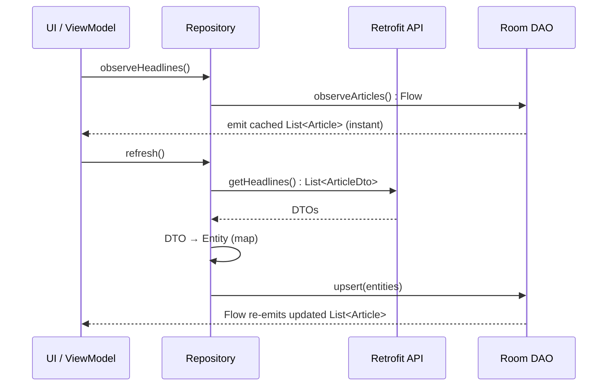

# Lesson 02 — Data Layer (Room + Retrofit + Repository)

> After this lesson you can build the data layer of a real app: a Retrofit API, a Room database, and a repository that makes the **local database the single source of truth** — so the UI reads instantly from cache, the network only refreshes it, and the app works offline by default.

**Module:** 19 · **Lesson:** 02 · **Level:** 🟢🟡🔴 · **Est. time:** 110–130 min

---

## 1. Concept

### 🟢 For beginners — *what is it and why do I care?*

The data layer is the part of the app that **gets data and stores it** — everything below the screens. It has two jobs: talk to the **internet** (fetch news headlines from an API) and talk to the **device's storage** (save them so they're there next time, even with no signal).

Two libraries do the heavy lifting:

- **Retrofit** turns a remote HTTP API into Kotlin functions. You describe the endpoint (`GET /headlines`) and Retrofit handles the networking and JSON parsing.
- **Room** is a database that lives on the phone. It turns Kotlin objects into rows in a local SQLite table and back, with compile-time-checked queries.

Sitting on top of both is the **repository** — the one object the rest of the app asks for data. Here's the key idea that makes a good app feel fast: the repository serves the UI from the **local database**, not the network. When you open the news screen, the headlines appear *instantly* from Room. Behind the scenes, the repository asks the API "anything new?" and, when it gets an answer, updates Room — and because the screen is *watching* Room, it refreshes automatically.

This means **no infinite spinners** and **the app works on the subway**. The database is the truth; the network is just a way to keep that truth fresh.

### 🟡 For intermediate devs — *the mechanism*

The pattern is **single source of truth (SSOT)**: the database is authoritative, the network feeds it, and the UI only ever observes the database.

```text
   UI ──collects──▶ repository.observeHeadlines(): Flow<List<Article>>
                          │
                          └─▶ dao.observeArticles(): Flow<List<ArticleEntity>>   (reads = always local)

   repository.refresh()  ──▶ api.getHeadlines() ──map──▶ dao.upsert(entities)
                          (the Room Flow re-emits automatically → UI updates)
```

The moving parts:

- **Three data shapes, deliberately separate.** `ArticleDto` (Retrofit, matches the JSON wire format), `ArticleEntity` (Room, matches the table), and `Article` (pure-Kotlin domain model the rest of the app uses). **Mappers** convert between them. Yes, it's three types for "an article" — that decoupling is what lets the API, the DB schema, and the UI evolve independently.
- **Reads return `Flow`.** `dao.observeArticles(): Flow<List<ArticleEntity>>`. Room re-emits whenever the table changes, so a refresh that writes new rows pushes them to the UI with no extra wiring.
- **The repository exposes domain types.** It maps entities → `Article` so callers never see Room or Retrofit. (`:core:data` keeps both behind `implementation`, from Lesson 01.)
- **Errors are modeled, not thrown blindly.** A `Result`-style wrapper (or sealed `NetworkResult`) lets refresh report success/failure without crashing the read stream.

The standard JSON stack in 2026 is **Retrofit + the `kotlinx.serialization` converter** (`Retrofit2KotlinxSerializationConverterFactory`), with `@Serializable` DTOs.

### 🔴 For senior devs — *trade-offs, edges, internals*

- **SSOT means reads and writes are asymmetric — and that asymmetry is the whole design.** Reads *always* come from Room (`Flow`); writes go network→Room or user→Room→queue. The moment a screen calls `api.getX()` directly for display, offline breaks and you get two sources of truth that disagree. Audit for direct API reads first when "offline is broken."

- **`upsert` + stable primary keys make refresh idempotent.** Refresh should be safe to run repeatedly: use `@Upsert` (or `@Insert(onConflict = REPLACE)`) keyed on a **stable server id**, so re-fetching the same headline updates the row instead of duplicating it. Without a stable key you get duplicates on every pull-to-refresh. Beware `REPLACE` with foreign keys — it deletes+reinserts and can cascade; `@Upsert` is usually safer.

- **Transactions for multi-step writes.** "Clear old + insert new" or "insert articles + their authors" must be atomic via `@Transaction`, or a crash mid-write leaves the DB inconsistent (half-updated feed). Room runs a suspending `@Transaction` function on a single connection.

- **Main-safety is Room/Retrofit's job *and* yours.** `suspend` DAO functions and Retrofit `suspend` calls are main-safe (they switch off the main thread internally). But your **mappers and any heavy transforms** are not — keep them light, or move them to `Dispatchers.Default`. Never block; never do disk/network on `Dispatchers.Main`.

- **`distinctUntilChanged` and query stability.** Room emits on *any* table write, even one that didn't change your query's result. For expensive downstream work, add `.distinctUntilChanged()` so identical emissions don't re-trigger UI/derived computation. Also prefer `@Query` returning exactly the columns you need (a `@DatabaseView` or projection) over `SELECT *` for wide tables.

- **Error taxonomy: transient vs permanent.** A repository refresh must distinguish a retryable failure (timeout, 503, no network) from a permanent one (400, 404, parse error). This classification later drives WorkManager's `Result.retry()` vs `Result.failure()` (Lesson 06) and the UI's "tap to retry" vs "this is gone." Collapsing all errors into one `catch` throws that information away.

- **DTO ≠ entity ≠ model is non-negotiable at scale.** Reusing a Retrofit DTO as your Room entity *and* UI model feels DRY for a week, then the API renames a field and your schema migration + every screen break at once. The three-type split localizes each change to one mapper. The cost is boilerplate; the benefit is that the wire format, storage schema, and UI contract are independent.

### Analogy

Think of a **library with a fast front desk**. You (the UI) always ask the **local front desk** (Room) for a book — instant, even when the central catalog is unreachable. A **courier** (Retrofit) periodically brings new books from the **central archive** (the API) and the front desk **shelves** them (upsert). You never wait for the courier; you read what's on the local shelves *now*, and the shelves quietly stay current. The **librarian** (repository) is the only person you talk to — you never go rummaging in the archive yourself, and you never see the courier's packing slips (DTOs) or the shelf-label format (entities), only the book (the domain model).

### Mental model

> **The database is the truth the UI reads; the network is a courier that refreshes it. Reads are a `Flow` from Room; refresh is fetch → map → upsert. Three types (DTO/entity/model) keep wire, storage, and UI independent.**

### Real-world example

Any serious feed app — **Reddit, Twitter/X, a banking transactions list** — works this way. Open the app on a plane and you see your last-loaded feed instantly (from the local DB). Regain signal and new items appear without you doing anything, because the UI observes the database and a background refresh upserted fresh rows. The list never blanks to a spinner just because the network blinked.

---

## 2. Visual Learning

**ASCII — single source of truth, reads vs. refresh:**
```text
   ┌──────────────┐   observe (Flow)   ┌──────────────────────────┐
   │   UI / VM    │ ◀───────────────── │  Repository              │
   └──────────────┘                    │   observeHeadlines()     │
          ▲  collects                  │      └─ DAO.observe()  ───┼──▶ ┌──────────┐
          │  (always local)            │                          │     │  Room    │
          │                            │   refresh():             │ ◀── │ (truth)  │
          │   re-emits on write        │     api.getHeadlines()   │ up- └──────────┘
          └────────────────────────────┤        .map { entity }   │ sert    ▲
                                        │        DAO.upsert(...) ──┼─────────┘
                                        └───────────┬──────────────┘
                                                    │ fetch (network only)
                                                    ▼
                                             ┌──────────────┐
                                             │  Retrofit    │──▶ REST API
                                             │  (DTOs)      │
                                             └──────────────┘
```

**Mermaid — the three types and the flow of a refresh:**


**Illustration prompt:**
```text
Illustration: a tidy public library, cross-section view. A patron at a fast FRONT DESK
labeled "Room (local, instant)" receives a book immediately. Behind the desk, a COURIER
labeled "Retrofit" wheels a cart of new books from a distant CENTRAL ARCHIVE labeled
"REST API", and a librarian SHELVES them (an "upsert" label on the shelf). Three small
tags float near a single book: "DTO (packing slip)", "Entity (shelf label)", "Article
(the book itself)" with little arrows showing one converting to the next. The patron
never walks to the archive (a faint dotted ✗ on that path). Caption: "The database is
the truth; the network refreshes it." Warm, modern, clearly labeled.
```

---

## 3. Code (Build steps)

> Build the news app's data layer across `:core:network`, `:core:database`, and `:core:data`. 2026 stack: Retrofit + `kotlinx.serialization` converter, Room (KSP), Coroutines/Flow.

### 🟢 Beginner — a Retrofit API and a Room entity/DAO

`:core:network` — the API and its DTO:
```kotlin
@Serializable
data class ArticleDto(
    val id: String,
    val title: String,
    val source: String,
    @SerialName("published_at") val publishedAt: String,   // wire format: ISO-8601 string
)

interface NewsApi {
    @GET("headlines")
    suspend fun getHeadlines(): List<ArticleDto>   // suspend → main-safe; Retrofit parses JSON
}
```

`:core:database` — the entity and DAO:
```kotlin
@Entity(tableName = "articles")
data class ArticleEntity(
    @PrimaryKey val id: String,        // stable server id → upsert is idempotent
    val title: String,
    val source: String,
    val publishedAtEpoch: Long,        // store as epoch millis (sortable, timezone-safe)
    val isBookmarked: Boolean = false,
)

@Dao
interface ArticleDao {
    @Query("SELECT * FROM articles ORDER BY publishedAtEpoch DESC")
    fun observeArticles(): Flow<List<ArticleEntity>>   // reads = Flow from the local DB

    @Upsert
    suspend fun upsert(articles: List<ArticleEntity>)   // insert-or-update on conflict
}
```

**Explanation.** The DTO mirrors the JSON exactly (note `published_at` as a string). The entity mirrors the table and uses the **server id as the primary key**, so re-fetching updates rather than duplicates. `observeArticles()` returns a `Flow` — Room pushes a new list whenever the table changes. `suspend` on the API and `upsert` keeps them off the main thread automatically.

**Common mistakes.**
```kotlin
// ❌ Blocking read instead of a Flow — the UI can't react to refreshes.
@Query("SELECT * FROM articles")
suspend fun getArticlesOnce(): List<ArticleEntity>   // one-shot; screen won't auto-update

// ❌ No stable primary key (autogenerate) → every refresh inserts duplicate rows.
@PrimaryKey(autoGenerate = true) val rowId: Long = 0
```

**Best practices.**
- Reads that drive the UI return **`Flow`**; one-shot reads only for explicit "load once" needs.
- Use the **stable server id** as the primary key so refresh is idempotent (`@Upsert`).
- Store timestamps as epoch millis, not formatted strings — sortable and unambiguous.

---

### 🟡 Intermediate — mappers and a repository that is the SSOT

Mappers keep the three types independent (`:core:data`):
```kotlin
// DTO → Entity (parse wire format into storage shape)
fun ArticleDto.toEntity() = ArticleEntity(
    id = id,
    title = title,
    source = source,
    publishedAtEpoch = Instant.parse(publishedAt).toEpochMilli(),
)

// Entity → domain model (what the rest of the app sees)
fun ArticleEntity.toModel() = Article(
    id = id,
    title = title,
    source = source,
    publishedAt = Instant.ofEpochMilli(publishedAtEpoch),
    isBookmarked = isBookmarked,
)
```

The repository — database is the source of truth:
```kotlin
interface NewsRepository {
    fun observeHeadlines(): Flow<List<Article>>
    suspend fun refresh(): Result<Unit>
}

class DefaultNewsRepository(
    private val api: NewsApi,
    private val dao: ArticleDao,
) : NewsRepository {

    // Reads ALWAYS come from Room, mapped to domain models.
    override fun observeHeadlines(): Flow<List<Article>> =
        dao.observeArticles().map { entities -> entities.map(ArticleEntity::toModel) }

    // Refresh: fetch → map → upsert. The Flow above re-emits automatically.
    override suspend fun refresh(): Result<Unit> = runCatching {
        val dtos = api.getHeadlines()
        dao.upsert(dtos.map(ArticleDto::toEntity))
    }
}
```

**Explanation.** Three types, two mappers, one rule: **the UI observes Room**. `observeHeadlines()` never touches the network — it maps the DAO's `Flow` to domain models. `refresh()` is the *only* thing that calls the API, and it just writes into Room; the observing `Flow` does the rest. `runCatching` turns a thrown network error into a `Result.failure` so the read stream is never broken by a failed refresh.

**Common mistakes.**
```kotlin
// ❌ Reading from the network for display — defeats SSOT, breaks offline.
override fun observeHeadlines(): Flow<List<Article>> = flow {
    emit(api.getHeadlines().map { it.toEntity().toModel() })   // no cache, fails with no signal
}

// ❌ Leaking entities/DTOs to callers — couples the UI to Room/Retrofit.
fun observeHeadlines(): Flow<List<ArticleEntity>>   // should expose Article (domain)
```

**Best practices.**
- The repository exposes **domain models**, never entities or DTOs.
- **Reads from Room, writes via refresh.** The UI subscribes once; refreshes flow through automatically.
- Wrap refresh in `runCatching`/`Result` so a failed network call doesn't kill the cache stream.

---

### 🔴 Production — transactions, error taxonomy, migrations, and main-safety

The database with a real config:
```kotlin
@Database(entities = [ArticleEntity::class], version = 2, exportSchema = true)
abstract class NewsDatabase : RoomDatabase() {
    abstract fun articleDao(): ArticleDao
}

// A real, tested migration (NEVER ship fallbackToDestructiveMigration in prod).
val MIGRATION_1_2 = object : Migration(1, 2) {
    override fun migrate(db: SupportSQLiteDatabase) {
        db.execSQL("ALTER TABLE articles ADD COLUMN isBookmarked INTEGER NOT NULL DEFAULT 0")
    }
}
```

An atomic "replace the feed" + a classified-error refresh:
```kotlin
@Dao
interface ArticleDao {
    @Query("SELECT * FROM articles ORDER BY publishedAtEpoch DESC")
    fun observeArticles(): Flow<List<ArticleEntity>>

    @Upsert suspend fun upsert(articles: List<ArticleEntity>)
    @Query("DELETE FROM articles WHERE isBookmarked = 0") suspend fun clearNonBookmarked()

    @Transaction                                   // atomic: both run or neither does
    suspend fun replaceFeed(fresh: List<ArticleEntity>) {
        clearNonBookmarked()
        upsert(fresh)
    }
}
```
```kotlin
sealed interface DataError { data object Network : DataError; data object Server : DataError; data class Unknown(val t: Throwable) : DataError }

override suspend fun refresh(): Result<Unit> = withContext(Dispatchers.Default) {
    runCatching {
        val dtos = api.getHeadlines()                 // suspend = main-safe
        dao.replaceFeed(dtos.map(ArticleDto::toEntity))  // mapping on Default, off main
    }.recoverCatching { e ->
        throw when (e) {
            is IOException -> DataException(DataError.Network)        // transient → retry later
            is HttpException -> if (e.code() in 500..599) DataException(DataError.Server)
                                 else DataException(DataError.Unknown(e))   // 4xx = permanent
            else -> DataException(DataError.Unknown(e))
        }
    }
}
```

**Explanation.** `@Transaction` makes "clear old + insert fresh" atomic — a crash mid-refresh can't leave a half-feed. The error mapping classifies failures into **transient** (network/5xx → safe to retry, drives WorkManager's `Result.retry()` later) vs **permanent** (4xx → don't retry). `exportSchema = true` + a real `Migration` means upgrades don't nuke user data — `fallbackToDestructiveMigration()` is a data-loss bug in production. `withContext(Dispatchers.Default)` keeps the (light) mapping off the main thread; the DAO/API calls are already main-safe.

**Common mistakes.**
```kotlin
// ❌ Destructive migration in prod — wipes the user's bookmarks on every schema bump.
Room.databaseBuilder(ctx, NewsDatabase::class.java, "news.db")
    .fallbackToDestructiveMigration()   // ☠️ data loss

// ❌ Swallowing all errors into one bucket — can't tell "retry" from "this is gone".
runCatching { api.getHeadlines() }.getOrDefault(emptyList())  // silent, untyped failure
```

**Best practices.**
- Multi-step writes go in a `@Transaction`; **classify** errors (transient vs permanent) for retry logic and UI.
- **Real migrations**, `exportSchema = true`, schema in version control; never `fallbackToDestructiveMigration` in release builds.
- Keep mappers/transforms light and off the main thread; trust `suspend` DAO/Retrofit for main-safety, don't add redundant `withContext(IO)` around them.
- Add `.distinctUntilChanged()` downstream when identical Room emissions would trigger expensive work.

---

## 4. Interview Questions

**🟢 Beginner**

1. *What does "single source of truth" mean in a data layer?*
   > One authoritative place the UI reads from — the local database (Room). The network only writes into that database; the UI never reads from the network directly. This makes the app fast (instant cache) and offline-capable.
2. *Why do reads return a `Flow` from Room instead of a one-shot `suspend` function?*
   > A `Flow` lets Room push new data whenever the table changes. So when a background refresh upserts new rows, the UI updates automatically without any extra wiring; a one-shot read would need manual re-fetching.

**🟡 Intermediate**

3. *Why have three separate types — DTO, entity, and domain model — for "an article"?*
   > To decouple the wire format (DTO/Retrofit), the storage schema (entity/Room), and the UI contract (domain model). Each can change independently; a renamed JSON field only touches one mapper instead of breaking the DB schema and every screen. Mappers convert between them.
4. *How do you make a `refresh()` idempotent so pull-to-refresh doesn't create duplicates?*
   > Use the **stable server id** as the entity's primary key and `@Upsert` (or `INSERT … ON CONFLICT REPLACE`). Re-fetching the same item updates the existing row instead of inserting a new one.

**🔴 Senior**

5. *Why and how would you classify errors in the repository's refresh?*
   > To distinguish **transient** failures (timeout, no network, 5xx — safe to retry) from **permanent** ones (4xx, parse error — retrying is futile). This classification drives WorkManager's `Result.retry()` vs `Result.failure()` and the UI's "tap to retry" vs "this content is gone." Collapsing everything into one `catch` discards that signal. Map `IOException`/`HttpException` codes into a sealed `DataError`.
6. *What are the risks of `fallbackToDestructiveMigration()` and how do you handle schema changes properly?*
   > It **deletes and recreates** the database on a version mismatch — wiping user data (bookmarks, drafts) on every schema bump. Instead, write and test explicit `Migration` objects, set `exportSchema = true`, commit the schema JSON, and add Room's `MigrationTestHelper` tests so upgrades preserve data. Destructive migration is only acceptable for throwaway caches you can rebuild.

---

## 5. AI Assistant

**Prompt example (generating the data layer):**
```text
Generate the data layer for a news app in a multi-module project (Kotlin 2.1, Coroutines/Flow).
- :core:network → a Retrofit NewsApi with `suspend getHeadlines(): List<ArticleDto>` using
  kotlinx.serialization (@Serializable DTOs).
- :core:database → Room ArticleEntity (stable String id PK), ArticleDao with
  `observeArticles(): Flow<List<ArticleEntity>>` and `@Upsert`, plus a @Transaction replaceFeed().
- :core:data → mappers (DTO→Entity, Entity→Article domain model) and a NewsRepository where
  observeHeadlines() reads from Room and refresh() does fetch→map→upsert, returning Result.
Keep three distinct types (DTO/Entity/Article). Do NOT read the network for display. Classify
refresh errors into transient vs permanent.
```

**AI workflow — where it helps on *this* topic.**
- ✅ Great for: the repetitive bits — DTOs from a sample JSON, entity/DAO pairs, the mapper functions, the repository skeleton, and Room migration scaffolding.
- ⚠️ Not for: deciding your **schema and conflict strategy**, or trusting its migrations blindly. Models frequently merge DTO/entity/model into one class, read the network for display, and emit `fallbackToDestructiveMigration()` — all of which fail in production.

**Review workflow — check AI output against this lesson's *Common Mistakes*:**
- Are **DTO, entity, and domain model distinct**, with mappers between them?
- Does `observeHeadlines()` read **only from Room** (never the API)? Does the repo expose **domain models**, not entities?
- Is there a **stable primary key** + `@Upsert` (idempotent refresh), and `@Transaction` for multi-step writes?
- Real **migrations** (no `fallbackToDestructiveMigration` in release)? Errors **classified** (transient vs permanent)?

**Validation workflow — prove it actually works:**
1. Compile and run; open the screen with **airplane mode on** after one online load — cached headlines must still appear (proves SSOT).
2. Pull-to-refresh repeatedly — row count stays stable (proves idempotent upsert, no duplicates).
3. Unit-test the repository with a fake `NewsApi` + in-memory Room (`Room.inMemoryDatabaseBuilder`); assert `observeHeadlines()` emits after `refresh()`.
4. Add a **Room `MigrationTestHelper`** test for `MIGRATION_1_2` and confirm bookmarks survive the upgrade.
5. Use **Turbine** to assert the `Flow` re-emits exactly once per meaningful change (add `.distinctUntilChanged()` if it over-emits).

> **AI drafts, you decide.** The model writes plausible Room/Retrofit code in seconds — but "plausible" includes the exact patterns (one shared type, network reads, destructive migrations) that quietly break offline support and lose user data. Route every generated data layer through the SSOT checklist.

---

## Recap / Key takeaways

- The data layer = **Retrofit (network) + Room (storage) + repository (SSOT)**; the **database is the truth**, the network only refreshes it.
- **Reads return a `Flow` from Room**; `refresh()` is the only network caller and just does **fetch → map → upsert**, after which the `Flow` re-emits automatically.
- Keep **three distinct types** — DTO, entity, domain model — with mappers, so wire/storage/UI evolve independently.
- Use a **stable primary key + `@Upsert`** for idempotent refresh, `@Transaction` for atomic multi-step writes, and **classify errors** (transient vs permanent).
- Ship **real migrations** with `exportSchema = true`; never `fallbackToDestructiveMigration()` in production.

➡️ Next: **[Lesson 03 — Domain Layer](03-domain-layer.md)** — use cases and domain models that hold business rules, sitting cleanly between the data layer and the UI.
