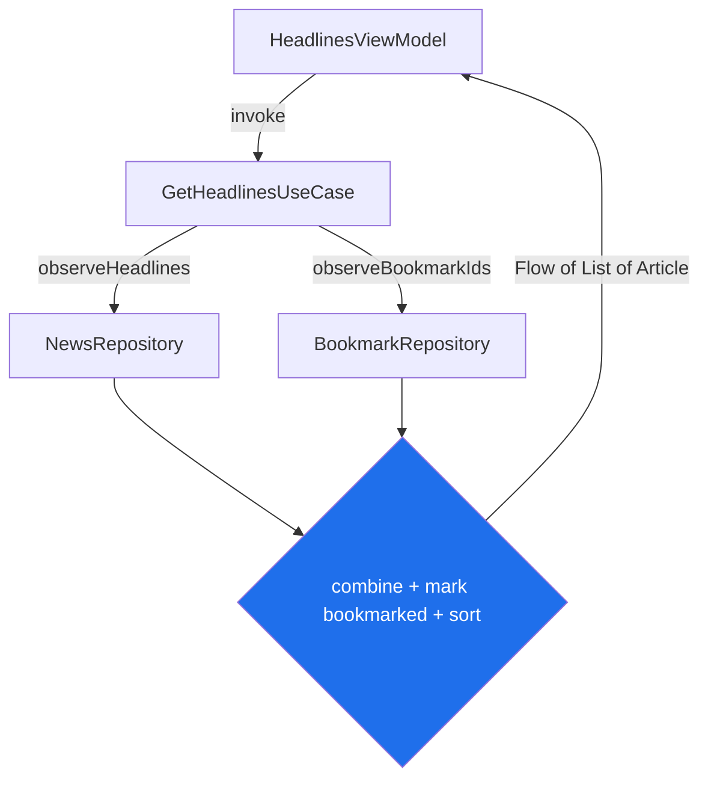

# Lesson 03 — Domain Layer (Use Cases + Models)

> After this lesson you can add a domain layer to the app: pure-Kotlin **use cases** that hold business rules, combine multiple repositories, and give the UI a clean, testable entry point — so ViewModels stay thin and logic isn't duplicated across screens.

**Module:** 19 · **Lesson:** 03 · **Level:** 🟢🟡🔴 · **Est. time:** 80–100 min

---

## 1. Concept

### 🟢 For beginners — *what is it and why do I care?*

So far we have a **data layer** (gets and stores data) and we're about to build a **UI layer** (shows it). The **domain layer** is the thin slice in between that holds the app's **rules** — the "what should actually happen" logic that isn't about networking *or* about pixels.

The star of the domain layer is the **use case** (also called an *interactor*): a small class that does **one business action**. Examples for our news app:

- `GetHeadlinesUseCase` — get the headlines (maybe filtered, maybe sorted a certain way).
- `ToggleBookmarkUseCase` — bookmark or un-bookmark an article (and enforce "you can save at most 50").
- `SearchArticlesUseCase` — search across headlines.

Why care? Imagine "an article counts as *unread* only if it's newer than the user's last-seen time." Without a domain layer, that rule gets copy-pasted into the headlines screen, the search screen, and the widget — and the day it changes, you fix it in three places and miss one. With a use case, the rule lives in **one** place that every screen calls. The UI gets simpler ("call the use case"), the rule gets testable (it's plain Kotlin), and nothing is duplicated.

### 🟡 For intermediate devs — *the mechanism*

The domain layer sits between data and UI and depends **only on abstractions** (repository interfaces), never on Room/Retrofit:

```text
   UI (ViewModel) ──calls──▶ UseCase ──calls──▶ Repository interface ──▶ (data layer)
                              (business rules)     (no Android, no I/O detail)
```

Conventions that make use cases ergonomic in Kotlin:

- **`operator fun invoke(...)`** so a use case is *callable like a function*: `getHeadlines()` instead of `getHeadlines.execute()`. The class name documents the action.
- **One public action per use case.** It either returns a `Flow` (observe) or is a `suspend` one-shot (do something), and it returns **domain models**.
- **Constructor-injected dependencies** (repositories, maybe other use cases). Use cases are tiny and stateless, so they're trivial to construct in tests with fakes.
- **They live in `:core:domain`**, which depends on `:core:data` (for repository interfaces) and `:core:model` — and is itself pure Kotlin / Android-free where possible.

A common question: *do I need a use case for everything?* No — a use case earns its place when there's **real logic** (combining sources, a rule, a transformation) or when **multiple screens share** the action. A pass-through that just calls one repository method is often noise (more on that in 🔴).

### 🔴 For senior devs — *trade-offs, edges, internals*

- **Use cases are optional, and dogma here costs you.** The classic counter-argument: a `GetXUseCase` that does nothing but `repo.getX()` is a ceremonial pass-through — it adds a file, an injection, and indirection for zero logic. The honest rule: **add a use case when it carries business logic, orchestrates multiple repositories, or is reused across features.** For a one-liner used by one screen, calling the repository from the ViewModel is fine. Mandating a use case per repository method is cargo-culting Clean Architecture.

- **Orchestration is the real value.** The use cases that *earn* their keep combine sources: `combine(headlinesFlow, bookmarkIdsFlow) { … }` to mark which articles are bookmarked, or "fetch from repo A, enrich with repo B." This logic doesn't belong in the repository (which should stay single-responsibility per data source) *or* the ViewModel (which would then duplicate it across screens). The domain layer is its natural home.

- **Threading: use cases declare intent, not dispatchers (mostly).** A suspend use case should be **main-safe by composition** — its repository calls already switch threads. If a use case itself does CPU-heavy work (sorting 10k items, parsing), *it* wraps that in `withContext(Dispatchers.Default)` — the rule is "the function that does the heavy work owns the `withContext`," not the caller. Don't sprinkle `withContext(IO)` defensively around already-main-safe calls.

- **Return types: domain results, not framework types.** A use case returns `Flow<List<Article>>` or `Result<Unit>` — never `Response<…>`, a Room entity, or a `LiveData`. If it can fail in a way the UI must handle, model that with a sealed result; don't leak `HttpException`.

- **Use cases compose.** A `RefreshAndGetHeadlinesUseCase` can depend on a `RefreshHeadlinesUseCase` and a `GetHeadlinesUseCase`. Keep them small and composable rather than building one god-interactor. This also keeps each independently testable.

- **`:core:domain` purity is a deliberate constraint.** Keeping it Android-free (no `Context`, no Android types) makes the whole business-rule layer **JVM-unit-testable in milliseconds** and KMP-shareable. The moment a `Context` sneaks in, you've coupled your rules to the platform and slowed every test. Repository *interfaces* live where the domain can see them; their Android implementations stay in `:core:data`.

- **Invokable single-responsibility classes vs. a "service" object.** Resist the temptation to make one `NewsInteractor` with 12 methods — that's a mini-God-object that every screen over-depends on. Many small `operator fun invoke` use cases keep dependencies precise (a ViewModel injects exactly the 2 actions it needs) and the change-blast-radius small.

### Analogy

The domain layer is the **kitchen of a restaurant**. The **data layer** is the pantry and the suppliers (raw ingredients — articles from the API and DB). The **UI** is the dining room (plating and presentation). The **use cases are the recipes**: each one is a single, well-defined dish ("make the bookmark toggle," "assemble the filtered feed") that follows the house rules (no more than 50 bookmarks, unread = newer-than-last-seen). The waiter (ViewModel) doesn't know how to cook — they call out an order (`invoke`) and the kitchen applies the recipe consistently, whether the order came from table 1 (headlines screen) or table 5 (search screen). Change the recipe once, and every table gets the new version.

### Mental model

> **A use case is one business action as a callable object. It holds the rule, orchestrates repositories, returns domain types — so the ViewModel just asks, and the rule lives in exactly one place. Add one when there's logic; skip it for a bare pass-through.**

### Real-world example

A fitness app's `CalculateDailyGoalUseCase` combines the user's profile, today's steps, and a streak bonus into one number shown on three surfaces (home, the widget, the watch face). The rule for "what counts as goal met" lives in that single use case; all three surfaces call it. When product changes the formula, one file changes and every surface updates — the textbook reason the domain layer exists.

---

## 2. Visual Learning

**ASCII — where the domain layer sits and what flows through it:**
```text
   ┌──────────────────────────── UI layer ────────────────────────────┐
   │  HeadlinesViewModel        BookmarksViewModel       SearchVM      │
   └──────┬────────────────────────┬─────────────────────────┬────────┘
          │ invoke()               │ invoke()                │ invoke()
   ┌──────▼────────────────────────▼─────────────────────────▼────────┐
   │                        :core:domain (rules)                       │
   │  GetHeadlinesUseCase   ToggleBookmarkUseCase   SearchArticlesUC   │
   │   (combine + sort)      (enforce max 50)        (filter)          │
   └──────┬────────────────────────┬─────────────────────────┬────────┘
          │ repo interface         │ repo interface          │
   ┌──────▼────────────────────────▼─────────────────────────▼────────┐
   │             :core:data  (NewsRepository — SSOT)                   │
   └───────────────────────────────────────────────────────────────────┘
```

**Mermaid — a use case that orchestrates two sources:**


**Illustration prompt:**
```text
Illustration: a professional restaurant kitchen, side view, three zones labeled.
LEFT: a PANTRY shelf labeled "Data layer (repositories)" stocked with raw ingredients
tagged "articles", "bookmarks". CENTER: a chef at a station labeled "Domain — Use Cases
(recipes)" combining two ingredients into one plated dish, with a small recipe card
reading "rule: max 50 bookmarks". RIGHT: a DINING ROOM labeled "UI" where a waiter
(labeled "ViewModel") carries the finished plate to three different tables labeled
"Headlines", "Search", "Widget". A thread ties the single recipe card to all three
tables. Caption: "One recipe, every table." Warm, modern, clearly labeled.
```

---

## 3. Code (Build steps)

> Build `:core:domain` for the news app. Pure Kotlin, `operator fun invoke`, returns domain models, depends only on repository interfaces. Coroutines/Flow.

### 🟢 Beginner — a use case that observes headlines

```kotlin
// :core:domain
class GetHeadlinesUseCase(
    private val repository: NewsRepository,   // depends on the INTERFACE, not the impl
) {
    // Callable like a function: getHeadlines()  →  Flow<List<Article>>
    operator fun invoke(): Flow<List<Article>> = repository.observeHeadlines()
}
```

Used from a ViewModel (full UI wiring is Lesson 04):
```kotlin
class HeadlinesViewModel(getHeadlines: GetHeadlinesUseCase) : ViewModel() {
    val headlines: StateFlow<List<Article>> =
        getHeadlines()   // ← reads like plain English
            .stateIn(viewModelScope, SharingStarted.WhileSubscribed(5_000), emptyList())
}
```

**Explanation.** The use case is a one-line wrapper *for now* — but it gives the ViewModel a stable, named entry point (`getHeadlines()`) and a seam to add rules later (filtering, sorting) without touching the ViewModel. `operator fun invoke` makes the call site read like a verb. It returns `Flow<Article>` (domain model), so the UI never sees a repository, entity, or DTO.

**Common mistakes.**
```kotlin
// ❌ A use case that exposes data-layer types — leaks Room/Retrofit upward.
operator fun invoke(): Flow<List<ArticleEntity>>   // should be Article (domain)

// ❌ Naming it execute()/run() and calling getHeadlines.execute() — loses the
//    "callable verb" ergonomics; invoke() reads better at the call site.
```

**Best practices.**
- Use `operator fun invoke` so call sites read as actions.
- Return **domain models** (`Article`), never entities/DTOs/framework types.
- Depend on the repository **interface** so the use case is testable with a fake.

---

### 🟡 Intermediate — a use case that *orchestrates* (the real value)

```kotlin
class GetHeadlinesUseCase(
    private val newsRepo: NewsRepository,
    private val bookmarkRepo: BookmarkRepository,
) {
    // Combine two sources into one coherent stream: headlines marked with bookmark state, sorted.
    operator fun invoke(): Flow<List<Article>> =
        combine(
            newsRepo.observeHeadlines(),
            bookmarkRepo.observeBookmarkedIds(),
        ) { articles, bookmarkedIds ->
            articles
                .map { it.copy(isBookmarked = it.id in bookmarkedIds) }   // business rule
                .sortedByDescending { it.publishedAt }
        }
}
```

**Explanation.** *This* is why the domain layer exists. The rule "an article shows as bookmarked if its id is in the user's bookmark set" combines **two repositories** into one consistent `Flow`. That logic doesn't belong in either repository (each owns one source) or in the ViewModel (it'd be duplicated on every screen showing articles). One use case, every consumer benefits, single place to change.

**Common mistakes.**
```kotlin
// ❌ Doing the combine inside the ViewModel — duplicated across HeadlinesVM, SearchVM, …
val headlines = combine(newsRepo.observeHeadlines(), bookmarkRepo.observeBookmarkedIds()) { … }
// (now the same logic is copy-pasted in three ViewModels; change it once, miss two)

// ❌ Stuffing this cross-source logic into a repository — repositories should stay
//    single-responsibility per data source, not know about each other.
```

**Best practices.**
- Put **cross-repository orchestration and rules** in the use case, not the ViewModel or a repository.
- Keep each use case focused on **one action**; compose small use cases rather than building a god-interactor.
- Emit a single coherent `Flow` so the UI sees consistent snapshots.

---

### 🔴 Production — rules, error results, threading, and composition

```kotlin
// A suspend "do something" use case with a real rule + typed result.
class ToggleBookmarkUseCase(
    private val bookmarkRepo: BookmarkRepository,
) {
    sealed interface Result {
        data object Bookmarked : Result
        data object Removed : Result
        data object LimitReached : Result   // business rule surfaced to the UI
    }

    suspend operator fun invoke(articleId: String): Result {
        val current = bookmarkRepo.bookmarkedIds()        // suspend, main-safe
        return when {
            articleId in current                 -> { bookmarkRepo.remove(articleId); Result.Removed }
            current.size >= MAX_BOOKMARKS        -> Result.LimitReached      // enforce the rule
            else                                 -> { bookmarkRepo.add(articleId); Result.Bookmarked }
        }
    }
    companion object { const val MAX_BOOKMARKS = 50 }
}

// A use case that does CPU-heavy work owns its own dispatcher.
class RankArticlesUseCase(
    private val repo: NewsRepository,
    private val defaultDispatcher: CoroutineDispatcher = Dispatchers.Default,  // injectable for tests
) {
    operator fun invoke(weights: RankWeights): Flow<List<Article>> =
        repo.observeHeadlines()
            .map { articles -> withContext(defaultDispatcher) { rank(articles, weights) } } // heavy → Default
            .distinctUntilChanged()
}
```

**Explanation.** `ToggleBookmarkUseCase` enforces a **real business rule** (max 50 bookmarks) and reports outcomes as a **typed sealed `Result`** the UI can switch on — including `LimitReached`, which drives a "limit reached" message without an exception. `RankArticlesUseCase` owns its `withContext(Dispatchers.Default)` because *it* does the heavy ranking — and the dispatcher is **injected** so tests can swap a deterministic one. Both return domain types; neither leaks Room/Retrofit. This is the domain layer doing its actual job: rules + orchestration + correct threading, testable in plain JVM tests.

**Common mistakes.**
```kotlin
// ❌ Throwing for an expected business outcome instead of modeling it.
suspend operator fun invoke(id: String) {
    if (bookmarkRepo.bookmarkedIds().size >= 50) throw IllegalStateException("too many")  // ugh
}

// ❌ Hardcoding Dispatchers.Default (not injected) → can't make tests deterministic,
//    and ❌ wrapping already-main-safe repo calls in withContext(IO) "just in case".
```

**Best practices.**
- Model expected outcomes (limit reached, not found) as **typed results**, not exceptions.
- The function doing the heavy work owns the `withContext`; **inject the dispatcher** for testability.
- Keep `:core:domain` **Android-free**; depend on interfaces; compose small use cases over a monolith.
- Add a use case for **logic/orchestration/reuse**; skip it for a bare pass-through.

---

## 4. Interview Questions

**🟢 Beginner**

1. *What is a use case (interactor) and what belongs in one?*
   > A small class representing one business action (e.g. `ToggleBookmarkUseCase`). It holds business rules and orchestration that aren't networking or UI, calls repositories, and returns domain models — giving the UI a clean, named, testable entry point.
2. *Why use `operator fun invoke` for use cases?*
   > It makes the use case callable like a function (`getHeadlines()` instead of `getHeadlines.execute()`), so call sites read as verbs and the class name documents the action.

**🟡 Intermediate**

3. *What logic should live in a use case versus a ViewModel or a repository?*
   > Business rules and **cross-repository orchestration** (combining sources, enforcing limits) go in the use case — one place, reused across screens. The repository stays single-responsibility per data source; the ViewModel stays thin (collect state, forward events). Putting the orchestration in the ViewModel duplicates it across screens.
4. *How should a use case report an expected failure like "bookmark limit reached"?*
   > As a **typed result** (e.g. a sealed `Result` with a `LimitReached` case), not by throwing. Expected business outcomes are part of the contract; exceptions are for the unexpected. The UI then switches on the result to show the right message.

**🔴 Senior**

5. *Is a use case per repository method good practice? Defend your answer.*
   > No — a `GetXUseCase` that only calls `repo.getX()` is ceremonial indirection with no value. Add a use case when it carries **business logic, orchestrates multiple repositories, or is reused across features**; otherwise let the ViewModel call the repository. Mandating one per method is cargo-cult Clean Architecture that adds files and dependencies for nothing.
6. *Where should threading (`withContext`) live for use cases, and why?*
   > With the function that actually does the heavy work. Repository calls are already main-safe, so a pass-through use case needs no dispatcher; but a use case that does CPU-bound work (sorting, ranking) wraps *that* in `withContext(Dispatchers.Default)`. Inject the dispatcher so tests are deterministic. Don't defensively wrap main-safe calls in `withContext(IO)` — it's noise and hides where work really happens.

---

## 5. AI Assistant

**Prompt example (designing use cases):**
```text
For a news app's :core:domain (pure Kotlin, Coroutines/Flow), propose use cases between the
ViewModels and the repositories. I have NewsRepository (observeHeadlines, refresh) and
BookmarkRepository (observeBookmarkedIds, add, remove, bookmarkedIds).
- GetHeadlinesUseCase: combine headlines + bookmark ids, mark isBookmarked, sort by date desc.
- ToggleBookmarkUseCase: enforce a max of 50 bookmarks; return a sealed Result (Bookmarked /
  Removed / LimitReached), NOT exceptions.
Use `operator fun invoke`, return domain models, depend only on the repository interfaces, and
DON'T create pass-through use cases that just forward a single repo call.
```

**AI workflow — where it helps on *this* topic.**
- ✅ Great for: drafting use-case classes with `invoke`, writing the `combine` orchestration, and turning a prose business rule into a sealed result type.
- ⚠️ Not for: deciding **which** actions deserve a use case — models love to generate a use case for every repository method, producing a layer of pure pass-throughs. You make the "does this carry logic?" call.

**Review workflow — check AI output against this lesson's *Common Mistakes*:**
- Does each use case **carry logic/orchestration/reuse**, or is it a bare pass-through that should be deleted?
- Does it return **domain models** and **typed results** (not entities/DTOs, not thrown exceptions for expected outcomes)?
- Is cross-source `combine` in the **use case**, not duplicated in ViewModels or shoved into a repository?
- Is `:core:domain` **Android-free**? Is any heavy `withContext` on the function that does the work, with an **injected** dispatcher?

**Validation workflow — prove it actually works:**
1. **Unit-test in plain JVM** (no Android, no Compose): construct the use case with **fake repositories**, call `invoke`, assert the result/emissions.
2. For `GetHeadlinesUseCase`, use **Turbine**: emit headlines + a bookmark id from the fakes, assert the combined `Flow` marks `isBookmarked` and sorts correctly.
3. For `ToggleBookmarkUseCase`, seed 50 bookmarks in the fake and assert `invoke` returns `LimitReached` (rule enforced) — and 49 returns `Bookmarked`.
4. For CPU-bound use cases, inject a `StandardTestDispatcher` so the heavy `withContext` is deterministic under test.

> **AI drafts, you decide.** The model will gladly build a tidy use case for every method — but a domain layer of pass-throughs is *negative* value (more indirection, no rules). Keep the ones that orchestrate or enforce; delete the ceremony.

---

## Recap / Key takeaways

- The **domain layer** holds business **rules and orchestration** between data and UI, as small callable **use cases** (`operator fun invoke`).
- A use case **earns its place** when it carries logic, combines multiple repositories, or is reused — *not* as a pass-through for every repository method.
- Use cases return **domain models** and **typed results** (model expected failures as sealed results, don't throw).
- The function doing the heavy work owns `withContext(Dispatchers.Default)`; **inject the dispatcher** for deterministic tests.
- Keep `:core:domain` **Android-free** and depend on repository **interfaces** — making the whole rules layer fast to unit-test.

➡️ Next: **[Lesson 04 — UI Layer](04-ui-layer.md)** — MVI screens with Compose + type-safe Navigation, wiring use cases into a ViewModel and handling loading / error / empty states.
