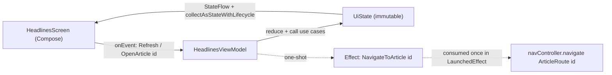

# Lesson 04 — UI Layer (Compose + MVI + Navigation)

> After this lesson you can build the screens of a production app: MVI ViewModels exposing one immutable `UiState`, Compose UIs that render **loading / error / empty / content** explicitly, type-safe Navigation between features, and one-shot effects (navigate, snackbar) that don't re-fire.

**Module:** 19 · **Lesson:** 04 · **Level:** 🟢🟡🔴 · **Est. time:** 120–150 min

---

## 1. Concept

### 🟢 For beginners — *what is it and why do I care?*

The UI layer is what the user actually sees and taps. In our news app it's the **headlines screen**, the **article detail**, and the **bookmarks screen** — plus the wiring that moves between them.

Two ideas carry this whole layer:

1. **The screen is a picture of one piece of data.** Each screen has a single description of "everything on screen right now" — a `UiState`. The ViewModel produces it; the Compose UI just draws it. Tap something → the ViewModel makes a *new* `UiState` → the screen redraws. Data flows **down** (state to the UI), events flow **up** (taps to the ViewModel). That's **MVI** (you met it in [Module 03](../module-03-state-management/05-udf-mvi-mvvm.md); here we *use* it for real screens).

2. **Every screen has more than one look.** Beginners build the "happy path" (a nice list of articles) and forget the other three states every real screen has: **loading** (spinner on first open), **error** (network failed — with a retry button), and **empty** (no articles / no bookmarks yet). A production screen handles **all four**, on purpose. Forgetting them is the #1 reason apps feel broken.

Moving between screens is **Navigation** — and the 2026 way is **type-safe**: you navigate to a `@Serializable` destination object, so passing an article id to the detail screen is checked by the compiler, not stuffed into a stringly "route."

### 🟡 For intermediate devs — *the mechanism*

The screen contract, end to end:

```text
   ViewModel:  uiState: StateFlow<HeadlinesUiState>     onEvent(HeadlinesEvent)
                       │ (immutable, one object)                ▲
   collectAsStateWithLifecycle ▼                                │ method calls
   Composable:  when (state) { Loading→… Error→… Empty→… Content→… }   buttons → onEvent(...)
                       └─ one-shot effects (navigate/snackbar) consumed once in LaunchedEffect
```

The pieces:

- **`UiState` models all states.** Either a `data class` with `isLoading`/`error`/`items`, or — cleaner — a **sealed interface** (`Loading`, `Content(items)`, `Error(msg)`, `Empty`) so contradictory combos can't exist.
- **`collectAsStateWithLifecycle()`** collects the state lifecycle-aware (stops in the background). This is the Android default; plain `collectAsState` keeps collecting while backgrounded.
- **A stateless screen + a stateful route.** `HeadlinesRoute` (stateful: owns the ViewModel, collects state, handles effects) calls `HeadlinesScreen(state, onEvent)` (stateless: pure `f(state)`, previewable, testable).
- **Type-safe Navigation Compose**: destinations are `@Serializable` types; `composable<ArticleRoute> { … }` and `navController.navigate(ArticleRoute(id))`. Arguments are real typed fields.
- **One-shot effects** (navigate, snackbar) go through a `Channel`/`SharedFlow` consumed once — never stored in `UiState`, or they re-fire on recomposition and after rotation.

### 🔴 For senior devs — *trade-offs, edges, internals*

- **`sealed interface UiState` vs. a flag-bag `data class`.** A `data class(isLoading, items, error)` can represent impossible states (`isLoading = true` *and* a stale `error` *and* items). A sealed hierarchy (`Loading | Content | Error | Empty`) makes illegal states **uncompilable** and forces the UI to handle every case via exhaustive `when`. Trade-off: the data class is easier when states **overlap legitimately** (content visible *while* refreshing — a list with a top progress bar). Real screens often want a *hybrid*: a sealed `LoadState` plus the content, or a data class where the combination is intentional. Choose based on whether your states are mutually exclusive or can coexist.

- **Empty is a first-class state, distinct from "loaded zero after success" vs "nothing yet."** "No bookmarks because you haven't saved any" (empty) ≠ "couldn't load" (error) ≠ "loading." And first-launch-no-data-no-network is different again. Conflating them yields the classic bug: a spinner forever, or an error screen when there's simply nothing to show. Model empty explicitly.

- **`stateIn` / `WhileSubscribed(5_000)` is the correct sharing for UI state.** Converting a use-case `Flow` to a `StateFlow` with `SharingStarted.WhileSubscribed(5_000)` keeps the upstream alive for 5s after the last subscriber leaves — so a configuration change doesn't tear down and re-run the upstream, but a real backgrounding eventually does. `Eagerly`/`Lazily` leak work; raw `WhileSubscribed()` (no timeout) drops and re-subscribes across rotation. The 5s grace is the idiom.

- **One-shot effects in state is *the* recurring MVI bug.** A `navigateToDetail: String?` field in `UiState` re-fires every recomposition and again after process-death restoration (the field is restored). Route navigation/snackbar through a `Channel` (or `SharedFlow` with replay 0), consumed in a lifecycle-aware `LaunchedEffect`. (Full treatment: Module 03 Lesson 05.)

- **Type-safe nav changes the failure mode from runtime to compile-time.** String routes (`"article/{id}"`) fail at runtime on a typo or a missing arg. `@Serializable` destinations make the destination a real type with typed fields, checked by the compiler, with `toRoute<ArticleRoute>()` to read them back. Deep links and nav arguments both become type-checked.

- **Recomposition discipline in the UI.** Pass **stable** types into composables (immutable `UiState`, `ImmutableList` from kotlinx.collections.immutable rather than `List` when the compiler can't prove stability), hoist `onEvent` as a stable reference, and read state **low** so a list-item change doesn't recompose the whole screen. With **Strong Skipping** (2026 default) much of this is automatic, but unstable params still defeat it. (Module 11 goes deep.)

- **Don't put business logic in the UI.** The composable renders `state` and emits events; *all* decisions (what to fetch, how to combine, what counts as empty) live in the ViewModel/use cases. A composable that calls a repository or decides business rules is a layering violation that wrecks testability.

### Analogy

An MVI screen is a **theater stage with a single script page visible at a time**. The **`UiState`** is the current page of the script — it says *exactly* what's on stage right now (curtain down = loading, the scene = content, an "intermission" card = empty, an "technical difficulties" card = error). The **actors (composables)** simply perform whatever the current page says — they don't improvise or decide the plot. When the audience reacts (an **event**), the **director (ViewModel)** turns to the next script page. A one-shot effect (a pyrotechnic blast = navigate) happens **once** when the cue fires — it isn't printed on the script page, or it'd go off every time anyone glanced at the page.

### Mental model

> **One immutable `UiState` describes the whole screen, including loading/error/empty. The composable draws it and emits events up; the ViewModel produces the next state. One-shot effects fire once through a side channel, never from state.**

### Real-world example

The **Twitter/X timeline**: first open shows skeleton placeholders (loading), a failed refresh shows an inline "Something went wrong — Retry" (error), a brand-new account shows "Welcome — follow some people" (empty), and the normal case shows tweets (content). Tapping a tweet emits an event; the ViewModel emits a one-shot "navigate to thread" effect consumed once. Every one of those is a distinct, deliberately designed state — not an afterthought.

---

## 2. Visual Learning

**ASCII — the four states every screen must handle:**
```text
                    ┌──────────────── HeadlinesUiState ────────────────┐
   open screen ───▶ │  Loading        → skeleton / spinner             │
   fetch fails ───▶ │  Error(msg)     → message + [Retry] button       │
   zero results ──▶ │  Empty          → "No headlines yet" illustration│
   got data ──────▶ │  Content(items) → the LazyColumn of articles     │
                    └───────────────────────────────────────────────────┘
        Composable:  when (state) { is Loading -> …; is Error -> …; is Empty -> …; is Content -> … }
                     (exhaustive — the compiler makes you handle all four)
```

**Mermaid — MVI loop + navigation + one-shot effect:**


**Illustration prompt:**
```text
Illustration: a theater stage viewed from the audience, with FOUR small framed
"script pages" floating above it labeled "Loading", "Content", "Empty", "Error", and a
spotlight currently illuminating the "Content" page while the actors on stage perform a
list of news cards. A director's chair to the side is labeled "ViewModel", connected by
an arrow "events up" from the audience and "state down" to the stage. A single firework
burst at the stage edge is labeled "one-shot effect: navigate (fires once)". Caption:
"One script page at a time." Modern, vibrant, theatrical lighting, clearly labeled.
```

---

## 3. Code (Build steps)

> Build the headlines feature UI: state, events, ViewModel, stateless screen with all states, and type-safe navigation. Compose BOM + Material 3, `collectAsStateWithLifecycle`, type-safe Navigation Compose, kotlinx.collections.immutable.

### 🟢 Beginner — a UiState + a stateless screen that renders it

```kotlin
sealed interface HeadlinesUiState {
    data object Loading : HeadlinesUiState
    data class Content(val articles: ImmutableList<Article>) : HeadlinesUiState
    data object Empty : HeadlinesUiState
    data class Error(val message: String) : HeadlinesUiState
}

@Composable
fun HeadlinesScreen(
    state: HeadlinesUiState,
    onRefresh: () -> Unit,
    onArticleClick: (String) -> Unit,
) {
    when (state) {                                   // exhaustive — every state handled
        HeadlinesUiState.Loading -> CircularProgressIndicator()
        HeadlinesUiState.Empty   -> EmptyMessage(text = "No headlines yet")
        is HeadlinesUiState.Error -> ErrorMessage(text = state.message, onRetry = onRefresh)
        is HeadlinesUiState.Content -> LazyColumn {
            items(state.articles, key = { it.id }) { article ->
                ArticleRow(article = article, onClick = { onArticleClick(article.id) })
            }
        }
    }
}
```

**Explanation.** `HeadlinesScreen` is **stateless** — a pure function of `state` plus event lambdas. The `when` over the sealed `UiState` is **exhaustive**, so the compiler forces you to handle Loading, Empty, Error, *and* Content — you literally can't forget the empty state. `items(..., key = { it.id })` gives stable item identity so the list animates and recomposes correctly.

**Common mistakes.**
```kotlin
// ❌ Only the happy path — no loading/error/empty. Looks "done", feels broken in the field.
@Composable
fun HeadlinesScreen(articles: List<Article>) {
    LazyColumn { items(articles) { ArticleRow(it) } }   // blank screen while loading / on error
}

// ❌ No `key` in items → wrong recomposition and broken item animations on reorder.
items(state.articles) { ArticleRow(it) }
```

**Best practices.**
- Keep the screen **stateless** (`f(state)` + event lambdas) so it's previewable and testable.
- Model state as a **sealed interface** and handle it with an **exhaustive `when`** — every state is explicit.
- Always pass a stable **`key`** to `items`.

---

### 🟡 Intermediate — the MVI ViewModel (state down, events up)

```kotlin
sealed interface HeadlinesEvent {
    data object Refresh : HeadlinesEvent
    data class OpenArticle(val id: String) : HeadlinesEvent
}

class HeadlinesViewModel(
    getHeadlines: GetHeadlinesUseCase,
    private val refreshHeadlines: RefreshHeadlinesUseCase,
) : ViewModel() {

    // Map the domain Flow → an exhaustive UiState. WhileSubscribed(5s) survives rotation.
    val uiState: StateFlow<HeadlinesUiState> =
        getHeadlines()
            .map { articles ->
                if (articles.isEmpty()) HeadlinesUiState.Empty
                else HeadlinesUiState.Content(articles.toImmutableList())
            }
            .catch { emit(HeadlinesUiState.Error(it.message ?: "Something went wrong")) }
            .stateIn(
                scope = viewModelScope,
                started = SharingStarted.WhileSubscribed(5_000),
                initialValue = HeadlinesUiState.Loading,   // first frame before data arrives
            )

    fun onEvent(event: HeadlinesEvent) {
        when (event) {
            HeadlinesEvent.Refresh -> viewModelScope.launch { refreshHeadlines() }
            is HeadlinesEvent.OpenArticle -> { /* one-shot nav effect — Production tier */ }
        }
    }
}
```

```kotlin
@Composable
fun HeadlinesRoute(
    vm: HeadlinesViewModel = hiltViewModel(),
    onArticleClick: (String) -> Unit,
) {
    val state by vm.uiState.collectAsStateWithLifecycle()   // lifecycle-aware
    HeadlinesScreen(
        state = state,
        onRefresh = { vm.onEvent(HeadlinesEvent.Refresh) },
        onArticleClick = onArticleClick,
    )
}
```

**Explanation.** The ViewModel turns the use-case `Flow` into an exhaustive `UiState`: empty list → `Empty`, data → `Content`, thrown error → `Error` (via `catch`), and `initialValue = Loading` covers the first frame. `WhileSubscribed(5_000)` is the idiomatic sharing policy — the upstream survives a rotation (5s grace) but stops when truly backgrounded. The **route** owns the ViewModel and collects lifecycle-aware; the **screen** stays stateless. Events are typed and forwarded via `onEvent`.

**Common mistakes.**
```kotlin
// ❌ collectAsState() — keeps collecting while the app is backgrounded (wasted work, stale UI).
val state by vm.uiState.collectAsState()

// ❌ SharingStarted.Eagerly / Lazily for UI state → upstream never stops; or raw WhileSubscribed()
//    with no timeout → tears down & re-runs on every rotation.
.stateIn(viewModelScope, SharingStarted.Eagerly, HeadlinesUiState.Loading)
```

**Best practices.**
- Collect with **`collectAsStateWithLifecycle()`**; share with **`WhileSubscribed(5_000)`**.
- Map domain data → an **exhaustive `UiState`** in the ViewModel (including `Empty` and `Error` via `catch`).
- Keep the **route stateful**, the **screen stateless**; forward typed events through `onEvent`.

---

### 🔴 Production — type-safe Navigation + one-shot effects + a refreshing-with-content state

Type-safe destinations and the nav graph:
```kotlin
@Serializable data object HeadlinesRouteKey
@Serializable data class ArticleRouteKey(val articleId: String)   // typed argument

@Composable
fun NewsNavHost(navController: NavHostController) {
    NavHost(navController, startDestination = HeadlinesRouteKey) {
        composable<HeadlinesRouteKey> {
            HeadlinesRoute(onArticleClick = { id -> navController.navigate(ArticleRouteKey(id)) })
        }
        composable<ArticleRouteKey> { backStackEntry ->
            val route: ArticleRouteKey = backStackEntry.toRoute()   // typed args, compiler-checked
            ArticleRoute(articleId = route.articleId, onBack = navController::navigateUp)
        }
    }
}
```

One-shot effects done correctly (navigate via a `Channel`, consumed once):
```kotlin
class HeadlinesViewModel(/* … */) : ViewModel() {
    private val _effects = Channel<HeadlinesEffect>(Channel.BUFFERED)
    val effects = _effects.receiveAsFlow()

    fun onEvent(event: HeadlinesEvent) {
        when (event) {
            HeadlinesEvent.Refresh -> viewModelScope.launch { refreshHeadlines() }
            is HeadlinesEvent.OpenArticle ->
                _effects.trySend(HeadlinesEffect.NavigateToArticle(event.id))   // NOT in UiState
        }
    }
}
sealed interface HeadlinesEffect { data class NavigateToArticle(val id: String) : HeadlinesEffect }
```
```kotlin
@Composable
fun HeadlinesRoute(vm: HeadlinesViewModel = hiltViewModel(), onArticleClick: (String) -> Unit) {
    val state by vm.uiState.collectAsStateWithLifecycle()
    val snackbarHostState = remember { SnackbarHostState() }

    LaunchedEffect(Unit) {                                  // consume one-shot effects exactly once
        vm.effects.collect { effect ->
            when (effect) {
                is HeadlinesEffect.NavigateToArticle -> onArticleClick(effect.id)
            }
        }
    }
    Scaffold(snackbarHost = { SnackbarHost(snackbarHostState) }) { padding ->
        HeadlinesScreen(
            state = state,
            onEvent = vm::onEvent,
            modifier = Modifier.padding(padding),
        )
    }
}
```

For "content visible *while* refreshing", model it explicitly instead of flipping back to a full-screen spinner:
```kotlin
data class HeadlinesUiState(           // hybrid: content can coexist with a refresh indicator
    val articles: ImmutableList<Article> = persistentListOf(),
    val isRefreshing: Boolean = false,
    val errorMessage: String? = null,  // shown as a snackbar, not a full-screen takeover
) { val isEmpty get() = articles.isEmpty() && !isRefreshing }
```

**Explanation.** **Type-safe Navigation** makes destinations real types: `ArticleRouteKey(id)` is compiler-checked, and `toRoute()` reads typed args back — a typo or missing arg won't compile, versus runtime crashes with string routes. **One-shot effects** (navigate) go through a `Channel` consumed once in `LaunchedEffect`, so they don't re-fire on recomposition or after process death. Finally, the **hybrid `UiState`** shows the right thing when content and refresh overlap (a list with a top progress bar) — a place where a flat data class beats a strict sealed hierarchy, because the states legitimately coexist.

**Common mistakes.**
```kotlin
// ❌ One-shot navigation stored in state — re-navigates on every recomposition & after rotation.
data class HeadlinesUiState(val navigateToId: String? = null)   // ☠️ MVI's classic bug

// ❌ Stringly-typed route — fails at runtime on a typo or missing arg, no compiler help.
navController.navigate("article/$id")   // and parsing it back by hand on the other side

// ❌ Showing a full-screen spinner on pull-to-refresh — content blinks away unnecessarily.
```

**Best practices.**
- **Type-safe Navigation**: `@Serializable` destinations + `composable<T>` + `toRoute<T>()`.
- **One-shot effects** via `Channel`/`SharedFlow`, consumed in a lifecycle-aware `LaunchedEffect` — never in `UiState`.
- When content and loading **coexist** (refresh), model it explicitly (a `data class` with `isRefreshing`) rather than reverting to full-screen loading.
- Pass **immutable/stable** state into composables (`ImmutableList`) so Strong Skipping can skip; keep all logic in the VM/use cases.

---

## 4. Interview Questions

**🟢 Beginner**

1. *What are the states every production screen should handle?*
   > Loading (first fetch), Content (data to show), Empty (loaded successfully but nothing to display), and Error (the fetch failed, ideally with retry). Handling only the happy path is the most common reason apps feel broken.
2. *In MVI, which way does state flow and which way do events flow?*
   > State flows **down** (the ViewModel's `UiState` to the Composable, which renders it); events flow **up** (user taps call `onEvent` on the ViewModel, which produces the next state). One direction = predictable UI.

**🟡 Intermediate**

3. *Why `collectAsStateWithLifecycle()` over `collectAsState()`?*
   > The lifecycle-aware version stops collecting when the app is backgrounded, avoiding wasted work and stale emissions, and resumes on foreground. Plain `collectAsState` keeps collecting in the background. It's the Android default.
4. *What's the point of `SharingStarted.WhileSubscribed(5_000)` when building UI state with `stateIn`?*
   > It keeps the upstream `Flow` alive for 5 seconds after the last collector disappears. That bridges a configuration change (rotation) without tearing down and re-running the upstream, while still stopping work when the screen is genuinely gone. `Eagerly`/`Lazily` never stop; raw `WhileSubscribed()` re-subscribes on every rotation.

**🔴 Senior**

5. *Sealed `UiState` vs. a `data class` of flags — when each?*
   > A sealed hierarchy (`Loading | Content | Error | Empty`) makes illegal states uncompilable and forces exhaustive handling — ideal when states are **mutually exclusive**. A `data class` with flags is better when states **legitimately coexist** (content visible while refreshing, with an inline progress bar). Many real screens use a hybrid: content + an `isRefreshing`/`errorMessage` field. Choose by whether the states overlap.
6. *How do you implement navigation/snackbar so it doesn't re-fire, and why is storing it in `UiState` wrong?*
   > Emit it as a **one-shot effect** through a `Channel` (or `SharedFlow`, replay 0) and consume it once in a lifecycle-aware `LaunchedEffect`. Storing it in `UiState` (e.g. `navigateToId: String?`) makes it re-fire on every recomposition and again after process-death restoration (the field is restored), causing double navigation and ghost snackbars. Effects are events, not state.

---

## 5. AI Assistant

**Prompt example (building a feature screen):**
```text
Build the "headlines" feature UI for a Compose app (BOM 2025.06, Material 3, Kotlin 2.1).
- Sealed HeadlinesUiState: Loading | Content(ImmutableList<Article>) | Empty | Error(message).
- HeadlinesViewModel (Hilt): map GetHeadlinesUseCase().toImmutableList() into UiState; empty list →
  Empty; .catch → Error; stateIn(WhileSubscribed(5_000), initial = Loading). onEvent(Refresh/OpenArticle).
- Stateless HeadlinesScreen(state, onEvent) with an exhaustive `when` rendering all four states; use
  items(key = { it.id }).
- Type-safe Navigation: @Serializable HeadlinesRouteKey / ArticleRouteKey(articleId); composable<T>{};
  navigate(ArticleRouteKey(id)); read args with toRoute().
- One-shot navigation via a Channel<HeadlinesEffect> consumed in LaunchedEffect — NOT stored in UiState.
Collect with collectAsStateWithLifecycle.
```

**AI workflow — where it helps on *this* topic.**
- ✅ Great for: scaffolding the `UiState`/`Event`/`Effect` types, the stateless screen with the `when`, Compose previews for each state, and the type-safe nav graph boilerplate.
- ⚠️ Not for: your **state model decisions** (sealed vs hybrid, what counts as empty) and effect plumbing — models routinely emit happy-path-only screens, stuff navigation into `UiState`, and use `collectAsState`.

**Review workflow — check AI output against this lesson's *Common Mistakes*:**
- Are **all four states** (Loading/Content/Empty/Error) handled, via an **exhaustive `when`**? Is `Empty` distinct from `Error`?
- **`collectAsStateWithLifecycle`** + **`WhileSubscribed(5_000)`** (not `collectAsState`, not `Eagerly`)?
- Is navigation a **one-shot effect** (Channel/LaunchedEffect), **not a field in `UiState`**?
- **Type-safe** destinations (`@Serializable` + `toRoute`)? Stable `key` on list items? `ImmutableList` into composables?

**Validation workflow — prove it actually works:**
1. **Compose previews** for each state (`@Preview` of `HeadlinesScreen` with Loading/Content/Empty/Error) — confirm all four render correctly.
2. **Rotate** the device mid-refresh: state persists, and navigation/snackbar do **not** re-fire (proves effects aren't in state, and `WhileSubscribed` works).
3. **Compose UI test**: assert the empty message shows for an empty list, the error + retry for `Error`, and tapping a row triggers navigation.
4. **Layout Inspector → recomposition counts**: scroll the list and confirm only changed rows recompose (proves stable `key` + `ImmutableList`).
5. Turn on **"Don't keep activities"** and re-enter — state restores, no ghost navigation.

> **AI drafts, you decide.** The model produces a beautiful happy-path screen in one shot — and silently omits the empty state, parks navigation in `UiState`, and reaches for `collectAsState`. Run every generated screen through the four-states + effects + lifecycle checklist.

---

## Recap / Key takeaways

- The UI layer is **MVI**: one immutable `UiState` flows down, typed events flow up, the ViewModel produces the next state.
- Handle **all four states** — Loading / Content / Empty / Error — explicitly; a sealed `UiState` makes the `when` exhaustive (use a hybrid `data class` when content and refresh coexist).
- Collect with **`collectAsStateWithLifecycle`**; build UI state with **`stateIn(WhileSubscribed(5_000))`**.
- **Type-safe Navigation**: `@Serializable` destinations, `composable<T>`, `toRoute<T>()` — compile-time-checked arguments.
- **One-shot effects** (navigate, snackbar) go through a `Channel`/`SharedFlow` consumed once — **never** stored in `UiState`.
- Keep the **route stateful, the screen stateless**, logic in the ViewModel/use cases, and pass **stable/immutable** state for Strong Skipping.

➡️ Next: **[Lesson 05 — Dependency Injection](05-dependency-injection.md)** — wiring the data, domain, and UI layers together with Hilt across modules, with scopes and qualifiers.
