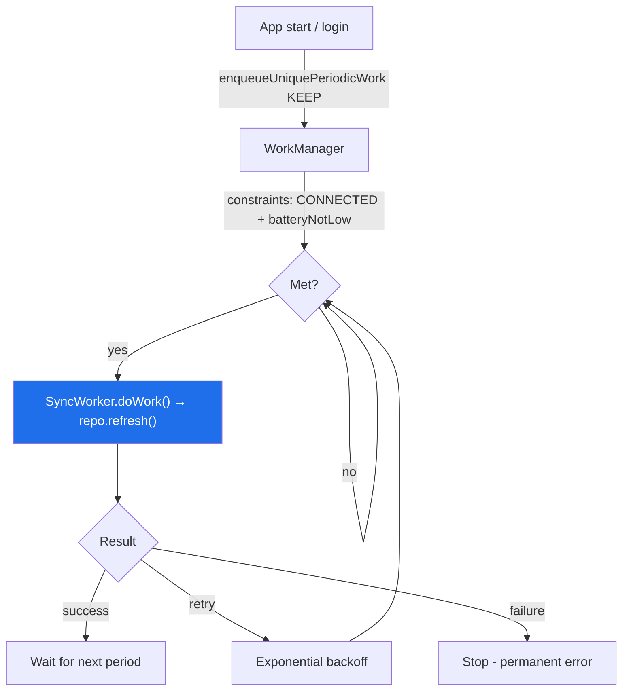

# Lesson 06 — Background Work (WorkManager Sync)

> After this lesson you can schedule reliable background sync with WorkManager: a Hilt-injected worker that refreshes the cache, with network/charging **constraints**, exponential **backoff**, **unique** periodic work, and a correct `retry` vs `failure` contract — so the app stays fresh even when it's closed.

**Module:** 19 · **Lesson:** 06 · **Level:** 🟢🟡🔴 · **Est. time:** 100–120 min

---

## 1. Concept

### 🟢 For beginners — *what is it and why do I care?*

Our news app reads from the local database (Lesson 02), so somebody has to keep that database **fresh** — pull new headlines periodically, even when the user isn't looking. You can't just "start a thread when the app opens": the app might be **closed**, the user might have **no signal**, the phone might be **asleep**, or Android might **kill** your process to save battery. Naive background work silently dies in all those cases.

**WorkManager** is Android's official tool for **deferrable, guaranteed** background work. "Guaranteed" is the magic word: you enqueue a job ("sync the news") and WorkManager **promises to run it eventually**, surviving app closure, process death, and even device reboots. You can tell it the rules — "only when there's internet," "retry if it fails," "every 6 hours" — and it handles the gnarly scheduling, battery optimizations, and OS background limits for you.

For our app: a `SyncWorker` periodically fetches new headlines and upserts them into Room. Because the UI observes Room (Lesson 02), the screen updates itself the next time the user opens it — fresh content, no spinner, no manual refresh.

### 🟡 For intermediate devs — *the mechanism*

WorkManager is the right engine for **sync** because it gives guarantees a coroutine launched in a ViewModel never can:

- **A `CoroutineWorker`** does the work in `doWork(): Result`, returning **`Result.success()`**, **`Result.retry()`** (transient failure — reschedule with backoff), or **`Result.failure()`** (permanent — give up).
- **Constraints** gate execution: `NetworkType.CONNECTED`, `requiresCharging`, `requiresBatteryNotLow`, storage-not-low. The work won't run until they're met.
- **Backoff** policy (`LINEAR`/`EXPONENTIAL`) controls retry timing after `Result.retry()`.
- **Unique work** de-duplicates: `enqueueUniquePeriodicWork(name, policy, request)` with `ExistingPeriodicWorkPolicy.KEEP`/`UPDATE` ensures you don't stack five sync jobs.
- **One-time vs periodic**: `OneTimeWorkRequest` (sync now, e.g. after login) vs `PeriodicWorkRequest` (every N hours, min interval 15 min).
- **Hilt integration** via `@HiltWorker` + `@AssistedInject`, so the worker can inject your repository.

```text
   enqueueUniquePeriodicWork("sync", KEEP, request[constraints: CONNECTED, backoff: EXPONENTIAL])
        └─ when CONNECTED → SyncWorker.doWork() → repo.refresh()
              success → done   |   transient fail → Result.retry() (backoff)   |   4xx → Result.failure()
```

### 🔴 For senior devs — *trade-offs, edges, internals*

- **`retry` vs `failure` is a correctness decision wired directly to your error taxonomy.** Return `Result.retry()` for **transient** problems (timeout, 503, no network mid-run) and `Result.failure()` for **permanent** ones (400, 404, malformed response, auth permanently revoked). This is exactly the `DataError` classification from Lesson 02 surfacing here. Get it wrong and you either hammer a server with requests that can never succeed (retrying a 400) or silently stop syncing on a blip (failing a timeout). Map the repository's classified error → the `Result`.

- **Idempotency is mandatory, because the worker *will* run more than once.** Retries, `UPDATE` policies, and OS reruns mean `doWork()` may execute multiple times for one logical sync. Our sync is naturally idempotent (fetch + upsert on a stable key), but write-syncs (uploading a queued "like") need **server-side idempotency keys** or check-before-write, or you'll double-post. Never assume exactly-once.

- **Constraints are a battery and UX contract, not decoration.** `requiresCharging`/`batteryNotLow` for heavy syncs respects the user's battery; `NetworkType.UNMETERED` avoids burning mobile data on large downloads; `setRequiresDeviceIdle` for non-urgent work. Over-constrain and your data goes stale (the constraints rarely line up); under-constrain and you drain battery / waste data. Match constraints to the work's urgency and cost.

- **Periodic work has a 15-minute floor and is *flex*, not cron.** `PeriodicWorkRequest`'s minimum interval is 15 minutes, and the OS batches/defers it (Doze, App Standby buckets) — it is **not** a precise scheduler. For "exactly at 9:00 AM," that's a different tool (`AlarmManager`/exact alarms, used sparingly). WorkManager optimizes for battery, so treat the interval as "roughly this often," not a guarantee of timing.

- **`ExistingPeriodicWorkPolicy`: `KEEP` vs `UPDATE` changes behavior subtly.** `KEEP` ignores the new request if one already exists (good for "ensure sync is scheduled" on every app start — won't reset the schedule). `UPDATE` replaces the spec without losing the schedule's place (good when you change constraints/interval). Using `REPLACE`/`CANCEL_AND_REENQUEUE` repeatedly on every launch resets the timer so it may *never* fire. Pick deliberately.

- **Expedited work and foreground services have rules.** `setExpedited(OutOfQuotaPolicy.RUN_AS_NON_EXPEDITED_WORK_REQUEST)` requests an immediate, quota-limited run for user-important work; long/expedited work must call `setForeground()` with a notification on newer Android, and foreground-service-type restrictions (Android 14+) apply. Don't use WorkManager for truly **immediate, in-the-moment** work tied to a visible screen — that's a coroutine in `viewModelScope`. WorkManager is for *deferrable, guaranteed* work.

- **Hilt + WorkManager needs the custom factory wired correctly.** `@HiltWorker` + `@AssistedInject(Context, WorkerParameters)` lets you inject the repository, but you must also provide a `HiltWorkerFactory` and **disable the default initializer** in the manifest (or use `Configuration.Provider` on the `Application`). Forgetting this yields a runtime "could not instantiate worker." (This builds on Lesson 05's DI.)

- **Observability and testing.** Observe state via `WorkManager.getWorkInfosForUniqueWorkFlow(name)` to drive a "last synced / syncing" indicator. Test workers with `TestListenableWorkerBuilder` (unit) and `WorkManagerTestInitHelper` + `TestDriver` (instrumentation, to force constraints/delays met). A sync worker you can't test is a sync worker you can't trust.

### Analogy

WorkManager is a **postal service with delivery rules**, not a runner you send out the door. When you launch a coroutine yourself, it's like handing a letter to a friend sprinting across town — if they trip (process death), the letter's lost. WorkManager is the **post office**: you drop the letter in the box (enqueue), and they **guarantee delivery** even if it takes a while. You can stamp instructions: "only deliver when roads are open" (network constraint), "if the recipient's out, try again later with longer gaps" (exponential backoff), "deliver this route every morning" (periodic). The post office batches trips to save fuel (battery/Doze), so "every morning" means *roughly* — and if a letter is addressed to a demolished house (a 400), they stop trying (`failure`) instead of circling forever.

### Mental model

> **WorkManager guarantees deferrable work runs eventually, surviving death and reboots. Gate it with constraints, retry transient failures with backoff, fail permanent ones, keep it idempotent, and use unique work so jobs don't stack.**

### Real-world example

**Gmail/Outlook syncing your inbox**, a podcast app **downloading new episodes only on Wi-Fi while charging**, or a fitness app **uploading workouts when a connection returns** — all WorkManager. *Now in Android* uses a `SyncWorker` with a `CONNECTED` constraint to refresh its repositories in the background; the UI, observing the DB, simply shows fresh content next time it's opened. The user never taps "sync."

---

## 2. Visual Learning

**ASCII — the worker lifecycle and the three results:**
```text
   enqueueUniquePeriodicWork("news-sync", KEEP, request)
            │
            ▼  (waits until constraints met: NetworkType.CONNECTED)
     ┌─────────────────────────────┐
     │  SyncWorker.doWork()        │
     │     repo.refresh()          │
     └──────────────┬──────────────┘
        ┌───────────┼───────────────────────────┐
        ▼           ▼                           ▼
  Result.success  Result.retry()           Result.failure()
   (done; wait    (transient: timeout/503;  (permanent: 400/404;
    next period)   reschedule w/ EXPONENTIAL  give up — don't hammer
                   backoff)                   a doomed request)
```

**Mermaid — scheduling, constraints, and backoff:**


**Illustration prompt:**
```text
Illustration: a stylized POST OFFICE sorting room labeled "WorkManager". A letter labeled
"Sync news" goes into a drop box. A gate labeled "Constraints: road open (network), not low
on fuel (battery)" only opens when conditions are met. A mail truck labeled "SyncWorker"
drives out to a building "REST API / Room". Three return paths: a green "Delivered (success)"
stamp; an orange loop "Recipient out — try later, longer gaps (exponential backoff)"; and a
red "Address demolished — stop (failure)" for a torn-down house labeled "HTTP 400". Caption:
"Guaranteed delivery, on the right conditions." Clean, modern, clearly labeled.
```

---

## 3. Code (Build steps)

> Build the news app's background sync: a Hilt-injected `CoroutineWorker`, constraints + backoff, unique periodic scheduling, and a correct `retry`/`failure` contract. WorkManager (current), `@HiltWorker`, Coroutines.

### 🟢 Beginner — a `CoroutineWorker` that refreshes the cache

```kotlin
class SyncWorker(
    context: Context,
    params: WorkerParameters,
    private val repository: NewsRepository,   // (injected properly in the Production tier)
) : CoroutineWorker(context, params) {

    override suspend fun doWork(): Result {
        // refresh() returns Result<Unit> from Lesson 02
        return repository.refresh().fold(
            onSuccess = { Result.success() },
            onFailure = { Result.retry() },      // try again later (refined in Production tier)
        )
    }
}
```

Enqueue a one-time sync (e.g. "sync now"):
```kotlin
val request = OneTimeWorkRequestBuilder<SyncWorker>().build()
WorkManager.getInstance(context).enqueue(request)
```

**Explanation.** A `CoroutineWorker` runs `doWork()` in a coroutine (main-safe, can call `suspend` repo functions). It maps the repository's refresh result to a WorkManager `Result`: success → done, failure → retry later. WorkManager guarantees this runs even if the app is closed before it finishes — that's the whole point versus a `viewModelScope` coroutine.

**Common mistakes.**
```kotlin
// ❌ Using a plain coroutine in a ViewModel for background sync — dies with the screen/process.
viewModelScope.launch { repository.refresh() }   // no guarantee, no constraints, no reboot survival

// ❌ Returning Result.success() on failure — silently swallows the error; the cache never updates.
override suspend fun doWork(): Result { repository.refresh(); return Result.success() }
```

**Best practices.**
- Use **`CoroutineWorker`** for suspend-based background work; map the outcome to `Result`.
- Use WorkManager (not a bare coroutine) when the work must **survive** app/process death.
- Don't return `success()` on failure — that hides errors and skips retries.

---

### 🟡 Intermediate — constraints, backoff, and unique periodic work

```kotlin
fun schedulePeriodicSync(context: Context) {
    val constraints = Constraints.Builder()
        .setRequiredNetworkType(NetworkType.CONNECTED)   // only with internet
        .setRequiresBatteryNotLow(true)                  // respect low battery
        .build()

    val request = PeriodicWorkRequestBuilder<SyncWorker>(6, TimeUnit.HOURS)   // ~every 6h (min 15m)
        .setConstraints(constraints)
        .setBackoffCriteria(BackoffPolicy.EXPONENTIAL, 30, TimeUnit.SECONDS)   // retry: 30s, 60s, …
        .build()

    WorkManager.getInstance(context).enqueueUniquePeriodicWork(
        uniqueWorkName = "news-sync",
        existingPeriodicWorkPolicy = ExistingPeriodicWorkPolicy.KEEP,   // don't reset the schedule
        request = request,
    )
}
```

**Explanation.** **Constraints** mean the sync only runs with a connection and not on a dying battery — battery- and data-friendly. **Exponential backoff** spaces out retries (30s, 60s, 120s…) so a flaky server isn't hammered. **`enqueueUniquePeriodicWork` with `KEEP`** is the key idiom: call it on every app start to *ensure* sync is scheduled, but `KEEP` won't stack duplicates or reset the timer if it's already scheduled. The 6-hour interval is "roughly," since the OS batches periodic work.

**Common mistakes.**
```kotlin
// ❌ enqueue (not unique) on every app start → stacks a new periodic job each launch.
WorkManager.getInstance(ctx).enqueue(PeriodicWorkRequestBuilder<SyncWorker>(6, TimeUnit.HOURS).build())

// ❌ ExistingPeriodicWorkPolicy.REPLACE on every launch → resets the timer each time,
//    so the sync may NEVER reach its interval if the app is opened often.
ExistingPeriodicWorkPolicy.REPLACE
```

**Best practices.**
- Always schedule periodic work with **`enqueueUniquePeriodicWork`** (a stable name) + **`KEEP`** to avoid stacking/resetting.
- Add **constraints** (`CONNECTED`, `batteryNotLow`, `UNMETERED` for big downloads) matched to the work's cost.
- Set **exponential backoff** so retries don't hammer the backend.

---

### 🔴 Production — Hilt-injected worker + correct retry/failure taxonomy

The Hilt-injected worker (`@HiltWorker` + `@AssistedInject`):
```kotlin
@HiltWorker
class SyncWorker @AssistedInject constructor(
    @Assisted appContext: Context,
    @Assisted params: WorkerParameters,
    private val repository: NewsRepository,   // injected by Hilt
) : CoroutineWorker(appContext, params) {

    override suspend fun doWork(): Result {
        return try {
            repository.refresh().getOrThrow()
            Result.success()
        } catch (e: CancellationException) {
            throw e                                  // cooperative cancellation — never swallow
        } catch (e: DataException) {
            when (e.error) {
                DataError.Network, DataError.Server -> Result.retry()    // transient → backoff
                is DataError.Unknown                -> Result.failure()  // permanent → give up
            }
        }
    }
    companion object { const val MAX_ATTEMPTS = 5 }
}
```

The `Application` provides the `HiltWorkerFactory` (and disable the default initializer in the manifest):
```kotlin
@HiltAndroidApp
class NewsApplication : Application(), Configuration.Provider {
    @Inject lateinit var workerFactory: HiltWorkerFactory
    override val workManagerConfiguration: Configuration
        get() = Configuration.Builder().setWorkerFactory(workerFactory).build()
}
```
```xml
<!-- AndroidManifest.xml: remove the default WorkManager initializer so Hilt's factory is used -->
<provider
    android:name="androidx.startup.InitializationProvider"
    android:authorities="${applicationId}.androidx-startup"
    tools:node="merge">
    <meta-data android:name="androidx.work.WorkManagerInitializer"
               tools:node="remove" />
</provider>
```

Cap attempts and observe sync state for the UI:
```kotlin
override suspend fun doWork(): Result {
    if (runAttemptCount >= MAX_ATTEMPTS) return Result.failure()   // stop infinite retrying
    // … as above …
}

// Drive a "Last synced / Syncing…" indicator from work state:
fun syncState(context: Context): Flow<Boolean> =
    WorkManager.getInstance(context)
        .getWorkInfosForUniqueWorkFlow("news-sync")
        .map { infos -> infos.any { it.state == WorkInfo.State.RUNNING } }
```

**Explanation.** `@HiltWorker` + `@AssistedInject` injects the **repository** into the worker (the framework supplies `Context`/`WorkerParameters` via `@Assisted`), and the `Configuration.Provider` + manifest change wires Hilt's factory — without it you get a runtime crash. The `doWork()` maps the **classified `DataError`** (from Lesson 02) to **`retry()` for transient** vs **`failure()` for permanent**, re-throws `CancellationException` (cooperative cancellation — swallowing it breaks WorkManager's stop signal), and **caps attempts** so a persistent failure eventually stops. Exposing `getWorkInfosForUniqueWorkFlow` lets the UI show a real "syncing…" state.

**Common mistakes.**
```kotlin
// ❌ Forgetting Configuration.Provider + the manifest removal → "Could not instantiate SyncWorker".
//    (Hilt's factory never gets installed.)

// ❌ Catching all errors as retry → a permanent 400 retries forever (battery + server abuse).
catch (e: Exception) { Result.retry() }

// ❌ Swallowing CancellationException → the worker ignores WorkManager's stop request.
catch (e: Exception) { Result.failure() }   // also catches cancellation
```

**Best practices.**
- Inject dependencies with **`@HiltWorker`/`@AssistedInject`**; provide **`HiltWorkerFactory`** via `Configuration.Provider` and remove the default initializer.
- Map **transient → `retry()`**, **permanent → `failure()`** using your error taxonomy; **cap attempts** with `runAttemptCount`.
- **Re-throw `CancellationException`**; never swallow it.
- Expose **`getWorkInfosForUniqueWorkFlow`** to drive a sync-status UI; keep `doWork()` **idempotent**.

---

## 4. Interview Questions

**🟢 Beginner**

1. *What is WorkManager for, and when should you use it instead of a coroutine?*
   > It's for **deferrable, guaranteed** background work — tasks that must run eventually even if the app is closed, the process dies, or the device reboots (e.g. syncing). Use it over a `viewModelScope` coroutine whenever the work must survive beyond the current screen/process; use a plain coroutine for immediate work tied to a visible screen.
2. *What are the three results `doWork()` can return?*
   > `Result.success()` (done), `Result.retry()` (a transient failure — reschedule with backoff), and `Result.failure()` (a permanent failure — give up).

**🟡 Intermediate**

3. *How do you ensure a periodic sync isn't scheduled multiple times across app launches?*
   > Use `enqueueUniquePeriodicWork` with a stable unique name and `ExistingPeriodicWorkPolicy.KEEP`. `KEEP` leaves an existing schedule untouched (so calling it on every launch is safe and won't stack jobs or reset the timer), whereas `REPLACE` would reset the schedule each time.
4. *What are constraints and backoff, and why use them?*
   > Constraints gate when work runs (`NetworkType.CONNECTED`, `requiresCharging`, `batteryNotLow`, `UNMETERED`), so it respects battery/data and only runs when it can succeed. Backoff (linear/exponential) controls retry spacing after `Result.retry()`, so a flaky server isn't hammered. Both are part of being a good background citizen.

**🔴 Senior**

5. *How do you decide between `Result.retry()` and `Result.failure()`, and why does it matter?*
   > Return `retry()` for **transient** problems (timeout, 503, lost connection — they may succeed later) and `failure()` for **permanent** ones (400, 404, malformed/auth-revoked — retrying is futile). This maps the repository's error taxonomy onto WorkManager. Misclassifying means either hammering the server with doomed requests (retrying a 400) or silently halting sync on a blip (failing a timeout). Cap retries with `runAttemptCount` as a backstop.
6. *Why must a worker be idempotent, and what breaks if it isn't?*
   > Because it may run **more than once** for one logical task (retries, `UPDATE` policies, OS reruns). A read-sync (fetch + upsert on a stable key) is naturally idempotent. A write-sync (uploading a queued action) that isn't idempotent will **double-apply** — e.g. post a comment twice — so it needs server-side idempotency keys or check-before-write. Assuming exactly-once is the bug.

---

## 5. AI Assistant

**Prompt example (building the sync worker):**
```text
Build background sync for a news app with WorkManager + Hilt (Kotlin 2.1).
- A @HiltWorker SyncWorker (@AssistedInject Context + WorkerParameters) injecting NewsRepository;
  doWork() calls repository.refresh() and maps the classified DataError → Result.retry() for
  Network/Server (transient) and Result.failure() for Unknown (permanent); re-throw
  CancellationException; cap attempts via runAttemptCount.
- schedulePeriodicSync(): PeriodicWorkRequest every 6h, Constraints (CONNECTED + batteryNotLow),
  EXPONENTIAL backoff (30s); enqueueUniquePeriodicWork("news-sync", KEEP).
- The Application as Configuration.Provider with HiltWorkerFactory, plus the manifest change to
  remove the default WorkManager initializer.
- Expose getWorkInfosForUniqueWorkFlow("news-sync") as a Flow<Boolean> for a "syncing" indicator.
```

**AI workflow — where it helps on *this* topic.**
- ✅ Great for: the worker skeleton, the constraints/backoff request builder, the unique-work call, the `Configuration.Provider` + manifest boilerplate, and the work-info `Flow`.
- ⚠️ Not for: your **retry/failure classification** and **idempotency** reasoning — models routinely catch-all into `retry()`, swallow `CancellationException`, forget the `HiltWorkerFactory` wiring, and use `enqueue`/`REPLACE` instead of unique `KEEP`.

**Review workflow — check AI output against this lesson's *Common Mistakes*:**
- Is the work **unique periodic** with **`KEEP`** (not stacking, not resetting)? Are **constraints** + **exponential backoff** set?
- Does `doWork()` map **transient → `retry()`**, **permanent → `failure()`** (not catch-all retry)? Is `CancellationException` **re-thrown**? Are attempts **capped**?
- Is Hilt wired: **`@HiltWorker`/`@AssistedInject`**, `HiltWorkerFactory` via **`Configuration.Provider`**, and the **default initializer removed** in the manifest?
- Is the worker **idempotent**?

**Validation workflow — prove it actually works:**
1. **Unit-test** the worker with `TestListenableWorkerBuilder<SyncWorker>` and a fake repo: assert `success`/`retry`/`failure` for each `DataError`.
2. **Instrumentation-test** with `WorkManagerTestInitHelper` + `TestDriver`: `setAllConstraintsMet`/`setPeriodDelayMet` to force the worker to run, then assert Room was updated.
3. Use **`adb shell cmd jobscheduler run -f <pkg> <id>`** (or the Background Task Inspector in Android Studio) to trigger and watch the worker on a device.
4. Toggle airplane mode mid-sync and confirm it **retries with backoff** (transient), and simulate a 400 to confirm it **fails** (no infinite retry).
5. Observe `getWorkInfosForUniqueWorkFlow` and confirm the UI's "syncing/last synced" indicator reflects real state.

> **AI drafts, you decide.** WorkManager boilerplate is easy for AI; the **judgment** — which errors retry, idempotency of writes, and the Hilt factory wiring — is exactly what it gets wrong, producing workers that retry doomed requests forever or crash on instantiation. Run every generated worker through the retry/idempotency/Hilt checklist.

---

## Recap / Key takeaways

- **WorkManager** runs **deferrable, guaranteed** background work that survives app/process death and reboots — the right engine for **sync**, not a `viewModelScope` coroutine.
- Gate work with **constraints** (`CONNECTED`, `batteryNotLow`, `UNMETERED`), space retries with **exponential backoff**, and schedule with **`enqueueUniquePeriodicWork` + `KEEP`** so jobs don't stack or reset.
- Map your error taxonomy to results: **transient → `Result.retry()`**, **permanent → `Result.failure()`**; **cap attempts** and **re-throw `CancellationException`**.
- Workers must be **idempotent** — they can run more than once; write-syncs need server-side idempotency keys.
- Inject dependencies with **`@HiltWorker`/`@AssistedInject`** + a `HiltWorkerFactory` via `Configuration.Provider` (and remove the default initializer); observe state with **`getWorkInfosForUniqueWorkFlow`**.

➡️ Next: **[Lesson 07 — Testing](07-testing.md)** — unit, UI, screenshot, and one macrobenchmark across the layers we just built, so the whole app is verified.
