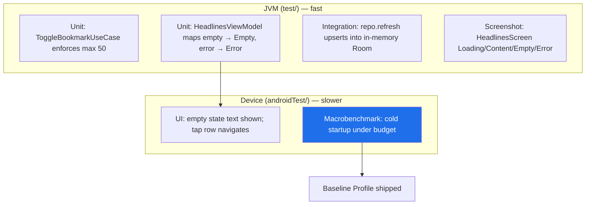

# Lesson 07 — Testing (Unit · UI · Screenshot · Macrobenchmark)

> After this lesson you can test every layer of the capstone: unit-test ViewModels/use cases/repositories on the JVM, UI-test the screens through semantics, lock visuals with screenshot tests, and prove startup performance with one Macrobenchmark — building a fast, trustworthy suite, not a slow flaky one.

**Module:** 19 · **Lesson:** 07 · **Level:** 🟢🟡🔴 · **Est. time:** 120–150 min

---

## 1. Concept

### 🟢 For beginners — *what is it and why do I care?*

We've built a real app — data, domain, UI, DI, background sync. Now we **prove it works** with automated tests, so we don't have to manually click through every screen after every change.

A **test** runs a slice of your code and checks the answer automatically. Because we built the app in **layers**, we can test each layer at the cheapest level that gives confidence:

- **Unit tests** — the logic pieces (does the ViewModel turn a refresh into the right state? does the bookmark use case enforce "max 50"?). They run on your laptop in milliseconds. Write **lots**.
- **UI tests** — render a real screen and check it shows the right thing and reacts to taps. Slower (need a device/emulator). Write **fewer**.
- **Screenshot tests** — render a screen and compare it pixel-for-pixel to an approved image, so an accidental visual change is caught. Run on the JVM, no device.
- **Macrobenchmark** — measure something like **app startup time** on a real device, to catch performance regressions. Write **one or a few**, for what matters.

This is the **testing pyramid** (Module 14 covers it deeply; here we *apply* it to our specific app): most tests at the bottom (cheap, fast), few at the top (expensive, slow). The payoff is a suite that runs fast in CI and tells you the truth — the foundation of shipping with confidence.

### 🟡 For intermediate devs — *the mechanism*

Each layer of the app has a natural test type and tooling:

| App layer | Test type | Runs on | Tools |
|---|---|---|---|
| Use case / repository | Unit | JVM (`test/`) | JUnit, MockK/fakes, **Turbine**, `kotlinx-coroutines-test` |
| ViewModel (state logic) | Unit | JVM (`test/`) | JUnit, Turbine, `TestDispatcher` |
| Data layer (DAO ↔ repo) | Integration | JVM/device | Room `inMemoryDatabaseBuilder`, fake API |
| Compose screen | UI | Device (`androidTest/`) or Robolectric | `createComposeRule`, semantics finders |
| Screen visuals | Screenshot | JVM (`test/`) | **Roborazzi / Paparazzi** |
| Startup / scroll | Macrobenchmark | Real device | Macrobenchmark + Baseline Profiles |

The load-bearing split is **`src/test/` (JVM, fast) vs `src/androidTest/` (device, slow)**. Our architecture is what lets most tests live in `test/`: stateless composables + a ViewModel exposing `StateFlow<UiState>` means the **logic is JVM-testable** and only rendering needs a device (or a JVM screenshot via Roborazzi). The fake-swapping we set up with Hilt (`@TestInstallIn`, Lesson 05) lets UI tests run against a fake repository with deterministic data.

### 🔴 For senior devs — *trade-offs, edges, internals*

- **Confidence per second is the metric, not coverage %.** Ask "what's the cheapest test that catches *this bug class*?" A reducer bug → unit test. "Retry button disabled while loading" → semantics test. "Empty state shown when list is empty" → unit (state mapping) **and** a screenshot. "Jank on scroll" → Macrobenchmark. Chasing a coverage number produces brittle tests of trivial getters while the real risks (state transitions, error handling) go untested.

- **Test behavior through the semantics tree, not implementation.** Assert "a node with text *No headlines yet* is displayed," not internal call counts or private fields. Behavior assertions survive refactors; implementation assertions become change-detector tests that punish every good refactor. This is doubly true for Compose, where the semantics tree *is* the public contract a screen exposes (and what accessibility services see).

- **The Compose idle contract will hang your tests if you're careless.** Compose UI tests synchronize on an idling resource (recomposition, animations, `withFrameNanos`). An **infinite animation** (a perpetual loading shimmer) or a coroutine that never idles makes the test **wait forever**. Either drive the clock manually (`composeTestRule.mainClock.autoAdvance = false`) or design production code so loading indicators can settle. Test design and production design are coupled here.

- **Flakiness is a property of the *suite*.** One nondeterministic test (a real network call, a race, a time-dependent assertion) teaches the team to re-run CI instead of reading failures — poisoning trust in *every* test. Quarantine/delete flaky tests aggressively; a flaky test has **negative** value. Inject dispatchers/clocks (Lessons 03, 05) precisely so timing is deterministic.

- **Coroutine tests need the test infrastructure, not real delays.** Use `runTest`, a `StandardTestDispatcher`/`TestScope`, and **inject** the dispatcher so the ViewModel/use case uses the test one. `WhileSubscribed` flows need an active collector under test (Turbine provides it). Never `Thread.sleep` to "wait for" async work — drive virtual time.

- **Screenshot tests are powerful but need governance.** Roborazzi/Paparazzi catch unintended visual diffs across themes/locales/font scales **on the JVM** (no emulator), which is why the pyramid's middle is affordable in 2026. But they require a review discipline (regenerate baselines deliberately, not blindly `--record` on every red) and stable rendering (fixed fonts/seeded data) or they flake on pixel noise.

- **Macrobenchmark proves what users feel; pair it with Baseline Profiles.** A `startup` Macrobenchmark measures cold-start time on a real device; a scroll benchmark measures frame timing (jank). The output also *generates the Baseline Profile* you ship (Lesson 08) to speed up first-run. One good startup benchmark + the profile it produces is worth more than dozens of micro-asserts. (Module 14 Lesson 06 goes deep.)

### Analogy

Testing the app is like a **car factory's quality stations**, each checking the cheapest thing it can. At the parts bench (**unit tests**), you test a single bolt or sensor in isolation — fast, cheap, thousands of them. At sub-assembly (**integration**), you check the engine turns over on a stand. On the line (**UI tests**), you sit in the seat and press the pedals to confirm the controls respond. In the paint-inspection booth (**screenshot tests**), you compare the body to a reference photo for any blemish. Finally, a **test drive** (**Macrobenchmark**) takes the finished car around the track to measure 0–60 — you do *one* of those, not a thousand. You catch a bad bolt at the bench (pennies), not on the test drive (a recall).

### Mental model

> **Test each layer at the cheapest level that gives confidence: logic as JVM unit tests, screens through the semantics tree, visuals as screenshots, performance as one Macrobenchmark. Architecture (stateless UI + StateFlow + injected dispatchers + fakes) is what keeps the suite fast and deterministic.**

### Real-world example

Any well-run Android app (and *Now in Android*) has exactly this spread: hundreds of fast JVM unit tests for ViewModels/repositories, a layer of Compose UI tests for key screens, Roborazzi screenshot tests guarding the design system across themes, and a Macrobenchmark module producing a Baseline Profile shipped to the Play Store. CI runs the fast JVM tests on every PR (minutes) and the device tests/benchmarks on a schedule or pre-merge — fast feedback where it counts.

---

## 2. Visual Learning

**ASCII — the pyramid mapped to our app's layers:**
```text
                         ▲  fewer, slower, higher confidence-per-test
                        /█\        Macrobenchmark (startup/scroll) — real device, a few
                       /███\       ─ proves perf; generates Baseline Profile
                      /█████\      UI / Integration tests (androidTest or Robolectric)
                     /███████\     ─ render HeadlinesScreen, tap, assert via semantics
                    /█████████\    Screenshot tests (Roborazzi/Paparazzi) — JVM, per state/theme
                   /███████████\   Unit tests (JVM, test/) — ViewModel · UseCase · Repository
                  /█████████████\  ─ MANY, milliseconds, never flake
                         ▼  many, faster, cheaper
```

**Mermaid — what each test verifies in the news app:**


**Illustration prompt:**
```text
Illustration: a car factory quality-control line, left-to-right stations, each labeled.
1) "Parts bench — Unit tests" with a worker testing a single bolt under a magnifier (many bins
of bolts). 2) "Engine stand — Integration" with an engine being spun up. 3) "Cockpit check —
UI tests" with hands pressing pedals/controls. 4) "Paint booth — Screenshot tests" comparing a
car body to a framed reference photo with a tiny red diff highlighted. 5) "Test track —
Macrobenchmark" with one car doing a timed lap, a stopwatch reading "cold start". A banner reads
"Catch it cheap, early." Clean, modern, industrial lighting, clearly labeled.
```

---

## 3. Code (Build steps)

> Test the news app layer by layer. JUnit5/4 + MockK or fakes, **Turbine**, `kotlinx-coroutines-test`, Room in-memory, Compose testing, **Roborazzi**, Macrobenchmark.

### 🟢 Beginner — unit-test a use case (pure JVM, no Android)

```kotlin
class ToggleBookmarkUseCaseTest {

    private val fakeRepo = FakeBookmarkRepository()           // simple in-memory fake
    private val useCase = ToggleBookmarkUseCase(fakeRepo)

    @Test
    fun `adds a bookmark when under the limit`() = runTest {
        val result = useCase("article-1")
        assertEquals(ToggleBookmarkUseCase.Result.Bookmarked, result)
        assertTrue("article-1" in fakeRepo.bookmarkedIds())
    }

    @Test
    fun `returns LimitReached at the cap`() = runTest {
        repeat(50) { fakeRepo.add("a$it") }                  // fill to the limit
        val result = useCase("one-too-many")
        assertEquals(ToggleBookmarkUseCase.Result.LimitReached, result)   // rule enforced
    }
}
```

**Explanation.** This is the cheapest, highest-value test: pure JVM (`test/`), no Android, no Compose, runs in milliseconds. It verifies the **business rule** (max 50 bookmarks) directly through the use case's typed `Result`. `runTest` provides the coroutine test scope. A **fake** repository (not a mock) keeps it readable and behavior-focused.

**Common mistakes.**
```kotlin
// ❌ Testing through the UI what a unit test could verify — slow, flaky, indirect.
//    (Spinning up a Compose test + emulator just to check "max 50 bookmarks".)

// ❌ Thread.sleep to "wait" for async work instead of runTest's virtual time.
@Test fun bad() { useCase("x"); Thread.sleep(500); /* assert */ }   // slow + nondeterministic
```

**Best practices.**
- Push logic tests to the **JVM (`test/`)**; verify rules through the use case's public result.
- Use **`runTest`** + virtual time; never `Thread.sleep`.
- Prefer **fakes** over mocks for readable, behavior-based tests.

---

### 🟡 Intermediate — test the ViewModel's StateFlow with Turbine, and the repo with in-memory Room

ViewModel state transitions (Turbine + injected dispatcher):
```kotlin
class HeadlinesViewModelTest {
    @Test
    fun `empty data emits Empty, error emits Error`() = runTest {
        val getHeadlines = GetHeadlinesUseCase(FakeNewsRepository(emptyList()))   // empty source
        val vm = HeadlinesViewModel(getHeadlines, RefreshHeadlinesUseCase(FakeNewsRepository()))

        vm.uiState.test {                                   // Turbine
            assertEquals(HeadlinesUiState.Loading, awaitItem())   // initial
            assertEquals(HeadlinesUiState.Empty, awaitItem())     // mapped from empty list
            cancelAndIgnoreRemainingEvents()
        }
    }
}
```

Repository against **in-memory Room** + a fake API (integration, but JVM-fast):
```kotlin
class NewsRepositoryTest {
    private lateinit var db: NewsDatabase
    private val api = FakeNewsApi()

    @Before fun setUp() {
        db = Room.inMemoryDatabaseBuilder(ApplicationProvider.getApplicationContext(), NewsDatabase::class.java)
            .allowMainThreadQueries().build()
    }
    @After fun tearDown() = db.close()

    @Test
    fun `refresh upserts API results and observe re-emits`() = runTest {
        val repo = DefaultNewsRepository(api, db.articleDao())
        api.headlines = listOf(ArticleDto("1", "Hello", "BBC", "2026-01-01T00:00:00Z"))

        repo.observeHeadlines().test {
            assertTrue(awaitItem().isEmpty())               // empty cache first
            repo.refresh()
            assertEquals("Hello", awaitItem().single().title) // Flow re-emits after upsert
            cancelAndIgnoreRemainingEvents()
        }
    }
}
```

**Explanation.** **Turbine** (`.test { awaitItem() }`) makes asserting a `StateFlow`'s *sequence* of emissions clean — here Loading → Empty, proving the ViewModel's state mapping. The repository test uses **`Room.inMemoryDatabaseBuilder`** + a fake API to verify the **SSOT contract**: `observeHeadlines()` starts empty, and after `refresh()` the Room `Flow` re-emits the upserted data — exactly the behavior Lesson 02 promised, tested without the network.

**Common mistakes.**
```kotlin
// ❌ Asserting only the final value with `.value` — misses the transition (Loading→Empty),
//    which is where state bugs actually live.
assertEquals(HeadlinesUiState.Empty, vm.uiState.value)

// ❌ Hitting the real network/API in a unit test → slow, flaky, offline-CI breaks.
val repo = DefaultNewsRepository(RealNewsApi(), dao)
```

**Best practices.**
- Use **Turbine** to assert the **sequence** of state emissions, not just the final value.
- Test the repository against **in-memory Room + a fake API** to verify the SSOT/refresh behavior fast.
- Always substitute **fakes** for the network; keep these in `test/` where possible.

---

### 🔴 Production — Compose UI test (semantics), screenshot tests, and a startup Macrobenchmark

Compose UI test driving the screen through **semantics**:
```kotlin
class HeadlinesScreenTest {
    @get:Rule val composeRule = createComposeRule()

    @Test
    fun emptyState_showsMessage_and_rowTap_navigates() {
        var clickedId: String? = null
        composeRule.setContent {
            HeadlinesScreen(
                state = HeadlinesUiState.Content(listOf(sampleArticle("42")).toImmutableList()),
                onEvent = { if (it is HeadlinesEvent.OpenArticle) clickedId = it.id },
            )
        }
        composeRule.onNodeWithText("Hello", substring = true).performClick()   // behavior, via semantics
        assertEquals("42", clickedId)
    }

    @Test
    fun errorState_showsRetry() {
        composeRule.setContent { HeadlinesScreen(HeadlinesUiState.Error("Network"), onEvent = {}) }
        composeRule.onNodeWithText("Retry").assertIsDisplayed()
    }
}
```

Screenshot tests for every state, on the JVM with **Roborazzi**:
```kotlin
@RunWith(AndroidJUnit4::class)
@Config(qualifiers = RobolectricDeviceQualifiers.Pixel7)
class HeadlinesScreenScreenshotTest {
    @get:Rule val composeRule = createComposeRule()

    @Test fun headlines_states() {
        listOf(
            "loading" to HeadlinesUiState.Loading,
            "empty"   to HeadlinesUiState.Empty,
            "error"   to HeadlinesUiState.Error("Network"),
            "content" to HeadlinesUiState.Content(sampleArticles().toImmutableList()),
        ).forEach { (name, state) ->
            composeRule.setContent { NewsTheme { HeadlinesScreen(state, onEvent = {}) } }
            composeRule.onRoot().captureRoboImage("headlines_$name.png")   // compares to baseline
        }
    }
}
```

A **startup Macrobenchmark** (its own `:macrobenchmark` module, real device):
```kotlin
@RunWith(AndroidJUnit4::class)
class StartupBenchmark {
    @get:Rule val benchmarkRule = MacrobenchmarkRule()

    @Test fun coldStartup() = benchmarkRule.measureRepeated(
        packageName = "com.example.news",
        metrics = listOf(StartupTimingMetric()),
        iterations = 5,
        startupMode = StartupMode.COLD,
        setupBlock = { pressHome() },
    ) {
        startActivityAndWait()                 // measures cold start; also feeds Baseline Profiles
    }
}
```

**Explanation.** The **UI test** asserts *behavior through the semantics tree* (`onNodeWithText(...).performClick()`, `assertIsDisplayed()`) — refactor-resilient and accessibility-aligned — and drives the **stateless** `HeadlinesScreen` directly with a fixed `UiState`, no ViewModel or network needed. **Roborazzi** captures each state across the theme **on the JVM** (no emulator) and diffs against a committed baseline, catching accidental visual regressions. The **Macrobenchmark** measures cold startup on a real device and is what produces the **Baseline Profile** shipped in Lesson 08. Together: logic (unit), behavior (UI), looks (screenshot), and feel (benchmark) — all covered.

**Common mistakes.**
```kotlin
// ❌ Asserting on implementation, not the semantics tree → change-detector test.
//    (Reaching into private VM state or counting recompositions to assert "it worked".)

// ❌ A screen with an INFINITE animation under test → the idle contract never settles, test hangs.
//    Fix: composeRule.mainClock.autoAdvance = false; advance manually. Or a finite/seeded indicator.

// ❌ Running Macrobenchmark on an emulator or a debuggable build → meaningless numbers.
```

**Best practices.**
- Assert **behavior via semantics** (`onNodeWithText`, `assertIsDisplayed`), not internals; drive the **stateless screen** with fixed states.
- Cover **all four UI states** with **screenshot tests** across themes/locales on the JVM (Roborazzi/Paparazzi); regenerate baselines deliberately.
- Run **Macrobenchmark on a real device, release/non-debuggable build**; control the **idle/animation clock** so UI tests don't hang.

---

## 4. Interview Questions

**🟢 Beginner**

1. *What's the difference between `src/test/` and `src/androidTest/`?*
   > `src/test/` runs on the local JVM (fast, no emulator) — for logic like ViewModels, use cases, and repositories. `src/androidTest/` runs on a device/emulator — for UI/instrumentation tests that need the Android framework. Pushing logic down so it's JVM-testable is key to a fast suite.
2. *Why is the testing pyramid shaped like a pyramid?*
   > Because test layers cost very differently: unit tests are cheap, fast, and stable, while UI/E2E tests are slow and flakier. So you write **many** cheap tests at the bottom and **few** expensive ones at the top — fast feedback with good confidence.

**🟡 Intermediate**

3. *How do you test a ViewModel's `StateFlow<UiState>`, and why use Turbine?*
   > Collect it under `runTest` and assert the **sequence** of emissions. Turbine's `.test { awaitItem() }` makes that ergonomic — you can verify Loading → Content/Empty/Error transitions, which is where state bugs live. Asserting only `.value` misses the transitions.
4. *How do you test the repository's offline/SSOT behavior without a network?*
   > Use `Room.inMemoryDatabaseBuilder` plus a **fake API**, then assert that `observeHeadlines()` emits from the cache and re-emits after `refresh()` upserts. This proves reads come from Room and refresh feeds it — all on a fast, deterministic test.

**🔴 Senior**

5. *Why assert on the semantics tree instead of implementation, and what Compose-specific hazard must you watch in UI tests?*
   > Semantics assertions ("a node with this text is displayed/clicked") test **behavior** and survive refactors, and they mirror what accessibility services see; implementation assertions become change-detector tests. The hazard is the **idle contract**: Compose UI tests wait for an idling resource, so an **infinite animation** or never-idling coroutine makes the test hang. Drive the clock manually (`mainClock.autoAdvance = false`) or design indicators that settle.
6. *What does a Macrobenchmark give you that unit tests can't, and how does it relate to Baseline Profiles?*
   > It measures **real user-perceived performance** — cold startup time, scroll frame timing/jank — on a real device with a non-debuggable build, which no JVM test can. The startup benchmark also **generates the Baseline Profile** you ship, pre-compiling hot paths so first-run is faster. It's the "test drive" at the top of the pyramid: a few, high-value, measuring what users feel.

---

## 5. AI Assistant

**Prompt example (generating layered tests):**
```text
Write tests for a news app, JVM-first (JUnit, kotlinx-coroutines-test, Turbine):
- Unit: ToggleBookmarkUseCase returns Bookmarked under the limit and LimitReached at 50 (fake repo).
- Unit: HeadlinesViewModel.uiState emits Loading → Empty for an empty source and → Error on a
  failing source (assert the SEQUENCE with Turbine, not just .value).
- Integration: DefaultNewsRepository against Room.inMemoryDatabaseBuilder + a FakeNewsApi —
  observeHeadlines() starts empty and re-emits after refresh() upserts.
- Compose UI test (createComposeRule): error state shows "Retry"; tapping a content row fires
  OpenArticle — assert via onNodeWithText/semantics, driving the stateless HeadlinesScreen.
- Roborazzi screenshot test capturing Loading/Content/Empty/Error across NewsTheme.
Use fakes (not real network), runTest virtual time, and avoid Thread.sleep.
```

**AI workflow — where it helps on *this* topic.**
- ✅ Great for: generating fakes, Turbine assertion blocks, in-memory Room setup, Compose semantics tests, and the screenshot-test loop over states — high-volume boilerplate it does well.
- ⚠️ Not for: deciding **what's worth testing** and at **which level** — models over-test trivia, push logic checks into slow UI tests, assert on `.value` instead of the sequence, and write `Thread.sleep`-based "async" tests that flake.

**Review workflow — check AI output against this lesson's *Common Mistakes*:**
- Is each test at the **cheapest level** that catches its bug class (logic in `test/`, not via UI)?
- Does it assert the **sequence** with Turbine (not just `.value`), use **`runTest`** virtual time (no `Thread.sleep`), and **inject** test dispatchers?
- Do UI tests assert via **semantics** (not internals) and handle the **idle/animation** contract (no infinite-animation hangs)?
- Are **fakes** used for the network? Do screenshot tests cover **all states/themes**? Is the Macrobenchmark on a **real, non-debuggable** build?

**Validation workflow — prove the tests are real:**
1. Run `./gradlew test` — the JVM suite passes in seconds (the bulk of coverage).
2. **Mutation-check** a critical rule: temporarily break "max 50" to 500 and confirm the use-case test **fails** (a test that can't fail proves nothing).
3. Run the Compose UI tests (`connectedAndroidTest` or Robolectric) — confirm semantics assertions pass and **don't hang** (idle contract honored).
4. Roborazzi: `./gradlew recordRoborazziDebug` once to set baselines, then `verifyRoborazziDebug` to catch diffs; review any diff image before re-recording.
5. Run the **Macrobenchmark on a physical device**, confirm startup is within budget, and capture the generated Baseline Profile for Lesson 08.

> **AI drafts, you decide.** AI generates test *volume* effortlessly — but volume isn't confidence. A green suite full of `.value` assertions, `Thread.sleep`, and trivia gives false comfort. Insist each generated test would actually fail when the behavior breaks, at the cheapest level that catches it.

---

## Recap / Key takeaways

- Test each app layer at the **cheapest level that gives confidence**: logic as JVM **unit tests**, screens via the **semantics tree**, visuals as **screenshot tests**, performance as one **Macrobenchmark** — the pyramid applied to our app.
- The **`test/` vs `androidTest/`** split drives speed; our stateless-UI + `StateFlow` + injected-dispatcher + fakes architecture keeps most tests on the fast JVM side.
- Use **Turbine** to assert the **sequence** of `UiState` emissions; test the repository with **in-memory Room + a fake API** to prove SSOT/refresh.
- Assert **behavior, not implementation**; mind the **idle contract** (infinite animations hang tests); kill **flaky** tests — they have negative value.
- **Confidence per second**, not coverage %, is the metric; the **Macrobenchmark** measures what users feel and **generates the Baseline Profile** you ship next.

➡️ Next: **[Lesson 08 — CI/CD & Monitoring](08-ci-cd-monitoring.md)** — a GitHub Actions pipeline, Baseline Profiles, and crash/performance monitoring to ship the capstone for real.
