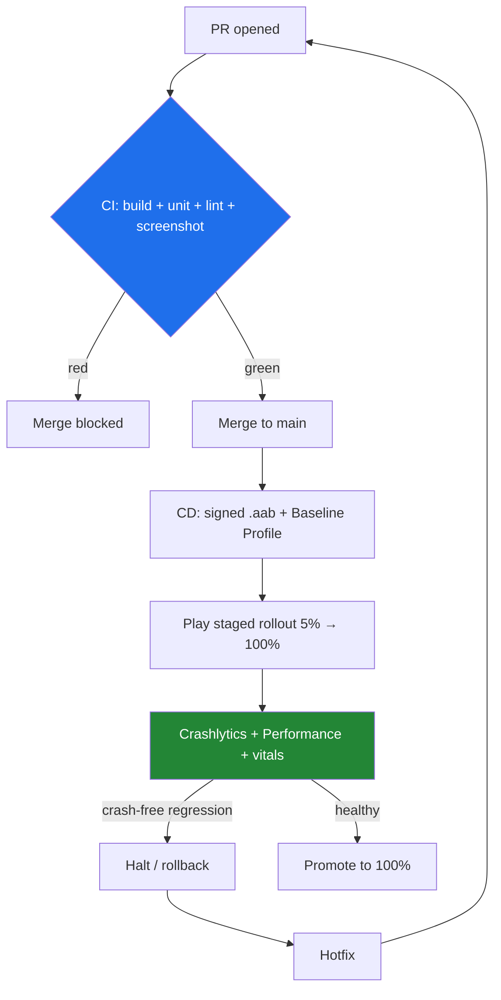

# Lesson 08 — CI/CD & Monitoring

> After this lesson you can ship the capstone for real: a GitHub Actions pipeline that builds, tests, and lints every PR, a release flow that signs and ships an App Bundle with a Baseline Profile, and crash/performance monitoring so you learn about problems from dashboards, not one-star reviews.

**Module:** 19 · **Lesson:** 08 · **Level:** 🟢🟡🔴 · **Est. time:** 110–130 min

---

## 1. Concept

### 🟢 For beginners — *what is it and why do I care?*

We've built the app and tested it. The last step of "production" is the part beginners skip: **getting it to users reliably, over and over, and knowing how it behaves once it's out there.** Two ideas:

- **CI/CD** — **Continuous Integration** and **Continuous Delivery/Deployment**. CI means: every time someone pushes code, a server **automatically builds it and runs the tests**, so a broken change is caught in minutes, not after it's merged. CD means: when code is good, it's **automatically packaged and shipped** (to a test track, then production) instead of someone building it by hand on their laptop. The tool we'll use is **GitHub Actions** — a robot that runs your build/test commands in the cloud on every PR.

- **Monitoring** — once the app is on thousands of phones you don't own, how do you know it crashes for some of them? **Crash reporting** (Firebase Crashlytics) and **performance monitoring** automatically collect crashes, slow starts, and jank from real users and show them on a dashboard. Without it, you find out from a bad review; with it, you get an alert and a stack trace.

Why care? Because "works on my machine" isn't shipping. Production means **the build is reproducible**, **nothing untested reaches users**, and **you see problems before they do**. This is what separates a portfolio demo from an app you'd put your name on.

### 🟡 For intermediate devs — *the mechanism*

A real Android pipeline has stages, gated so bad code can't advance:

```text
   PR opened ─▶ [CI] build + unit tests + lint/detekt + screenshot verify  ──(green?)──▶ mergeable
   merge to main ─▶ [CD] assemble release AAB (signed) + Baseline Profile ──▶ Play (internal track)
                                                                              └─ promote → production
   in production ─▶ [Monitor] Crashlytics + Performance + ANR/vitals ──▶ alerts/dashboards ──▶ fix
```

The pieces:

- **GitHub Actions workflow** (`.github/workflows/ci.yml`): triggers on `pull_request`/`push`, sets up the JDK, **caches Gradle**, and runs `./gradlew assembleDebug testDebugUnitTest lintDebug detekt verifyRoborazziDebug`. Fast JVM jobs on every PR; slow device tests on a schedule or via a managed-device job.
- **Secrets, not committed keys**: the signing keystore and Play credentials live in GitHub **Secrets**, decoded at build time — never in the repo.
- **Release signing + App Bundle (`.aab`)**: `bundleRelease`, signed, optionally uploaded with the Gradle Play Publisher or `r0adkll/upload-google-play`.
- **Baseline Profile** (from Lesson 07's Macrobenchmark) bundled so first run is faster.
- **Monitoring**: Crashlytics SDK + the Crashlytics Gradle plugin (uploads mapping files so stack traces are deobfuscated), Firebase Performance, and Android **vitals** (ANRs, crash rate) in the Play Console.

### 🔴 For senior devs — *trade-offs, edges, internals*

- **Gate on the fast suite, schedule the slow one.** Running the full instrumentation + Macrobenchmark suite on every PR makes CI a 40-minute bottleneck and people start merging around it. Gate PRs on the **fast JVM tests + lint/detekt + screenshot verify** (minutes); run device tests on **Gradle Managed Devices**/Firebase Test Lab pre-merge or nightly, and Macrobenchmarks on a schedule. The goal is **fast, trustworthy signal** on the critical path — slow checks that flake get ignored, which is worse than not having them.

- **Caching and build speed are a CI feature, not a nicety.** Configure the **Gradle build cache** + **`actions/setup-java` Gradle caching** (or the `gradle/actions/setup-gradle` action with its remote cache), pin the wrapper, and use `--no-daemon` discipline appropriately. A 20-minute uncached build that could be 4 minutes cached burns money and developer patience on every push. Also pin **AGP/Kotlin/JDK** versions in the workflow so CI matches local — "works locally, fails in CI" is usually a version/JDK drift.

- **Signing key custody is a security boundary.** The upload key (and ideally **Play App Signing**, where Google holds the app signing key) must never be in the repo or logs. Store the keystore base64-encoded in Secrets, decode to a temp file in the job, and **mask** it. Leaking a signing key is a worst-case incident — anyone can publish a malicious update as you. Rotate via Play App Signing if compromised. (Ties to Module 18.)

- **`.aab` over `.apk`, and `minify`/`shrinkResources` on for release.** Ship an **App Bundle** so Play generates per-device APKs (smaller downloads). Enable R8 (`isMinifyEnabled = true`) + resource shrinking for release — *and* upload the **mapping file** to Crashlytics (the Gradle plugin does this) or every production stack trace is unreadable obfuscated noise. A release build you can't deobfuscate is a monitoring blind spot.

- **Baseline Profiles are a measurable win you must actually wire.** The profile generated by the Macrobenchmark (Lesson 07) goes into the release as `baseline-prof.txt`/the profile artifact; ART pre-compiles those paths so cold start and first-scroll are faster (often 20–40% startup improvement). It's easy to *generate* and forget to *ship* — verify it's in the bundle, and regenerate it when hot paths change. Pair with the **ProfileInstaller** dependency.

- **Monitoring is about MTTR, not vanity counts.** What matters: a **crash-free users %** with alerting on regressions, **deobfuscated** stack traces with breadcrumbs/keys to reproduce, **ANR** tracking (Android vitals — ANRs can get you demoted in Play ranking), and **release-over-release** comparison so a bad rollout is caught early. Use **staged rollouts** (release to 5% → 20% → 100%) gated on the crash-free metric, with a **rollback/halt** plan. Monitoring you don't alert on is just expensive logging.

- **Secrets, flakiness, and required checks compound into trust.** Make the green check **required** for merge (branch protection), keep the pipeline **deterministic** (no real network in tests — Lesson 07), and treat a flaky CI step as a P1: a pipeline people don't trust gets bypassed, and then it protects nothing. The discipline from testing (determinism) is what makes CI gating credible.

### Analogy

CI/CD + monitoring is the **assembly line, shipping dock, and telemetry of a car factory**, after the quality stations of Lesson 07. **CI** is the line that won't let a car advance to the next station until it passes inspection — push a bad part and the line **stops right there**, before it's bolted into a thousand cars. **CD** is the automated **shipping dock**: approved cars roll onto trucks and out to dealers without anyone hand-loading them, first to a few dealers (staged rollout), then nationwide. **Monitoring** is the **fleet telemetry** — every car phones home with engine faults and performance data, so you see a transmission defect across the fleet on a dashboard and issue a recall (hotfix) *before* it makes the news. A factory without these ships untested cars by hand and learns about defects from lawsuits.

### Mental model

> **CI gates every PR with the fast suite; CD signs and ships an App Bundle (with its Baseline Profile) on staged rollout; monitoring reports deobfuscated crashes and vitals from real users so you fix problems before reviews do. Secrets stay in Secrets; the green check is required.**

### Real-world example

Every shipped Android app at any serious company runs this: a PR triggers GitHub Actions/Bitrise/CircleCI to build + test + lint (red blocks merge), merging to `main` produces a signed `.aab` uploaded to Play's internal track via Gradle Play Publisher, a Baseline Profile rides along, and Crashlytics + Play vitals dashboards with Slack/PagerDuty alerts on crash-free regressions drive a staged rollout that auto-halts if the crash rate spikes. *Now in Android* itself ships a CI workflow and a Baseline Profile in its repo as a reference.

---

## 2. Visual Learning

**ASCII — the pipeline from PR to production to monitoring:**
```text
   ┌───────────── CI (every PR, fast — minutes) ─────────────┐
   │ checkout → setup JDK + Gradle cache →                    │
   │ ./gradlew assembleDebug testDebugUnitTest lintDebug      │
   │           detekt verifyRoborazziDebug                    │   red ✗ → PR blocked (required check)
   └───────────────────────────┬─────────────────────────────┘
                  green ✓ merge │
   ┌───────────── CD (on main) ▼──────────────────────────────┐
   │ decode keystore (Secrets) → ./gradlew bundleRelease       │
   │ (R8 + shrink + Baseline Profile + upload mapping)         │
   │ → upload .aab → Play internal track → staged rollout 5%→  │
   └───────────────────────────┬─────────────────────────────┘
                  in the wild   ▼
   ┌───────────── Monitoring ─────────────────────────────────┐
   │ Crashlytics (deobfuscated) · Performance · Play vitals/ANR│
   │ → alert on crash-free % regression → hotfix / halt rollout│
   └───────────────────────────────────────────────────────────┘
```

**Mermaid — gated stages and the monitoring feedback loop:**


**Illustration prompt:**
```text
Illustration: a car factory's shipping operation, three connected zones, clearly labeled.
LEFT "CI — the line that stops": a conveyor with a gate that halts a car body stamped with a
red X until it passes inspection. CENTER "CD — automated dock": approved cars roll onto a
delivery truck labeled ".aab", with a small "Baseline Profile" sticker, heading out — first to
a few nearby dealers (a "5%" sign), then a highway to many. RIGHT "Monitoring — fleet telemetry":
cars on the road beaming signals to a control-room dashboard showing "crash-free 99.4%" and a
red ANR alert, with an operator about to press "halt rollout". Caption: "Build, ship, watch —
on repeat." Clean, modern, industrial, clearly labeled.
```

---

## 3. Code (Build steps)

> Ship the news app: a GitHub Actions CI workflow, a signed release/Baseline-Profile build config, and Crashlytics wiring. GitHub Actions, Gradle Kotlin DSL, R8, Firebase.

### 🟢 Beginner — a CI workflow that builds and tests every PR

`.github/workflows/ci.yml`:
```yaml
name: CI
on:
  pull_request:
  push:
    branches: [ main ]

jobs:
  build-and-test:
    runs-on: ubuntu-latest
    steps:
      - uses: actions/checkout@v4
      - uses: actions/setup-java@v4
        with:
          distribution: temurin
          java-version: '17'
          cache: gradle                       # cache Gradle deps & wrapper
      - name: Build + unit tests + lint
        run: ./gradlew assembleDebug testDebugUnitTest lintDebug --stacktrace
```

**Explanation.** This is the heartbeat of CI: on every PR (and push to `main`), GitHub spins up a clean Ubuntu runner, installs JDK 17, **caches Gradle** (so subsequent runs are fast), and runs the build + **unit tests** + **lint**. If any step fails, the check goes red. Make this check **required** in branch protection and a broken change literally cannot be merged.

**Common mistakes.**
```yaml
# ❌ No Gradle cache → every run re-downloads dependencies; 4-minute build becomes 20.
- uses: actions/setup-java@v4
  with: { distribution: temurin, java-version: '17' }   # missing `cache: gradle`

# ❌ Running the full emulator/instrumentation suite on every PR → slow, flaky bottleneck.
- run: ./gradlew connectedAndroidTest      # belongs on a schedule / managed devices, not every PR
```

**Best practices.**
- Trigger on **`pull_request`**; gate the **fast JVM suite + lint** on every PR and make the check **required**.
- **Cache Gradle** (and pin the JDK) so CI is fast and matches local.
- Keep slow device tests **off** the per-PR critical path.

---

### 🟡 Intermediate — release signing from Secrets + an App Bundle, with R8

`app/build.gradle.kts` release config (keystore values from the environment, never hardcoded):
```kotlin
android {
    signingConfigs {
        create("release") {
            storeFile = file(System.getenv("KEYSTORE_PATH") ?: "keystore.jks")
            storePassword = System.getenv("KEYSTORE_PASSWORD")
            keyAlias = System.getenv("KEY_ALIAS")
            keyPassword = System.getenv("KEY_PASSWORD")
        }
    }
    buildTypes {
        release {
            isMinifyEnabled = true            // R8: shrink + obfuscate
            isShrinkResources = true          // strip unused resources
            signingConfig = signingConfigs.getByName("release")
            proguardFiles(getDefaultProguardFile("proguard-android-optimize.txt"), "proguard-rules.pro")
        }
    }
}
```

A release job that decodes the keystore from a Secret and builds a signed `.aab`:
```yaml
  release:
    if: github.ref == 'refs/heads/main'
    runs-on: ubuntu-latest
    needs: build-and-test
    steps:
      - uses: actions/checkout@v4
      - uses: actions/setup-java@v4
        with: { distribution: temurin, java-version: '17', cache: gradle }
      - name: Decode keystore                 # from GitHub Secrets → temp file
        run: echo "${{ secrets.KEYSTORE_BASE64 }}" | base64 --decode > "$RUNNER_TEMP/keystore.jks"
      - name: Build signed App Bundle
        env:
          KEYSTORE_PATH: ${{ runner.temp }}/keystore.jks
          KEYSTORE_PASSWORD: ${{ secrets.KEYSTORE_PASSWORD }}
          KEY_ALIAS: ${{ secrets.KEY_ALIAS }}
          KEY_PASSWORD: ${{ secrets.KEY_PASSWORD }}
        run: ./gradlew bundleRelease --stacktrace
```

**Explanation.** Signing values come from **environment variables fed by GitHub Secrets** — the keystore itself is stored base64-encoded as a Secret, decoded to a temp file at build time, and never touches the repo or logs. `bundleRelease` produces a signed **App Bundle** (`.aab`), and **R8** (`isMinifyEnabled`) + resource shrinking make it small. The `release` job `needs: build-and-test`, so nothing ships unless CI was green.

**Common mistakes.**
```kotlin
// ❌ Hardcoding signing secrets in the build file (committed to the repo!) — catastrophic leak.
storePassword = "Sup3rSecret!"   // ☠️ anyone with repo access can sign as you

// ❌ Shipping an APK instead of an .aab → larger downloads; missing R8 → bloated, un-obfuscated app.
```

**Best practices.**
- Keep signing/credentials in **Secrets**; decode at build time; never commit or log them.
- Ship an **App Bundle (`.aab`)** with **R8 + resource shrinking** enabled for release.
- Gate the release job behind a **green CI** (`needs:`) and the `main` branch.

---

### 🔴 Production — Baseline Profile, mapping upload, and Crashlytics monitoring

Bundle the Baseline Profile (from Lesson 07's Macrobenchmark) so first run is faster:
```kotlin
// app/build.gradle.kts
plugins {
    alias(libs.plugins.android.application)
    alias(libs.plugins.androidx.baselineprofile)        // wires the profile into the release
    alias(libs.plugins.firebase.crashlytics)            // uploads mapping files automatically
}
dependencies {
    implementation(libs.androidx.profileinstaller)      // installs the profile at runtime
    baselineProfile(projects.macrobenchmark)            // the module that generates baseline-prof.txt
    implementation(platform(libs.firebase.bom))
    implementation(libs.firebase.crashlytics)
    implementation(libs.firebase.performance)
}
```

Crashlytics: keep release symbols mapped + add reproduction context, and a staged-rollout-friendly init:
```kotlin
// Custom keys/breadcrumbs make a production crash reproducible, not just a stack trace.
class NewsApplication : Application() {
    override fun onCreate() {
        super.onCreate()
        FirebaseCrashlytics.getInstance().apply {
            setCrashlyticsCollectionEnabled(!BuildConfig.DEBUG)   // don't pollute with dev crashes
            setCustomKey("build_flavor", BuildConfig.FLAVOR)
        }
    }
}
```
```proguard
# proguard-rules.pro — keep line numbers so deobfuscated traces show exact lines.
-keepattributes SourceFile,LineNumberTable
-renamesourcefileattribute SourceFile
```

A staged rollout with the Gradle Play Publisher (CD step), promotable/haltable on vitals:
```yaml
      - name: Publish to internal track (staged)
        env: { ... Play service-account JSON from secrets ... }
        run: ./gradlew publishReleaseBundle --track internal   # promote → production after vitals are healthy
```

**Explanation.** The **Baseline Profile** plugin + `baselineProfile(projects.macrobenchmark)` bakes the Macrobenchmark-generated profile into the release; **ProfileInstaller** applies it so ART pre-compiles hot paths (faster cold start/first scroll) — the measurable perf win from Lesson 07, *actually shipped*. The **Crashlytics Gradle plugin** uploads the **R8 mapping file** automatically, so production stack traces are **deobfuscated** (with `SourceFile,LineNumberTable` kept, you get exact lines); **custom keys/breadcrumbs** turn a crash into a reproducible report. Publishing to the **internal track** with a staged rollout lets you watch **crash-free % and ANR vitals** before promoting to 100% — and halt/rollback if they regress.

**Common mistakes.**
```text
❌ R8 on but mapping file NOT uploaded → every production crash is unreadable obfuscated soup.
❌ Generating a Baseline Profile in the Macrobenchmark but never wiring `baselineProfile(...)`
   into the release → the perf win is left on the table (profile not shipped).
❌ Rolling out to 100% immediately with no vitals gate → a bad build hits everyone before
   the crash-free metric can warn you.
```

**Best practices.**
- **Ship the Baseline Profile** (plugin + ProfileInstaller + `baselineProfile(...)`); verify it's in the bundle and regenerate when hot paths change.
- **Upload R8 mapping** (Crashlytics plugin) and keep line-number attributes so traces are deobfuscated; add **custom keys/breadcrumbs** for reproduction.
- Use a **staged rollout** gated on **crash-free % / ANR vitals**, with a **halt/rollback** plan and alerting — monitoring you act on, not just collect.

---

## 4. Interview Questions

**🟢 Beginner**

1. *What do CI and CD mean for an Android app?*
   > **CI** (Continuous Integration) automatically builds and tests every change (e.g. on each PR) so breakages are caught immediately. **CD** (Continuous Delivery/Deployment) automatically packages and ships approved builds (to a test track, then production) instead of manual, error-prone hand-builds. Together: reproducible builds and nothing untested reaching users.
2. *Why do you need crash reporting once the app is released?*
   > Because the app runs on thousands of devices you don't control — without crash reporting (e.g. Crashlytics) you only learn about crashes from bad reviews. It collects crashes, stack traces, and affected-user counts automatically so you can find and fix issues proactively.

**🟡 Intermediate**

3. *How do you handle signing keys and secrets in a CI/CD pipeline?*
   > Never commit them. Store the keystore (base64) and passwords/credentials in the CI provider's **Secrets**, decode the keystore to a temporary file at build time, feed passwords via masked environment variables, and ensure they never appear in logs. Prefer **Play App Signing** so Google holds the app signing key.
4. *Why ship an App Bundle (`.aab`) with R8 enabled, and what must you not forget?*
   > An `.aab` lets Play generate optimized per-device APKs (smaller downloads). R8 (`isMinifyEnabled` + resource shrinking) makes the release smaller and obfuscated. The thing you must not forget: **upload the R8 mapping file** to your crash reporter, or every production stack trace is unreadable obfuscated noise.

**🔴 Senior**

5. *How should you structure which tests run where in CI, and why?*
   > Gate every PR on the **fast, deterministic** suite — JVM unit tests, lint/detekt, screenshot verify — so feedback is minutes and the required check is trustworthy. Run **slow device/instrumentation tests** on Gradle Managed Devices/Firebase Test Lab pre-merge or nightly, and **Macrobenchmarks** on a schedule. Putting slow, flaky checks on the per-PR critical path makes CI a bottleneck people route around — defeating the gate.
6. *What's the role of Baseline Profiles and staged rollouts in a production release, and how do they connect to monitoring?*
   > A **Baseline Profile** (generated by the Macrobenchmark) ships in the release so ART pre-compiles hot paths, improving cold start/first-scroll measurably — you must actually wire it into the bundle, not just generate it. A **staged rollout** (5% → 100%) limits blast radius; you gate promotion on **crash-free % and ANR vitals** from monitoring and **halt/rollback** on regressions. Monitoring closes the loop: it's the signal that decides whether a rollout proceeds or stops.

---

## 5. AI Assistant

**Prompt example (building the pipeline):**
```text
Create a GitHub Actions CI/CD setup for an Android app (Gradle Kotlin DSL, JDK 17).
- ci.yml: on pull_request + push to main; checkout, setup-java temurin 17 with Gradle cache; run
  ./gradlew assembleDebug testDebugUnitTest lintDebug detekt verifyRoborazziDebug. Make it the
  required check.
- A release job (needs: ci, only on main): decode a base64 keystore from secrets to a temp file,
  build a signed bundleRelease with R8 (isMinifyEnabled + shrinkResources), passing signing creds
  via env from GitHub Secrets (never hardcoded).
- Wire a Baseline Profile (androidx.baselineprofile plugin + ProfileInstaller + baselineProfile(
  projects.macrobenchmark)) into the release, and the Crashlytics Gradle plugin to upload mapping
  files; keep SourceFile/LineNumberTable in proguard-rules.pro.
- Publish to the Play internal track (staged rollout) and note where vitals gate promotion.
```

**AI workflow — where it helps on *this* topic.**
- ✅ Great for: writing the workflow YAML, the signing/secrets decode steps, the release build config, the Baseline-Profile/Crashlytics Gradle wiring, and a publish step — heavy boilerplate it handles well.
- ⚠️ Not for: your **security and rollout judgment** — models sometimes hardcode secrets, skip the Gradle cache, run the full emulator suite on every PR, forget the **mapping upload**, and roll out to 100% with no vitals gate.

**Review workflow — check AI output against this lesson's *Common Mistakes*:**
- Are **secrets in Secrets** (keystore base64 decoded at build time, masked env), with **nothing hardcoded/committed**?
- Is the **Gradle cache** configured, and are **slow device tests off** the per-PR path (only the fast suite gates)?
- Is it an **`.aab`** with **R8 + shrink**, **and the R8 mapping uploaded** (deobfuscatable traces)?
- Is the **Baseline Profile actually wired** into the release (not just generated)? Is there a **staged rollout** gated on **crash-free/ANR** with a halt plan?

**Validation workflow — prove it actually works:**
1. Open a throwaway PR with a deliberately failing test — confirm CI goes **red and blocks merge** (the gate works).
2. Confirm a passing PR's CI is **fast** (cache hit) and runs unit + lint + screenshot verify.
3. Build `bundleRelease` in CI and verify the `.aab` is **signed** (`bundletool`/`apksigner verify`) and contains the **Baseline Profile** (inspect the bundle).
4. Trigger a test crash in a release build and confirm Crashlytics shows a **deobfuscated** stack trace with your **custom keys** (mapping upload worked).
5. Do an **internal-track staged rollout**, watch **crash-free % / ANR** in the Play Console + Crashlytics for the rollout window, and rehearse a **halt/rollback** before promoting to production.

> **AI drafts, you decide.** A pipeline is exactly where an AI mistake is most dangerous — a hardcoded key or a missing vitals gate isn't a bug, it's an incident. Treat every generated workflow as a security review (Module 18): secrets, gating, mapping upload, staged rollout — verified before it ever runs against production.

---

## Recap / Key takeaways

- **CI** gates every PR with the **fast, deterministic** suite (unit + lint/detekt + screenshot) as a **required check**; slow device tests and Macrobenchmarks run on a schedule, not the critical path.
- **CD** signs and ships an **App Bundle** (R8 + resource shrinking) with credentials from **Secrets** — never hardcoded — and only after CI is green.
- **Ship the Baseline Profile** (plugin + ProfileInstaller) for a real cold-start win, and **upload the R8 mapping** so production traces are **deobfuscated**.
- **Monitoring** (Crashlytics + Performance + Play vitals/ANR) with **custom keys** and alerting on **crash-free % regressions** drives a **staged rollout** with a halt/rollback plan.
- Production = reproducible builds, nothing untested reaching users, and seeing problems before users do — the difference between a demo and a shipped app.

🎉 **Capstone complete.** You've built and shipped a production app end to end: multi-module setup, an offline-first data layer, a domain layer, MVI Compose UI, Hilt DI, WorkManager sync, a full test suite, and a CI/CD pipeline with monitoring. Put it in your portfolio.

➡️ Next: **[Module 20 — Career & Interview Preparation](../module-20-career-interview/README.md)** — turn this capstone into offers: interview roadmap, question banks, and Android system design.
