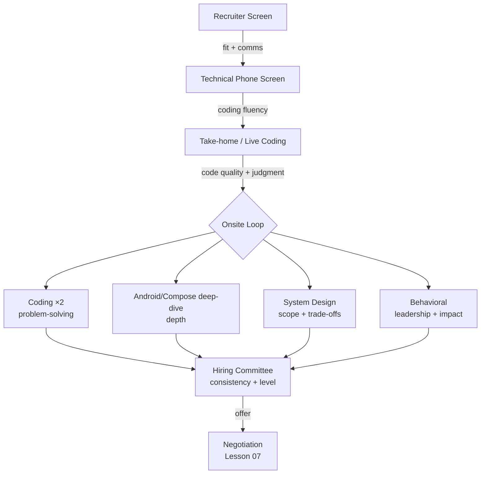

# Lesson 01 — The Android Interview Roadmap

> After this lesson you can map the entire Android interview funnel — every stage, what each round secretly tests, and a week-by-week prep plan that gets you offer-ready without burning out.

**Module:** 20 · **Lesson:** 01 · **Level:** 🟢🟡🔴 · **Est. time:** 60–75 min

---

## 1. Concept

### 🟢 For beginners — *what is it and why do I care?*

An **Android interview** is rarely a single conversation. It's a **funnel**: a sequence of rounds, each one filtering. You pass a stage, you advance; you stumble, you're out. The classic shape for a mid/senior Android role in 2026:

```
Recruiter screen → Technical phone screen → Take-home or live coding → Onsite loop → Offer
```

Each stage is looking for a *different* thing, and the single biggest mistake candidates make is **preparing as if every round were the same**. The recruiter doesn't care about `derivedStateOf`; the system-design panel doesn't care that you memorized the recruiter pitch. **Knowing what a round tests is half of passing it.**

Why you care: interviewing is a *learnable skill*, separate from being a good engineer. Brilliant engineers fail interviews they were technically qualified for because they didn't understand the game. This module teaches the game.

### 🟡 For intermediate devs — *the mechanism*

Here's what each stage is actually probing, and the failure mode that ends the run:

| Stage | Duration | What it really tests | Most common kill |
|---|---|---|---|
| **Recruiter screen** | 20–30 min | Fit, comp alignment, communication, "no red flags" | Vague comp answer; can't summarize what you do |
| **Technical phone screen** | 45–60 min | Can you code at all + talk while doing it | Silent struggling; no test cases |
| **Take-home / live coding** | 1.5–4 hrs | Real code quality, Compose/Kotlin fluency | Over-engineering; no error/loading/empty states |
| **Onsite loop** (3–6 rounds) | half/full day | Depth across coding, **system design**, behavioral, Android internals | Inconsistent leveling signal across rounds |
| **Team match / hiring committee** | async | Calibration, leveling decision | A single "no-hire" with strong reasoning |

The **onsite loop** is where seniority is decided. A loop typically has: 1–2 **coding** rounds, 1 **Android/Compose deep-dive**, 1 **system design** (mobile-flavored: image feed, offline sync, chat), and 1 **behavioral/leadership**. Companies assign each round an **owner** who writes structured feedback (`strong hire / hire / no hire / strong no hire`) plus a **level recommendation**. The committee reads those, not your vibe.

### 🔴 For senior devs — *trade-offs, edges, internals*

Three things separate candidates who *interview well* from those who merely *engineer well*:

- **Leveling is the hidden axis.** You're not graded pass/fail — you're graded *at a level*. The same answer that's a "strong hire" at L4 (mid) is a "no hire" at L6 (staff) because the bar for **scope, ambiguity, and influence** rises. If your stories are all "I implemented the feature," you cap at mid. Senior+ requires "I **identified** the problem, **drove alignment**, **made the trade-off**, **owned the outcome.**" Calibrate your stories to the target level *before* the loop.
- **The signal must be consistent across rounds.** Committees distrust a spiky profile (one round 10/10, one round 3/10) more than a uniform 7/10 — spikiness reads as *luck* or *coaching*. Your job is to be reliably good everywhere, which means you cannot skip prepping your weak round (usually system design for IC-heavy engineers, or coding for architects).
- **Negative signals are weighted heavily.** A single confident-but-wrong assertion ("`LaunchedEffect` runs on every recomposition") can tank an Android deep-dive, because it tells the interviewer your confidence is uncalibrated. Saying **"I'm not certain, here's how I'd verify"** is a *positive* senior signal. Interviewers are trained to probe the boundary of your knowledge — the goal isn't to know everything, it's to know *where your knowledge ends.*
- **AI changed the take-home, not the onsite.** Many companies in 2026 assume you'll use AI on take-homes and now grade *judgment* — can you explain every line, justify the architecture, and catch the AI's mistakes? Some have shifted to **live, AI-assisted pairing** where they *watch you prompt and review*. Lesson 06 covers this shift in depth.

### Analogy

An interview loop is a **decathlon, not a sprint.** You don't win by being world-class at one event (a brilliant binary-search solution) and pulling up lame in the others. The scoring rewards a **consistent, well-rounded athlete**. The committee is the judging panel summing your events — and they trust a steady 8-across-the-board over a 10/10/2/2 spike, because the spike looks like a fluke.

### Mental model

> **Every round tests one specific signal at a target level.** Find out which signal and which level *before* you prep — then make your evidence consistent across all rounds.

### Real-world example

A staff-level candidate aced two coding rounds and the Android deep-dive, then in system design described a chat app's storage as "just use Room" without discussing **sync conflicts, pagination, or offline ordering**. The coding rounds said "strong hire (L5)"; system design said "hire (L4) — solid IC, didn't show staff-level system thinking." The committee leveled them down one band. The *technical* skill was there; the **scope of thinking** for the target level wasn't. That gap is exactly what Lessons 04–05 close.

---

## 2. Visual Learning

**ASCII — the interview funnel and its filters:**
```text
  100 applicants
      │  ▼ recruiter screen  (fit, comp, comms)
   40 │──────────────────────────────────────────
      │  ▼ technical phone   (can you code + talk)
   20 │──────────────────────────────────────────
      │  ▼ take-home/live    (code quality, Compose)
   10 │──────────────────────────────────────────
      │  ▼ ONSITE LOOP       (coding ×2, sys-design,
    3 │     Android deep,     behavioral) ← leveling
      │  ▼ hiring committee  (consistency check)
    1 └──▶ OFFER  (level + comp band decided here)
```

**Mermaid — stages mapped to the signal each one tests:**


**A 6-week prep timeline (Mermaid Gantt):**

```mermaid
gantt
    title 6-Week Android Interview Prep
    dateFormat  X
    axisFormat %s
    section Foundations
    Compose + Kotlin review (Mods 03,06,11)   :0, 14
    section Coding
    DSA patterns + mock coding                 :7, 28
    section Android depth
    System design framework (Lesson 04)        :14, 35
    Architecture rehearsal (Lesson 05)         :21, 35
    section Stories
    Behavioral STAR stories (Lesson 07)        :21, 42
    section Polish
    Full mock loops + retro                    :35, 42
```


**Illustration prompt (paste into an image generator):**
```text
Illustration: a clean, modern recruiting funnel rendered as a series of stacked
glowing filter rings, each labeled (Recruiter, Phone Screen, Take-home, Onsite Loop,
Committee, Offer). Tiny figures of candidates fall in at the top; fewer pass through
each ring. Beside the ONSITE ring, four smaller icons branch out labeled
"Coding", "Android Deep-Dive", "System Design", "Behavioral". A glowing dial on the
side labeled "LEVEL" (L4 / L5 / L6). Soft gradients, vibrant, infographic style,
clear sans-serif labels. Caption: "Each ring tests a different signal."
```

---

## 3. Code → Prep Artifacts (Roadmap → Plan → Tracker)

> The career module's "code" is the **prep system** you build for yourself. Three tiers: a starter plan, a realistic tracker, and a production-grade self-calibration loop — each with Explanation, Common Mistakes, and Best Practices, exactly like a code lesson.

### 🟢 Beginner — a minimal one-week starter plan

```text
WEEK 0 — Orient (before you prep anything)
  [ ] Confirm the role's LEVEL with the recruiter (L4? L5? Senior? Staff?).
  [ ] Ask the recruiter: "What does each onsite round cover?" (They will tell you.)
  [ ] Ask: "What's the comp band for this level?" (See Lesson 07.)
  [ ] Pick a target date 4–6 weeks out. Block 1 hr/day on the calendar.
  [ ] List your 3 weakest areas honestly (e.g. system design, coroutines, DSA).
```

**Explanation.** Before any studying, you gather the two facts that shape *everything*: the **target level** and the **round breakdown**. Recruiters answer both if you ask — it's their job to help you pass. This converts a vague "study Android" into a *targeted* plan.

**Common mistakes.**
```text
❌ "I'll just grind LeetCode for a month and wing the rest."
   → You over-index one round (coding) and walk into system design cold.
❌ Not asking the recruiter what the rounds are.
   → You prep blind and discover the system-design round on the day.
```
Treating prep as undifferentiated "study" is the #1 timewaster. Without the level + round map, effort goes to the wrong places.

**Best practices.**
- **Ask the recruiter** the level and round structure on the very first call. Always.
- Prep is **targeted**, not broad. Aim effort at your weakest *graded* round.
- Block recurring calendar time; consistency beats cram sessions.

---

### 🟡 Intermediate — a realistic 6-week tracker with checkpoints

```text
PHASE 1 (Wk 1–2) FOUNDATIONS — refresh, don't relearn
  [ ] Re-read course Mods 03 (state), 06 (effects), 11 (perf), 13 (architecture).
  [ ] Build ONE small Compose app from scratch (cold start → recall fluency).
  [ ] Drill 20 Compose/Kotlin recall questions (Lessons 02–03).
  CHECKPOINT: can you explain recomposition + StateFlow without notes?

PHASE 2 (Wk 3–4) CODING + DEPTH
  [ ] 3–4 coding problems/week, OUT LOUD, timed (45 min).
  [ ] Learn the system-design framework (Lesson 04); do 2 mock designs.
  [ ] Write down every API you got wrong → flashcards.
  CHECKPOINT: design an image feed end-to-end in 35 min.

PHASE 3 (Wk 5–6) INTEGRATION + STORIES
  [ ] Draft 6 STAR behavioral stories (Lesson 07); rehearse out loud.
  [ ] 2 FULL mock loops with a peer/AI (coding + design + behavioral).
  [ ] Retro each mock: what was the weakest signal? Fix it.
  CHECKPOINT: a friend can't tell your mock from the real thing.
```

**Explanation.** Phases build on each other: **refresh → drill → integrate**. The **checkpoints** are go/no-go gates — if you can't pass the checkpoint, you don't advance the phase, you repeat it. Note that Phase 1 is *refresh*, not relearn: if you finished this course, you already know the material; interview prep is about *retrieval speed*, not new knowledge.

**Common mistakes.**
```text
❌ Spending Weeks 1–6 only consuming content (videos, articles).
   → Recognition ≠ recall. You must PRODUCE answers out loud.
❌ Skipping mock loops because they're uncomfortable.
   → The discomfort IS the training. First real round shouldn't be round one.
```
Passive consumption feels productive and isn't. The single highest-leverage activity is the **timed, spoken mock** — it surfaces exactly the gaps a real interviewer will.

**Best practices.**
- **Produce, don't just consume.** Speak answers aloud; write code by hand/timed.
- Keep a **mistakes log** → convert to flashcards (spaced repetition).
- Gate phases with checkpoints; repeat a phase rather than advancing weak.

---

### 🔴 Production — a self-calibration rubric loop (level-aware)

```text
AFTER EACH MOCK, score yourself on the SAME rubric the committee uses.
Rate 1–4 (1=no-hire, 2=mixed, 3=hire, 4=strong-hire) PER signal,
then ask: "Is a 3 here a 3 at MY TARGET LEVEL?"

  SIGNAL                          SCORE   AT-LEVEL?   EVIDENCE / GAP
  ──────────────────────────────  ─────   ─────────   ──────────────────────────
  Problem solving (coding)         3       L4 yes,     "Solved, but needed a hint
                                           L5 no       on the optimal approach."
  Code quality / Compose idioms    4       yes         "States handled, hoisted,
                                                        no deprecated APIs."
  System design scope              2       no          "Stayed at component level;
                                                        didn't discuss sync/scale."
  Communication / structure        3       yes         "Clear, but buried the lead."
  Leveling signal (scope/impact)   2       no          "Stories were 'I coded X',
                                                        not 'I drove the decision'."

RULE: your WEAKEST at-level 'no' is your next sprint. Fix that one. Re-mock.
RULE: a confident WRONG answer is an automatic -1 to that signal. Calibrate.
```

**Explanation.** This is the senior move: **grade yourself with the interviewer's actual instrument**, the structured rubric + level recommendation. The two columns that matter are **AT-LEVEL?** and **EVIDENCE/GAP** — a "3/hire" that's a "no" at your target level is still a *fail* for your goal, and naming the specific gap turns a vague feeling ("design felt off") into an actionable sprint ("discuss sync conflicts and pagination"). The explicit **−1 for confident-wrong** trains calibration, the trait senior interviewers prize most.

**Common mistakes.**
```text
❌ Self-scoring on a pass/fail basis, ignoring level.
   → You feel ready at L4 and get leveled down from your L6 target.
❌ Recording the score but not the EVIDENCE/GAP.
   → No score is actionable without the specific reason behind it.
❌ Rewarding fluent-sounding wrong answers.
   → You reinforce the exact overconfidence that kills senior loops.
```

**Best practices.**
- Score every mock on the **real rubric**, *per signal*, **at your target level**.
- Always pair a score with **evidence + the specific gap** — that's the sprint.
- Penalize **confident-but-wrong** harder than "I don't know, here's how I'd check."
- Your next sprint is always your **weakest at-level signal**, not your favorite topic.

---

## 4. Interview Questions

> Meta-questions interviewers and recruiters actually ask about *the process itself* — answering these well signals self-awareness and seniority.

**🟢 Beginner**

1. *"Walk me through your background in 60 seconds."* (The recruiter's opener.)
   > A tight pitch: who you are, your Android focus, one signature accomplishment, what you're looking for. *"I'm an Android engineer with 4 years in Compose-first apps. I most recently led the migration of our checkout flow to Compose + MVI, cutting crash rate 30%. I'm looking for a senior role where I can own a product area end-to-end."* Practice this cold — it sets the frame for the whole loop.
2. *"What are the typical stages of an Android interview?"*
   > Recruiter screen → technical phone screen → take-home or live coding → onsite loop (coding, Android/Compose deep-dive, system design, behavioral) → hiring committee → offer. Each stage filters for a different signal.

**🟡 Intermediate**

3. *"Which round do you think is the hardest, and how do you prepare for it?"*
   > For most ICs it's **system design**, because it's open-ended and rewards breadth + trade-off reasoning, not a memorized answer. I prep with a **repeatable framework** (requirements → API → data → offline → scale) and 4–5 timed mock designs of canonical mobile problems (feed, chat, offline sync), reviewing each against a rubric.
4. *"How do you handle a question you don't know the answer to?"*
   > I say so explicitly, then reason from first principles and state how I'd verify: *"I'm not 100% sure of the exact API name, but the mechanism is X; I'd confirm against the current Compose BOM docs."* Calibrated uncertainty is a positive signal — bluffing is a negative one.

**🔴 Senior**

5. *"How do you calibrate your interview prep to a specific target level?"*
   > I first confirm the level with the recruiter, then audit my **stories and answers for scope**: mid-level evidence is *"I built X"*; senior/staff evidence is *"I identified the problem, drove alignment across teams, owned the trade-off and the outcome." * I rehearse system-design and behavioral answers specifically at that scope, and self-grade mocks on the committee's rubric *at that level* — a "hire" that's only a hire one band down is still a gap I must close.
6. *"You get inconsistent feedback across mock rounds — one strong, one weak. What does that tell you, and what do you do?"*
   > Committees distrust spiky profiles more than uniformly-good ones, because spikes read as luck. So a strong round doesn't offset a weak one — I treat my **weakest at-level signal** as the binding constraint and direct the next sprint entirely at it, re-mocking until the profile is *consistent*. I'd rather be a steady 8 everywhere than a 10/3.

---

## 5. AI Assistant

**Prompt example (build a personalized roadmap):**
```text
Act as a senior Android hiring manager. I'm targeting a SENIOR (L5) Android role at a
product company, interviewing in 6 weeks. My strengths: Compose UI, Kotlin. My weak
areas: system design, coroutines internals. Build me a week-by-week prep plan with
checkpoints, tell me which onsite round will be hardest for my profile and why, and
list the top 5 mistakes candidates at my level make. Be specific, not generic.
```

**AI workflow — where it helps on *this* topic.**
- ✅ Great for: generating a tailored timeline, acting as a **mock interviewer** for any round, drilling flashcards, pressure-testing your 60-second pitch, simulating recruiter questions.
- ⚠️ Not for: telling you the *real* level/round structure of a *specific* company (the recruiter is the source of truth), or judging your at-level scope — AI is generous and will over-grade. Use it for reps, not for the final verdict.

**Review workflow — check AI output against this lesson's *Common Mistakes*:**
- Did the plan make you **produce** (mocks, spoken answers), or just **consume** (read/watch)? Reject consumption-only plans.
- Is it **level-calibrated**, or generic "study Android"? Push it to differentiate L4 vs L5 vs L6 evidence.
- Does it target your **weakest graded round**, not just pile more onto your strength?

**Validation workflow — prove the plan is working:**
1. **Run a full timed mock with the AI** as interviewer; have it score you on a 1–4 rubric *per signal at your target level*.
2. Compare its rubric to this lesson's self-calibration table — fill the **EVIDENCE/GAP** column yourself.
3. Each week, re-mock the **weakest at-level signal**; confirm the score moves up.
4. Final week: do a mock with a **human** peer or mentor — AI can't fully replicate the social pressure and follow-up probing.

> **AI drafts, you decide.** The AI builds the plan and runs the reps; *you* confirm the level, target the weakest signal, and own the verdict. A plan you didn't pressure-test against a real rubric is just a reading list.

---

## Recap / Key takeaways

- An Android interview is a **funnel of stages**, each testing a *different* signal — prep per-round, not broadly.
- The **onsite loop** (coding ×2, Android deep-dive, system design, behavioral) is where **leveling** is decided.
- Leveling is the hidden axis: the same answer can be "strong hire" at L4 and "no hire" at L6 — calibrate your **scope** to the target level.
- Committees trust **consistent** profiles over spiky ones; your **weakest at-level signal** is the binding constraint.
- **Produce, don't consume**: timed spoken mocks + a mistakes log + self-grading on the real rubric is the engine of prep.
- **Calibrated uncertainty** ("I'd verify it like this") is a positive signal; confident-but-wrong is an automatic ding.

➡️ Next: **[Lesson 02 — Compose Question Bank](02-compose-question-bank.md)** — a curated 🟢🟡🔴 set of the Compose questions interviewers actually ask, each with a model answer.
