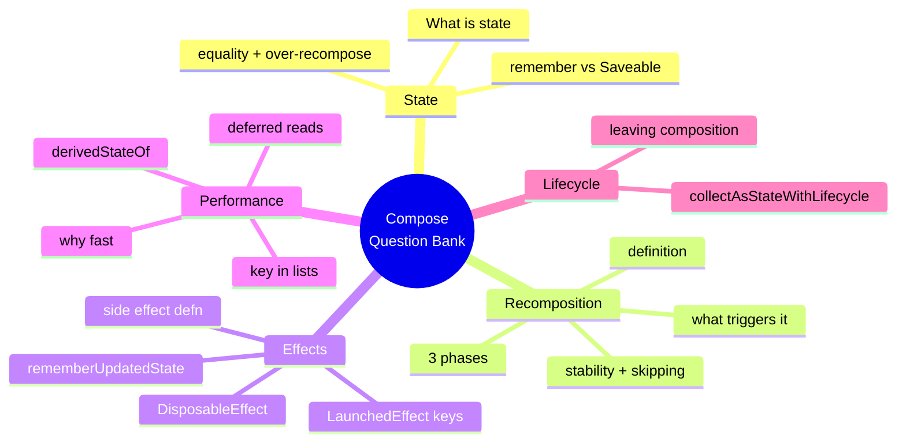
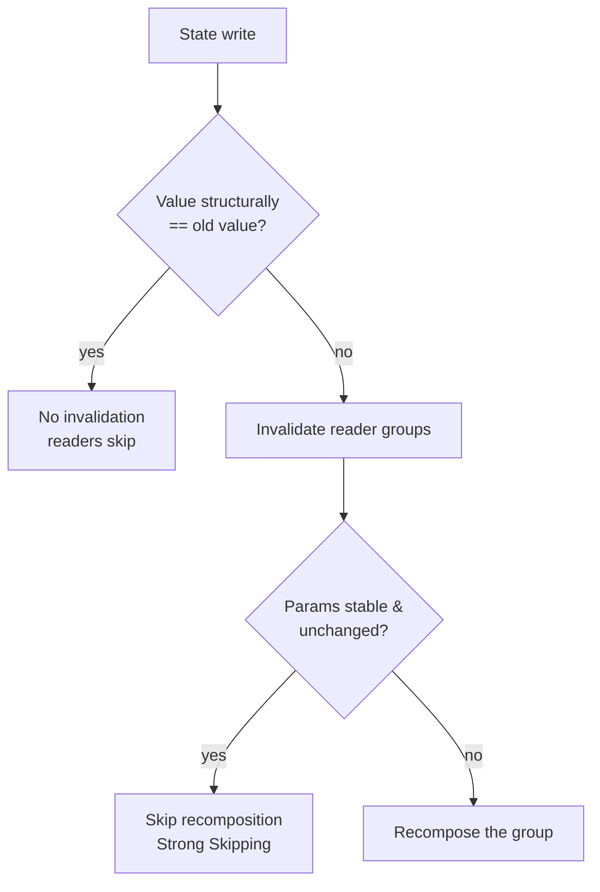

# Lesson 02 — Compose Question Bank

> After this lesson you have a battle-tested bank of Jetpack Compose interview questions across 🟢🟡🔴, each with a model answer, the trap wrong-answer that ends interviews, and the 2026-correct API to cite.

**Module:** 20 · **Lesson:** 02 · **Level:** 🟢🟡🔴 · **Est. time:** 75–90 min

---

## 1. Concept

### 🟢 For beginners — *what is it and why do I care?*

A **question bank** is a curated, layered set of the questions an interviewer is *most likely* to ask, paired with answers good enough to say out loud. Compose is the **#1 most-probed topic** in modern Android interviews because it's how every new screen is built — if you can't talk fluently about state, recomposition, and effects, the Android deep-dive round ends fast.

Why a *bank* and not just "study Compose"? Because interviews test **retrieval under pressure**, not recognition. You may *understand* recomposition perfectly while reading, then freeze when asked to define it cold. Rehearsing real questions builds the muscle that fires when the room goes quiet and the interviewer says *"so… what is recomposition, exactly?"*

### 🟡 For intermediate devs — *the mechanism*

Compose questions cluster into a small number of **themes**, and interviewers walk *up* the difficulty within a theme to find your ceiling:

| Theme | 🟢 entry | 🟡 application | 🔴 ceiling |
|---|---|---|---|
| **State** | What is state? | `remember` vs `rememberSaveable` | equality policy & over-recomposition |
| **Recomposition** | What is it? | What triggers it / scopes it? | stability, `@Stable`, skipping, the 3 phases |
| **Effects** | What's a side effect? | `LaunchedEffect` keys | `DisposableEffect` vs `LaunchedEffect`, `rememberUpdatedState` |
| **Performance** | Why is Compose fast? | `key` in lists, `derivedStateOf` | deferred reads, lambda modifiers, Strong Skipping |
| **Lifecycle** | When does a composable leave? | `collectAsStateWithLifecycle` | composition vs view lifecycle |

The interviewer's pattern is **probe → follow-up → boundary**. A great answer to the entry question *invites* the follow-up by hinting at depth without over-dumping — you control the conversation toward your strengths.

### 🔴 For senior devs — *trade-offs, edges, internals*

At senior level the bank shifts from "define X" to "**when does X break, and why?**" The differentiators:

- **You're expected to reason about the runtime, not just the API.** "Recomposition" answered as "the UI redraws" is a junior answer. The senior answer references **restartable groups**, the **snapshot system**, invalidation granularity (the group, not the screen), and the **three phases** (composition → layout → draw) with the insight that a state read deferred to layout/draw only invalidates *that* phase.
- **Stability is the senior litmus test.** Expect: *"Why did this composable recompose when nothing visible changed?"* The answer — **unstable parameter types** (an unannotated class, a `List` instead of an `ImmutableList`, a lambda capturing unstable state) defeat skipping. In 2026, **Strong Skipping** is default, which skips composables with unstable params *if their arguments are referentially equal* and auto-remembers lambdas — so you must know what Strong Skipping changed and what it *didn't* (it doesn't make unstable types stable).
- **Cite current APIs precisely.** Saying `collectAsState` where `collectAsStateWithLifecycle` is correct, or showing `LiveData.observeAsState` as the default, signals you're a version behind. Senior candidates name the **current idiom** and can say *why* it superseded the old one.
- **Know the boundary of your own knowledge.** The strongest move on a 🔴 question you're unsure about: state the mechanism you *do* know, then say *"the exact internal I'd verify against the current Compose source/docs."* Calibrated > confident-wrong, every time.

### Analogy

A question bank is **sparring, not shadow-boxing.** Reading Compose docs is shadow-boxing — smooth, unopposed, deceptively easy. A real question is a *punch coming back at you*: timed, pressured, with a follow-up jab. You spar with the bank so the real fight has no surprises. And like a boxer, you train *combinations* — the entry answer that sets up the follow-up you want.

### Mental model

> **Interviewers climb a theme until you fall off.** Answer the entry question so well it *invites* the follow-up you're ready for — and on the question you don't know, show where your knowledge ends instead of bluffing past it.

### Real-world example

A candidate is asked *"What is recomposition?"* They answer *"Compose re-runs the composables that read changed state — not a full redraw; granularity is the restartable group."* The interviewer, hearing depth, jumps to *"so what stops a composable from being skipped when its inputs didn't change?"* — exactly the **stability** follow-up the candidate prepared. By over-delivering on the entry question, they steered the round onto their strongest ground. That's the bank working as designed.

---

## 2. Visual Learning

**ASCII — how an interviewer climbs a theme:**
```text
   🟢 "What is state?"  ── solid? ──▶  🟡 "remember vs rememberSaveable?"
                                              │ solid?
                                              ▼
                              🔴 "How does equality cause over-recomposition?"
                                              │ solid?
                                              ▼
                                  (ceiling found → level assigned)
   ── shaky at any rung → they stop climbing & note the ceiling ──
```

**Mermaid — the Compose question themes as a mind map:**


**Mermaid — recomposition decision (a frequently-drawn answer):**


**Illustration prompt:**
```text
Illustration: a video-game-style "skill tree" panel for Jetpack Compose interview topics.
Five branches glow outward from a central node labeled "Compose": State, Recomposition,
Effects, Performance, Lifecycle. Each branch has three ascending nodes colored green,
yellow, red (beginner → senior). A small avatar climbs one branch; the node it's stuck on
pulses red. UI is dark, neon, RPG skill-tree aesthetic, crisp labels, infographic clarity.
Caption: "Interviewers climb until you fall off."
```

---

## 3. Code → The Question Bank (with model answers & traps)

> The "code" here is the bank itself: model answers you can speak, the **trap wrong-answer** (shown briefly, labeled ❌), and the **best-practice phrasing** to internalize — across three difficulty tiers.

### 🟢 Beginner — recall & definitions

```text
Q1. "What is a @Composable function?"
✅ MODEL: A function annotated @Composable that describes a piece of UI by emitting
   other composables. It returns Unit, runs in the composition, and re-runs
   (recomposes) when state it reads changes. UI = f(state).

Q2. "What does `remember` do?"
✅ MODEL: It caches a value across recompositions so it isn't recreated every time the
   composable re-runs. `remember { mutableStateOf(0) }` keeps the SAME state object
   across recompositions. (It does NOT survive config change — that's rememberSaveable.)

Q3. "Difference between `remember` and `rememberSaveable`?"
✅ MODEL: Both survive recomposition. `rememberSaveable` ALSO survives configuration
   changes and process death by saving into a Bundle (via Saver), so a rotated screen
   keeps its value. Use Saveable for user-input you'd hate to lose.
```

**Explanation.** Beginner questions test that you can **define the building blocks crisply** — no hand-waving. Each model answer is one breath long and ends with the *distinction* (what it is vs. what it is **not**), because the follow-up is always "and how is that different from…".

**Common mistakes (the trap answers).**
```text
❌ "remember saves state across rotation."  (NO — that's rememberSaveable. This exact
    confusion is the most common beginner ding.)
❌ "A @Composable returns a View / a UI object."  (It returns Unit and EMITS UI; it
    doesn't return a widget you hold.)
```
Mixing up `remember` and `rememberSaveable` is the single most common beginner mistake — it tells the interviewer you've copied code without understanding lifecycle.

**Best practices.**
- Define **what it is *and* what it is *not*** in one breath — pre-empt the follow-up.
- Anchor every state answer to **"survives recomposition? config change? process death?"**
- Keep beginner answers **short**; depth is for the 🟡/🔴 follow-up you're inviting.

---

### 🟡 Intermediate — application & comparison

```text
Q4. "What triggers recomposition, and what scope recomposes?"
✅ MODEL: A write to a snapshot State that some composable READ during composition.
   Only the readers (restartable groups) that read the changed state recompose — not
   the whole screen. Reading state low/locally keeps the blast radius small.

Q5. "Explain LaunchedEffect and its keys."
✅ MODEL: A coroutine tied to the composition. It launches when it enters composition
   and CANCELS+RESTARTS when any key changes; it cancels when it leaves. Keys are the
   inputs that should restart the work. LaunchedEffect(userId) re-runs when userId
   changes; LaunchedEffect(Unit) runs once per entry.

Q6. "collectAsState vs collectAsStateWithLifecycle?"
✅ MODEL: Both turn a Flow into Compose State. collectAsStateWithLifecycle stops
   collecting when the lifecycle drops below STARTED (app backgrounded), avoiding
   wasted work and stale updates. It's the correct Android default.
```

**Explanation.** Intermediate questions test that you can **use the API correctly under realistic conditions** and **compare two similar tools**. The model answers name the *mechanism* (subscription, key-driven restart, lifecycle gating) and end with the *practical rule*, because the interviewer is checking you'd write it right in real code.

**Common mistakes (the trap answers).**
```text
❌ "LaunchedEffect runs on every recomposition."  (NO — it runs on enter and on KEY
    CHANGE. Saying it runs every recompose is a classic disqualifier.)
❌ "Recomposition redraws the whole screen."  (NO — only readers of the changed state.)
❌ "Just use collectAsState, it's simpler."  (Background collection = wasted work +
    stale state; the lifecycle-aware version is the default.)
```
Claiming `LaunchedEffect` runs every recomposition is a frequent, fatal mistake — it reveals a wrong mental model of effects.

**Best practices.**
- For effects, always state **"runs on enter, restarts on key change, cancels on leave."**
- For any "X vs Y," lead with the **one behavioral difference** that decides which to use.
- Name **`collectAsStateWithLifecycle`** as the default and say *why* (lifecycle gating).

---

### 🔴 Senior — design, internals & trade-offs

```text
Q7. "A composable recomposes when nothing visible changed. Why, and how do you fix it?"
✅ MODEL: Almost always UNSTABLE parameters defeating skipping — an unannotated class,
   a plain List instead of ImmutableList, or a lambda capturing unstable state. With
   Strong Skipping (2026 default) Compose can skip a composable with unstable params
   IF its args are referentially equal and auto-remembers lambdas — but unstable TYPES
   are still unstable. Fix: make the type stable (data class of stable fields,
   kotlinx.collections.immutable, @Immutable/@Stable where the contract holds), or
   stabilize the value with remember. Confirm with Layout Inspector recomposition counts
   and the compiler's stability report.

Q8. "Walk me through the three Compose phases and why they matter for performance."
✅ MODEL: Composition (build/update the tree — what to show) → Layout (measure & place)
   → Draw (paint). A state read in composition invalidates composition; a read deferred
   to LAYOUT or DRAW (e.g. inside a lambda-based modifier like Modifier.offset { } or
   graphicsLayer { }) only invalidates that later phase. So reading scroll/animation
   state in a draw lambda skips recomposition entirely — a major perf lever.

Q9. "DisposableEffect vs LaunchedEffect — when each, and what's the gotcha?"
✅ MODEL: LaunchedEffect for suspendable/coroutine work tied to composition.
   DisposableEffect for NON-suspend setup that needs symmetric CLEANUP (register +
   unregister a listener, add + remove an observer) — it provides onDispose. Gotcha:
   if a long-lived lambda must always call the LATEST captured value without restarting
   the effect, wrap it in rememberUpdatedState so you don't re-key the effect.
```

**Explanation.** Senior answers move from API to **runtime and trade-off**. Q7 is the stability litmus test — the model answer names the *cause* (unstable types), correctly scopes what **Strong Skipping** did and didn't change, gives the *fix*, and ends with how to **verify** (Inspector + compiler report). Q8 shows phase-awareness as a perf tool. Q9 surfaces `rememberUpdatedState`, a senior-only API. Each ends with **verification or a gotcha**, the hallmarks of a senior answer.

**Common mistakes (the trap answers).**
```text
❌ "Strong Skipping means unstable types are now fine / everything is stable."  (NO —
    it changes skipping behavior for referentially-equal args and auto-remembers
    lambdas; it does NOT make an unstable type stable.)
❌ "@Stable / @Immutable — I just slap them on to fix recomposition."  (They're a
    CONTRACT you must actually honor; lying to the compiler causes stale UI.)
❌ "All three phases re-run on every state change."  (Only the phase whose read changed,
    and later phases as needed — deferring reads is the whole point.)
❌ Naming a deprecated default (LiveData.observeAsState as the norm; collectAsState as
    default) — signals a version behind.
```

**Best practices.**
- For stability questions: **name the unstable type → give the fix → say how you'd verify.**
- Treat `@Stable`/`@Immutable` as a **promise to the compiler**, not a magic fix.
- Show **phase-awareness**: defer reads to layout/draw to dodge recomposition.
- Cite the **current** idiom; if unsure of an internal, **say how you'd verify** rather than bluff.

---

## 4. Interview Questions

> These are *the questions about this lesson's questions* — the higher-order, "how do you think about Compose" prompts senior interviewers slip in to test depth beyond recall.

**🟢 Beginner**

1. *"In one sentence, what is the core job of Jetpack Compose?"*
   > To turn **state into UI**: `UI = f(state)`. When state changes, Compose re-runs the functions that read it and updates the affected parts of the screen.
2. *"What's the difference between recomposition and a normal redraw?"*
   > Recomposition re-runs only the composable functions that **read the changed state** to produce a new UI description; it's surgical, not a full-screen repaint. The actual pixel draw is a separate, later phase.

**🟡 Intermediate**

3. *"How do you decide whether something should be `remember`, `rememberSaveable`, or in a ViewModel?"*
   > Ask what must survive what. UI-only ephemeral state (expanded, scroll) → `remember`. State that must survive **rotation/process death** but is screen-local (form input) → `rememberSaveable`. Business/screen state with logic, surviving config changes and tied to a scope → **ViewModel + StateFlow**. (Full decision tree in Module 03.)
4. *"What's a side effect in Compose and why can't it go in the composition path?"*
   > Anything that reaches outside the function — logging, network, mutating external state, starting a coroutine. It can't live in the composition body because recomposition is **idempotent and may run out of order, skip, or repeat**, so the effect would fire an unpredictable number of times. Effects belong in keyed, lifecycle-aware APIs (`LaunchedEffect`, `DisposableEffect`).

**🔴 Senior**

5. *"How would you debug a screen that's janky because it over-recomposes?"*
   > Reproduce, then **measure** with Layout Inspector recomposition counts to find the offending composable. Generate the **Compose compiler stability report** to spot unstable params. Then fix the root cause — make types stable (immutable collections, honored `@Immutable`), defer reads to layout/draw via lambda modifiers, add `key` to list items, or `derivedStateOf` for expensive derivations. Re-measure to confirm, and lock it with a **Macrobenchmark** if it's a hot path.
6. *"What did Strong Skipping change about how you write Compose, and what didn't it change?"*
   > It made the compiler **skip composables even when they have unstable parameters, provided the arguments are referentially equal**, and it **auto-remembers lambdas**, so a lot of manual `remember`-ing of callbacks and defensive stability annotations became unnecessary. What it did **not** change: an unstable *type* is still unstable — if a value's identity changes each recomposition (a fresh `List`, a recreated object), it won't be skipped. So I still reach for immutable collections and honest stability contracts for hot paths; I just write fewer ceremonial `remember`s.

---

## 5. AI Assistant

**Prompt example (drill mode):**
```text
You are a senior Android interviewer. Quiz me on Jetpack Compose, ONE question at a time,
climbing from beginner to senior within a theme (state, recomposition, effects, perf).
After each of my answers: rate it 1–4, point out anything that's outdated for 2026
(e.g. APIs that should be collectAsStateWithLifecycle, Strong Skipping nuances), then
ask the natural follow-up. Don't give me the model answer until I've attempted it.
```

**AI workflow — where it helps on *this* topic.**
- ✅ Great for: **infinite drill reps**, generating follow-ups, rephrasing your answer more tightly, surfacing themes you're weak on, simulating the "climb the theme" pattern.
- ⚠️ Watch: AI sometimes gives **outdated answers** (suggesting `collectAsState`, mis-stating Strong Skipping, recommending deprecated effect patterns). It can also *over-praise* a vague answer. Treat it as a sparring partner, not an oracle — verify any API claim against current docs.

**Review workflow — check AI's answers against this lesson's *Common Mistakes*:**
- Did it say `LaunchedEffect` runs "every recomposition"? **Wrong** — flag it.
- Did it claim Strong Skipping makes unstable types stable? **Wrong** — flag it.
- Did it default to `collectAsState` or `observeAsState`? **A version behind** — correct to `collectAsStateWithLifecycle`.
- Did it treat `@Stable`/`@Immutable` as a magic fix rather than a contract? **Flag it.**

**Validation workflow — prove your answers are real, not parroted:**
1. For any API the AI (or you) mention, **open the current Compose BOM docs** and confirm the signature and that it isn't deprecated.
2. Take a 🔴 answer and **write the actual code**; compile it — does `rememberUpdatedState`/`derivedStateOf` behave as you claimed?
3. For a stability claim, generate the **compiler stability report** on a sample and verify the type really is (un)stable.
4. Do one drill round with a **human**; AI won't replicate the silence-pressure or a skeptical "are you sure?" follow-up.

> **AI drafts, you decide.** Let the AI throw infinite punches, but **verify every API claim against the docs** — an interviewer will catch a confidently-wrong, outdated answer instantly, and that confidence-without-correctness is the worst signal you can send.

---

## Recap / Key takeaways

- Compose is the **most-probed** Android interview topic; rehearse a **bank**, because interviews test **retrieval under pressure**, not recognition.
- Questions cluster into **themes** (state, recomposition, effects, perf, lifecycle); interviewers **climb a theme** to find your ceiling.
- Answer the **entry question so well it invites the follow-up** you're prepared for — you steer the round.
- 🔴 answers move from **API to runtime + trade-off**, and end with **verification or a gotcha** (Layout Inspector, stability report, `rememberUpdatedState`).
- Know what **Strong Skipping** changed (skip with referentially-equal unstable args; auto-remember lambdas) and what it **didn't** (unstable types are still unstable).
- Cite **current** APIs (`collectAsStateWithLifecycle`); on an unknown internal, **say how you'd verify** rather than bluff.

➡️ Next: **[Lesson 03 — Kotlin & Coroutines Questions](03-kotlin-coroutines-questions.md)** — the language and concurrency fundamentals interviewers probe right after Compose.
