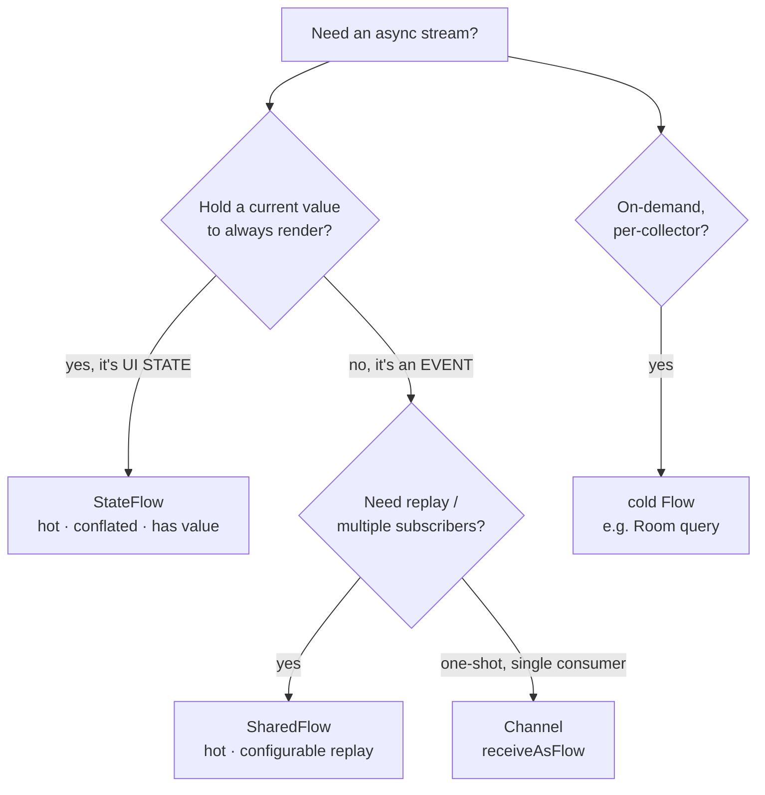
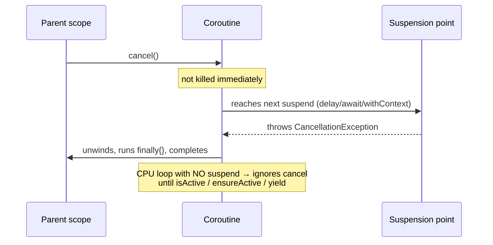

# Lesson 03 — Kotlin & Coroutines Questions

> After this lesson you can field the Kotlin-language and coroutines/Flow questions that gate every Android role — structured concurrency, scopes, `suspend`, `StateFlow` vs `SharedFlow`, and the cancellation traps that catch even experienced devs.

**Module:** 20 · **Lesson:** 03 · **Level:** 🟢🟡🔴 · **Est. time:** 75–90 min

---

## 1. Concept

### 🟢 For beginners — *what is it and why do I care?*

Compose is *how* you draw the screen; **Kotlin and coroutines are how everything else works** — fetching data, talking to a database, reacting to streams of events. Interviewers probe Kotlin because it's the language the whole app is written in, and they probe **coroutines** because asynchronous code is where most real bugs and crashes live (leaked work, race conditions, ANRs).

The two ideas you must own:

- **Kotlin fundamentals**: `val`/`var`, null safety (`?`, `?:`, `!!`), data classes, `sealed`, extension functions, higher-order functions, scope functions (`let`/`apply`/`run`). These show up as quick warm-ups and as the building blocks of every other answer.
- **Coroutines**: a way to write asynchronous code that *looks* sequential. A `suspend` function can pause without blocking the thread, so you can write "load user, then load their posts" top-to-bottom instead of nesting callbacks.

Why you care: a junior who writes a network call on the main thread crashes the app; a junior who launches work in the wrong scope leaks it. Interviewers test this because it's the difference between a stable app and a flaky one.

### 🟡 For intermediate devs — *the mechanism*

The concept that ties coroutines together is **structured concurrency**: every coroutine runs inside a **scope** with a **`Job`**, and scopes form a parent–child tree. Three consequences interviewers love:

1. **A scope won't complete until its children complete** — no orphaned work.
2. **Cancelling a scope cancels all its children** — `viewModelScope` cancels when the ViewModel clears; the leak is structurally prevented.
3. **A failing child, by default, cancels the parent and siblings** — unless you use a `SupervisorJob`/`supervisorScope`, which isolates failures.

The other half is **Flow**, Kotlin's async stream:

| Type | Hot/Cold | Holds a value? | Use for |
|---|---|---|---|
| `Flow` | **cold** (runs per collector) | no | one-shot or on-demand streams (a DB query) |
| `StateFlow` | **hot** | **yes** (always has current) | UI **state** (the screen's current snapshot) |
| `SharedFlow` | **hot** | configurable replay | **events** (navigation, one-shot effects) |

You should be able to say *why* UI state is a `StateFlow` (always has a value to render, conflates duplicates) and one-shot events are a `SharedFlow`/`Channel` (no "current value" to re-fire on rotation).

### 🔴 For senior devs — *trade-offs, edges, internals*

Senior Kotlin/coroutine questions hunt for the **failure modes**:

- **Cancellation is cooperative.** A coroutine isn't force-killed; it's cancelled by throwing `CancellationException` at the next **suspension point**. Tight CPU loops with no suspension **ignore cancellation** until they check `isActive`/`ensureActive()`/`yield()`. And the classic trap: a `try/catch (e: Exception)` that swallows `CancellationException` **breaks cancellation** — you must rethrow it (or catch only your own exceptions). This is the most common senior coroutine bug.
- **`CoroutineScope` vs `coroutineScope` vs `supervisorScope`.** The capital-`C` `CoroutineScope(...)` *creates* a scope (you own its lifecycle); `coroutineScope { }` is a suspending builder that inherits context and **fails fast** (one child fails → all cancel); `supervisorScope { }` **isolates** child failures. Knowing which to reach for is a leveling signal.
- **`Dispatchers` and main-safety.** `Dispatchers.Main` for UI, `IO` for blocking I/O, `Default` for CPU work. A well-designed `suspend` function is **main-safe** — it switches to the right dispatcher *internally* with `withContext`, so callers never have to think about threads. Repository functions that force the caller to remember `withContext(IO)` are a design smell.
- **`launch` vs `async`.** `launch` is fire-and-forget returning a `Job`; `async` returns a `Deferred<T>` you `await`. Using `async { }.await()` back-to-back (instead of two parallel `async`s) is a non-parallelism anti-pattern. And an un-awaited `async` **swallows exceptions** until awaited — a real footgun.
- **`StateFlow` conflation & equality.** `StateFlow` conflates and uses `equals` — emitting a value `==` the current one **emits nothing to collectors**. Combined with an unstable type, this causes "my UI didn't update" or "it updated too much." Pair with the Compose stability story from Lesson 02.

### Analogy

Structured concurrency is a **company org chart.** Every employee (coroutine) reports to a manager (parent `Job`) inside a department (scope). When the department is dissolved (scope cancelled), **everyone in it is let go** — no one keeps working in an empty building (no leaks). If one critical employee quits in a non-supervised team, the whole team is disbanded (failure propagates); a **supervisor** keeps the rest employed while replacing the one who left. Cancellation is a *resignation letter delivered at the next coffee break* (suspension point) — not a security escort dragging you out mid-keystroke (it's cooperative).

### Mental model

> **Coroutines live in a scope tree: cancel the parent, cancel the children. Cancellation is cooperative (it lands at suspension points) — so never swallow `CancellationException`, and make `suspend` functions main-safe.**

### Real-world example

A search screen launches a network request on every keystroke in `viewModelScope`. Without care, ten requests race and the *last-finishing* (not last-typed) result wins — a stale-data bug. The fix is operator-level: `flatMapLatest` (or `collectLatest`) **cancels the in-flight request** when a new query arrives — structured concurrency doing exactly its job. And because the ViewModel scope cancels on clear, no request leaks past the screen.

---

## 2. Visual Learning

**ASCII — the structured-concurrency scope tree:**
```text
        viewModelScope  (Job)          ← cancels when ViewModel cleared
         ├── launch { loadUser() }      (child Job)
         │      └── async { avatar() }  (grandchild)
         └── launch { observe() }       (child Job)
   cancel scope ──▶ CancellationException propagates DOWN to every child
   child throws  ──▶ (default) propagates UP, cancels siblings
                 ──▶ (supervisorScope) isolated, siblings survive
```

**Mermaid — Flow type decision:**


**Mermaid — cancellation as a sequence (the cooperative part):**


**Illustration prompt:**
```text
Illustration: a corporate org-chart tree rendered as glowing nodes. The top node is a
manager labeled "viewModelScope (Job)"; child nodes are employees labeled "launch",
"async". A red "cancel" signal flows DOWN the tree turning child nodes off (let go).
One child node has a small shield icon labeled "supervisorScope" and stays lit while a
sibling next to it goes dark. Tiny coffee-cup icons sit between tasks labeled
"suspension point — where cancellation lands". Modern infographic, soft gradients,
crisp labels. Caption: "Cancel the parent, cancel the children."
```

---

## 3. Code → The Question Bank (with model answers & traps)

> Three tiers of real Kotlin/coroutine interview questions, each with a model answer you can speak, the **trap wrong-answer** (labeled ❌), and best-practice phrasing.

### 🟢 Beginner — Kotlin & coroutine basics

```text
Q1. "val vs var, and what is null safety?"
✅ MODEL: `val` is a read-only reference (can't reassign); `var` is mutable. Null safety
   means the type system separates nullable (String?) from non-null (String); you must
   handle null explicitly with ?. (safe call), ?: (elvis/default), or !! (assert — avoid).
   This eliminates most NullPointerExceptions at compile time.

Q2. "What is a suspend function?"
✅ MODEL: A function that can PAUSE its execution and resume later without BLOCKING the
   thread. It can only be called from another suspend function or a coroutine. It lets
   you write async code (network, DB) sequentially instead of with callbacks.

Q3. "Why can't you do network work on the main thread?"
✅ MODEL: The main thread renders the UI; blocking it freezes the app and triggers an ANR
   ("Application Not Responding"). Async/IO work runs on a background dispatcher
   (Dispatchers.IO) so the UI stays responsive.
```

**Explanation.** Beginner questions confirm you know the **vocabulary and the why**. Each answer ends with the *consequence* (`!!` → crash; blocking main → ANR), because interviewers want to see you connect a language feature to real app behavior, not recite a definition.

**Common mistakes (the trap answers).**
```text
❌ "val means the value can never change."  (Imprecise — the REFERENCE can't be
    reassigned; a `val` list can still have its contents mutated. Say "read-only ref".)
❌ "suspend makes code run on a background thread."  (NO — suspend itself doesn't change
    threads; the DISPATCHER does. A suspend fun can run on Main.)
❌ "Use !! to handle nulls."  (That ASSERTS non-null and crashes if wrong — it's the
    opposite of handling.)
```
"`suspend` = background thread" is a top beginner misconception — `suspend` controls *suspension*, the dispatcher controls *threading*.

**Best practices.**
- Say **"read-only reference"** for `val`, not "constant" — and note contents can still mutate.
- Separate **suspension** (what `suspend` does) from **threading** (what the dispatcher does).
- Treat `!!` as a code smell; prefer `?.`/`?:`/`requireNotNull` with a message.

---

### 🟡 Intermediate — structured concurrency & Flow

```text
Q4. "Explain structured concurrency."
✅ MODEL: Every coroutine runs in a scope with a parent Job, forming a tree. A scope
   won't finish until its children finish (no orphaned work), cancelling a scope cancels
   all children (no leaks), and a child failure propagates to the parent by default. It
   makes async lifecycles predictable — viewModelScope cancels on clear, so screen work
   never outlives the screen.

Q5. "launch vs async?"
✅ MODEL: `launch` is fire-and-forget; it returns a Job and surfaces exceptions to the
   handler. `async` returns Deferred<T>; you call await() to get the result and it
   defers exceptions until awaited. Use launch for side effects, async for parallel
   computation you need results from (two async blocks, then await both).

Q6. "StateFlow vs SharedFlow vs Flow — when each?"
✅ MODEL: cold Flow for on-demand per-collector streams (a Room query). StateFlow (hot,
   always holds a current value, conflates) for UI STATE the screen renders. SharedFlow
   (hot, configurable replay) for one-shot EVENTS like navigation. State has a value;
   events don't (so they don't re-fire on rotation).
```

**Explanation.** Intermediate questions test **correct usage and tool selection**. The model answers name the *behavioral property* that decides the choice — `launch` surfaces exceptions vs `async` defers them; `StateFlow` holds a value vs `SharedFlow` doesn't. Interviewers are checking you'd pick the right tool in a code review, not just define all three.

**Common mistakes (the trap answers).**
```text
❌ "async runs in parallel, launch runs sequentially."  (Both run concurrently; the real
    difference is Deferred/result + exception timing, not parallelism.)
❌ "Use StateFlow for one-shot navigation events."  (NO — StateFlow holds a value and
    REPLAYS it; navigation re-fires on rotation. Use SharedFlow/Channel.)
❌ async { ... }.await() then async { ... }.await() for "parallel" work.  (That's
    SEQUENTIAL — start both asyncs first, THEN await both.)
```
Putting one-shot events in a `StateFlow` is the most common Flow mistake — it re-emits the "current value" on every new collector, re-firing navigation after rotation.

**Best practices.**
- Tie every concurrency answer back to **structured concurrency** (scope → no leaks).
- Choose `StateFlow` for **state** (has a value), `SharedFlow`/`Channel` for **events** (no value).
- For parallelism, **start all `async`s, then `await` all** — never `await` between starts.

---

### 🔴 Senior — cancellation, scopes & main-safety

```text
Q7. "How does cancellation actually work, and how is it commonly broken?"
✅ MODEL: Cancellation is COOPERATIVE — cancelling sets the Job inactive and throws
   CancellationException at the next SUSPENSION POINT (delay, await, withContext). A
   tight CPU loop with no suspension ignores cancellation until it checks isActive /
   ensureActive() / yield(). It's broken when code does try { } catch (e: Exception) { }
   and SWALLOWS CancellationException — you must rethrow it (or catch only your own
   exceptions). Cleanup goes in finally, and if you must suspend during cleanup, use
   withContext(NonCancellable).

Q8. "CoroutineScope vs coroutineScope vs supervisorScope?"
✅ MODEL: CoroutineScope(...) (capital C) CREATES a scope whose lifecycle you own (you
   must cancel it). coroutineScope { } is a suspending builder that inherits context and
   FAILS FAST — one child fails, all are cancelled and it rethrows. supervisorScope { }
   is the same but ISOLATES failures — a failing child doesn't cancel its siblings. Use
   supervisorScope when independent tasks shouldn't take each other down.

Q9. "What does 'main-safe' mean and how do you design for it?"
✅ MODEL: A main-safe suspend function is safe to call from the main thread because it
   moves blocking work off-main INTERNALLY with withContext(Dispatchers.IO/Default).
   Callers never manage threads. e.g. a repo's loadUser() does withContext(IO) around
   the DB/network call itself. This keeps dispatcher discipline at the boundary, not
   smeared across every call site.
```

**Explanation.** Senior answers expose the **sharp edges**. Q7 is the litmus test — naming cooperative cancellation, the suspension-point mechanism, *and* the swallow-`CancellationException` bug (plus `NonCancellable` cleanup) is a clear senior signal. Q8 distinguishes three look-alike APIs by failure behavior. Q9 reframes threading as an **API design** concern (push `withContext` into the function, not onto callers). Each answer carries a *design or correctness* insight, not just a definition.

**Common mistakes (the trap answers).**
```text
❌ try { work() } catch (e: Exception) { log(e) }  // ❌ swallows CancellationException
   → cancelled coroutines keep running their catch path; cancellation silently breaks.
   FIX: catch (e: CancellationException) { throw e } first, or catch specific exceptions.

❌ "coroutineScope and supervisorScope are the same."  (NO — failure propagation
    differs: fail-fast vs isolated.)
❌ Forcing callers to wrap calls in withContext(IO).  (Not main-safe; dispatcher logic
    leaks to every call site. Put withContext INSIDE the function.)
❌ GlobalScope.launch { } for app work.  (Unstructured → leaks, no lifecycle. Use a
    proper scope.)
```

**Best practices.**
- For cancellation: **cooperative → lands at suspension points → never swallow `CancellationException` → cleanup in `finally` (`NonCancellable` if it must suspend).**
- Match the scope builder to the **failure policy** you want (fail-fast `coroutineScope` vs isolated `supervisorScope`).
- Make `suspend` functions **main-safe** with internal `withContext`; never `GlobalScope`.

---

## 4. Interview Questions

> The cross-cutting Kotlin/coroutine prompts that tie the lesson together, with model answers.

**🟢 Beginner**

1. *"What's a data class and why is it useful for state?"*
   > A class declared `data class` that auto-generates `equals`/`hashCode`/`toString`/`copy` from its primary-constructor properties. It's ideal for UI state because `copy` lets you produce the *next* immutable state cheaply, and value-based `equals` lets `StateFlow`/Compose detect real changes.
2. *"What does the elvis operator `?:` do?"*
   > It provides a fallback when the left side is null: `name ?: "Guest"` yields `name` if non-null, else `"Guest"`. It's the idiomatic way to supply defaults and avoid `!!`.

**🟡 Intermediate**

3. *"How do you run two network calls in parallel and combine the results?"*
   > Inside a coroutine, start both with `async` *before* awaiting either, then await both: `val a = async { x() }; val b = async { y() }; combine(a.await(), b.await())`. Because they're started first, they run concurrently. They're children of the scope, so if one fails the structured-concurrency rules apply (and `supervisorScope` if I want isolation).
4. *"Why is `viewModelScope` the right place to launch UI-related work?"*
   > It's lifecycle-bound: it's cancelled automatically when the ViewModel is cleared, so coroutines can't leak past the screen. It also defaults to `Dispatchers.Main.immediate`, which is correct for updating state, while main-safe suspend functions move heavy work off-main internally.

**🔴 Senior**

5. *"A coroutine in a `viewModelScope` keeps running after the user leaves the screen. What are the likely causes?"*
   > Either it escaped the structured tree (launched in `GlobalScope` or a non-cancelled custom `CoroutineScope`), or it's **ignoring cooperative cancellation** — a CPU-bound loop with no suspension point, or a `catch (Exception)` that swallowed `CancellationException`. I'd verify the scope, add `ensureActive()`/`yield()` to long loops, and make sure cancellation isn't being caught. Cleanup belongs in `finally`.
6. *"Design the threading for a repository method that reads from Room and falls back to the network. Where do dispatchers go?"*
   > The method is a single **main-safe** `suspend fun`. Inside, the Room call is already main-safe (Room suspends off-main), and the network call is wrapped in `withContext(Dispatchers.IO)`. The caller (ViewModel) just `launch`es it in `viewModelScope` with no dispatcher juggling. Dispatcher discipline lives at the **boundary inside the repo**, not at every call site — that's what main-safety buys you.

---

## 5. AI Assistant

**Prompt example (concurrency code review drill):**
```text
You are a senior Kotlin interviewer. Show me 5 short coroutine/Flow snippets, one at a
time, each containing a SUBTLE bug (swallowed CancellationException, StateFlow used for
events, sequential async, missing main-safety, GlobalScope leak). Ask me to find and fix
the bug and explain it. After my answer, confirm or correct me and cite the 2026-correct
pattern. Don't reveal the bug until I've tried.
```

**AI workflow — where it helps on *this* topic.**
- ✅ Great for: generating buggy snippets to debug, drilling "X vs Y" comparisons, explaining structured-concurrency edge cases, producing flashcards on dispatchers/Flow types.
- ⚠️ Watch: AI frequently **swallows `CancellationException`** in generated `try/catch`, **uses `StateFlow` for events**, writes **sequential `async`s** it calls "parallel," and **omits `withContext`** for main-safety. It may also suggest `GlobalScope`. These are the exact mistakes this lesson flags — so AI output is great *practice material* precisely because it contains them.

**Review workflow — check AI's coroutine code against this lesson's *Common Mistakes*:**
- Does any `catch` swallow `CancellationException`? It must **rethrow** (or catch specific exceptions).
- Are one-shot **events** on a `StateFlow`? Move to `SharedFlow`/`Channel`.
- Are "parallel" `async`s actually started before any `await`? Or are they sequential?
- Is the `suspend` function **main-safe** (internal `withContext`), or does it push threading onto the caller?
- Any `GlobalScope`? Replace with a lifecycle-bound scope.

**Validation workflow — prove the concurrency actually behaves:**
1. **Write a test with Turbine** asserting the `Flow`/`StateFlow` emits what you claim (loading → success/error).
2. Add a **cancellation test**: cancel the scope mid-work and assert the coroutine stops and runs `finally` (catches a swallowed-cancellation bug).
3. For "parallel" claims, **log timestamps** — confirm the two `async`s overlap, not run back-to-back.
4. Run on a **real device with StrictMode** to catch accidental main-thread blocking that broke main-safety.

> **AI drafts, you decide.** AI-generated coroutine code is unusually good *drill material* because it reliably contains the canonical bugs — your job is to catch the swallowed cancellation, the misused `StateFlow`, and the missing `withContext` *before* an interviewer does.

---

## Recap / Key takeaways

- Kotlin is the language of the whole app; **coroutines** are where async bugs (leaks, races, ANRs) live — both are gated in every Android loop.
- **Structured concurrency**: coroutines form a scope tree — finish-before-parent (no orphans), **cancel-parent-cancels-children** (no leaks), failure propagates by default.
- **Cancellation is cooperative** — it lands at suspension points; **never swallow `CancellationException`**, put cleanup in `finally` (`NonCancellable` if it must suspend).
- **Flow types by intent**: cold `Flow` (on-demand), `StateFlow` (UI **state**, has a value), `SharedFlow`/`Channel` (one-shot **events**).
- **`launch` vs `async`** differ by result + exception timing, *not* parallelism; start all `async`s before awaiting.
- Design **main-safe** `suspend` functions (internal `withContext`); never `GlobalScope`.

➡️ Next: **[Lesson 04 — System Design for Android](04-system-design-for-android.md)** — a repeatable framework for the open-ended mobile design round (image feed, offline sync, chat).
