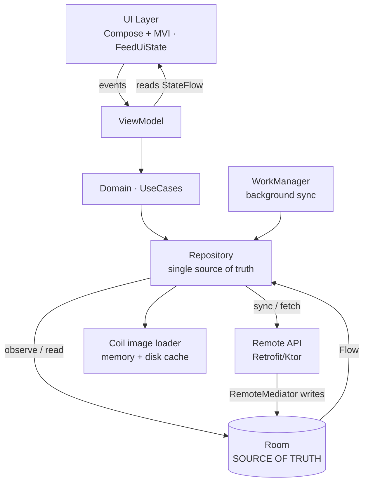
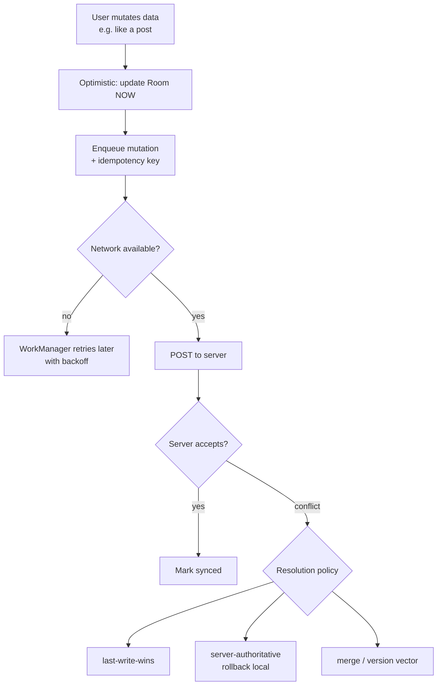

# Lesson 04 — System Design for Android

> After this lesson you can run an Android system-design round end to end with a repeatable framework — clarify, design the API, model the data, handle offline + paging, and discuss scale — using the canonical problems (image feed, offline sync, chat) as your proving ground.

**Module:** 20 · **Lesson:** 04 · **Level:** 🟢🟡🔴 · **Est. time:** 100–120 min

---

## 1. Concept

### 🟢 For beginners — *what is it and why do I care?*

A **system-design round** hands you a deliberately vague prompt — *"Design Instagram's feed"*, *"Design a chat app"* — and watches **how you think**, not whether you memorized an answer. There is no single right solution. The interviewer is evaluating whether you can take ambiguity and turn it into a sensible, defensible **mobile** architecture.

The trap beginners fall into: **jumping straight to a solution** (*"I'll use Room and Retrofit"*) before understanding the problem. The skill being tested is the *process* — asking the right questions, making explicit trade-offs, and structuring the design so a teammate could build it.

Why you care: this is the round that most often decides **seniority**. Coding rounds have a ceiling (you solved it or you didn't); system design is open-ended, so it's where staff-level thinking visibly separates from mid-level. For many candidates it's the **hardest** round precisely because there's no script — which is exactly why having a **framework** is such an advantage.

### 🟡 For intermediate devs — *the mechanism*

Android system design is **not** backend system design. Nobody wants you to draw load balancers and shard a Postgres cluster. The questions that matter are **mobile-specific**:

- **Offline-first**: the app must work on a subway with no signal. Where's the source of truth? (Almost always a local DB.)
- **Sync**: how does local data reconcile with the server? Conflict resolution? Optimistic updates?
- **Pagination**: feeds are infinite; you load pages, not everything.
- **Caching & freshness**: what's cached, for how long, when do you invalidate?
- **State management**: how does UI state flow (UDF/MVI from Module 03)?
- **Constraints**: battery, limited memory, flaky networks, image loading, background work limits.

A repeatable **5-step framework** carries you through any prompt:

```
1. CLARIFY   — scope the problem; ask requirements (functional + non-functional).
2. API       — define the data contract (endpoints / models the client consumes).
3. DATA      — model local + remote; pick the source of truth (offline-first?).
4. ARCH      — layers (UI → domain → data), UDF, key components, libraries.
5. SCALE     — paging, sync/conflicts, caching, offline, perf, edge cases.
```

You **narrate** as you go and **draw** the architecture. The interviewer steers by poking at a layer; you go deep where they push.

### 🔴 For senior devs — *trade-offs, edges, internals*

Senior system-design performance is about **surfacing and defending trade-offs unprompted**, and showing **mobile-platform judgment**:

- **Source of truth is the first real decision.** Offline-first means the **local database is the single source of truth**; the network is just a *sync mechanism* that updates the DB, and the UI **only ever reads the DB** (the repository pattern, Module 13). The alternative — UI reading network directly with a cache — is simpler but breaks offline and causes UI tearing. State the choice and why.
- **Sync is where seniority shows.** Naming the strategy matters: **optimistic updates** (apply locally, reconcile later) for snappy UX; **conflict resolution** policy (last-write-wins vs. version vectors vs. server-authoritative); **idempotency keys** so a retried mutation doesn't double-post; **delta sync** (only fetch changes since a cursor) vs. full refresh. *"Just use Room"* with none of this is a mid-level answer.
- **Pagination strategy and its failure modes.** **Cursor-based** (keyset) pagination beats **offset** for feeds because offset breaks when items are inserted/deleted between page loads (duplicates/skips). On Android, **Paging 3 + `RemoteMediator`** is the idiomatic way to page from the network into a Room cache that backs the UI — name it and explain the layering.
- **Platform constraints are first-class.** Background sync must respect **WorkManager** constraints and **Doze**/background limits; images need a loader (Coil) with memory/disk caching and downsampling to avoid OOM; large lists need stable `key`s and avoid loading full-res bitmaps. A backend-flavored answer that ignores battery/Doze/memory signals "doesn't think mobile."
- **Non-functional requirements drive the design.** Latency targets, offline duration, data freshness SLAs, consistency model (eventual vs strong), and failure behavior (what shows when sync fails?) should be **stated as requirements** in step 1 and **revisited** in step 5. Seniors design *to* explicit NFRs.
- **Know what you'd measure.** "How do you know the feed is fast?" → frame-time via Macrobenchmark/JankStats, sync success rate, cache hit rate, cold-start time. Designs you can't measure, you can't defend.

### Analogy

A system-design round is an **architect's site walkthrough**, not a finished blueprint. The client says "I want a house" (vague prompt). A bad architect immediately says "concrete, three bedrooms" (jumps to a solution). A good architect **asks**: who lives here, what's the budget, what's the climate (clarify NFRs)? Then sketches rooms and how they connect (layers), notes the plot floods in winter so the foundation must be raised (mobile constraint: offline/Doze), and explains *why* each choice — out loud, with the client, adjusting as they react. You're hired for the **thinking made visible**, not a perfect drawing.

### Mental model

> **Clarify before you solve. Make the local DB your source of truth, the network a sync mechanism, and the UI a reader. Then name your paging, sync, and conflict strategies out loud — and design to explicit non-functional requirements.**

### Real-world example

*"Design an image feed (like Instagram)."* The strong candidate clarifies (infinite scroll? offline? video too? how fresh?), defines a paged feed endpoint with a **cursor**, models a `PostEntity` in Room as the source of truth, uses **Paging 3 + `RemoteMediator`** to fill Room from the network, loads images with **Coil** (downsampled, disk-cached), drives the UI with an **MVI** `FeedUiState`, and handles likes with **optimistic updates** plus an **idempotency key**. They close on scale: prefetch distance, frame-time budget, what shows offline. That's a complete senior answer built from the 5-step framework.

---

## 2. Visual Learning

**ASCII — the 5-step framework as a timeline you narrate:**
```text
  [1 CLARIFY]──▶[2 API]──▶[3 DATA]──▶[4 ARCH]──▶[5 SCALE]
   ~5 min        ~5min     ~10min     ~10min     ~10min
   requirements  contract  source-of  layers +   paging, sync,
   func + NFR    /models   truth      UDF/MVI    conflicts, cache,
                                                 offline, perf, edges
   └─ ask first ──────────── DRAW the boxes & arrows ───── go deep where poked ─┘
```

**Mermaid — the offline-first Android architecture you'll draw most:**


**Mermaid — sync/conflict decision (the senior differentiator):**


**Illustration prompt:**
```text
Illustration: a clean mobile-architecture diagram on a glowing whiteboard. Three stacked
horizontal bands labeled "UI (Compose + MVI)", "Domain (UseCases)", "Data (Repository)".
Below the Data band, two boxes: a bright database cylinder labeled "Room — SOURCE OF
TRUTH" and a cloud labeled "Remote API". An arrow shows the network writing INTO the
database, and the UI reading only FROM the database. Side icons: a battery (Doze/
WorkManager), a photo (Coil cache), a wifi-off symbol (offline-first). Marker-sketch
whiteboard aesthetic, neat labels, soft glow. Caption: "DB is truth; network syncs it."
```

---

## 3. Code → The Design Framework (worked, with traps)

> The "code" of a design round is the **framework applied to a prompt**, plus the small architectural snippets you'd sketch. Three tiers: a minimal walkthrough, a realistic feed design, and a production-grade sync/conflict design — each with Explanation, Common Mistakes, Best Practices.

### 🟢 Beginner — the framework on a simple prompt ("Design a notes app")

```text
PROMPT: "Design a notes-taking app."

1. CLARIFY (ask, don't assume)
   - Offline support? (assume YES — notes must work without signal)
   - Sync across devices? Single user?
   - Rich text or plain? Search?  → keep scope tight; confirm with interviewer.

2. API
   GET  /notes?updatedSince={cursor}   → list of notes (delta sync)
   POST /notes        (create)  PUT /notes/{id} (update)  DELETE /notes/{id}
   Note model: { id, title, body, updatedAt, deleted: Boolean }

3. DATA (source of truth = local DB)
   NoteEntity in Room; UI observes Room via Flow. Network only SYNCS into Room.

4. ARCH
   UI (Compose, list + editor) → ViewModel (NotesUiState) → Repository → Room + Api

5. SCALE / edges
   - Conflict: last-write-wins by updatedAt (state this).
   - Soft-delete with a `deleted` flag so deletions sync.
   - WorkManager periodic sync; offline edits queue and sync when online.
```

**Explanation.** Even a "simple" prompt runs the **full 5 steps** — that's the point. Clarifying first prevents building the wrong thing; declaring the **DB as source of truth** in step 3 makes offline fall out naturally; naming **last-write-wins** and **soft-delete** in step 5 shows you thought past the happy path. The structure *is* the score.

**Common mistakes.**
```text
❌ Starting at step 4 ("I'll use Room and a ViewModel") with no clarify/API/data.
   → You've assumed the requirements; the interviewer wanted to see you discover them.
❌ Saying "it syncs" with no conflict policy or delete handling.
   → Sync without a conflict story is the #1 hand-wave.
```
Skipping CLARIFY is the most common — and most damaging — mistake; you can build a flawless design for the wrong problem.

**Best practices.**
- **Always start by clarifying**; restate the scope back to the interviewer before designing.
- Run **all five steps**, even when the prompt seems small.
- Name your **conflict policy** explicitly, however simple (last-write-wins is fine if stated).

---

### 🟡 Intermediate — the image feed (paging + cache)

```text
PROMPT: "Design an infinite image feed."

1. CLARIFY: infinite scroll? offline cache? video? freshness SLA? auth?
   → assume: image+caption, infinite, cache recent pages, pull-to-refresh.

2. API (cursor-based paging — NOT offset)
   GET /feed?cursor={c}&limit=20  → { items: [Post], nextCursor }
   Post: { id, imageUrl, caption, authorId, likeCount, likedByMe }

3. DATA: PostEntity in Room is source of truth; RemoteKeys table for cursors.

4. ARCH: Compose LazyColumn ← Paging 3 PagingData ← Pager(RemoteMediator)
         RemoteMediator writes network pages INTO Room; UI pages FROM Room.
```

```kotlin
// The layering you'd sketch and name (Paging 3 + Room as source of truth):
@OptIn(ExperimentalPagingApi::class)
fun feedPager(db: AppDb, api: FeedApi): Flow<PagingData<PostEntity>> = Pager(
    config = PagingConfig(pageSize = 20, prefetchDistance = 10),
    remoteMediator = FeedRemoteMediator(db, api),   // network → Room
    pagingSourceFactory = { db.postDao().pagingSource() }, // UI reads Room
).flow
```

```text
5. SCALE:
   - Cursor paging avoids offset duplicate/skip bugs on inserts.
   - Coil for images: downsample, memory+disk cache, placeholder, OOM-safe.
   - prefetchDistance tuned so the next page loads before the user hits the end.
   - Offline: Room-backed paging serves cached pages with no network.
   - Freshness: invalidate/refresh on pull-to-refresh; show stale-while-revalidate.
```

**Explanation.** This is the canonical Android design. The key moves: **cursor (not offset)** paging in step 2 (and *why* — inserts break offset), **Room as the paging source of truth** with **`RemoteMediator`** filling it in step 4 (so offline works for free), and **Coil with downsampling** in step 5 (the memory-constraint awareness). Naming **Paging 3** specifically and explaining its layering signals real platform fluency.

**Common mistakes.**
```text
❌ Offset pagination (?page=3): items shift when content is inserted/deleted between
   loads → duplicates or skipped posts. Use a CURSOR/keyset.
❌ UI pages directly from the network with no DB → no offline, and a network blip
   empties the feed. Page from Room; let RemoteMediator sync.
❌ Loading full-resolution bitmaps into a list → OutOfMemory on long scroll. Downsample
   via the image loader.
```

**Best practices.**
- **Cursor-based** paging for feeds; reserve offset for fixed, append-only data.
- Page **from Room**, fill Room via **`RemoteMediator`** — the UI never depends on the network being up.
- Always name **image-loading constraints** (downsample, cache, placeholder) — interviewers wait for it.

---

### 🔴 Production — offline sync with conflict resolution (the chat / collaborative case)

```text
PROMPT: "Design a chat app that works offline."

1. CLARIFY (NON-FUNCTIONAL requirements drive everything here):
   - Ordering guarantee? (messages must appear in send order)
   - Delivery semantics? (at-least-once → need idempotency)
   - Offline send? (YES — queue locally, send when online)
   - Multi-device? Read receipts? Group vs 1:1?  → confirm scope + SLAs.

2. API:
   - WebSocket (or push) for realtime inbound messages.
   - POST /messages { clientId (UUID), conversationId, body, sentAt }  ← idempotency key
   - GET  /messages?conversationId&since={cursor}  ← delta sync on reconnect.

3. DATA (Room = source of truth; UI ONLY reads Room):
   MessageEntity { id?, clientId (UUID, stable), conversationId, body, sentAt,
                   status: ENUM(PENDING, SENT, DELIVERED, FAILED) }
   - Optimistic: insert with status=PENDING immediately → UI shows it instantly.

4. ARCH:
   UI (Compose) ← StateFlow ← ViewModel ← Repository ← Room (truth) + Socket/Api
   - WorkManager (or a foreground service for active chat) drains the outbox.

5. SCALE / CONFLICTS / EDGES:
   - IDEMPOTENCY: server dedupes on clientId → safe retries, no double-send.
   - ORDERING: order by (sentAt, clientId) or server sequence; reconcile on ack.
   - CONFLICT POLICY: messages are append-only (rare conflicts); for editable data
     (profile, doc) pick last-write-wins / server-authoritative / merge — STATE it.
   - DELTA SYNC on reconnect via `since` cursor, not full history.
   - BACKPRESSURE: cap outbox; exponential backoff on WorkManager retries.
   - DOZE/limits: realtime needs FCM high-priority or a foreground service; respect
     background execution limits.
```

```kotlin
// Optimistic send with an idempotency key — the snippet you'd write on the board:
suspend fun sendMessage(text: String, convId: String) {
    val msg = MessageEntity(
        clientId = UUID.randomUUID().toString(),   // stable idempotency key
        conversationId = convId, body = text,
        sentAt = System.currentTimeMillis(), status = Status.PENDING,
    )
    dao.insert(msg)                 // optimistic: UI shows it immediately (reads Room)
    outbox.enqueue(msg.clientId)    // WorkManager drains; server dedupes on clientId
}
```

**Explanation.** Chat-offline is the hardest canonical prompt because it forces **ordering, delivery semantics, and conflicts** at once. The senior moves: clarify **NFRs first** (ordering/delivery/SLAs), use a **stable `clientId` as an idempotency key** so retries don't double-post, **optimistically** insert as `PENDING` so the UI is instant while the **outbox + WorkManager** handle eventual delivery with backoff, **delta-sync** on reconnect, and explicitly choose a **conflict policy** for editable data. Crucially, the UI **only reads Room** — the socket and outbox just keep Room correct.

**Common mistakes.**
```text
❌ No idempotency key → a retried send (lost ack on flaky network) double-posts.
❌ Storing send-state as UI-only state instead of a Room `status` column → the pending
   message vanishes on process death; it must be persisted to survive and retry.
❌ Full-history fetch on every reconnect → wasteful; use a `since` cursor (delta sync).
❌ Ignoring Doze/background limits for realtime → messages stop arriving in background.
   Use FCM high-priority / foreground service deliberately.
❌ Hand-waving "it'll sync" with no conflict policy for editable data.
```

**Best practices.**
- Persist a **stable client id** as an **idempotency key**; make sends **optimistic** with a persisted `status`.
- Drive delivery through a **persistent outbox + WorkManager** (backoff, constraints), never ad-hoc.
- **Delta-sync** on reconnect; cap the outbox (backpressure); respect **Doze**/background limits explicitly.
- Always **name the conflict-resolution policy** for editable data — it's the senior differentiator.

---

## 4. Interview Questions

> Drawn from how interviewers probe the design round itself.

**🟢 Beginner**

1. *"How do you start a system-design question?"*
   > By **clarifying** — turning the vague prompt into concrete functional and non-functional requirements: offline? scale? freshness? auth? I restate the scope back to the interviewer before designing anything, so I'm solving the right problem.
2. *"Why is offline-first important on mobile?"*
   > Phones lose connectivity constantly (tunnels, elevators, planes). Offline-first makes the **local database the source of truth** so the app works without a network, syncing in the background. It also makes the UI faster and more resilient to flaky connections.

**🟡 Intermediate**

3. *"Why cursor-based pagination over offset for a feed?"*
   > Offset (`?page=3`) assumes a stable list; when items are inserted or deleted between page loads, offsets shift, causing **duplicate or skipped** items. A **cursor/keyset** ("give me items after id X") is stable under inserts and is what Paging 3's `RemoteMediator` pattern naturally supports.
4. *"Where does the network fit in an offline-first design?"*
   > It's a **sync mechanism**, not the UI's data source. The UI reads only the local DB (via `Flow`); the network fetches updates and **writes them into the DB**, which then emits to the UI. This keeps a single source of truth and decouples rendering from connectivity.

**🔴 Senior**

5. *"How do you handle a user action that must feel instant but also persist to a server that might be unreachable?"*
   > **Optimistic update with a persisted outbox.** Apply the change to Room immediately (UI updates instantly) with a `PENDING` status and a stable **idempotency key**. Enqueue it to a WorkManager-backed outbox that retries with backoff; the server **dedupes on the idempotency key** so retries are safe. On success, mark it synced; on permanent failure, surface a retry/rollback. The state lives in the DB so it survives process death.
6. *"Two devices edit the same record offline, then both come online. What happens?"*
   > A **conflict**, and I must state a resolution policy: **last-write-wins** by timestamp (simple, can lose data), **server-authoritative** (server decides, client rolls back/refetches), or **merge / version vectors / CRDTs** for collaborative data (no lost edits, more complex). The right choice depends on the data — append-only chat rarely conflicts; an editable profile or document needs a real merge or LWW. The key senior signal is *naming the trade-off* rather than assuming conflicts don't happen.

---

## 5. AI Assistant

**Prompt example (mock design interviewer):**
```text
Act as a senior Android system-design interviewer. Give me ONE prompt (image feed,
offline chat, or offline sync). As I design out loud, interrupt to poke at weak spots —
push on pagination strategy, source of truth, sync conflicts, Doze/background limits,
and image memory. At the end, score me 1–4 on: requirement clarification, data modeling,
mobile-platform awareness, trade-off articulation, and communication — at a SENIOR level.
Don't accept hand-waving on conflict resolution.
```

**AI workflow — where it helps on *this* topic.**
- ✅ Great for: generating prompts, **role-playing the interviewer's follow-ups**, listing edge cases you forgot, comparing two designs, stress-testing your conflict/sync story.
- ⚠️ Not for: the final verdict on *your* communication and structure under pressure (AI is generous and can't feel a rambling answer), or company-specific expectations. Use it to **rehearse the framework**, then do a live mock with a human for the pressure.

**Review workflow — check AI's design output against this lesson's *Common Mistakes*:**
- Did it start by **clarifying**, or jump to a solution? Reject solution-first designs.
- Is the **local DB the source of truth**, with the network as sync — or does the UI read the network directly?
- **Cursor** paging, not offset? **Paging 3 + `RemoteMediator`** named?
- Is there a **real conflict-resolution policy** and **idempotency**, not "it syncs"?
- Are **mobile constraints** (Doze, WorkManager, Coil/memory) addressed?

**Validation workflow — prove the design holds up:**
1. **Whiteboard it end to end** yourself (no AI) in a timed 35-minute run; if you can't, you don't know it yet.
2. **Adversarially poke** your own design: "what happens offline? on a retry? on a conflict? on low memory?" — every gap is a study item.
3. Build a **tiny prototype** of the riskiest part (e.g. `RemoteMediator` into Room, or an optimistic outbox) — implementing it reveals hand-waves instantly.
4. Do a **live mock with a human** for the social pressure and unscripted follow-ups AI can't reproduce.

> **AI drafts, you decide.** Let AI throw follow-ups and surface edge cases, but the framework, the source-of-truth call, and the conflict policy must be *yours* — an interviewer is grading your reasoning, and a design you can't defend under "what about offline?" falls apart fast.

---

## Recap / Key takeaways

- System design tests **how you think under ambiguity**, not a memorized answer — and it's often where **seniority** is decided.
- Use the **5-step framework**: **Clarify → API → Data → Arch → Scale**; run all five, **clarify first**, draw as you go.
- Android design is **mobile-specific**: offline-first, sync/conflicts, pagination, caching, constraints (Doze, battery, memory) — not backend sharding.
- Make the **local DB the source of truth**; the **network is a sync mechanism**; the **UI only reads the DB**.
- Name your strategies out loud: **cursor paging** (+ Paging 3/`RemoteMediator`), **optimistic updates + idempotency keys**, and an explicit **conflict-resolution policy**.
- Design to **explicit non-functional requirements**, and know **what you'd measure** (frame time, sync success, cache hit rate).

➡️ Next: **[Lesson 05 — Architecture Discussions](05-architecture-discussions.md)** — defending your architectural trade-offs out loud, the round that pairs with system design.
