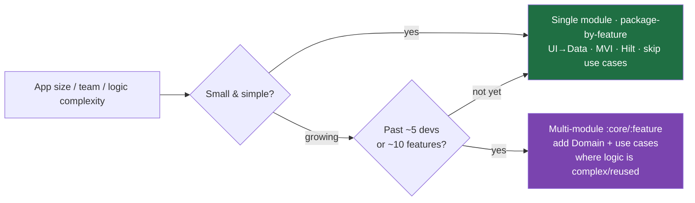
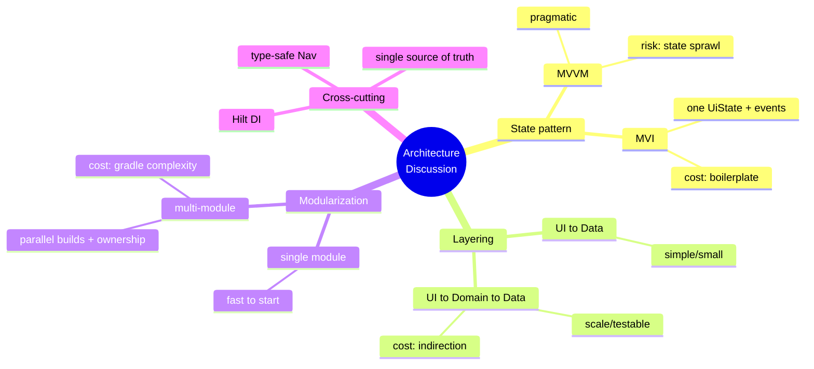

# Lesson 05 — Architecture Discussions

> After this lesson you can defend an Android architecture out loud — articulate *why* you chose MVI over MVVM, how many modules and why, when **not** to use Clean Architecture, and how to disagree with an interviewer's premise without losing the room.

**Module:** 20 · **Lesson:** 05 · **Level:** 🟢🟡🔴 · **Est. time:** 90–110 min

---

## 1. Concept

### 🟢 For beginners — *what is it and why do I care?*

An **architecture discussion** is a conversation — not a coding task, not a whiteboard design — about *how you structure an app and why*. The interviewer asks open questions: *"How do you organize a Compose app?"*, *"MVVM or MVI?"*, *"Do you use Clean Architecture?"* They're listening for whether you have **opinions backed by reasons**, not memorized buzzwords.

The difference from system design (Lesson 04): system design solves a *specific product* ("design a chat app"); architecture discussion probes your *general principles* ("how do you decide where logic lives?"). It's less about boxes-and-arrows and more about **judgment and trade-offs**.

Why you care: junior engineers cargo-cult patterns ("Clean Architecture because the blog said so"); senior engineers **choose** patterns to fit constraints and can explain the cost of each. This round is a fast, reliable seniority detector — you can't fake having shipped real architecture decisions.

### 🟡 For intermediate devs — *the mechanism*

The discussion clusters around a handful of recurring decisions, each a **trade-off, not a right answer**:

| Decision | Option A | Option B | The trade-off |
|---|---|---|---|
| **State pattern** | MVVM | MVI | discipline & consistency vs. boilerplate |
| **Layering** | UI→Domain→Data (Clean) | UI→Data (skip domain) | testability/scale vs. simplicity |
| **Modularization** | single module | multi-module | build speed/ownership vs. setup cost |
| **DI** | Hilt | manual/Koin | compile-time safety vs. flexibility |
| **Nav** | type-safe Navigation | custom | safety/standard vs. control |

The expected answer shape is always: **"It depends on X. For a small app I'd do A because…; once it grows past Y, I'd switch to B because…"** You name the **axis** (team size, app complexity, build time, testability needs) and place your recommendation *on* that axis. The course's defaults — **MVI/UDF, single source of truth, Hilt, type-safe Navigation** (Modules 03, 13) — are your baseline, but you must justify them, not assert them.

### 🔴 For senior devs — *trade-offs, edges, internals*

Senior architecture discussion is about **nuance, conviction, and knowing when *not* to apply a pattern**:

- **"It depends" must be *resolved*, not parked.** Junior: *"It depends."* (stops). Senior: *"It depends on team size and feature count. **Given** a 3-person team and one product, I'd use a single module with package-by-feature and MVI — multi-module's build-config overhead isn't worth it until builds slow or teams need ownership boundaries. **Past** ~5 engineers or ~10 features, I'd split into `:core`, `:feature:*` for parallel builds and clear ownership."* The senior **picks** after naming the axis.
- **Know when a pattern is *overkill*.** Full Clean Architecture (separate domain module, use cases for everything, mapper layers between every boundary) on a 4-screen app is **negative value** — pure ceremony, more files, slower iteration, no testability gain. The senior signal is saying *"I'd skip the domain layer here; use cases earn their keep when business logic is complex or reused across features."* Recommending heavy patterns unconditionally is a **junior tell**.
- **Defend the *cost*, not just the benefit.** Every pattern has a price: MVI adds boilerplate (the `Event`/`Effect`/reducer ceremony); multi-module adds Gradle complexity and slower clean builds; Clean adds indirection. Naming the cost *and* saying why it's worth paying (or not) is what distinguishes a real practitioner from someone reciting advantages.
- **Tie decisions to consequences you've lived.** "We used separate `isLoading`/`data`/`error` flows and shipped a UI-tearing bug, so now I standardize on one immutable `UiState`." Concrete consequence > abstract principle. Interviewers probe for *scar tissue* — decisions informed by things that broke.
- **Disagree well.** Interviewers sometimes assert a premise to test you (*"Clean Architecture is always the right call, agree?"*). The senior move is **principled disagreement**: acknowledge the merit, state the boundary, offer the trade-off — *"It's great for large, logic-heavy apps; for a small CRUD app I'd argue it's overhead and reach for a simpler layering — here's the line I'd draw."* Caving signals no conviction; bulldozing signals you can't collaborate. (Lesson 07 covers the behavioral side of disagreement.)
- **Modern Android opinions matter (2026).** Be ready on: KMP for shared logic (when it's worth it vs. not), Compose-only navigation vs. fragments (greenfield = Compose nav), Now-in-Android as a reference architecture (and where it's over-engineered for small apps), and the move toward **fewer, well-justified abstractions** with Strong Skipping and modern tooling reducing old ceremony.

### Analogy

Architecture discussion is a **city-planning debate**, not pouring concrete. The interviewer asks "grid streets or organic lanes?" There's no universally right answer — it depends on terrain, population, growth plans. A novice insists "always grids, like Manhattan." A seasoned planner says *"Grids scale and ease navigation for a large growing city; for a small hillside town, forcing a grid fights the terrain and wastes money — I'd go organic and revisit if it grows past N."* They **name the deciding factor, pick for the context, and own the trade-off** — and they can disagree with the mayor respectfully.

### Mental model

> **Every architecture answer is "it depends on \<axis\>" — then *resolve* it: pick for the context, name the cost you're paying, and know the line past which you'd switch. Heavy patterns by default is a junior tell.**

### Real-world example

Asked *"Clean Architecture — yes or no?"*, a strong candidate answers: *"For a large app with complex, reused business logic and multiple teams — yes: the domain layer and use cases pay for themselves in testability and ownership. For a small app — no: I'd collapse to UI→Data, skip use cases until logic gets complex, and avoid mapper layers that just shuffle identical fields. The deciding axis is **business-logic complexity and team scale**, and I'd rather start simple and extract a domain layer when a real need appears than pay the ceremony tax up front."* That answer — merit, boundary, deciding axis, and a *default toward simplicity* — is unmistakably senior.

---

## 2. Visual Learning

**ASCII — the answer template that scores:**
```text
   "It depends on ⟨AXIS⟩"          ← name the deciding factor (team size, complexity…)
        │
        ├─▶ FOR small/simple:  pick A   because ⟨reason⟩   (name the COST you avoid)
        │
        └─▶ ONCE it grows past ⟨threshold⟩:  switch to B  because ⟨reason⟩
                                                         (name the COST you now accept)
   close: "Default toward simplicity; add structure when a real need appears."
```

**Mermaid — choosing architecture along the complexity axis:**


**Mermaid — MVVM vs MVI vs Clean as a decision mind map:**


**Illustration prompt:**
```text
Illustration: two city planners standing at a glowing holographic table debating a city
layout. One hologram shows a small organic hillside town (labeled "small app — simple
layering"), the other a large grid metropolis (labeled "large app — modular + domain
layer"). A slider between them is labeled "complexity / team size". Speech bubbles read
"it depends on the axis" and "default to simple, add structure when needed". Modern,
warm lighting, infographic clarity, crisp labels. Caption: "Pick for the context, own the cost."
```

---

## 3. Code → Defensible Position Scripts (with traps)

> The "code" here is your **spoken position** on each common decision — scripted at three tiers of nuance, each with Explanation, the **weak answer** (labeled ❌), and best-practice phrasing.

### 🟢 Beginner — state a clear, justified default

```text
Q: "How do you structure a Compose app?"
✅ MODEL (clear default, briefly justified):
   "I use UDF: state flows down, events flow up. A ViewModel exposes one immutable
   UiState as a StateFlow; the UI collects it with collectAsStateWithLifecycle and sends
   events back. Single source of truth in a repository. For DI I use Hilt, and type-safe
   Navigation for routes. That gives me predictable state and testable layers."

Q: "MVVM or MVI?"
✅ MODEL: "Both are UDF. I lean MVI — one immutable UiState, events as a sealed type
   through one reducer, one-shot effects on a channel — because it makes illegal states
   hard to represent and keeps the screen consistent. MVVM is fine and lighter for
   simple screens; MVI's cost is some boilerplate."
```

**Explanation.** At this level you must show you **have a default and can justify it in one breath** — UDF, one `UiState`, Hilt, type-safe Nav (the course baseline). Crucially, even the beginner-tier MVI answer **names the cost** ("some boilerplate") — that one phrase signals you understand it's a trade-off, not dogma.

**Common mistakes (weak answers).**
```text
❌ "I use MVVM." (full stop — no reason, no trade-off awareness.)
❌ "Clean Architecture, always, it's best practice." (buzzword without context — the
    classic junior tell.)
❌ Naming a pattern you can't define ("MVI" but can't explain reducer/effects).
```
Asserting a pattern with no justification — or one you can't define — is the most common weak answer; interviewers immediately probe and the gap shows.

**Best practices.**
- Have a **clear default** (the course baseline) and justify it in **one sentence**.
- Even when recommending a pattern, **name its cost** — shows trade-off awareness.
- Never name a pattern you can't **define and defend** on follow-up.

---

### 🟡 Intermediate — resolve "it depends" with an axis and a threshold

```text
Q: "Single module or multi-module?"
✅ MODEL (axis + threshold + cost both ways):
   "It depends on team size and build time. For a small app and a small team, I start
   single-module with package-by-feature — multi-module's Gradle overhead and slower
   clean builds aren't worth it yet. Once we're past ~5 engineers or builds get slow, I
   split into :core (network, db, ui-kit) and :feature:* modules for parallel builds and
   clear ownership boundaries. The cost is more Gradle config and inter-module API design,
   which I accept for the build-speed and ownership wins at that scale."

Q: "Do you always need a domain layer / use cases?"
✅ MODEL: "No. Use cases earn their keep when business logic is complex or shared across
   features. For simple CRUD screens, a use case that just forwards a repository call is
   ceremony — I'd call the repository from the ViewModel directly and extract use cases
   when real logic appears. Start simple; add the layer when a need shows up."
```

**Explanation.** The intermediate skill is **resolving the trade-off**: name the **axis** (team size, build time, logic complexity), give a **concrete threshold** (~5 engineers, ~10 features), and state the **cost on both sides**. The "start simple, extract when needed" stance signals maturity — you add structure in response to *real* needs, not speculative ones.

**Common mistakes (weak answers).**
```text
❌ "It depends." (and stops — never resolves to a recommendation.)
❌ "Multi-module is better, so always multi-module." (ignores the setup cost on small apps.)
❌ A use case for every repository method, even pure pass-throughs. (Ceremony with no
    testability gain — pattern applied without judgment.)
```

**Best practices.**
- **Resolve** "it depends": name the axis, give a **threshold**, then **pick**.
- State the **cost on both sides** of the threshold, not just the benefit of your pick.
- Prefer **"start simple, extract when a real need appears"** over speculative structure.

---

### 🔴 Senior — defend, disagree, and cite scar tissue

```text
Q (premise test): "Clean Architecture is the right choice for any serious app. Agree?"
✅ MODEL (principled disagreement + boundary + lived consequence):
   "Partly. For large apps with complex, reused business logic and multiple teams, yes —
   the domain layer and use cases pay off in testability and ownership, and Now-in-Android
   is a good reference there. But 'any serious app' is too strong: I've seen full Clean
   applied to a ~4-screen app where every boundary had a mapper translating identical
   fields and every ViewModel called a use case that just forwarded to a repo. It added
   files and indirection with zero testability gain and slowed iteration. So my line is:
   the layer is justified by business-logic complexity and team scale, not by 'serious'.
   I'd start with UI→Data and extract a domain layer the moment real logic or reuse
   appears — and I'd defend that smaller design even if it's less fashionable."

Q: "Why one immutable UiState instead of separate flows?"
✅ MODEL (consequence-driven): "Because separate isLoading/data/error flows can combine
   into impossible states mid-frame — I've shipped a UI-tearing bug where the screen
   showed a spinner over stale error text because the flows updated independently. One
   immutable UiState guarantees every frame is a consistent snapshot. The cost is using
   copy() on a bigger object, which is negligible. If I truly have independent sources I
   combine() them into one before exposing."
```

**Explanation.** The senior tier shows three things at once: **principled disagreement** (acknowledge merit → state the boundary → don't cave), **a default toward simplicity** (extract structure on demand), and **scar tissue** (a specific bug that shaped the opinion). Naming a concrete consequence ("UI-tearing bug from independent flows") is far more convincing than reciting "single source of truth is good," and it proves you've *lived* the decision, not read it.

**Common mistakes (weak answers).**
```text
❌ Caving to the interviewer's premise instantly ("Yes, you're right, Clean always").
   → signals no conviction; they were testing whether you'd defend a position.
❌ Bulldozing ("Clean is always wrong, that's dogmatic"). → can't collaborate; also wrong.
❌ All-abstract, no-consequence answers ("single source of truth is a best practice")
   with nothing you've actually seen break. → reads as theoretical, not practitioner.
```

**Best practices.**
- **Disagree well**: acknowledge merit → state the boundary → offer the trade-off; don't cave, don't bulldoze.
- Default toward **simplicity**; justify *adding* structure, not removing it.
- Anchor opinions in **lived consequences** (a real bug/limit), not abstract principles.
- Treat the interviewer's strong premise as a **test of conviction**, not a command.

---

## 4. Interview Questions

> The architecture-discussion prompts themselves, with model answers.

**🟢 Beginner**

1. *"What does 'single source of truth' mean and why does it matter?"*
   > Each piece of data has exactly **one authoritative owner** (e.g. the repository/DB), and everything else reads from it rather than keeping its own copy. It matters because duplicated state **drifts out of sync** — two screens each holding their own copy of an entity will eventually disagree. One owner = no sync bugs.
2. *"What's the difference between MVVM and MVI?"*
   > Both are UDF (state down, events up). **MVVM** exposes observable state and methods — pragmatic, but state can sprawl across streams. **MVI** adds discipline: **one** immutable `UiState`, events as a sealed type through a single reducer, and one-shot effects on a separate channel. MVI trades some boilerplate for consistency and harder-to-misuse state.

**🟡 Intermediate**

3. *"When would you introduce a domain layer / use cases?"*
   > When business logic is **complex or reused across features** — then use cases centralize it, keep ViewModels thin, and are unit-testable in isolation. For simple CRUD where a use case would just forward a repository call, I skip it and call the repo from the ViewModel, extracting use cases later if real logic appears. Add the layer in response to a need, not by default.
4. *"How do you decide between single-module and multi-module?"*
   > By **team size and build time**. Single-module with package-by-feature is faster to start and fine for small teams. Once there are enough engineers to contend on one module, or clean builds get slow, I split into `:core` and `:feature:*` for **parallel builds and ownership boundaries** — accepting the added Gradle complexity as the cost.

**🔴 Senior**

5. *"An interviewer insists your design is over-engineered. How do you respond?"*
   > I'd engage the critique honestly: ask which part and why, and if they're right, agree and simplify — being able to *remove* abstraction is a senior trait. If I disagree, I'd defend with a concrete reason and a boundary: *"I added this layer because logic X is reused across three features and was previously duplicated; for a smaller scope I'd agree it's overkill."* The goal is **principled, collaborative** — neither caving without reason nor bulldozing.
6. *"How do you keep an architecture from rotting as the app and team grow?"*
   > Establish **conventions** (one `UiState` pattern, where logic lives, module boundaries) and enforce them with **lint/Detekt rules, module visibility, and code review** so they don't erode. Keep **abstractions minimal and justified** — every layer is a maintenance cost. Revisit boundaries as the team scales (extract modules when contention appears), and treat architecture as **evolving with explicit thresholds**, not a one-time decree. Document the *why* (ADRs) so new engineers don't cargo-cult or fight the structure.

---

## 5. AI Assistant

**Prompt example (architecture debate partner):**
```text
Act as a skeptical senior Android architect interviewing me. Ask me to defend my
architecture choices (MVVM vs MVI, single vs multi-module, Clean Architecture or not).
PUSH BACK on every answer — assert the opposite premise and make me defend or revise my
position. Penalize buzzwords with no trade-off, and penalize me for caving without a
reason OR bulldozing without collaboration. At the end, score my conviction, trade-off
reasoning, and ability to disagree well, at a senior level.
```

**AI workflow — where it helps on *this* topic.**
- ✅ Great for: **debate practice** (it can argue any side), surfacing trade-offs you missed, generating the "what about X?" follow-ups, helping you articulate a cost you only feel intuitively.
- ⚠️ Watch: AI tends to **recommend heavy patterns unconditionally** (full Clean Architecture, multi-module, a use case per call) without weighing the cost — the exact junior tell this lesson warns against. It also won't model the *social* dynamics of disagreeing well. Use it to rehearse positions; do a human mock for the interpersonal read.

**Review workflow — check AI's architecture advice against this lesson's *Common Mistakes*:**
- Did it recommend a pattern **unconditionally** ("always Clean", "always multi-module")? Push it to name the **axis and threshold**.
- Did it justify only the **benefit**, ignoring the **cost** (boilerplate, Gradle, indirection)? Demand the cost.
- Did it default to **maximum structure** instead of "start simple, add on need"? Challenge it.
- Does its advice match **2026 defaults** (MVI/UDF, type-safe Nav, Hilt, fewer ceremonial abstractions)?

**Validation workflow — prove your positions are real:**
1. For each position, **write the two-sided trade-off** yourself (cost A vs cost B) without AI — if you can't name the cost of your *own* choice, you don't hold it firmly.
2. **Build a tiny version both ways** for one decision (e.g. a screen with and without a use-case layer) — feeling the ceremony difference cements the judgment.
3. Read **Now-in-Android** and note where it's appropriately structured vs. where that structure would be overkill for a small app — train the "when is this overkill?" sense.
4. Do a **human mock** focused on disagreement — AI can't replicate the pressure of pushing back on an interviewer respectfully.

> **AI drafts, you decide.** AI is a tireless debate partner but a biased advisor — it loves architecture for architecture's sake. Run its recommendations through "what does this *cost*, and what's the threshold where it pays off?" — that question is the whole senior skill this round measures.

---

## Recap / Key takeaways

- Architecture discussion probes your **principles and trade-off judgment**, not a memorized design — a reliable **seniority detector**.
- Every answer is **"it depends on \<axis\>"** — then **resolve** it: name the axis, give a **threshold**, pick for the context.
- Defend the **cost**, not just the benefit; every pattern (MVI boilerplate, multi-module Gradle, Clean indirection) has a price worth naming.
- **Heavy patterns by default is a junior tell**; default toward **simplicity** and add structure when a **real need** appears.
- Anchor opinions in **lived consequences** (a real bug/limit), and **disagree well** — acknowledge merit, state the boundary, don't cave or bulldoze.
- Know the **2026 defaults** (MVI/UDF, single source of truth, Hilt, type-safe Nav) and where references like Now-in-Android are appropriate vs. overkill.

➡️ Next: **[Lesson 06 — AI-Era Android Skills](06-ai-era-android-skills.md)** — how the role is changing, what to emphasize, and how interviews now test AI judgment.
