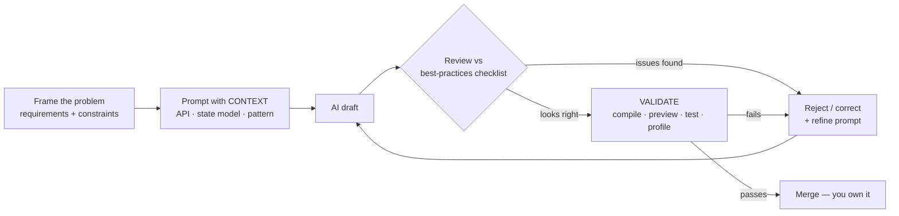
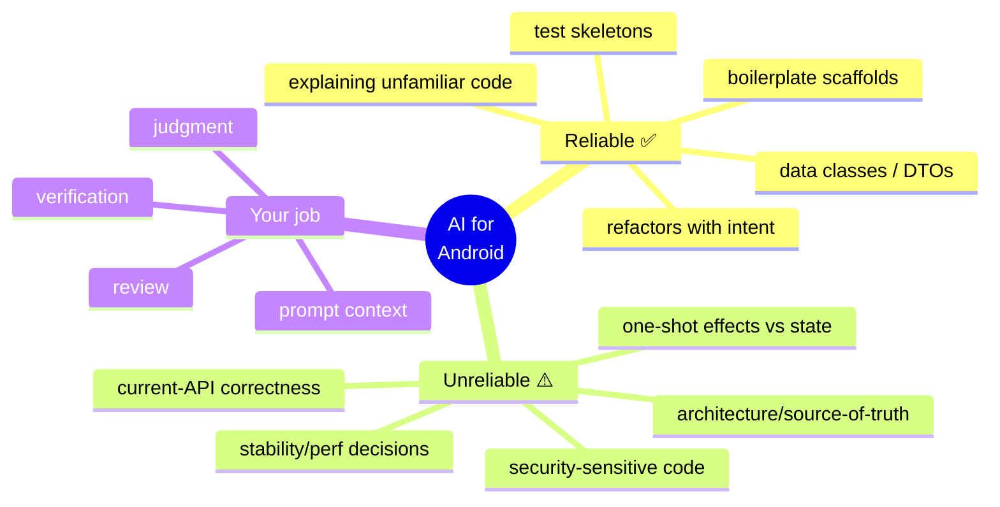

# Lesson 06 — AI-Era Android Skills

> After this lesson you can explain how AI changed the Android engineer's job and the interview itself — and position yourself for the skills that *rose* in value (judgment, review, architecture, verification) rather than the ones AI commoditized.

**Module:** 20 · **Lesson:** 06 · **Level:** 🟢🟡🔴 · **Est. time:** 75–90 min

---

## 1. Concept

### 🟢 For beginners — *what is it and why do I care?*

By 2026, AI coding assistants (Claude, ChatGPT, Gemini, Cursor, Windsurf, Copilot) write a large share of the boilerplate Android engineers used to type by hand — a Compose screen scaffold, a `ViewModel`, a Retrofit interface, a data class. This **did not** make Android engineers obsolete. It **shifted what the job is**: less typing, more **deciding** — what to build, whether the AI's output is correct, how the pieces fit, and what breaks at scale.

Interviews adapted. Some companies now **assume you use AI** and grade your **judgment**: can you explain every line the AI produced, catch its mistakes, and justify the architecture? A few run **live AI-assisted pairing** where they watch you *prompt and review*. The skills that interview well now are the ones AI *can't* do for you.

Why you care: if you walk in positioning yourself as "fast at writing Compose code," you're advertising the thing AI commoditized. Position yourself as the engineer who **directs** AI well and **verifies** its work — that's what's scarce and what gets hired.

### 🟡 For intermediate devs — *the mechanism*

Think of value as having **shifted up the stack**:

```
WHAT AI COMMODITIZED          →    WHAT ROSE IN VALUE
─────────────────────────          ────────────────────────────────
typing boilerplate                 problem framing & requirements
recalling API syntax               judgment: is this output correct?
first-draft CRUD screens           architecture & trade-off decisions
"how do I write a ViewModel"       review skill: spotting AI's mistakes
                                   verification: proving it works
                                   prompt/context engineering
```

The practical model is **"AI drafts, you decide"** (the spine of this whole course). AI is excellent at **scaffolding, boilerplate, refactors, and explaining unfamiliar code**. It's unreliable at **stability/performance decisions, current-API correctness, security, and architecture** — exactly the judgment-heavy areas every prior module flags. The engineer's new core loop: **prompt with context → review against best practices → validate (compile/test/profile) → iterate.**

Interviewers probe this by asking you to **critique AI output**, explain *why* you'd accept or reject it, and describe your verification step. "I'd just trust it" is a failing answer; "here's what I'd check and how I'd prove it" is the signal.

### 🔴 For senior devs — *trade-offs, edges, internals*

The senior framing of the AI shift:

- **AI raises the floor, not the ceiling — so the ceiling skills are what differentiate.** A junior with AI now produces *adequate* code faster, which means the *adequate* tier is commoditized. What's scarce is the senior judgment AI lacks: knowing the output recomposes too much (stability), leaks a coroutine (cancellation), exposes a SQL-injection surface (security), or picks the wrong source of truth (architecture). Interviews increasingly test the **delta between what AI gives you and what's actually correct.**
- **Review skill is the new core competency.** Reading code critically — AI-generated or human — and spotting the subtle wrong choice is *more* valuable now, not less, because the *volume* of generated code exploded. The engineers who thrive are excellent **reviewers** with a strong internal best-practices checklist (every "Common Mistakes" section in this course is that checklist).
- **Verification is non-negotiable and AI can't do it for you.** AI cannot tell you its output actually works on a Pixel in low memory, passes your Turbine test, or holds frame time under Macrobenchmark. **"It compiles" ≠ "it's correct."** Senior engineers own the proof: compile → preview → test → profile. In interviews, *describing your verification workflow* is a strong seniority signal precisely because it's the part AI doesn't cover.
- **Context/prompt engineering is a real skill with leverage.** Vague prompt → generic, often-outdated code. A senior prompt carries **target API (current Compose BOM), the state model, constraints (stability, no deprecated APIs), and the architecture pattern** — and gets dramatically better output. Knowing *what context the model needs* is itself expertise.
- **The hallucination/staleness failure mode is specific and testable.** Models confidently emit **deprecated or invented APIs** (`collectAsState` where lifecycle-aware is correct, removed Accompanist libs, made-up modifier names) and **stale patterns** (LiveData-first, `GlobalScope`). The senior habit: **verify every unfamiliar API against current docs.** Interviewers respect "I never trust an API name from the model without checking the BOM."
- **AI doesn't change the fundamentals — it raises the premium on them.** You can only review and verify what you *understand*. The reason this course teaches internals, stability, and architecture is that **judgment requires a mental model AI can't supply.** The career takeaway: deepen fundamentals *because* of AI, not despite it.

### Analogy

AI is a **power tool, and you're now the contractor, not the laborer.** A nail gun lets you frame a wall in minutes — but it also drives a nail through a pipe in seconds if you point it wrong. The valuable person on site shifted from "fast hammer-swinger" (commoditized by the tool) to the **contractor who knows where the pipes are, checks the work is to code, and signs off** (judgment, review, verification). Nobody hires you to pull the trigger; they hire you to know **where to point it and how to inspect the result.**

### Mental model

> **AI drafts, you decide.** AI raised the floor (adequate code is cheap), so your value is the ceiling: **judgment, review, and verification** — the things you can only do if you understand the fundamentals AI can't.

### Real-world example

In a 2026 live-pairing interview, a candidate is asked to add a search screen "using whatever tools you'd normally use." They prompt Claude for a Compose search screen, and it returns code using `collectAsState` and a `LaunchedEffect` that relaunches a network call on every keystroke without `flatMapLatest`. The candidate **immediately flags both**: *"It used `collectAsState` — I'll switch to `collectAsStateWithLifecycle` to avoid background collection, and this relaunches a request per keystroke and races; I'll debounce and use `flatMapLatest` to cancel the in-flight one."* They didn't write more code than the AI — they **caught what it got wrong and proved the fix**. That delta is exactly what the round measured, and it's a strong hire.

---

## 2. Visual Learning

**ASCII — value shifting up the stack:**
```text
        BEFORE AI                          AFTER AI (2026)
   ┌────────────────────┐            ┌────────────────────────────┐
   │ judgment/arch (you)│  scarce    │ JUDGMENT / ARCH / REVIEW    │ ◀ what's hired
   ├────────────────────┤            │ VERIFICATION / PROMPTING    │
   │ writing code (you) │  bulk      ├────────────────────────────┤
   ├────────────────────┤            │ writing boilerplate (AI)    │ ◀ commoditized
   │ recalling APIs(you)│            │ recalling APIs (AI)         │
   └────────────────────┘            └────────────────────────────┘
   You typed everything.            AI drafts the base; YOU decide on top.
```

**Mermaid — the modern "AI drafts, you decide" loop:**


**Mermaid — what AI is reliable vs unreliable at (mind map):**


**Illustration prompt:**
```text
Illustration: a construction site where a confident contractor (the engineer) holds a
clipboard labeled "REVIEW + VERIFY", inspecting a wall that a robot arm (labeled "AI")
just framed with a nail gun. One panel of the wall glows red where a nail pierced a pipe,
and the contractor is circling it. A floating layered diagram beside them shows value
shifting upward from "typing code" (dim, bottom) to "judgment / review / verification"
(bright, top). Modern, warm light, infographic clarity, crisp labels. Caption:
"AI frames the wall; you know where the pipes are."
```

---

## 3. Code → AI-Era Skill Drills (with traps)

> The "code" is your **operating method** for working with AI as an Android engineer, scripted at three tiers — each with Explanation, the **anti-pattern** (labeled ❌), and best-practice phrasing. These tie directly to the review/validation workflow in every other lesson.

### 🟢 Beginner — prompt with context, never trust blindly

```text
✅ A good Android prompt carries CONTEXT (vs. a bare request):

  "Write a Compose screen that shows a list of users with loading/error/empty states.
   Target: current Compose BOM + Material 3, Kotlin 2.x. Use MVI — one immutable
   UiState exposed as StateFlow, collected with collectAsStateWithLifecycle. Hoist
   state; no deprecated APIs. The ViewModel takes a UserRepository (suspend loadUsers())."

vs.

  ❌ "Write a user list screen in Compose."  → generic, often outdated, missing states.

THEN: read every line. Verify any unfamiliar API against current docs BEFORE trusting it.
```

**Explanation.** The single highest-leverage beginner habit is **front-loading context**: target API + state model + pattern + constraints. The model can only produce current, idiomatic code if you *tell it the target*. The second habit — **read every line and verify unfamiliar APIs** — is what separates "using AI" from "trusting AI." A prompt's quality largely determines the output's quality.

**Common mistakes (anti-patterns).**
```text
❌ Bare prompts ("make a screen") → generic code, frequently with deprecated APIs.
❌ Pasting AI output straight into the PR without reading it line by line.
❌ Trusting an API name because the model sounded confident (it hallucinates names).
```
Accepting unread AI output is the cardinal sin — it's how deprecated APIs, `collectAsState`, and subtle bugs land in real codebases.

**Best practices.**
- **Front-load context**: target API/BOM, state model, pattern, explicit constraints.
- **Read every line**; treat AI output as a *draft from a fast junior*, not a finished PR.
- **Verify every unfamiliar API** against current docs before you trust it.

---

### 🟡 Intermediate — review AI output against a checklist

```text
✅ Run AI Compose output through THIS checklist (the course's Common Mistakes, distilled):

  [ ] State:    remember/Saveable correct? one immutable UiState? hoisted?
  [ ] Effects:  LaunchedEffect keyed right? one-shot events NOT in state?
  [ ] Flow:     collectAsStateWithLifecycle (not collectAsState)? StateFlow vs SharedFlow?
  [ ] Coroutine: main-safe? CancellationException not swallowed? no GlobalScope?
  [ ] Stability: unstable List/lambda params? @Immutable honored?
  [ ] APIs:     anything deprecated/invented? (verify against current BOM)
  [ ] States:   loading / error / empty all handled?

  Each unchecked box = a fix BEFORE merge.
```

**Explanation.** This turns "review" from a vague vibe into a **repeatable instrument** — the same one interviewers want to see you apply. Notice every item maps to a "Common Mistakes" section from Modules 03/06/11 and Lessons 02–03 of *this* module. The intermediate skill is having this checklist **internalized** so you scan AI output (and your own) against it automatically.

**Common mistakes (anti-patterns).**
```text
❌ "Reviewing" by skimming for compile errors only → misses logic/stability/API issues.
❌ No checklist → review quality depends on mood; subtle bugs slip through.
❌ Accepting "it runs" as proof of correctness (it ran; was it right?).
```

**Best practices.**
- Review AI output against an **explicit checklist** (state/effects/flow/coroutine/stability/API/states).
- Treat **every unchecked box as a blocking fix**, not a nitpick.
- Remember **"compiles" ≠ "correct"** — the checklist catches what the compiler can't.

---

### 🔴 Production — direct, verify, and own the outcome

```text
✅ The senior AI loop you'd describe in an interview:

  1. FRAME    — define requirements + non-functional constraints yourself (AI can't).
  2. PROMPT   — full context: BOM, state model, architecture, perf/security constraints.
  3. REVIEW   — run the checklist; reject stability/security/arch mistakes; refine prompt.
  4. VERIFY   — compile → Compose preview → unit/Turbine tests → Layout Inspector
                recomposition counts → Macrobenchmark on hot paths → real-device check.
  5. OWN      — you are accountable for the merged code as if you hand-wrote it.

  Hard rules:
   - AI does NOT make stability, performance, security, or architecture decisions. You do.
   - Verify EVERY unfamiliar API against current docs. No exceptions.
   - "I'd just trust the AI" is never the answer — to an interviewer or in a real PR.
```

**Explanation.** The senior position is **ownership**: AI is a tool inside *your* engineering process, and the parts that matter most — framing, the judgment calls, and **verification** — stay with you. The explicit carve-out ("AI does not make stability/perf/security/architecture decisions") is the exact line interviewers want you to draw, because those are the areas where AI is least reliable and the cost of a wrong call is highest. Step 4's concrete verification ladder is the part AI literally cannot do for you, which is why describing it is such a strong signal.

**Common mistakes (anti-patterns).**
```text
❌ Letting AI choose the architecture/source-of-truth → it over-engineers or picks wrong.
❌ Shipping AI's security-sensitive code unreviewed (auth, crypto, SQL) → real CVEs.
❌ Skipping the profile/test step because "it looks fine" → stability/perf bugs in prod.
❌ In an interview: framing yourself as "fast coder" (AI's job) instead of "judgment +
   verification" (your job).
```

**Best practices.**
- Keep **framing, judgment, and verification** with the human; AI drafts within that frame.
- **Never** delegate stability/perf/security/architecture decisions to AI.
- Own a concrete **verification ladder** (compile → preview → test → profile → device).
- In interviews, position yourself on the **scarce** skills (review, judgment, verification), not the commoditized one (typing).

---

## 4. Interview Questions

> The AI-era questions interviewers now ask — and how to answer them as a judgment-first engineer.

**🟢 Beginner**

1. *"How do you use AI in your day-to-day Android work?"*
   > As a fast drafting tool for boilerplate, scaffolds, refactors, and explaining unfamiliar code — then I **review every line** against best practices and **verify** unfamiliar APIs against current docs. It speeds up the mechanical parts so I spend more time on design and correctness. The model is *"AI drafts, I decide."*
2. *"Has AI made Android engineers less necessary?"*
   > No — it shifted the work. It commoditized typing and API recall, but raised the value of **judgment, review, architecture, and verification** — the things AI is unreliable at. You still need an engineer who understands the system to direct the AI and catch its mistakes.

**🟡 Intermediate**

3. *"An AI gives you a Compose screen. Walk me through how you'd review it."*
   > I run it through a checklist: correct `remember`/`rememberSaveable`; one immutable `UiState`; `collectAsStateWithLifecycle` not `collectAsState`; effects keyed correctly with one-shot events *not* in state; main-safe coroutines that don't swallow `CancellationException`; stable parameter types; no deprecated/invented APIs; loading/error/empty handled. Then I **verify** — compile, preview, test, and check recomposition counts. Anything unchecked is a fix before merge.
4. *"What kinds of mistakes do AI assistants commonly make in Compose/Kotlin?"*
   > Outdated APIs (`collectAsState`, removed Accompanist, LiveData-first), one-shot events stored in `UiState`, missing `flatMapLatest`/debounce on per-keystroke work, swallowed `CancellationException`, unstable parameter types causing over-recomposition, and over-engineered architecture. Basically the "Common Mistakes" catalog — which is why I review against exactly that.

**🔴 Senior**

5. *"In a world where AI writes most boilerplate, what makes a senior Android engineer valuable?"*
   > The judgment AI lacks: deciding **what** to build and **why**, choosing the architecture and source of truth, recognizing when output recomposes too much or leaks a coroutine or exposes a security surface, and **owning verification** (it works on a real device, passes tests, holds frame time). AI raised the floor, so value moved to the ceiling — review, design, and proof. And those require deep fundamentals, which is *why* I keep investing in internals and architecture.
6. *"Where would you refuse to let AI make the decision, and why?"*
   > **Stability/performance, security, and architecture.** AI optimizes for plausible-looking code, not for whether a type is stable, whether crypto/auth is sound, or whether the source-of-truth boundary is right — and the cost of being wrong there is highest (jank, CVEs, systemic rework). I'll use AI to draft and to explain options, but the decision and the verification are mine. "I'd just trust it" on those is exactly the wrong instinct.

---

## 5. AI Assistant

**Prompt example (use AI to grade your AI-era judgment):**
```text
Act as a senior Android interviewer in 2026. Give me a Compose/Kotlin snippet that you
generated with DELIBERATE mistakes (an outdated API, a one-shot event in UiState, a
swallowed CancellationException, an unstable param). Ask me to review it as if it were a
PR — find every issue, explain why each is wrong, and tell me how I'd verify the fix.
Then score my REVIEW skill and my verification plan at a senior level. Don't reveal the
planted bugs until I've reviewed.
```

**AI workflow — where it helps on *this* topic.**
- ✅ Great for: generating flawed snippets to **practice reviewing**, drilling your verification ladder, role-playing the live-pairing interview, and helping you articulate *why* a pattern is wrong.
- ⚠️ The irony: AI is an unreliable judge of AI-era judgment because it shares the same blind spots (it may not flag its *own* `collectAsState` or stability mistakes). Use it to generate practice material and reps, but anchor your review on **this course's checklist and current docs**, not on the model's self-assessment.

**Review workflow — check the AI-collaboration itself against this lesson's *Common Mistakes*:**
- Did you **frame and constrain** the prompt, or send a bare request?
- Did you **read every line** and run the **checklist**, or skim for compile errors?
- Did you **verify unfamiliar APIs** against current docs?
- Did you keep **stability/perf/security/architecture** decisions with yourself?
- Did you **verify** (compile → preview → test → profile), not just "it runs"?

**Validation workflow — prove your judgment, not just the code:**
1. Take an AI-generated screen and **find every planted/accidental issue**; cross-check each against the relevant module's "Common Mistakes."
2. **Verify the fixes**: compile, preview, a Turbine test, and Layout Inspector recomposition counts — write down the evidence.
3. For any API the model used, **open the current BOM docs** and confirm it isn't deprecated/invented.
4. Do a **live mock pairing** with a human where you must prompt, review, and narrate verification under time pressure — the real 2026 format.

> **AI drafts, you decide.** This lesson *is* the course thesis applied to your career: AI commoditized the typing, so make yourself excellent at the parts it can't do — **judgment, review, and verification** — and present *those* as your value in every interview.

---

## Recap / Key takeaways

- AI commoditized **boilerplate and API recall**; it raised the value of **judgment, review, architecture, and verification** — value shifted **up the stack**.
- The operating model is **"AI drafts, you decide"**: prompt with context → review against a checklist → validate → own it.
- AI is reliable for **scaffolds/refactors/explanations**, unreliable for **stability, current-API correctness, security, and architecture** — never delegate those decisions.
- **Review skill** is the new core competency (volume of generated code exploded); **verification** is non-negotiable and AI can't do it for you — **"compiles" ≠ "correct."**
- Models emit **deprecated/invented APIs** and **stale patterns** confidently — **verify every unfamiliar API** against current docs.
- In interviews, position yourself on the **scarce** skills (judgment/review/verification), not the **commoditized** one (typing) — and remember judgment requires the **fundamentals** this course taught.

➡️ Next: **[Lesson 07 — Behavioral & the Offer](07-behavioral-and-the-offer.md)** — STAR stories, leveling, and negotiating the offer once the technical rounds are won.
