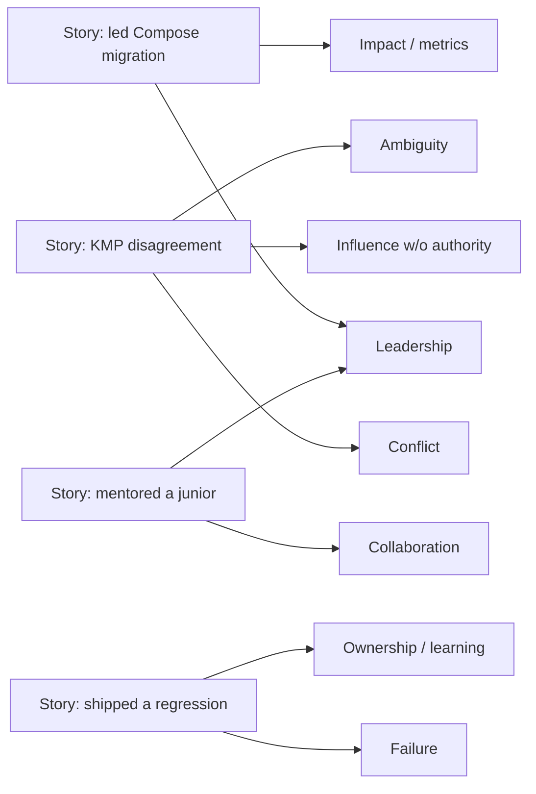
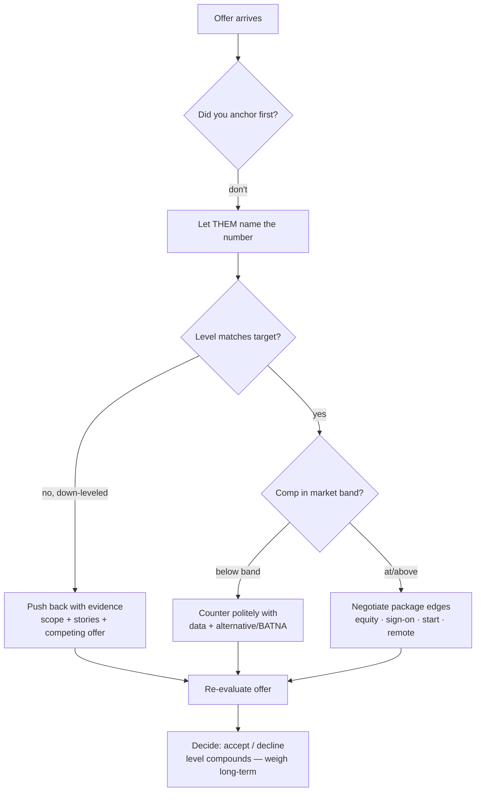

# Lesson 07 — Behavioral & the Offer

> After this lesson you can tell crisp STAR stories that signal your target level, read what behavioral rounds actually test, and negotiate an offer — comp, level, and competing bids — without leaving money or seniority on the table.

**Module:** 20 · **Lesson:** 07 · **Level:** 🟢🟡🔴 · **Est. time:** 90–110 min

---

## 1. Concept

### 🟢 For beginners — *what is it and why do I care?*

A **behavioral interview** asks about your *past experience* to predict your *future behavior*: *"Tell me about a time you disagreed with a teammate,"* *"Describe a project you're proud of,"* *"Tell me about a failure."* There's no code. The interviewer is assessing **how you work with people, handle conflict, and own outcomes** — the things that determine whether you're someone teams want around.

Then, if all rounds go well, comes **the offer**: a number, a level, a package. **Negotiation** is the (very normal, expected) conversation about that package. Most candidates leave money on the table because they're uncomfortable or assume the first offer is fixed. It usually isn't.

Why you care: strong engineers fail loops on the **behavioral** round (rambling, blaming others, no clear story) and accept **lowball offers** they could have improved with one polite email. Both are *learnable*. The behavioral round is often a **gate** — a strong "no" here can sink an otherwise-passing loop.

### 🟡 For intermediate devs — *the mechanism*

Behavioral answers have a structure: **STAR**.

```
S — Situation:  brief context. (1–2 sentences. Set the scene, don't dwell.)
T — Task:       what YOU needed to do / the problem YOU owned.
A — Action:     what YOU specifically did. (the bulk — use "I", not "we".)
R — Result:     the outcome, ideally quantified. (and what you learned.)
```

The most common failure is **all Situation, no Action/Result** — five minutes of backstory and "so it worked out." Interviewers score the **Action** (your specific contribution) and the **Result** (impact). Prepare **6–8 stories** mapped to the themes interviewers cover: *conflict, failure, leadership/influence, ambiguity, impact, learning something hard, disagreement with a decision.* One good story often covers several themes.

For **the offer**: comp is usually **base + bonus + equity + sign-on**, and the **level** sets the band. The mechanics that matter: don't anchor first (let them name a number), it's normal to negotiate, competing offers are the strongest lever, and you can negotiate **level**, not just dollars. Recruiters expect a counter — a polite, reasoned ask rarely rescinds an offer.

### 🔴 For senior devs — *trade-offs, edges, internals*

Senior behavioral and negotiation are about **scope, ownership, and leverage**:

- **Your stories must signal the target level (the leveling axis from Lesson 01).** The *same situation* told at different scopes reads as different levels. Mid: *"I fixed the flaky test."* Senior: *"I noticed our flaky tests were eroding trust in CI, **drove** a team agreement on a quarantine policy, and **owned** reducing flake rate from 8% to under 1%."* Senior+ stories show **identifying** the problem, **influencing** without authority, **deciding** under ambiguity, and **owning** an outcome that mattered beyond your own tasks. If every story is "I implemented the ticket," you cap at mid regardless of technical skill.
- **"We" vs "I" is a real signal.** Teams matter, but the behavioral round grades *your* contribution. Over-using "we" hides your impact (sounds like you rode along); over-using "I" on team wins sounds like credit-stealing. The senior calibration: *"we" for the goal, "I" for my specific actions* — *"The team needed to cut crash rate; I led the migration of the checkout flow and set up the crash-monitoring dashboards."*
- **Failure and conflict stories are where seniority shows most.** A good failure story shows **ownership and learning**, not blame-shifting or a humble-brag ("I work too hard"). A good conflict story shows you **disagreed respectfully, engaged with the other view, and reached a good outcome** — ideally *"I disagreed, committed when overruled, and the data later informed a change."* These prove you're safe to give scope to.
- **Negotiation leverage is information + alternatives.** The strongest position is a **competing offer** (or a credible BATNA — your best alternative). Beyond that: **comp data** for the level/market (know the band — Lesson 01 had you ask the recruiter), and a clear sense of **what you'll walk for**. Negotiate the **whole package** (level, base, equity, sign-on, start date, remote terms), and remember **level compounds** — a one-band bump outweighs a sign-on bonus over a career. Be collaborative, not adversarial: the recruiter is your **advocate to the committee**, not your opponent.
- **Down-leveling is the negotiation most candidates miss.** If the offer comes in a band below target, that's negotiable with **evidence** (scope of past work, the stories that show staff-level impact, a competing offer at the higher level). Accepting a down-level "to get in the door" can cost years and significant comp; push back with data before accepting.
- **The recruiter relationship is strategic.** They want you to accept (it's their job); they'll coach you on what the committee needs and often advocate for more if you give them ammunition (a competing offer, a clear gap to your number). Treat them as a partner, share your constraints honestly, and never bluff a competing offer you don't have — it can collapse trust and the deal.

### Analogy

A behavioral interview is a **reference check you give about yourself**, and STAR is the **format that makes your evidence admissible.** A rambling, all-context answer is a witness who never gets to the point — the jury (interviewer) can't score it. STAR is structured testimony: *here's the scene (brief), here's what was mine to solve, here's exactly what I did, here's the verdict (result).* Negotiation, then, is the **closing** — you've proven your value; now you agree on the price, and the side with the better **alternative** (a competing offer) and the better **information** (the comp band) sets the terms.

### Mental model

> **Behavioral: tell STAR stories where the Action is *yours* and the scope matches your target level. Offer: never anchor first, negotiate the whole package (level compounds), and your leverage is your alternative + your information.**

### Real-world example

A staff candidate is asked *"Tell me about a conflict."* They give a tight STAR: *(S)* two teams disagreed on whether to adopt KMP; *(T)* as the senior Android voice, they had to drive a decision without authority over the other team; *(A)* they ran a spike comparing real shared-logic savings vs. build-complexity cost, **wrote an ADR**, and facilitated a decision meeting where they **disagreed-and-committed** to a scoped pilot rather than a full rewrite; *(R)* the pilot shipped, validated the trade-off, and became the template for future shared modules. That story signals **influence without authority, decision-making under ambiguity, and owned impact** — staff-level scope. At offer time, a competing bid one level up let them negotiate both **level and base** upward. Technical skill got them to the offer; *these* skills set its size.

---

## 2. Visual Learning

**ASCII — the STAR shape (where the weight goes):**
```text
   S ─┐  brief context        (10%)  ──▶ don't dwell here
   T ─┤  the problem you owned (15%)
   A ─┤  WHAT YOU DID          (55%)  ──▶ the bulk; use "I"; specific actions
   R ─┘  outcome + learning    (20%)  ──▶ quantify if you can
   ❌ common failure: 80% Situation, "and it worked out" → no scored Action/Result
```

**Mermaid — mapping few stories to many themes:**


**Mermaid — the negotiation decision flow:**


**Illustration prompt:**
```text
Illustration: a courtroom-meets-boardroom scene. On the left, an engineer at a witness
stand labeled "STAR testimony" with four glowing evidence cards stacked S, T, A, R — the
"A" card is biggest and brightest. On the right, a negotiation table where the same
engineer slides a folder labeled "competing offer + comp data" across to a friendly
recruiter; a balance scale above them weighs "level" heavier than a small "sign-on bonus"
coin. Modern, warm light, infographic clarity, crisp labels. Caption: "Prove the value,
then set the price."
```

---

## 3. Code → Story Scripts & Negotiation Scripts (with traps)

> The "code" here is **scripts**: STAR story templates and word-for-word negotiation lines, at three tiers — each with Explanation, the **weak version** (labeled ❌), and best-practice phrasing.

### 🟢 Beginner — a STAR story skeleton you can fill in

```text
✅ STAR TEMPLATE (fill with a real story, rehearse out loud):

  S (1–2 sentences): "On my team's [app], we had [problem/context]."
  T:                 "I was responsible for [your specific task/goal]."
  A (the bulk, "I"): "I [action 1]. Then I [action 2]. I also [action 3]."
  R (quantify):      "As a result, [outcome + metric]. I learned [takeaway]."

EXAMPLE (proud project):
  S: "Our checkout screen was still in XML and crashed often."
  T: "I was asked to lead its migration to Compose."
  A: "I designed the MVI state model, migrated the screens incrementally behind a flag,
      and added crash monitoring so we could catch regressions early."
  R: "Crash rate on checkout dropped ~30%, and the new screens shipped on time. I learned
      to migrate behind flags rather than big-bang."
```

**Explanation.** The template forces the four parts and — critically — keeps **S short** and **A long and first-person**. Rehearsing **out loud** is non-negotiable: a story that reads fine on paper rambles when spoken under pressure. Quantifying the **R** ("~30%") turns a claim into evidence.

**Common mistakes (weak versions).**
```text
❌ All Situation: 4 minutes of backstory, then "...and it worked out." (No scored Action.)
❌ "We migrated the screen and we added monitoring." (All "we" — your role is invisible.)
❌ No result, or a vague one: "and it was better." (Quantify, or at least state the
    concrete outcome.)
```
Over-investing in Situation and under-delivering on Action is the #1 behavioral failure — the interviewer scores what *you* did, and you never get there.

**Best practices.**
- Keep **S brief**; spend most of the answer on **A** in the **first person ("I")**.
- **Quantify the R** where possible; always end with the outcome and a takeaway.
- **Rehearse aloud** — spoken stories surface rambling that written ones hide.

---

### 🟡 Intermediate — map stories to themes and calibrate "I" vs "we"

```text
✅ Build a STORY BANK (6–8 stories) tagged by theme, so any prompt has a ready answer:

  STORY                         THEMES IT COVERS
  ────────────────────────────  ──────────────────────────────────────
  Led Compose migration         leadership, impact, technical depth
  Disagreed on KMP adoption     conflict, influence-without-authority, ambiguity
  Shipped a bad regression      failure, ownership, learning
  Mentored a struggling junior  collaboration, leadership, empathy
  Hit an impossible deadline    prioritization, communication, ambiguity

✅ "I" vs "we" calibration:
  "WE needed to cut crash rate (the goal); I led the checkout migration and set up the
   monitoring (my specific actions)."  ← goal in 'we', actions in 'I'
```

**Explanation.** A **story bank** means you're never caught flat — most prompts map to a story you've already rehearsed, and **one story covers several themes** (the KMP story = conflict *and* influence *and* ambiguity). The **"we for the goal, I for the actions"** rule resolves the credit problem: you honor the team without erasing your contribution, which is exactly the calibration interviewers listen for.

**Common mistakes (weak versions).**
```text
❌ Inventing a story on the spot for each question → inconsistent, often rambling.
❌ Only "I" on a team achievement → reads as credit-stealing / poor collaborator.
❌ Only "we" throughout → your individual impact (what's being graded) disappears.
❌ A different story for every theme → you run out; reuse strong stories across themes.
```

**Best practices.**
- Prepare a **bank of 6–8 stories tagged by theme**; reuse strong ones across prompts.
- Calibrate pronouns: **"we" for the shared goal, "I" for your specific actions.**
- Pick stories that let you show **scope at your target level**, not just task completion.

---

### 🔴 Senior — level-signaling stories + negotiation scripts

```text
✅ SAME situation, leveled UP (signal scope/ownership/influence):

  MID:    "I fixed our flaky tests."
  SENIOR: "I saw flaky tests were eroding trust in CI across the team, drove a
           quarantine-policy agreement, and owned cutting flake rate from 8% to <1%."
           → identifies problem · influences without authority · owns measurable outcome

✅ NEGOTIATION SCRIPTS (polite, reasoned, collaborative):

  Don't anchor first:
    Recruiter: "What are your comp expectations?"
    You: "I'm focused on finding the right fit and trust you'll make a competitive offer
          for the level. What range do you have in mind for this role?"

  Counter on comp (with data/alternative):
    "Thank you — I'm excited about the team. Based on my experience and the market for
     this level (and a competing offer at $X), I was hoping we could get the base closer
     to $Y. Is there flexibility there?"

  Push back on a down-level:
    "I appreciate the offer. Given that I've [owned X end-to-end / led Y across teams],
     the scope maps to [target level]. Could we revisit the leveling? I'm happy to walk
     through the evidence."

  Competing-offer leverage (only if TRUE):
    "I have another offer at [level/comp] and a deadline of [date], but you're my top
     choice. If we can close the gap on [level/base], I'd accept here."
```

**Explanation.** Two senior skills converge here. First, **leveling your stories**: the contrast shows that the *same work* told with **problem-identification + influence + owned outcome** reads a full band higher — this is the single biggest lever on your offered level. Second, **negotiation scripts** that are *collaborative, evidence-backed, and honest*: don't anchor, counter with **data + a real alternative**, explicitly negotiate **level** (which compounds), and **never bluff** a competing offer. The recruiter is positioned as an ally you give ammunition to, not an adversary.

**Common mistakes (weak versions).**
```text
❌ Accepting the first offer immediately ("Yes! Thank you!") → leaves comp/level on table.
❌ Anchoring first with a low number → caps the whole negotiation below the band.
❌ Bluffing a competing offer you don't have → if called, trust and the deal can collapse.
❌ Negotiating ONLY base, ignoring level → a band bump compounds far more over time.
❌ Adversarial tone ("match it or I walk") → recruiter is your advocate; don't burn them.
❌ Telling only task-completion stories → caps your level regardless of technical skill.
```

**Best practices.**
- Tell stories at **target-level scope**: *identify → influence → decide → own*, with a measurable result.
- **Don't anchor first**; counter with **comp data + a real alternative (BATNA)**; never bluff.
- Negotiate the **whole package and the level** — **level compounds** over a career.
- Keep it **collaborative**: the recruiter advocates for you to the committee; give them ammunition.

---

## 4. Interview Questions

> Real behavioral prompts (with model STAR answers) plus the negotiation questions you'll face.

**🟢 Beginner**

1. *"Tell me about a project you're proud of."*
   > A tight STAR: brief context, the goal you owned, the **specific actions you took**, and the **measurable outcome** plus what you learned. e.g. *"Our checkout was crash-prone XML; I was asked to lead the Compose migration; I designed the MVI state, migrated behind a feature flag, and added crash monitoring; crash rate dropped ~30% and we shipped on time — I learned to migrate incrementally, not big-bang."* Keep Situation short, spend the time on **Action**.
2. *"Why are you looking to leave your current role?"*
   > Frame it **forward and positive**: what you're moving *toward* (more ownership, a product domain, scale), not bashing your current employer. *"I've grown a lot here, and I'm looking for a senior role where I can own a product area end-to-end and work on \<X\> — which this role offers."* Negativity about a past employer is a red flag.

**🟡 Intermediate**

3. *"Tell me about a time you failed."*
   > Pick a **real** failure, own it, and show what you changed. *"I shipped a state-management change that caused a UI-tearing regression because I used separate flows; I owned the rollback, root-caused it, and afterward standardized our screens on one immutable `UiState`."* The signal is **ownership + learning**, not blame-shifting or a fake weakness ("I just care too much").
4. *"Tell me about a disagreement with a teammate."*
   > Show **respectful disagreement reaching a good outcome**. *"A teammate wanted a full KMP rewrite; I thought the cost outweighed the benefit at our scale. I ran a spike, wrote up the trade-offs, and we agreed on a scoped pilot instead. It validated the approach without a risky rewrite."* The signal is *engaged the other view, used evidence, collaborated* — and ideally **disagree-and-commit** if you were overruled.

**🔴 Senior**

5. *"Describe a time you drove a decision without having authority."*
   > A staff-signal story: you **identified** an issue beyond your remit, **built alignment** through evidence (a spike, an ADR, data), **facilitated** a decision, and **owned** the outcome. *"Flaky tests were eroding CI trust across teams; I had no mandate, so I gathered the flake data, proposed a quarantine policy, socialized it, and drove flake rate under 1%."* Influence-without-authority + ownership = senior+ scope.
6. *"You receive an offer one level below your target. What do you do?"*
   > I don't accept reflexively — down-leveling is costly and negotiable. I'd thank them, then **make the case with evidence**: the scope of work I've owned, the stories that demonstrate target-level impact, and (if I have one) a competing offer at the higher level. *"The scope of what I've owned maps to \<level\>; can we revisit the leveling? I'm happy to walk through specifics."* I'd weigh that **level compounds** over a career before deciding — and keep the tone collaborative, since the recruiter can advocate for the re-level if I arm them with the evidence.

---

## 5. AI Assistant

**Prompt example (STAR coach + mock negotiator):**
```text
Act as a behavioral interview coach for a SENIOR Android role. First, ask me three
behavioral questions (conflict, failure, influence-without-authority). After each STAR
answer, score it: is the Situation too long? Is the Action specific and first-person? Is
the Result quantified? Does the SCOPE signal senior level (problem-identification +
influence + ownership) or just task completion? Rewrite my weakest answer to level it up.
Then role-play a recruiter making me a lowball offer one band below target, and coach my
negotiation — flag if I anchor first, bluff, or ignore leveling.
```

**AI workflow — where it helps on *this* topic.**
- ✅ Great for: drilling STAR structure, **rewriting your stories to signal higher scope**, generating behavioral prompts, role-playing the recruiter/negotiation, and pressure-testing whether your "I" vs "we" balance lands.
- ⚠️ Not for: inventing experiences (stories must be **true and yours**), or knowing the **real comp band** for a specific company/level (use levels data, the recruiter, and your network). AI can structure and sharpen your real material; it can't supply the substance or the market truth.

**Review workflow — check your stories/negotiation against this lesson's *Common Mistakes*:**
- Is the **Situation short** and the **Action long, specific, first-person**? Is the **Result quantified**?
- Does the **scope match your target level** (identify → influence → own), or is it task-completion?
- Pronouns calibrated — **"we" for the goal, "I" for actions** (not all-"we", not credit-stealing)?
- On the offer: did you avoid **anchoring first**, counter with **data + a real alternative**, and negotiate **level** — without **bluffing**?

**Validation workflow — prove you're ready:**
1. **Record yourself** answering 5 behavioral prompts; play it back — count seconds of Situation vs Action. Trim the backstory.
2. Have the AI (then a **human**) score each story for **level scope**; rewrite any that read mid-level.
3. **Look up the real comp band** (levels data + recruiter + peers) for the target level *before* negotiating — don't walk in blind.
4. **Run a live mock negotiation** with a person; AI can't replicate the discomfort that makes people cave or anchor too low.

> **AI drafts, you decide.** AI is a superb story editor and negotiation sparring partner — but the experiences must be **true**, the scope must be **yours to claim**, and the comp data must be **real**. Use it to sharpen and rehearse; never to fabricate.

---

## Recap / Key takeaways

- Behavioral rounds predict future behavior from past behavior; answer in **STAR** with a **short Situation** and a **long, first-person Action** + a **quantified Result**.
- Build a **bank of 6–8 true stories tagged by theme**; one strong story covers several prompts.
- **Scope signals level**: the same work told with **problem-identification + influence + ownership** reads a band higher — task-completion stories cap you at mid.
- Calibrate pronouns: **"we" for the goal, "I" for your actions**; **failure/conflict** stories should show **ownership and learning**, not blame.
- On the offer: **don't anchor first**, negotiate the **whole package and the level** (**level compounds**), and your leverage is your **alternative + your information** — **never bluff**.
- The recruiter is your **advocate to the committee** — be collaborative and give them ammunition (a real competing offer, a clear gap to your number).

---

🎓 **That's the module — and the course.** You've gone from "what is state?" to walking into a senior Android loop ready: roadmap, question banks, system design, architecture conviction, AI-era judgment, and the behavioral + negotiation game.

➡️ **Next steps:**
- Back to the module hub: **[Module 20 — Career & Interview Preparation](README.md)**
- Consolidate everything: **[Interview Prep Deliverable](../../deliverables/interview-prep/README.md)** — the cross-module question bank and prep guide.
- Test yourself: **[Final Assessment](../../deliverables/final-assessment.md)** and the **[Certification Exam](../../deliverables/certification-exam.md)**.

Go get the offer. 🚀
